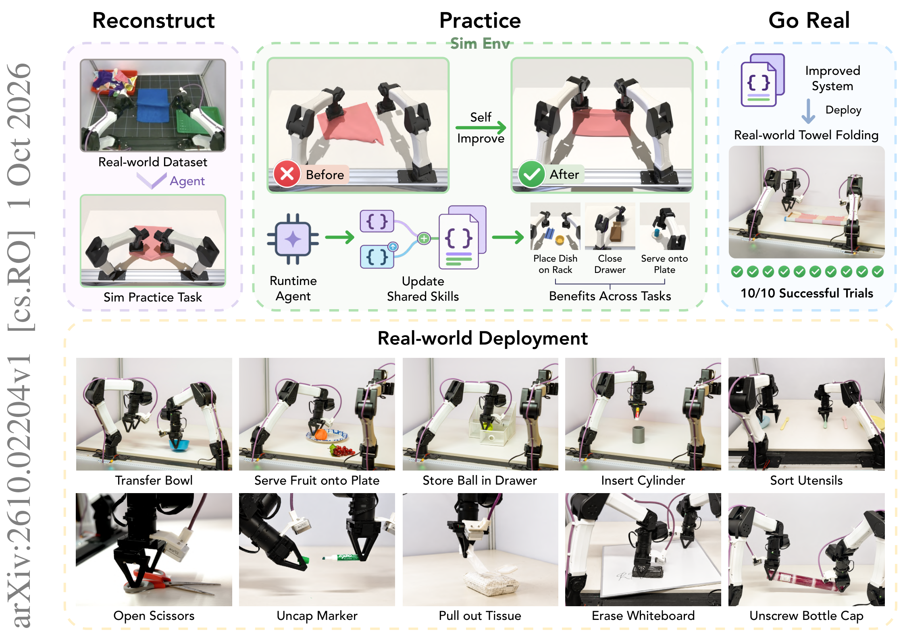
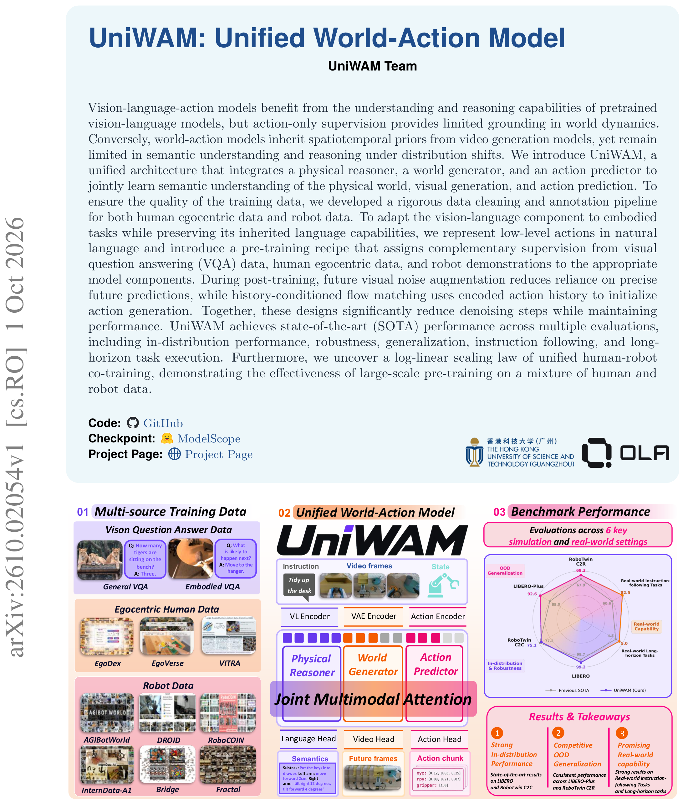
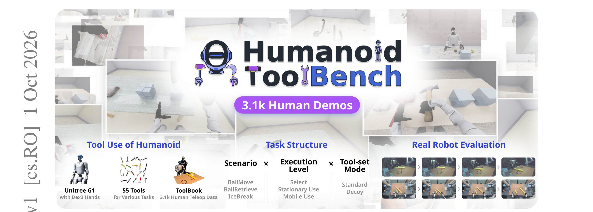
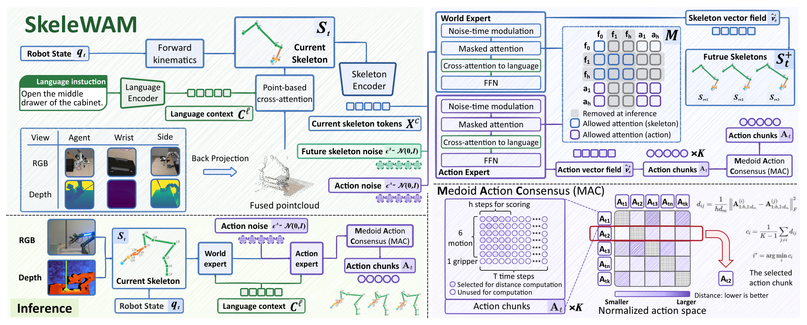
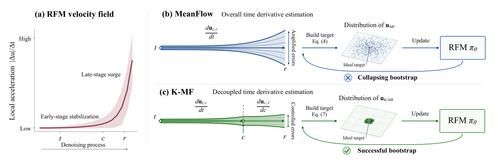

# 2026-10-02 Embodied AI & World Models Daily

> 面向具身智能 / Robotics 研究员与工程师的研究与工程资讯。
>
> 检索窗口：主窗口 2026-10-02 00:00–23:59（北京时间）；补充窗口回溯至 2026-09-30 00:00。arXiv 归属一律以实际提交时间（换算北京时间）为准，已逐条打开 abs 页核实；公告日期 ≠ 提交日期，周末积压导致部分 10-02 公告条目实际提交于 09-30/10-01，均已在补充窗口筛选记录中标注。

## 🔥 今日必读

### 1. 【模仿学习与策略】RPG：不更新权重、靠自主练习把成功率从 28.6% 练到 95.0%

**来源：** [arXiv:2610.02204v1](https://arxiv.org/abs/2610.02204)（cs.RO / cs.AI / eess.SY；UC Berkeley · Haozhi Qi 组，Pieter Abbeel 挂名）  
**类型：** Paper（research_paper）  
**发布时间：** 2026-10-02 01:59（北京时间，v1 提交 2026-10-01 17:59 UTC）  
**评分：** 87/100  
**关键词：** Self-Improvement · Skill Library · System Prompt · Sim Practice

**一句话：**  
提出 Reconstruct, Practice, Go Real（RPG）框架：在**不更新模型权重**的前提下，让机器人从离线数据里挖掘技能、在仿真中自主练习、用执行反馈诊断失败并修订 system prompt 与符号技能库，多轮迭代后由多模态 LLM 调度感知与控制。

**技术要点：**

- 核心闭环：离线数据定位能力 → 仿真中构建练习任务 → 练习中结合执行反馈 / 特权仿真状态 / 数据集视频做失败诊断 → 生成或改进可复用符号技能 + 更新 system prompt → 跨任务评估决定候选修订是否保留（单条与组合都查）。
- 测试时仅靠「system prompt + 技能库 + 多模态 LLM」协调感知与控制，权重全程冻结——这是与 gradient-based self-improvement 路线的关键不同。
- 关键实验：22 个操作任务上，held-out 初始状态下成功率从第 1 轮练习的 **28.6%** 升至第 15 轮的 **95.0%**，超过 ASPIRE（75.5%）与 GPT-6 Astra Pro 驱动的 CaP-Agent0（60.0%）；经统一标定与硬件适配后，冻结系统在 3 个任务 ×10 次的 **30 次真机试验全部成功**。

**为什么值得关注：**  
RPG 把「self-improvement」从梯度更新搬到了 prompt 与技能库层面，迭代成本远低于重训。对做部署侧持续改进的工程师，这是一条可直接借用的路线：失败诊断 → 符号技能修订 → 门控评估，每个环节都可审计。

**资源：**

- Paper：[arXiv 摘要页](https://arxiv.org/abs/2610.02204)
- Project：[项目页](https://rpg-robot.github.io/)
- Code：未找到可确认的公开代码仓库（项目页未见 code 链接，截至发稿）
- Weights：无（框架不涉及新权重发布）
- Discussion：暂未发现高质量社区讨论

---

### 2. 【VLA与基础模型】UniWAM：把物理推理器、世界生成器、动作预测器塞进一个 MoT

**来源：** [arXiv:2610.02054v1](https://arxiv.org/abs/2610.02054)（cs.RO；16 位作者）  
**类型：** Paper + Open Source（权重已发 ModelScope）  
**发布时间：** 2026-10-02 01:01（北京时间，v1 提交 2026-10-01 17:01 UTC）  
**评分：** 82/100  
**关键词：** World-Action Model · Mixture-of-Transformers · Human-Robot Co-training · Scaling Law

**一句话：**  
统一世界-动作模型：三个专家（物理推理器 / 世界生成器 / 动作预测器）共享联合多模态注意力，把 VLA 的语义推理与 WAM 的时空动态 grounding 在一个架构里联合训练，并给出人-机器人共训的 log-linear scaling law。

**技术要点：**

- 出发点：VLA 只有动作监督、对世界动态 grounding 不足；WAM 有视频生成先验、但分布偏移下语义与推理弱。UniWAM 用互补监督弥合：VQA 数据 + 自我中心人类数据 + 机器人演示分别承担语义、动态、动作三路信号。
- 低层动作以自然语言编码（physical-language grounding）；post-training 用「未来视觉噪声增广 + 历史条件化 flow matching」初始化，减少去噪步数。
- 关键结果：作者报告在分布内性能、鲁棒性、泛化、指令遵循、长时程任务上达到 SOTA；仓库发布 `UniWAM-base` 与 `UniWAM-robotwin-clean`（ModelScope）+ Wan2.2-TI2V-5B / Qwen3-VL-2B 骨干（HuggingFace），评测基于 RoboTwin 2.0 clean 子集与 LIBERO/LIBERO-Plus。
- 注意边界：README 明确 Bridge、DROID、Fractal 与真机推理「intentionally out of scope」，当前开源范围是代码 + 两个 checkpoint。

**为什么值得关注：**  
「VLA + WAM 融合」是本周最密集的方向（今日雷达里还有 SkeleWAM / SplineWAM / Magic-W0 / Dream4ACT），UniWAM 是其中开源证据最完整的一个：架构 + 权重 + 数据配比（egocentric 34.3% / UMI 11.5% / 真机 32.1% / 仿真 22.2% 的配比思路见 Magic-W0 同类工作）可直接复用。

**资源：**

- Paper：[arXiv 摘要页](https://arxiv.org/abs/2610.02054)
- Project：未找到独立项目页（官方仓库为主要入口）
- Code：[GitHub](https://github.com/UniWAM/UniWAM)（Apache-2.0，34 commits）
- Weights：[ModelScope UniWAM-base / UniWAM-robotwin-clean](https://github.com/UniWAM/UniWAM)（经 README 链接）、[Hugging Face 骨干](https://github.com/UniWAM/UniWAM)
- Discussion：暂未发现高质量社区讨论

---

### 3. 【数据与Benchmark】HumanoidToolBench：18 任务量化「选对工具」与「完成任务」之间的鸿沟

**来源：** [arXiv:2610.02089v1](https://arxiv.org/abs/2610.02089)（cs.RO / cs.AI；SNU · UMass Amherst · Google Research）  
**类型：** Benchmark + Dataset（research_paper）  
**发布时间：** 2026-10-02 01:21（北京时间，v1 提交 2026-10-01 17:21 UTC）  
**评分：** 83/100  
**关键词：** Humanoid · Tool Use · Benchmark · Unitree G1 · LeRobot

**一句话：**  
首个把「工具选择 → 静止使用 → 移动执行」三级能力放在同一个人形平台上联合评测的 benchmark：18 任务 / 3 场景 / 2 工具集模式 + 3.1k 演示数据集 ToolBook，直接量化出移动操作（L2）是当前人形策略的最大短板。

**技术要点：**

- 设计：3 场景（BallMove / BallRetrieve / IceBreak）× 3 执行层级（L0 选取举起 / L1 原地使用 / L2 移动中使用）× 标准与诱饵（decoy，外观相似但关键属性错误）两种工具集 = 18 任务；机器人为 Unitree G1（29 体关节 + 双 7 关节 Dex3 手），MuJoCo 仿真 + 真机，腿部由 GR00T Balance/Walk 控制器驱动。
- ToolBook：3,094 条人类演示（8 名遥操作者，Meta Quest），LeRobot 格式，CC BY-NC 4.0。
- 关键发现：移动是硬伤——FastWAM 在 BallMove 上从 L1 的 76% 跌到 L2 的 **9%**；「够得着 ≠ 选得对」——π0.5 从 98.8% 的候选接触率到只有 44.2% 的正确工具抓起；指令 grounding 弱——换成无关指令后 84% 的 rollout 仍会砸冰（原文 77%）。真机（每任务 10 次）：GR00T N1.7 在 BallMove 标准 6/10、诱饵 4/10，ACT 最高 2/10。
- 论文明示局限：每策略单次训练；真机只覆盖 3 个策略 × 2 个 L1 场景；「首次接触」只是工具选择的代理指标。

**为什么值得关注：**  
它把「人形工具使用」从 demo 视频变成了可度量的三级阶梯，且数据集与诱饵工具集设计可直接迁移到自家评测。L2 移动执行的 9% 是一个明确的科研空白信号——做 locomotion + manipulation 融合的人应该看。

**资源：**

- Paper：[arXiv 摘要页](https://arxiv.org/abs/2610.02089)
- Project：[项目页](https://snu-pi.github.io/HumanoidToolBench/)
- Code：项目页标注 paper coming soon，未找到可确认的公开代码仓库（评测代码待放出）
- Weights：无
- Discussion：暂未发现高质量社区讨论

---

### 4. 【强化学习】InterEvolve：测试时演化 reward program，解锁被人类奖励设计浪费的控制器能力

**来源：** [arXiv:2610.02196v1](https://arxiv.org/abs/2610.02196)（cs.RO / cs.CV / cs.GR；UIUC · Liang-Yan Gui / Yu-Xiong Wang）  
**类型：** Paper（research_paper）  
**发布时间：** 2026-10-02 01:59（北京时间，v1 提交 2026-10-01 17:59 UTC）  
**评分：** 79/100  
**关键词：** Test-Time Evolution · Reward Program · Humanoid Loco-Manipulation · Unitree G1

**一句话：**  
不重训控制器，在测试时用「reward program（分段奖励 + 完成条件 + 可调常数）」作为规划-控制的接口：LLM agent 依据执行反馈修订程序结构，数值优化器调常数，并行仿真验证候选，演化出的技能可直接在真机 Unitree G1 上靠自我中心 onboard 感知自主运行。

**技术要点：**

- 两部件：object-aware forward-backward 行为基础模型（在冻结 body prior 上以 object residual 把 body/object 奖励转成 loco-manipulation 行为）+ reward program 任务规约；LLM 修结构、优化器调常数、并行多场景验证。
- 关键观察：人工设计的奖励只激发了模型能力的一小部分，演化出的程序能解锁未用能力、有时给出人类没想到的新策略；覆盖多任务、复杂场景、长时程组合（仿真）+ 真机 G1 自主执行。
- 与 RPG 互补：RPG 改 system prompt 与符号技能（模仿侧），InterEvolve 改奖励程序（RL/规划侧），都不动模型权重——「test-time / weight-frozen 自我改进」正在成为一条清晰的技术路线。

**为什么值得关注：**  
做 RL for humanoid 的人常苦于奖励设计；这篇给出「奖励即程序、程序可演化」的可操作框架，且接口设计（expressive 到能表达 contact-rich 多阶段交互、measurable 到执行反馈能反哺规划）值得单独借鉴。

**资源：**

- Paper：[arXiv 摘要页](https://arxiv.org/abs/2610.02196)
- Project：[项目页](https://sirui-xu.github.io/InterEvolve)
- Code：未找到可确认的公开代码仓库（项目页未见 code 链接，截至发稿）
- Weights：无
- Discussion：暂未发现高质量社区讨论

---

### 5. 【VLA与基础模型】SkeleWAM：用稀疏 3D 骨架当世界状态，57.1M 参数做到 LIBERO-Plus 85.9%

**来源：** [arXiv:2610.02120v1](https://arxiv.org/abs/2610.02120)（cs.RO；北京大学 · Mengyuan Liu 组）  
**类型：** Paper（research_paper）  
**发布时间：** 2026-10-02 01:35（北京时间，v1 提交 2026-10-01 17:35 UTC）  
**评分：** 75/100  
**关键词：** World-Action Model · Skeleton Representation · Parameter Efficiency · RGB-D

**一句话：**  
现有 WAM 预测视频或视觉 latent，几何只是隐式信息、还夹带与控制无关的外观；SkeleWAM 改用「机器人关节 + 物体中心 + 交互点」组成的稀疏 3D 骨架作为统一几何状态，在线从 RGB-D + 本体感知构建，未来骨架预测只作训练期几何监督、推理时整个未来预测分支直接砍掉。

**技术要点：**

- 骨架在线构建：RGB-D 物体 landmark + 前向运动学关节，统一到 robot-centric 坐标系；动作生成与未来骨架预测联合 flow matching 训练（条件：当前骨架 + 语言指令）。
- 推理：Medoid Action Consensus（MAC）从随机动作样本中选代表 chunk，执行前缀、更新骨架、循环；不需要未来视觉重建，也不需要特权仿真状态。
- 关键结果：LIBERO-Plus 总体 **85.9%（57.1M 参数）**，超 Cosmos-Policy 3.7pt；骨架监督消融 80.1% → 85.9%；相机扰动类 93.4%；真机 ARX R5（外部 + 腕部 RealSense）5 任务平均 **89%**（Cosmos-Policy 87%、Fast-WAM 83%）。
- 明示弱点：layout 泛化 66.6%，低于 π0.5 的 84.1%——稀疏骨架丢了场景布局信息。

**为什么值得关注：**  
在 WAM 普遍越做越大的背景下，这是一条「显式几何 + 极小参数量」的反向路线：57.1M 参数、无需视觉重建、真机可跑。做端侧部署与参数敏感项目的人应该认真对比。

**资源：**

- Paper：[arXiv 摘要页](https://arxiv.org/abs/2610.02120)
- Project：[项目页](https://skelewam-project.github.io/)
- Code：项目页仅有 manuscript PDF 与 BibTeX，未找到可确认的公开代码仓库
- Weights：无
- Discussion：暂未发现高质量社区讨论

---

## 📄 论文雷达

> 以下 6 篇按双评分均分降序排列。全部经 abs 页核实实际提交时间，均落在补充窗口（2026-09-30 / 10-01 北京时间）。

### 【端侧部署】Kinematic MeanFlow（K-MF）：一步动作生成，GR00T-N1.6 动作头延迟降 67.5%–74.4%

**来源：** [arXiv:2610.00864v1](https://arxiv.org/abs/2610.00864)（cs.RO / cs.AI / cs.CL / cs.CV；Intel 中国 AI 团队 · Anbang Yao）  
**关键词：** One-Step Generation · MeanFlow · Latency · GR00T  
**核心贡献：** 发现直接套 MeanFlow 到机器人基础模型会「性能崩溃」——速度场局部加速度前期平稳、去噪尾声陡增，且幅值跨样本发散；用运动学恒等式把时间导数项在中间点拆成两个子区间项，分别管早期与晚期去噪、抑制误差放大。支持从零训练与微调两种模式。L40 与 Jetson Orin 上 GR00T-N1.6 动作头延迟降 67.5%~74.4%（eager/compiled 双模式），端到端降 30.3%~54.9%，多数设置下超过多步 flow matching。  
  
**值得关注程度：** 79/100  
**Paper：** [arXiv 摘要页](https://arxiv.org/abs/2610.00864)　**Code：** [GitHub](https://github.com/IntelChina-AI/K-MF)　**Project：** 同 Code

### 【VLA与基础模型】Magic-W0：结构化世界-动作基础模型，201 万 episode 预训练、真机 94.6%

**来源：** [arXiv:2609.39870v1](https://arxiv.org/abs/2609.39870)（cs.RO；Magiclab Robotics，18 人）  
**关键词：** Structured World Transition · 3D Motion · Foundation Model · Real Robot  
**核心贡献：** 把世界转移拆成 Current State（VLM 上下文 + 3D 几何）→ Transition（3D motion）→ Future State（future semantics），动作专家与世界流在 layer 4–24 逐层对齐交互。预训练 201.4 万有效 episode（egocentric 34.3% / UMI 11.5% / 真机 32.1% / 仿真 22.2%）+ 261 万 VL 样本按 9:1 混入；H=50 动作 chunk、34 维统一状态-动作接口。RoboDojo-Sim 平均 27.10（对比 WAM 中最高）；真机 5 任务 ×100 次，微调后 94.6% vs π0.5 的 91.8%（同等条件）。  
  
**值得关注程度：** 79/100  
**Paper：** [arXiv 摘要页](https://arxiv.org/abs/2609.39870)　**Project：** [项目页](https://embodied.magiclab.top/works/wam/magic-w0/index.html)　**Code：** [GitHub](https://github.com/MagiclabRobotics/Magic-W0)

### 【模仿学习与策略】TOAST：随机化动作 tokenization，1/16 数据下 LIBERO 提升 6.8pt

**来源：** [arXiv:2610.00899v1](https://arxiv.org/abs/2610.00899)（cs.RO / cs.AI / cs.LG；Sony）  
**关键词：** Action Tokenization · Autoregressive VLA · Data Efficiency  
**核心贡献：** FAST 给每个量化动作序列只配一条确定性 tokenization；TOAST 利用「多条 token 序列可解码出同一运动」的冗余，训练时对同一动作采样不同 tokenization，扩充离散监督多样性而不增加演示数据。LIBERO 上数据越少增益越大（1/16 数据 +6.8pt），4 个真机操作任务平均 +15.8pt。  
**值得关注程度：** 73/100  
**Paper：** [arXiv 摘要页](https://arxiv.org/abs/2610.00899)　**Project：** [项目页](https://kskshr.github.io/toast/)

### 【VLA与基础模型】SplineWAM：B 样条自适应动作视界，调用次数降 22%–26%

**来源：** [arXiv:2609.39873v1](https://arxiv.org/abs/2609.39873)（cs.RO；上海交大 · 清华 · 张江实验室等 10 人）  
**关键词：** Action Horizon · B-Spline · Real-Time Chunking · Asynchronous Execution  
**核心贡献：** 把动作轨迹压成固定长度三次 B 样条参数窗口，knot 时刻按运动特征拟合——一个参数预算解码出不同时间分辨率与时长的 chunk；视频监督对齐到 knot 时刻而非均匀网格。异步部署提出 Jacobian-Pullback Real-Time Chunking 保证已提交动作前缀的连续性。LIBERO-Plus / RoboCasa 成功率 +8.2 / +4.4pt，每 episode 策略调用降 22% / 26%；3 个双臂真机任务领先或持平，单次调用解码 1.2–1.6× 执行动作。  
**值得关注程度：** 72/100  
**Paper：** [arXiv 摘要页](https://arxiv.org/abs/2609.39873)　**Project：** [项目页](https://splinewam.github.io/)

### 【世界模型】DeepJEPA：让世界模型自己决定哪里该「想深一点」

**来源：** [arXiv:2610.00368v1](https://arxiv.org/abs/2610.00368)（cs.RO / cs.AI；Stanford · Marco Pavone 组）  
**关键词：** JEPA · Test-Time Compute · Adaptive Depth · Planning  
**核心贡献：** 指出世界模型规划器「roll 更远、采样更多、优化更久」的均匀加深是浪费——refinement 只在少数决策关键转移处重要。DeepJEPA 用权重绑定的联合嵌入预测世界模型，把转移深度当作内部测试时扩展维度，逐候选逐步学习「是否值得多一次循环更新」。5 个视觉控制设置下追平或超过最佳固定深度规划器，平均每次转移仅 1.00–1.26 次更新；额外更新集中在接触发生与持续交互段，且能改变哪些候选进入精英集。  
**值得关注程度：** 69/100  
**Paper：** [arXiv 摘要页](https://arxiv.org/abs/2610.00368)　**Project：** [项目页](https://deepjepa.github.io/)

### 【世界模型】FutureWorlds：从「备择未来」学机器人世界模型，RT-1 上 LPIPS 降 14.78%

**来源：** [arXiv:2610.01019v1](https://arxiv.org/abs/2610.01019)（cs.CV，交叉 cs.RO；8 人）  
**关键词：** Action-Conditioned Video · Diverse Beam Search · Group-Relative Advantage  
**核心贡献：** 备择预测难用作学习信号：相近候选对比弱、发散候选要维护独立历史。FutureWorlds 统一「候选构建（多样化 beam search 权衡置信与多样性）+ 候选特定的有界记忆 + 相对质量学习（MemSPO 把视频轨迹奖励转成组相对优势）」。RT-1 / BridgeV2 / RoboCasa 上 32 帧预测 LPIPS 较最强基线降 14.78% / 20.84% / 9.12%；仅 200 次 MemSPO 更新即可进一步提升并外推超过训练视界。  
**值得关注程度：** 68/100  
**Paper：** [arXiv 摘要页](https://arxiv.org/abs/2610.01019)　**Code：** [GitHub](https://github.com/Alexander-wu/FutureWorlds)

---

## 🛠 工程与开源

### UniWAM 官方代码与权重（[GitHub](https://github.com/UniWAM/UniWAM)）

Apache-2.0。`UniWAM-base` 与 `UniWAM-robotwin-clean` 两个 checkpoint 在 ModelScope，骨干 Wan2.2-TI2V-5B（VAE/视频）+ Qwen3-VL-2B-Instruct（VLM）。仓库含 `models/` `train/` `data/robotwin2/` `data/libero/` `examples/libero_plus/` `inference/robotwin/uniwam/`（自包含策略部署）与 RoboTwin loader/转换工具。**注意**：Bridge / DROID / Fractal / 真机推理明确不在本次开源范围内；数据集未发布（仅代码）。对想在自己环境里复现「统一 WAM」训练的工程师，这是目前骨架最全的一份。

### K-MF（Kinematic MeanFlow）官方实现（[GitHub](https://github.com/IntelChina-AI/K-MF)）

Intel 中国 AI 团队开源。一步动作生成（one-step action head），在 GR00T-N1.6 上验证：动作头延迟 -67.5%~-74.4%（L40 / Jetson Orin，eager + compiled），端到端 -30.3%~-54.9%。做 Jetson 类端侧 VLA 部署的人可以直接拿 action head 替换多步 flow matching。

### Magic-W0 代码与项目页（[GitHub](https://github.com/MagiclabRobotics/Magic-W0) / [项目页](https://embodied.magiclab.top/works/wam/magic-w0/index.html)）

结构化世界-动作基础模型开源：Current State → 3D Motion Transition → Future Semantics 的三段世界转移 + layer-aligned 动作交互。项目页披露了目前少见的大规模配比细节（201 万 episode 四域分布、9:1 VL 混合、H=50、34 维接口），训练配方参考价值高。

### 3DROID 数据集（[Hugging Face](https://huggingface.co/datasets/wonguen/3DROID)）

可渲染、以机器人度量工作空间锚定的 3D Gaussian 数据集，附**逐场景可靠性标注**——针对「3DGS 为光度保真而生、相机外参不可靠时丢失度量尺度」的问题，提出标定感知管线。做「用可渲染 3D 表征监督操作策略」方向的人值得关注其可靠性元数据设计。论文：[arXiv:2610.01744](https://arxiv.org/abs/2610.01744)。

### ToolBook 数据集（[项目页](https://snu-pi.github.io/HumanoidToolBench/)）

HumanoidToolBench 配套：3,094 条人类演示（8 遥操作者，Meta Quest，LeRobot 格式，CC BY-NC 4.0），Unitree G1 + 双 Dex3 手，仿真 L0/L1/L2 与真机 L1 全覆盖。评测代码标注 paper coming soon。

---

## 💬 社区信号

> 本窗口内未发现达到收录门槛的高质量社区讨论（Hacker News / Reddit / X 上相关论文讨论尚少，多数论文公开不足 48 小时）。以下为边缘信号，仅供追踪：

- **GitHub 新仓监控**：`UniWAM/UniWAM`（15 stars，9-30 创建）、`MagiclabRobotics/Magic-W0`、`IntelChina-AI/K-MF` 均为本周新设官方仓，值得关注后续 issue 区的复现反馈。`LeapLabTHU/Simple-WAM`（67 stars，9-28 创建，"What Makes World Action Models Generalize?" 官方实现）与 `gentlefress/OMEGA-0`（45 stars，9-29，latent predictive WAM）在窗口边缘创建、涨速明显，但其论文本体在本次检索窗口之外，列为下周观察项。

---

## 🔎 补充窗口筛选记录

> 以下条目已逐条打开 abs 页核实实际提交时间（北京时间）。**主窗口 5 篇必读论文的实际提交时间均为 2026-10-01 17:00–18:00 UTC（= 北京 10-02 01:00–02:00），属主窗口新投稿**；下表仅列「公告在窗口内但被排除」与「窗口外」两类。

| arXiv | 实际提交（北京时间） | 排除原因 |
|---|---|---|
| [arXiv:2610.00317v1](https://arxiv.org/abs/2610.00317) DriftOPD | 09-29 10:55 | 提交早于补充窗口起点（09-30 00:00），周四公告积压所致；序列级 reverse-KL 蒸馏 one-step VLA 本身有价值，列入观察 |
| [arXiv:2610.00003v1](https://arxiv.org/abs/2610.00003) STATERA | 05-22 | 远超窗口，旧稿公告延迟 |
| [arXiv:2610.00012v1](https://arxiv.org/abs/2610.00012) Causal World Models for LLM Agents | 07-12 | 远超窗口 |
| [arXiv:2610.00198v1](https://arxiv.org/abs/2610.00198) HumanoidTTT | 09-19 | 超出窗口，且以 cs.RO 交叉分类公告 |
| [arXiv:2610.00280v1](https://arxiv.org/abs/2610.00280) Stable Physical World Models | 09-25 | 超出补充窗口（09-30 前） |
| [arXiv:2609.40177v2](https://arxiv.org/abs/2609.40177) Social-WM | 09-30 17:03 (v1) | 补充窗口内，但为 v2 修订（10-01 17:53 UTC）；nav 场景 latent WM，证据量中等，未达雷达阈值 |
| [arXiv:2609.37292v1](https://arxiv.org/abs/2609.37292) Recovering the View | 09-29 19:33 | 提交早于窗口起点 |
| [arXiv:2609.37307v1](https://arxiv.org/abs/2609.37307) Remember What You Did | 09-29 19:43 | 同上 |
| [arXiv:2609.37334v1](https://arxiv.org/abs/2609.37334) Taming VLAs | 09-29 20:08 | 同上 |
| [arXiv:2609.37348v1](https://arxiv.org/abs/2609.37348) DROM | 09-29 20:15 | 同上 |
| [arXiv:2609.37359v1](https://arxiv.org/abs/2609.37359) Encore | 09-29 20:21 | 同上 |
| [arXiv:2609.37433v1](https://arxiv.org/abs/2609.37433) FP2 | 09-29 20:58 | 同上；力控 + 机器人基础模型，列观察 |
| [arXiv:2609.37441v1](https://arxiv.org/abs/2609.37441) Anisotropic JEPA | 09-29 21:00 | 同上 |
| [arXiv:2609.37530v1](https://arxiv.org/abs/2609.37530) RawVLA | 09-29 21:16 | 同上；GitHub 仓 [ShuhongLL/RawVLA](https://github.com/ShuhongLL/RawVLA) 10-02 新建，列为观察 |
| [arXiv:2609.37599v1](https://arxiv.org/abs/2609.37599) BlenDAgger | 09-29 21:51 | 同上 |
| [arXiv:2609.37721v1](https://arxiv.org/abs/2609.37721) CogWAM | 09-29 22:48 | 同上 |
| [arXiv:2609.37771v1](https://arxiv.org/abs/2609.37771) Faster and Better?（VLA 加速评测） | 09-29 23:12 | 同上；benchmark 设计批判类，值得单独跟进 |
| [arXiv:2609.37772v1](https://arxiv.org/abs/2609.37772) Urgent Actions Go First | 09-29 23:13 | 同上 |
| [arXiv:2609.37793v1](https://arxiv.org/abs/2609.37793) MVG-WAM | 09-29 23:20 | 同上 |
| [arXiv:2609.37810v1](https://arxiv.org/abs/2609.37810) Explore, Execute, Evolve | 09-29 23:25 | 同上 |
| [arXiv:2609.38216v1](https://arxiv.org/abs/2609.38216) Fiatlux | 09-27 11:54 | 远超窗口（人形梯子攀爬 benchmark） |
| [arXiv:2609.38225v1](https://arxiv.org/abs/2609.38225) SynIL | 09-28 14:04 | 超出窗口 |
| [arXiv:2609.37476v2](https://arxiv.org/abs/2609.37476) Social Nav from Internet Videos | 09-26 (v1) | v1 远超窗口；v2 修订（10-01 09:12 UTC）未新增实质内容信号 |

> 补充窗口内另有约 80 篇 cs.RO / cs.AI / cs.LG 条目经 abs 页核实落入窗口，其中多数因以下原因未入雷达（非穷举）：单一仿真小幅领先、无真机验证与理论贡献的小改进、驾驶域特化无泛化机器人贡献（[arXiv:2610.01746](https://arxiv.org/abs/2610.01746)、[arXiv:2610.00926](https://arxiv.org/abs/2610.00926) 等）、纯重建/纯生成无决策落点（[arXiv:2610.01863](https://arxiv.org/abs/2610.01863) LiteReality-Agent、[arXiv:2610.01927](https://arxiv.org/abs/2610.01927) CLoSeR）、同类 WAM 工作证据弱于已入选者（ActiveWAM [arXiv:2610.01698](https://arxiv.org/abs/2610.01698)、Completion Aware Guidance [arXiv:2610.01559](https://arxiv.org/abs/2610.01559)、Dream4ACT [arXiv:2609.40153](https://arxiv.org/abs/2609.40153)、Ego4WAM [arXiv:2609.40341](https://arxiv.org/abs/2609.40341) 等——其中 Ego4WAM 的「自我中心数据 scaling 该怎么配」结论对数据工程师有参考价值，Magic-W0 条目已吸收其配比思路）。

---

## 📊 今日技术趋势

今天的主线是 **WAM（世界-动作模型）路线的集中爆发与内部分化**。一天内出现至少 6 个 WAM 新工作（UniWAM / SkeleWAM / SplineWAM / Magic-W0 / Dream4ACT / Ego4WAM），但选型已经明显分岔：一头是**大规模统一基础模型**（UniWAM 三专家 MoT、Magic-W0 201 万 episode + 结构化三段世界转移），靠人-机器人共训和数据配比取胜；另一头是**表征与接口创新**（SkeleWAM 稀疏 3D 骨架 57.1M 参数、SplineWAM B 样条自适应视界、K-MF 一步生成砍延迟 67.5%+），主打参数效率与端侧可部署。

第二条清晰线索是 **weight-frozen 的测试时自我改进**：RPG（改 system prompt + 符号技能库，28.6%→95.0%）与 InterEvolve（演化 reward program，真机 G1 自主运行）同日出现，加上 DeepJEPA 把「计算深度」本身变成可学习的测试时资源——「不重训、在接口层持续改进」正在从工程技巧变成一条正式的研究路线。

第三，**评测侧开始补人形移动操作与真实失败模式的坑**：HumanoidToolBench 用三级执行阶梯量化出 L2 移动执行的 9% 成功率惨状，Blackout vs. Freeze（[arXiv:2609.39145](https://arxiv.org/abs/2609.39145)，补充窗口内）分析相机故障下的 VLA 物理失效模式——benchmark 从「能不能成功」转向「在哪里、以什么方式失败」，这个方向下值得持续跟踪。

---

## 📚 精读索引

本日精读产物见 [paper-reading/news/2026-10-02/README.md](../paper-reading/news/2026-10-02/README.md)（今日必读 5 篇 + 雷达高分 2 篇）。
