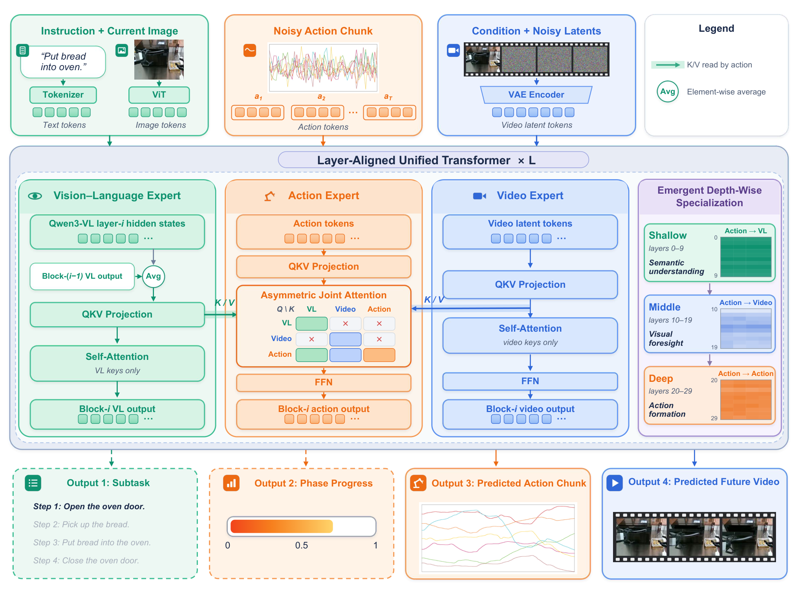
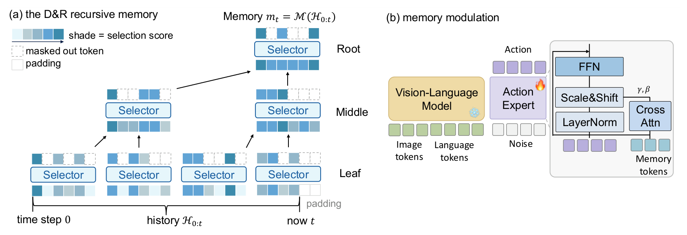

# 2026-10-03 Embodied AI & World Models Daily

> 面向具身智能 / Robotics 研究员与工程师的研究与工程资讯。
>
> 检索窗口：主窗口 2026-10-03 00:00–23:59（北京时间）；补充窗口回溯至 2026-10-01 00:00。**arXiv 公告空窗说明**：本次运行时刻为北京时间周日 01:00，arXiv 官方 recent 列表与 API 最新可检索条目仍停在 2026-10-01 17:59 UTC（= 北京 10-02 01:59）——周五 ET 14:00 之后收到的提交全部并入周一 ET 公告批次（北京 10-05 晚），**主窗口 10-03 的 arXiv 新投稿本次运行时无法检索**，明日日报将回补。今日内容全部来自补充窗口（实际提交/发布时间逐条标注），已逐条打开 abs 页 / 仓库 / HF 页核实。

## 🔥 今日必读

### 1. 【世界模型】World Motion Models：把整个动态 3D 世界压成 SE(3) 轨迹分布，NeurIPS 2026 Spotlight

**来源：** [arXiv:2610.01742v1](https://arxiv.org/abs/2610.01742)（cs.RO 交叉 cs.CV；Jiahui Lei · Qianqian Wang · Trevor Darrell · Angjoo Kanazawa，UC Berkeley 线）  
**类型：** Paper（research_paper，NeurIPS 2026 Spotlight）  
**发布时间：** 实际提交 2026-10-01 14:13 UTC（北京 22:13，补充窗口）；官方代码 2026-10-02 新建  
**评分：** 84/100  
**关键词：** SE(3) Trajectories · Flow Matching · Any-to-Any Conditioning · Unified 4D

**一句话：**  
提出 World Motion Models（WMM）：用一组稀疏刚体 SE(3) 位姿轨迹作为「动态 3D 世界的生成先验」—— articulated 物体、人体、手-物交互、相机运动、机器人状态与动作全部塞进同一个轨迹空间，用 per-token 噪声级的 flow matching 做灵活序列建模，任意任务变成同一网络上的不同 mask。

**技术要点：**

- 核心表征主张：动态场景元素可被一组刚性 SE(3) 轨迹良好近似，是「4D 建模中极简而有表达力的原语」——一个共享空间同时容纳相机、人体、机器人、物体。
- 建模方式：flow matching + per-token noise levels（同一条序列里不同 token 处于不同噪声级，天然支持任意时间点、任意实体的部分条件化）；context token 机制处理非顺序条件，实现 any-to-any 边缘条件化。
- 任务即 mask：未来预测、运动补全（infilling）、MPC、逆运动学、跨本体 retargeting、策略学习——6 类应用 × 3D 视觉与机器人两个域，全部在同一网络上以不同掩码执行，论文报告全面强表现。
- 代码 [JiahuiLei/WorldMotionModels](https://github.com/JiahuiLei/WorldMotionModels)（2026-10-02 创建），项目页 [jiahuilei.com/projects/wmm](https://jiahuilei.com/projects/wmm/)。

**为什么值得关注：**  
它给出了「世界模型 ≠ 视频生成器」的一条正面答案：**显式几何运动流** 也可以当世界先验，且 any-to-any 条件化让同一个模型横跨感知（IK/retargeting）与决策（MPC/策略）——对同时做 3D 视觉和机器人策略的组，这是比 video WAM 更轻、更可解释的中间层。NeurIPS Spotlight + Kanazawa/Darrell 线出品，可复用性高。

**资源：**

- Paper：[arXiv 摘要页](https://arxiv.org/abs/2610.01742)
- Project：[项目页](https://jiahuilei.com/projects/wmm/)
- Code：[GitHub](https://github.com/JiahuiLei/WorldMotionModels)
- Weights：暂未见公开权重仓库（代码仓新建，关注后续 release）
- Discussion：暂未发现高质量社区讨论

---

### 2. 【Sim-to-Real】PRISM 开源：反事实视频生成 × real-to-sim-to-real，九人全明星阵容的人形搬运方案

**来源：** [arXiv:2609.38172v1](https://arxiv.org/abs/2609.38172)（cs.RO 交叉 cs.CV / cs.GR；Zihan Wang, Zhen Wu, Pieter Abbeel, Rocky Duan, Jitendra Malik, Carmelo Sferrazza, C. Karen Liu, Guanya Shi, Angjoo Kanazawa；Amazon FAR，9 人）  
**类型：** Open Source 事件（论文 v1 提交 09-29，超窗；**官方代码仓 09-30 17:42 UTC 创建、主窗口内持续开发，HF 数据集 09-29 22:00 UTC 上线**——本条目为该事件的窗口内开源进展）  
**发布时间：** 代码仓 2026-09-30 17:42 UTC（北京 10-01 01:42）；数据集 [Amazon-FAR/far-prism-data](https://huggingface.co/datasets/Amazon-FAR/far-prism-data)（Apache-2.0，255 次下载）  
**评分：** 81/100  
**关键词：** Counterfactual Video · Real-to-Sim-to-Real · Humanoid Loco-Manipulation · FastFoundationStereo

**一句话：**  
CoRL 2026 论文 PRISM（反事实视频生成扩充人形搬运数据 → contact-anchored real-to-sim 转物理合理轨迹 → 仿真训练深度策略）本次开源了完整训练管线：teacher PPO 运动跟踪 + rollout 蒸馏 + sim2real 部署分支，真机零微调、仅靠 onboard 深度完成箱/桶/盆/球四类物体的搬取-搬运-放下。

**技术要点：**

- 数据引擎：video-to-video 生成从少量真实片段造出数百条反事实人-物交互视频（同一动作 × 不同物体/场景变体）；contact-anchored real-to-sim 管线恢复人体与物体运动，把噪声视频转成物理合理轨迹——**「视觉生成补数据、物理仿真管正确性」的分工**。
- 开源内容：[amazon-far/PRISM](https://github.com/amazon-far/PRISM)（main 分支 = 仿真 teacher 训练/rollout 收集/学生蒸馏；sim2real 分支 = FastFoundationStereo 真机部署）+ [HF 数据集](https://huggingface.co/datasets/Amazon-FAR/far-prism-data)（物体网格与学生训练分片，<1K 条规模档）；基于 [HoloSoma](https://github.com/amazon-far/holosoma) 构建。
- 窗口内活跃度：仓库 10-01 至 10-02 每日多次 push（14★），当前注意 teacher 训练数据仍在内部审核中——README 要求先自备 teacher bank。
- 一策略跨类别泛化：训练用生成变体，部署到每类未见物体，无真机微调。

**为什么值得关注：**  
这是「生成式数据引擎喂机器人策略」目前最完整的开源样例（代码 + 数据 + 双分支部署路径齐全），且作者阵容（Abbeel/Malik/Kanazawa/Liu/Shi 五个组的合作）本身说明这条路线已成为主流共识。做 sim2real 与数据稀缺场景的工程师可直接克隆复现整条管线。

**资源：**

- Paper：[arXiv 摘要页](https://arxiv.org/abs/2609.38172)
- Project：[项目页](https://prism-real2sim2real.github.io/)
- Code：[GitHub](https://github.com/amazon-far/PRISM)（main + sim2real 两分支）
- Weights：[Hugging Face 数据集](https://huggingface.co/datasets/Amazon-FAR/far-prism-data)（数据，非权重；策略权重未见发布）
- Discussion：暂未发现高质量社区讨论

---

### 3. 【VLA与基础模型】EWAM：统一具身模型里的「深度涌现分工」——浅层读语义、中层看未来、深层管动作

**来源：** [arXiv:2609.39973v1](https://arxiv.org/abs/2609.39973)（cs.RO；Hao Wang 等 24 人，Xiaodan Liang 组等）  
**类型：** Paper + Open Source（代码 + 4 组 HF 权重同日发布）  
**发布时间：** 实际提交 2026-09-30 15:35 UTC（北京 23:35，补充窗口）；[HaoWang00/EWAM](https://huggingface.co/HaoWang00/EWAM) 权重 2026-09-30 03:30 UTC 上线  
**评分：** 79/100  
**关键词：** Unified Embodied Model · Asymmetric Attention · Emergent Specialization · RoboTwin 2.0

**一句话：**  
在 VLA（语义）与 WAM（动态预测）之间做 action-centric 统一：动作 token 通过非对称联合注意力在**每一层**都能读语义 / 当前视觉 / 预测未来 / 动作四路信息，并在无逐层监督下涌现出清晰的深度分工——浅层动作 query 主看视觉-语言特征、中层主看预测未来帧、深层主看动作 token 自身。

**技术要点：**

- 架构：action-centric 非对称联合注意力 + 感知专家分工；骨干为 Wan2.2-TI2V-5B（视频）+ Qwen3-VL-2B-Instruct（VLM）——与 UniWAM 同代骨干，可直接对比。
- 机制证据：checkpoint 追踪与因果干预表明该分工是学出来的、动作生成依赖它；跨任务、跨去噪步稳定复现。
- 预训练双轨：跨本体机器人轨迹 + 自我中心人类视频；作者报告 egocentric 人类数据提升跨本体迁移与真机鲁棒性，子任务相位监督提升长时程完成率。
- 开源清单：4 组权重（pretrain / RoboTwin clean-to-random 77.2 / in-domain 92.9 / LIBERO 98.8）+ 完整训练评测代码；LIBERO 四套件 98.6/99.8/98.6/98.2。

**为什么值得关注：**  
昨天 UniWAM 主打「三专家 MoT 架构设计」，EWAM 给出互补的**机制层解释**：统一模型的深度方向会自发形成「语义→前瞻→动作」的处理次序。对做统一 VLA/WAM 架构的人，这是目前少有的带因果干预证据的可解释性分析；且权重全开放，RoboTwin 2.0 与 LIBERO 数字可直接当基线。

**资源：**

- Paper：[arXiv 摘要页](https://arxiv.org/abs/2609.39973)
- Project：[项目页](https://wanghao00pro.github.io/EWAM-project/)
- Code：[GitHub](https://github.com/Wanghao00pro/EWAM)
- Weights：[Hugging Face](https://huggingface.co/HaoWang00/EWAM)（Apache-2.0）
- Discussion：暂未发现高质量社区讨论

---

## 📄 论文雷达

> 今日主窗口无 arXiv 新投稿可检索（公告空窗），以下 6 篇均为补充窗口内实际提交（已逐条打开 abs 页核实），按双评分均分降序。

### 【VLA与基础模型】DILL：用「域不变前瞻 latent」切断 VLA 的捷径学习，LIBERO-Plus 69.1%

**来源：** [arXiv:2609.37165v1](https://arxiv.org/abs/2609.37165)（cs.RO 交叉 cs.LG；Kim 等 10 人，CoRL 2026）  
**关键词：** Shortcut Learning · Domain-Invariant Latent · LIBERO-Plus · Real Robot  
**核心贡献：** 针对 VLA 在视觉分布偏移下依赖域特定线索的问题，DILL 用域变换轨迹数据构造「域不变未来 latent」做前瞻监督：Task-Domain Encoder 以对比目标 + 高斯解耦正则分离任务相关结构与域特定变化，策略通过前瞻预测与域解耦被推向任务相关结构。反事实任务视角评测显示捷径依赖下降；LIBERO-Plus 平均 69.1%、超最强基线 11.4pt；附真机操作验证。官方开源于窗口内落地：[GitHub](https://github.com/DILL-VLA/DILL)（2026-09-30 创建）+ [HF 数据集](https://huggingface.co/datasets/DILL-VLA/DILL-Dataset) + [HF 模型](https://huggingface.co/DILL-VLA/DILL-Encoders)（2026-09-30 上线）。  

**值得关注程度：** 76/100  
**Paper：** [arXiv 摘要页](https://arxiv.org/abs/2609.37165)　**Project：** [项目页](https://dill-vla.github.io/)　**Code：** [GitHub](https://github.com/DILL-VLA/DILL)

### 【模仿学习与策略】Divide-and-Remember：把「记什么」变成优化问题，64 token 记忆做到 RoboMME SOTA

**来源：** [arXiv:2610.00982v1](https://arxiv.org/abs/2610.00982)（cs.RO 交叉 cs.AI；Yu 等 6 人，TUM Harold Soh / Stefano Albrecht 线）  
**关键词：** Action-Relevant Memory · Conditional Mutual Information · Long-Horizon · 64 Tokens  
**核心贡献：** 从 POMDP 视角把「历史里记什么」形式化为最大化 I(action; memory | observation)：递归地把全历史选择拆成 2K token 上的 top-K 选择子问题，固定尺寸轻量选择器端到端学习且跨递归块共享，无界历史下计算量恒定。16 任务长时程 benchmark RoboMME 四套件全部提升、平均 SOTA，仅用 64 个 memory token；真机实验同步改善。  

**值得关注程度：** 74/100  
**Paper：** [arXiv 摘要页](https://arxiv.org/abs/2610.00982)　**Project：** [项目页](https://dnr-memory.github.io/)（含代码与 checkpoint）

### 【数据与Benchmark】Embodied Agent Arena：1000 案例 × 5 能力轴，量化「VLM 强在局部、败在成事」

**来源：** [arXiv:2610.00854v1](https://arxiv.org/abs/2610.00854)（cs.RO；Huang 等 10 人，Ying-Cong Chen · Yinchuan Li 线）  
**关键词：** VLM Generalist · Geometry · Affordance · Task Planning · GeoProbe  
**核心贡献：** 把「VLM 能否当机器人通才」拆成几何估计 / 空间推理 / Affordance / 任务规划 / 操作五轴，1000 案例来自 32 个既有 benchmark 源 + 新增 GeoProbe（Blender 渲染与真实场景的几何估计）；最小化 harness 保留源观测与操作、分离「度量精度 / 功能性 grounding / 目标完成」三层。评测 7 个 VLM：Astra 的优势集中在精确估计与可用接触定位，**协调的、目标导向的动作完成仍是通才化的关键缺口**。  
**值得关注程度：** 73/100  
**Paper：** [arXiv 摘要页](https://arxiv.org/abs/2610.00854)　**Project：** [项目页](https://embodied-agent-arena.github.io/embodied-agent-arena/)

### 【数据与Benchmark】RoboDyna：让场景在策略思考时继续演化——动态场景操作 benchmark + 人类基线

**来源：** NeurIPS 2026 Workshop on Robot Learning with World Models（ workshop paper，[项目页 PDF](https://robodyna.github.io/robodyna/paper/robodyna_neurips2026_workshop.pdf)）  
**关键词：** Dynamic Scenes · Asynchronous Evaluation · Progress Score · Human Baseline  
**核心贡献：** 30 个动态任务（物体滚动/弹跳/坠落/成熟/沸腾由物理仿真驱动而非脚本动画），每任务 4 档可组合难度（var1+2 为 held-out）；3500 条专家演示；**同步/异步双评测协议**——异步评测让场景在策略推理延迟内继续演化，延迟直接计入成绩。π0.5 总体 0.18、人类遥操作 hard 0.44 / scene-interactive 0.73：**没有任何策略能解五分之一以上的 episode**。GitHub 2026-10-01 18:05 UTC 创建（窗口内），HF 数据 [RoboDyna](https://huggingface.co/RoboDyna) 8 月起陆续上线。  
**值得关注程度：** 71/100  
**Paper：** [workshop PDF](https://robodyna.github.io/robodyna/paper/robodyna_neurips2026_workshop.pdf)　**Project：** [项目页](https://robodyna.github.io/robodyna/)　**Code：** [GitHub](https://github.com/RoboDyna/robodyna)

### 【运动与全身控制】Reactive Humanoid Multi-Contact：学一个「冲击后 CoP 区域」模型，手部支撑反应式稳住人形

**来源：** [arXiv:2610.00823v1](https://arxiv.org/abs/2610.00823)（cs.RO；McCrory 等 5 人，NVIDIA Robert Griffin 线）  
**关键词：** Multi-Contact · Centroidal Dynamics · CoP Prediction · Hardware Push Test  
**核心贡献：** 低稳定性场景下用额外手接触稳住人形：在工作空间采样候选接触点、经预冲击/冲击/冲击后三阶段质心动力学预演打分，关键加速器是**学习「冲击后 CoP 区域」模型**替代基于优化的评估，两段式规划（先选支撑区域、再选区域内的支撑点）。仿真抗冲击恢复力 +89%（vs 无手接触）、+17%（vs 朴素策略）；硬件推挤测试稳定时间 -43%，步行场景 -18%。  
**值得关注程度：** 70/100  
**Paper：** [arXiv 摘要页](https://arxiv.org/abs/2610.00823)

### 【端侧部署】Measuring the Stability Assumption Behind Action Chunking：给「误差传播」做系统测量

**来源：** [arXiv:2610.01626v1](https://arxiv.org/abs/2610.01626)（cs.AI；单人作者 Aryan Goyal）  
**关键词：** Action Chunking · Error Propagation · Contraction / Expansion · Open vs Closed Loop  
**核心贡献：** 对 action chunking 的隐含假设做实证检验：在每个状态注入小误差、测开环（重放 chunk 余下部分）与闭环（重规划）两种模式下误差的增速/衰减率，把状态分类为收缩/扩散/不可判定。12 任务 × 3 benchmark 的结论：**可自信判定稳定的状态很稀有**；传播率对拟合视界高度敏感（放大通常前置，短窗口会高估长时程传播）；开环 regime 可由相机+本体感知推断，闭环传播只有部分可恢复。作者主张「闭环反应性应被显式训练」而非寄望模仿学习自带。注意：单人作者、无代码、cs.AI 交叉分类——证据强度中等，按保守评分收录。  
**值得关注程度：** 64/100  
**Paper：** [arXiv 摘要页](https://arxiv.org/abs/2610.01626)

---

## 🛠 工程与开源

### PRISM 官方代码 + 数据集（[GitHub](https://github.com/amazon-far/PRISM) / [Hugging Face](https://huggingface.co/datasets/Amazon-FAR/far-prism-data)）

主分支（仿真：teacher PPO / rollout / 学生蒸馏）+ sim2real 分支（FastFoundationStereo 真机部署）双路径开源，Apache-2.0 数据集同步上线（255 下载）。teacher 训练数据尚在内部审核，复现需自备 teacher bank。详见今日必读 #2。

### EWAM 权重与训练代码（[GitHub](https://github.com/Wanghao00pro/EWAM) / [Hugging Face](https://huggingface.co/HaoWang00/EWAM)）

4 组 checkpoint（pretrain / RoboTwin c2r 77.2 / in-domain 92.9 / LIBERO 98.8）+ conda 环境一键脚本，骨干 Wan2.2-TI2V-5B + Qwen3-VL-2B 与 UniWAM 同代，适合作为统一 VLA/WAM 基线直接对标。详见今日必读 #3。

### DILL 数据集与编码器权重（[GitHub](https://github.com/DILL-VLA/DILL) / [Hugging Face](https://huggingface.co/datasets/DILL-VLA/DILL-Dataset)）

CoRL 2026 论文配套：域解耦 encoder 权重 + LIBERO-Plus 训练数据同日上线（README 标注完整代码 preparing for release）。做 VLA 鲁棒性评测的人可以直接拿 DILL-Encoders 当特征提取器。

### WorldMotionModels 官方实现（[GitHub](https://github.com/JiahuiLei/WorldMotionModels)）

NeurIPS 2026 Spotlight WMM 官方仓（2026-10-02 创建，2★），SE(3) 轨迹 flow matching 的 any-to-any 条件化参考实现；MoSca（382★）作者出品，工程成熟度可期。

---

## 💬 社区信号

> 本窗口为 arXiv 周末公告空窗期，社区讨论整体清淡。以下为值得继续观察的信号：

- **GitHub 新仓监控**：窗口内新建的官方仓中，[amazon-far/PRISM](https://github.com/amazon-far/PRISM)（14★）与 [Wanghao00pro/EWAM](https://github.com/Wanghao00pro/EWAM)（3★）涨速居前；[JiahuiLei/WorldMotionModels](https://github.com/JiahuiLei/WorldMotionModels) 刚建仓一天，NeurIPS Spotlight 加持下值得盯 issue 区的复现反馈。
- **[sttawm/rephrase-before-you-act](https://github.com/sttawm/rephrase-before-you-act)**（2026-10-02 21:06 UTC 创建，主窗口内）：「VLA 对指令措辞的敏感性」课题的项目站（Independent Researcher + UCLA 线），含人措辞调查静态复刻与 11 段 rollout 网格视频；**arXiv 尚未挂出**（README 标注 coming soon），论文本体未到——列为观察项，arXiv 号出现后补查。
- **HF 生态信号**：[RoboDyna](https://huggingface.co/RoboDyna) 的 π0.5 / X-VLA 基线权重 8 月起陆续上线，配套异步评测协议（延迟计入成绩）是对当前「静态场景 benchmark 高分」的公开纠偏，值得 benchmark 设计者跟进。

---

## 🔎 补充窗口筛选记录

> 以下条目已逐条打开 abs 页 / 仓库页核实实际时间（北京时间）。主窗口（10-03 00:00–23:59）因 arXiv 公告空窗无可检索新投稿；GitHub / HF 侧窗口内新建仓已尽收于上，其余排除项如下。

| 条目 | 实际时间（北京时间） | 排除原因 |
|---|---|---|
| [arXiv:2609.38172v1](https://arxiv.org/abs/2609.38172) PRISM 论文本体 | 09-30 01:59 | v1 提交早于补充窗口起点（10-01 00:00）；**其代码仓与数据集的开源事件在窗口内**，已按事件更新形式收录为今日必读 #2 |
| [arXiv:2609.37165v1](https://arxiv.org/abs/2609.37165) DILL 论文本体 | 09-29 17:56 | v1 超窗；**GitHub（09-30 12:27）与 HF 数据集/权重（09-30 13:14）开源事件在窗口内**，已合并为雷达条目并注明 |
| [arXiv:2610.02089v1](https://arxiv.org/abs/2610.02089) HumanoidToolBench | 10-02 01:21 | 窗口内提交，但与 10-02 日报同一事件（已精读），按聚簇去重不重复收录；abs 页确认无 v2 |
| [arXiv:2610.01742v1](https://arxiv.org/abs/2610.01742) WMM | 10-01 22:13 | 窗口内 → 已收录（必读 #1）；代码仓 10-02 新建为事件更新 |
| [arXiv:2609.39973v1](https://arxiv.org/abs/2609.39973) EWAM | 09-30 23:35 | 窗口内 → 已收录（必读 #3） |
| [arXiv:2610.00982v1](https://arxiv.org/abs/2610.00982) D&R | 10-01 11:18 | 窗口内 → 已收录（雷达） |
| [arXiv:2610.00854v1](https://arxiv.org/abs/2610.00854) Embodied Agent Arena | 10-01 08:14 | 窗口内 → 已收录（雷达） |
| [arXiv:2610.00823v1](https://arxiv.org/abs/2610.00823) Reactive Humanoid Multi-Contact | 10-01 07:33 | 窗口内 → 已收录（雷达） |
| [arXiv:2610.01626v1](https://arxiv.org/abs/2610.01626) Action Chunking 稳定性 | 10-01 20:57 | 窗口内 → 已收录（雷达，保守评分） |
| [arXiv:2610.02038v1](https://arxiv.org/abs/2610.02038) Mimir 灌溉控制 | 10-02 00:50 | LLM agent 长时程物理控制，无机器人本体/泛化具身落点，相关性不足 → BLOCK |
| [arXiv:2610.01351v1](https://arxiv.org/abs/2610.01351) TSR 扰动行为评测 | 10-01 17:20 | 有价值但单一维度（行为指标框架）、无真机与代码，证据弱于同日 RoboDyna / EAA → 未达雷达阈值 |
| [arXiv:2610.01910v1](https://arxiv.org/abs/2610.01910) 离散曲面机器人学习 | 10-01 23:53 | 理论性强但落点偏 DMP/GP/RFM 的几何泛化，机器人决策相关性中等 → 未达阈值，列观察 |
| [arXiv:2610.01612v1](https://arxiv.org/abs/2610.01612) ReCo 腿式操作 | 10-01 20:51 | RL+MPC 腿臂协同，-28.7% RMS + 真机；与必读条目竞争后落选（覆盖面窄于 PRISM/EWAM），列观察 |
| [arXiv:2610.01397v1](https://arxiv.org/abs/2610.01397) VAPS 人形安全 | 10-01 18:02 | 优质（Pareto 支配基线 + 双平台硬件验证）但当日雷达已满 6 篇上限，列下期候选 |
| [arXiv:2610.01162v1](https://arxiv.org/abs/2610.01162) PhysicsLENS | 10-01 14:42 | 视频 WM 物理合理性 benchmark；34/47 案例违反声明的物理属性——结论有趣但样本规模小（4 模型 400+ 标注），列观察 |
| [arXiv:2610.01224v1](https://arxiv.org/abs/2610.01224) 准则对齐辅助损失 | 10-01 15:27 | latent WM 辅助损失，PushT +3.5% / cube +3.4%；增益幅度与任务面窄，Under review，未达阈值 |
| [arXiv:2610.00921v1](https://arxiv.org/abs/2610.00921) CEM 世界模型即提议机制 | 10-01 09:57 | 诊断性研究（latent WM 评分偏差如何污染 CEM 提议分布），Walker/Cheetah 域；对机器人相关性间接，列观察 |
| [arXiv:2610.01301v1](https://arxiv.org/abs/2610.01301) 持续学习抓取 | 10-01 16:36 | CoRL 2026、真机 1500+ 次抓取 90%+；连续学习 × 抓取是好方向，但当日竞争激烈，列下期候选 |
| [arXiv:2610.01668v1](https://arxiv.org/abs/2610.01668) Jacobian Flow Matching | 10-01 21:29 | 刚柔耦合手指的分辨率一致 Jacobian 场，-53% RMSE；硬件特化强、泛化落点窄 → 列观察 |
| [arXiv:2610.00613v1](https://arxiv.org/abs/2610.00613) Spatial Strategies | 10-01 03:16 | LLM+几何工具网格世界，非机器人本体；相关性边缘 → 列观察 |
| tanaytan/augmentron（GitHub） | 10-02 15:49 创建 | 多视角视觉增广项目站；无 arXiv / 代码未发布（README 明示），证据不足 → 列观察 |
| wangsiya2459/ei（GitHub，13★） | 09-30 18:00 创建 | 具身智能经典文献阅读清单（Brooks 1991 等），非新技术 → 不收录 |
| DILL-VLA HF 权重上线 | 09-30 13:19 | 已并入 DILL 雷达条目 |
| RoboDyna GitHub 创建 | 10-02 02:05 | 已按事件收录（雷达） |

> 另有约 40 条窗口内 cs.RO / cs.AI 交叉公告条目经核实未达阈值（驾驶域特化、SLAM/感知无决策落点、单仿真小幅领先等），不再逐条列举。10-02 日报补充窗口记录中已标注的 09-30 晚间批次（ECoMEM / TacDyn-WAM / MIKASA / NarrativeFlow 等）与本次窗口重叠部分不再重复处理。

---

## 📊 今日技术趋势

今天的三条主线都指向同一件事：**世界模型的「显式几何」与「数据引擎」两端同时收紧**。一头是 WMM 把动态世界压成 SE(3) 轨迹分布做 any-to-any 条件化（NeurIPS Spotlight），EWAM 在统一架构里给出「语义→前瞻→动作」的深度分工因果证据——显式结构派在拿回对纯视频生成派的话语权；另一头是 PRISM 用反事实视频生成 + real-to-sim 管线开源了最完整的数据引擎，验证「生成补数据、物理管正确性」的分工在真机上成立。

第二条是**评测侧对「静态高分」的集中纠偏**：RoboDyna 让场景在策略思考时继续演化（延迟计入成绩，π0.5 仅 0.18），Embodied Agent Arena 把 VLM 通才缺口定位在协调的目标导向动作，Action Chunking 测量则表明可自信判定稳定的状态很稀有——三个工作从不同角度说明：**成功率和静态 benchmark 已不足以刻画策略质量，异步、行为、误差传播正在成为新的评测标配**。

第三，**记忆与长时程**方向出现清晰的形式化路径：D&R 把「记什么」变成条件互信息最大化的优化问题（64 token 做 RoboMME SOTA），与前一日 RPG 的符号技能库形成呼应——接口层（记忆/技能/奖励程序）的可学习化仍在加速。

---

## 📚 精读索引

本日精读产物见 [paper-reading/news/2026-10-03/README.md](../paper-reading/news/2026-10-03/README.md)。
