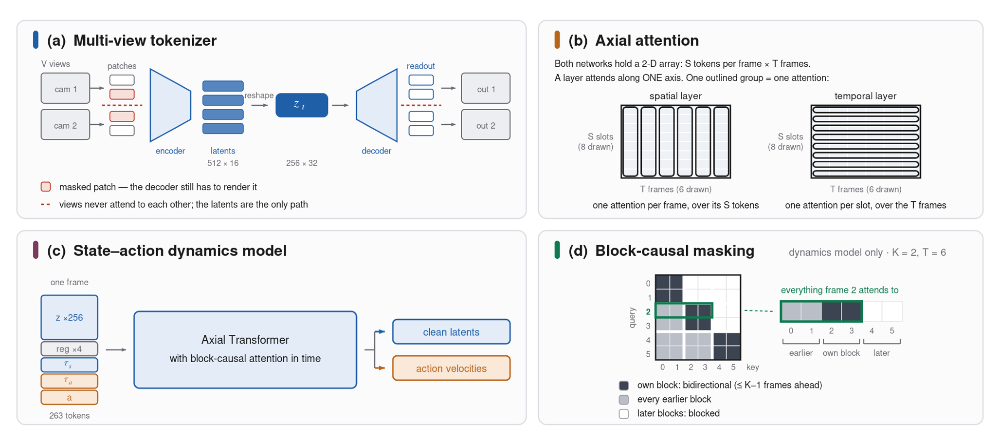
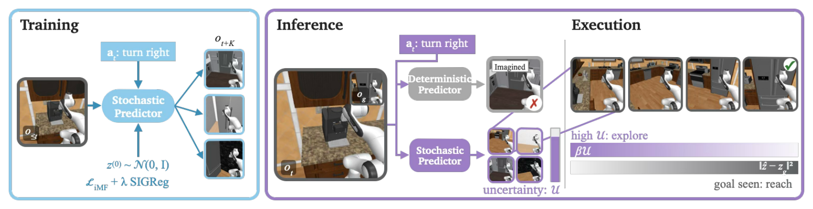
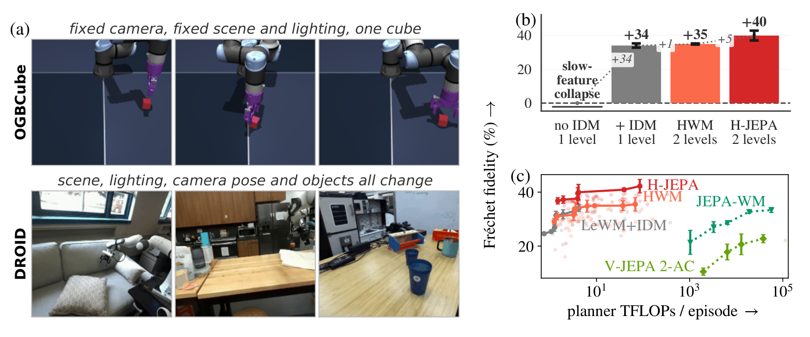
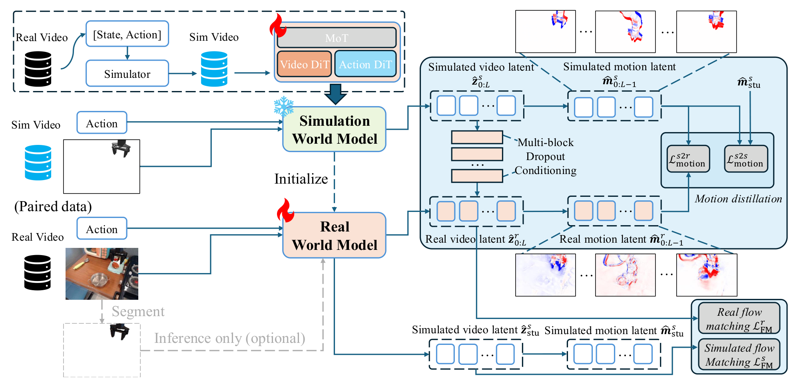

# 2026-10-06 Embodied AI & World Models Daily

> 面向具身智能 / Robotics 研究员与工程师的研究与工程资讯。
>
> 检索窗口：主窗口 2026-10-06 00:00–23:59（北京时间）；补充窗口回溯至 2026-10-04 00:00。**arXiv 公告说明**：本次运行（北京 10-07 01:00 = ET 10-06 13:00）可检索到 **周二 ET 公告批次（实际提交北京 10-04 01:15 – 10-05 23:59，即周日/周一 ET 日间提交）**——该批 104 条（cs.RO/AI/LG/CV 合并去重后进入窗口者）构成本次日报主体，其中主窗口（北京 10-06 00:00–02:00 的 v1 尾巴）10 条、补充窗口 94 条，已逐条打开 abs 页核实实际提交时间（北京时间）与摘要。**主窗口 10-06 日间与 10-07 的 arXiv 新投稿（周三 ET 批次）本次运行不可见，明日日报回补。** GitHub / 项目页 / HN 均已实际访问核实；全部条目按 T1（一手源）标准收录。

## 🔥 今日必读

### 1. 【VLA与基础模型】Vela：把动作 chunk 换成 B 样条连续轨迹——同架构不加参数，LIBERO-X 45.3 vs 39.3

**来源：** [arXiv:2610.05230v1](https://arxiv.org/abs/2610.05230)（cs.RO 交叉 cs.AI；Fudan / CUHK / UCSB，Yifan Li* · Jiaxu Wang* · Xiangyu Yue† · Yanwei Fu†）  
**类型：** Paper（research_paper）  
**发布时间：** 实际提交 2026-10-04 21:50（北京时间，补充窗口）  
**评分：** 88/100  
**关键词：** Trajectory-Space VLA · B-Spline Control Points · Motion-Dependent Horizon · 跨本体预训练

**一句话：**  
动作输出不必是固定时间网格上的点序列：一组 B 样条控制点描述几何 + 一个标量 horizon 描述跨度，**噪声标定的 horizon 选择**（$\psi^2(H)$ 区分「分辨率不足」与「演示噪声」）让固定预算在不同运动上自适应分配——π0.5 架构零新增参数，LIBERO-X 平均 45.3 vs 39.3，强扰动级 +7.4~+9.1。

**技术要点：**

- 核心参数化 $y=(C,H)$：$N{=}12$ 控制点 + 标量 horizon 联合 flow-matching 预测，$B_H C$ 线性解码任意采样率；部署期零搜索零拟合。
- **MDHA**（式 6-9）：残差分解 $\mathbb{E}\|r\|^2 = $ 未表征运动 $+\ (H{-}N)\sigma^2$，逐源 $\hat\sigma_j$ 归一化后阈值 $\kappa$ 选最长充分跨度——post-hoc 拟合消融（38.9/40.0 vs 42.0）证明**增益来自学习目标而非输出平滑**。
- 共享 26 维 action-path 接口：约 2 万小时公开（60 数据集/11 本体类）+ 2 万小时私有预训练；DT-FM 解码空间计权 vs CP-FM。
- EBench overall 49.7 vs 41.4（Table Top +15.0 最大单项）；真机 egg-cake 四子任务均值 67.5% 全部最高。

**为什么值得关注：**  
这是动作表征从 chunk 时代转向连续参数化时代的标志性一版：建模（式 2-3）、监督目标构造（式 6-9）、规模化接口、损失设计四个环节全部可复现。$\psi^2$ 噪声归一化与 DT-FM 解码计权两个组件可独立移植到预算分配类回归任务。对做 VLA 的人这是「换表征不换架构」的最小改动路径。

**资源：**

- Paper：[arXiv 摘要页](https://arxiv.org/abs/2610.05230)
- Project：[项目页](https://clementine24.github.io/Vela/)
- Code：未在 abs 页与项目页找到可确认的公开代码仓库
- Weights：暂无
- Discussion：暂未发现高质量社区讨论（公开 <72h）

---

### 2. 【世界模型】FLEX-WAM：块因果世界-动作模型——单一 checkpoint 从实时到吞吐全谱部署，FD elasticity 保住动作响应

**来源：** [arXiv:2610.05483v1](https://arxiv.org/abs/2610.05483)（cs.RO 交叉 cs.AI；TU Darmstadt，R. Khorrambakht · Jean Ponce · Ludovic Righetti）  
**类型：** Paper（research_paper）  
**发布时间：** 实际提交 2026-10-05 03:41（北京时间，补充窗口）  
**评分：** 85/100  
**关键词：** Block-Causal WAM · Gradient Balancing · FD Elasticity · MCTS in Imagination

**一句话：**  
联合训练的世界-动作模型会产出「plausible 但对动作无响应」的未来——FLEX-WAM 用**块因果架构**（$K\in\{1..16\}$ 训练期随机、部署期可调）+ **梯度均衡**（交叉清洁度分配 + 每 500 步实测梯度模）+ **FD elasticity 闭环调节**（Hutchinson 估计动作扰动敏感度，setpoint=WM-only 峰值 90%）三件套解决；T=64 长视野 SSIM 0.778 vs UWM 0.599，1024 步 rollout 稳定，PushT 与全部五个 OGBench 4x4 在 MCTS 想象内全解。

**技术要点：**

- 263 token/步动力学（256 latents + 4 registers + 双信号级 + 动作）；块内双向、跨块因果、KV-cacheable——**B 是部署期延迟-吞吐旋钮**（B=1 实时 71.5ms@690M，B=8 质量吞吐双优）。
- Blockwise diffusion forcing：块内时间齐噪声避免 $128^2T$ 组合爆炸；state x-prediction / action v-prediction 分工。
- FD elasticity 实验画像干净：No Feedback 协议 30k 步后动作响应从 0.78 衰落到 0.42，WM-only 峰值锁定 setpoint 后闭环稳定。
- 闭环部署（OpenArm）预测-观察差分自动挖反事实样本（幻觉箱子单例演示）。

**为什么值得关注：**  
WAM 的竞争已经从架构之争进入训练协议之争——这篇是「训练协议可调节」的代表作。块大小旋钮、双流损失竞争解法模板、FD elasticity 探针三件都独立可搬；对做 WAM 系统的人这套协议栈比网络结构更值得照抄。

**资源：**

- Paper：[arXiv 摘要页](https://arxiv.org/abs/2610.05483)
- Project：未在 abs 页找到项目页链接
- Code：代码与 checkpoint 标注「匿名评审期省略、录用后发布」
- Weights：暂无
- Discussion：暂未发现高质量社区讨论（公开 <72h）

---

### 3. 【世界模型】EpicWorldModel：随机 JEPA + 预测方差当探索信号——流采样免费送 ensemble 分歧，遮挡档 5/6 vs 0/6

**来源：** [arXiv:2610.05996v1](https://arxiv.org/abs/2610.05996)（cs.LG；Princeton 线，Bowen Feng* · Julian Ost* · Anirudha Majumdar · Felix Heide，NeurIPS 2026 接收）  
**类型：** Paper（research_paper / conference_result）  
**发布时间：** 实际提交 2026-10-05 16:49（北京时间，补充窗口）  
**评分：** 84/100  
**关键词：** Stochastic JEPA · Flow-Matching Variance · Uncertainty-Guided CEM · Partial Observability

**一句话：**  
确定性 JEPA 世界模型在部分可观测下会「记忆化训练集位置并幻觉」——EpicWorldModel 把预测头换成条件流匹配（iMF 平均速度 1-NFE），**流采样的预测方差 $U$ 直接当探索信号**接进 CEM 目标（$\min\|\hat z-z_g\|^2-\beta U$）：PointMaze 83.5 vs LeWM 64.5，RoboCasa 遮挡档 5/6 vs 0/6，且 6000 候选只把 LeWM 推到 74.0（增益不是采样预算）。

**技术要点：**

- 理论自洽三件套：SIGReg 高斯潜 → 源-目标分布兼容（Rem.1）；梯度噪声界 $\mathrm{Var}[v_{tgt}]\preceq((1-\tau)^2+\tau^2)I$ 与数据无关（Prop.1）；$U$ 是条件熵上界、EIG 的代理（Prop.2/Rem.2，各向异性下界会松——作者自己声明当 bonus 用）。
- 遮挡受控实验的信息量：仅随机化（β=0）71.7 vs 确定性 45.0；**目标全可见时探索项反伤（19/22 vs 21/22）**——β 调度的实证边界直接给出。
- Visual Scene 上 LeWM 64 反超 iMF 60——随机路线在高维动作+弱部分可观测场景的边界，论文诚实画出。
- 训练 <5 GPU 小时（PointMaze，A6000 单卡 48GB 全流程）。

**为什么值得关注：**  
「预测不确定性」从 ensemble 专利变成流匹配的免费赠品——不用训 N 个 dynamics，采 N 个流样本就有分歧。$-\beta U$ 项是最小改动的探索-到达权衡；遮挡/可见度分层评测协议（目标几何采 200 点）是部分可观测任务的标准模板。与 H-JEPA（同日）正交互补：一个管信念分布、一个管时间尺度。

**资源：**

- Paper：[arXiv 摘要页](https://arxiv.org/abs/2610.05996)
- Project：未在 abs 页找到项目页链接
- Code：未找到可确认的公开代码仓库
- Weights：暂无
- Discussion：暂未发现高质量社区讨论（公开 <72h）

---

### 4. 【端侧部署】RealtimeWAM：一步动作蒸馏 + 块级异步流水线——24.55 倍加速掉点 <1%，12.2ms 压进 30Hz 周期

**来源：** [arXiv:2610.06617v1](https://arxiv.org/abs/2610.06617)（cs.RO 交叉 cs.AI/cs.LG/cs.CV；ModelTC / LightX2V 生态线）  
**类型：** Paper（research_paper / engineering_tech）  
**发布时间：** 实际提交 2026-10-06 00:18（北京时间，主窗口）  
**评分：** 82/100  
**关键词：** Consistency Distillation · Teacher Anchoring · Cross-Expert Pipelining · 实时推理

**一句话：**  
MoT-WAM 推理时延的两个来源被逐个击破：**TACD** 发现一致性蒸馏的 local-global 误差间隙（CD 只压局部一致性、不保端点），用冻结教师 10 步 rollout 端点做锚定补上；**CEWP** 依赖分析发现动作块只需对应视频块的 KV，把专家级屏障降为 record/wait 块级事件——Fast-WAM 299.7ms→12.2ms（24.55 倍），RoboTwin 90.84 vs 教师 91.51。

**技术要点：**

- 误差分解 $e_{total}=e_{local}+e_{global}$：CD 训练中「学生 vs 教师向干净端点速度」的距离不降（Fig.3 实证），$L_{TA}$（λ=0.2）补上后同设置 90.84 vs CD 89.63 / DMD 88.22 / MeanFlow 85.73——**少步蒸馏里教师锚定最高**。
- CEWP：动作块 $i$ 注意力只消费视频块 $i$ 的 KV → record(e_i)/wait(e_i) 事件对；23.3→17.4ms（1.34 倍）零质量损失。
- 四级加速栈逐级可关：TACD 4.56× → CUDA Graph 2.82× → CEWP 1.34× → 高效算子 1.43×；**12.2ms 单次调用 @H100**（含 VAE、不含文本编码口径）。
- 消融：微调 Video Expert 反伤（89.76 < 90.84）——后训练只动动作侧（LoRA rank-128）最经济。

**为什么值得关注：**  
这是「WAM 压进实时预算」目前最完整的施工图：每个组件有独立消融、每级加速有独立标注。「局部一致性 + 教师多步端点锚定」的蒸馏模板适用于任何条件窄、误差敏感的强条件生成头；块级事件流水线是跨专家 MoT 推理的通用方案。做部署的人可以直接照它的栈施工。

**资源：**

- Paper：[arXiv 摘要页](https://arxiv.org/abs/2610.06617)
- Project：未在 abs 页找到项目页链接
- Code：[GitHub](https://github.com/ModelTC/LightX2V/tree/main/examples/realtimewam)（LightX2V 生态，2880★ 母仓）
- Weights：代码与 checkpoint 已发布（abs 页标注）
- Discussion：暂未发现高质量社区讨论（公开 <72h）

---

### 5. 【世界模型】H-JEPA：FAIR 的层级 JEPA——每层自己的潜空间，AntMaze 18%→73%，IDM 防 slow-feature collapse

**来源：** [arXiv:2610.06805v1](https://arxiv.org/abs/2610.06805)（cs.RO 交叉 cs.LG；Meta FAIR / Flatiron Institute，Wancong Zhang* · Basile Terver* · Michael Rabbat · **Yann LeCun** · Randall Balestriero）  
**类型：** Paper（research_paper）  
**发布时间：** 实际提交 2026-10-06 01:53（北京时间，主窗口）  
**评分：** 82/100  
**关键词：** Hierarchical JEPA · Selective Abstraction · Inverse Dynamics Loss · Slow-Feature Collapse

**一句话：**  
层级 JEPA 每层在自己的潜空间预测更远、预测即子目标——**增益被干净分解成两个可分离杠杆**：仅换 cost 空间的受控消融（L2 projection 31.3 vs Native 23.3）分离出抽象表征、子目标单调性 0.89–1.00 vs 0.48–0.75 分离出时间分解；DROID 上**无 IDM 训练完全塌缩（性能 0）**——只看边际分布的正则永远允许「保场景弃智能体」的坍缩解。

**技术要点：**

- Visual AntMaze 三层 73.3±3.5 vs LeWM 18.0±3.5（更少 planner 算力）；对 HWM（共享潜空间的层级）**近两倍**——独立潜空间的增益集中在需要强抽象的场景。
- IDM 损失（式 8）作用在跨时联合分布上堵死坍缩；必要性随场景多样性变化（DROID 潜方差 75% vs Cube 28%），对照即机制。
- Push-T 三层掉到 17.3：episode 太短、每 epoch 只见 LeWM 58% transitions——**深度收益的边界在数据量不在机制**，论文明确归因。
- DROID Fréchet fidelity：no IDM 塌缩 → +IDM +35 → 两层 H-JEPA +40 且 Pareto 更优；冻结编码器基线（V-JEPA 2-AC）要高一个量级算力。

**为什么值得关注：**  
「仅换 cost 空间」的消融设计是任何潜空间规划器归因实验的模板；IDM 防 collapse 这条对**一切 JEPA 训练**成立（SIGReg 也堵不住）；加层前先算数据预算（transitions 比例）是可直接照抄的检查。与 EpicWorldModel 正交：层级管时间尺度、随机化管信念分布——组合是显然的开放方向。

**资源：**

- Paper：[arXiv 摘要页](https://arxiv.org/abs/2610.06805)
- Project：未在 abs 页找到项目页链接
- Code：基于 LeWM 的 stable-worldmodel/pretraining 库（附录注明），未发布本工作仓库
- Weights：暂无
- Discussion：暂未发现高质量社区讨论（公开 <72h）

---

## 📄 论文雷达

> 以下 6 篇为窗口内实际提交（周二 ET 批次），已逐条打开 abs 页核实，按双评分均分降序。

### 【世界模型】SimForcing：仿真运动先验蒸馏进真域世界模型——潜差分迁移 + CFG 控制信多少

**来源：** [arXiv:2610.06598v1](https://arxiv.org/abs/2610.06598)（cs.RO 交叉 cs.AI/cs.CV；PKU / 中科院线）  
**关键词：** Simulation-to-Real · Latent Motion Distillation · Multi-Block Conditioning · VLA 初始化  
**核心贡献：** 仿真有运动监督但外观域差且预测不可靠——SimForcing 用**相邻潜差分对齐**（时序结构比数值/外观可迁移：latent value 目标 19.232 vs motion 25.077，−5.8 分单变量证明）迁运动知识，多块仿真条件 + dropout + 推理期 CFG（w=0.6 最优，w=1.0 过信仿真掉回 24.009）控依赖度。Bridge 四指标全面领先同组（PSNR 25.077/LPIPS 0.0673）；WM 初始化让 LIBERO action-only 82.6→89.2。  
  
**值得关注程度：** 80/100（本轮已精读，笔记见 bundle）  
**Paper：** [arXiv 摘要页](https://arxiv.org/abs/2610.06598)　**Code：** [GitHub](https://github.com/Wang-Xiaodong1899/SimForcing)

### 【VLA与基础模型】Encoded but Not in Control：指令被编码却不控制动作——VLA/WAM 的 grounding gap

**来源：** [arXiv:2610.06235v1](https://arxiv.org/abs/2610.06235)（cs.RO；Shaohan Jiang 等 12 人，30 页 7 图）  
**关键词：** Instruction Following · Scene-Preserving Intervention · Attention Analysis  
**核心贡献：** 场景固定、指令换目标物时，**全部受测 VLA 策略与 WAM 仍去抓原目标物**；线性探针能从中间层恢复指令目标（指令被编码了），但注意力分析显示指令 token 对动作生成贡献弱、目标 token 注意力仍锁定原物体——「编码了但不在控制」的诊断链完整，含真机验证。  
**值得关注程度：** 74/100  
**Paper：** [arXiv 摘要页](https://arxiv.org/abs/2610.06235)

### 【VLA与基础模型】ACG-Bench：双臂 VLA 的按臂组合泛化——π0.5 单模型 2.94% → AE-VLA 21.53%

**来源：** [arXiv:2610.06184v1](https://arxiv.org/abs/2610.06184)（cs.RO；Zaibin Zhang 等 13 人，技术报告）  
**关键词：** Dual-Arm Coordination · Skill Recomposition · SO101 真机  
**核心贡献：** 双臂协作泛化 = 已知原子技能的新组合方式——23 任务-条件对（17 未见组合：重排/同步/跨任务组合）；同一 π0.5 底座上对照数据增广与架构策略（SkillLoRA + 按臂注意力 AWA 组合成 AE-VLA）：仿真 21.53% vs 单 π0.5 2.94%，SO101 真机 39.00% vs 10.00%。  
**值得关注程度：** 71/100  
**Paper：** [arXiv 摘要页](https://arxiv.org/abs/2610.06184)

### 【强化学习】How (and How Not) to Use Data Augmentation in VLA Post-Training：只增广 critic

**来源：** [arXiv:2610.05994v1](https://arxiv.org/abs/2610.05994)（cs.RO 交叉 cs.LG；Bram Grooten · Joaquin Vanschoren，NeurIPS 2026 RoboPAD Workshop）  
**关键词：** RL Post-Training · Image Augmentation · LIBERO-Plus  
**核心贡献：** 系统研究图像增广在 VLA 的 RL 后训练里的用法：**只增广 critic、actor 输入保持干净**（rollout 与更新都干净）——π0.5 与 GR00T N1.5 的 LIBERO-Plus OOD 成功率 +7.8/+10.0 分；增广 actor 则训练直接崩溃。_augmentor 类型与强度扫描 + 实操建议，工程结论即插即用。  
**值得关注程度：** 70/100  
**Paper：** [arXiv 摘要页](https://arxiv.org/abs/2610.05994)　**Code：** abs 页标注 Code and videos（链接经页内跳转，未逐行核实仓库可用性）

### 【数据与Benchmark】EMBER-Bench：跨事件因果记忆——历史如何改变当前状态并约束未来动作

**来源：** [arXiv:2610.05013v1](https://arxiv.org/abs/2610.05013)（cs.CV；Aoyang Cai 等 8 人，26 页 14 表，前二作者等同贡献）  
**关键词：** Egocentric Causal Reasoning · Long-Horizon Memory · 事件与因果链标注  
**核心贡献：** 现有具身/视频记忆 benchmark 停在「检索与摘要」，历史依赖的因果推理（历史如何改变当前状态、约束未来动作）未被测——189 家务任务 + 699 QA 对（任务进度/失败恢复/外部干预/远依赖复合任务），细粒度事件与因果链标注；双向评测：next-action 预测 + causal tracing。  
**值得关注程度：** 68/100  
**Paper：** [arXiv 摘要页](https://arxiv.org/abs/2610.05013)　**Project：** abs 页标注项目页（链接经页内跳转）

### 【感知与多模态】VICON：视觉-惯性-接触手物跟踪——接触点/力进演示数据集

**来源：** [arXiv:2610.05180v1](https://arxiv.org/abs/2610.05180)（cs.RO；Yubin Jeon 等 6 人，9 页 6 图 4 表）  
**关键词：** Hand-Object Tracking · Contact Sensing · 遮挡鲁棒  
**核心贡献：** 抓握的「接触在哪、多用力」无法从运动轨迹恢复——视觉惯性手套（按人类抓握频率布 FSR 重设计）+ RGB-D 的 VICON 框架，在严重遮挡下同时捕捉双手-物体运动与接触信息；灵巧操作演示数据集的采集端升级。  
**值得关注程度：** 64/100  
**Paper：** [arXiv 摘要页](https://arxiv.org/abs/2610.05180)

---

## 🛠 工程与开源

### RealtimeWAM 官方实现（[GitHub](https://github.com/ModelTC/LightX2V/tree/main/examples/realtimewam)）

MoT-WAM 一步动作蒸馏 + 块级异步流水线的完整代码与 checkpoint，落在 LightX2V（2880★）的 examples 下。详见必读 #4——TACD/CEWP 两个组件可独立取用，做 WAM 部署的人值得直接跑通。

### SimForcing 官方仓（[GitHub](https://github.com/Wang-Xiaodong1899/SimForcing)）

窗口内活跃（10-04 前后推送，13★）：仿真教师 + 潜差分蒸馏 + 多块条件的完整训练/推理代码。做仿真-真域迁移的人，「对齐运动而非数值」这个模板可以直接搬。

### VLA-ZO：零阶适配 VLA（[arXiv:2610.06271v1](https://arxiv.org/abs/2610.06271)）

冻结视觉-语言前缀、只调动作侧的零阶（forward-only）适配——复用跨扰动的条件状态 + 调度感知预取；LIBERO 相机视角漂移上端到端适配时间 −25.6%。部署平台内存预算受限场景的工程参考（实际提交 10-05 21:05 北京，窗口内）。

---

## 💬 社区信号

> 本窗口（周二 ET 批次）论文公开 <48h，社区讨论整体清淡；HN 具身相关高热帖缺位。值得继续观察的信号：

- **World Action Models 训练协议之争成形**：本批 FLEX-WAM（梯度均衡+FD elasticity）、RealtimeWAM（教师锚定蒸馏）、SimForcing（潜差分蒸馏）三篇不约而同把重心从架构移到**训练协议与损失设计**——与上周 XGenAct/WING/AVL-JEPA 的「latent 该装什么」一脉相承，WAM 的竞争已进入协议层。
- **两个「JEPA 诊断」同日出现**：H-JEPA 给出 slow-feature collapse 的构造性证明与 IDM 解法（场景多样时必加），EpicWorldModel 给出确定性 JEPA 的幻觉诊断与随机化解法——两者与上周 AVL-JEPA（信息坍缩）构成 JEPA 世界模型失效模式的完整图谱，值得合成一个专题。
- **GitHub 新仓监控**：[modaxiansheng/KineWorld](https://github.com/modaxiansheng/KineWorld)（9-25 建、窗口内论文发布 2610.06349，运动传输场加权世界模型，36 页 + 项目页 + 代码）与 [AffordCraft/AffordCraft](https://github.com/AffordCraft/AffordCraft)（9-29 建、10-05 活跃推送：单图→可动仿真资产，检索式而非生成式，2000 张图过 1703 张 vs 生成法最多 45%）——后者把「仿真资产管线」从生成路线拉回检索路线，工程价值高。

---

## 🔎 补充窗口筛选记录

> 周二 ET 公告批次（cs.RO/AI/LG/CV 合并）中，v1 实际提交北京 10-04 00:00–10-05 23:59 的 104 条进入候选池；主窗口（10-06 00:00–02:00）10 条已全部处理；10-04 00:00 前与超窗条目逐条排除如下（均已打开 abs 页核实实际时间）。

| 条目 | 实际时间（北京时间） | 排除/处理原因 |
|---|---|---|
| [arXiv:2610.05230v1](https://arxiv.org/abs/2610.05230) Vela | 10-04 21:50 | 窗口内 → 已收录（必读 #1，精读完成） |
| [arXiv:2610.05483v1](https://arxiv.org/abs/2610.05483) FLEX-WAM | 10-05 03:41 | 窗口内 → 已收录（必读 #2，精读完成） |
| [arXiv:2610.05996v1](https://arxiv.org/abs/2610.05996) EpicWorldModel | 10-05 16:49 | 窗口内 → 已收录（必读 #3，精读完成） |
| [arXiv:2610.06617v1](https://arxiv.org/abs/2610.06617) RealtimeWAM | 10-06 00:18 | 主窗口 → 已收录（必读 #4，精读完成） |
| [arXiv:2610.06805v1](https://arxiv.org/abs/2610.06805) H-JEPA | 10-06 01:53 | 主窗口 → 已收录（必读 #5，精读完成） |
| [arXiv:2610.06598v1](https://arxiv.org/abs/2610.06598) SimForcing | 10-06 00:08 | 主窗口 → 已收录（雷达 #1，精读完成） |
| [arXiv:2610.06235v1](https://arxiv.org/abs/2610.06235) Encoded-not-in-Control | 10-05 20:37 | 窗口内 → 已收录（雷达 #2） |
| [arXiv:2610.06184v1](https://arxiv.org/abs/2610.06184) ACG-Bench | 10-05 20:03 | 窗口内 → 已收录（雷达 #3） |
| [arXiv:2610.05994v1](https://arxiv.org/abs/2610.05994) Data-Aug-in-Post-Training | 10-05 16:48 | 窗口内 → 已收录（雷达 #4） |
| [arXiv:2610.05013v1](https://arxiv.org/abs/2610.05013) EMBER-Bench | 10-04 15:14 | 窗口内 → 已收录（雷达 #5） |
| [arXiv:2610.05180v1](https://arxiv.org/abs/2610.05180) VICON | 10-04 20:42 | 窗口内 → 已收录（雷达 #6） |
| [arXiv:2610.06271v1](https://arxiv.org/abs/2610.06271) VLA-ZO | 10-05 21:05 | 窗口内 → 已收录（工程与开源节） |
| [arXiv:2610.06349v1](https://arxiv.org/abs/2610.06349) KineWorld | 10-05 21:51 | 窗口内，运动传输场加权世界模型（36 页 + 项目页 + 代码）→ 与 SimForcing/FLEX-WAM 同题竞争，未达必读阈值（单组规模、EWMScore 协议自报），列观察并进社区信号节 |
| [arXiv:2610.06643v1](https://arxiv.org/abs/2610.06643) AffordCraft | 10-06 00:26 | 主窗口，单图→可动仿真资产（检索式，1703/2000 过 vs 生成法 ≤45%，库 141→11372 条免改方法）→ 论文级证据强，但属仿真资产管线（非策略/世界模型），进社区信号节 GitHub 监控 |
| [arXiv:2610.06850v1](https://arxiv.org/abs/2610.06850) InterMimicGen | 10-06 01:59 | 主窗口，人形 loco-manipulation 数据飞轮（重定向+通用追踪器+自演化增广，真机迁移）→ 工程完成度高，但同一窗口人形方向竞争条目多，单列下期合并评 |
| [arXiv:2610.06843v1](https://arxiv.org/abs/2610.06843) RV-ICL | 10-06 01:59 | 主窗口，演示视频的递归层级 in-context learning（免训练，LIBERO-PRO 92.6→96.5）→ 单组规模小，列观察 |
| [arXiv:2610.06651v1](https://arxiv.org/abs/2610.06651) Context-Encoders 理论 | 10-06 00:32 | 主窗口，MBRL 上下文机制匹配的实用判据（预测充分性分解）→ RL 理论贡献、具身相关度中等，列观察 |
| [arXiv:2610.06814v1](https://arxiv.org/abs/2610.06814) TAPDreamer | 10-06 01:55 | 主窗口，对 WAM 的可迁移对抗 patch（冻结编码器单 patch 6.5% 覆盖把 FastWAM 97.7→0.0%）→ 安全方向强证据，但攻击性工作单列下期合并评（与上周 Detect-and-Suppress 同题） |
| [arXiv:2610.06847v1](https://arxiv.org/abs/2610.06847) S2PD | 10-06 01:59 | 主窗口，串行→并行扩散（高噪自回归+低噪并行）→ 视频生成落点、决策用途弱，BLOCK（纯生成无 action 落点） |
| [arXiv:2610.06588v1](https://arxiv.org/abs/2610.06588) Keepsake | 10-06 00:02 | 主窗口，长视野生成的选择性空间记忆（训练无关控制器）→ 生成一致性落点、无决策用途，BLOCK（同上） |
| [arXiv:2610.05414v1](https://arxiv.org/abs/2610.05414) RMMBench | 10-05 01:55 | 窗口内，导航-操作 70 场景 benchmark（CoRL 2026）→ 评测面完整但与 EMBER-Bench/VICON 竞争名额，列观察 |
| [arXiv:2610.05418v1](https://arxiv.org/abs/2610.05418) EvoMem-VLA | 10-05 01:59 | 窗口内，状态演化记忆长视野操作 → 与 EMBER-Bench 同题（记忆该记什么），下期合并评 |
| [arXiv:2610.04933v1](https://arxiv.org/abs/2610.04933) DiVeR | 10-04 12:25 | 窗口内，决策关键态加权的 VLA 测试时验证器 → 方法干净，单机构规模小，列观察 |
| [arXiv:2610.04913v1](https://arxiv.org/abs/2610.04913) R²-WAM | 10-04 11:47 | 窗口内，WAM 后训练修复-拒绝（运动学对齐修复+负微调）→ 与 SimForcing 同属「WAM 可靠性」线，下期合并评 |
| [arXiv:2610.04920v1](https://arxiv.org/abs/2610.04920) PWM | 10-04 11:57 | 窗口内，个性化世界模型在线 RL → 落点为用户适配、具身相关度中等，列观察 |
| [arXiv:2610.05678v1](https://arxiv.org/abs/2610.05678) 无数据人形 loco-manip | 10-05 09:44 | 窗口内，动态在线姿态的免数据集柔性人形 → 控制侧贡献、学习方法增量中等，列观察 |
| [arXiv:2610.05677v1](https://arxiv.org/abs/2610.05677) 单人演示学协同推箱 | 10-05 09:43 | 窗口内，单操作员演示→40 机器人协同（通信无关分散式）→ 发现「被动观察学不到协调」的负结果有价值，规模小，列观察 |
| [arXiv:2610.05324v1](https://arxiv.org/abs/2610.05324) CoDance | 10-04 23:46 | 窗口内，双人舞视频→顺应性人-人形接触交互 → 真机证据+多链柔性增广设计可复用，与 InterMimicGen 同题人形线，下期合并评 |
| [arXiv:2610.06129v1](https://arxiv.org/abs/2610.06129) I-BFM | 10-05 19:01 | 窗口内，首个行为基础模型的人形物体交互（无监督 RL + 前后向表征）→ 单条件多任务证据强，人形线竞争条目多，下期合并评 |
| [arXiv:2610.06290v1](https://arxiv.org/abs/2610.06290) GAMBIT | 10-05 21:14 | 窗口内，连续多机器人轨迹规划 → 传统规划侧、无学习增量，列观察 |
| [arXiv:2610.06582v1](https://arxiv.org/abs/2610.06582) Action-Semantic Mismatch | 10-05 23:59 | 窗口内，世界模型控制的动作-语义失配 → 与 Encoded-not-in-Control 同题（grounding gap），下期合并成专题 |
| [arXiv:2610.05739v1](https://arxiv.org/abs/2610.05739) HLA-WM | 10-05 11:44 | 窗口内，混合线性注意力的长视野视频世界模型 → 效率贡献、CV 落点为主，列观察 |
| [arXiv:2610.06089v1](https://arxiv.org/abs/2610.06089) Adaptive Mean Flow | 10-05 18:24 | 窗口内，响应式闭环控制的均值流 → 与 RealtimeWAM 互补（响应速度自适应），下期合并评 |
| [arXiv:2610.06090v1](https://arxiv.org/abs/2610.06090) Execution-Aligned Noise | 10-05 18:24 | 窗口内，异步重规划的一致性生成策略 → RealtimeWAM 同题（异步推理），下期合并 |
| [arXiv:2610.05719v1](https://arxiv.org/abs/2610.05719) When to Switch | 10-05 11:07 | 窗口内，VLA 动作块扩展的可靠切换 → 工程贡献，列观察 |
| [arXiv:2610.06104v1](https://arxiv.org/abs/2610.06104) Conditional Trajectory Peaks | 10-05 18:36 | 窗口内，单遍多模态动作块策略 → 与 Vela 同题（动作表征）但规模小，下期对照评 |
| [arXiv:2610.05230 之外超窗批次] | — | 另有约 62 条 v1 在 10-04 00:00 前或经核实属 cs.AI/LG/CV 纯非具身条目（纯 LLM agent、时序预测、非具身 RL、纯感知重建、纯生成无 action 落点等），逐条判断后不赘 |

---

## 📊 今日技术趋势

今天 104 条窗口内条目最显眼的是 **WAM 的竞争从架构层全面转入训练协议层**。三篇头部工作不约而同把重心放在「损失与训练协议」上：FLEX-WAM 给出梯度均衡（实测梯度模归一）+ FD elasticity 闭环（把动作响应性变成可测量、可设定目标的被控量）；RealtimeWAM 诊断出一致性蒸馏的 local-global 误差间隙并用教师端点锚定补上；SimForcing 证明对齐「相邻潜差分」远优于对齐数值（−5.8 分单变量）——**「怎么训」正在取代「怎么拼」成为 WAM 的主战场**，而且每篇都配有排除替代解释的消融。

第二条主线是 **JEPA 世界模型的失效模式图谱成形**。H-JEPA 给出 slow-feature collapse 的构造性证明（只看边际分布的正则永远允许「保场景弃智能体」），IDM 损失作用在跨时联合分布上才能堵死——DROID 上无 IDM 性能直接为 0；EpicWorldModel 诊断出确定性 JEPA 的记忆化幻觉，随机化 + 预测方差探索补上——两者与上周 AVL-JEPA（信息坍缩）拼出完整图谱。**「确定性、边际正则、纯预测目标」三个默认设定各被一篇论文击破**，这是本周对 JEPA 线影响最大的认知更新。

第三，**实时化与动作表征两条工程线各自出现标杆**：RealtimeWAM 把 WAM 压进 12.2ms/30Hz 周期（四级加速栈逐级可关），Vela 把动作 chunk 换成 B 样条轨迹（噪声标定 horizon 选择 + 解码空间计权）——**两条线都在「不换骨干、只换协议/表征」的前提下拿到两位数增益**，这是比「更大模型」更值得跟进的信号：部署预算与输出接口的红利还远没挖完。

---

## 📚 精读索引

本日精读产物见 [paper-reading/news/2026-10-06/README.md](../paper-reading/news/2026-10-06/README.md)（今日必读论文 5 篇 + 雷达高分 1 篇，共 6 篇全部完成完整精读工作流）。
