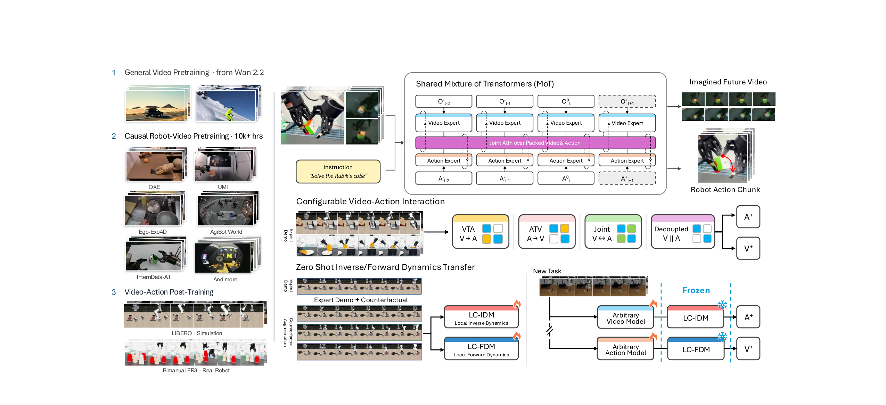
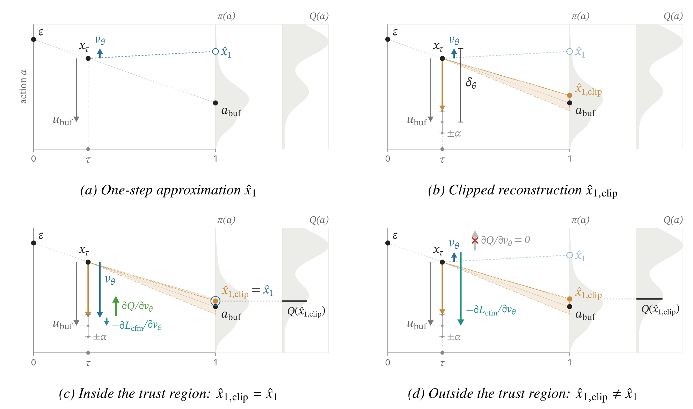
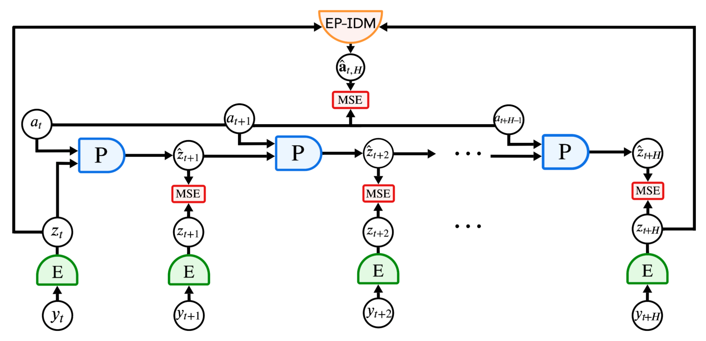
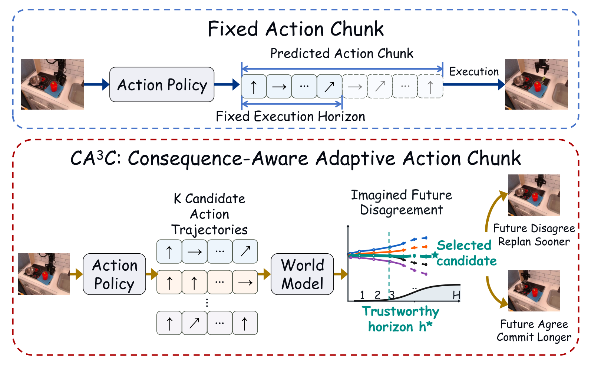
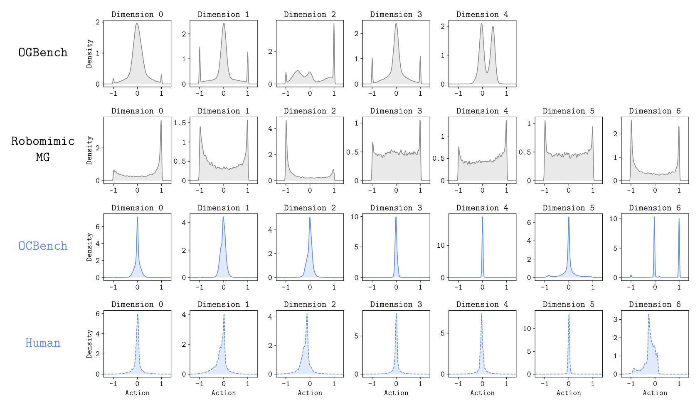

# 2026-10-07 Embodied AI & World Models Daily

> 面向具身智能 / Robotics 研究员与工程师的研究与工程资讯。
>
> 检索窗口：主窗口 2026-10-07 00:00–23:59（北京时间）；补充窗口回溯至 2026-10-05 00:00。**arXiv 公告说明**：本次运行（北京 10-08 01:00 = ET 10-07 17:00）可检索到 **周三 ET 公告批次（实际提交北京 10-05 02:15 – 10-07 02:00，即周日/周一/周二 ET 日间提交）**——该批 cs.RO/AI/LG/CV 合并去重后共 58 条进入窗口（补充窗口 44 条、主窗口 10-07 00:00–02:00 尾巴 14 条），已逐条打开 abs 页核实 v1 UTC→北京时间与摘要。**主窗口 10-07 日间与 10-08 的 arXiv 新投稿（周四 ET 批次）本次运行不可见，明日日报回补。** 项目页 / GitHub / Hugging Face / HN 均已实际访问核实；全部条目按 T1（一手源）标准收录。

## 🔥 今日必读

### 1. 【世界模型】OpenWAM：把视频-动作交互变成共享骨干上的可配置变量——Stanford 开源框架，LIBERO-Long 68.4→97.8

**来源：** [arXiv:2610.07922v1](https://arxiv.org/abs/2610.07922)（cs.RO 交叉 cs.CV；Stanford University，Heng Yu* · David D. Yuan* · Juze Zhang* · Li Fei-Fei · Jiajun Wu · Ehsan Adeli）  
**类型：** Paper（research_paper）  
**发布时间：** 实际提交 2026-10-06 16:02（北京时间，补充窗口）  
**评分：** 89/100  
**关键词：** World-Action Model · Mixture-of-Transformers · 反事实转移监督 · 组件可组合性

**一句话：**  
WAM 系统各自同时改骨干/数据/目标/推理四件事导致设计不可比——OpenWAM 给出共享因果骨干（Wan2.2-5B + 334 万轨迹机器人视频预训练、不用动作标签）+ 共享 MoT 架构上的**四种可配置交互程序**（Joint/VTA/ATV/Decoupled，只改生成交序与跨模可见性）+ 独立训练的局部上下文 IDM/FDM 接口；初始化消融显示机器人-视频预训练一项 +29.4 点，反事实监督让**冻结**局部 IDM 在视觉预测器换任务后 21.5%→84.0%。

**技术要点：**

- **chunk-causal 预测目标**：Wan2.2 原本非时间因果，OpenWAM 约束未来 chunk 只见当前/先前/已生成 chunk——非因果视频骨干改造成策略底座的最小改动模板，保留独立视频预测接口。
- 334 万轨迹 / 14.64k 小时预训练语料（OXE 49 数据集 + AgiBot + RoboMIND + InternData-A1 等 9 源），32×B200×14 天；四种程序在同一骨干/tokenization/flow-matching 目标/评测协议下闭环成功率全部 96.8–98.8——**此前各家系统的差异主要来自骨干与数据而非交互结构**。
- **组件可组合性实验（本批最有信息量）**：四个 LIBERO-90 目标上，视觉预测器换任务微调、源训练 IDM 冻结——demo-only 局部 IDM 21.5% vs mixed 反事实监督 84.0%/CF-only 84.5%；matched 监督下局部条件比全上下文高 37.0 点且源任务保持 94.4%。
- 动作条件 FDM：CF-only 降 RGB MSE 34.5%，**K=16 结果辨识 21.1%→71.3%**（动作依赖未来的建模能力来自监督覆盖而非架构）；真机 2×FR3 双臂 92.1/91.9 均值。

**为什么值得关注：**  
这是 WAM 竞争从「拼架构」彻底转向「受控比较」的标志版：注意力掩码语言（图 3）把生成交序与跨模可见性变成可读的设计自由度，反事实分支数据（不需要成对损失、不需要任务成功标签）是让 IDM/FDM 可跨视觉预测器复用的配方。对做 WAM 系统的人，这是目前唯一能在受控条件下回答「耦合结构到底值几个点」的公开 testbed。

**资源：**

- Paper：[arXiv 摘要页](https://arxiv.org/abs/2610.07922)
- Project：[项目页](https://openwam.stanford.edu)
- Code：[GitHub](https://github.com/OpenWAM/OpenWAM)（2026-06-04 发布，126★）
- Weights：未在 abs 页发现独立权重仓库
- Discussion：暂未发现高质量社区讨论（公开 <48h）

---

### 2. 【强化学习】QF3：off-policy 流策略 RL 的速度空间信任域——首个从零训人形并零样本上硬件，比 on-policy 快 10×

**来源：** [arXiv:2610.08789v1](https://arxiv.org/abs/2610.08789)（cs.RO 交叉 cs.LG；UC Berkeley / Amazon FAR，Chung Min Kim · Brent Yi · Pieter Abbeel · Angjoo Kanazawa 等 10 人）  
**类型：** Paper（research_paper）  
**发布时间：** 实际提交 2026-10-07 01:59（北京时间，主窗口）  
**评分：** 82/100  
**关键词：** Flow Policy RL · Trust Region · Off-Policy · Humanoid Sim-to-Real

**一句话：**  
off-policy 流 RL 的不稳定来自 **critic 被查询的位置**（一步预测的动作漂离 replay 动作掉进高估区）——QF3 把 critic 梯度关进速度空间信任域：逐坐标裁剪策略-缓冲区间隙到 ±α，critic 只在 replay 动作 (1−τ)α 邻域被查询，饱和维度的 Q 梯度被掩蔽而 CFM 项继续全量拉回；Holosoma G1 上 29-DoF 从零训练、**零样本部署真机**（LAFAN 3 分钟动态序列），wall-clock 比 on-policy FPO++ 快 10×。

**技术要点：**

- 分离设计：Q 项看**裁剪后**端点 $\hat{x}_{1,clip}=a_{buf}+(1-\tau)\mathrm{clip}(\delta_\theta)$，CFM 项惩罚**未裁剪**原始间隙——信任域内策略改进、界外行为拉回、重入界内自动恢复。
- 机制消融三发现：unclamped 在 10× 更低学习率下仍崩塌；速度界优于动作界（$\alpha/(1-\tau)$ 会在 τ→1 处放任任意大速度修正、流场高曲率）；裁剪全程有效（维度在界内比例 74/83/85%@50k/250k/500k 步）。
- **只替换 FastTD3 训练循环里的 actor**——replay/分布式 critic/目标更新/并行环境全共享，这是 10× 加速的工程根源；运动跟踪 0.5 小时 wall-clock 达满长 episode。
- ABC-VLA 微调只训 229k 参数 LoRA：Bottles 91%→95% 且快 22%、Dishrack 丢板率 8% vs 21%；λ_base 锚对稳定微调必要。

**为什么值得关注：**  
流/扩散策略的 RL 改进此前只有「冻结先验+残差」和「on-policy 策略梯度」两条路——QF3 证明了第三条（off-policy 直接训）只要管好 critic 查询点就稳定。「速度空间信任域 + 未裁剪 CFM 惩罚」可搬进任何 off-policy 流/扩散策略训练器；对做人形 locomotion 的人，这是第一个能复用的从零到真机的流 RL 配方。

**资源：**

- Paper：[arXiv 摘要页](https://arxiv.org/abs/2610.08789)
- Project：[项目页](https://qf3-rl.github.io/)（标注 Code Soon）
- Code：页面引用 amazon-far/abc 与 holosoma 生态仓，本工作仓库暂未放出
- Weights：暂无
- Discussion：暂未发现高质量社区讨论（公开 <48h）

---

### 3. 【世界模型】DepthWorld：联合因子图把 DROID 升级成监督级 3D 语料——深度监督反提 RGB +1.48 dB（CoRL 2026）

**来源：** [arXiv:2610.08780v1](https://arxiv.org/abs/2610.08780)（cs.RO 交叉 cs.AI/cs.CV；CIIRC CTU Prague，Jai Bardhan · Josef Šivic · Vladimír Petrík）  
**类型：** Paper（research_paper / conference_result）  
**发布时间：** 实际提交 2026-10-07 01:59（北京时间，主窗口）  
**评分：** 81/100  
**关键词：** 3D World Model · Joint Factor Graph · Spatial Latent Tiling · DROID-3D

**一句话：**  
视频世界模型只在 RGB 上训练导致 rollout 几何内部不连贯（跨视角深度矛盾、接触/遮挡几何推理出错）——DepthWorld 两件套解决：**联合因子图校准管线**（汇集同一机器人全部 episodes 恢复共享运动学参数+逐场景外参，比 PointWorld 式逐场景基线好 8–23×、无失败模式）把 DROID 变成 7 万 episodes 的 DROID-3D；**空间潜平铺**（RGB 与 depth 并排进同一潜网格、只扩位置嵌入、VAE 原封不动）联合预测多视角 RGB+depth——深度监督把 RGB 预测本身提升 +1.48 dB。

**技术要点：**

- 校准：EE 重投影 0.25 px vs 逐场景 5.84 px（23×）；GT 板对照外参 4.9 mm/0.39° 中位、关节偏移 0.14°——逐场景基线 72 mm/3.0° 且 18% 场景不收敛；逐因子消融确认共享手眼/关节偏移参数是跨场景约束的载体。
- 72×80 联合潜网格（3 视角 × RGB/depth tile 各 24×40），11 帧窗口 @5Hz；架构消融：平铺 23.66 dB 优于双分支 21.94 / 通道扩展 22.22——不破坏 SVD 先验的最小改动最强。
- 机器人系 DPT 点图头（VGGT 初始化、置信度加权）做跨视角正则：跨视角重投影 +1.0 dB、深度分歧降 2.6 mm。
- **本批最扎眼的负结果**：深度源消融——ZED ULTRA 稀疏噪声深度把 AbsRel 0.074→0.194 且 **RGB 也被拖累 2.0 dB（监督完全没变）**；S2M2 与 ZED NEURAL 相关 0.97 产出几乎相同模型。深度源质量不是中性选项。

**为什么值得关注：**  
「learned stereo + URDF 渲染 grounding + 联合因子图」是把任何带 URDF 的多视角遥操作数据集升级为机器人系 3D 监督语料的模板；空间潜平铺适用于任何 SVD 系骨干加模态场景（Ctrl-World 权重直接初始化）。对做世界模型的人，「深度监督提升 RGB 本身」这条把 3D 监督的收益算清楚了。

**资源：**

- Paper：[arXiv 摘要页](https://arxiv.org/abs/2610.08780)
- Project：[项目页](https://www.jaibardhan.com/depthworld)
- Code：[GitHub](https://github.com/Jai2500/depthworld)
- Weights：[Hugging Face](https://huggingface.co/jaibrdhn/depthworld)；DROID-3D 外参：[Hugging Face](https://huggingface.co/datasets/jaibrdhn/droid_3d_extrinsics)
- Discussion：暂未发现高质量社区讨论（公开 <48h）

---

### 4. 【世界模型】Unstable-Modes JEPA：LeCun 团队证明 JEPA 会丢掉全部不稳定模态——EP-IDM 端点逆动力学补上，CartPole 潜 LQR 0%→100%

**来源：** [arXiv:2610.07540v1](https://arxiv.org/abs/2610.07540)（cs.RO 交叉 cs.LG；Columbia / Meta FAIR / Flatiron Institute，Leonardo F. Toso · **Yann LeCun** · James Anderson · Oumayma Bounou）  
**类型：** Paper（research_paper）  
**发布时间：** 实际提交 2026-10-06 08:08（北京时间，补充窗口）  
**评分：** 81/100  
**关键词：** JEPA · Inverse Dynamics · Unstable Modes · Control-Aware Representation

**一句话：**  
JEPA 的标准配方「下一步预测 + 防坍缩正则」**可以在编码器丢弃全部不稳定模态的情况下把损失降到最小**（Lemma 2 构造性证明）——表征在训练分布上不坍缩、动力学预测也准，却设计不出稳定的潜反馈控制器；EP-IDM 从端点潜状态对 $(z_t, z_{t+H})$ 重建动作序列，Theorem 1 证明精确重建使编码器在 H 步可达子空间上单射，Theorem 2 证明可控性 Gramian 主特征空间随 H 收敛到不稳定子空间——**罚的量与需要保留的量指数级对齐**。

**技术要点：**

- 受控对照干净利落：同一编码器同一预测器只换正则项——SIGReg 组 CartPole 潜 LQR **0%**（状态范数无界）、EP-IDM 组 **100%**（MFS 0.999）；CEM/GBP 非线性规划器两组都能工作，**失效只出现在需要精确局部线性化的 LQR 上**。
- Walker2D 步态极限环：EP-IDM 保留环结构（iCEM 2.91 m/s、9.15 m 位移 vs GT 3.61/14.43），SIG 组近零位移、解码步态紊乱。
- PointMaze（无不稳定模态）：全部动作重建变体 CEM ≥90%——不伤稳定系统；三个硬边界：冻结 DINOv2 只有 CEM 50%/LQR 20%、**去掉本体感知全部规划器归零**（像素+短上下文恢复不了速度信息）、仅本体感知时 MLP 预测器 0.204 vs Transformer+EP-IDM 80%（表征充分性 ≠ 局部预测器拟合）。

**为什么值得关注：**  
与 H-JEPA（slow-feature collapse）、AVL-JEPA（信息坍缩）拼出 JEPA 失效模式三联——本篇补「控制论信息」这一维，且给出可操作判据：**任何潜世界模型用于反馈控制前，先问编码器保留不稳定模态了吗（动作重建损失）**。EP-IDM 只需端点对、实现成本低，可直接加进任何 JEPA 训练器。理论仅线性系统、非线性是实证外推——边界清晰。

**资源：**

- Paper：[arXiv 摘要页](https://arxiv.org/abs/2610.07540)
- Project：未在 abs 页找到项目页链接
- Code：未找到可确认的公开代码仓库
- Weights：暂无
- Discussion：暂未发现高质量社区讨论（公开 <48h）

---

### 5. 【模仿学习与策略】CA³C：执行视野由想象未来的分歧决定——BIC 变点免阈值，LIBERO-Plus 相对失败率降 61.3%

**来源：** [arXiv:2610.07949v1](https://arxiv.org/abs/2610.07949)（cs.RO；Yuyan Li 等 11 人）  
**类型：** Paper（research_paper）  
**发布时间：** 实际提交 2026-10-06 16:23（北京时间，补充窗口）  
**评分：** 78/100  
**关键词：** Action Chunking · World Model · Bayesian Change-Point · 推理时方法

**一句话：**  
动作 chunk 执行多长的 prefix 不该由动作空间相似度决定（不同动作可同结局、相近动作可异结局）——CA³C 在推理时用冻结世界模型对 K 个候选 chunk **共享同一初始噪声**想象配对未来，相对分歧 $U_k=D_k/(M_k+\varepsilon)$ 度量候选依赖发散份额，BIC 比较单直线 vs 铰链模型找变点定 h*，共识成本选执行候选；**不改不训基策略**，三策略（GR00T N1.7/π0/π0.5）LIBERO-Plus 相对失败率降 61.3%/30.5%/45.4%。

**技术要点：**

- 共享噪声是关键实验设计：随机世界模型下独立采样的未来混杂「动作差异」与「预测器自身差异」——同一次重规划内 ε⁽¹⁾=…=ε⁽ᴷ⁾ 得到只差动作 chunk 的配对想象（比训 N 个动力学拿 ensemble 分歧便宜得多）。
- BIC 变点（非负斜率增量 c≥0 防下行弯折误判）：只有变点证据足以 justify 额外模型复杂度才提前重规划——跨任务潜尺度差异被模型复杂度惩罚吸收，**免掉绝对阈值**。
- 组件消融：仅自适应视野贡献 26.9% 相对降幅 > 仅共识选择；h* 分布均值 8.49（5,141 事件）、主体落 8–10——真正的状态依赖，同一 episode 内按任务阶段切换（精对齐 h*=4 → 运输 5 → 关门 10）。
- 真机 AgiBot G2：78→82 / 56→62；适用边界论文自己列了：需要候选多样性（近确定性策略无变异可比）+ 动作敏感世界模型（不敏感→假一致、不准→假分歧）。

**为什么值得关注：**  
「执行承诺」问题（chunk 执行多长）此前全部从动作生成过程取置信度——CA³C 把它移到后果空间，与昨天 Vela（连续轨迹表征）、CA³C 同属「动作接口」工程的另一端。BIC 免阈值设计可搬进任何「分歧/不确定度随视野增长」的可信视野决策；对部署 VLA 的人这是零训练成本的推理时增强。

**资源：**

- Paper：[arXiv 摘要页](https://arxiv.org/abs/2610.07949)
- Project：未在 abs 页与正文找到项目页链接
- Code：未找到可确认的公开代码仓库
- Weights：暂无
- Discussion：暂未发现高质量社区讨论（公开 <48h）

---

## 📄 论文雷达

> 以下 7 篇为窗口内实际提交（周三 ET 批次），已逐条打开 abs 页核实，按双评分均分降序。

### 【VLA与基础模型】CoRP：48.9M 参数匹配 40–163× 大系统——「视觉表征才是全部，规模与生成先验无关」

**来源：** [arXiv:2610.08183v1](https://arxiv.org/abs/2610.08183)（cs.RO 交叉 cs.AI/cs.LG）  
**关键词：** Compact Policy · Visual Representation · 单变量消融  
**核心贡献：** 刻意压缩的策略（48.9M、无 VLM、无视频生成先验）达 LIBERO 97.0 / RoboTwin 2.0 75.78——固定动作生成器逐个换表征属性：预训练初始化决定性（随机 ViT-S 掉到 78.1）、冻结编码器 −19.8 点、每视角重采样到 48 token 优于全 patch（97.0 vs 83.2）、变分信息瓶颈反而毁掉指令依赖的 token 选择（95.8→33.0）。**语言条件化只在观测歧义时有贡献**。  
**值得关注程度：** 76/100  
**Paper：** [arXiv 摘要页](https://arxiv.org/abs/2610.08183)

### 【操作与抓取】ReDex：手指级柔顺交互修复 sim-to-real 灵巧策略——物体翻转 14%→86%

**来源：** [arXiv:2610.07525v1](https://arxiv.org/abs/2610.07525)（cs.RO；Jinzhou Li · Roberto Martín-Martín · Nima Fazeli 线）  
**关键词：** Dexterous Manipulation · Tactile Feedback · 人机协作采集  
**核心贡献：** 仿真训练的灵巧策略 transfer 失败源于接触时机与力调节误差——ReDex 让人类操作员在真机 rollout 中**柔顺控制地纠正选定的手指**、冻结的基策略控制其余手指，从这些 rollout 重建力条件目标训出独立的力条件策略：Object Flipping 14%→86%、Screwdriver Rotation 进度 26.0%→95.3%，**不需要触觉仿真或全手遥操作**。  
**值得关注程度：** 75/100  
**Paper：** [arXiv 摘要页](https://arxiv.org/abs/2610.07525)

### 【VLA与基础模型】ViDAL：视觉动力学接地的动作潜空间——π0.5 RoboTwin 54.3→65.5，真机 +20/+23.4 点

**来源：** [arXiv:2610.08150v1](https://arxiv.org/abs/2610.08150)（cs.RO；Yuan Xu 等 13 人）  
**关键词：** Action VAE · Future Scene Dynamics · 即插即用动作接口  
**核心贡献：** 现有动作表征只建模轨迹、不考虑动作诱导的视觉动力学——ViDAL 训 Action VAE 重建动作 chunk 同时把潜变量对齐未来场景动力学；作为即插即用接口兼容多种 VLA 架构，LIBERO 98.1、π0.5 多任务 RoboTwin 2.0 54.3→65.5（Clean）/33.2→43.1（Random），真机 Franka/ARX +20.0/+23.4 点。  
**值得关注程度：** 74/100  
**Paper：** [arXiv 摘要页](https://arxiv.org/abs/2610.08150）

### 【VLA与基础模型】IronMan：信息瓶颈蒸馏视频特征——LIBERO 99.0，OOD 超最强基线 10.4 点

**来源：** [arXiv:2610.07961v1](https://arxiv.org/abs/2610.07961)（cs.RO；Yuanshuo Zhang · Siheng Chen 线）  
**关键词：** Information Bottleneck · OOD Robustness · Dynamics-Aware  
**核心贡献：** 视频表征天然不适合动作生成（过多视觉细节伤泛化）——IronMan 用动力学感知瓶颈把噪声纠缠的单步视频特征蒸馏成紧凑世界表征：LIBERO 99.0、RoboTwin clean2clean 79.4 全超基线，LIBERO-Plus OOD 79.1（超最强基线 10.4 点），保持高效推理。  
**值得关注程度：** 74/100  
**Paper：** [arXiv 摘要页](https://arxiv.org/abs/2610.07961）　**Code：** [GitHub](https://github.com/youngsoul0731/IronMan)（2026-09-30 建仓）

### 【数据与Benchmark】GaugeBench：同一机器人换个等价描述就崩——4030.6 → 51.6

**来源：** [arXiv:2610.07597v1](https://arxiv.org/abs/2610.07597)（cs.RO 交叉 cs.LG；UC Irvine 线，Rahath Malladi 等）  
**关键词：** Representation Robustness · Morphology-Aware Policy · 规范约定  
**核心贡献：** 跨本体评测换机器人不换约定——但**固定机构只换物理等价的描述约定**（关节轴方向/零位/链接顺序）时：三个 MetaMorph 策略 80 个熟悉机器人 4030.6 分，等价重描述后只剩 51.6（真新机器人 1489.6）——**新描述比新机器人更伤**；轴反转单独复现崩塌、零位几乎无害；等价轴约定增广把保持率 3.6%→80.6%。机制鲁棒性 ≠ 表征鲁棒性，两者都该测。  
**值得关注程度：** 74/100  
**Paper：** [arXiv 摘要页](https://arxiv.org/abs/2610.07597)

### 【强化学习】Latent Disturbances：潜空间鲁棒决策——conformal 校准不确定集 + 博弈优化，真机失败率降 70%

**来源：** [arXiv:2610.07599v1](https://arxiv.org/abs/2610.07599)（cs.RO 交叉 cs.AI/cs.LG；CMU 线，Junwon Seo · Andrea Bajcsy）  
**关键词：** Robust Optimization · Conformal Prediction · Game-Theoretic  
**核心贡献：** 学习潜空间里怎么定义「可信的扰动」？——用动力学感知相似度 + OOD 检测构造可信潜动力学集合、conformal prediction 校准不过度悲观、博弈优化联合优化鲁棒动作与最坏扰动；Franka 真机安全过滤失败率降 70%、采样式策略引导降 54%。  
**值得关注程度：** 74/100  
**Paper：** [arXiv 摘要页](https://arxiv.org/abs/2610.07599)

### 【操作与抓取】EigenDEXplore：人类运动先验用于结构化探索而非改动作空间——多灵巧手一致增益

**来源：** [arXiv:2610.07681v1](https://arxiv.org/abs/2610.07681)（cs.RO 交叉 cs.AI；Stanford，Harsh Gupta · C. Karen Liu · Jeannette Bohg · Shuran Song）  
**关键词：** Dexterous Exploration · Human Priors · 协调关节运动  
**核心贡献：** 独立关节扰动难以发现协调行为、学习低维动作空间又限制表达——实验发现人类运动先验**用于结构化探索最有效**（沿人类导出特征向量加扰动、动作空间不变）：多灵巧手抓取/手内重定向/接触富任务一致超越基线，增益在少奖励塑形/少课程时最大，跨无结构与参考引导 RL、轨迹优化、sim-to-real。  
**值得关注程度：** 74/100  
**Paper：** [arXiv 摘要页](https://arxiv.org/abs/2610.07681）　**Project：** [项目页](https://eigendexplore.github.io/)　**Code：** [GitHub](https://github.com/hgupt3/eigendexplore)（2026-10-06 建仓）

---

## 🛠 工程与开源

### OpenWAM 官方实现（[GitHub](https://github.com/OpenWAM/OpenWAM)）

Wan2.2-5B 因果机器人-视频骨干 + 共享 MoT + 四种交互程序 + LC-IDM/LC-FDM 的完整训练/推理代码与项目页（[openwam.stanford.edu](https://openwam.stanford.edu)），2026-06-04 即放出、126★。详见必读 #1——`programs` 配置（Joint/VTA/ATV/Decoupled）与反事实数据采集协议是可直接复用的部分。

### DepthWorld 全家桶（[GitHub](https://github.com/Jai2500/depthworld) + [Hugging Face](https://huggingface.co/jaibrdhn/depthworld)）

代码 + 模型权重 + **DROID-3D 标定外参数据集**（[Hugging Face](https://huggingface.co/datasets/jaibrdhn/droid_3d_extrinsics)）三件套全部开放，CoRL 2026。校准管线可以脱离世界模型单独用——任何带 URDF 的多视角遥操作数据集都能升级出度量深度+机器人系外参。

### OCBench（[GitHub](https://github.com/seohongpark/ocbench)，71★）

Berkeley 的 GPU 加速 BC benchmark：MJWarp 单 H100 最高 200K steps/s、28 任务五环境族、类人脚本策略（Hermite 样条 + 可控旋钮：速度/错误率/覆盖度）。做 BC 现象学研究的直接载体（完整精读笔记见 bundle）。

### QF3 生态位（[项目页](https://qf3-rl.github.io/)）

Code Soon；页面引用 [amazon-far/abc](https://github.com/amazon-far/abc)（ABC-Sim/VLA 生态）与 [holosoma](https://github.com/amazon-far/holosoma)（人形全身 RL 框架）——后者是复现 QF3 locomotion 结果的依赖栈，值得先跑通。

---

## 💬 社区信号

> 本窗口（周三 ET 批次）论文公开 <48h，社区讨论整体清淡；HN 具身相关高热帖缺位。值得继续观察的信号：

- **「WAM 该怎么耦合」的公开 testbed 出现**：OpenWAM 把生成交序与跨模可见性变成注意力掩码语言（图 3），与本批 DepthWorld（几何监督）、IronMan（信息瓶颈）构成三条正交的「给 WAM 加约束」路线——与上周 FLEX-WAM（梯度均衡）、SimForcing（潜差分蒸馏）的协议层竞争汇流，**「受控比较」正在取代「各自拼架构」成为 WAM 论文的默认写法**。
- **JEPA 失效模式图谱本周集齐三块**：Unstable-Modes-JEPA（控制论信息，LeCun 线）+ 上周 H-JEPA（slow-feature collapse）+ AVL-JEPA（信息坍缩）——「确定性、边际正则、纯预测目标」三个 JEPA 默认设定各被一篇击破，EP-IDM 的「动作重建损失」是三者中唯一给出可操作判据的。
- **GitHub 新仓监控**：[iitimii/SmolWAM](https://github.com/iitimii/SmolWAM)（10-07 建仓，0.88B 潜空间 WAM 上边缘设备——端侧 WAM 线出现社区复现苗头）与 [qingh097/lacwm-project](https://github.com/qingh097/lacwm-project)（跨本体基础世界模型项目页）均 <48h 新建，星数尚低、后续观察。

---

## 🔎 补充窗口筛选记录

> 周三 ET 公告批次（cs.RO/AI/LG/CV 合并）中，v1 实际提交北京 10-05 02:15 – 10-07 02:00 的 58 条进入候选池（补充窗口 44 + 主窗口尾巴 14）；10-05 02:15 前与周四批次条目逐条排除如下（均已打开 abs 页核实 v1 UTC→北京时间）。

| 条目 | 实际时间（北京时间） | 排除/处理原因 |
|---|---|---|
| [arXiv:2610.07922v1](https://arxiv.org/abs/2610.07922) OpenWAM | 10-06 16:02 | 窗口内 → 已收录（必读 #1，精读完成） |
| [arXiv:2610.08789v1](https://arxiv.org/abs/2610.08789) QF3 | 10-07 01:59 | 主窗口 → 已收录（必读 #2，精读完成） |
| [arXiv:2610.08780v1](https://arxiv.org/abs/2610.08780) DepthWorld | 10-07 01:59 | 主窗口 → 已收录（必读 #3，精读完成） |
| [arXiv:2610.07540v1](https://arxiv.org/abs/2610.07540) Unstable-Modes JEPA | 10-06 08:08 | 窗口内 → 已收录（必读 #4，精读完成） |
| [arXiv:2610.07949v1](https://arxiv.org/abs/2610.07949) CA³C | 10-06 16:23 | 窗口内 → 已收录（必读 #5，精读完成） |
| [arXiv:2610.07056v1](https://arxiv.org/abs/2610.07056) OCBench | 10-05 12:33 | 窗口内 → 已收录（精读 #6，见工程与开源节） |
| [arXiv:2610.08183v1](https://arxiv.org/abs/2610.08183) CoRP | 10-06 19:36 | 窗口内 → 已收录（雷达 #1） |
| [arXiv:2610.07525v1](https://arxiv.org/abs/2610.07525) ReDex | 10-06 07:47 | 窗口内 → 已收录（雷达 #2） |
| [arXiv:2610.08150v1](https://arxiv.org/abs/2610.08150) ViDAL | 10-06 19:02 | 窗口内 → 已收录（雷达 #3） |
| [arXiv:2610.07961v1](https://arxiv.org/abs/2610.07961) IronMan | 10-06 16:30 | 窗口内 → 已收录（雷达 #4） |
| [arXiv:2610.07597v1](https://arxiv.org/abs/2610.07597) GaugeBench | 10-06 09:37 | 窗口内 → 已收录（雷达 #5） |
| [arXiv:2610.07599v1](https://arxiv.org/abs/2610.07599) Latent Disturbances | 10-06 09:38 | 窗口内 → 已收录（雷达 #6） |
| [arXiv:2610.07681v1](https://arxiv.org/abs/2610.07681) EigenDEXplore | 10-06 11:15 | 窗口内 → 已收录（雷达 #7） |
| [arXiv:2610.08640v1](https://arxiv.org/abs/2610.08640) RIWANav | 10-07 00:33 | 主窗口，WM 评估策略动作想象反馈 GRPO + 自课程递归自改进 → 与 OpenWAM 的组件可组合性、RIWANav 的递归闭环同题（WM-policy 共适应），单组规模小，列观察 |
| [arXiv:2610.08627v1](https://arxiv.org/abs/2610.08627) PPWM | 10-07 00:26 | 主窗口，并行因果轨迹预测替代自回归 rollout（CEM 提速 3×）→ 与 RealtimeWAM 的块级流水线同题（长视野并行化），列观察 |
| [arXiv:2610.08791v1](https://arxiv.org/abs/2610.08791) WM Last Exam in Physics | 10-07 01:59 | 主窗口，40 个测量型物理一致性任务（最佳模型 57.76/100）→ 与 GaugeBench 竞争评测名额，列观察 |
| [arXiv:2610.08720v1](https://arxiv.org/abs/2610.08720) WorldSolver | 10-07 01:26 | 主窗口，LLM agent 生成求解器复现物理现象（168 任务自 CG 论文）→ 仿真器侧贡献、具身落点间接，列观察 |
| [arXiv:2610.07355v1](https://arxiv.org/abs/2610.07355) Tracking-Not-Permanence | 10-06 04:22 | 窗口内，V-JEPA 2 对被藏物体的保持（3000 步预测器训练装回持久性先验）→ 与 Unstable-Modes-JEPA 同题（JEPA 诊断），但单机构规模小、下期合并成 JEPA 专题 |
| [arXiv:2610.07381v1](https://arxiv.org/abs/2610.07381) GeoWM | 10-06 04:52 | 窗口内，几何基础模型直接预测未来场景几何（免 rollout）→ 与 DepthWorld 同题（显式几何监督），驾驶落点为主，列观察 |
| [arXiv:2610.07594v1](https://arxiv.org/abs/2610.07594) BiGym 2.0 | 10-06 09:33 | 窗口内，G1 20 家务任务 benchmark（VLA 微调最高九任务均值）→ 与 OCBench 竞争评测名额；数据已开源，列观察 |
| [arXiv:2610.07652v1](https://arxiv.org/abs/2610.07652) SMART | 10-06 10:47 | 窗口内，铰接物体操作 100 万演示合成预训练（零样本 sim-to-real）→ 与 SMART-Sim 同线数据飞轮，31 页技术报告，下期合并评 |
| [arXiv:2610.07969v1](https://arxiv.org/abs/2610.07969) EmbodiedSmith | 10-06 16:34 | 窗口内，场景-任务联合自改进的数据生成飞轮（支持人形/灵巧手/可变形流体）→ 与 SMART 同题（仿真数据引擎），下期合并评 |
| [arXiv:2610.08119v1](https://arxiv.org/abs/2610.08119) AutodidactWAM | 10-06 18:39 | 窗口内，生成视频上跑手姿估计器自蒸馏动作（Cosmos 3 LoRA 适配 G1+BrainCo 手）→ WAM 适配线证据强但单机器人验证，列观察 |
| [arXiv:2610.08220v1](https://arxiv.org/abs/2610.08220) VOMMI | 10-06 20:10 | 窗口内，便携 RGB 演示的 VO 条件移动操作接口 → 数据采集端工程贡献，列观察 |
| [arXiv:2610.08425v1](https://arxiv.org/abs/2610.08425) MIM-VLA | 10-06 22:28 | 窗口内，夹爪电机反馈编码 128 维交互 token（免触觉阵列）→ 与 ReDex 同题（力/触觉进入 VLA），规模小，列观察 |
| [arXiv:2610.08320v1](https://arxiv.org/abs/2610.08320) Humanoid Horizon | 10-06 21:22 | 窗口内，全身 loco-manip 长视野（并行训练流+动态起步+奖励门控）→ 人形线竞争条目多，下期合并评 |
| [arXiv:2610.08339v1](https://arxiv.org/abs/2610.08339) DT-R2S2R | 10-06 21:36 | 窗口内，数字孪生驱动的 Real2Sim2Real 生成增广 → 驾驶落点为主，BLOCK（无泛化机器人方法贡献） |
| [arXiv:2610.08350v1](https://arxiv.org/abs/2610.08350) SufficientPlan | 10-06 21:40 | 窗口内，WM 规划的预算认证与上下文复用 → 与 PPWM 同题（规划效率），工程贡献，列观察 |
| [arXiv:2610.08777v1](https://arxiv.org/abs/2610.08777) CtrlCache | 10-07 01:57 | 主窗口，交互视频世界模型的控制感知缓存（动作变化触发结构相似度降）→ 与 RealtimeWAM 同题（推理加速），列观察 |
| [arXiv:2610.08773v1](https://arxiv.org/abs/2610.08773) AdvSim2Real | 10-07 01:56 | 主窗口，冻结 web 世界模型内共演化课程+注入对手+agent → 落点为 web agent 安全、具身相关度中等，列观察 |
| [arXiv:2610.08782v1](https://arxiv.org/abs/2610.08782) 4D-HOF | 10-07 01:59 | 主窗口，前馈 4D 手-物交互重建（流匹配 + 测试时引导）→ 重建类、无决策落点，BLOCK |
| [arXiv:2610.08784v1](https://arxiv.org/abs/2610.08784) PEARS | 10-07 01:59 | 主窗口，物理先验引导的触觉操作高效适配 → 与 ReDex/MIM-VLA 同题（触觉适配），列观察 |
| [arXiv:2610.08659v1](https://arxiv.org/abs/2610.08659) Selective-RL | 10-07 00:43 | 主窗口，RL 更新的选择性跨模型迁移（主导方向保留幅度）→ VLM 落点、具身相关度中等，列观察 |
| [arXiv:2610.08432v1](https://arxiv.org/abs/2610.08432) EMHO | 10-06 22:30 | 主窗口，冻结模型只优化 agent harness（经验轨迹迭代修订）→ agent 工程线，列观察 |
| [arXiv:2610.08446v1](https://arxiv.org/abs/2610.08446) AssemState | 10-06 22:35 | 主窗口，说明书+物理状态引导的零样本家具装配（SE(3) 迭代修正）→ 任务级系统、方法增量中等，列观察 |
| [arXiv:2610.08400v1](https://arxiv.org/abs/2610.08400) Atom-JEPA | 10-06 22:13 | 窗口内，3D 原子体系的 JEPA 预训练 → 材料/化学落点，非具身，BLOCK |
| [arXiv:2610.07609v1](https://arxiv.org/abs/2610.07609) PhysLDM | 10-06 09:53 | 窗口内，体网格变形的时空潜扩散仿真 → 图形学仿真落点、决策用途弱，BLOCK |
| [arXiv:2610.08068v1](https://arxiv.org/abs/2610.08068) PhysTacGen | 10-06 18:00 | 窗口内，物理感知视觉-触觉图像生成 → 数据增广线，与 VICON 同题下期合并评 |
| [arXiv:2610.07028v1](https://arxiv.org/abs/2610.07028) Identifiable WM | 10-05 02:15 | 窗口内最早条目，扩散表征的可辨识世界模型 → 理论贡献、单组规模小，列观察 |
| [arXiv:2610.07031v1](https://arxiv.org/abs/2610.07031) Artemis | 10-05 02:54 | 窗口内，共享 3D 状态的多智能体驾驶世界模型 → 驾驶落点为主，BLOCK（无泛化机器人贡献） |
| [arXiv:2610.07056 之外 Tue 块新增] | — | 周二块仅 1 条 v1 > 昨日覆盖上界（[arXiv:2610.06852](https://arxiv.org/abs/2610.06852) 流程图重排，非具身，BLOCK）；另有约 90 条 v1 属 10-05 02:15 前提交或经核实属 cs.AI/LG/CV 纯非具身条目（纯 LLM agent、非具身 RL、纯感知重建、纯生成无 action 落点等），逐条判断后不赘 |

---

## 📊 今日技术趋势

今天 58 条窗口内条目最显眼的是 **WAM 研究的「受控比较」范式成形**。OpenWAM 用共享骨干把生成交序与跨模可见性变成注意力掩码语言层面的设计自由度（四种程序全部 96.8–98.8——此前各家系统的差异主要来自骨干与数据而非交互结构），DepthWorld 把「深度监督提升 RGB 本身」算成了干净的账（+1.48 dB 同预算对照），IronMan 用信息瓶颈给同一个问题加第三条正交约束——**三条线不约而同把「给 WAM 加什么约束」从直觉争论变成单变量消融**，且都开源了完整代码。叠加工程区的 SmolWAM（0.88B 端侧），WAM 的「怎么训」之争基本收官，下一战场是组件可组合性（OpenWAM 的冻结 IDM 迁移 21.5→84.0 是本批最好的示范）。

第二条主线是 **「策略该信任自己多久」从动作空间移到后果空间**。CA³C 用想象未来的分歧（BIC 变点免阈值）决定执行视野、OCBench 在受控环境复现「开环吊打闭环」（randomly-delayed 策略强性能证明复合误差解释不了全部）——加上 QF3 在 RL 侧的「critic 只在 replay 动作邻域被查询」，**「置信度该从哪里来」在本批三篇里得到同一个答案：不是动作生成过程，是动作对未来的影响**。

第三，**JEPA 失效模式图谱集齐第三块**：Unstable-Modes-JEPA（LeCun 线）证明标准「预测+防坍缩」可在丢弃全部不稳定模态时最小化，EP-IDM 补上且给出可操作判据（动作重建损失）——CartPole 潜 LQR 0%→100% 的受控对照是本批最干净的单变量演示。「去掉本体感知全部规划器归零」与「特征缩放训练指标不可区分但成功率差异巨大」两条硬边界，对一切用潜世界模型做控制的人都是直接可用的检查项。

---

## 📚 精读索引

本日精读产物见 [paper-reading/news/2026-10-07/README.md](../paper-reading/news/2026-10-07/README.md)（今日必读论文 5 篇 + 雷达高分 1 篇 OCBench，共 6 篇全部完成完整精读工作流；62 张图通过 Visual Review 后 materialized）。
