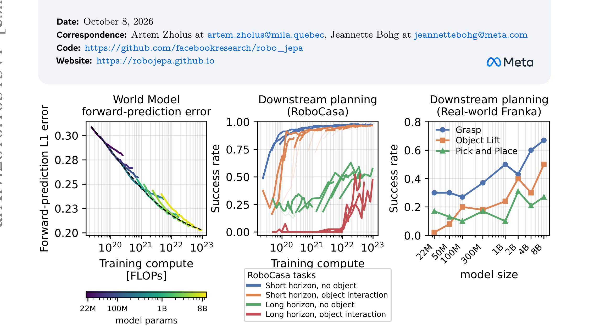
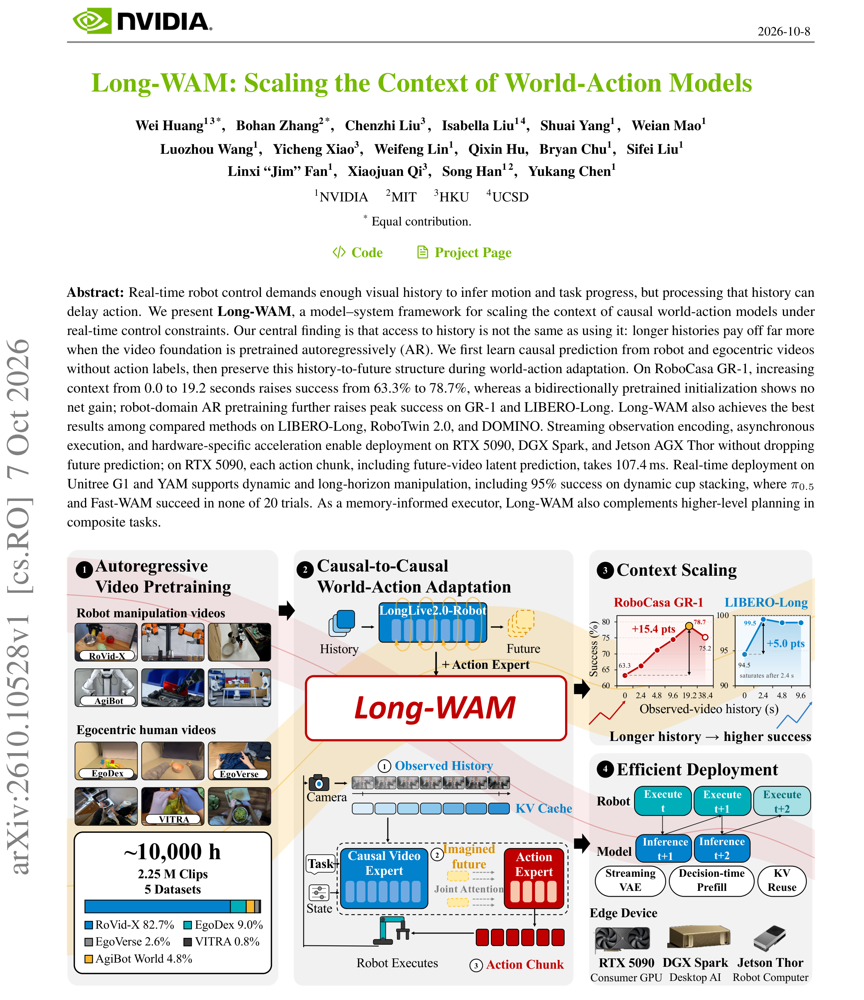
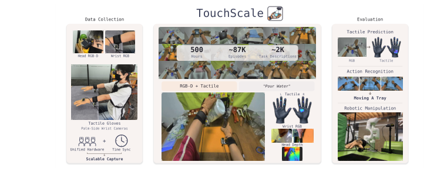
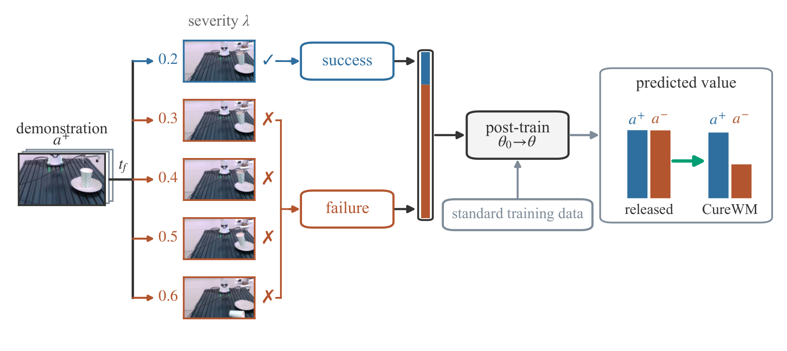

# 2026-10-08 Embodied AI & World Models Daily

> 面向具身智能 / Robotics 研究员与工程师的研究与工程资讯。
>
> 检索窗口：主窗口 2026-10-08 00:00–23:59（北京时间）；补充窗口回溯至 2026-10-06 00:00。**arXiv 公告说明**：本次运行（北京 10-09 01:00 = ET 10-08 17:00）可检索到 **周四 ET 公告批次（v1 实际提交北京 10-06 03:14 – 10-08 01:59，即周一/周二/周三 ET 日间提交）**——该批 cs.RO/AI/LG/CV 合并去重后共 93 条进入 abs 页逐条核实（主窗口 21 条 + 补充窗口 68 条 + 窗口外旧提交 4 条排除）。**主窗口 10-08 日间与 10-09 的 arXiv 新投稿（周五 ET 批次）本次运行不可见，明日日报回补。** 项目页 / GitHub / Hugging Face 均已实际访问核实；全部条目按 T1（一手源）标准收录。

## 🔥 今日必读

### 1. 【世界模型】RoboJEPA：机器人潜世界模型的第一条 scaling law——二阶 power law 外推 4B/8B，能力按算力阈值分层涌现（Meta FAIR）

**来源：** [arXiv:2610.10515v1](https://arxiv.org/abs/2610.10515)（cs.AI 交叉 cs.RO/cs.LG；FAIR at Meta / Mila / Polytechnique Montréal，Artem Zholus · Nicolas Beltran-Velez · Jianhao Yuan · Sarath Chandar · Tushar Nagarajan · Koustuv Sinha · Michal Drozdzal · Adriana Romero Soriano · **Jeannette Bohg** · **Nicolas Ballas** · **Mahmoud Assran**）  
**类型：** Paper（research_paper）  
**发布时间：** 实际提交 2026-10-08 01:54（北京时间，主窗口）  
**评分：** 88/100  
**关键词：** Latent World Model · Scaling Law · JEPA · Multi-Embodiment

**一句话：**  
LM 的 scaling law 可预测性第一次被搬到**动作条件机器人世界模型**上：冻结 V-JEPA 2.1 encoder，在其特征空间训 22M–8B 确定性单步潜预测器族（23 数据集 / 12 本体 / 287 万轨迹），forward-prediction 误差服从**二阶 power law** $L(C)=E+AC^{\alpha-\gamma\ln C}$——22M–2B 拟合、外推 held-out 4B/8B 误差 0.6/1.4×10⁻³（比标准 power law 好 2–3×）；下游规划成功率随算力可预测提升，**末端 3D 控制 → 持物操作 → 静态场景几何 → 推物动力学在 10²⁰→3×10²⁰→10²¹–10²²→10²² FLOPs 依次涌现**。8B 为迄今最大 JEPA predictor，全部 checkpoint 承诺开源。

**技术要点：**

- 拟合协议干净：每个算力档取各尺寸最优形成 compute-optimal frontier，四种候选曲线里**二阶 law 外推最好**；二阶与 BNSL 估出的不可约误差几乎相同（DROID ≈0.2、RoboCasa ≈0.17）——**当前数据预算已近饱和，加参数不如加数据多样性**。
- 训练-部署 rollout 失配的直接证据与修复：避障/推物等非贪心任务用 K=2 训练时**没有干净 frontier**（300M 有时胜 1B）；只把 cooldown 退火段换成 K=10 + 高分辨率后，避障 10²¹ 起飞、10²² 饱和——贵的长 rollout 信号只花在退火段。
- 真机 DROID Franka（单图像目标）：Grasp 67%（8B）vs 30%（22M）；π0.5 在 Object Lift 0%（"lift" 动词在 DROID 欠代表）而图像目标规划免疫——论文自述该比较不可完全归因。
- 离线 imagination error 与在线成功率强相关——**训练中可用它当真机评测的 proxy**。

**为什么值得关注：**  
这是第一条经过外推验证的机器人世界模型 scaling law：给定预算选规模、给定能力目标反查最小算力，从此有表可查。对评测协议的人，"先建反映目标能力的下游评测、再用 law 估最小训练算力"是作者明说的工程建议；阈值数字（10²⁰–10²²）绑定任务族与 CEM 规划器，换任务要重新标定。

**资源：**

- Paper：[arXiv 摘要页](https://arxiv.org/abs/2610.10515)
- Project：[项目页](https://robojepa.github.io)（页面为占位）
- Code：[GitHub](https://github.com/facebookresearch/robo_jepa)（论文页标注；本日核查时内容待补）
- Weights：论文承诺全部 checkpoint 开源（暂未见独立权重仓库）
- Discussion：暂未发现高质量社区讨论（公开 <48h）

---

### 2. 【世界模型】Long-WAM：获得历史 ≠ 使用历史——长上下文只有 AR 预训练骨干才兑付，0→19.2s 上下文 63.3→78.7%（NVIDIA）

**来源：** [arXiv:2610.10528v1](https://arxiv.org/abs/2610.10528)（cs.RO；NVIDIA / MIT / HKU / UCSD，Wei Huang* · Bohan Zhang* · … · Linxi "Jim" Fan · Xiaojuan Qi · Song Han · Yukang Chen）  
**类型：** Paper（research_paper）  
**发布时间：** 实际提交 2026-10-08 01:58（北京时间，主窗口）  
**评分：** 84/100  
**关键词：** World-Action Model · 上下文 Scaling · AR 预训练 · 实时部署

**一句话：**  
WAM 的视觉历史是资源还是负担取决于**预训练方式**：Long-WAM 先在 ~10,000 小时机器人+自我中心视频上做 AR 预训练（无动作标签），再因果到因果适配——RoboCasa GR-1 上下文 0→19.2 秒把成功率 63.3→78.7%，**双向（Wan2.2）初始化加历史无净增益**（61.7→64.1→61.6），AR 优势从无历史 3.3 点扩大到 17.1 点；IDM 顺序去噪（先（部分）去噪未来视频潜变量、再条件动作）在长任务上最优，且**不做像素级合成**；系统侧流式 VAE + 异步执行 + NVFP4 把含未来视频预测的闭环压到 **107.4 ms/chunk**（RTX 5090，3.3×）。

**技术要点：**

- 消融矩阵干净：w/o V 94.5% / CoD 97.8% / IDM 99.5%（LIBERO-Long）——**预测作为中间控制表示就够用，不需要像素**；DOMINO 动态任务 34.9 SR / 45.1 MS 超最强基线各指标。
- 38.4s（3× 平均训练轨迹）处回落（75.2%）——作者归因**历史覆盖不足而非内在记忆上限**（80.4% 帧是 padding），这是假设不是结论；上下文有真实价格：8× 历史 → 延迟 3.2×（107.4→341.0ms）。
- 异步执行对照最能说明架构差：S=12 时 IDM 只掉 0.2 点，Fast-WAM 掉 15.4、LingBot-VA 掉 45.5。
- 真机 Unitree G1 传送带 3–7.5cm/s：Long-WAM 抓取 90–100%、动态叠杯 95%（19/20）；**π0.5 与 Fast-WAM 全速度档 0/20**。层级模式：冻结执行器 + GPT-6 Astra 规划 31.4→54.4%，组合未见任务 6.1→35.0%。

**为什么值得关注：**  
与昨天 OpenWAM 拼成同一范式的孪生：一个把生成交序/跨模可见性变成受控变量，一个把**上下文长度**变成受控变量——两篇都得到「差异主要来自骨干预训练而非交互结构」的结论。要长历史先确认 AR 预训练；部署优化链（NVFP4+CUDA Graph+编译+复用+online softmax+设备调优）可整段照抄。

**资源：**

- Paper：[arXiv 摘要页](https://arxiv.org/abs/2610.10528)
- Project：论文页标注 Project Page 链接（NVIDIA 发布页）
- Code：本日核查未检索到独立开源仓库
- Weights：暂无
- Discussion：暂未发现高质量社区讨论（公开 <48h）

---

### 3. 【数据与Benchmark】TouchScale：500 小时人类视觉-触觉数据——免动作对齐中训练把真机操作 22.5→57.5%（+35 点）

**来源：** [arXiv:2610.10288v1](https://arxiv.org/abs/2610.10288)（cs.CV 交叉 cs.RO；Texas A&M / Google DeepMind / CMU / Stanford / NVIDIA / Meta / UW 等约 27 家机构，Dayou Li* · Hao Wang* · Qianqian Yang* · Zihao Zhu* · … · Masayoshi Tomizuka · Marco Pavone · Changliu Liu，通讯 Zhiwen Fan）  
**类型：** Paper（benchmark_or_dataset）  
**发布时间：** 实际提交 2026-10-07 23:49（北京时间，补充窗口）  
**评分：** 82/100  
**关键词：** Visual-Tactile Dataset · Egocentric · Mid-Training · 数据 Scaling

**一句话：**  
现有视觉-触觉数据集多数小于 30 小时、规模效应无法单库研究——TouchScale 用**同一套可穿戴硬件**（头 RGB-D + 双腕 RGB + 双手 880-taxel 手套，<2mm 分辨率，30Hz 同步）采 500 小时 / 87K episodes / 2K 任务：零样本触觉预测 cIoU 随数据量 10%→100% 从 0.311→0.383 单调升（等时对照压 EgoTouch 0.181 vs 0.134）；Hiera-B 预训练在三个动作识别基准全最高；**N0-VTLA 只加一个未来触觉预测中训练（完全免动作重定向）就把真机四任务平均 22.5→57.5%**。

**技术要点：**

- 跨触觉传感器可比的关键协议设计：手套 taxel 布局不同，评测映射到 **12 个解剖学手区**——零样本迁移不靠原生分辨率。
- 四个问题四个受控设计：等时对照（Q1）、同预算四库预训练（Q2）、只差中训练一阶段的对照（Q3）、固定传感器协议只动数据量（Q4）。
- 机器人平台：xArm6 + BrainCo Revo 2 + 手套触觉，50 teleop demos/任务；软/硬分拣 10→60、瓶盖 40→70、试管 30→60、白板擦 10→40。
- 边界：vIoU 与 EgoTouch 相当（体积重叠不规模敏感）；单臂单手验证；**中训练 vs 同预算更多 teleop 演示的对照缺失**。

**为什么值得关注：**  
对缺触觉数据的机器人团队这是当前最便宜的 +35 点来源——人类视频+手套中训练插在策略 post-training 之前即可；对做数据集的人，「统一硬件重复部署」是唯一能把规模当单独变量拧的路径。

**资源：**

- Paper：[arXiv 摘要页](https://arxiv.org/abs/2610.10288)
- Project：[项目页](https://touch-scale.github.io)
- Code：[GitHub](https://github.com/phai-lab/touchscale)（2026-09-23 建仓）
- Weights：[Hugging Face](https://huggingface.co/datasets/2077AIDataFoundation/TouchScale)（数据集）
- Discussion：暂未发现高质量社区讨论（公开 <48h）

---

### 4. 【世界模型】CureWM：已发布世界模型「梦想成功」——执行验证的反事实重放纯数据侧修复，optimism 80→30–43%

**来源：** [arXiv:2610.09134v1](https://arxiv.org/abs/2610.09134)（cs.RO；Jiuyi Xu（Colorado School of Mines）· Xiao Hu · Yang Ye（Northeastern）· Meida Chen（USC ICT）· Peng Gao（NC State）· Yangming Shi）  
**类型：** Paper（research_paper）  
**发布时间：** 实际提交 2026-10-07 05:26（北京时间，补充窗口）  
**评分：** 81/100  
**关键词：** World Model 评测 · 反事实 · Post-hoc 修复 · Failure Insensitivity

**一句话：**  
跨两个架构族的四个已发布世界模型 checkpoint 在 held-out 反事实上系统性**分不出成败动作**（Goal 套件 79% optimism）——CureWM 把失败不敏感从 optimism 里拆出来单独测，用 MiraBench 六扰动族 × severity 网格构造替代动作（保 $t<t_f$）、**执行验证结果**（族准入条件：相邻 severity 失败率单调）、与基础数据并集微调：**不改架构不改损失**，四套件 optimism 80→30–43%、AUROC 0.50→0.74；真机 success-like 失败预测 90→33%。匹配预算对照：反事实失败 Δ_SF 0.124 vs 新采 on-policy 失败 0.014（近 9×）。

**技术要点：**

- 诊断协议本身可复用：value 侧 Δ_SF/AUROC/optimism(τ=0.5) + video 侧潜距离分数 s(a)/pair-ranking——**只报 optimism 会高估修复**，必须同时给判别力。
- 代价透明：任务成功率 98.4→94.8%（−3.6 点）——修复不是免费的；RoboCasa 上出现**修复-控制权衡**、best-of-N 无统计显著收益（作者自列）。
- 迁移边界：跨扰动类型/物体不一致；硬件证据两物体一臂小样本；前提（可执行反事实+可验证结果）把一类应用挡在门外。

**为什么值得关注：**  
策略评测、规划、合成数据全都依赖「预测区分成败动作」——这篇给出评任何世界模型前的 action-contrast 检查（同上下文换动作看预测分不分级，实现成本极低）和已发布模型的 post-hoc 修复配方，与 OpenWAM（受控比较框架）、Long-WAM（上下文变量）拼出世界模型质量工程的三块。

**资源：**

- Paper：[arXiv 摘要页](https://arxiv.org/abs/2610.09134)
- Project：未发现独立项目页
- Code：[GitHub](https://github.com/jiuyixu25/CureWM)（2026-10-06 建仓，2★）
- Weights：暂无（修复配方针对已发布 checkpoint，不含权重）
- Discussion：暂未发现高质量社区讨论（公开 <48h）

---

### 5. 【VLA与基础模型】VPP2：事件级操作视频继续预训练——14B 反超 Cosmos3-64B 指令遵循，真机 ALOHA 零样本 58.5% vs π0.5 40.0%

**来源：** [arXiv:2610.10270v1](https://arxiv.org/abs/2610.10270)（cs.CV 交叉 cs.RO；Yanjiang Guo · Haodong Yan · Zhide Zhong · Zhongru Zhang 等 18 人）  
**类型：** Paper（research_paper）  
**发布时间：** 实际提交 2026-10-07 23:40（北京时间，补充窗口）  
**评分：** 80/100  
**关键词：** WAM · 事件级预训练 · Consistency Distillation · MoT

**一句话：**  
现有 WAM 在开放环境频繁出错被诊断为两件事：视频基础没为操作优化、朴素加动作模块伤泛化（Wan2.1-14B 直接用指令遵循 0.32/0.04 几乎不可用）——VPP2 三段式：**事件级继续预训练**（1–12s 语义分段 + 详细说明文字：左/右夹爪显式指定、目标物体消歧、视角变化 + T 形多视角拼接 + 统一末端坐标系）→ consistency distillation 单步视觉规划器 → MoT 动作专家学隐式逆动力学；指令遵循 0.80/0.90 **反超 Cosmos3-64B**（0.70/0.78），消融（固定时长 chunk 丢完整事件）掉到 0.48/0.42。

**技术要点：**

- 数据管线是本文最可复用的部分：把「说明文字详细度」变成可执行工程规范的第一份完整模板（分段边界启发式 + VLM 精修）。
- 真机 ALOHA 零样本 10 类任务平均 **58.5% vs π0.5 40.0% / Fast-WAM-14B 20.5%**（同数据后训练对照），9/10 类最优。
- 基准后训练：LIBERO-Pro **45.0**（最强基线 11.0）/ LIBERO-OOD **63.9** / RoboDojo **29.47**（SOTA）。
- 边界：GPT 评估器 + 人类成对评分有主观成分（50 对/域）；基线部分未报 Pro/OOD；单步蒸馏的预测损失未单独量化。

**为什么值得关注：**  
与同实验室 Fast-WAM 构成 WAM 谱系两端（一个去显式未来生成求快、一个保留预测用蒸馏压成本），与 OpenWAM/Long-WAM 汇流在同一判断：**WAM 的差异主要来自骨干为操作做了什么预训练，而不是动作接口本身**。

**资源：**

- Paper：[arXiv 摘要页](https://arxiv.org/abs/2610.10270)
- Project：[项目页](https://github.com/Haodong-Yan/VPP2-project)
- Code：[GitHub](https://github.com/roboterax/video-prediction-policy-2)（2026-10-08 建仓，15★）
- Weights：暂未发现独立权重仓库
- Discussion：暂未发现高质量社区讨论（公开 <48h）

---

## 📄 论文雷达

> 以下 9 篇为窗口内实际提交（周四 ET 批次），已逐条打开 abs 页核实，按双评分均分降序；最高分 ProAct 已完成完整精读（见下方嵌图与精读索引）。

### 【模仿学习与策略】ProAct：动作 tokenizer 重建好 ≠ 策略好用——token 均衡正则 + 码字扰动平均 +11.3 点（已精读）

**来源：** [arXiv:2610.09170v1](https://arxiv.org/abs/2610.09170)（cs.RO；Haoran Chen · Jingtian Ji · Samuel Wheeler · Kaylene Caswell Stocking · Matthew Walter，TTIC / Brown）  
**关键词：** Action Tokenization · 可预测性 · 解码鲁棒性  
**核心贡献：** 22 配置受控研究（TF/C2/CT × VQ/RVQ/NRVQ/FSQ/QinCo × S/L）证明**低重建误差是必要非充分**（低误差子集 Spearman 0.35–0.50，FM 噪声容许度对照显示容忍任务依赖）；ProAct 两个 tokenizer-only 干预——TBR（协方差 preconditioning → token margin 变大 → 不可约策略损失下降，线性 encoder 下有理论）+ TP（扰动序列经 STE 重建原动作）——平均 +11.3 点、VLA +21.8、真机 +36.7；重建与策略验证指标都解释不了增益（作者诚实声明）。  
**值得关注程度：** 78/100  
**Paper：** [arXiv 摘要页](https://arxiv.org/abs/2610.09170)

### 【模仿学习与策略】Immiscible Diffusion Policy：扩散策略会塌成单模态——免标签动作-噪声配对保多模态，非主导模态占比 6–14.6×

**来源：** [arXiv:2610.09369v1](https://arxiv.org/abs/2610.09369)（cs.RO；Xiao Zhang · Yuxin Chen · … · Chenfeng Xu · Masayoshi Tomizuka · Yiheng Li）  
**关键词：** Diffusion Policy · 多模态塌缩 · 训练时加项  
**核心贡献：** 诊断独立动作-噪声配对增加扩散路径交叉、产生平均化去噪响应——尤其在稠密低维动作空间；训练时免标签加项用动作-噪声配对保留相对分离的噪声-动作路径：五仿真 + 两真机人形任务，非主导模态占比 **6.0–14.6×**，四模态任务恢复被 vanilla 完全丢失的演示模态；不改架构与推理。  
**值得关注程度：** 77/100  
**Paper：** [arXiv 摘要页](https://arxiv.org/abs/2610.09369)

### 【VLA与基础模型】ΔWAM：把动作切线场蒸馏进世界动作模型——无大规模具身预训练的鲁棒性

**来源：** [arXiv:2610.09734v1](https://arxiv.org/abs/2610.09734)（cs.RO；Ke Wu · Hanwen Huang · Bo Gu · Kaizhao Zhang · … · Wenchao Ding）  
**关键词：** WAM 监督效率 · Residual-VAE · 局部 Taylor 展开  
**核心贡献：** 光流/运动中心表征/潜动作等 WAM 设计统一到「监督里动作相关变化占比越高越高效」的视角；Action Tangent Fields 用动作诱导未来动力学变化的局部一阶 Taylor 展开（Residual-VAE 空间，未来潜可由当前潜+残差恢复），用强动作条件世界模型探测局部对应再蒸馏进 WAM——LIBERO-Plus/RoboTwin/RoboTwin2.0-Plus 对光照/背景/相机/布局扰动一致提升，**不用大规模具身预训练即超预训练策略的鲁棒性**；多步 VideoDiT 蒸馏到单步。  
**值得关注程度：** 76/100  
**Paper：** [arXiv 摘要页](https://arxiv.org/abs/2610.09734)

### 【端侧部署】RealtimeWAM：免训练 WAM 推理加速 8.9–10.7×——成功 82.75/87.41% 且真机反升 17.2/37.2 点

**来源：** [arXiv:2610.10079v1](https://arxiv.org/abs/2610.10079)（cs.RO；Huanan Liu · Ye Li · Kangye Ji · … · Zhi Wang）  
**关键词：** WAM 推理加速 · 自适应计算 · KV 复用  
**核心贡献：** 缓存策略只吃特征冗余、吃不下闭环控制变化算力需求——RealtimeWAM 免训练：层间依赖并行执行 + 管线内自适应计算（视觉稳定区缓存观测特征、复用 Transformer 残差、小预测修正保留精修）；RTX 4090 上 FastWAM/OpenWAM 平均延迟 24.09/63.09ms（8.90×/10.67×），成功率差 0.02/0.53 点内；**真机五任务成功率反比原生推理高 17.2/37.2 点**（延迟本身伤害闭环）。  
**值得关注程度：** 76/100  
**Paper：** [arXiv 摘要页](https://arxiv.org/abs/2610.10079)

### 【运动与全身控制】Workhorse：人形全身 loco-manip 从人类数据学——五连杆目标 + 互相模仿对方错误的两个策略

**来源：** [arXiv:2610.09117v1](https://arxiv.org/abs/2610.09117)（cs.RO；Songbo Hu · Qiayuan Liao · Yufeng Chi · Kevin Zakka · Yakun Sophia Shao · **Pieter Abbeel** · Koushil Sreenath，Berkeley）  
**关键词：** Humanoid · 人类演示 · 全身跟踪  
**核心贡献：** 视觉规划器预测五连杆目标（躯干+双腕+双足位姿）、RL 全身跟踪器跟上——两个策略在**同一份录制人类姿态**上分开训练、免重定向；每个策略的训练数据增广去模仿另一个策略部署时犯的错；真机 Unitree G1：徒手+脚踢分箱、接住抛来的箱子、推倒并爬上行李箱；人推机器人/拿走箱子后恢复；仿真复刻演示房间 77% 成功、40 N·s 推扰下 64%。  
**值得关注程度：** 75/100  
**Paper：** [arXiv 摘要页](https://arxiv.org/abs/2610.09117）　**Project：** [项目页](https://hsb0508.github.io/workhorse/)

### 【VLA与基础模型】Rephrase Before You Act：VLA 对措辞敏感到病态——π0.5 "switch on the stove" 100% vs "hot plate" 2%

**来源：** [arXiv:2610.10526v1](https://arxiv.org/abs/2610.10526)（cs.RO 交叉 cs.CL/cs.LG；Mikey Watts · Yuchen Cui，UCLA）  
**关键词：** Language Sensitivity · 推理时增强 · 免重训练  
**核心贡献：** VLA 不继承 VLM 的语言鲁棒性：单词级编辑可摆动数十点；统计检验的单编辑摆动 + oracle 短语搜索显示**措辞一项几乎补平 21 点 ID/OOD 差距**；解法零改策略——少量训练任务的多种措辞打分 → LLM 蒸馏成 10–20 条改写规则 → 部署时改写一次；冻结 π0 提升 16–27% 相对、π0.5/LIBERO 93.6→97.8%。  
**值得关注程度：** 75/100  
**Paper：** [arXiv 摘要页](https://arxiv.org/abs/2610.10526)　**Project：** [项目页](https://sttawm.github.io/rephrase-before-you-act)　**Code：** [GitHub](https://github.com/sttawm/phrase-rl)

### 【VLA与基础模型】Juno：一个动作条件 JEPA 三用——骨干/教师/动力学，真机漂移下 70–75% vs 基线塌 0%

**来源：** [arXiv:2610.09940v1](https://arxiv.org/abs/2610.09940)（cs.RO；Yuchen Zhu · Chenyi Xu · Yulin Zhang · Gang Xu · Wentao Zhu）  
**关键词：** JEPA · Test-Time Adaptation · 预测潜变量  
**核心贡献：** 预训练（本体匹配轨迹 + 动态 CLS 损失把运动加权 patch 动力学传给全局状态）→ 策略学习（当前帧 JEPA patch 融合进感知 + 解耦推理分支蒸馏未来潜状态）→ 部署（世界模型在**全部观测转移含失败 rollout** 上自适应、冻结教师、LoRA 重对齐，无专家修正无奖励）：SimplerEnv 60.9→68.5→72.7%（超 Qwen3GR00T）；真机背景/高度/物体漂移下保持 70–75% 而基线塌到 0%。  
**值得关注程度：** 74/100  
**Paper：** [arXiv 摘要页](https://arxiv.org/abs/2610.09940)　**Project：** [项目页](https://juno-policy.github.io/)　**Code：** [GitHub](https://github.com/ZhuYuChenNO1/Juno)（2026-10-07 建仓，6★）

### 【操作与抓取】RoboPace：动作 chunk 策略的接触感知在线重定时——半时间完成 4/5 指令

**来源：** [arXiv:2610.09696v1](https://arxiv.org/abs/2610.09696)（cs.RO；Mimo Shirasaka · Takehiko Ohkawa · Takuya Okubo · Nicola Scianca · Tatsuya Matsushima · Kei Ota）  
**关键词：** Action Chunk · 时间重定参 · 免重训练  
**核心贡献：** UMI/人手演示继承的是演示者的节奏——软手耐快接触、机器人会过冲，反之机器人在自由空间可以更快：在线重定层保几何路径、按预测接触 + 机器人运动学动力学约束调速度；三接触任务双臂上，快统一执行与纯物理限制重定时大多失败，RoboPace 成功率超慢速统一执行且**约一半时间完成 4/5 指令**。  
**值得关注程度：** 73/100  
**Paper：** [arXiv 摘要页](https://arxiv.org/abs/2610.09696)　**Project：** [项目页](https://robopace.airoa.io/)

### 【运动与全身控制】LLA-MPPI：全身自适应=在 GPU 仿真器库里选模型——免训练 97.5% vs 最强基线 74%

**来源：** [arXiv:2610.10465v1](https://arxiv.org/abs/2610.10465)（cs.RO 交叉 eess.SY；Sebin Jung · Maitham AL-Sunni · Juan Alvarez-Padilla · Zachary Manchester · Changliu Liu · John Dolan，CMU 线）  
**关键词：** Whole-Body Control · MPPI · 免训练自适应  
**核心贡献：** 把全身自适应变成**在 GPU 批量接触仿真器库（不同物理/结构参数）上做选择**：窗口预测误差选最近历史最能解释的仿真器、MPPI 在选定模型上规划；免离线训练、选中假设物理可解释；四仿真任务 97.5%（最强基线 74%、真模型 oracle 98.5%）；Unitree Go2 真机：中途加载荷行走、单腿失效后行走、推箱途中增质量。  
**值得关注程度：** 73/100  
**Paper：** [arXiv 摘要页](https://arxiv.org/abs/2610.10465)　**Project：** [项目页](https://lla-control.github.io)

---

## 🛠 工程与开源

### TouchScale 全家桶（[GitHub](https://github.com/phai-lab/touchscale) + [Hugging Face](https://huggingface.co/datasets/2077AIDataFoundation/TouchScale)）

500 小时视觉-触觉数据集 + 采集/评测代码三件套（详见必读 #3）。中训练（免动作对齐）是可直接插进任何 VTLA 策略 post-training 之前的组件。

### VPP2 官方实现（[GitHub](https://github.com/roboterax/video-prediction-policy-2)，15★）

10-08 建仓当天放出，Wan 骨干的事件级继续预训练 + MoT 动作专家完整代码；数据管线的说明文字模板与 T 形拼接值得直接抄。

### Juno 官方实现（[GitHub](https://github.com/ZhuYuChenNO1/Juno)，6★）

动作条件 JEPA 的三用框架（骨干/教师/自适应动力学）；test-time adaptation 分支（失败 rollout 上也自适应）是独立可复用的部分。

### CureWM 修复管线（[GitHub](https://github.com/jiuyixu25/CureWM)，2★）

六扰动族 + severity 网格 + 执行验证 + 并集微调的完整管线（LIBERO/ManiSkill3 绑定 + Franka 真机管线）；对已发布世界模型的 post-hoc 修复可直接套用。

### OpenViTac 视触基准（[项目页](https://fvl-repo.github.io/OpenViTac/)，未放代码）

11 仿真 + 8 配对真机任务、四触觉能力维度（物理属性/易碎性/接触/精度）、3 传感器 × 2 夹爪；OpenVTLA（π0.5+AnyTouch2）仿真 68.7%/真机 54.6%、sim-real 相关性 0.913；加 500 仿真演示真机 +15 点。页面未放代码仓，标注随论文发布补齐。

### RobotWorld 多模态 agent 基准（[arXiv:2610.10409](https://arxiv.org/abs/2610.10409)，62 页 / 25 图）

84 任务跨操作/移动操作/locomotion/驾驶/飞行控制的仿真 testbed，带交互预算与可执行成功检查；最有信息量的发现：当前 agent 能搭出分割/标定/空间估计/动力学计算的工作流，**但不能把它们组装成成功行为**（丢失物体状态、纠错太晚、误判任务完成）；Astra 强在空间/受限接触目标、Opus 5.5 强在连续平衡/定时交互。

---

## 💬 社区信号

> 本窗口（周四 ET 批次）论文公开 <48h，社区讨论整体清淡；HN 首页无具身相关高热帖。值得继续观察的信号：

- **WAM 的「受控比较」范式进入第二天，变量还在扩展**：Long-WAM（上下文长度 × AR/双向预训练）、ΔWAM（监督里动作相关占比）、CureWM（修复数据配方）、VPP2（预训练目标）加上昨天的 OpenWAM（生成交序/可见性）——**同一周内四篇都把「给 WAM 动哪个变量」写成单变量消融**，「各自拼架构」的写法正在快速退场。
- **scaling law 同日到达模型侧与数据侧**：RoboJEPA（世界模型质量 vs 算力，可外推二阶 law）+ TouchScale（触觉数据量 vs 零样本/真机成功，单调未饱和）——「预算可预测性」从 LM 蔓延到机器人的两条正交轴，后续值得盯「law 之间能不能互相预测」（用 RoboJEPA 的 imagination error 预测 TouchScale 类中训练收益？）。
- **GitHub 新仓监控**：[roboterax/video-prediction-policy-2](https://github.com/roboterax/video-prediction-policy-2)（10-08 建仓当天 15★，本批最快）、[ZhuYuChenNO1/Juno](https://github.com/ZhuYuChenNO1/Juno)（10-07，6★）、[jiuyixu25/CureWM](https://github.com/jiuyixu25/CureWM)（10-06，2★）均 <48h 新建；RoboJEPA 论文页标注 facebookresearch 仓但内容待补——**Meta 系世界模型权重若按承诺放出，会是本周最值得盯的开源事件**。

---

## 🔎 补充窗口筛选记录

> 周四 ET 公告批次（cs.RO/AI/LG/CV 合并）中，v1 实际提交北京 10-06 03:14 – 10-08 01:59 的 93 条经 abs 页逐条核实（主窗口 21 + 补充窗口 68；另有 4 条 v1 早于 10-06 的旧提交排除）。cs.RO 批共 121 条，其中约 28 条标题triage 即判非学习类（传感器设计/医疗执行/农业植保等）不赘。

| 条目 | 实际时间（北京时间） | 排除/处理原因 |
|---|---|---|
| [arXiv:2610.10515v1](https://arxiv.org/abs/2610.10515) RoboJEPA | 10-08 01:54 | 主窗口 → 已收录（必读 #1，精读完成） |
| [arXiv:2610.10528v1](https://arxiv.org/abs/2610.10528) Long-WAM | 10-08 01:58 | 主窗口 → 已收录（必读 #2，精读完成） |
| [arXiv:2610.10288v1](https://arxiv.org/abs/2610.10288) TouchScale | 10-07 23:49 | 补充窗口 → 已收录（必读 #3，精读完成） |
| [arXiv:2610.09134v1](https://arxiv.org/abs/2610.09134) CureWM | 10-07 05:26 | 补充窗口 → 已收录（必读 #4，精读完成） |
| [arXiv:2610.10270v1](https://arxiv.org/abs/2610.10270) VPP2 | 10-07 23:40 | 补充窗口 → 已收录（必读 #5，精读完成） |
| [arXiv:2610.09170v1](https://arxiv.org/abs/2610.09170) ProAct | 10-07 06:12 | 补充窗口 → 已收录（雷达 #1，精读完成） |
| [arXiv:2610.09369v1](https://arxiv.org/abs/2610.09369) Immiscible Diffusion Policy | 10-07 11:22 | 补充窗口 → 已收录（雷达 #2） |
| [arXiv:2610.09734v1](https://arxiv.org/abs/2610.09734) ΔWAM | 10-07 17:28 | 补充窗口 → 已收录（雷达 #3） |
| [arXiv:2610.10079v1](https://arxiv.org/abs/2610.10079) RealtimeWAM | 10-07 21:44 | 补充窗口 → 已收录（雷达 #4） |
| [arXiv:2610.09117v1](https://arxiv.org/abs/2610.09117) Workhorse | 10-07 05:06 | 补充窗口 → 已收录（雷达 #5） |
| [arXiv:2610.10526v1](https://arxiv.org/abs/2610.10526) Rephrase | 10-08 01:57 | 主窗口 → 已收录（雷达 #6） |
| [arXiv:2610.09940v1](https://arxiv.org/abs/2610.09940) Juno | 10-07 20:24 | 补充窗口 → 已收录（雷达 #7） |
| [arXiv:2610.09696v1](https://arxiv.org/abs/2610.09696) RoboPace | 10-07 16:55 | 补充窗口 → 已收录（雷达 #8） |
| [arXiv:2610.10465v1](https://arxiv.org/abs/2610.10465) LLA-MPPI | 10-08 01:30 | 主窗口 → 已收录（雷达 #9） |
| [arXiv:2610.10384v1](https://arxiv.org/abs/2610.10384) OpenViTac | 10-08 00:43 | 主窗口 → 已收录（工程与开源节） |
| [arXiv:2610.10409v1](https://arxiv.org/abs/2610.10409) RobotWorld | 10-08 00:55 | 主窗口 → 已收录（工程与开源节） |
| [arXiv:2610.09178v1](https://arxiv.org/abs/2610.09178) CAP | 10-07 06:28 | 补充窗口，策略头复用 tokenizer codebook（同组同日）→ 与 ProAct 同题（tokenizer-策略接口两端），下期合并评 |
| [arXiv:2610.10178v1](https://arxiv.org/abs/2610.10178) VLA 语言接地机制可解释性 | 10-07 22:48 | 补充窗口，π0.5/GR00T N1.7 activation patching → 与 Rephrase 同题（语言鲁棒性），单组两作者规模小，列观察 |
| [arXiv:2610.09454v1](https://arxiv.org/abs/2610.09454) RobotAPO | 10-07 13:10 | 补充窗口，AgiBot-PhysPref 1 万样本 + 对抗物理偏好优化 → 与 RoboRender（[arXiv:2610.09254v1](https://arxiv.org/abs/2610.09254)，10-07 08:39 提交，已核实 abs 页）同题（生成视频物理一致性），下期合并评 |
| [arXiv:2610.09514v1](https://arxiv.org/abs/2610.09514) STRIKE | 10-07 14:11 | 补充窗口，事件对齐视觉状态转移 + 图像转移模型递推 → 与 Event-Aligned WAM（[arXiv:2610.09427](https://arxiv.org/abs/2610.09427) 10-07 12:31）同题（事件对齐监督），下期合并评 |
| [arXiv:2610.09309v1](https://arxiv.org/abs/2610.09309) Executable Goals | 10-07 10:07 | 补充窗口，3D trace 世界模型的实体级目标读出（SE(3) 目标 + Pose-Native Executor）→ 与昨日 CA³C 同题（预测到执行接口），Franka 73.33% 零样本，列观察 |
| [arXiv:2610.10274v1](https://arxiv.org/abs/2610.10274) CostGrad | 10-07 23:40 | 补充窗口，按规划代价梯度范数选空间 token（50% 稀疏 2.6× 加速）→ 推理加速线，与 RealtimeWAM 互补（一个选 token 一个复用特征），列观察 |
| [arXiv:2610.10453v1](https://arxiv.org/abs/2610.10453) RFPO | 10-08 01:24 | 主窗口，流策略少步离散化差距的 RL 修复（Go2 一步 0.08ms）→ 与昨日 QF3 同题（流策略 RL），列观察 |
| [arXiv:2610.09247v1](https://arxiv.org/abs/2610.09247) Informational Curse of Horizon | 10-07 08:20 | 补充窗口，goal 重标注视野降低条件互信息（oracle planner 受控实验）→ 理论贡献突出，BC/RL 输入 Jacobian 蒸馏补救，列观察 |
| [arXiv:2610.08970v1](https://arxiv.org/abs/2610.08970) HULK | 10-07 02:33 | 补充窗口，MPC 指导 RL 双教师 + 捕获点 CBF 蒸馏（G1 负重）→ 人形 loco-manip 线竞争条目多（Workhorse/Co²Skill/HuMBLE），列观察 |
| [arXiv:2610.10489v1](https://arxiv.org/abs/2610.10489) HuMBLE | 10-08 01:45 | 主窗口，人形自然步态先验 + 多任务 RL 扩展命令覆盖（Atlas R1/D1 + G1）→ 同上人形线，22 作者工业线，列观察 |
| [arXiv:2610.09291v1](https://arxiv.org/abs/2610.09291) Co²Skill | 10-07 09:49 | 补充窗口，场景交互+灵巧操作的技能组合长视野 → 同上人形线，列观察 |
| [arXiv:2610.10322v1](https://arxiv.org/abs/2610.10322) DIGHT | 10-08 00:12 | 主窗口，数字人交互生成的物理后训练（共适应跟踪）→ 人形动画落点为主，列观察 |
| [arXiv:2610.09055v1](https://arxiv.org/abs/2610.09055) MimicX | 10-07 04:05 | 补充窗口，执行反馈定位难点转移并联合改跟踪目标与重置课程 → 视频驱动人形跟踪线（33 页），列观察 |
| [arXiv:2610.09455v1](https://arxiv.org/abs/2610.09455) RLHND | 10-07 13:11 | 补充窗口，Cosmos 3 骨干做物理接地手跟踪+触觉估计 → 人视频数据引擎线，与 TouchScale 互补，列观察 |
| [arXiv:2610.10283v1](https://arxiv.org/abs/2610.10283) Temporal Visuo-Tactile | 10-07 23:48 | 补充窗口，10,000 抓取 × 200 物体（4×Digit 360）触觉稳定门控 +10.5 点 → 触觉线，与 TouchScale/OpenViTac 同期，列观察 |
| [arXiv:2610.10510v1](https://arxiv.org/abs/2610.10510) Factorized Tactile | 10-08 01:51 | 主窗口，触觉响应分解（几何/力分布/时间变化）+ Tactile Gated Policy → 触觉 sim-to-real 线，<1mm 定位，列观察 |
| [arXiv:2610.09533v1](https://arxiv.org/abs/2610.09533) FACE | 10-07 14:36 | 补充窗口，力表达进接触相对坐标系 + 在线摩擦估计 → 接触分解线，真机验证，列观察 |
| [arXiv:2610.09130v1](https://arxiv.org/abs/2610.09130) FlashNeRD | 10-07 05:23 | 补充窗口，学习动力学仿真加速（并行流架构+任意位置接触+双向物体耦合）→ 仿真平台线，列观察 |
| [arXiv:2610.09315v1](https://arxiv.org/abs/2610.09315) ClimbLab | 10-07 10:15 | 补充窗口，MATLAB 爬壁仿真平台 → 仿真平台线，垂直域，列观察 |
| [arXiv:2610.08917v1](https://arxiv.org/abs/2610.08917) CARE | 10-07 02:00 | 补充窗口，配对 rollout 有限样本保证加速不破坏原任务 → 端侧部署线，认证角度新颖，列观察 |
| [arXiv:2610.09462v1](https://arxiv.org/abs/2610.09462) TMT | 10-07 13:20 | 补充窗口，token 流形 + 潜转移建模的运行时后门检测 → VLA 安全线，列观察 |
| [arXiv:2610.09496v1](https://arxiv.org/abs/2610.09496) SOUL | 10-07 13:52 | 补充窗口，SAE 稀疏特征遗忘治状态幻觉 → 可解释性线，与 Rephrase/10178 相邻，列观察 |
| [arXiv:2610.09943v1](https://arxiv.org/abs/2610.09943) DRIVE | 10-07 20:26 | 补充窗口，成功行为多样性当 RL 内在奖励（真机 64.1→73.3）→ RL 微调 VLA 线，列观察 |
| [arXiv:2610.09016v1](https://arxiv.org/abs/2610.09016) PAIR | 10-07 03:11 | 补充窗口，Masked Action Autoencoder 的 Action Latent Tokens 桥接 → VLA 表征线，规模小，列观察 |
| [arXiv:2610.09144v1](https://arxiv.org/abs/2610.09144) DIVA | 10-07 05:37 | 补充窗口，双空间意图感知视觉衰减（OpenVLA-OFT 96.6→98+）→ VLA 注意力线，规模小，列观察 |
| [arXiv:2610.09451v1](https://arxiv.org/abs/2610.09451) TempoBridge | 10-07 13:07 | 补充窗口，冻结 VLA 表征的语言节奏控制（52.6→89.7%）→ 推理时增强线，列观察 |
| [arXiv:2610.10534v1](https://arxiv.org/abs/2610.10534) RoboPrompt | 10-08 01:58 | 主窗口，稀疏人类输入在噪声空间导向扩散/流策略（免改免训）→ 共享自主线，列观察 |
| [arXiv:2610.09228v1](https://arxiv.org/abs/2610.09228) Robo-COP | 10-07 07:44 | 补充窗口，编排器与策略部署中共进化（10 仿真任务 64.8→73.8）→ agent 编排线，列观察 |
| [arXiv:2610.08995v1](https://arxiv.org/abs/2610.08995) PhysEvo | 10-07 02:54 | 补充窗口，冻结 Astra 的物理递归自改进 harness → agent 线，与 EmbodiedRSI 同题，下期合并评 |
| [arXiv:2610.10498v1](https://arxiv.org/abs/2610.10498) EmbodiedRSI | 10-08 01:48 | 主窗口，假设图引导的快慢双系统共进化 → 同上 agent 线，列观察 |
| [arXiv:2610.10479v1](https://arxiv.org/abs/2610.10479) Agentic RSR | 10-08 01:37 | 主窗口，场景重建-策略开发-真机执行同任务闭环（MuJoCo 校验）→ RSR 数据引擎线，与 SMART/EmbodiedSmith 同题，下期合并评 |
| [arXiv:2610.10462v1](https://arxiv.org/abs/2610.10462) FoldBack | 10-08 01:28 | 主窗口，衣物折叠三决策自纠错（回滚/重试/避开旧失败点）→ 长视野自纠错线，33 件衣物 75.2%，列观察 |
| [arXiv:2610.09285v1](https://arxiv.org/abs/2610.09285) LeCuration | 10-07 09:41 | 补充窗口，小世界模型当数据整理多用工具（异常检测+聚类）→ 数据引擎线，工程贡献，列观察 |
| [arXiv:2610.09857v1](https://arxiv.org/abs/2610.09857) MILD/AprilVINS | 10-07 19:14 | 补充窗口，UMI 末端定位基准（86 序列 + Isaac Sim 回放）→ 数据采集侧，列观察 |
| [arXiv:2610.09718v1](https://arxiv.org/abs/2610.09718) YUBI-STAG | 10-07 17:14 | 补充窗口，接触-语义富集的演示自动标注接地 VLA → 数据标注线，列观察 |
| [arXiv:2610.08870v1](https://arxiv.org/abs/2610.08870) Wearable→DexPolicies | 10-06 11:22 | 补充窗口，外骨骼几何对演示与触觉记录的影响（DexUMI 系）→ 采集硬件线，列观察 |
| [arXiv:2610.10447v1](https://arxiv.org/abs/2610.10447) Self-Teacher OPD | 10-08 01:19 | 主窗口，特权教师不保证蒸馏改进学生的理论分析 → RL 理论线，列观察 |
| [arXiv:2610.10421v1](https://arxiv.org/abs/2610.10421) AirGroundVLN | 10-08 01:01 | 主窗口，空地协同 VLN 大规模基准 → VLN 线，列观察 |
| [arXiv:2610.10388v1](https://arxiv.org/abs/2610.10388) RoboQuest | 10-08 00:46 | 主窗口，主动获取任务相关信息的通用物理 agent 基准 → 基准线，与 RobotWorld 竞争名额，列观察 |
| [arXiv:2610.10438v1](https://arxiv.org/abs/2610.10438) ECHO | 10-08 01:15 | 主窗口，携带物体目的地预测数据集（3,805 episodes / 159 层）→ 数据集线，列观察 |
| [arXiv:2610.10538v1](https://arxiv.org/abs/2610.10538) Ledger | 10-08 01:59 | 主窗口，自我中心视频的持久 3D 物体记忆 → 记忆线，列观察 |
| [arXiv:2610.09294v1](https://arxiv.org/abs/2610.09294) RT-Safe | 10-07 09:57 | 补充窗口，实时具身 agent 安全基准 → 安全线，列观察 |
| [arXiv:2610.10198v1](https://arxiv.org/abs/2610.10198) RoboSteer | 10-07 22:59 | 补充窗口，行为基础模型可操控性三级基准 → 基准线，人形动作落点为主，列观察 |
| [arXiv:2610.08800v1](https://arxiv.org/abs/2610.08800) 动态环境 WM 综述 | 07-27 20:00 | **窗口外**（v1 提交远早于补充窗口；周四公告日新公开），综述类，排除 |
| [arXiv:2610.08802v1](https://arxiv.org/abs/2610.08802) SAFE | 07-30 01:46 | **窗口外**（同上），声学滑移/断裂检测，排除 |
| [arXiv:2610.08812v1](https://arxiv.org/abs/2610.08812) Go2-DrivoR | 09-23 14:55 | **窗口外**（同上），四足城区导航驾驶策略适配，排除 |
| [arXiv:2610.08826v1](https://arxiv.org/abs/2610.08826) PanoPed | 09-26 01:52 | **窗口外**（同上），全景行人跟踪 sim-to-real 基准，排除 |
| [arXiv:2610.08852v1](https://arxiv.org/abs/2610.08852) 液滴 MBRL | 10-03 04:06 | **窗口外**（v1 提交 10-03 早于补充窗口下界），SDL 化学落点，排除 |
| [arXiv:2610.09048v1](https://arxiv.org/abs/2610.09048) Financial WM | 10-07 03:54 | 补充窗口，金融世界模型 → 非具身落点，BLOCK |
| [arXiv:2610.09194v1](https://arxiv.org/abs/2610.09194) P³ | 10-07 06:45 | 补充窗口，医学世界模型个性化审计 → 医学落点，BLOCK |
| [arXiv:2610.09785v1](https://arxiv.org/abs/2610.09785) UltraWorld | 10-07 18:02 | 补充窗口，超声世界模型自蒸馏 → 医学落点，BLOCK |
| [arXiv:2610.10390v1](https://arxiv.org/abs/2610.10390) GeoCoTDrive | 10-08 00:47 | 主窗口，驾驶 VLA 几何 CoT → 驾驶落点，BLOCK |
| [arXiv:2610.09763v1](https://arxiv.org/abs/2610.09763) Interaction-Constrained Offline RL | 10-07 17:48 | 补充窗口，驾驶 offline RL → 驾驶落点，BLOCK |
| [arXiv:2610.09520v1](https://arxiv.org/abs/2610.09520) SIGMA | 10-07 14:15 | 补充窗口，快慢 Reasoning 驾驶系统 → 驾驶落点，BLOCK |
| [arXiv:2610.09590v1](https://arxiv.org/abs/2610.09590) Thinking Policies | 10-07 15:34 | 补充窗口，LLM agent 思维策略 → 纯软件 agent，BLOCK |
| [arXiv:2610.09535v1](https://arxiv.org/abs/2610.09535) WAPR | 10-07 14:38 | 补充窗口，6D 位姿精化基础模型 → 纯感知，BLOCK |
| [arXiv:2610.10197v1](https://arxiv.org/abs/2610.10197) VolCo | 10-07 22:58 | 补充窗口，体积接触抓取生成（VAE+扩散）→ 重建类无决策落点，BLOCK |
| [arXiv:2610.09195v1](https://arxiv.org/abs/2610.09195) StableGrasp | 10-07 06:45 | 补充窗口，单图物理稳定抓取（可微仿真优化）→ 重建类边缘、图形学落点为主，BLOCK 边缘 |
| [arXiv:2610.09418v1](https://arxiv.org/abs/2610.09418) SLR | 10-07 12:20 | 补充窗口，指点手势空间潜推理 → 感知落点为主，BLOCK 边缘 |
| 其余约 30 条 | — | 触觉/医疗/农业/无人机单机/SLAM 导航工程等：单组规模小或非学习方法贡献，逐条判断后不赘 |

---

## 📊 今日技术趋势

今天 93 条窗口内条目最显眼的是 **scaling law 同时到达机器人世界模型的模型侧与数据侧**。RoboJEPA 给出第一条可外推的二阶 power law（外推 4B/8B 误差 0.6/1.4×10⁻³，能力在 10²⁰→10²² FLOPs 分层涌现），TouchScale 用统一硬件把触觉数据的规模变成单独变量（10%→100% 单调升、真机 +35 点）——**「预算可预测性」从 LM 蔓延到机器人的两条正交轴**，且两篇都明说自己的饱和边界（RoboJEPA 近数据饱和、TouchScale 未见平台），把「接下来该买算力还是买数据」变成可以查表回答的问题。

第二条主线是 **WAM「受控比较」范式的第二天，变量还在分蘖**。Long-WAM 把上下文长度 × 预训练方式做成 2×3 矩阵（结论：AR 骨干才用得了长历史，双向骨干白加）、ΔWAM 把「监督里动作相关变化占比」抽象成统一视角再蒸馏一阶结构、CureWM 把修复数据配方做成单变量（执行验证的反事实 vs 新采 on-policy 失败，9× 差距）、VPP2 证明预训练目标（事件级 + 详细说明文字）比动作接口更值钱——加上昨天的 OpenWAM，**本周连续两天、每天四篇都在用单变量消融回答「WAM 的差异到底来自哪里」**，答案高度一致：骨干与数据，不是交互结构。

第三，**语言接口的鲁棒性危机独立成线**：π0.5 对 "stove/hot plate" 一个词的编辑从 100% 掉到 2%（Rephrase），机制可解释性侧（activation patching）同期给出语言接地缺失的证据——VLA 不继承 VLM 的语言鲁棒性这个事实，本周从轶闻升级成了有统计检验、有免训练解法（改写规则蒸馏 +16–27% 相对）的可操作问题。

---

## 📚 精读索引

本日精读产物见 [paper-reading/news/2026-10-08/README.md](../paper-reading/news/2026-10-08/README.md)（今日必读论文 5 篇 + 雷达最高分 1 篇 ProAct，共 6 篇全部完成完整精读工作流；17 张图通过 Visual Review 后 materialized，其中 3 张为原裁剪缺陷的重裁修复）。
