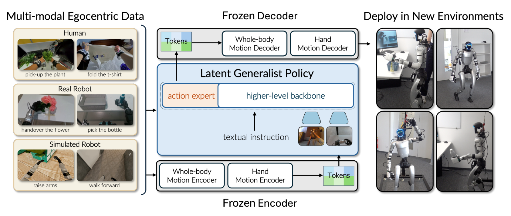
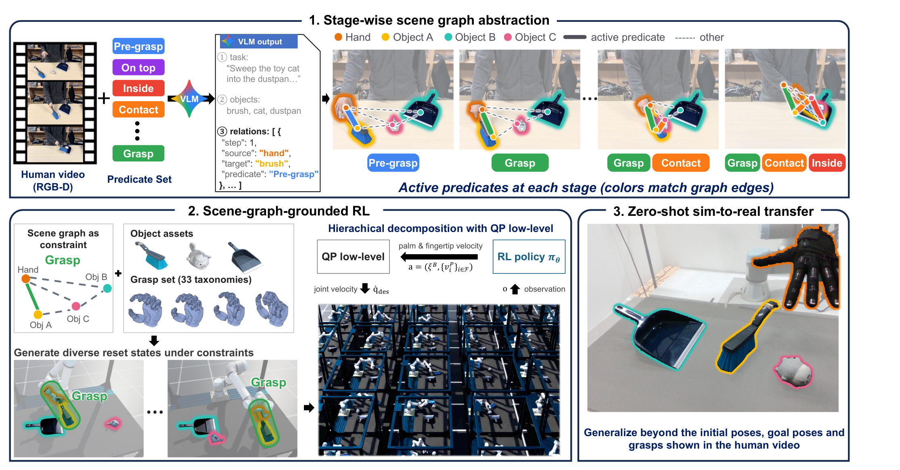

# 2026-10-09 Embodied AI & World Models Daily

> 面向具身智能 / Robotics 研究员与工程师的研究与工程资讯。
>
> 检索窗口：主窗口 2026-10-09 00:00–23:59（北京时间）；补充窗口回溯至 2026-10-07 00:00。**arXiv 公告说明**：本次运行（北京 10-10 01:00 = ET 10-09 13:00）可检索到 **周五 ET 公告批次（v1 实际提交北京 10-09 00:16–01:59，即周四 ET 日间提交）**——该批 cs.RO/AI/LG/CV 合并去重后 167 条进入 abs 页逐条核实（主窗口 20 条 + 补充窗口 139 条 + 窗口外旧提交 8 条排除）。**主窗口 10-09 日间（北京 02:00 后，即周五 ET 批次）的 arXiv 新投稿本次运行不可见，明日日报回补。** 项目页 / GitHub / Hugging Face / ModelScope 均已实际访问核实；全部条目按 T1（一手源）标准收录。

## 🔥 今日必读

### 1. 【VLA与基础模型】VioLA：预测运动潜变量而非关节指令——人类录像直接成为动作标注，真机零样本 30/30 运动 + 31/35 操作（GR00T N1.7 对照 5/30）

**来源：** [arXiv:2610.12435v1](https://arxiv.org/abs/2610.12435)（cs.RO；Mert Albaba, Jens Beißwenger, Anna Manasyan, …, Michael J. Black, Wieland Brendel, Andreas Krause, Georg Martius, Martin Riedmiller）  
**类型：** Paper（research_paper）  
**发布时间：** 实际提交 2026-10-09 01:57（北京时间，主窗口）  
**评分：** 89/100  
**关键词：** Humanoid · 人类演示 · 运动潜空间 · VLA/WAM 跨骨干

**一句话：**  
仿人通用策略的两个障碍（关节空间紧耦合难学、演示稀缺）被一次换目标解决：策略预测 **body/hand 运动潜变量**，冻结的运动编码器把人类与机器人运动映射进**同一潜空间**——人类录像因此就是策略动作空间里的标注（140.6M 帧、93.2% 人类）；Unitree G1 零样本（无任务微调）**30/30 运动、31/35 操作**，released GR00T N1.7 仅 5/30、Ψ0 3/35。

**技术要点：**

- 每个编码器输出 64 坐标运动码（两个 32 维 FSQ 展平、10 帧参考窗）；策略预测 128 坐标潜 chunk（64 body + 64 hand）；**human-then-mixed** 调度：150k 人类步 + 50k 五语料混合步。
- human-only 变体 12/30 运动——人类演示可零机器人演示迁移；robot-only 24/30 vs 混合 30/30（差距全在 bend），但操作反被 robot-only 反超（33/35 vs 31/35）——人类数据是任务依赖的补丁。
- 跨骨干（GR00T / π0.5 / DiT4DiT）同数据同预算：运动都能学，操作 88.6% / 45.7% / 25.7% 剧烈分化；预测延迟 160–249ms，RTC 平滑 chunk 切换。
- 边界：抓取保持类失败集中（Hang Coat 掉落、bottle carrying 全变体 5 次全败）——hand 解码器无接触力反馈；任务族与训练语料重叠的「零样本」。

**为什么值得关注：**  
把 embodiment gap 从轨迹级重定向压缩成潜空间对齐，是「用人类数据学仿人」目前最便宜的一条路径；human-then-mixed 两段调度与「每任务 5 次 × 13 任务」快速真机协议都可直接照抄。对做数据的人：EgoSuite 一套人类录像（131M 帧）顶四个机器人语料的运动指令覆盖。

**资源：**

- Paper：[arXiv 摘要页](https://arxiv.org/abs/2610.12435)
- Project：未发现独立项目页（本日核查）
- Code：论文承诺 code + checkpoints 发布，本日核查未见独立仓库
- Weights：暂无
- Discussion：暂未发现高质量社区讨论（公开 <48h）

---

### 2. 【VLA与基础模型】ARC：不换模型不加数据的推理配方——动作接地因果轨迹重标 DROID，RoboLab-120 三档双登顶、真机 +82.2 点

**来源：** [arXiv:2610.12386v1](https://arxiv.org/abs/2610.12386)（cs.RO；Gokul Puthumanaillam, Tao Sun, Elie Aljalbout, Moritz Reuss, Zhaoshuo Li, Fabio Ramos, Ankit Goyal, Jenai Xuning Yang——UIUC / Stanford / NVIDIA / Sydney / Proception）  
**类型：** Paper（research_paper）  
**发布时间：** 实际提交 2026-10-09 01:38（北京时间，主窗口）  
**评分：** 88/100  
**关键词：** RFM · 因果推理轨迹 · 自动重标 · π0.5 / Cosmos3-Nano

**一句话：**  
提升 robot foundation model 的正交便宜轴：**七段式动作接地因果轨迹**（State/Cause/Consequence/Effect/Avoid/Completion + Action）从现有 DROID 演示**自动重标**（~75K episodes / 1.2M 对齐帧，不采新数据）后全量微调——π0.5 与 Cosmos3-Nano-Policy 在 RoboLab-120 三档 + MolmoSpaces 双双第一（48.8%/45.3% Default），Reasoning-50 **+50.0/+46.8 点**，真机 Reasoning-Hardware 91.7%（+82.2）；推理时外挂 VLM 约 1Hz 刷新轨迹、控制环开销仅 ~10ms。

**技术要点：**

- 反事实惩罚（5% 轨迹替换为矛盾轨迹 + margin 惩罚）防「轨迹当冗余辅助目标」的捷径学习——VLA 需要、8B reasoner 的 WAM 不需要。
- 四个 KF：长视野/动态适应（先清碗才能放香蕉）；**对指令具体度近乎不变**（Vague 45.1 ≈ Specific 45.0，基线 15.2→28.1）；**推理买到推理时加速**（π0.5 单 Euler 步 ≈ 10 步基线）；**训练效率 4.3×**。
- 消融：换外部 VLM（GPT-5.5 45.6% → Gemini Flash 44.4%）不敏感；w/o Action 30.6%、Action only 32.3%——因果账户与动作含义缺一掉 13+ 点；全量微调 45.0% vs action-head-only 30.9%。
- 边界：全部 DROID 本体 + RoboLab 系评测；轨迹刷新 ~1Hz；π0.5+explicit subtasks 只有 21.0%——证明缺的是因果接地不是任务分解。

**为什么值得关注：**  
「先重标演示加推理监督、再全量微调、推理时外挂 VLM 刷新」三段配方可以直接套到任何有演示的 RFM 上——这是本周「语言接口鲁棒性危机」线（Rephrase 的措辞敏感性）从训练侧的解法；且它顺手证明了推理监督能兑换推理时步数与训练迭代数。

**资源：**

- Paper：[arXiv 摘要页](https://arxiv.org/abs/2610.12386)
- Project：[项目页](https://arc-robot-reasoning.github.io/)（Code/Model/Dataset/Reasoning-50 均标注 Coming soon）
- Code：本日核查未检索到开源仓库
- Weights：暂无
- Discussion：暂未发现高质量社区讨论（公开 <48h）

---

### 3. 【世界模型】UNITAS：首个 3D-native 世界动作模型——point flow 统一观测/动作/场景动力学，1.7B 拿下 LIBERO 99.8% 与场景预测最低误差

**来源：** [arXiv:2610.12099v1](https://arxiv.org/abs/2610.12099)（cs.RO 交叉 cs.CV/cs.LG；Ruixiang Wang, Yongyi Su, Wenlve Zhou, Bo Yue 等，DexForce 线）  
**类型：** Paper（research_paper）  
**发布时间：** 实际提交 2026-10-09 01:59（北京时间，主窗口；周四 ET 批次 10-08 23:02 起可观测）  
**评分：** 85/100  
**关键词：** WAM · 3D-native · Point Flow · 跨本体接口

**一句话：**  
图像是视角相关投影、像素距离不编码物理距离——UNITAS 把观测、动作、场景动力学统一进**一个共享度量 3D 坐标系**：动作流 = URDF 采 20 点/臂（人类手 21 个 MANO 关键点）的 3D 位移轨迹、场景流 = 场景点位移，**每条轨迹一个序列元素**（物理时间 tokenizer，秒制 τk=k/f、Tmax=3s 跨数据集共享）；MoT 双专家（point dynamics + action expert）注意力隔离使 **policy-only 推理 55.77ms** 可跳过双流分支。

**技术要点：**

- 无深度时的 3D 位置编码：沿相机射线 64 候选深度注意力路由 + Fourier 特征匹配监督——RGB/RGB-D 联合预训练、推理时深度可缺。
- LIBERO 99.8%（无预训练 99.5%）、RoboTwin 2.0 92.94/93.04%、LIBERO-Plus 89.1%、VLABench 56.2%；**1.7B 参数胜 6B Fast-WAM 与 8B Motus**。
- 场景预测（RoboTwin）：Moving ADE 0.427 vs PointWorld 0.656（四项全最低）；真机两任务 18/20 + 16/20（π0.5 15/20 + 11/20）。
- 消融干净：去 3D PE 掉 18.9 点（最大单项）；scene-flow loss 只 +0.7 点——**双流叙事里场景流分支对策略成功率净贡献小**，价值在预测/评测侧。

**为什么值得关注：**  
WAM 的「受控比较」范式第三天：前两天证明差异来自骨干预训练与数据（OpenWAM/Long-WAM/ΔWAM/CureWM/VPP2），今天 UNITAS 证明**表示空间本身**（像素 → 度量 3D 点流）是另一个可单变量拧的轴——且秒制物理时间 tokenizer 是任何轨迹混合训练都能直接抄的组件。

**资源：**

- Paper：[arXiv 摘要页](https://arxiv.org/abs/2610.12099)
- Project：未发现独立项目页（Under review，27 页 / 11 图 / 13 表）
- Code：[GitHub](https://github.com/DexForce/UNITAS)（2026-10-08 建仓，本日核查 0★）
- Weights：暂未发现独立权重仓库
- Discussion：暂未发现高质量社区讨论（公开 <48h）

---

### 4. 【强化学习】SGS：超大规模 RL 的探索瓶颈——成功率引导采样让 2²⁰ 并行环境真正兑现，Franka 螺母螺栓 70% vs uniform 6%

**来源：** [arXiv:2610.12465v1](https://arxiv.org/abs/2610.12465)（cs.RO；Octi Zhang, Mateo Guaman Castro, Patrick Yin, Ignacio Dagnino, Abhishek Gupta, Rosario Scalise, Byron Boots——UW / NVIDIA）  
**类型：** Paper（research_paper，CoRL 2026）  
**发布时间：** 实际提交 2026-10-09 01:59（北京时间，主窗口）  
**评分：** 84/100  
**关键词：** Mega-Scale RL · 自适应采样 · Sim-to-Real · 装配

**一句话：**  
多样化 reset + 大规模并行能去掉工程先验，但**均匀采样随规模把越来越多环境浪费在「已掌握/还做不了」两端**——Success Guided Sampling 用在线成功率加 Beta 核（mode t、浓度 κ）把采样密度集中在能力前沿，ε 保证全配置非零概率；**2²⁰（超百万）并行环境**下多地形运动 73% vs PLR 54%、Franka 螺母螺栓装配 70% vs uniform 6%/PLR 5%，单调随规模提升而基线饱和崩溃。

**技术要点：**

- 采样器约几十行代码：每配置维护最近 100 次布尔结果 → Beta(1+κt, 1+κ(1−t)) 核打分 → softmax 温度采样；**不需要 value 估计**（对照 PLR 的 GAE+staleness）——与「无 shaped reward 无演示」极简管线配套。
- 4,096 环境时多地形已非零成功（基线全零）；SFL best 0.289/0.421 vs SGS 0.456/0.494（4K/32K），并暴露 SFL 后期衰退。
- 真机零样本：DAgger 蒸馏 RGB 策略，螺母螺栓 37.5%、rod-in-hole 61%、**齿轮啮合 94%**（含翻转螺母、抵轴推齿轮的非抓取操作）；蒸馏本身几乎无损失（90.04→89.05）。
- 边界：离散配置集（K=32,768 够用，连续大空间需学习式评分）；只采样不构造分布（覆盖靠 OmniReset）；重力课程消融 0.702 vs 0.694——主实验冗余设计被诚实标注。

**为什么值得关注：**  
对跑大规模并行 RL 的团队这是当前最便宜的 +19 点来源：reset 处改一行采样器；「并行环境数当采样密度预算」的解释可直接用于论证加 GPU 的边际收益。三任务真机 37.5/61/94% 的巨大差距也提醒：sim-to-real 差距的任务依赖性远未被理解。

**资源：**

- Paper：[arXiv 摘要页](https://arxiv.org/abs/2610.12465)
- Project：[项目页](https://sgs-rl.github.io/)（Code coming soon）
- Code：本日核查未检索到开源仓库
- Weights：暂无
- Discussion：暂未发现高质量社区讨论（公开 <48h）

---

### 5. 【世界模型】DreamTrue：反事实后训练 + 具身视频奖励——人评交互缺陷率 48.12%→6.25%，AgiBot World Challenge 2026 世界模型赛道第一

**来源：** [arXiv:2610.12468v1](https://arxiv.org/abs/2610.12468)（cs.RO 交叉 cs.CV；Junyan Li, Ruizhi Li, Yu Liu, Xiangshuo Liu, Mingchao Sun, Hongyu Pan, Mu Xu, Lue Fan, Zhaoxiang Zhang——中科院自动化所 NLPR / 高德 Amap）  
**类型：** Paper（research_paper）  
**发布时间：** 实际提交 2026-10-09 01:59（北京时间，主窗口）  
**评分：** 84/100  
**关键词：** Robot World Model · 几何标定 · 反事实 · 视频奖励模型

**一句话：**  
用现有机器人数据训世界模型的两个障碍——**标定不准**（动作渲染条件与视频错位）与**成功偏置**（失败动作也预测成功样结果）——DreamTrue 双管齐下：离线几何标定（URDF 渲染 + RoMaV2/SAM3 三组对应联合优化，无需标定板，AgiBot IoU +0.228、97.1% episodes 改善）+ 反事实动作后训练（SE(3) 扰动末端 + IK；三缺陷维度人工标注训 VLM 奖励模型引导 DiffusionNFT）；AgiBot nDTW 0.8772 全场最高，**人评交互缺陷率 48.12%→6.25%**。

**技术要点：**

- 动作转图像空间条件统一格式：渲染 RGB/深度/amodal mask + 夹爪开度→背景灰度 + Plücker 相机射线图，经 VACE 分支注入视频 DiT；四数据集联训（过滤后 2,232 小时、五种臂型）。
- 标定价值直接量化：仅推理时换 refined 已提升全部指标；训练也用再 +1.28dB PSNR、同步误差 7.73→4.60px；仅 RGB 胜依赖立体深度的 PointWorld 75.5%（38,356 episodes）。
- 奖励模型：4,893 held-out 片段 Accuracy 86.33%/Macro-F1 74.21%（三标注者 Fleiss κ=0.7817）；EWMScore-P 上 full 72.51 **低于** w/o RL 72.84——保真-合理性权衡被明确报出。
- 开源：代码三组件（calibration/wmvideo/reward）+ 数据与 checkpoints（[ModelScope](https://modelscope.cn/datasets/huoxingdawang/DreamTrue)）+ 44.9K 视频缺陷标注语料 + 三数据集 153,666 episodes 标定结果。

**为什么值得关注：**  
与 CureWM（10-08 必读）拼成「世界模型失败不敏感」的两条互补路径：CureWM 用执行验证的反事实修**已发布** checkpoint（数据侧），DreamTrue 从**训练侧**构造反事实 + 奖励后训练防成功偏置——加上其标定管线对任何有 URDF+关节状态的数据集即插即用，这是世界模型质量工程的三块拼图补齐。

**资源：**

- Paper：[arXiv 摘要页](https://arxiv.org/abs/2610.12468)
- Project：[项目页](https://brave-eai.github.io/DreamTrue)
- Code：[GitHub](https://github.com/brave-eai/DreamTrue)（2026-10-09 建仓，4★，README 标注 full data 未来更新放出）
- Weights：[ModelScope](https://modelscope.cn/datasets/huoxingdawang/DreamTrue)（数据 & checkpoints）
- Discussion：暂未发现高质量社区讨论（公开 <48h）

---

## 📄 论文雷达

> 以下为主窗口与补充窗口内实际提交、已逐条打开 abs 页核实的次高价值论文，按双评分均分降序；其中 Dex-One2Many 按雷达最高分完成完整精读（本日第 6 篇）。

### 【VLA与基础模型】PLaW-VLA：预测潜世界建模条件 VLA——CoRL 2026，+11.8 pp 长视野、1/19 推理延迟（已精读并嵌图）

**来源：** [arXiv:2610.12285v1](https://arxiv.org/abs/2610.12285)（cs.RO；Yu Liu, Hetian Guo, Tianlv Huang 等 14 人）  
**关键词：** VLA · 潜世界模型 · Mixture-of-Transformers  
**核心贡献：** 在预训练预测导向表示空间建模任务相关未来状态（避免预测控制无关视觉细节），Mixture-of-Transformers 结构化因果注意力条件动作生成；RoboTwin Hard Horizon III +11.8 pp、零样本 LIBERO-Plus +1.77 pp（超重建导向潜预测），轻量潜世界模型并行预测未来、约 1/19 生成式 WAM 推理延迟。  
**值得关注程度：** 80/100  
**Paper：** [arXiv 摘要页](https://arxiv.org/abs/2610.12285)　**Project：** [项目页](https://rainyrobo.github.io/PLaW-VLA/)　**Code：** [GitHub](https://github.com/RainyRobo/PLaW-VLA)（2026-10-04 建仓，2★）

### 【VLA与基础模型】Embodied Turing Machines / COAP：把决策写进代码——无模型在环，RoboDojo 42 任务 70.24%

**来源：** [arXiv:2610.12369v1](https://arxiv.org/abs/2610.12369)（cs.RO 交叉 cs.AI；Kairui Hu, Siyuan Hu, Fangzhou Hong, Zhaoxi Chen, Ziwei Liu——NTU 线）  
**关键词：** Code-as-Policy · 递归自改进 · 显式状态  
**核心贡献：** 「具身世界是一台图灵机：纸带 = 机器人与环境状态、规则 = 策略」——状态表示够准则决策可全写成代码：Code-Only-as-Policy 从相机+本体感知测量跟踪状态、全代码决策、跨任务共享库；无 VLM/VLA 在环，显式状态可存、执行可控可恢复、能力可累积，适合 RSI 闭环；RoboDojo 42 双臂任务 70.24%（无模型测试时）。  
**值得关注程度：** 78/100  
**Paper：** [arXiv 摘要页](https://arxiv.org/abs/2610.12369)

### 【导航与探索】LiteNWM：机载视觉导航的轻量潜世界模型——128× 端到端加速，真机导航 43.3→83.3%

**来源：** [arXiv:2610.12368v1](https://arxiv.org/abs/2610.12368)（cs.RO；Linkai Liu, Yuntian Zhang, Zhenshan Bing, Chen Chen, Lingjuan Lyu, Shangguang Wang, Mengwei Xu, Dongqi Cai）  
**关键词：** 导航世界模型 · 潜空间 rollout · 端侧部署  
**核心贡献：** 直接视觉导航不评估未来后果、生成式 rollout 评多候选太贵——LiteNWM 跨候选共享视觉编码、联合预测多视野动作条件未来表示 + 学习打分器选轨迹；RECON/SCAND/SACSoN 上轨迹误差较 NoMaD+NWM-XL 降 17.56%、RTX 5090 端到端 **128× 加速**；同评估器从 NoMaD 免重训迁移 MBRA（−16.2%）；真机未见室内外环境导航成功 43.3→83.3%。  
**值得关注程度：** 77/100  
**Paper：** [arXiv 摘要页](https://arxiv.org/abs/2610.12368)

### 【操作与抓取】Dex-One2Many：单个人类视频 → 可泛化多指操作——场景图同时定义 reset 分布与谓词奖励（已精读并嵌图，见今日必读）

**来源：** [arXiv:2610.12470v1](https://arxiv.org/abs/2610.12470)（cs.RO 交叉 cs.CV；Jusuk Lee 等 11 人——SNU / UMD / All Purpose AI / KAIST）  
**关键词：** 单视频学习 · 场景图约束 RL · 灵巧手  
**核心贡献：** 单视频学灵巧操作的泛化-探索两难（模仿出不了视频外配置、无引导 RL 探索不动）用**阶段式场景图**解决：只约束关系不约束位姿，图定义观测/密集谓词奖励/reset 三件事；Unseen 配置仿真 85–100%、真机 60–85% vs 基线 ≤15%；四本体只换 URDF 94.6–96.8%。**（本日第 6 篇精读，代表图见下）**  
**值得关注程度：** 83/100  
**Paper：** [arXiv 摘要页](https://arxiv.org/abs/2610.12470)　**Project：** [项目页](https://dex-one2many.github.io/)（Code coming soon）

### 【VLA与基础模型】VersaCamVLA：相机可配置 VLA——NeurIPS 2026，任意数量/位姿视图 → 固定尺寸场景 token

**来源：** [arXiv:2610.12451v1](https://arxiv.org/abs/2610.12451)（cs.RO；Boyao Han, Chen Shi, Jingjing Qian, ZhuoTan Tian, Li Jiang）  
**关键词：** 多视角 · Wrist-Augmented Pose Sampling · 部署鲁棒性  
**核心贡献：** VLA 训练绑定固定相机配置、部署脆——统一场景 token 接口把任意数量 posed RGB 视图映成固定尺寸潜场景 token（多信号目标视角预测 + 腕相机自然运动当免费位姿多样性），轻量空间编码器注入预训练 base VLA 作补充视觉条件，无显式 3D 传感/新视角渲染；RoboTwin/LIBERO/真机一致超先前 VLA 与直接多视角基线。  
**值得关注程度：** 76/100  
**Paper：** [arXiv 摘要页](https://arxiv.org/abs/2610.12451)　**Project：** [项目页](https://boyaohan.github.io/VersaCamVLA.github.io/)

### 【VLA与基础模型】WOVEN：把视觉世界建模织进 MLLM——2,000 例转移 26 个外部基准中的 22 个

**来源：** [arXiv:2610.12417v1](https://arxiv.org/abs/2610.12417)（cs.CV 交叉 cs.CL/cs.LG；Zheyu Fan, Yue Zhang, Mingkai Deng, Kangrui Wang, Qineng Wang, …, Eric P. Xing, Mohit Bansal, Manling Li）  
**关键词：** 视觉转移推理 · 训练原语 · 跨任务迁移  
**核心贡献：** 假设 MLLM 的空间/具身/物理/时序推理缺陷共享同一根因——视觉转移推理；36,076 例（20 场景 × 5 动作 × 8 推理类型）受控训练源 + 基准；38 个前沿 MLLM 全部远低于人类且随规模不消失；~2,000 例子集训练即提升 22/26 个外部基准（最高 +27.3 pp），可替换 30–50% 任务自有训练数据。  
**值得关注程度：** 75/100  
**Paper：** [arXiv 摘要页](https://arxiv.org/abs/2610.12417)

### 【世界模型】ME-World：多智能体自我中心世界模型——细粒度具身交互的同步 ego-stream 生成

**来源：** [arXiv:2610.12299v1](https://arxiv.org/abs/2610.12299)（cs.CV 交叉 cs.AI；Dahyun Chung, Siyoon Jin, …, Seung Wook Kim, Seungryong Kim——Korea University 线）  
**关键词：** 多智能体 · 自我中心 · 共享世界一致性  
**核心贡献：** 现有多智能体世界模型靠粗动作（locomotion/相机控制/离散指令），细粒度具身交互欠开发——ME-World 在共享 token 序列里联合去噪多个 ego-stream、条件全体目标视角位姿、共享环境记忆锚定生成；提出共享世界一致性指标（环境/更新/身份）；真实+合成多智能体数据上全面超现有方法。  
**值得关注程度：** 74/100  
**Paper：** [arXiv 摘要页](https://arxiv.org/abs/2610.12299)

### 【操作与抓取】SpatialHarness：测试时空间脚手架——冻结 GPT-6 Astra 插入任务 26.7→66.7%、汉诺塔 0→100%

**来源：** [arXiv:12457v1](https://arxiv.org/abs/2610.12457)（cs.RO；Jiayu Wang, Yue Yu, Bin Zhu, Zhiyao Yang, Jingjing Chen）  
**关键词：** Test-Time · 空间可观测性 · 免微调  
**核心贡献：** 前沿多模态模型直接控制的瓶颈常不是策略能力而是**空间可观测性**——任务关键空间关系没被物理相机暴露；SpatialHarness 维护在线仿真场景与真实执行同步、识别关键关系、渲染补充虚拟视图给冻结策略（交互感知场景同步区分静态/持握/转移三模式）；四个真机精细任务上同一冻结 GPT-6 Astra 大幅提升。  
**值得关注程度：** 73/100  
**Paper：** [arXiv 摘要页](https://arxiv.org/abs/2610.12457)（项目页 [emilia113.github.io/SpatialHarness](https://emilia113.github.io/SpatialHarness/) 本日核查 404，以 arXiv 为准）

### 【操作与抓取】GNR：生成式神经重定向——流匹配采可行动作流形，8.5% 样本胜 MPC

**来源：** [arXiv:2610.12440v1](https://arxiv.org/abs/2610.12440)（cs.RO 交叉 cs.CV；Dechen Gao, Yue Yang, Ben Abbatematteo, …, Eric Whitmire）  
**关键词：** 人类→机器人重定向 · Flow Matching · 可行动作流形  
**核心贡献：** IK 重定向忽略动力学、RL/MPC 逐轨迹求解样本低效——假设动力学可行轨迹集中在跨演示共享的低维流形上，重定向 = 条件人类运动从流形采样：flow matching 模型以 8.5% MPC 样本量达到 56.20% 成功率（MPC 27.20%），可扩展到大规模长视野毫米精度人类演示的 real-to-sim 数据引擎。  
**值得关注程度：** 72/100  
**Paper：** [arXiv 摘要页](https://arxiv.org/abs/2610.12440)

### 【模仿学习与策略】HT-Policies：异方差 Student-t 回归弥合回归-生成策略差距——单次前馈预测动作 chunk

**来源：** [arXiv:2610.12231v1](https://arxiv.org/abs/2610.12231)（cs.RO；Yuchen Zhou, Jiacheng You, Weikang Wan, Weijun Dong, Yang Gao, Jiayuan Mao）  
**关键词：** 回归策略 · 重尾残差 · 单步前馈  
**核心贡献：** 从统计建模视角重审 MSE-回归 vs 扩散/流匹配策略差距：真实演示残差重尾、MSE 把梯度大头分配给大残差观测伤优化——异方差 Student-t 动作回归学输入依赖残差尺度、单次前馈出动作 chunk、可复用预训练流匹配骨干；四个仿真基准+真机与生成策略基线相当，训练推理都更快。  
**值得关注程度：** 72/100  
**Paper：** [arXiv 摘要页](https://arxiv.org/abs/2610.12231)　**Project：** [项目页](https://the-labone.github.io/regression-policy-project/)　**Code：** [GitHub](https://github.com/the-labone/RegressionPolicy)（2026-10-07 建仓，0★）

---

## 🛠 工程与开源

### DreamTrue 全家桶（[GitHub](https://github.com/brave-eai/DreamTrue) + [ModelScope](https://modelscope.cn/datasets/huoxingdawang/DreamTrue)）

三组件代码（calibration / wmvideo / reward）+ 数据与 checkpoints + 44.9K 视频缺陷标注语料 + 三数据集 153,666 episodes 标定结果（详见必读 #5）。离线标定管线对任何有 URDF+关节状态记录的数据集即插即用；三缺陷维度标注体系是现成的具身视频奖励训练源。

### UNITAS 官方实现（[GitHub](https://github.com/DexForce/UNITAS)，0★）

10-08 建仓即放出；秒制物理时间轨迹 tokenizer 与无深度 3D PE 注意力路由（式 6–7）是独立可复用组件；56/123/305ms 三档推理模式按延迟预算选档。

### PLaW-VLA 官方实现（[GitHub](https://github.com/RainyRobo/PLaW-VLA)，2★）

预测导向表示空间的轻量潜世界模型 + MoT 结构化因果注意力；1/19 生成式 WAM 延迟的工程数字值得直接对标。

### RegressionPolicy（HT-Policies）官方实现（[GitHub](https://github.com/the-labone/RegressionPolicy)，0★）

异方差 Student-t 回归头可插进任何流匹配策略骨干当快速推理模式；ht_loss 子目录独立可用。

### RoboRSI：移动操作机器人的稳定自进化（[项目页](https://lab.noematrix.ai/blog/2-roborsi/)）

Top-Down Skill Refinement 把任务拆成 compound/atomic/base 技能（显式输入输出契约、结果归因到责任分支、修订限制在该分支）；Manager/Planner/Engineer/Reviewer 协调规划-执行-诊断-验证发布；真机移动操作 104 轮发展多物体整理，LIBERO/LIBERO-PRO/LIBERO-Plus/RoboTwin 超最强基线 2.7–11.0 pp。

---

## 💬 社区信号

> 本窗口（周五 ET 批次）论文公开 <48h，社区讨论整体清淡；HN 首页无具身相关高热帖。值得继续观察的信号：

- **「受控比较」范式进入 WAM 的第三天，从预训练/数据侧烧到表示空间侧**：昨天四篇（OpenWAM/Long-WAM/ΔWAM/CureWM）把「WAM 差异来自骨干与数据不是交互结构」钉死；今天 UNITAS 把**表示空间**（像素 → 度量 3D point flow）做成新单变量（去 3D PE 掉 18.9 点），DreamTrue 把**条件对齐**（标定）做成新单变量（IoU +0.228 → PSNR +1.28dB）——「给 WAM 拧哪个螺丝」正在从架构论战变成查表工程。
- **人类数据两条正交路线同日到达**：VioLA（潜空间对齐让人录当动作标注，human-then-mixed +20 点运动）与 Dex-One2Many（场景图当任务规范驱动 RL，Unseen 60–85% vs ≤15%）——一个解决「数据怎么标」、一个解决「任务怎么约束」，两条都明确报出自己的边界（VioLA 操作被 robot-only 反超、D12 单任务策略）。
- **GitHub 新仓监控**：[brave-eai/DreamTrue](https://github.com/brave-eai/DreamTrue)（10-09 建仓当天 4★，本批最快，ModelScope 已放数据与 checkpoints——**本周最值得盯的开源事件**）、[DexForce/UNITAS](https://github.com/DexForce/UNITAS)（10-08，0★）、[RainyRobo/PLaW-VLA](https://github.com/RainyRobo/PLaW-VLA)（10-04，2★）、[the-labone/RegressionPolicy](https://github.com/the-labone/RegressionPolicy)（10-07，0★）。
- **AgiBot World Challenge 2026 世界模型赛道**：DreamTrue 以 48.12→6.25% 缺陷率拿下第一——机器人世界模型的**人评物理合理性**正在从轶闻指标变成竞赛指标，与 EWMBench/WorldArena 系评测工具呼应。

---

## 🔎 补充窗口筛选记录

> 周五 ET 公告批次（cs.RO/AI/LG/CV 合并）中，v1 实际提交北京 10-09 00:16–01:59 的 20 条主窗口条目 + 10-07/10-08 提交的 139 条补充窗口条目共 167 条经 abs 页逐条核实（另 8 条 v1 早于 10-07 的旧提交排除）。cs.RO 批共 105 条，其中约 25 条标题 triage 即判非学习类（传感器设计/医疗执行/农业植保/无人机单机等）不赘。

| 条目 | 实际时间（北京时间） | 排除/处理原因 |
|---|---|---|
| [arXiv:2610.12435v1](https://arxiv.org/abs/2610.12435) VioLA | 10-09 01:57 | 主窗口 → 已收录（必读 #1，精读完成） |
| [arXiv:2610.12386v1](https://arxiv.org/abs/2610.12386) ARC | 10-09 01:38 | 主窗口 → 已收录（必读 #2，精读完成） |
| [arXiv:2610.12099v1](https://arxiv.org/abs/2610.12099) UNITAS | 10-09 01:59 | 主窗口 → 已收录（必读 #3，精读完成） |
| [arXiv:2610.12465v1](https://arxiv.org/abs/2610.12465) SGS | 10-09 01:59 | 主窗口 → 已收录（必读 #4，精读完成） |
| [arXiv:2610.12468v1](https://arxiv.org/abs/2610.12468) DreamTrue | 10-09 01:59 | 主窗口 → 已收录（必读 #5，精读完成） |
| [arXiv:2610.12470v1](https://arxiv.org/abs/2610.12470) Dex-One2Many | 10-09 01:59 | 主窗口 → 已收录（雷达 #4，精读完成） |
| [arXiv:2610.12285v1](https://arxiv.org/abs/2610.12285) PLaW-VLA | 10-09 00:41 | 主窗口 → 已收录（雷达 #1） |
| [arXiv:2610.12369v1](https://arxiv.org/abs/2610.12369) COAP | 10-09 01:29 | 主窗口 → 已收录（雷达 #2） |
| [arXiv:2610.12368v1](https://arxiv.org/abs/2610.12368) LiteNWM | 10-09 01:29 | 主窗口 → 已收录（雷达 #3） |
| [arXiv:2610.12451v1](https://arxiv.org/abs/2610.12451) VersaCamVLA | 10-09 01:58 | 主窗口 → 已收录（雷达 #5） |
| [arXiv:2610.12417v1](https://arxiv.org/abs/2610.12417) WOVEN | 10-09 01:52 | 主窗口 → 已收录（雷达 #6） |
| [arXiv:2610.12299v1](https://arxiv.org/abs/2610.12299) ME-World | 10-09 00:50 | 主窗口 → 已收录（雷达 #7） |
| [arXiv:2610.12457v1](https://arxiv.org/abs/2610.12457) SpatialHarness | 10-09 01:59 | 主窗口 → 已收录（雷达 #8） |
| [arXiv:2610.12440v1](https://arxiv.org/abs/2610.12440) GNR | 10-09 01:57 | 主窗口 → 已收录（雷达 #9） |
| [arXiv:2610.12231v1](https://arxiv.org/abs/2610.12231) HT-Policies | 10-09 00:16 | 主窗口 → 已收录（雷达 #10） |
| [arXiv:2610.12424v1](https://arxiv.org/abs/2610.12424) RoboRSI | 10-09 01:55 | 主窗口 → 已收录（工程与开源节） |
| [arXiv:2610.12404v1](https://arxiv.org/abs/2610.12404) PI-UDF | 10-09 01:45 | 主窗口，双 Franka 14-DoF 近距避碰的可微 UDF 距离场 + 非线性 MPC → 控制理论落点为主，学习分量单一，列观察 |
| [arXiv:2610.12272v1](https://arxiv.org/abs/2610.12272) Walking on Roofs | 10-09 00:36 | 主窗口，四足屋顶作业的系统评估（Go2 标准球足 25° 即临界失效）→ 应用域报告，无学习方法创新，列观察 |
| [arXiv:2610.12276v1](https://arxiv.org/abs/2610.12276) LUNA 月球四足 | 10-09 00:37 | 主窗口，ANYmal-D/Magnecko 月壤模拟场地部署经验 → 场域报告，列观察 |
| [arXiv:2610.12241v1](https://arxiv.org/abs/2610.12241) 微观机器人焦点栈 | 10-09 00:21 | 主窗口，语言→焦平面轨迹积分（6.28px RMSE）→ 微观域，离主线的操作学习远，列观察 |
| [arXiv:2610.12245v1](https://arxiv.org/abs/2610.12245) FRPR 姿态残差 | 10-09 00:23 | 主窗口，跨数据集 HRI 预判的几何/姿态残差分解 → HRI 感知落点，测量构造为主，列观察 |
| [arXiv:2610.10515v1](https://arxiv.org/abs/2610.10515) RoboJEPA | 10-08 01:54 | **已在 10-08 日报收录**（必读 #1 精读），本次重核无变化，不重复 |
| [arXiv:2610.10846v1](https://arxiv.org/abs/2610.10846) LAC-WM | 10-08 03:51 | 补充窗口，隐动作空间跨本体世界模型（灵巧操作 +46.7% / LIBERO +11.7%，随预训练本体数正扩展）→ 与 UNITAS 同日同题（跨本体动作接口），Stanford/Fei-Fei 线，下期与 UNITAS 合并评 |
| [arXiv:2610.10270v1](https://arxiv.org/abs/2610.10270) VPP2 | 10-07 23:40 | **已在 10-08 日报收录**（必读 #5 精读），不重复 |
| [arXiv:2610.09134v1](https://arxiv.org/abs/2610.09134) CureWM | 10-07 05:26 | **已在 10-08 日报收录**（必读 #4 精读），不重复；本日 DreamTrue 与其构成两条互补路径（必读 #5 已对照） |
| [arXiv:2610.09117v1](https://arxiv.org/abs/2610.09117) Workhorse | 10-07 05:06 | **已在 10-08 日报收录**（雷达 #5），不重复 |
| [arXiv:2610.12026v1](https://arxiv.org/abs/2610.12026) HWAM | 10-08 22:23 | 补充窗口，人形 WAM 联合状态-动作生成（参考动作 vs 实际执行的 action-execution gap 显式建模）→ 人形 WAM 线，与 Being-M0.7 同题，下期合并评 |
| [arXiv:2610.11283v1](https://arxiv.org/abs/2610.11283) Being-M0.7 | 10-08 13:49 | 补充窗口，10,000+ 小时混合模态人类数据的潜世界动作模型（预训练/中训练/动作后训练三段）→ 同上人形线，列观察 |
| [arXiv:2610.12090v1](https://arxiv.org/abs/2610.12090) FLOWMEM | 10-08 23:00 | 补充窗口，VLA 潜推理流的记忆复用（检索重组兼容潜片段 + 证据精修）→ VLA 推理时线，列观察 |
| [arXiv:2610.12016v1](https://arxiv.org/abs/2610.12016) CausalDreamer | 10-08 22:12 | 补充窗口，冻结 tokenizer 上重编码四组潜变量（可控性 × 奖励相关性两轴）→ 世界模型可解释性线，Dreamer 4 系，列观察 |
| [arXiv:2610.10778v1](https://arxiv.org/abs/2610.10778) MemoWM | 10-08 02:33 | 补充窗口，世界模型压缩 agent 长期记忆（存储 −53.9%）→ agent 记忆线，纯软件 agent 落点，边缘 |
| [arXiv:2610.10932v1](https://arxiv.org/abs/2610.10932) WMPA | 10-08 05:41 | 补充窗口，冻结目标条件策略组合的世界模型仲裁者（测试时选谁执行）→ 离线 RL 线，22 页 3 图 14 表 + 代码，列观察 |
| [arXiv:2610.02660v1](https://arxiv.org/abs/2610.02660) SpectralCache | 10-02 09:28 | **窗口外**（v1 提交早于补充窗口下界；周五公告日新公开），扩散世界模型谱特征缓存加速，排除 |
| [arXiv:2610.08800v1](https://arxiv.org/abs/2610.08800) 动态环境 WM 综述 | 07-27 20:00 | **窗口外**（同上），综述，排除 |
| [arXiv:2610.08802v1](https://arxiv.org/abs/2610.08802) SAFE | 07-30 01:46 | **窗口外**（同上），声学滑移检测，排除 |
| [arXiv:2610.08807v1](https://arxiv.org/abs/2610.08807) 农业植保 VLM | 09-10 00:05 | **窗口外**（同上），排除 |
| [arXiv:2610.08812v1](https://arxiv.org/abs/2610.08812) Go2-DrivoR | 09-23 14:55 | **窗口外**（同上），四足导航驾驶策略适配，排除 |
| [arXiv:2610.08852v1](https://arxiv.org/abs/2610.08852) 液滴 MBRL | 10-03 12:06 | **窗口外**（同上），SDL 化学落点，排除 |
| [arXiv:2610.08862v1](https://arxiv.org/abs/2610.08862) CIRRA | 10-06 03:14 | **窗口外**（同上），具身 agent 指令调和，排除 |
| [arXiv:2610.08870v1](https://arxiv.org/abs/2610.08870) 可穿戴→灵巧策略 | 10-06 11:22 | **窗口外**（同上），外骨骼几何对演示影响，排除 |
| 其余约 110 条 | — | 触觉/医疗/农业/无人机单机/SLAM 工程/多机器人定位/纯驾驶等：单组规模小或非学习方法贡献，逐条判断后不赘 |

---

## 📊 今日技术趋势

今天 167 条窗口内条目最显眼的是 **「受控比较」范式从 WAM 的预训练/数据侧烧到表示与对齐侧**。UNITAS 把表示空间做成新单变量（像素 → 度量 3D point flow，去 3D PE 掉 18.9 点是本批最大单项消融）、DreamTrue 把条件对齐做成新单变量（标定 IoU +0.228 兑换成 PSNR +1.28dB），加上前两天的 OpenWAM/Long-WAM/ΔWAM/CureWM/VPP2——**连续三天、每天三到四篇都在用单变量消融回答「WAM 的差异到底来自哪里」**，答案从「骨干与数据」扩展到「表示空间与条件对齐」，「各自拼架构」的写法已经完全退场。

第二条主线是 **人类数据的两条正交路线同日到达**。VioLA 用潜空间对齐让人录直接当动作标注（human-then-mixed 比纯机器人 +20 点运动，但操作被反超 5.7 点）、Dex-One2Many 用场景图当任务规范驱动 RL（Unseen 配置 60–85% vs 基线 ≤15%，四本体只换 URDF）——一个解决「数据怎么标」、一个解决「任务怎么约束」，且两篇都明确报出自己的边界而不是互踩。配上 ARC 从既有 DROID 演示自动重标因果轨迹（+50 点 Reasoning-50），「不采新数据、把既有数据用得更聪明」已经是本周最密集的方向。

第三，**大规模 RL 的调度侧补齐**：SGS 证明均匀采样在 2²⁰ 并行环境下的浪费可以用几十行 Beta 核采样器收回（Franka 装配 70% vs 6%），且不需要 value 估计——与昨天 RoboJEPA 的「预算可预测性」呼应，「加环境数之前先问采样密度」正在变成大规模训练的默认检查项。

---

## 📚 精读索引

本日精读产物见 [paper-reading/news/2026-10-09/README.md](../paper-reading/news/2026-10-09/README.md)（今日必读论文 5 篇 + 雷达高分 1 篇 Dex-One2Many，共 6 篇全部完成完整精读工作流；40 张图通过 Visual Review 后 materialized，其中 2 张为原裁剪缺陷的手动重裁修复）。
