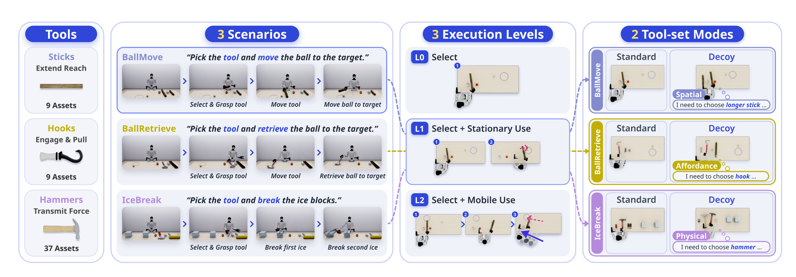
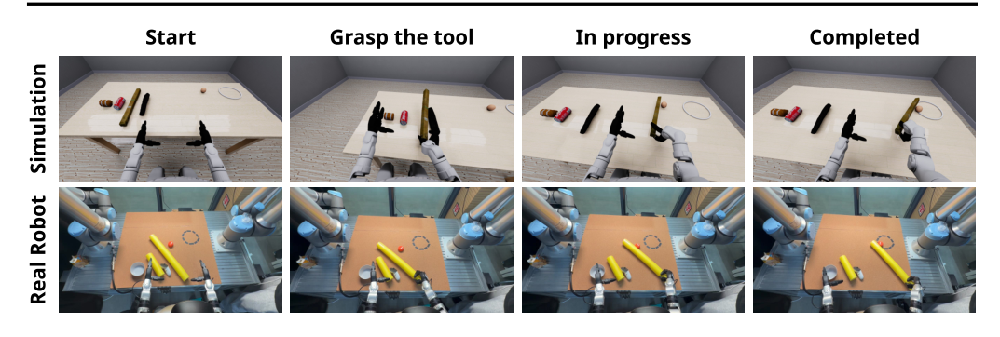
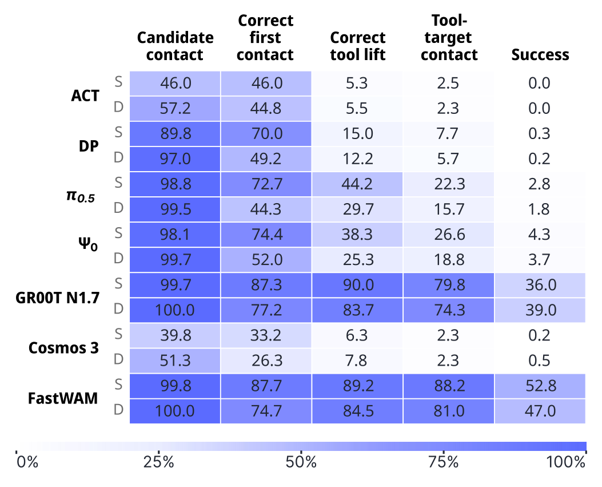
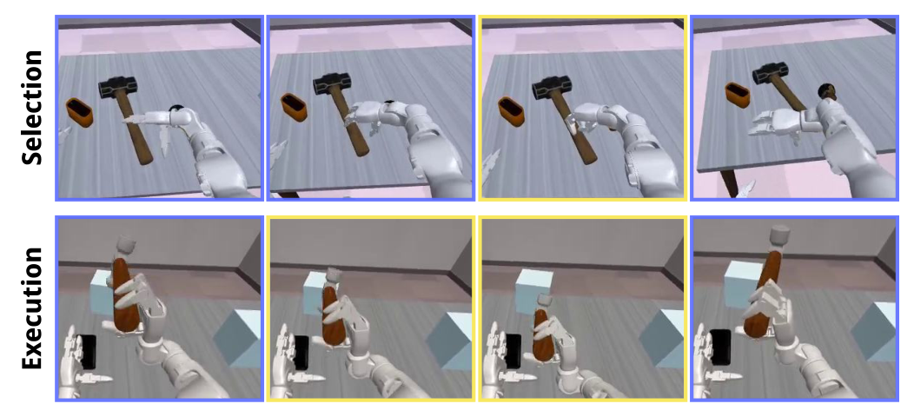
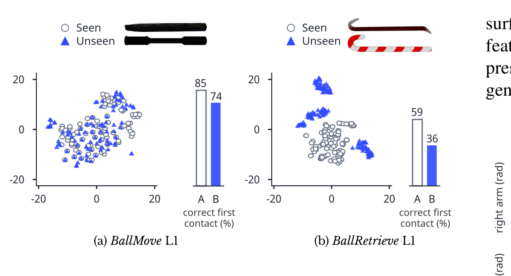
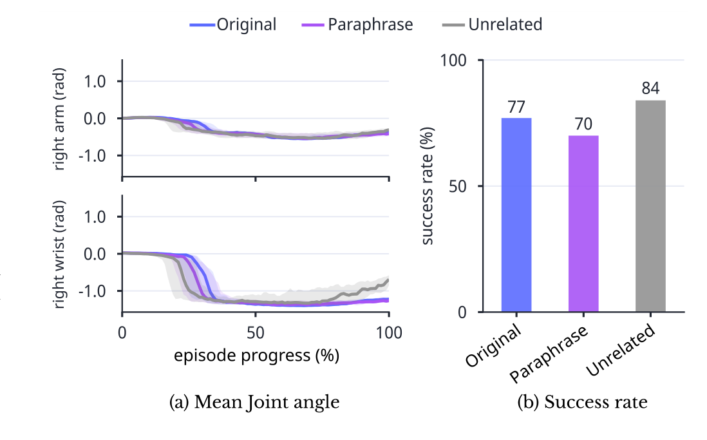

# HumanoidToolBench: Benchmarking Humanoid Tool Use from Selection to Mobile Execution

> arXiv:2610.02089 · 2026-10-01 v1 · SNU · UMass Amherst · Google Research（Kyochul Jang 等，Youngjae Yu 通讯）· 项目页：https://snu-pi.github.io/HumanoidToolBench/
>
> 这篇笔记回答四个问题：这个基准到底比现有多测了什么维度、3.1k 演示是怎么从 1,959 次遥操作尝试里挤出来的、七个策略的失败卡在哪一级、以及「诱饵改变首接触但不改变成功率」这个反直觉结果说明什么。阅读前提：知道 VLA/WAM/IL 三类策略的基本区别即可。

## 基准要测什么：三轴设计的动机

现有基准各缺一角。操作基准（LIBERO、RoboTwin 2.0）测机械臂不测人形；人形基准里 Humanoid-Bench 测全身控制、SIMPLE 分级报告失败点但**不改变任务所需的决策**、WOLF-VLA 不放人演数据；工具类基准里 PhysToolBench 只测理解不执行、DexCraft 单臂且工具直接给、RoboWits 双臂选工具但不分级。HumanoidToolBench 的定位是把这些维度正交地放到同一张表上：**一个 Unitree G1 人形，从 55 个工具里选，静止用和边走边用，候选集里有没有以假乱真的干扰项**。

三个设计原则值得单独说，因为它们决定了后面所有数字的读法：

- **真实效用**：三个场景分别对应工具的三种日常功能——BallMove 用长杆推球（空间约束：杆要够长把球送进 0.12 m 圆形目标区）、BallRetrieve 用钩把球拉回（供能约束：钩形要能勾住球远侧）、IceBreak 用锤砸冰（物理约束：材质要硬到能砸碎）。工具功能分类也是按这个来的：Sticks 伸长（9 资产）/ Hooks 勾拉（9）/ Hammers 传力（37）。
- **可解释性**：不只报成功率。执行分 L0（选对并举起，判据 $b^\star$ 抬升 ≥0.08 m）/ L1（静止使用）/ L2（沿桌移动中使用，目标或冰块移到工具侧）三级，episode 内还记录五个执行事件（候选接触 → 正确首接触 → 正确举取 → 工具-目标接触 → 成功）。
- **功能性选择**：诱饵（decoy）模式不换指令、只换候选集——加一个**只在任务所需属性上**与 $b^\star$ 不同的工具：BallMove 里同质量但 0.30 m 替 0.50 m 的短杆、BallRetrieve 里同长度同质量的直杆替钩、IceBreak 里软蝇拍/滚漆筒/搋子替金属锤。

*论文原图编号：Fig. 1。总览三栏：Unitree G1 + Dex3 手与 55 工具库、ToolBook 3.1k 人演数据；任务结构公式（场景 × 执行层级 × 工具集模式）；真机评测序列。放在开头是为了让三轴结构先于任何数字建立。*

## 任务结构与环境

### POMDP 与控制栈

任务形式化为目标条件 POMDP $\mathcal{M} = (\mathcal{S}, \mathcal{A}, \mathcal{O}, P, \Omega, G)$，二值成功判据替代奖励。观测 $o_t = (I_t, x_t)$：头相机图像 + 32 维机器人状态（手/臂/腰关节 + 上一底盘高度命令），**不含任何物体信息**——选哪个候选只能从 $g$ 和图像推断。动作 36 维：手/臂/腰目标 + 新底盘高度 + $(v_x, v_y, m, \psi^\star)$（前后/侧向速度、转向模式、目标航向）。下肢由预训练 GR00T Balance/Walk RL 控制器执行——策略只发指令，步态不是学出来的。仿真 MuJoCo，每 episode 重采样候选集、洗牌位置、随机化表面材质与光照；真机同一 G1（29 体关节 + 双 7 关节 Dex3 手 + 头相机）。

*论文原图编号：Fig. 2。从左到右：55 工具按功能三类（Sticks 9 / Hooks 9 / Hammers 37 资产）；三个场景各自的四步执行序列与指令原文；三个执行层级（L0 选 / L1 静止用 / L2 移动用）的递进；标准/诱饵两种工具集模式与诱饵气泡说明。放在这里是因为这张图就是 18 = 3×3×2 的完整展开。*

### 执行协议

策略开环执行 action chunk 后再查询下一次观测：chunk 长度沿用各策略训练配置（ACT 100 步 / GR00T N1.7 40 / FastWAM 32 / Ψ0 30 / 其余 16），无时间集成。仿真每任务 100 episodes、种子跨策略配对、$H$=3,000 步 @50 Hz（1 分钟）；真机每场景-模式组合 10 次试验、1 分钟上限，成功需目标状态保持 1 s，失败包含超时与安全停止。

## ToolBook 数据集：从 1,959 次尝试里挤出 3,094 条

8 名熟练遥操作者用 Meta Quest 在仿真与真机上操作，共 1,959 次 L1/L2 仿真尝试，产出 12 个 L1/L2 任务各 100 条成功演示（1,200 条）。**L0 不单独采集**：任何一次尝试里 $b^\star$ 抬升 ≥0.08 m 的首帧截断即为一条 L0 轨迹——1,803 条 L0 中 1,189 来自成功演示、614 来自**不成功尝试**（失败尝试的前缀也是「选对并举起」的有效数据）。加上 91 条真机 L1（BallMove/BallRetrieve）精选演示，ToolBook 共 3,094 条。LeRobot 格式，CC BY-NC 4.0。

训练协议：仿真评测用 sim-only（3,003 条仿真轨迹，每策略单次训练 40,000 updates、batch 128、保证每任务 ≥1 样本；GR00T N1.7 / π0.5 / Cosmos 3 用 DROID 检查点，Ψ0 / FastWAM 用各自预训练权重，ACT / DP 挂冻结 CLIP ViT-L/14 文本编码器获得语言条件）。真机评测的策略在仿真权重上继续 5,000 updates（91 条真机演示）。

我的分析：L0 前缀派生是这份采集协议里最值得抄的一笔——它把遥操作的失败尝试变成了训练资产，且 L0/L1/L2 天然共享分布（同一次尝试的三种标签视角），避免了三级任务分布错位。

## 主结果：移动崩塌与诱饵效应

七策略 × 18 任务（每格 100 episodes，表内按 BallMove/BallRetrieve/IceBreak 三值报告）：

| 家族 | 策略（参数量） | L0 S（三场景均值趋势） | L1 S | L2 S | L1 D |
| --- | --- | --- | --- | --- | --- |
| IL | ACT（52.1M） | 5/0/0 | 0/0/0 | 0/0/0 | 0/0/0 |
| IL | DP（84.7M） | 14/5/17 | 0/0/2 | 0/0/0 | 0/0/1 |
| VLA | π0.5（3.62B） | 29/24/31 | 4/0/12 | 1/0/0 | 5/3/1 |
| VLA | Ψ0（2.63B） | 19/14/22 | 9/0/13 | 1/0/2 | 7/3/8 |
| VLA | GR00T N1.7（3.14B） | 77/73/88 | 64/36/66 | 10/9/31 | 58/30/63 |
| WAM | Cosmos 3 Edge（3.37B） | 12/0/2 | 0/0/1 | 0/0/0 | 2/0/0 |
| WAM | FastWAM（6.02B） | 64/62/98 | 76/57/86 | 9/20/69 | 75/45/82 |

三条最粗的读法：

1. **移动执行全面崩塌**。凡 L1 非零的策略，L2 全部下降。最陡的是 FastWAM 标准 BallMove：76% → 9%。GR00T N1.7 两个球类任务也大掉，但 IceBreak 相对保留（L2 S 31%）——移动难度取决于需要的交互类型，不是统一的「会走就会用」。
2. **诱饵伤害选择多于伤害完成**。两个强策略在 D 模式 L1 全面下降（FastWAM BallRetrieve 57%→45%），但看事件级数据（下节）会看到首接触掉的比成功率多——初始选错常被后续自我纠正。
3. **retrieve（钩拉）比 push/strike 难**。即使最强的两个策略，L1 里 retrieve 也是三场景最低——供能约束（钩形）比空间/物理约束更难被视觉策略识别。

真机（L1，sim+real 后）：GR00T N1.7 标准 BallMove 6/10、诱饵 4/10；BallRetrieve 两模式各 4/10；FastWAM 5/10 与 4/10、4/10 与 5/10；ACT 最高 2/10。仿真强 → 真机强的排序保持，且只用了 91 条真机数据 + 5,000 updates 的短适配——**真机瓶颈不在适配数据量，在仿真里学到的能力本身**。

*论文原图编号：Fig. 3。GR00T N1.7 BallMove 在仿真（上行）与真机（下行）四个配对相位（开始 / 抓取工具 / 进行中 / 完成）的执行序列。放在这里是为了给「仿真+真机短适配即领先」提供可见证据。*

## 失败定位：五级事件漏斗

Fig 5 把同一批 L1/L2 rollout 按 episode 级布尔事件拆开（三场景 × L1/L2 × 两模式等权平均）：

| 策略（S 模式） | 候选接触 | 正确首接触 | 正确举取 | 工具-目标接触 | 成功 |
| --- | --- | --- | --- | --- | --- |
| DP | 89.8% | 70.0% | 15.0% | 7.7% | 0.3% |
| π0.5 | 98.8% | 72.7% | 44.2% | 22.3% | 2.8% |
| GR00T N1.7 | 99.7% | 87.3% | 90.0% | 79.8% | 36.0% |
| FastWAM | 99.8% | 87.7% | 89.2% | 88.2% | 52.8% |

两个断崖两种病：**弱策略败在举取之前**（DP 接触到候选 89.8% 但正确举取只 15.0%——够得着、选不对、拿不起来）；**强策略败在接触目标之后**（FastWAM 举取 89.2%、碰到目标 88.2%，最后成功只剩 52.8%——工具在手、目标在手边，交互仍然失败）。这就是执行事件比单一成功率值钱的地方：它告诉你该去修选择模块还是修交互控制。

诱饵的效应也在事件级看得更清楚：GR00T N1.7 / FastWAM 正确首接触 87.3→77.2 / 87.7→74.7（掉 ~10pp），成功率 36.0→39.0 / 52.8→47.0（±3pp）。且 D 模式下正确举取（83.7 / 84.5%）**高于**正确首接触——策略经常先碰错再改对。首选择与最终持取是两个可分离的能力。

*论文原图编号：Fig. 5。七策略 × 五执行事件的成功率热图（S/D 双行，色条 0–100%）。放在这里是因为它是全文信息密度最高的一张图：两级断崖（接触→举取、接触→成功）直接可读。*

人工检视 rollout（Fig 4）给出两类定性失败：诱饵场景里完整地拾起并使用诱饵（选择-任务失配，但抓取执行无碍）；以及抓取位姿与工具朝向导致无法有效接触目标（空间对齐错误）。

*论文原图编号：Fig. 4。上行：诱饵误拾（Decoy pickup）——选错工具但抓取流畅；下行：工具-目标空间对齐错误，黄框标出出错帧。放在这里是为了把漏斗里的「失败」落到可见的行为上。*

## 探针：工具外观泛化与指令跟随

两个针对性探针都用 GR00T N1.7（在 1,593 条标准模式演示上训练 40,000 updates）：

**工具替换**（L1 诱饵配对场景，seen vs unseen 工具实例，各 100 episodes）：BallMove 里 seen/unseen 的 t-SNE 特征大量重叠，正确首接触 85%→74%；BallRetrieve 里 unseen 钩类特征明显分离成组，首接触 59%→36%。特征分离程度与选择下降幅度对应——**对未见工具外观的泛化有限，且钩类（供能属性）比杆类（空间属性）受害更深**。

**指令替换**（固定标准 IceBreak 场景，100 rollouts/条件）：原文指令 77% 成功、改写 70%、**无关语句（「今天天气不错」）84%**。关节轨迹上三种条件基本重合（右臂宽轮廓一致、中段腕关节模式共享）。无关指令下策略照常砸冰——**行为由场景驱动，指令只是冗余信号**。作者的措辞很克制：这说明「测指令跟随需要指令与场景冲突的设置」，而不是宣称测出了指令跟随能力。

*论文原图编号：Fig. 6。(a) BallMove、(b) BallRetrieve 的 L1 诱饵场景：工具区视觉特征 t-SNE（圆=seen、三角=unseen）+ 正确首接触柱状图（85→74、59→36）。放在这里是因为它把「未见工具泛化差」从直觉变成了可配对测量的证据。*

*论文原图编号：Fig. 7。固定 IceBreak 场景下三种指令的 (a) 右臂/右腕关节角中位数与 IQR 带、(b) 成功率（77/70/84%）。放在这里是为了呈现「无关指令下任务照常完成」这一最反直觉的结果。*

## 证据边界与局限

**作者承认的**（Discussion and Limitations 原文要点）：主表每策略单次训练，episode 波动来自场景与 rollout 而非训练种子不确定性；L2 同时改变布局与移动需求，两个因素没有分离；首接触只是初始选择的代理；t-SNE 投影只说明特征组织、确立功能性识别还需要外观控制；指令探针只有一个固定场景；真机只覆盖 3 策略 × 2 个 L1 场景。自中心视野限制空间对齐是**受视频启发的假设**，未经相机对照实验验证。

**我的分析**：另一层边界在基线选择上——ACT/DP/Cosmos 3 在 L1 已接近全零，它们在表里的作用主要是填充「弱策略」一栏；DROID 检查点（GR00T N1.7 / π0.5 / Cosmos 3）与各自预训练权重（Ψ0 / FastWAM）的预训练分布不同，家族间比较（VLA vs WAM）因此不干净——但同家族内 L1 vs L2、S vs D 的受控对照不受影响，这也是本文结论主要依赖的对照。真机 10 次/格的样本量下 6/10 与 5/10 的差异没有统计意义，只能读排序。

**尚不能确定**：诱饵自我纠正（首错后改对）是策略的显式重规划还是 chunk 边界的重新采样偶然擦对了；L2 崩塌里移动与布局各占多少；GR00T N1.7 在 D 模式 BallMove L2 反而 10%→30% 这一反常提升的机制。

## 可以带走的东西

- **诱饵设计模板**：只在任务所需属性上制造差异（同质量改长度 / 直杆替钩 / 软替硬），其余保持不变——比「加一堆相似物体」的干扰项设计干净得多，能归因到属性级。
- **L0 前缀派生**：失败遥操作尝试的 $b^\star$ 抬升首帧截断即 L0 数据——一次采集三份标签，且失败轨迹不浪费。
- **五级执行事件报告格式**：candidate contact / correct first contact / correct tool lift / tool-target contact / success，比成功率多出两级可行动的失败定位。
- 「**场景驱动行为、指令冗余**」这条探针结论对做 VLA 评测的人都该是一记警钟：指令跟随必须在指令与场景冲突的设置下测，否则测到的是场景记忆。

## 参考与资源

- Paper: [arXiv:2610.02089](https://arxiv.org/abs/2610.02089)（v1，2026-10-01；9 页）
- Project: [snu-pi.github.io/HumanoidToolBench](https://snu-pi.github.io/HumanoidToolBench/)（ToolBook 数据集发布处；评测代码标注 paper coming soon）
- 数据：ToolBook 3,094 条演示（LeRobot 格式，CC BY-NC 4.0）
- 对照基线：GR00T N1.7、Ψ0、π0.5、FastWAM、Cosmos 3 Edge Policy、ACT、DP
