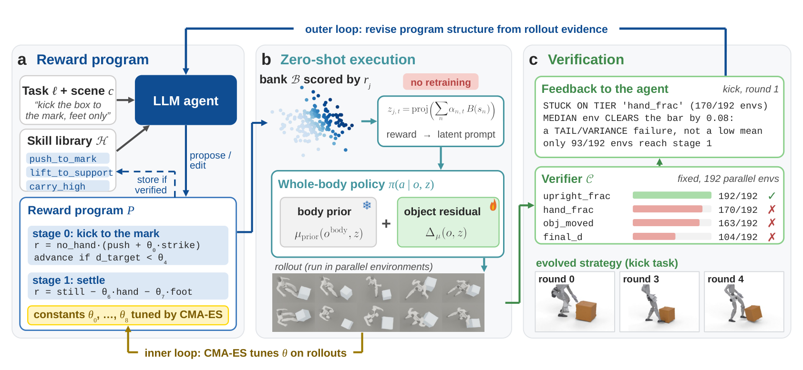
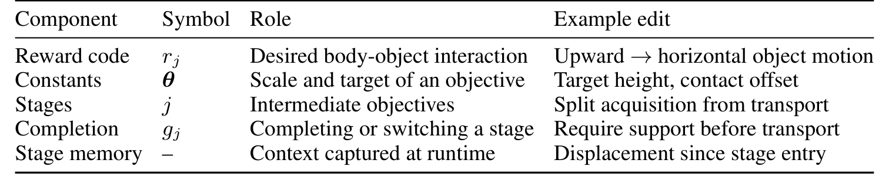
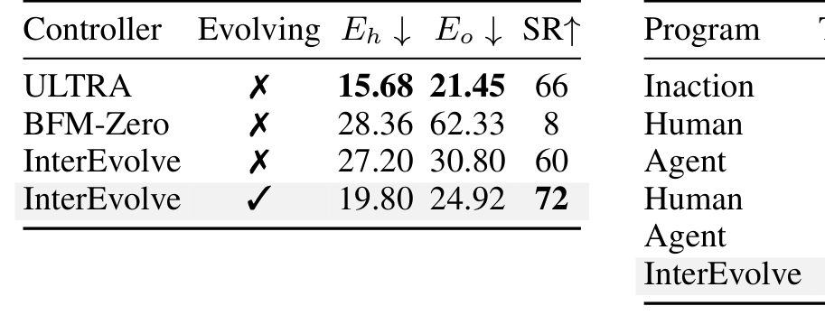
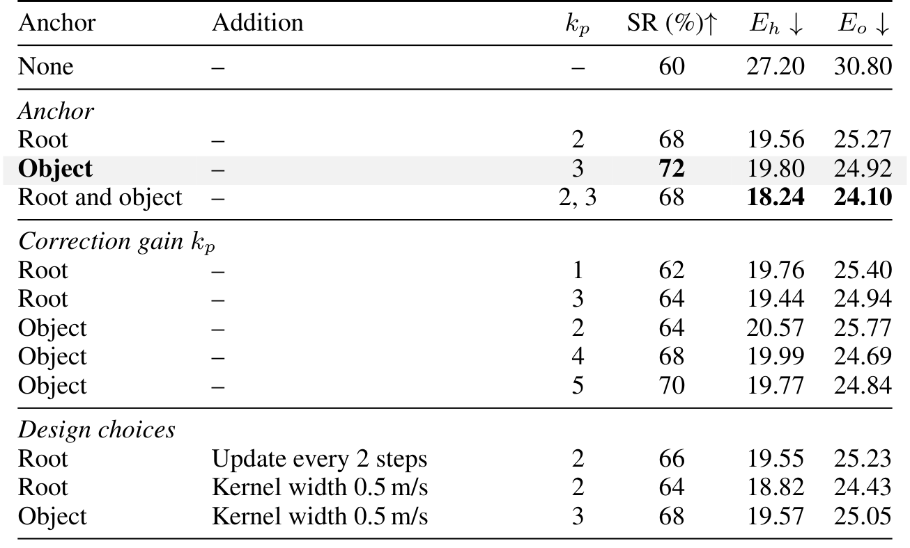
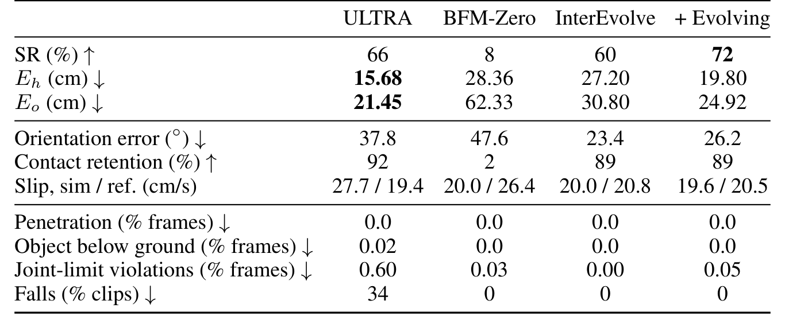
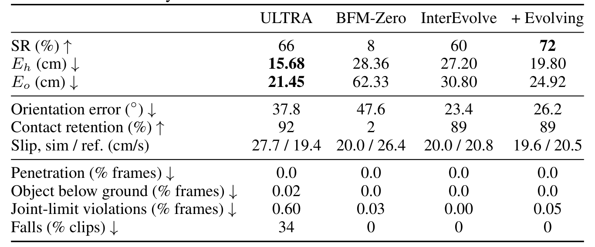
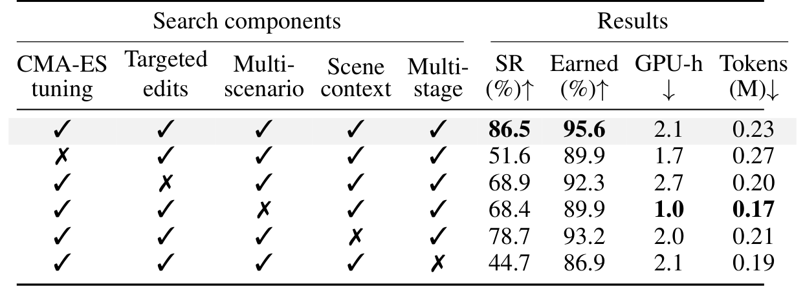
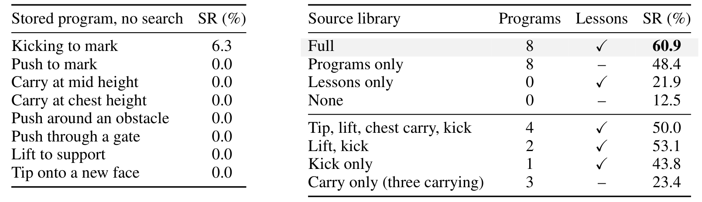
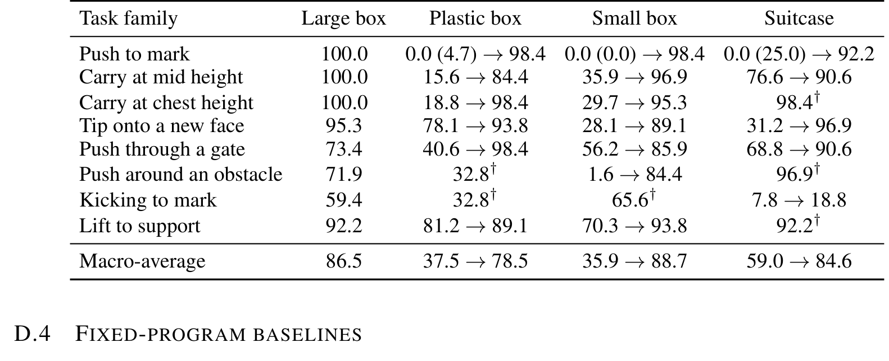

# InterEvolve: Test-Time Evolution of Reward Programs for Humanoid Loco-Manipulation

> arXiv:2610.02196 · 2026-10-01 v1 · UIUC（Zhuo Lin, Sirui Xu, Liuyu Bian, Yu-Xiong Wang, Liang-Yan Gui）· 项目页：https://sirui-xu.github.io/InterEvolve
>
> 这篇笔记回答四个问题：reward program 作为「可编辑任务策略」的表示到底长什么样、FB 模型如何让一个程序不重训就能执行、双循环（LLM 改结构 + CMA-ES 调常数）各贡献多少、以及技能库的复用规律。阅读前提：知道 RL 里 reward 与 policy 的关系即可。

## 问题设定：控制器不动，任务策略外置

任务 = 语言请求 $\ell$ + 场景上下文 $c$（物体位姿、障碍）。有一个**固定的预训练全身控制器** $\pi(a_t \mid o_t, z)$：观测 + 潜提示 → 动作。整个链路是 $(\ell, c) \to P \to z \to \tau \to \mathcal{C}(\tau)$：agent 通过 reward program $P$（分层奖励）把任务接到控制器上，$P$ 的当前阶段奖励变成潜提示 $z$，执行出轨迹 $\tau$，由 verifier $\mathcal{C}$ 打分。两个关键的不变量：

1. **verifier 一次实例化后冻结**——LLM 辅助解析器从 $\ell, c$ 生成 $\mathcal{C}$ 只做一次，之后 agent 不能再碰考官，防止「改评价器来凑任务」。
2. **控制器权重全程不动**——adaptation 被显式定义为「对 $P$ 的演化」：预算 $K$ 轮内，找到轨迹在 $\mathcal{C}$ 上过更多准则的程序。演化保留当前最佳程序，每轮尝试替换它。

这个设定直接对立于「给新任务微调策略」的常规路线：任务知识活在权重外面，在 LLM 能读、能改、能靠执行检验的 reward program 里。控制器和 agent 因此在**不同时间尺度上各自进步**——控制器吃更多交互数据，agent 吃更多测试时搜索和更大的程序库，谁也不用重训谁。

## Reward Program 与零重训执行

### 三要素表示

$P = (\theta, \{(r_j, g_j)\}_{j=1}^J)$：有序的 $J$ 个阶段 + 可调常数向量 $\theta$。每个阶段是一段交互相位（朝向物体、建立接触、搬运、释放）：奖励代码 $r_j$ 通过声明的特征给身体-物体状态打分；完成条件 $g_j$ 读实时 rollout 上下文（物体位姿、接触状态、阶段用时）判断阶段是否结束。执行停在阶段 $j$ 直到 $g_j$ 成立再进入 $j{+}1$，最后阶段跑到 episode 结束。$\theta$ 是 $r_j, g_j$ 读的数字——权重、容差、核宽、阶段阈值。

这个表示的要点是**结构与常数分离**：阶段、奖励项、完成条件是结构（LLM 改），$\theta$ 是常数（数值优化器调）。想从「搬起物体」换成「推着滑动」，agent 改物体运动奖励与阶段条件，而不是指定一条新的关节轨迹。

*论文原图编号：Figure 2。(a) LLM agent 写分层 reward program（从技能库组合，验证后回存）；(b) FB 模型把当前阶段奖励打在固定状态库上、投影成潜提示，冻结身体先验 + 可训练物体残差零重训执行；(c) 192 并行环境的固定 verifier 逐准则打分，反馈驱动外环结构修订，CMA-ES 在内环调常数。放在开头是因为三个面板分别就是下文三节的主题。*

### reward → latent prompt：新奖励 = 新提示

逐个候选程序都训一个策略会让演化慢到不可用。这里用 FB（forward-backward）行为基础模型执行程序：潜码 $z$ 索引一个策略，前向/后向映射分解该策略的折扣未来状态占用，于是任意奖励 $r$ 的 Q 值近似为 $Q_r^{\pi_z}(s,a) \approx F(s,a,z)^\top e_r^z$——**一个新奖励只需要同一策略的一个新提示**。

提示的构造：训练后、演化前从多任务多物体 replay 采样一个固定的 reward-inference bank $\mathcal{B}=\{s_n\}$，缓存每个 bank 状态的 $B(s_n)$ 与奖励代码读的特征。阶段 $j$ 在时刻 $t$ 的提示为：

$$
z_{j,t} = \mathrm{proj}\Big(\sum_n \alpha_{j,n,t}\, B(s_n)\Big), \qquad
\alpha_{j,n,t} \propto \hat{r}_{j,n,t} \exp(\beta\, \hat{r}_{j,n,t})
$$

权重把估计偏向高奖励 bank 状态（比如踢程序阶段 0 里脚击中箱子的状态），其余 bank 保持广覆盖让已学行为仍能支持任务。奖励读活上下文，所以提示**每个控制步重算**，驱动 $\pi(a_t \mid o_t, z_{j,t})$。

**Object-aware residual**：预训练的 BFM-Zero 只看身体——只在「物体该去哪」上不同的奖励会坍缩成同一行为。三个网络（actor、前向、后向）都加物体通路，各自身体分支冻结：actor 保留 BFM-Zero 的局部身体观测并加朝向系的物体特征（位姿/速度 + 身体各链节到最近物体表面的距离衰减向量），均值动作为 $\mu_\pi(o_t, z_{j,t}) = \tanh\big(\mu_{\mathrm{prior}}(o_t^{\mathrm{body}}, z_{j,t}) + \Delta\mu(o_t, z_{j,t})\big)$。残差分支在人-物交互数据（OMOMO 大物体全身操作 + GRAB 小物体全身抓取，retarget 到 Unitree G1 橡胶手与 Inspire 灵巧手）上用 FB 目标 + 演示判别器训练——冻结先验保身体技能，残差学交互。

### 可编辑性落到组件级

*论文原图编号：Table 10。LLM 修订者可编辑的组件清单（奖励项/完成条件/阶段/常数），每次编辑被判定对象。放在双循环小节前是为了说明「结构」这个词具体指哪些可动手的地方。*

## 双循环演化与验证

外环（结构修订）：每轮给 agent 一个 prompt——任务请求、场景、verifier、当前最佳程序及其 rollout 反馈、技能库 $\mathcal{H}$。agent（DeepSeek-V4-Flash，权重固定、只从上下文学习）提出若干新程序；validator 在任何 rollout 之前剔除违规程序（比如读了未声明的特征）。保留当前最佳在上下文里，促使「接近时做定向修复、差远时换新结构」。

内环（数值校准）：同一结构可以在错误的相对权重下失败，所以每个有效提案先冻结阶段与奖励项、只在 agent 声明的界内演化 $\theta$：CMA-ES 采样常数，仿真并行评测每个常数在演化场景上的表现，采样分布移向高分常数。

选择与反馈：调参候选与当前最佳在**同一组演化场景**上比较；最强候选与当前最佳各做三重确认，只有增益超过 run-to-run 评估噪声才替换——被接受的编辑是能迁移到新初始条件的编辑。下一轮 prompt 报告逐准则、逐阶段的结果：比如踢任务 round 1 的反馈会写明「hand 准则在少数环境仍失败而中位环境已通过——这是尾部/方差型失败而非均值低」，以及每个程序如何导向失败。预算：每轮 1 次 agent 调用 + 每个有效提案 192 个调参 rollout + 192 个确认 rollout，成本有界且被仿真主导。

## 关键结果

### 跟踪基准：演化奖励反超专用跟踪器

参考跟踪（held-out 大箱片段）上，专用 RL 跟踪器 ULTRA 误差最低（$E_h$ 15.68 / $E_o$ 21.45 cm）但 SR 66%；body-only 的 BFM-Zero 大多数片段丢物体（SR 8%）。InterEvolve 的 motor model 兼职跟踪，初始 SR 60%；**agent 自己发现的奖励**——对象锚定的漂移校正混合进参考提示——把误差压到 19.80/24.92、SR 提到 **72%，反超专用器**。这个细节值得注意：actor 看的是局部系身体+物体，世界系漂移对它不可见；演化发现的奖励恰好补上了这条缺失的信号——演化不止调权重，还能补感知缺口。

*论文原图编号：Table 1。四个控制器的 $E_h/E_o$/SR 对照：ULTRA 误差最低、InterEvolve 演化后 SR 72% 反超其 66%（灰底行）；右侧为第二张表的局部。放在这里是因为「单一控制器兼任跟踪与任务执行、演化后反超专用器」是能力复用主张的最硬证据。*

*论文原图编号：Table 8。漂移校正消融（协议与首张跟踪表相同）：对象锚定校正对各误差分量与 SR 的贡献。放在跟踪段是为了把「演化发现的奖励补感知缺口」落到可核验的数字上。*

*论文原图编号：Table 11。Table 1 片段上的补充跟踪指标（每片段细节）。放在这里是给上一张表提供更细的出处。*

### 八任务族：结构承载交互，常数只校准

移除参考运动、只给任务结果与约束的基准（推到标记、多高度搬运、翻面/重定向、仅用脚、举上支撑、过门/绕障八族）：

| 程序 | Tune | 演化后 SR | Earned | GPU-h | Tokens |
| --- | --- | --- | --- | --- | --- |
| Inaction | — | 0.0% | 49.1% | n/a | n/a |
| 人类程序 | — | 8.0% | 65.2% | — | — |
| agent 初始程序 | ✗ | 32.2% | 73.3% | — | 0.03M |
| 人类程序 | ✓ | 18.0% | 75.2% | 0.6 | — |
| agent 初始程序 | ✓ | 34.6% | 82.5% | 0.6 | 0.03M |
| **InterEvolve** | ✓ | **86.5%** | **95.6%** | 2.1 | 0.23M |

读法：agent 初始程序已胜人类程序；CMA-ES 校准只带来 32.2→34.6——**更好的权重修不好结构错误的目标**；结构演化再把 34.6 翻到 86.5，增益来自「奖励什么、如何分阶段」。族级规律：校准过的固定程序能解「推到标记」，但在胸前搬运、翻面、过门/绕障上至多 25%，演化把各族都提到 >70%；踢标记最难（训练数据里踢动作罕见，需要强全身协调）——**运动库的上限直接决定演化的上限**。

*论文原图编号：Table 12。八个任务族与各族的关键约束（接触模式/障碍布局/阶段切换时机）。放在这里是为了让「族级规律」有明确的任务定义出处。*

### 消融：多阶段与数值校准最关键

| 去掉的组件 | SR | Earned |
| --- | --- | --- |
| （全保留） | 86.5% | 95.6% |
| CMA-ES 调参 | 51.6% | 89.9% |
| 定向编辑（改为从头重写） | 68.9% | 92.3% |
| 多场景评测 | 68.4% | 89.9% |
| 场景上下文 | 78.7% | 93.2% |
| **多阶段** | **44.7%** | 86.9% |

强制单阶段造成最大跌幅（86.5→44.7）——contact-rich 交互需要按相位分解、各相位有各自目标。去数值调参几乎同样伤（→51.6）——程序只有在校准后才能被公正评判。去定向编辑与去多场景代价相近：修复能工作的程序比再生更可靠；多样起点区分「鲁棒的编辑」与「走运的编辑」。

*论文原图编号：Table 3。五个搜索组件逐一关闭的消融全表（含 GPU-h 与 tokens 成本列）。放在这里是因为它支撑「结构与常数分离」的全部归因。*

轮次动态（Table 4）：round 1 拿走大部分增益（32.2→75.0，清除初始程序的粗失败），后续轮修剩余准则；earned tiers 单调上升（91.7→93.1→95.6），但 SR 从 round 2 到 3 回落（76.8→73.6）——修好一个准则可能暂时弄坏另一个。tokens 随轮线性增长，但成本由仿真主导（每轮分钟级语言模型 vs 数十分钟 rollout）。

### 复用与组合：库的价值取决于接触模式覆盖

三个组合任务（支撑间搬运、叠箱、搬-放-踢）在三个库条件下测试：完整库解 Relocate 8/10、Stack 4/10、Carry-place-kick 5/10；无库 0/0/1；**carry-only 库**恢复 Relocate 的 6/10 但对 Stack（1/10）和踢（1/10）几乎无用——复用取决于库覆盖任务需要的接触模式，而不是「有没有存过经验」。

*论文原图编号：Table 16（正文第五张表的扩展消融，覆盖搬运/放置/踢击三任务）。存库程序不经演化直接执行几乎全部失败——增益来自「演化整合技能库」而非直接检索。放在这里是复用结论的最重要限定：库里存的是起点，不是成品。*

*论文原图编号：Table 14。Table 13 各程序在新箱体上的迁移表现。放在这里是为了展示演化程序的物体泛化程度。*

长时程组合：同一演化 agent 给六个散落箱子排序，每段先走行到箱、再执行演化的推箱程序——**12 个阶段单次 reset 完成**（错误会跨段累积而非被重置洗掉），所示 take 中六箱全部落在距目标 ≤11 cm 内，已放箱子不被后续段扰动。

## 真机与局限

部署：Unitree G1 用 egocentric 相机检测箱子，FoundationPose 估计 6D 位姿供给控制器的物体特征；每个程序在仿真中演化并验证后上真机，两任务（踢/推）自主执行。

作者承认的边界：程序搜索受**运动库**、reward-inference bank 与可用测量限制——不能诱导控制器没学过的行为（踢标记因此最难）；每次搜索花费 GPU-hours 仿真 + LLM 延迟，**排除物理执行中的实时重规划**；让积累经验同时更新控制器是下一步。

我的分析：另两层值得留意。SR 的定义（所有准则同一 rollout 满足）使它对准则间耦合敏感——Table 4 的回落就是这个耦合的表现，报告 earned tiers 缓解了可读性但没消除耦合本身。真机只有两任务且程序先在仿真验证——「仿真演化 → 真机执行」的 gap 依赖 FoundationPose 的位姿质量，论文没有量化位姿误差对程序的敏感度。

## 可以带走的东西

- **结构/常数分离的双循环模板**：LLM 改结构（阶段/奖励项/完成条件）+ CMA-ES 调常数，各用各的长处——任何「策略 = 可读程序」的搜索问题都能套。
- **verifier 逐准则反馈协议**（分位数 + 尾部/均值区分 + 失败原因逐程序）是给 LLM 修订者的有效反馈格式；「尾部失败≠均值失败」的区分直接决定该修结构还是修常数。
- **接受规则**：候选须在三重确认中超过 run-to-run 噪声才替换——防演化过拟合到特定初始条件。
- **技能库按接触模式组织**（不是任务相似度）：复用预测看的是「任务需要哪些接触模式、库里有没有」，这给库的条目设计提供了比「相似任务检索」更可操作的维度。
- 与同日的 RPG（arXiv:2610.02204）对照读：两条 weight-frozen 测试时自改进路线，一个改符号技能与 system prompt（模仿侧），一个改奖励程序（规划/RL 侧）——合并两者（程序改不动时让技能层兜底）是自然的后续。

## 参考与资源

- Paper: [arXiv:2610.02196](https://arxiv.org/abs/2610.02196)（v1，2026-10-01；31 页）
- Project: [sirui-xu.github.io/InterEvolve](https://sirui-xu.github.io/InterEvolve)
- 代码：项目页未提供公开代码仓库链接（截至本笔记写作）
- 基础组件：BFM-Zero（FB 模型）、OMOMO / GRAB（预训练数据）、ULTRA（跟踪基线）、Isaac Lab（仿真）、FoundationPose（真机位姿）
