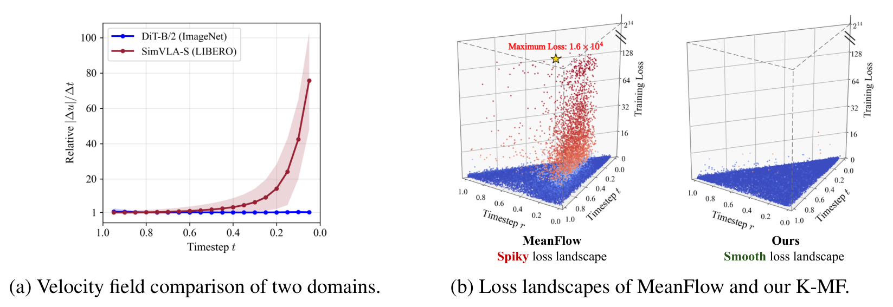
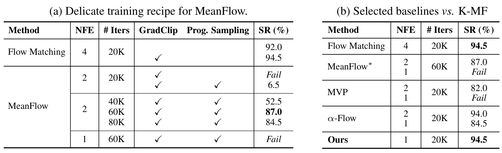
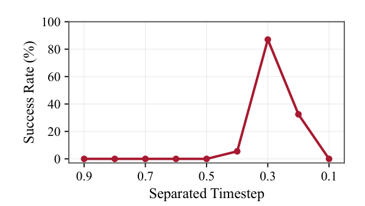
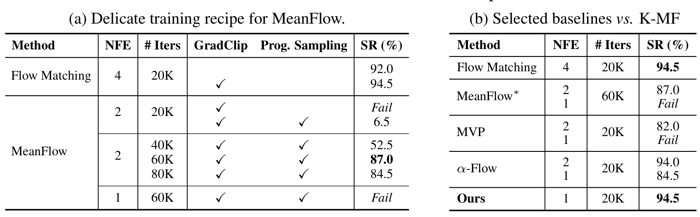
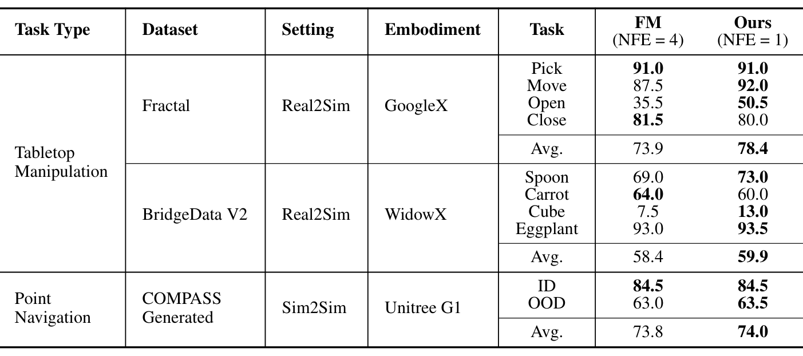
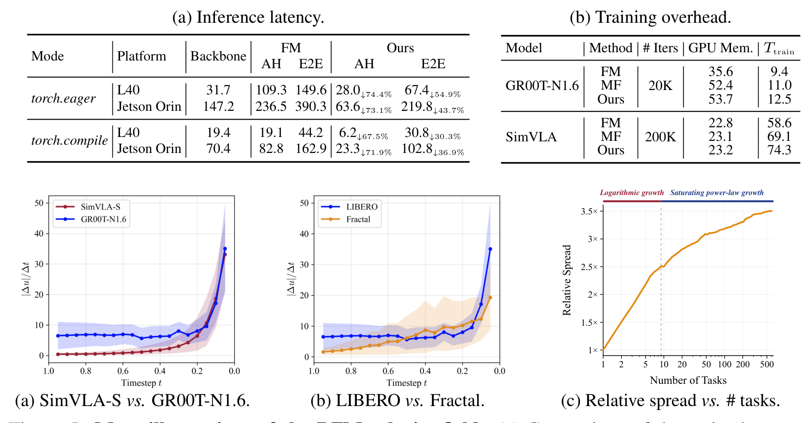
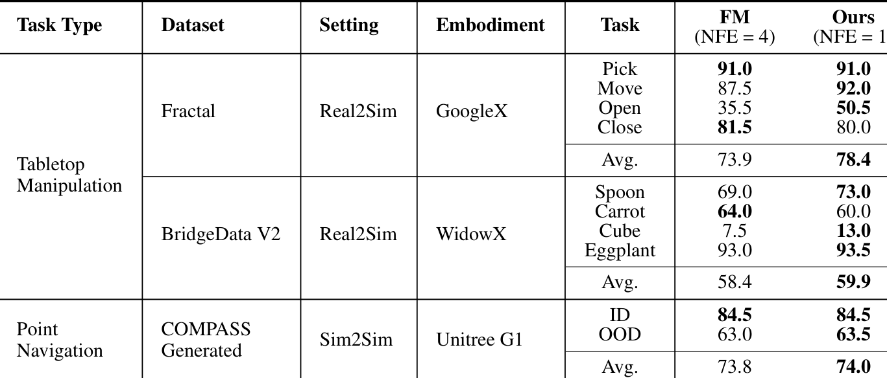
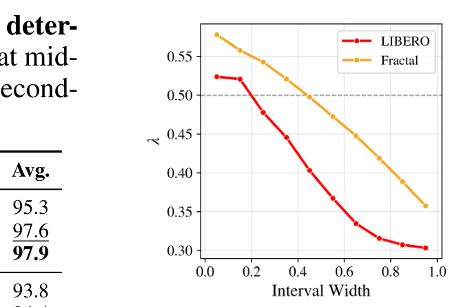
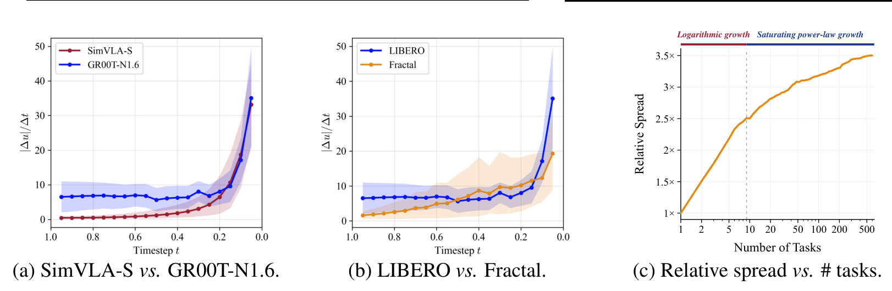

# Kinematic MeanFlow: One-Step Action Generation Policy for Robotic Foundation Models

> arXiv:2610.00864 · 2026-10-01 v1 · Intel 中国 AI 团队（Jiawei Fan, Sifeng Wang, Yuqing Hou, Anbang Yao）· 代码：https://github.com/IntelChina-AI/K-MF
>
> 这篇笔记回答三个问题：MeanFlow 在通用机器人基础模型里为什么会崩溃、运动学恒等式怎么把崩溃的根源（时间导数项）拆安全、以及一步生成在延迟和精度上各换来什么。阅读前提：知道 flow matching 的速度场与去噪流程即可。

## 动机与两个关键观察

flow matching 动作头的迭代去噪是 RFM 实时性的主要拖累：GR00T-N1.6 的动作头占端到端延迟的 **43–73%**（L40 桌面到 Jetson Orin 边缘）。图像生成那边 MeanFlow 给出了一条免蒸馏、免一致性约束的一步生成路线——学「任意两个时间步之间的平均速度」而不是瞬时速度。但把它搬进 RFM，标准配方下直接失败。

作者的切入点是先诊断再开药：测量「局部加速度」$|\Delta u|/\Delta t$（$\Delta t=0.05$）沿去噪进程的动态，对比图像生成（DiT-B，ImageNet）与动作生成（SimVLA-S 配 DiT-B，LIBERO）两个域，得到两条 RFM 特有的现象：

1. **末期激增**：局部加速度在去噪后期（$t < 0.3$，即接近干净数据） sharply 上升，$t=1$ 时达初始值的 **76×**。图像生成全程平稳。→ Issue 1：模型若不能从局部观测推断全局趋势，时间导数项产生大估计误差。
2. **散布展宽**：局部加速度幅值的跨样本散布（1.5-IQR 带）随去噪进行不断扩大。→ Issue 2：早期的小估计误差会被放大。

*论文原图编号：Figure 1。(a) 图像生成与动作生成的局部加速度动态对比（RFM 末期激增至 76×、散布展宽，IQR 带为界）；(b) 标准 MeanFlow 的尖锐损失面与 K-MF 的平滑损失面对比。放在开头是因为全文的方法设计完全由这两个观察驱动。*

## MeanFlow 在 RFM 里为何崩溃

MeanFlow 的恒等式（Eq. 3）：平均速度 $u(z_t, r, t) = v(z_t, t) - (t-r)\frac{d}{dt}u(z_t, r, t)$。训练时（Eq. 4）$v_t$ 对给定样本是常数，优化主要由**时间导数项**驱动——而这项是自举的：当前模型估计的导数被做成 stop-gradient 回归目标，更新的模型再提供更准的导数。图像生成里这个回路经验上有效；RFM 里，上面的两个动态特性（末期激增 → 大误差；散布展宽 → 误差放大）**污染了自举反馈环**，训练失稳——这就是崩溃的机制，损失面对比（Fig 1b 尖锐 vs 平滑）是它的宏观表现。

## K-MF：运动学恒等式解耦

药方不是加约束，而是把导数项拆开。对任意中间点 $c \in (r, t)$，运动学恒等式给出凸组合分解：

$$
u(z_t, r, t) = (1-\lambda)\,u(z_t, c, t) + \lambda\,u(z_c, r, c),
\qquad \lambda = \frac{c - r}{t - r}
$$

对两个子区间分别套 MeanFlow 恒等式（Eq. 6），得到解耦的回归目标（Eq. 7）：

$$
u_{\text{K-MF}} = v_t - (t-r)\left[(1-\lambda)^2\, \mathrm{sg}\Big(\tfrac{d}{dt}u(z_t, c, t)\Big) + \lambda^2\, \mathrm{sg}\Big(\tfrac{d}{dc}u(z_c, r, c)\Big)\right]
$$

工程含义：每个子区间内局部加速度平缓得多，导数估计误差受控，自举回路从坍缩变成功。权重的 $(1-\lambda)^2$ 与 $\lambda^2$ 结构意味着划分点直接控制两段误差的贡献比例。

*论文原图编号：Figure 2。(a) RFM 局部加速度的两段动态（早期稳定 / 末期激增）；(b) MeanFlow 整体导数估计——误差放大、自举坍缩（红叉）；(c) K-MF 在中间点 c 解耦为两个子区间导数——受控误差、自举成功（绿勾）。放在这里是因为它是全文唯一的机制总览图。*

**三种确定 $c$ 的策略**：随机采样（$\lambda \sim U(0,1)$，作为「划分多样性是否有用」的对照）；固定中点（$\lambda = 0.5$，零方差、两段平衡，适合微调快速适配）；可学习策略（3 层 MLP $G_\phi(t, r)$ 生成 $\lambda$，目标是不放大训练损失、平衡两子区间的在线自举误差）。

## 关键结果

### 先导实验：MeanFlow 需要精调配方，变体一步全败

GR00T-N1.6 on LIBERO-10：标准 flow matching（20K iters）94.5%。MeanFlow 20K 直接 **Fail**；即便上精调配方（梯度裁剪 + 渐进时间步采样 + 60K iters）也只有 **87.0%，且要两步生成**，60K 后过拟合回落到 84.5；对两步生成的分离时间步高度敏感（Fig 3）。现有变体一步生成：MVP **Fail**、α-Flow 82.0；**K-MF 一步 94.5，与四步 flow matching 持平**。

*论文原图编号：Table 1。(a) MeanFlow 的精调配方消融（梯度裁剪/渐进采样/迭代数；Fail、6.5、52.5、87.0、84.5）；(b) 精调 MeanFlow、α-Flow、MVP 与 K-MF 的对比（一步生成 94.5）。放在这里是因为「MeanFlow 在 RFM 需要娇贵配方且两步才可用」是本文立论的第一块证据。*

*论文原图编号：Figure 3。两步 MeanFlow 成功率对分离时间步的敏感性曲线。放在这里是为了说明 MeanFlow 即使两步可用也对超参脆弱。*

### 主结果：两种范式 × 四基准 × 三本体

| 设置 | FM（NFE=4） | MeanFlow*（NFE=2） | **K-MF（NFE=1）** |
| --- | --- | --- | --- |
| GR00T-N1.6 微调 · LIBERO Avg | 97.3 | 94.5 | **97.9** |
| SimVLA-S 从零 · LIBERO Avg | 94.2 | 93.7 | **95.1** |
| Fractal（Real2Sim, GoogleX） | 73.9 | — | **78.4** |
| BridgeData V2（Real2Sim, WidowX） | 58.4 | — | **59.9** |
| PointNav（Sim2Sim, Unitree G1） | 73.8 | — | **74.0** |

一步生成在**多数设置持平或超过**四步 FM——覆盖微调与从零两种范式、2K–658K 轨迹的数据尺度、桌面操作到人形导航的任务面。个别回退存在（Bridge 的 Carrot 64.0→60.0）。

*论文原图编号：Table 2。GR00T-N1.6 微调与 SimVLA-S 从零训练下三方法在四个 LIBERO 套件的完整对照。放在这里是为了证明结论不绑定训练范式。*

*论文原图编号：Table 3。Fractal / BridgeData V2 / PointNav 三段 × FM（NFE=4）与 K-MF（NFE=1）的逐任务与均值。放在这里是跨本体泛化的出处。*

### 效率：动作头延迟 -67.5%~-74.4%

| 平台 / 模式 | FM AH (ms) | K-MF AH (ms) | AH 降幅 | E2E 降幅 |
| --- | --- | --- | --- | --- |
| L40 · eager | 109.3 | 28.0 | -74.4% | -54.9% |
| Jetson Orin · eager | 147.2 | 63.6 | -73.1% | -43.7% |
| L40 · compile | 19.1 | 6.2 | -67.5% | -30.3% |
| Jetson Orin · compile | 70.4 | 23.3 | -71.9% | -36.9% |

边缘平台（Jetson）上的绝对收益最大——这正是 RFM 部署最疼的地方。训练开销：相对 MeanFlow 时间 +7.5–13.6%、显存至多 +2.5%；相对 flow matching 时间 +33%（GR00T）/ +27%（SimVLA）。

*论文原图编号：Table 5。(a) 四硬件-模式组合的推理延迟（AH/E2E）；(b) 训练开销（显存与时间）。放在这里是因为部署收益是本文的另一半卖点。*

### 消融：增益来自导数估计，不是划分增广

确定 $c$ 三策略：GR00T 上 **LS 97.9 > Mid 97.6 > RS 95.3**；从零训练 LS 95.1 > Mid 94.4 > RS 93.8。随机划分明显最差——**解耦的价值在改善导数估计，不在数据增广式的划分多样性**。可学习 $\lambda$ 与区间宽度 $t - r$ 强相关（Fig 4）：划分点自适应地移向误差贡献大的区域。

*论文原图编号：Table 4。RS / Mid / LS 三策略在两 RFM 上的四套件消融。放在这里是为了支撑「位置有用、多样性无用」的归因。*

*论文原图编号：Figure 4。LS 策略下 λ 的分布随训练数据集变化（GR00T-N1.6），与区间宽度强相关。放在这里是为了展示划分点的自适应行为。*

### 速度场动态的三条补充观察

同一数据集上不同 RFM 共享相似模式；动态取决于训练数据集（Fractal 这种大而杂的数据散布更宽）；**相对散布随任务数呈对数转幂律的增长**——任务混合越杂，MeanFlow 越难，K-MF 的解耦收益越大。这条规律对「什么时候该用 K-MF」有直接预测力。

*论文原图编号：Figure 5。(a) 两 RFM 同数据集的相似模式；(b) LIBERO 与 Fractal 的数据集效应；(c) 相对散布随任务数的对数→幂律增长。放在结尾段是因为它把「RFM 速度场动态」从个案观察提升为规律。*

## 证据边界与局限

**我的分析**：动态诊断（激增 76×、散布展宽）基于具体模型（DiT-B 骨干 + SimVLA-S）的经验测量，图像生成域为何平稳只有对比没有解释；评测 200/500 rollouts 的规模下 1–2 分差异需谨慎解读；Real2Sim 走 SimplerEnv，与真机的剩余 gap 未讨论；训练开销相对 flow matching +27–33% 时间，对预算敏感的复现者是需要权衡的成本。

**尚不能确定**：三段以上进一步划分是否还有收益（论文只测了单点 $c$）；可学习 MLP 的深度/宽度选择（附录有部分消融）；K-MF 与 RL 场景（MeanflowQL/DMPO 一系）组合的效果。

## 可以带走的东西

- **先诊断速度场动态、再设计目标**：把图像生成技术移植到机器人域之前，先做 Fig 1 式的动态对比——76× 激增这种域特性决定了哪些迁移会失败。
- **运动学恒等式的区间解耦**是通用 trick：任何含时间导数自举项的训练目标（不仅是 MeanFlow）都可以这样拆。
- **「位置有用、多样性无用」**：解耦设计的价值在划分点放在误差大的区域，RS 消融直接否定了把它当数据增广用的直觉。
- **Jetson AH -73.1%**：端侧 VLA 部署可以直接拿 K-MF 动作头替换多步 flow matching，一次前向出动作 chunk。
- 与同日 SplineWAM（B 样条自适应动作视界，砍**调用次数**）正交：K-MF 砍**每次调用的去噪步数**，两者可叠加。

## 参考与资源

- Paper: [arXiv:2610.00864](https://arxiv.org/abs/2610.00864)（v1，2026-10-01；18 页含附录）
- Code: [GitHub IntelChina-AI/K-MF](https://github.com/IntelChina-AI/K-MF)
- 评测：LIBERO / BridgeData V2 / Fractal（SimplerEnv Real2Sim）/ COMPASS PointNav（Unitree G1）；基线 flow matching、MeanFlow、α-Flow、MVP
