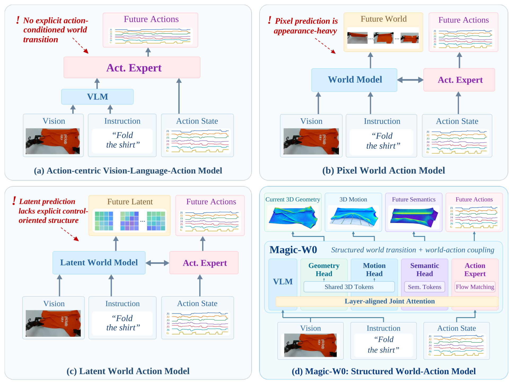
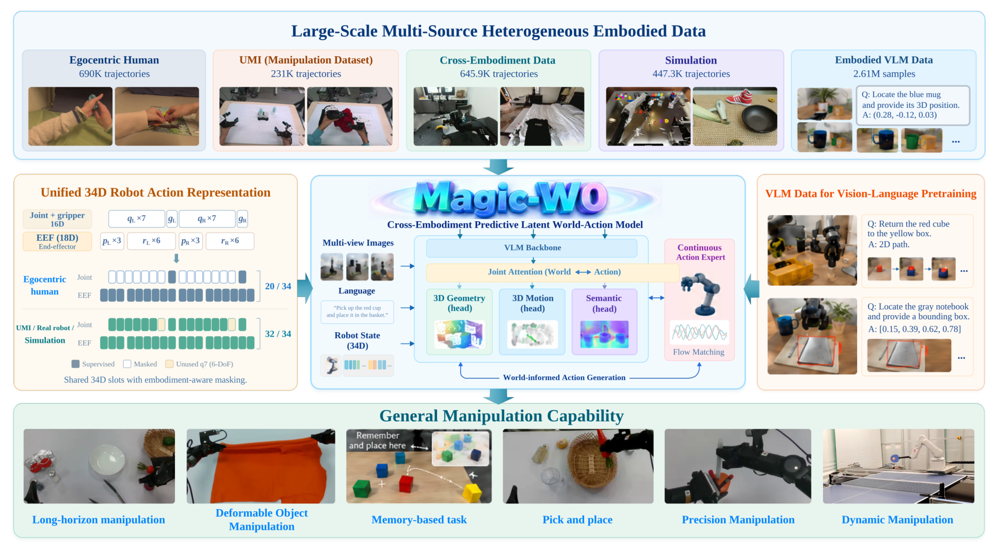
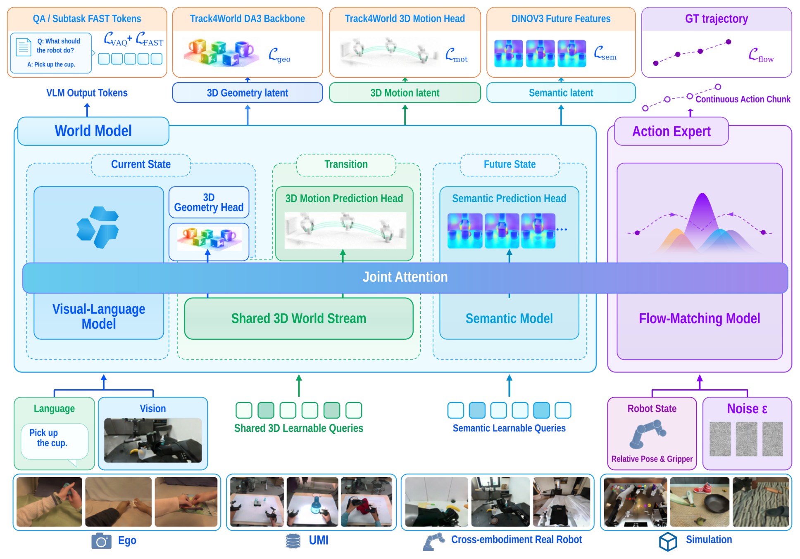
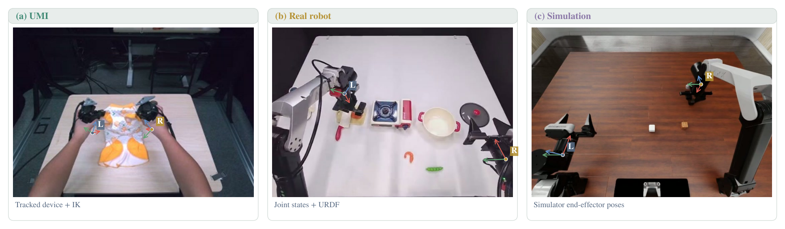
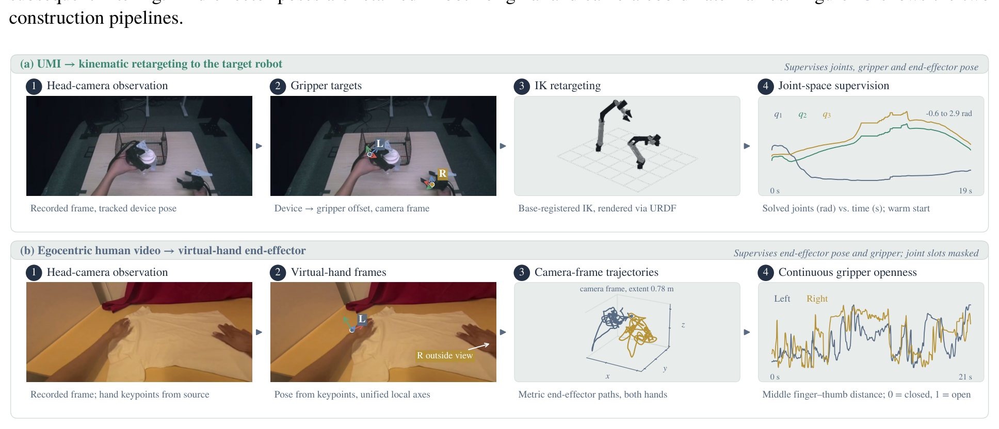
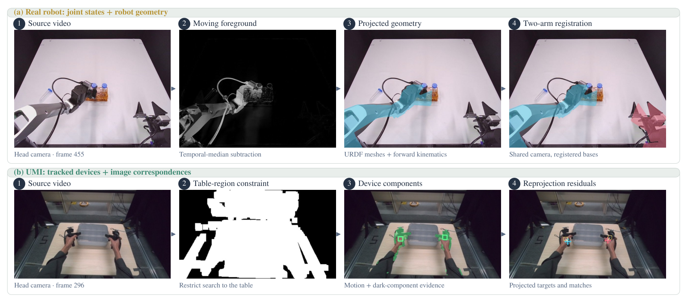
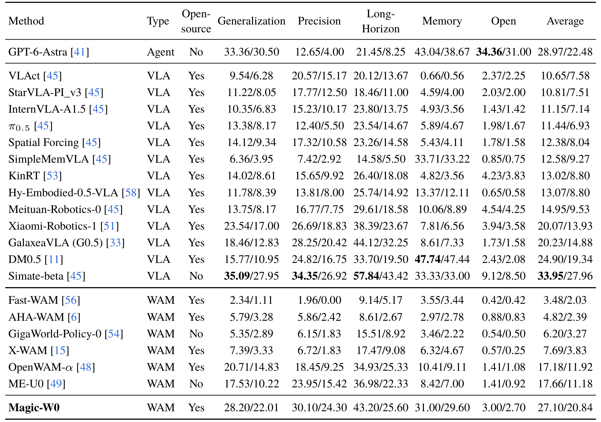
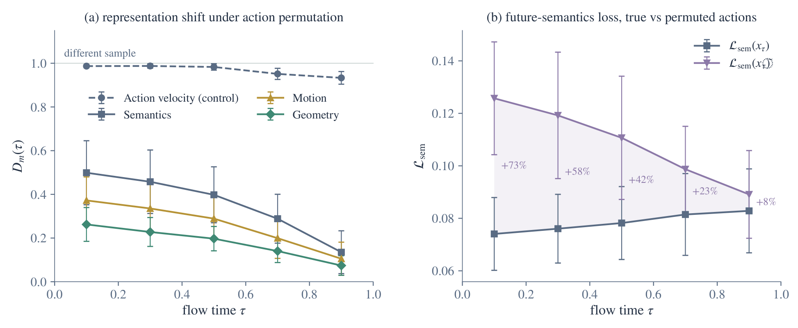
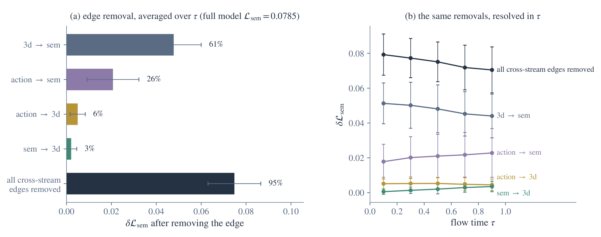

# Magic-W0: A Structured World-Action Foundation Model for Physical Intelligence

> arXiv:2609.39870 · 2026-09-30 v1（北京时间 09-30 22:49，补充窗口）· Magiclab Robotics（Xuhua Chen 等 18 人，Tao Zhang 项目负责）· 代码：https://github.com/MagiclabRobotics/Magic-W0 · 项目页：https://embodied.magiclab.top/works/wam/magic-w0/index.html
>
> 这篇笔记回答四个问题：结构化世界转移的三段（几何/运动/语义）各自承担什么、201 万 episode 的跨本体预训练怎么统一接口、两组机制干预实验怎么证明「世界头真的在用动作」、以及与同日其他 WAM 的定位差在哪。阅读前提：知道 VLA 与 WAM 的基本区别即可。

## 动机与架构定位

VLA 的监督是不对称的：视觉-语言预训练给了丰富的场景/任务语义先验，机器人演示直接约束「该执行什么动作」——但**候选动作会诱导环境发生什么状态变化**，几乎没有独立的预测目标来约束。现有 WAM 用两种方式补这块：像素空间预测未来观测（外观冗余、纹理光照视角变化与控制无关）、latent 空间预测通用未来表征（避免重建、但无结构）。

Magic-W0 走第三条：**结构化世界转移**，把动作条件的环境演化拆成三段——

当前状态（VLM 上下文 + 三维几何）→ 转移（三维运动）→ 未来状态（未来语义），三段各自显式表征，通过**层对齐的世界-动作交互**与连续动作专家双向耦合：当前物理结构、动作诱导的转移、未来任务状态分别有独立预测目标。

*论文原图编号：Figure 2。(a) 动作中心 VLA（隐式世界理解）；(b) 像素 WAM（预测未来观测）；(c) latent WAM（预测通用未来表征）；(d) Magic-W0 的结构化世界转移与层对齐双向交互。放在这里是为了在进入细节前把四条路线的位置摆清楚。*

## 数据与统一接口：201.4 万 episode 怎么混

预训练语料：**201.4 万有效操作 episode**，四域分布 ego 人类 34.3%（690K 轨迹）/ UMI 11.5%（231K）/ 跨本体真机 32.1%（645.9K）/ 仿真 22.2%（447.3K）；另加 **261 万 VL 监督样本按 9:1 混入**操作批次。动作 chunk $H = 50$，**34 维统一状态-动作接口**：左/右臂各 7 关节 + 1 夹爪（16 维）+ 各 3 位置 + 6 旋转（18 维），零填充 + 有效性掩码——ego 人类数据用 20/34 槽（关节 10 + EEF 10），UMI/真机/仿真用 32/34 槽。**本体感知掩码**让四域共享一个接口。

数据工程占了论文相当篇幅：无相机参数源的标定流程（Figure 14）、质量检查与修复、有效性掩码；末端执行器位姿的跨源投影对齐（Figure 12——ego/UMI/真机/仿真四类来源在统一坐标系下的对齐证据）。原始 UMI 与 ego 记录的质量问题示例见 Figure 13。

*论文原图编号：Figure 1。上：五类数据源带示例与规模（ego 690K / UMI 231K / 跨本体 645.9K / 仿真 447.3K / VL 2.61M）；中：模型核心（34 维动作槽位掩码 + 联合注意力 + 三头 + 动作专家）；下：六类真机能力示例。放在开头是为了让数据-模型-能力三段一次建立。*

## 模型与训练：三流、层对齐、教师监督

三流结构：Current State（VLM + 3D 几何头）、Transition（3D 运动预测头）、Future State（语义预测头），由**共享 3D 可学习查询**与**语义可学习查询**驱动，经 Joint Attention 与动作专家在**第 4/8/12/16/20/24 层逐层对齐交互**——动作假设条件化世界转移预测，预测的世界表征再反馈进动作速度场。双向性是设计核心：不是世界头挂在动作专家旁边，而是每个流积分步都有信息交换。

监督来源：Track4World DA3 骨干提供几何与运动两个方向的教师（$\mathcal{L}_{geo}, \mathcal{L}_{mot}$），DINOv3 提供未来语义教师（$\mathcal{L}_{sem}$），另有 VAQ 与 FAST 离散动作监督，以及动作专家的流匹配损失——**教师只在训练期供潜空间监督，推理不需要**。主配置见下方配置表。

*论文原图编号：Figure 3。三流（Current State / Transition / Future State）+ Joint Attention + 四个损失头（VAQ+FAST / geo / mot / sem）+ 动作专家流匹配；底部为四类数据源与输入（语言/视觉/机器人状态/噪声）。放在这里是机制流程的正式出处。*

*论文原图编号：Table 6。Magic-W0 的主配置（骨干/头/专家/维度/层对齐设置）。放在这里是为了给复现者一个配置总表。*

*论文原图编号：Figure 12。三源类别（ego/UMI/真机/仿真）的末端执行器位姿投影——跨本体统一的数据侧证据。放在数据段是为了支撑「四域共享接口」的可信度。*

*论文原图编号：Figure 13。原始 UMI 与 ego 人类操作记录中含质量问题的示例。放在这里是数据清洗必要性的直观证据。*

*论文原图编号：Figure 14。相机参数不可用时的标定流程与重建对比。放在这里说明跨源统一的工程成本。*

## 关键结果

### RoboDojo-Sim 与 LIBERO

RoboDojo-Sim（42 任务、五维：泛化 / 精度 / 长时程 / 记忆 / 开放，报过程分+成功率）：Magic-W0 平均 **Score 27.10 / SR 20.84%，WAM 组第一**，超此前榜首 OpenWAM-α 9.92 分；Generalization 28.20/22.01 为全部 WAM 最高，且超最强开源 VLA Xiaomi-Robotics-1 达 4.66 分——作者把这归因于显式结构表征「超越当前观测的局部视觉模式」。弱项同样显眼：**开放维 3.00** 远低于闭源 Simate-beta 的 33.95；记忆维 31.00 低于 SimpleMemVLA 33.71 与 DM0.5 的 47.74。

LIBERO 微调：平均 **99.1%**，Spatial 99.4 / Goal 99.6 为全表最高——作者把 Spatial 归因于三维几何与 VL 上下文的联合建模、Goal 归因于 3D Motion + Future Semantics 与动作生成的耦合。

*论文原图编号：Table 1。Agent（GPT-6-Astra）+ 13 开源 VLA + 6 WAM 三组 × 五维 Score/SR 全表，Magic-W0 末行加粗。放在这里是全文主基准的出处。*

*论文原图编号：Table 2。14 个已发表方法的四套件 + 平均（Octo 75.1 → Magic-W0 99.1）。放在这里是下游迁移的出处。*

### 真机：严格配对下 94.6% vs 91.8%

五个新任务（叠衣 / 瓶身立置 / 笔收纳 / 物体收纳 / 厨房收纳），与 π0.5 **同演示、同训练预算、同观测、同动作空间、同初始评测状态**，每任务 100 次独立试验：平均 **94.6% vs 91.8%**（+2.8pp），四升一平（瓶身立置双方 100% 饱和），无任务级下降。最大增益在物体收纳（90→95）与厨房收纳（91→95）——都是多物体、需要**根据先前操作造成的场景变化调整后续动作**的任务；叠衣另涉及可变形形状的连续变化。这条模式与「持续跟踪环境变化」的设计叙事一致。

### 两组机制干预：世界头真的在用动作

**动作替换**（固定观测/指令/本体/流时间 τ，只换配对的噪声动作 chunk）：三个世界头的输出都系统性改变，且响应随 τ 增大而衰减——τ∈[0, 0.2) 时 $D_{sem}=0.50$、$D_{mot}=0.37$、$D_{geo}=0.26$；τ∈[0.8, 1) 降至 0.14/0.11/0.07。对照：动作专家自己的速度场输出归一化变化恒在 0.93–0.99。**Future Semantics 的损失**：替换动作后最低噪声段 $\mathcal{L}_{sem}$ +73.5%，最高噪声段 +8.0%（均值±一个标准差已含零）。趋势与「$x_\tau$ 中地面真值动作信息随 τ 减少」精确同步——**世界头不是从 VLM 上下文旁路出来的，是真在消费动作条件**。

*论文原图编号：Figure 10。(a) 三头的归一化输出变化随流时间 τ 衰减（虚线为动作专家速度场对照）；(b) 真假动作下未来语义损失对比（+73%→+8%）。放在这里是因为它回答「结构化世界转移是否真的动作条件化」。*

**跨流连接遮蔽**（固定输入、只关指定方向的流间注意力）：遮 `3d→sem` 使语义损失 **+60.8%**（最大单边效应）；遮反向 `sem→3d` 仅 **+2.6%**——约 23 倍的不对称。遮 `action→sem` 与 `action→3d` 都单独提升损失（动作信息走直接通路，也先入 3D 流再经 3d→sem 间接到达语义）。**全部流间连接移除 +95.3%**；四条边单独增量之和 0.0755 vs 全移除 0.0748，仅差 1.0%——全模型相对并行配置的优势主要由这四条通路承担。作者明示：不同连接可能影响共享中间表征，这个数值关系**不应读成严格可加性**。

*论文原图编号：Figure 11。(a) 各方向连接移除后的语义损失增量（3d→sem 61%、全部移除 95%）；(b) 同样干预按流时间 τ 分辨。放在这里是因为它定位了「哪条通路在搬运动作信息」。*

## 证据边界与局限

**我的分析**：RoboDojo 基线数字来自官方榜单聚合（含闭源 Agent 与 Simate-beta），跨闭源比较只能读量级；LIBERO 基线沿用各自发表值，训练配方不统一；真机只与 π0.5 严格配对，其他 WAM 没有同条件真机数字；机制实验是 6 批 × 4 观测时刻的受控干预，证明「通路存在且被使用」，不构成端到端性能的逐组件归因——论文没有「去掉 3D Motion 头」这类结构消融，三段结构各司其职的叙事部分依赖设计对应而非拆解证据。

**尚不能确定**：四域配比（34.3/11.5/32.1/22.2）的消融——去掉 UMI 或 ego 会怎样未报告；层对齐选择（4–24 每层）有没有更稀疏的等价配置；开放性与记忆两个维度上与闭源模型的差距（3.00 对 33.95）能否靠数据域扩展弥补。

**开源**：代码 + 权重（GitHub MagiclabRobotics/Magic-W0，9-30 建）+ 项目页披露配比细节——按 9-30 创建、10-01 有推送计，社区关注尚在早期（1 star）。

## 可以带走的东西

- **34 维槽位 + 本体感知掩码**：ego 用 20/34 槽、机器人用 32/34 槽——跨本体统一动作接口的最小实现，可直接搬到任何多域混合预训练。
- **结构化教师只在训练期**（Track4World DA3 管几何/运动、DINOv3 管语义）：与同日 SkeleWAM 的骨架监督同一模式——latent 教师供监督、推理不付成本。
- **两级干预协议**：先动作替换（改输入、保通路）验证「用了动作」，再跨流遮蔽（保输入、改通路）定位「哪条通路」——可移植到任何多流交互架构的可解释性分析。
- **9:1 操作/VL 混合比与四域配比**是目前公开披露最细的大体量 WAM 预训练参照点，与 UniWAM 的三源分配矩阵（VQA/人/机器人各监督不同专家）互为镜像：一个按模态分、一个按来源分。

## 参考与资源

- Paper: [arXiv:2609.39870](https://arxiv.org/abs/2609.39870)（v1，2026-09-30；29 页含附录）
- Code: [GitHub MagiclabRobotics/Magic-W0](https://github.com/MagiclabRobotics/Magic-W0)
- Project: [embodied.magiclab.top/works/wam/magic-w0](https://embodied.magiclab.top/works/wam/magic-w0/index.html)
- 评测：RoboDojo-Sim 42 任务（官方协议）/ LIBERO / 真机五任务 ×100 trials（与 π0.5 严格配对）
