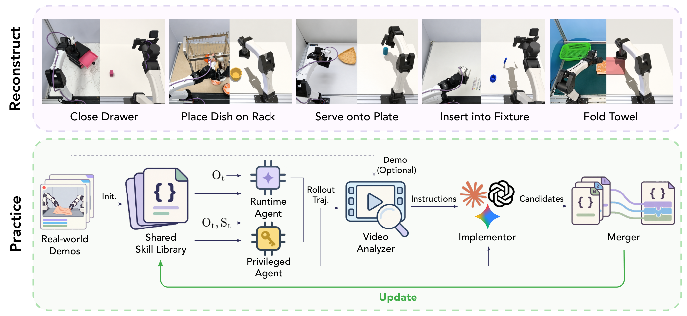
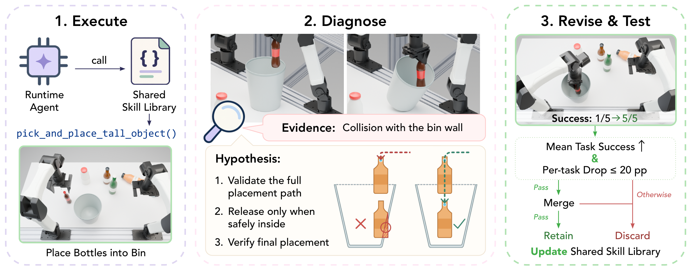
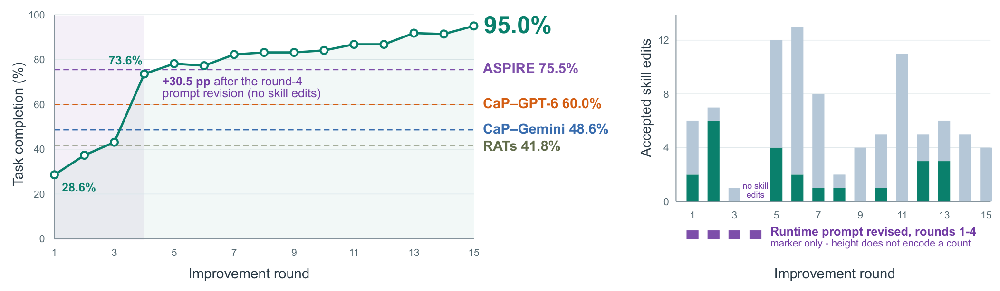
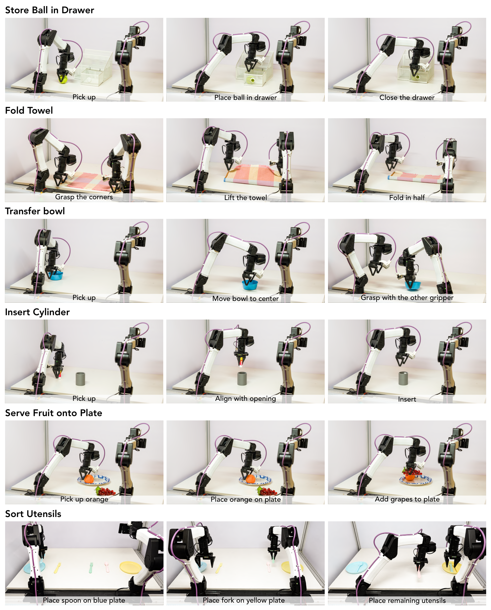
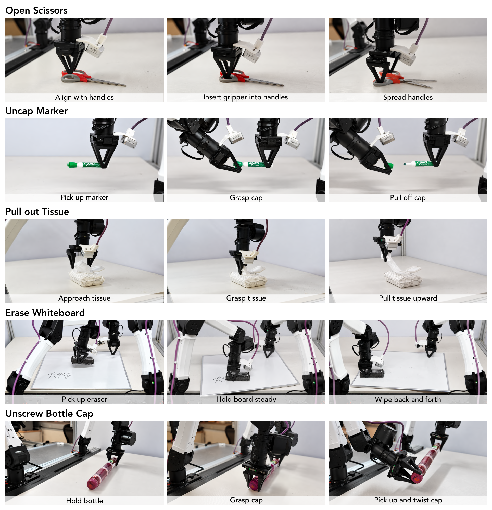

# Reconstruct, Practice, Go Real: Guided Self-Improvement for Embodied Agents

> arXiv:2610.02204 · 2026-10-01 v1 · UC Berkeley / Amazon FAR / MIT / U Chicago（Yen-Jen Wang, Haozhe Jiang, Shuying Deng 等，Haozhi Qi、Pieter Abbeel 通讯）· 项目页：https://rpg-robot.github.io/
>
> 这篇笔记回答三个问题：RPG 的「不更新权重」自改进闭环到底由哪些部件组成、门控公式如何防止共享技能修订互相踩踏、以及 28.6%→95.0% 这条曲线里哪些增益该归因给哪个部件。阅读前提：知道 VLA / code-as-policy 的基本形态即可，不需要 RL 背景。

## 研究问题与核心想法

让机器人执行系统变可靠，主流路线是更新模型权重：微调 VLA、蒸馏、RL。RPG 的出发点是另一条：**执行系统里真正被反复修补的部分——技能库代码和 system prompt——本身就是可持久改进的对象**，而且改它们不需要碰权重、可审计、可回滚。作者把这套系统叫 Agent-as-Policy：一个多模态 Runtime Agent 按 system prompt 从共享技能库里选技能、组参数、执行任务；改进发生在轮次之间，而不是梯度里。

这个立场直接决定了三个设计约束，后文会反复回来：

1. 改进对象只能是可执行代码与 prompt——所以失败必须先被**归因**成具体的代码缺陷（如「释放前没有验证瓶身越过桶沿」），而不是变成一组梯度。
2. 技能库是**共享**的——修一个任务用的技能可能弄坏另一个任务，所以每次修订必须过跨任务门控。
3. 模型权重、任务定义、评价器全程冻结——练习只有「系统在轮与轮之间变化」这一种自由度。

与同属自改进路线的 ASPIRE（同样 weight-frozen）和 RATs（play-based 探索）相比，RPG 的差异点是把「诊断-修订-验证-合并-回滚」做成了显式协议，并严格分离决策用种子和复盘用种子。这一点在评测协议小节会看到它为什么关键。

*论文原图编号：Fig. 1。三面板给出 Reconstruct（离线数据→仿真练习任务）、Practice（执行反馈→修订共享技能与 system prompt→跨任务验证保留）、Go Real（标定后冻结部署）的全链路；底部为真机部署任务画廊。放在这里是为了在进入机制细节前先建立三阶段的整体心智模型。*

## 方法主线：六个 agent 与三个阶段

### 机制流程

RPG 协调六个专职 agent，跨三个阶段。按一个练习轮的执行顺序：

1. **输入**：当前系统 $S_r = (L_r, \rho_r)$（技能库 $L_r$ + system prompt $\rho_r$）与 22 个练习任务各 5 个固定开发种子。**操作**：Runtime Agent 只用部署时可得的观测执行全部任务；同时 Privileged Agent 从相同初始状态出发、用同一模型同一技能库，但额外拿到仿真器特权状态（物体名称/位姿/尺寸/速度/布料角点）。**输出**：两套执行轨迹进入诊断。特权执行不是训练信号，而是失败分析的参照系——如果 Privileged 能成而 Runtime 败，缺陷大概率在共享技能或 prompt；两者都败，则暴露技能本身的缺陷。
2. **输入**：失败轨迹 + 特权参考执行 + 离线数据集 D（ABC）里的源视频。**操作**：Video Analyzer 用技能调用、夹爪事件、运动与 D 的标注识别操作相位，在相同物体角色/臂/操作下做相位对比，定位**首个可观察失败**并给出具体修改建议。**输出**：诊断 + 建议（它自己不改系统）。
3. **输入**：诊断与 $S_r$。**操作**：Implementor 产出候选修订——新技能、改现有技能、或改 system prompt；每个开发任务每轮至多一个候选，5/5 全成的任务不再产候选但仍充当回归检查。候选先过机械检查：能加载、语法与接口有效、只用部署可得观测。**输出**：合格候选进入门控评测。
4. **门控**（下节公式）：候选在全部 22 任务 × 5 配对开发种子上跑完整 episode，与 $S_r$ 比较。通过者由 Merger 贪心集成（每轮至多 8 次集成尝试），合并后再整体验证；通过则 $S_{r+1} = S^+$，否则回滚 $S_{r+1} = S_r$。

### Reconstruct：从离线数据构建并冻结练习任务

练习开始前，Constructor 从 D 里选源任务（每任务审 3–8 条轨迹，7.5 分钟预算/任务），在 MuJoCo 里搭 YAM 机器人仿真环境，并写 `check_success` 实现 $e_i(\tau)$，由人工核验后**冻结**任务集 $\mathcal{W}$。关键设计：练习任务可以只覆盖源任务的一部分或做类比迁移——「整理墨镜」变成「关闭已打开装好的镜盒」（初始状态编码了前置操作），「卷毛巾」变成「对折一次」（布操作的最终形状不同）。任务没有对应源任务的，直接用任务规约。这一步把「离线数据里有什么能力」翻译成「练习什么」，并保证自改进期间任务定义和评价器不变——否则曲线无法归因。

*论文原图编号：Fig. 2。上半部分展示五个源任务到仿真练习任务的配对（真实→仿真），下半部分是 Practice 的组件流：Real-world Demos 初始化共享技能库，Runtime 与 Privileged 两个 Agent 分别接收 $O_t$ 与 $(O_t, S_t)$，回放轨迹交给 Video Analyzer（可选用 Demo 输入），其诊断传给 Implementor 产出候选，再由 Merger 合并并回写技能库。放在这里是为了给出六 agent 的数据流向全景。*

### 门控公式与贪心集成

设候选系统 $\tilde{S}$ 与轮起始系统 $S_r$ 在任务 $i$ 上的经验成功率为 $\hat{q}_i$，任务均值为 $\hat{J}$。候选可集成的条件是：

$$
\mathrm{Gate}(\tilde{S}; S_r) = \mathbf{1}\left[\Delta\hat{J} > 0 \ \wedge\ \min_i \Delta\hat{q}_i \geq -0.20\right],
\qquad \Delta\hat{J} = \hat{J}(\tilde{S}) - \hat{J}(S_r),\quad \Delta\hat{q}_i = \hat{q}_i(\tilde{S}) - \hat{q}_i(S_r)
$$

工程含义：均值必须升，且任何单任务最多掉 1/5 的成功数（$-0.20$，因为 $n=5$ 时每格 20 个百分点）。这是「共享库修订不互相踩踏」的全部保证。多个候选同轮通过时按 $\Delta\hat{J}$ 排序贪心集成：只动候选修改过的文件；同文件冲突先做三方合并，机械合并失败再由 coding agent 处理文件级冲突，并被要求保留双方的兼容新增、拒绝特权仿真依赖与任务特定硬编码。集成后的系统 $S^+$ 再次全任务验证——候选级通过不代表合并后仍然有效，这是第二道门。

*论文原图编号：Fig. 3。以 Place Bottles in Bin 为例走完三阶段：Execute 阶段调用共享技能 `pick_and_place_tall_object()` 时瓶子撞上桶壁；Diagnose 阶段给出证据（与桶壁碰撞）、假设（完整路径验证/安全释放/最终核验）与正误示意图；Revise & Test 阶段同一技能从 1/5 提到 5/5，且只有在满足门控（均值升且单任务降幅 ≤20pp）时才被合并保留。放在这里是因为它是门控公式落到单个技能修订上的最具体展示。*

## 关键结果

### held-out 曲线与基线

主结果：22 任务（7 个 CaP-X + 15 个 ABC 派生/类比）× 10 个 held-out 种子 = 每点 220 个 episode。RPG 从第 1 轮的 28.6%（63/220）升到第 15 轮的 95.0%（209/220）；第 4 轮（73.6%）已超过全部四个 CaP-Agent0 配置，第 5 轮（78.2%）超过 ASPIRE 的 75.5% 终点。

| 系统（仿真，Gemini 3.8 Flash 为主） | held-out 成功率 |
| --- | --- |
| CaP-Agent0（GPT-6 Astra Pro，50 turns） | 60.0%（132/220） |
| CaP-Agent0（Gemini 3.8 Flash） | 48.6%（107/220） |
| RATs（50 turns） | 41.8%（92/220） |
| ASPIRE（30 turns） | 75.5%（166/220） |
| **RPG（30 turns，15 轮练习后）** | **95.0%（209/220）** |

值得注意的预算细节：RPG 与 ASPIRE 只拿 30 个模型轮次 / 1,200 s 墙钟，CaP-Agent0 与 RATs 拿 50 轮——RPG 在更紧的在线预算下反超。作者也明示：各轮之间**不代表等计算预算**，曲线横轴是「轮次」而不是「FLOPs」。

*论文原图编号：Fig. 4。(A) 为 22×10 held-out episode 的完成率曲线（28.6%→73.6%→95.0%，四条虚线为基线终点；紫色标注 round-4 仅 prompt 修订带来 +30.5pp）；(B) 为每轮接受的技能新增/修改堆叠柱与 prompt 修订轮标记。放在这里是因为它是论文的中心证据：曲线形状与修订活动的对应关系。*

### 系统里到底改了什么

15 轮后技能库从 15 条长到 38 条（23 个新增 + 66 次修改），system prompt 只在前 4 轮被修订。最大的单轮跳变发生在 round 3→4：43.2%→73.6%（+30.5pp），该轮**只改了 prompt、没有任何技能编辑**——新 prompt 引入了有界感知-动作循环并跟踪剩余交互预算，促使 agent 基于当前估计行动而不是反复请求观测。作者明确说这 30.5pp 是 prompt 更新的复合行为效应，不能归因给单条指令。prompt 固定后 round 4→15 又涨 21.4pp，全部来自技能代码（60 次修改），其中 round 9/11/14/15 只修改不加新。这说明改进有两个正交面：**行为策略层（prompt）与可执行实现层（技能代码）**，且后者可以独立持续推进。

### 诊断输入消融

五轮协议下的组件消融（220 held-out episodes/变体）：

| 变体 | 成功率 |
| --- | --- |
| 完整 RPG | 78.2%（172/220） |
| 去 Video Analyzer | 51.8%（114/220） |
| 去 Privileged Agent | 50.9%（112/220） |
| 两者都去 | 50.9% |

去掉任一组件掉约 26–27pp，单组件缺失与双组件缺失几乎相同——两组件提供的是**互补**信息：Privileged Agent 供参考执行，Video Analyzer 把参考执行、Runtime 轨迹与源视频放在一起做相位对比。缺了参考执行，诊断退化为猜测；缺了结构化对比，特权信息也用不起来。

### library-only 对照：把「代码改进」从 prompt 效应里剥出来

主曲线同时改 prompt、技能、（固定的）runtime。为隔离可执行技能本身的贡献，作者固定 runtime 模型（Gemini 3.8 Flash, xhigh）、prompt、感知实现与预算，只换技能库快照，在 4 个任务的 10 个配对初始化上对照：26/40 → 37/40（65.0%→92.5%）。修订内容：协同运动/提升/拾取间隙的技能修改 + 沿口抓取、支撑放置、销钉插入的新技能。再换 privileged 脚本调用者（非 LLM）做同一对照：19/40 → 39/40——技能代码本身的提升不依赖 LLM 调用方式。

一个诚实的反例也在这组实验里：ABC sorting 出现 6/6→5/6 的局部回归。作者用它论证为什么共享技能修订必须按完整任务级行为评估——5 个配对试验里修订库反而少对一次。这正是门控存在的理由，也是这套协议透明的地方：它把「共享库修订有跨任务副作用」当结果报告，而不是藏起来。

### 真机：Go Real

3 个物理任务（YAM 双臂 6-DoF ×2）× 10 次：**30/30 全成**。对照里 CaP-Agent0（GPT-6 Astra Pro）抽屉任务 4/10、传碗 1/10；Gemini 版抽屉 3/10、传碗 0/10。RPG 优势最大的恰是两个多阶段任务（放置球并关抽屉、双手传碗）——多阶段任务最吃共享技能的路径验证与状态核查。毛巾折叠上 RPG 只比最好的基线多 1 次（10/10 vs 9/10）。适配仅含统一标定与硬件适配（垫片偏移、空夹爪口径），无对象/任务特定调优；真机评测用 low reasoning effort、每 trial 30 次 VLM 调用或 20 分钟封顶。另有 5 个零样本定性任务（开剪刀、拔笔帽、抽纸、擦白板、拧瓶盖）不计入对照。

*论文原图编号：Fig. 5。前三行为定量评测的三个任务（Store Ball in Drawer / Fold Towel / Transfer Bowl）的分步执行序列，后三行为附加定性部署；传碗允许桌面支撑的中途放置。放在这里是为了让「多阶段任务优势」落到可核验的画面上。*

## 证据边界与局限

**作者承认的瓶颈**（Discussion and Limitations）：每轮要在全部 22 任务上收集双 agent 轨迹，API 限速约束并行 rollout；任务集变大后共享技能的重叠修订使集成复杂化。未来方向是配额感知调度与依赖感知集成。

**证据支持的边界**（我的分析）：held-out 曲线是**单次**改进 run（one improvement run），没有多 run 方差；22 任务固定且评价器人工核验，曲线不回答任务分布外的泛化；基线对照是 endpoint 成功率而非等预算曲线；library-only 的 4 任务子集与主 benchmark 任务集不同，两组数字不能直接互推。真机仅 3 任务 ×10 次，且两个适配步骤（标定、硬件）对所有方法统一——这支持「改进来自系统而非标定」的归因，但不支持「任何真机任务都能迁移」。

**尚不能确定**：门控阈值 $-0.20$ 与贪心集成上限（8 次/轮）的敏感性未做消融——论文没报告这些超参换掉会怎样；15 轮后曲线仍未饱和（round 14/15 还在改技能），练习预算本身对终点的贡献未知。

**残留失败模式**：11 次 held-out 失败中 7 次在毛巾折叠（3/10）——可变形操作是这套符号技能 + 诊断循环未能覆盖的盲区，作者的案例展示（附录 B：放置行为从 end-effector 中心改为 object 中心）恰好都发生在刚体任务上。这条线索提示：诊断循环的能力上限可能由「失败能否被归因成代码级缺陷」决定，可变形接触不满足这个前提。

*论文原图编号：Fig. 6。五个未参与定量对照的零样本真机任务执行序列（Open Scissors / Uncap Marker / Pull out Tissue / Erase Whiteboard / Unscrew Bottle Cap），无任务特定真机调优、无演示、无重试式适配。放在这里是为了标注「定性证据」与上面定量证据的证据等级差异。*

## 可以带走的东西

- **门控 + 贪心集成 + 回滚**（$\Delta\hat{J}>0 \wedge \min_i\Delta\hat{q}_i \geq -0.20$，同文件三方合并，集成后整体验证）是一套可以直接搬到任何共享库自改进管线的机制，不依赖机器人领域。
- **dev/held-out 种子分离**（5 seed 做决策、10 seed 只做事后复盘、held-out 种子全程不参与候选生成与 checkpoint 选择）是自改进类工作避免选择偏差的评测范本。
- 两个改进面（prompt 与技能代码）的分离归因——尤其 round 4 的 prompt-only +30.5pp 与之后的 library-only +27.5pp——说明做 agent 系统优化时应该把「行为策略」和「可执行实现」当两个独立的回归面分别验证。
- 与同日的 InterEvolve（reward program 演化，真机 G1）对照着读：两篇都做 weight-frozen 测试时自我改进，RPG 在模仿/符号技能侧，InterEvolve 在奖励/规划侧，合起来勾出这条路线的两个半边。

## 参考与资源

- Paper: [arXiv:2610.02204](https://arxiv.org/abs/2610.02204)（v1，2026-10-01；17 页 + 附录）
- Project: [rpg-robot.github.io](https://rpg-robot.github.io/)
- 代码：截至本笔记写作时未在项目页发现公开代码仓库
- 基线来源：CaP-X [ICML 2026]、ASPIRE [arXiv:2607.00272]、RATs [CoRL 2026]、ABC 数据集 [CoRL 2026]
