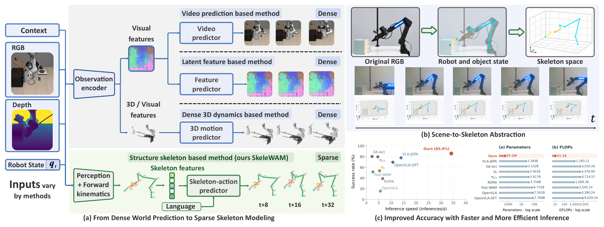
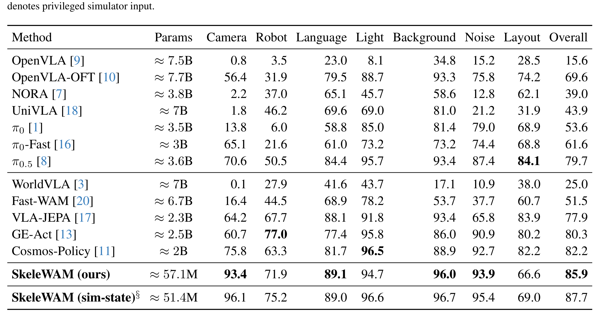
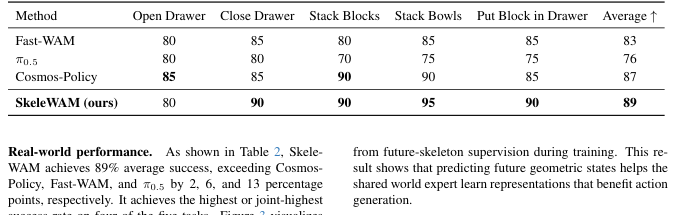
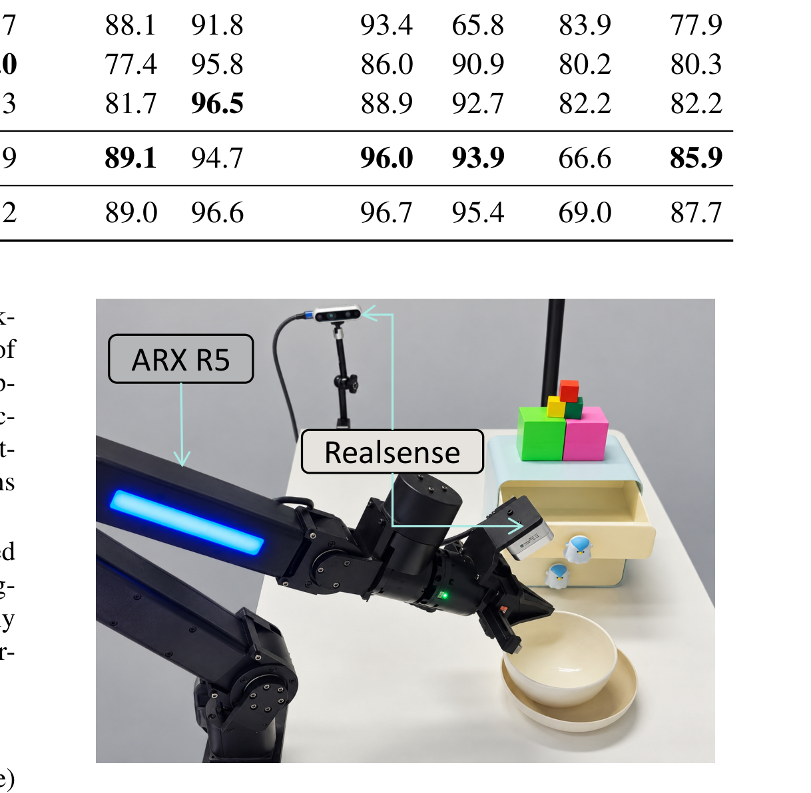
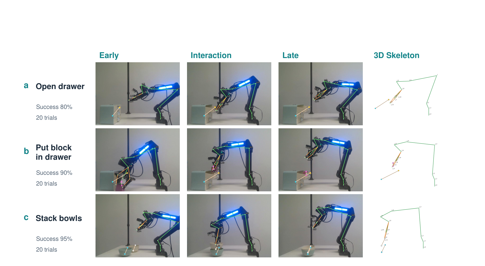
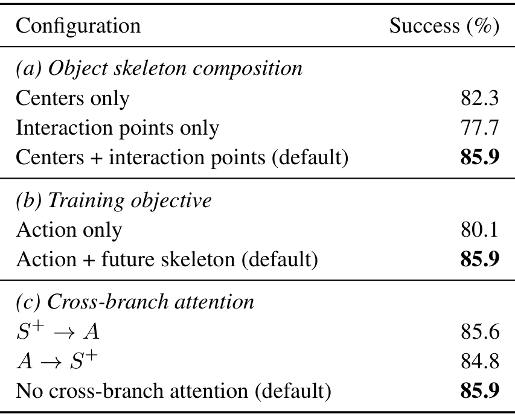
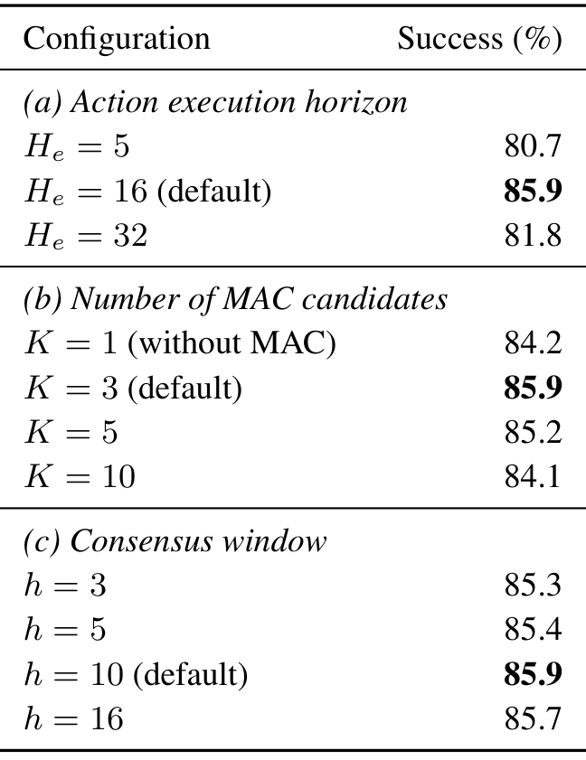

# SkeleWAM: Skeleton World-Action Modeling for Efficient Robotic Manipulation

> arXiv:2610.02120 · 2026-10-01 v1 · 北京大学（Juyi Sheng, Hua Wang, Mengyuan Liu）· 项目页：https://skelewam-project.github.io/
>
> 这篇笔记回答三个问题：稀疏 3D 骨架作为 WAM 状态空间到底省掉了什么、未来骨架监督为什么能「只付训练成本不付推理成本」、以及 57.1M 参数反超数十亿级基线的同时弱点在哪。阅读前提：知道 flow matching 与 MoT 双专家结构即可。

## 动机：密集表征在浪费什么

WAM 的世界侧有三种主流表征，全是「密集」的：预测未来**视频**（像素冗余、外观与控制无关）、预测未来 **latent**（几何只是隐式信息）、预测未来 **3D 点云**（空间密集、大部分点与任务无关）。三者的共同浪费：几何交互信息只占预测目标的一小部分，其余容量都在陪跑。

SkeleWAM 的回答：把场景压成一个**稀疏 3D 骨架**——机器人关节 + 物体中心 + 物体交互点，每个节点一个 3D 坐标。几何显式、外观天然无关、参数量小两个数量级。代价也很清楚：骨架丢掉了场景排布信息——这个代价后面会在布局（layout）扰动上原样显现。

*论文原图编号：Figure 1。(a) 视频/latent/点云三路密集预测与稀疏骨架第四路的对比；(b) 场景到骨架的抽象过程（RGB → 状态叠加 → 3D 轨迹）；(c) 推理速度-成功率散点与参数/算力对数条形图（本文 57.1M / 11.14 GFLOPs）。放在开头是为了让「省什么、值多少」先于方法细节建立。*

## 骨架表示与构建

给定语言指令 $\ell$、RGB-D 观测 $o_t$、本体状态 $q_t$，场景骨架 $S_t = \Phi_\psi(o_t, q_t, \ell) \in \mathbb{R}^{N \times 3}$：

$$
S_t = [J_t;\, P_{t,1}; \dots; P_{t,M}], \quad P_{t,m} = [c_{t,m};\, u_{t,m,1}; \dots; u_{t,m,L_m}]
$$

$J_t$ 是机器人关节与末端位置（**前向运动学**算出），每个物体 $m$ 贡献一个中心 $c_{t,m}$ 加 $L_m$ 个交互点 $u_{t,m,j}$（**冻结的预训练感知网络**从 RGB-D 估计）。节点数 $N = N_r + \sum_m (1 + L_m)$。机器人节点按运动学连通性连接、物体中心连到自己的交互点——骨架组织固定，模型只预测节点坐标。全部坐标在共享的 robot-centric 系表达并按训练集统计归一化。**不需要特权仿真状态、不需要视觉重建**。

## 双专家流匹配与推理

### 联合训练目标

沿用 Fast-WAM 的双专家 MoT：世界专家处理当前与未来骨架词元，动作专家处理动作词元，都条件于语言上下文 $C^\ell$。当前骨架不被生成噪声扰动；动作噪声与未来骨架噪声独立采样（噪声时刻 $\tau_a, \tau_s$），插值路径 $\tilde{A}_{t,\tau_a}, \tilde{S}^+_{t,\tau_s}$，目标向量场 $v^a = \epsilon^a - A_t$、$v^s = \epsilon^s - S_t^+$。联合目标：

$$
\mathcal{L} = \mathcal{L}_{\mathrm{action}} + \lambda_s \mathcal{L}_{\mathrm{skeleton}}, \qquad
\mathcal{L}_{\mathrm{action}} = \mathbb{E}\left[\mathrm{MSE}(\hat{v}^a_\theta, v^a)\right]
$$

注意力掩码是关键设计：当前骨架词元只看自己组；每个预测组看当前骨架 + 自己组；**动作词元与未来骨架词元互不相看**。两个损失都更新世界专家——骨架损失监督未来几何预测，动作损失经当前骨架上下文传播。

### 推理与 MAC

推理时**整个未来骨架分支移除**：只保留当前骨架处理与动作专家，从 $\tilde{A}_{t,1} \sim \mathcal{N}(0, I)$ 沿学习到的动作向量场做 10 步流积分。随机采样 $K$ 个动作 chunk 后用 **Medoid Action Consensus（MAC）** 选代表：在归一化动作空间对每个候选的前 $h$ 步、$d_m$ 个运动维算 pairwise 距离 $d_{ij}$，选平均不相似度最小的 medoid——不是均值（会把多模态拖向单一模式），是最「居中」的样本。执行前 $H_e = 16$ 步后重新观测规划。

*论文原图编号：Figure 2。上：训练双分支——冻结感知 + 前向运动学构骨架，世界/动作双专家共享当前骨架上下文联合流匹配；下：推理管线——未来骨架分支整体移除，MAC 从 K 个采样 chunk 中选 medoid。注意力掩码 $M$ 与 MAC 公式齐全。放在这里是因为「训练监督、推理免费」的全部机制都在这张图里。*

## 关键结果

### LIBERO-Plus：85.9%（57.1M）与布局维弱点

10,030 个变体、七类扰动、零样本：

| 方法 | 参数 | Camera | Robot | Language | Light | Background | Noise | 布局 | 总体 |
| --- | --- | --- | --- | --- | --- | --- | --- | --- | --- |
| π0.5 | ≈3.6B | 70.6 | 50.5 | 84.4 | 95.7 | 93.4 | 87.4 | **84.1** | 79.7 |
| VLA-JEPA | ≈2.3B | 64.2 | 67.7 | 88.1 | 91.8 | 93.4 | 65.8 | 83.9 | 77.9 |
| GE-Act | ≈2.5B | 60.7 | **77.0** | 77.4 | 95.8 | 86.0 | 90.9 | 80.2 | 80.3 |
| Cosmos-Policy | ≈2B | 75.8 | 63.3 | 81.7 | **96.5** | 88.9 | 92.7 | 82.2 | 82.2 |
| **SkeleWAM** | **≈57.1M** | **93.4** | 71.9 | **89.1** | 94.7 | **96.0** | **93.9** | 66.6 | **85.9** |
| SkeleWAM (sim-state)§ | ≈51.4M | 96.1 | 75.2 | 89.0 | 96.6 | 96.7 | 95.4 | 69.0 | 87.7 |

三条主线：总体 85.9% 超最强观测基线 Cosmos-Policy 3.7pp，参数少 35 倍、算力低两个数量级（11.14 vs 数千 GFLOPs）；**相机扰动 93.4%（+17.6pp）**——骨架节点坐标在 robot-centric 系里语义不随视角变，这是显式几何的直接红利；language/background/noise 三维也是最佳。

弱点同样清楚：**布局维 66.6%，落后 π0.5 的 84.1 达 17.5pp**。更重要的证据是 sim-state 特权参照（直接读仿真器物体坐标）：布局维也只有 69.0%——**瓶颈在策略对新颖空间排布的泛化，不在感知**。稀疏骨架丢掉的场景排布信息，特权输入也补不回来。sim-state 总体 87.7% vs RGB-D 85.9%（差 1.8pp，camera/robot 维差 2.7/3.3pp）——冻结感知网络已接近上限。

*论文原图编号：Table 1。十二个基线 + 两个 SkeleWAM 变体的七维扰动全表（§ 为特权仿真输入标记）。放在这里是全文主结果的出处。*

### 真机：ARX R5 五任务 89%

ARX R5 + 外部与腕部 RealSense，桌面场景（抽屉/块/碗），每方法每任务 20 trials：

| 方法 | 开抽屉 | 关抽屉 | 叠块 | 叠碗 | 放块入抽屉 | 平均 |
| --- | --- | --- | --- | --- | --- | --- |
| Fast-WAM | 80 | 85 | 80 | 85 | 85 | 83 |
| π0.5 | 80 | 80 | 70 | 75 | 75 | 76 |
| Cosmos-Policy | **85** | 85 | **90** | 90 | 85 | 87 |
| **SkeleWAM** | 80 | **90** | **90** | **95** | **90** | **89** |

*论文原图编号：Table 2。真机五任务 × 四方法成功率（20 trials/格）。放在这里是真机结论的原始出处。*

*论文原图编号：Figure 4。ARX R5 + 外部/腕部 RealSense 的桌面设置。放在真机段落是为了标明硬件条件。*

*论文原图编号：Figure 3。三个真机任务的早-交互-晚三段执行序列与对应 3D 骨架轨迹。放在这里是为了展示骨架如何紧凑记录演化中的机器人-物体构型。*

### 六项消融：监督靠共训、选择靠小 K

| 消融 | 设置 | 成功率 |
| --- | --- | --- |
| 骨架组成 | 仅中心 / 仅交互点 / **组合** | 82.3 / 77.7 / **85.9** |
| 训练目标 | 仅动作 / **+未来骨架** | 80.1 / **85.9** |
| 跨分支注意力 | 骨架→动作 / 动作→骨架 / **无** | 85.6 / 84.8 / **85.9** |
| 执行视界 $H_e$ | 5 / **16** / 32 | 80.7 / **85.9** / 81.8 |
| MAC 候选数 $K$ | 1 / **3** / 5 / 10 | 84.2 / **85.9** / 85.2 / 84.1 |
| 共识窗口 $h$ | 3 / 5 / **10** / 16 | 85.3 / 85.4 / **85.9** / 85.7 |

最有信息量的是中间三行：**去掉未来骨架监督掉 5.8pp**（85.9→80.1），而两种推理程序完全相同——几何监督的收益全部来自训练期的共享世界专家；**跨分支注意力三种设置差异 ≤1.1pp**——收益来自共训而非分支间信息交换，这直接允许推理时砍掉未来骨架分支。物体中心提供稳定空间参照、交互点描述操作相关区域，两者互补（组合 85.9 > 单一 82.3/77.7）。

MAC 的非单调（K=3 峰值，K=5/10 反降）值得注意：我的分析——medoid 在小 K 下平滑采样随机性，大 K 下把选择拖向分布中心、丢失多模态动作。$H_e=16$ 居中最优：短视界反馈频繁但时间不一致，长视界相反。

*论文原图编号：Table 3。骨架组成/训练目标/跨分支注意力三面板消融。放在这里是因为「监督靠共训」的归因链由它支撑。*

*论文原图编号：Table 4。执行视界/MAC 候选数/共识窗口三面板推理消融。放在这里是为了呈现推理侧超参的非单调性。*

## 证据边界与局限

**作者明示的**：布局维 66.6% 是弱点，「稀疏几何观测不能完全解决对显著不同空间排布的泛化」；sim-state 版布局维也仅 69.0%——剩余困难超出视觉定位、反映策略对新空间构型的泛化限制。

**我的分析**：真机只有五任务、每格 20 trials，89 vs 87 的差距在样本量下不构成显著优势；感知网络是外挂冻结组件，本文没有训练它，感知误差对困难物体（遮挡、透明、小物体）的表现未测；单卡 4090、60K steps、batch 48 的配方未探索骨架模型放大——57.1M 是「够用」而非「上限」；物体数 $M$ 增长时节点数 $N$ 线性增长，杂乱多物体场景的可扩展性未报告。

**尚不能确定**：骨架监督与其他几何监督（如直接监督深度/点云子集）的相对效果——论文只测了骨架一种；MAC 的非单调是否随任务多模态程度变化。

## 可以带走的东西

- **训练期监督、推理期免单**的骨架监督模式：几何先验只进共训、不占推理算力——任何「辅助监督有用但推理想省」的场景都适用。
- **MAC（medoid 共识）**是对随机动作采样的廉价去噪：K=3 即峰值；比均值选择更保多模态。
- **sim-state 特权输入作为感知质量上界标尺**：评估任何感知提取器时，直接读仿真器坐标的对照能告诉你还有多少感知侧空间——本文只剩 1.8pp，说明该去修策略侧了。
- **物体骨架 = 中心（稳定参照）+ 交互点（操作语义）** 的组合设计可直接移植到其他骨架/图策略。

与同日的 UniWAM（MoT 大模型统一路线）对照：SkeleWAM 代表 WAM 谱系的另一端——**显式几何 + 极小参数**。两篇合起来看，WAM 的「世界侧」既可以从容量买（UniWAM），也可以从表征买（SkeleWAM），而后者便宜两个数量级。

## 参考与资源

- Paper: [arXiv:2610.02120](https://arxiv.org/abs/2610.02120)（v1，2026-10-01；9 页）
- Project: [skelewam-project.github.io](https://skelewam-project.github.io/)（截至本笔记写作仅 manuscript PDF 与 BibTeX）
- 代码：未找到可确认的公开代码仓库
- 评测：LIBERO-Plus 10,030 变体 / ARX R5 真机五任务
