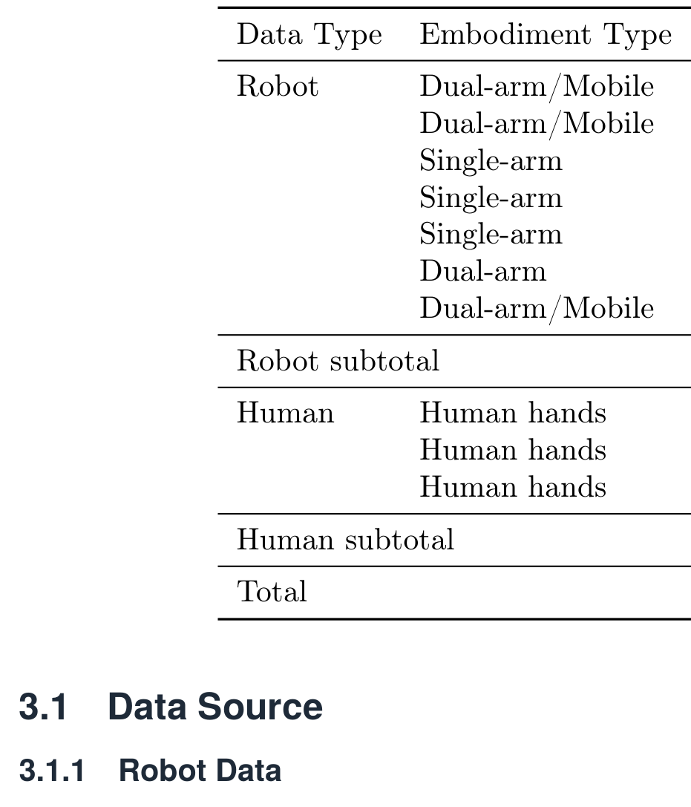
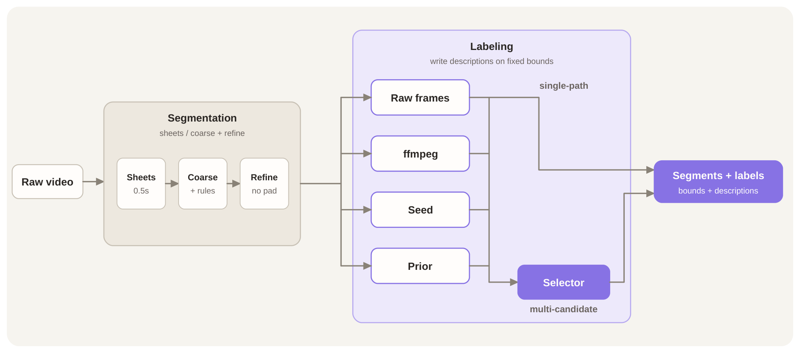
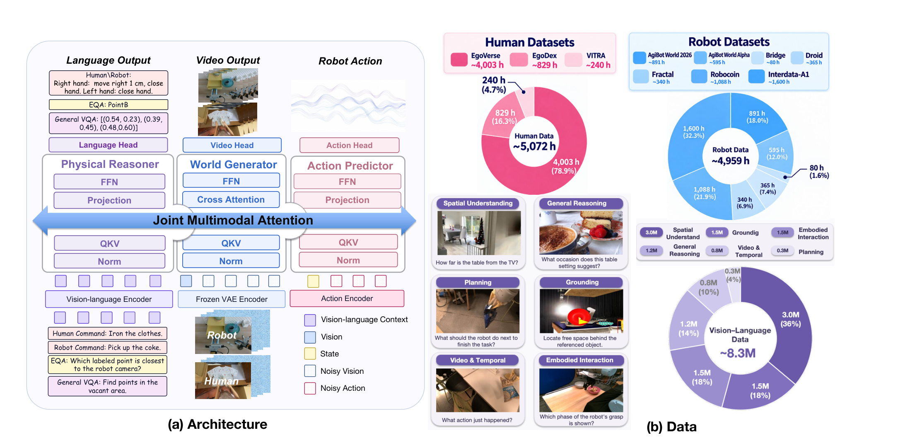
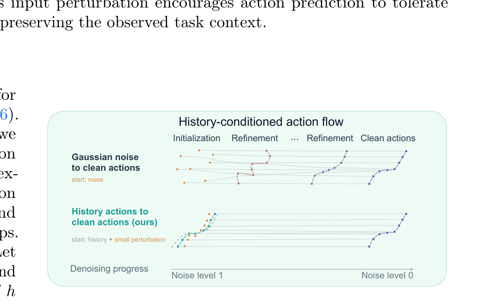
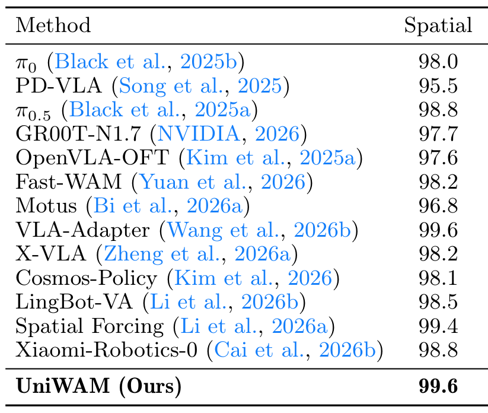
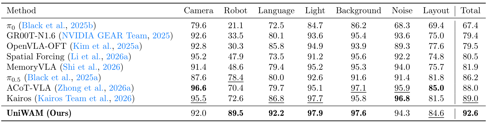
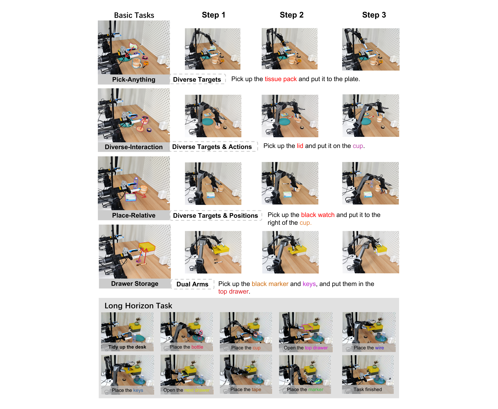
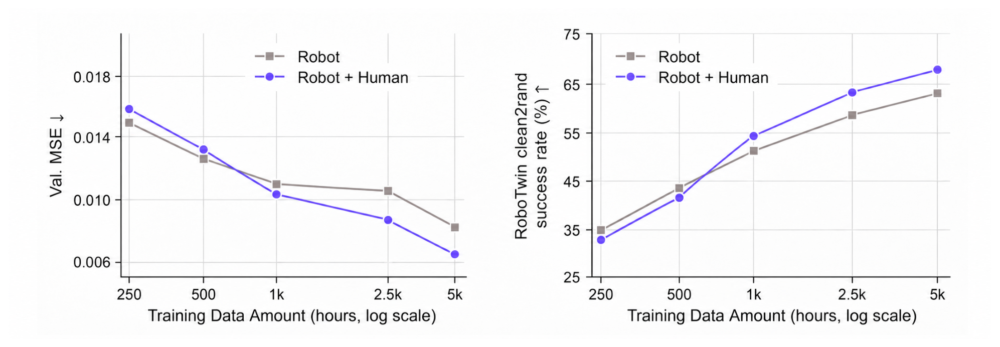
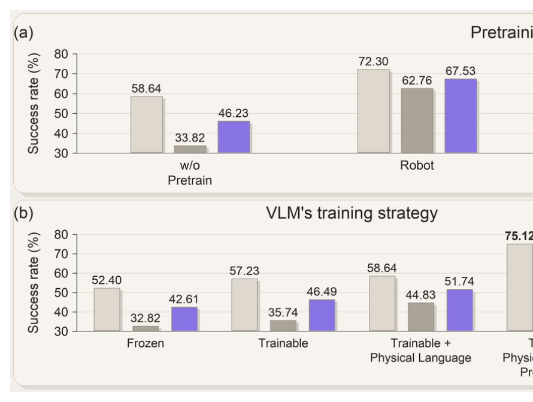

# UniWAM: Unified World-Action Model

> arXiv:2610.02054 · 2026-10-01 v1 · HKUST(GZ) 等十六人团队（Jiayi Chen 等）· 代码 Apache-2.0：https://github.com/UniWAM/UniWAM · 权重 ModelScope：UniWAM-base / UniWAM-robotwin-clean
>
> 这篇笔记回答三个问题：三专家 MoT 架构里每一路数据到底监督哪个专家、post-training 的两个技巧（未来视觉噪声增广、历史条件化去噪）各自解决什么、以及「人类数据 ≥1k 小时才增益」这条 scaling 结论怎么读。阅读前提：知道 VLA 与 WAM 两条路线的基本形态。

## 研究问题：VLA 的语义与 WAM 的动态如何装进一个模型

两条路线各瘸一条腿：VLA（π0.5 / GR00T 系）靠 VLM 预训练拿到语义理解，但**只有动作监督**，学不到世界动态；WAM（Motus / Fast-WAM 系）从视频生成模型继承时空先验、靠预测未来帧拿密集监督，但分布外场景与复杂推理弱。UniWAM 的问题是：能不能让一个模型同时拿到两侧的能力。

作者把它拆成三个具体挑战，每个挑战对应一项设计——这个对应关系是理解全文的钥匙：

1. **把 VLM 适配到具身任务但不能毁掉预训练语言能力** → 监督信号必须与 VLM 预训练分布兼容。解法：**物理语言监督**——末端运动用固定坐标系 + 结构化模板写成自然语言（「右手右移 1 cm，闭合手爪」），动作监督直接变成 VLM 惯常的文本生成。
2. **异构数据的监督冲突** → 三个专家配三个数据源、各取所需：VQA 只监督 reasoner（保知识）；人类数据监督 reasoner + generator（吃物理知识、避开低精度动作标签）；机器人数据监督全部三个专家（动作标注最准、与下游一致性最高）。
3. **异构大规模训练对数据质量的要求** → 严格的清洗管线 + 人类轨迹自动分段标注（EgoANT）。

*论文原图编号：Figure 1。海报式总览：三源训练数据（VQA / EgoDex+EgoVerse+VITRA / 六个机器人数据集）、三专家统一架构、六项基准雷达图（LIBERO 99.2 / LIBERO-Plus 92.6 / RoboTwin C2C 75.1 / C2R 68.3 / 真机指令遵循 82.5 / 长时程 5.0）。放在开头是为了先建立「数据-架构-结果」三段的整体图景。*

## 数据：5,072 小时人类 + 4,959 小时机器人 + 8.3M VL 样本

人类数据（自我中心视频）：EgoVerse 4,003h（78.9%）+ EgoDex 829h（16.3%）+ VITRA 240h（4.7%），合计 5,072h。机器人数据 4,959h：InternData-A1 1,600（32.3%）/ RoboCOIN 1,088（21.9%）/ AgiBot 2026+Alpha 1,486 / DROID 365 / Fractal 340 / Bridge 80。VL 预训练 8.3M 样本：空间理解 3.0M、接地 1.5M、具身交互 1.5M、通用推理 1.2M、视频时序 0.8M、规划 0.3M。

*论文原图编号：Table 1。三个数据家族的全部来源、规模与类别总览——人类数据监督 reasoner 与 generator，机器人数据监督三个专家，VL 数据只进 reasoner。放在这里是为了让「配比」以原始表形式可查。*

人类数据不是拿来就用的。EgoDex 的单条轨迹常含多个动作，团队设计了四阶段标注管线（EgoANT）：全局分段（整段时间戳接触表，0.5 s 采样、每表 ≤20 帧、完成事件规则）→ 局部精化（粗假设 + episode 级上下文，无额外窗口填充）→ 段标注（固定时间段的原始帧 / FFmpeg / 种子或先验条件化多轮标注）→ 候选选择（只看候选描述文本、按「具体动作-物体-目的地/状态」措辞偏好选一）。标注出的子任务描述与对应帧、头戴相机位姿、双腕轨迹做时间对齐；双腕位姿（3D 位置 + 四元数）变换到条件时刻头戴相机系，拼成 14 维人手运动表征。缺标注、对齐无效、时长不足、腕部几何不合理者剔除。

我的分析：这套管线的意义在于把「人类视频里哪些帧属于哪个动作」的判断交给大模型级联（分段用 Qwen3.6-27B，标注用 Qwen3.5-397B 级），而不是人工切——5,000 小时数据人工切不动。代价是标注噪声进入监督链路，论文没有量化这一层噪声对下游的影响（见边界小节）。

*论文原图编号：Figure 2。从原始视频到「段+标签」的两阶段流程：Segmentation（0.5s 接触表 → 粗分段+规则 → 精化不填充）与 Labeling（固定时间段上的单路/多候选路径汇聚到 Selector）。放在这里是因为人类数据能否用起来完全取决于这条管线。*

## 架构与训练目标

### 三专家 MoT 与联合注意力

给定观测 $o_t$、本体状态 $s_t$、指令 $I$，模型学联合分布 $p_\theta(y, o_{t+1:t+h}, a_{t+1:t+h} \mid o_t, s_t, I)$。三个专家：

- **Physical reasoner**：Qwen3-VL-2B-Instruct 投影出语义词元，保留语言头做自回归生成；
- **World generator**：Wan2.2-TI2V-5B 骨干，在冻结 VAE 的 latent 空间预测未来视觉流（当前观测 latent 保持干净）；
- **Action predictor**：动作 chunk 带位置信息嵌入，外加当前状态词元，预测连续流场。

跨模态交互是全文架构的关键操作：每层各专家先做自己的归一化（视频/动作再加时间步调制），投影到共享注意力空间后，**Q/K/V 沿词元维拼接做联合注意力**，输出按模态拆回各专家——动作词元因此同时吃进语义上下文与演化中的视觉预测。

### 三个损失

语言损失（Eq. 4，只在答案词元上算）：$\mathcal{L}_{\mathrm{lang}} = -\sum_j \log p_\theta(y_j \mid o_t, I, y_{<j})$。视觉与动作是双 flow matching（Eq. 5）：各自独立采样噪声级 $\tau_v, \tau_a$，插值 $\tilde{Z}, \tilde{A}$，监督速度场回归目标 $(Z_t^1 - Z_t^0)$ / $(A_t^1 - A_t^0)$，两个速度场在**一次联合前向**里同时给出。视觉损失只覆盖未来帧——条件观测不进视觉损失。

*论文原图编号：Figure 3。(a) 架构：三个编码器（VL / 冻结 VAE / Action）→ Joint Multimodal Attention → 三个头（语言/视频/动作），附四类输入词元与输入输出示例；(b) 数据配比饼图与六类 VL 任务示例。放在这里是给机制流程一个可对照的图。*

## Post-training 的两个技巧

**未来视觉噪声增广**：post-training 时部分扰动未来视觉 latent、条件帧保持干净。效果是迫使动作专家从粗糙视觉表征里提取控制相关语义，而不是依赖精确的未来预测——这同时解释了鲁棒性提升与对去噪步数的低依赖。

**历史条件化 flow matching**：把动作历史映射到高维 latent，用这个表示**初始化** flow matching 的起点（不再是纯高斯噪声，而是「历史 + 小扰动」）。历史运动信息直接引导未来动作轨迹的生成，大幅减少去噪步数。

*论文原图编号：Figure 4。两条对照：从高斯噪声起步（多轨迹、中途大幅漂移）vs 从「历史+小扰动」起步（单轨迹、平滑直达清洁动作）。放在这里是因为它是减步数与 A2A 消融（69.73 vs 64.80）的机制解释图。*

## 关键结果

### 仿真四大基准

LIBERO（分布内）：平均 **99.2%**，超此前最好的 Xiaomi-Robotics-0（98.7）0.5pp。RoboTwin 2.0：C2C **75.14%**，C2R（干净训练 + 域随机化测试）**68.32%**——C2C→C2R 只掉 6.82pp，对照 π0.5 掉 24.70、Spatial Forcing 掉 50.46。LIBERO-Plus（七维扰动）：总 **92.6%**，为列示方法最高；robot 维 89.5 / language 92.2 / light 97.9 / background 97.6 均为最高，camera 92.0 与 noise 94.3 低于 ACoT-VLA。

*论文原图编号：Table 4（截取到 Spatial 列，完整五列为 Spatial/Object/Goal/Long/Average）。十四个方法行完整：UniWAM 99.6 与 VLA-Adapter 并列 Spatial 最高，平均 99.2 为表内第一。放在这里是为了给分布内结论提供原始表出处。*

*论文原图编号：Table 6。七维扰动（camera/robot/language/light/background/noise/layout）+ 总分的完整矩阵，九个方法；UniWAM 总 92.6 加粗为列内最高。放在这里是因为 OOD 鲁棒性是本文相对基线优势最集中的维度。*

维度级结果与训练目标的对应关系值得细读（作者自己也做了这个归因）：language 维 92.2 靠物理语言监督（语义-动作共享映射、少依赖虚假视觉线索）；light/background 维 97.9/97.6 靠大规模世界生成训练（跨光照/背景一致的物理动态）；robot 维 89.5（初始状态扰动）最依赖真实动态理解——恰好是 WAM 侧贡献最大的维度。

### 真机：指令遵循与长时程

平台 AgileX Piper 双臂（各 6-DoF + 平行夹爪）+ 腕相机 + 第三人称相机，最多 18 个物体。每任务 200 演示，单一通才策略联合训练所有任务，8×H100 80K steps。四个指令遵循任务（Pick-Anything / Diverse-Interaction / Place-Relative / Drawer-Storage）报告两个指标：SR（任务整体完成）与 IFR（指令接地正确性——拿错物体即算 IFR 失败，即使操作本身成功）。UniWAM 平均 SR 67.5%、IFR 82.5%，超 π0.5 13.1 / 21.9pp；语言接地增益最显著处是 Diverse-Interaction（需同时识别目标物体与推断交互类型）：SR 40.0→72.5。

长时程任务只给高层指令「整理桌面」，六个里程碑（放第一只杯 / 第二只杯 / 开抽屉 / 放物入内 / 关抽屉 / 放回马克笔）计 Task Progress 0–6：UniWAM **5.0** vs π0.5 4.8 / Motus 3.2。训练时把细粒度子任务描述前接到物理 reasoner 的文本动作推理上一起优化——模型把高层目标与中间子目标及对应物理动作关联起来。

*论文原图编号：Figure 5。上四行为四个指令遵循任务的三步序列（彩色关键词标注指令成分），下两行为长时程任务的十步执行（整理桌面 → 逐项放置 → 开关抽屉 → 完成）。放在这里是为了让 IFR/SR/Task Progress 三个指标落到可见行为上。*

### Scaling law 与人类数据的阈值效应

五个数据档位（250 / 500 / 1k / 2.5k / 5k 小时机器人数据 + 等量人类数据）的验证损失拟合出干净的 log-linear 关系：

$$
L(D) \approx 0.03205 - 0.00302 \ln(D), \qquad R^2 \approx 0.983
$$

更重要的行为结论：**小数据量时加人类数据有害**（视觉与物理域差阻碍跨分布学习），**≥1k 小时后人类数据开始增益且随规模扩大**——大规模数据让跨本体共享世界动态的迁移成为可能。验证损失与真机成功率同步变化，提示验证损失可以做具身控制能力的离线指标。

*论文原图编号：Figure 7。左：验证 MSE（Robot+Human 在 500h 后持续低于 Robot-only）；右：RoboTwin C2R 成功率（1k 小时附近交叉，人类数据开始增益，Robot+Human 从 33% 升到 68%）。放在这里是因为「阈值效应」是本文对数据配比实践最有直接指导意义的结论。*

### 消融三级拆解

三源消融：无预训练 46.23% → 机器人预训练 67.53%（C2C/C2R 平均）；加 VQA 主要提 C2R（高层感知能力）；加人类数据 C2C/C2R 双向有效。VLM 训练策略（累积消融）：Frozen 42.61 → Trainable 46.49 → +物理语言 51.74 → +预训练 75.12——**解冻 reasoner 与物理语言监督是两个独立生效的开关**。动作生成策略：A2A（历史初始化）69.73 vs N2A 64.80，加未来视觉增广到 71.34。

*论文原图编号：Figure 9。(a) 预训练消融（无预训练 vs 机器人数据，三条件柱）；(b) VLM 训练策略累积消融（Frozen → Trainable → +物理语言 → +预训练 75.12）。放在这里是为了呈现两个开关（解冻/物理语言）与预训练的叠加关系。*

## 证据边界与局限

**开源范围（作者明示）**：代码 Apache-2.0 + 两个 checkpoint（UniWAM-base、UniWAM-robotwin-clean，ModelScope）+ Wan2.2/Qwen3-VL 骨干；**Bridge、DROID、Fractal 数据 loader 与真机推理明确 out of scope**；数据集不发布（仅 RoboTwin 转换工具）。

**我的分析**：跨家族比较（VLA vs WAM 基线）不是受控归因——各基线预训练分布不同（DROID 检查点 vs 各自权重），所以「统一架构优于两侧」的结论依赖的是同时覆盖两侧指标，而不是逐项可拆的贡献分解。EgoANT 标注是 Qwen 级联产物，标注噪声进入监督链路且论文未量化其影响；t-SNE 表征重叠（Fig 8，有/无物理语言监督）支持域差缩小的方向性结论，但二维投影不构成等价性证明。真机只有 4+1 个任务、每任务 200 演示、单平台（Piper）；RoboTwin C2C 75.14 低于 OpenWAM-α 的 89.4——UniWAM 的优势集中在 C2R（68.32 vs 48.7），即**鲁棒性一侧**。

**尚不能确定**：1k 小时阈值是否随模型规模与数据组成移动（论文只测了一个规模档）；物理语言模板在其他本体上的迁移成本；验证损失作为能力指标的可移植性（只在本次数据范围建立）。

## 可以带走的东西

- **组件-数据分配矩阵**：哪路数据监督哪个专家（VQA→reasoner；人类→reasoner+generator；机器人→全部）——异构数据预训练最直接可抄的配方骨架。
- **U 型阈值结论**：机器人数据不足 1k 小时量级时别急着混人类视频，先过阈值再混，增益随规模扩大。
- **物理语言模板**：固定坐标系 + 结构化模板 + 任意精度，让动作监督留在 VLM 预训练分布内——可移植到任何 VLA 的 reasoner 微调。
- **A2A 初始化**：历史动作 latent 初始化 flow matching，替代纯噪声起点——与减步数目标正交，任何 flow matching 动作专家都适用。

## 参考与资源

- Paper: [arXiv:2610.02054](https://arxiv.org/abs/2610.02054)（v1，2026-10-01；29 页含附录）
- Code: [GitHub UniWAM/UniWAM](https://github.com/UniWAM/UniWAM)（Apache-2.0）
- Weights: ModelScope `UniWAM-base` / `UniWAM-robotwin-clean`（经 README 链接）
- 评测基准：LIBERO / LIBERO-Plus / RoboTwin 2.0 C2C+C2R / 真机 Piper 双臂
