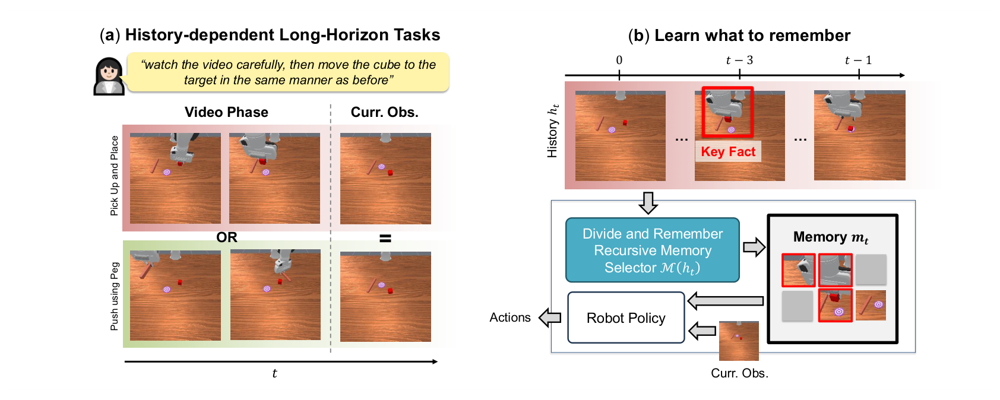
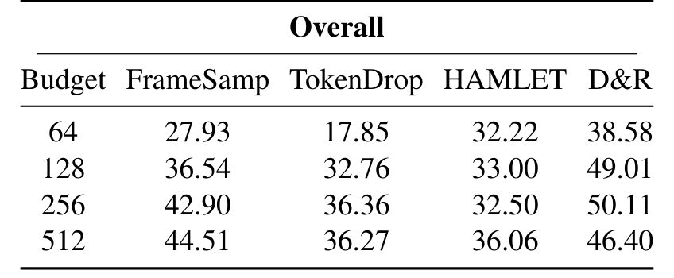
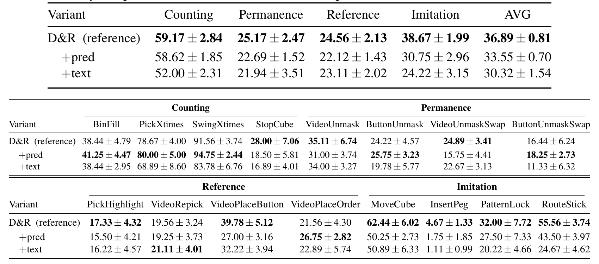
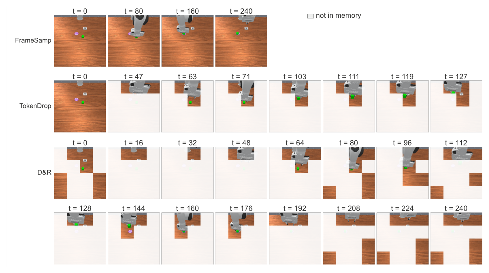
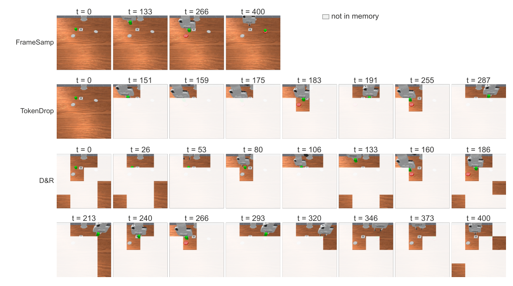
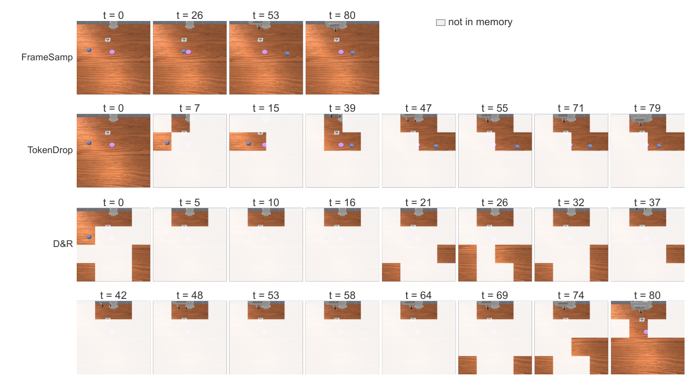
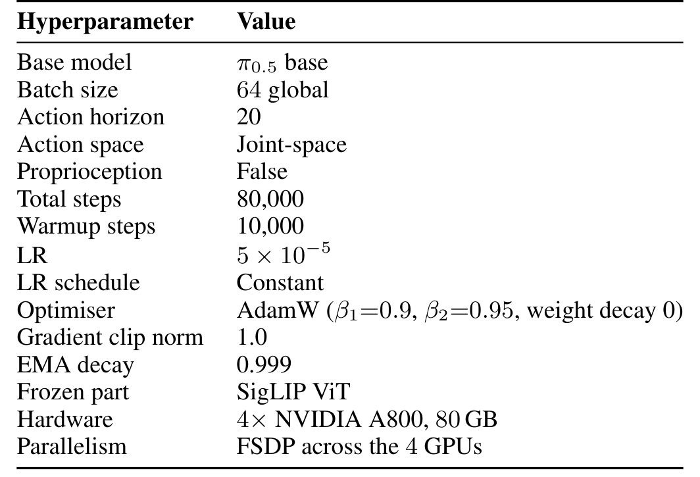
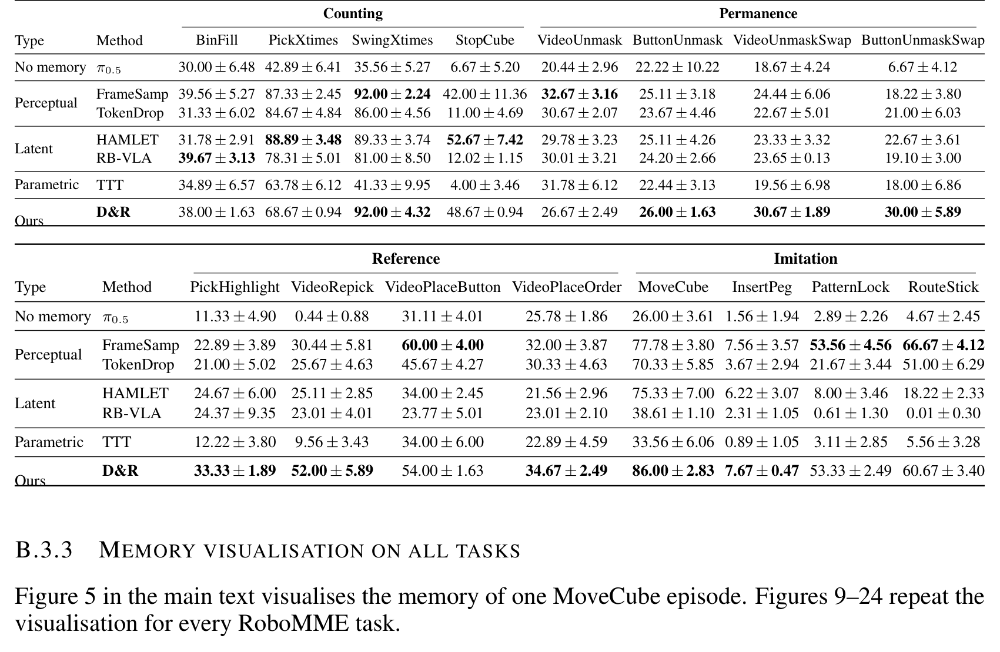

# Divide-and-Remember: Recursive Action-Relevant Memory for Long-Horizon VLA Policies

> **Divide-and-Remember: Recursive Action-Relevant Memory for Long-Horizon VLA Policies**（D&R）
> Xuehui Yu 等 6 人（TUM Harold Soh / Stefano Albrecht 线）
> [arXiv:2610.00982v1](https://arxiv.org/abs/2610.00982)（2026-10-01 03:18 UTC 提交）· cs.RO 交叉 cs.AI
> 项目页（含代码与 checkpoint）：[dnr-memory.github.io](https://dnr-memory.github.io/)

这篇论文把一个一直被「设计直觉」处理的问题形式化了：**长时程 VLA 的记忆到底该记什么？** 既有做法要么保留像素变化最大的帧（感知启发式）、要么学一个 latent 压缩（latent memory）、要么存快权重（参数记忆）——选择规则都是设计出来的，跨任务增益不一致。作者的回答是把「记什么」变成优化问题：**最优记忆最大化动作与记忆在当前观测条件下的互信息 $I(a_t; m_t \mid o_t)$**，然后直接在 VLA 的预训练单元空间里端到端解这个离散优化。

## 问题定义与信息论形式化

*记忆问题示例：(a) 两种历史（拿起来放 vs 用杆推）导向同一当前观测，只有历史告诉策略「以之前的方式」是哪种；(b) 记忆选择器从全历史抽出当前观测缺少的关键事实（抓取位姿）（论文图 1，p2）。*

**记忆问题**（Definition 1）：任务记忆长度 $l_{mem}$（专家策略可实现的最短历史窗口）超过策略上下文长度 $l_{ctx}$ 时，当前输入不足以决定正确动作。论文开头的示例很直观：机器人看完一段视频（拿起来放 vs 用杆推），当前观测完全相同——只有历史告诉它「以之前的方式」是哪种方式。

**Proposition 1** 的推导链条值得完整走一遍。历史对控制、超出当前观测的信息量是条件互信息 $I(a_t; h_t \mid o_t)$。链式分解（Eq. 3）：

$$I(a_t; h_t \mid o_t) = I(a_t; m_t \mid o_t) + I(a_t; h_t \mid o_t, m_t)$$

左边与记忆无关——**最大化记忆保留的部分等价于最小化被丢弃的部分**。所以最优记忆 $M^\star = \arg\max_M I(a_t; M(h_t) \mid o_t)$，且是策略充分统计量：$\pi^\star(a_t \mid o_t, h_t) = \pi^\star(a_t \mid o_t, m_t)$。

**Eq. 5-8** 把不可计算的目标落到可优化形式：$I(a_t; m_t \mid o_t) = H(a_t \mid o_t) - H(a_t \mid o_t, m_t)$，用策略 $\pi_\theta$ 做变分代理后下界 = $\mathbb{E}_D[\log \pi_\theta(a_t \mid o_t, m_t)] + H(a_t \mid o_t)$——**动作对数似然加一个由数据固定的常数**。实践中 π0.5 用 flow matching 损失当代理（训练同一条件分布、不界定似然——论文明示）。于是策略参数与记忆**联合端到端**优化，无辅助损失、无手工规则。

这个视角顺手解释了两类既有缺陷：感知启发式（保留像素差异大的帧）最大化的是 $H(o_k \mid o_t)$——$I(a_t; o_k \mid o_t) \le H(o_k \mid o_t)$ 只是宽松上界，光照类与动作无关的变化会吃掉预算，按钮按压类几乎不可见的行为漏掉；潜在记忆（HAMLET）确实在优化变分下界，但换到新 latent 空间、丢掉 VLA 预训练单元携带的空间细节。

## D&R：递归的预算化单元选择

*D&R 总览：(a) 全历史的选择递归分解为 2K 单元上的 top-K 子问题，同一轻量选择器跨所有节点共享，逐级合并重选；(b) 记忆经自适应 LayerNorm 调制进动作专家（论文图 3，p5）。*

**递归分解**（Eq. 9/10、Algorithm 1）：记忆是映射 $M: \mathcal{H}_t \to$ 至多 $K$ 个单元。选择器 $f_\psi$ 固定输入 2K 个单元、输出 top-K；全历史的选择按左对齐分裂递归组合：

$$M_\psi(\mathcal{H}_{i:j}) = \begin{cases} \mathcal{H}_{i:j} & |\mathcal{H}_{i:j}| \le K \\ f_\psi(M_\psi(\mathcal{H}_{i:q}) \cup M_\psi(\mathcal{H}_{q+1:j})) & \text{否则} \end{cases}$$

$q = i + 2^\ell K - 1$，$2^\ell K$ 为严格放得进 span 的最大块。三个结构性后果：固定尺寸选择器服务无界历史；逐级过滤让计算只花在幸存单元上（**背景在叶子层被丢**）；组合按单元 span 而非固定窗口——**训练与部署对同一前缀构建同一棵树，离线-在线错配从结构上消除**。

**选择器 $f_\psi$**：冻结 SigLIP 编码 + M-RoPE（时间/高/宽三维旋转位置嵌入）+ N 块自注意与 FFN + 线性头出选择分数 $s_i$。Gumbel-TopK（Eq. 11/12）：$g_i = sg(g^{hard}_i - g^{soft}_i) + g^{soft}_i$——前向硬选择（$g^{hard} = \mathbb{1}[s_i > \rho]$，$\rho$ 为第 K 与 K+1 大分数的中点阈值）、反向软梯度（sigmoid 松弛），训练时加 Gumbel 噪声探索。**单选择器跨所有节点共享**——捕捉各层共通的选择规则，参数与推理成本都不随历史涨。

**记忆调制**：根部 64 个单元经自适应 LayerNorm（Scale&Shift 出 $\gamma, \beta$）跨注意调制动作专家——所有基线用同一调制方式，比较只比「装什么」。

## 机制流程

1. 历史候选池下采样：$|\mathcal{H}|/16$ 帧、每帧 16 个池化补丁，选择器成本与历史长度无关。
2. 叶、中、根逐级执行 top-K，时间顺序在每级保持。
3. 根部至多 64 个单元以 $\gamma, \beta$ 调制动作专家。
4. 策略输出 20 动作块、执行前 16。

动作单元被**排除**出候选池——因果混淆论证：动作条件策略可能学会复读上一动作（与下一动作高度但虚假相关）。指令文本单元入池反而有害（见消融）。

## RoboMME：帧类与状态类的分离证据

16 任务、64 单元预算、三种子 × 末三 checkpoint（九次运行平均）、训练种子不相交、最大视界 1300 步：

| 方法 | 总体 | 备注 |
|---|---|---|
| π0.5（无记忆） | 17.9% | DrawPattern 九次失败八次同一左移动作开局——固定回退行为 |
| TokenDrop | 17.85% | 感知记忆 |
| FrameSamp | 27.9% | 感知记忆 |
| HAMLET | 32.2% | latent 记忆 |
| **D&R** | **38.6%** | |

*预算扫描：64→512 单元下四方法总体成功率，D&R 在 256 达 50.11% 峰值（论文表 8，p19）。*

论文最有分析价值的分组是**帧类 vs 状态类**事实（按六功能特征事后归组）：

- **帧类**（Motion-Centric / Short-与 Long-Horizon Video）：需要回指某一帧——**D&R 最强**：Motion-Centric 47.5%（FrameSamp 31.0、HAMLET 24.8）；Long-Horizon Video 31.7% 是唯一超过无记忆策略（28.5%）的记忆法。
- **状态类**（Time-Sensitive / Dynamic Scene-Change / Event-Salient）：需要运行态（计数/过程进度）——**latent 竞争甚至领先**：HAMLET 领先 Time-Sensitive（39.3 vs 31.3）；Dynamic/Event-Salient 平局（24.8/59.9 vs 23.8/58.2）。

结构解释：每步更新的 latent 天然追踪运行态；D&R 只能从快照重建——BinFill 里它学会给每个入桶的方块留一张快照（Fig. 9）。**Imitation 上 latent 崩溃**（HAMLET 19.5%、RB-VLA 10.2%、RouteStick 0.0% vs D&R 38.67%）——压缩态丢掉了复现演示序列需要的空间细节。

*RoboMME 全 16 任务：按 Counting/Permanence/Reference/Imitation 分组，五类记忆方法逐任务对比（论文表 7，p18）。*

MoveCube 可视化（Fig. 5）：D&R 的 64 个 patch 里 35 个来自 300+ 步前的视频段——**抓取位姿被保留**，这正是「以之前的方式移动」需要的那个关键事实。三个计数任务的三方法记忆保留对比（FrameSamp 均匀采帧、TokenDrop 像素变化补丁、D&R 递归选择）：

*PickXtimes 计数任务：三方法的 64 单元记忆保留对比，白色为未入记忆（论文图 10，p20）。*

*SwingXtimes 计数任务：三方法的记忆保留对比（论文图 11，p20）。*

*StopCube 计数任务：三方法的记忆保留对比（论文图 12，p21）。*

## 真机与效率

四任务（PutBottles 最长 4 分钟、含人为干预与感知噪声；TrackCube / RepickCube / DrawPattern）：

| 方法 | Put | Track | Repick | Draw | 总计 |
|---|---|---|---|---|---|
| π0.5 | 0/10 | 2/10 | 0/10 | 1/10 | 3/40 |
| FrameSamp | 4/10 | 8/10 | 6/10 | 4/10 | 22/40 |
| **D&R** | **9/10** | **9/10** | **9/10** | **8/10** | **35/40** |

FrameSamp 的失败模式：记忆装错帧后误差随时间累积（RepickCube 第二个方块、DrawPattern 第三步最多）。**训练效率**：D&R 约 20 小时完成 80k 步；RB-VLA 每步递归更新 belief、时间不可并行——约 10 天。

## 消融：池、预算、训练信号

- **候选池 $|\mathcal{H}|$ 扫描**（128→1024）：状态类随池增长（Time-Sensitive 20.7→32.4——覆盖时间轴帮助追踪过程）；帧类需要特定单元全保真检索，池大了被淹——Motion-Centric 峰在 512（47.5%）回落 1024（36.2%）。**两类事实的最优池大小方向相反**。
- **+pred**（加 RB-VLA 世界模型损失）：无收益——让记忆预测未来花费的容量动作不买回（与 Sec. 4 的理论一致：策略充分统计量不需要预测能力）。
- **+text**（指令单元入池）：总体 −6.6pt、Imitation −14.5pt——文本单元稀释候选池。
- **预算扫描**：64→256 升至 50.11%、512 回落 46.40%——更大预算需更多训练步，80k 步下未收敛。

## 边界与局限

训练配置：π0.5 底座、全局 batch 64、动作视界 20、80,000 步、AdamW、4×A800 80GB + FSDP 并行、SigLIP ViT 冻结：

*训练超参：底座/批次/视界/学习率/优化器/硬件与并行策略（论文表 3，p16）。*

512 单元预算下的逐任务复表：

*512 预算的 16 任务复表：五类方法逐任务对比，D&R 在 Reference/Imitation 组领先最明显（论文表 9，p19）。*

作者明示：状态类上 D&R 只与 latent 打平、StopCube/ButtonUnmask 落后——快照式存储天然劣势，提议训练选择器学「重估值」让存储更紧凑；多任务无任务特定信息可能收敛到共享知识造成冗余。协议边界（论文与我的核对）：flow matching 是似然代理不界定似然；变分下界是近似——选择器只能近似 argmax；左对齐分裂是设计选择、最优树结构未证明；真机仅 4 任务 40 试验、未与 latent 记忆真机对比。

我的补充：帧类/状态类二分基于六功能特征的事后归组，边界任务可能兼具两类；候选池下采样（均匀采帧）在超长历史上可能错过稀疏关键帧——论文未讨论这一层的误差。

## 拿走什么

- **帧类 vs 状态类判据**：选记忆方法先问任务需要回指某一帧（抓取位姿/演示视频）还是运行态（计数/进度）——前者用快照选择式，后者用每步更新 latent。这是全文最可直接迁移的工程判据。
- **递归 2K→top-K**：任何「预算 K 个单元、历史无界」的场景（长视频问答、多轮对话状态维护）可直接套用；单选择器共享 + 池下采样是轻量配方。
- **动作单元排除论证**：设计任何记忆选择器前先检查因果混淆——「上一动作高度预测下一动作」是最容易学出的假捷径。
- **评估协议模板**：三种子 × 末三 checkpoint 九次平均 + 训练种子不相交——抗单次波动。
- **信息论视角当分析工具**：$I(a;m \mid o)$ 框架不必真去优化，也能用来诊断既有记忆法在浪费预算还是漏关键信息。

**尚不能确定**：快照+运行态双通道并联能否兼得两类事实（论文未做）；左对齐 vs 其它树结构的影响；小时级任务上池扫描的最优解是否迁移。
