# Disentangling Spurious Correlations in Vision-Language-Action Models via Predicting Domain-Invariant Latent Lookahead

> **Disentangling Spurious Correlations in Vision-Language-Action Models via Predicting Domain-Invariant Latent Lookahead**（DILL）
> Junghyun Kim 等 10 人
> CoRL 2026 · [arXiv:2609.37165v1](https://arxiv.org/abs/2609.37165)（2026-09-29 09:56 UTC 提交）· cs.RO 交叉 cs.LG
> 项目页：[dill-vla.github.io](https://dill-vla.github.io/) · 代码：[DILL-VLA/DILL](https://github.com/DILL-VLA/DILL)（代码待放出）· 数据/权重：[HF DILL-Dataset](https://huggingface.co/datasets/DILL-VLA/DILL-Dataset) / [HF DILL-Encoders](https://huggingface.co/DILL-VLA/DILL-Encoders)

这篇论文处理 VLA 部署里最实际的痛点之一：**换视角、换背景、换光照，成功率塌掉**。作者把这件事归因到捷径学习——策略在训练分布里学到「某个视觉域的线索 = 某个任务/动作」，分布一偏就执行错误的任务。最有说服力的失败图景是任务替换：反事实地把任务与视角重新组合后，策略执行的不是指令要求的任务，而是**观察到的视角在训练里关联的那个任务**。

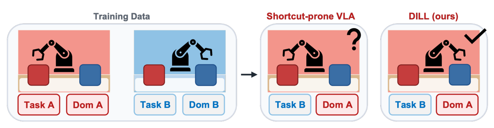
*任务-域混淆下的捷径学习：训练数据里任务与视觉域绑定时，策略用域外观当动作捷径；反事实重组视角后执行关联任务而非指令任务，DILL 用域不变前瞻切断这条路径（论文图 1，p2）。*

## 核心论点：不是「要不要预测未来」，是「预测未来的什么」

论文的信息量集中在这一步重构。未来预测确实是比静态视觉理解更贴近控制的监督信号（要预测任务如何演化，就得捕捉物体配置、任务进度这些决定因素）。但作者指出：**如果预测目标是原始未来观测或纠缠的视觉 latent，模型仍会保留视角/背景这些能帮它预测未来外观、但不决定正确动作的域因素**。

所以问题变成：预测目标应该是**域不变的**——保留控制需要的未来任务结构，压制能当捷径的域特定因素。

## Task-Domain Encoder：双对比 + 高斯解耦

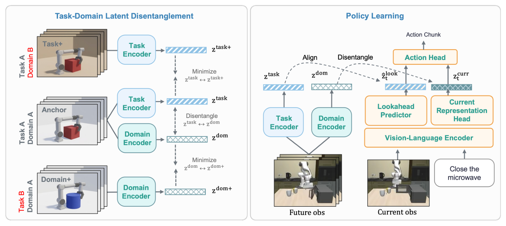
*DILL 总览：左面板学 Task-Domain Encoder（任务/域 latent 的对比与解耦），右面板策略学习（前瞻预测对齐未来任务 latent、当前表征与域 latent 解耦），两路 latent 拼接进动作头（论文图 2，p4）。*

两种正对构造（Eq. 1）：

- **task-positive**：同一观测 chunk 换域（$\eta_1 \ne \eta_2$）——任务编码器应该把两者拉近；
- **domain-positive**：同一域条件、不同 chunk——域编码器应该把两者拉近。

两个独立视频编码器各用同型 InfoNCE（Eq. 3，余弦相似度 + 温度 $\tau$），再加上 **SIGReg 高斯解耦损失**（Eq. 4/5）——作用在拼接 latent $u^{td} = [z^{task}; z^{dom}]$ 上：高斯近似下匹配各向同性高斯会抑制任务与域 latent 间的互协方差，实现近似解耦。这里「作用在拼接上而非各自分别正则」是设计要点。

域变换四族：视角变化（渲染视角/随机裁剪/内参/径向畸变/扭曲）、环境外观（背景替换/光照/颜色）、相机异构（unprocessing/传感器噪声/色彩响应）、视觉退化（模糊/天气/压缩/像素化/损坏）。

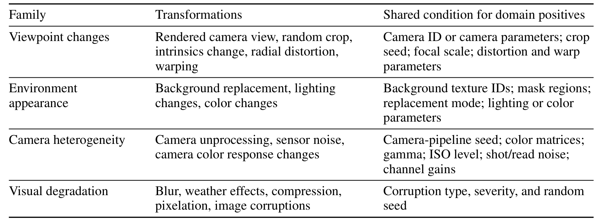
*域变换族明细：四族的变换操作与 domain-positive 共享条件（论文表 4，p15）。*

预训练数据：源轨迹集合 = MimicGen（16 数据集）+ ManiSkill（2）+ OXE 子集（Bridge + Fractal/RT-1），合计 **8,428,719 帧 / 157,661 轨迹 / 20,586 任务**。

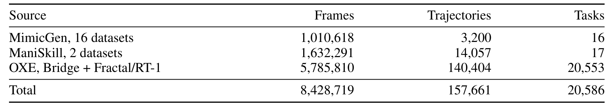
*源轨迹集合统计：三来源的帧数/轨迹数/任务数与总计（论文表 3，p14）。*

## 策略学习与推理

策略侧（Eq. 6-12）：VLM 骨干出图文单元 $H^{vlm}$，两个 head 分别出前瞻 latent $\hat{z}^{look}$ 与当前表征 $z^{curr}$：

- **$L_{look}$**：$\hat{z}^{look}$ 对齐编码器从未来观测 chunk 提取的任务 latent（stop-gradient 正样本，InfoNCE）——策略被迫预测「域不变的未来任务结构」；
- **$L^{curr}_{dis}$**：$z^{curr}$ 与同轨迹域 latent 解耦——当前输入中 discourage 域特定视觉信息；
- **$L_{act}$**：动作块 L1 行为克隆。

$\hat{a}_{t:t+K_a-1} = A_\phi([\hat{z}^{look}; z^{curr}])$——两路 latent 拼接进动作头。**推理期只需要当前观测 + 指令**：编码器整个丢弃，部署零额外成本。

三阶段训练：encoder 预训练（源轨迹集合，LoRA + 投影头）→ 策略预训练（VLM LoRA + 两 head + 动作头）→ 下游微调（LIBERO 或真机演示，同目标）。

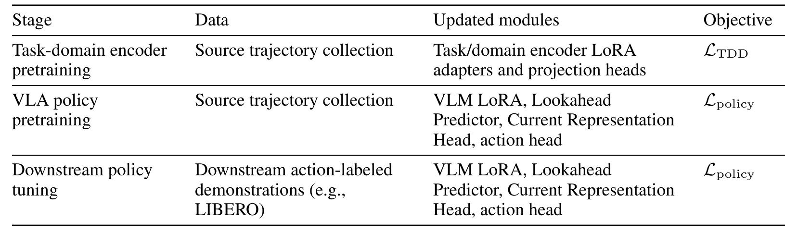
*三阶段训练摘要：各阶段的数据、更新模块与目标函数（论文表 6，p19）。*

策略侧参数预算：Lookahead 167.85M + Current 167.85M + Action 28.48M = **364.18M**。

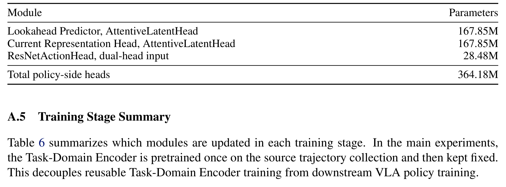
*策略侧 head 参数预算：三个模块的参数量与总计 364.18M（论文表 5，p18）。*

## 受控诊断：捷径度 0.73 → 0.05

LIBERO 捷径诊断的协议设计很干净：训练时 Task-L 只从左侧视角范围观测、Task-R 只从右侧；测试时**对调**——Task-R 在左边界评、Task-L 在右边界评。量两个数：OOD 成功（反事实视角下完成指令任务）与捷径度（执行了视角关联任务组的频率）。

| 变体 | OOD 成功 ↑ | 捷径度 ↓ |
|---|---|---|
| MiniVLA / π0（各自评测） | 0.00 | 0.60-1.00 |
| Base VLA（行为克隆） | 0.00 | 0.73 |
| **Entangled LA**（预测原始视频编码器的未来表征） | 0.00 | 0.65 |
| DILL w/o CH（域不变前瞻、无当前解耦头） | 0.44 | 0.06 |
| **DILL**（完整） | **0.58** | **0.05** |

**Entangled LA 这一行是全文最重要的对照**：架构、增强数据全部匹配，只换预测目标（纠缠 vs 域不变）——朴素未来预测零收益。这直接证明「不变性」而非「前瞻」是起作用的变量。当前表征解耦（CH）的贡献在执行质量（0.44→0.58），捷径度几乎不变（0.06→0.05）。

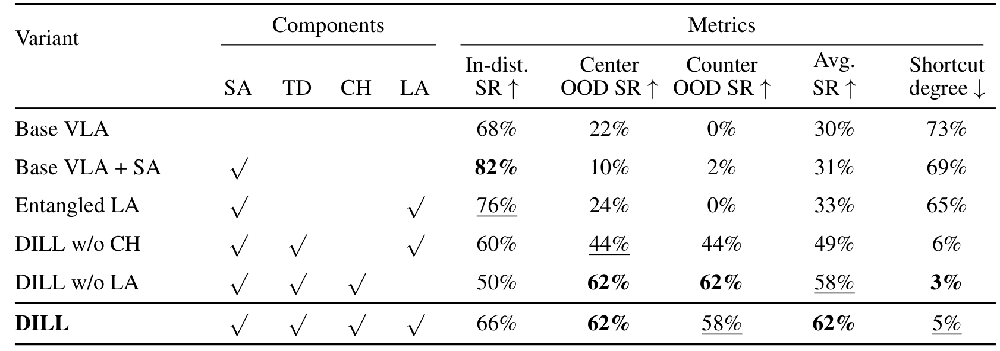
*组件消融：六变体的 SA/TD/CH/LA 组件勾选与五指标（分布内/中心 OOD/反事实 OOD/平均/捷径度）（论文表 8，p21）。*

## LIBERO-Plus 与真机：一致性鲁棒

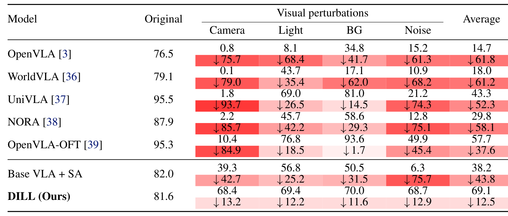
*LIBERO-Plus 视觉扰动零样本评测：每模型第一行为成功率、第二行为相对原始分数的降幅，红底深浅标降幅大小（论文表 1，p7）。*

四视觉类（相机/光照/背景/传感器噪声）零样本评测（训练只见原始 LIBERO 切分）：

| 模型 | Original | Camera | Light | BG | Noise | 平均 | 平均降幅 |
|---|---|---|---|---|---|---|---|
| OpenVLA | 76.5 | 0.8 | 8.1 | 34.8 | 15.2 | 14.7 | ↓61.8 |
| OpenVLA-OFT | 95.3 | 10.4 | 76.8 | 93.6 | 49.9 | 57.7 | ↓37.6 |
| UniVLA | 95.5 | 1.8 | 69.0 | 81.0 | 21.2 | 43.3 | ↓52.3 |
| Base VLA + SA（同源增强） | 82.0 | 39.3 | 56.8 | 50.5 | 6.3 | 38.2 | ↓43.8 |
| **DILL** | 81.6 | **68.4** | **69.4** | **70.0** | **68.7** | **69.1** | **↓12.5** |

三个要点：**相机类外部基线全部 <11%、DILL 68.4**；+SA 控制组匹配原始分数（82.0 vs 81.6）但扰动平均只有 38.2——排除「数据增强暴露」解释；DILL 的原始分数低于 OFT/UniVLA（81.6 vs 95.3/95.5）——**分布内性能换鲁棒性的权衡摆在明面上**。

真机（2 任务捷径诊断 + 3 任务鲁棒）：反事实指令跟随 CTF **29.7±5.4 → 80.2±5.5**、观察捷径度 47.2±4.8 → **0.0**；无扰动 88.9% 下预定义扰动 83.8%、新扰动（cast 阴影/动态背景/前景杂物——encoder 训练没见过的族）82.0%。同协议下无前瞻的 DILL-Current 是 78.2/77.2——**前瞻的收益外推到训练变换族之外**。

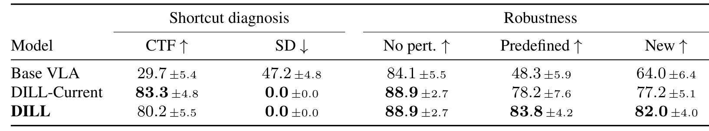
*真机捷径诊断与鲁棒性：CTF/SD 与三类扰动条件，含标准差与加粗（论文表 2，p9）。*

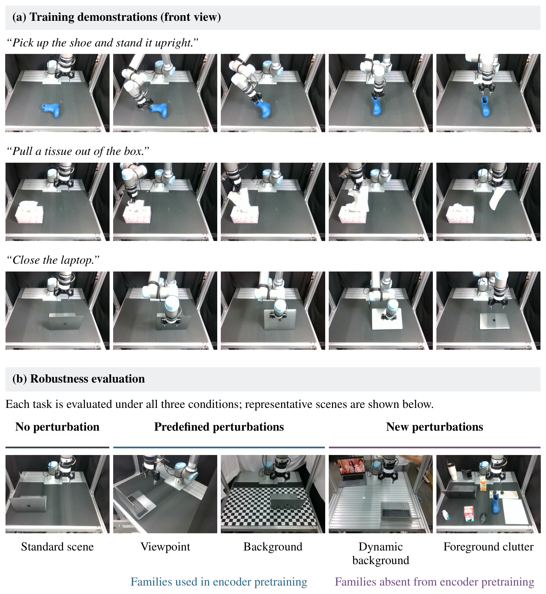
*真机任务与评测条件：训练演示（鞋立放/抽纸巾/合笔记本）与无扰动/预定义/新扰动三类条件实拍（论文图 10，p28）。*

## latent 空间诊断

余弦相似度分布（未见任务-域组合构造对）：

| 空间 | 任务对 μ | 域对 μ |
|---|---|---|
| task encoder | **0.88** | 0.35 |
| domain encoder | 0.34 | **0.94** |
| 最终 VLA latent（进动作头） | **0.94** | 0.55 |

任务编码器按任务聚类、域编码器按域聚类、**最终动作条件 latent 由任务一致性主导**——表征结构跟着监督目标走，这是「捷径缓解来自表征重塑」的直接证据。

## 边界与局限

作者明示（我核对过原文）：

1. **只覆盖视觉域捷径**——初始状态偏置、语言模板、任务频率、示教者风格等非视觉捷径不在框架内，需要额外定义 nuisance 因子或自动化发现目标。
2. **鲁棒-分布内权衡**：域依赖线索在训练分布内往往高度可预测；同一视觉因素跨场景角色可能反转（背景在某任务是捷径、在另一任务是任务相关配置）——过度不变性会压制有用线索，作者呼吁上下文自适应目标。
3. SIGReg 基于高斯近似——「近似解耦」而非保证独立。

我的补充：真机样本量小（论文表 2，标准差 ±4-7.6）；「新扰动」族的泛化证据只有 3 个任务；LIBERO-Plus 的布局类 DILL 55.1/↓26.5 是四类中最弱的一列——**几何布局类扰动比外观类难**，这个不对称值得注意。

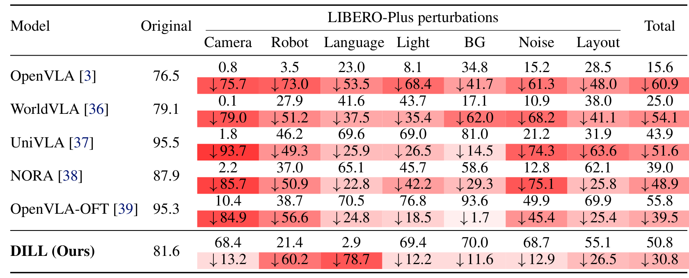
*LIBERO-Plus 完整细分：七类扰动列（相机/机器人/语言/光照/背景/噪声/布局）逐模型成功率与降幅（论文表 9，p22）。*

## 拿走什么

- **对构造可直接搬**：task-positive（同 chunk 变域）/ domain-positive（同域异 chunk）双对比 + 拼接 latent 高斯解耦——任何需要域解耦的表征训练都能用。
- **反事实任务-视角诊断**：训练锁关联、测试对调 + 捷径度指标——量化「策略到底在跟谁走」的可复用评测设计。
- **消融设计范式**：先造 Entangled LA 证明朴素前瞻无效，再引入不变性目标——变量隔离干净。
- **部署零成本**：训练期监督、推理期丢弃编码器——端侧友好。
- **报告格式**：降幅标注（红底梯度）呈现鲁棒性比单列成功率直观得多。

**尚不能确定**：自适应目标能否消除原始分数的权衡；HSIC 等更一般依赖度量替代 SIGReg 的增益；与 OFT 类架构改进的正交性（叠加是否双收益）。
