# EWAM: Emergent Depth-Wise Specialization in a Unified Embodied Model -- From Semantic Understanding through Visual Foresight to Action

> **EWAM: Emergent Depth-Wise Specialization in a Unified Embodied Model -- From Semantic Understanding through Visual Foresight to Action**
> Hao Wang 等 24 人（ Xiaodan Liang 组等）
> [arXiv:2609.39973v1](https://arxiv.org/abs/2609.39973)（2026-09-30 15:35 UTC 提交）· cs.RO
> 代码：[Wanghao00pro/EWAM](https://github.com/Wanghao00pro/EWAM) · 权重：[HaoWang00/EWAM](https://huggingface.co/HaoWang00/EWAM)（Apache-2.0）· 项目页：[wanghao00pro.github.io/EWAM-project](https://wanghao00pro.github.io/EWAM-project/)

这篇论文从一个精确的观察出发：**把 VLA 和 WAM 拼在一起，动作计算往往还是压在单一专家上**。π0.5 的动作注意力从头到尾锁在 VLM 单元上（VLA 式计算）；Fast-WAM 锁在视频单元上（视觉动态居中）；即便是外挂冻结 VLM 的多专家模型 Motus，动作注意力仍被理解专家主导。作者的问题因此不是「怎么再加一个模块」，而是：**真统一之后，三种计算会继续互相竞争，还是长出像人类有目的行为那样的有序推进——先理解任务、再想象接下来会发生什么、最后形成动作？**

## 架构：动作流是唯一的整合界面

EWAM 包含三个层级对齐的专家：

- **VL 专家**（Qwen3-VL-2B 初始化）：编码指令 + 当前图像为语义单元 $h^L$；
- **视频专家**（Wan2.2-TI2V-5B 初始化）：处理条件帧 latent + 噪声未来视频 latent $h^V$；
- **动作专家**：把噪声动作块嵌入 $h^A$。

关键是注意力非对称掩码：

$$A \leftarrow \{V, A, L\},\quad V \leftarrow V,\quad L \leftarrow L$$

动作查询可以读语义、预测视觉与动作三类键；视频与 VL 查询各自封闭、互不读取、也不读动作流。**动作流因此成为唯一的跨模态读取点**——两个感知专家的预训练角色被保住，同时动作注意力本身成为「谁在读什么」的明确定义量。实现上三路查询拼成一次 masked-attention，各流保留自己的归一化与投影参数。

层对齐处理一个不对称性：Qwen3-VL 有 28 层、统一网络 30 块。第 $l$ 块的 VL 输入取「层匹配的 Qwen3-VL 特征与已积累统一深度状态的均值」（Eq. 4，残差合并）；视频流无需对齐（30 块即 Wan2.2 原生深度）。

## 训练：双模态联合 flow matching

视频与动作各自独立采样噪声级，联合回归速度场（Eq. 1/5），条件帧 latent 固定、未来视频与动作 latent 同步更新。**未来视频与动作在同一前向里并发去噪**——演化的未来视频特征直接参与动作计算，而不是先单独生成一段视频再喂给策略。这是与「管道式」两段架构的本质区别。

两阶段训练：大规模预训练（未来预测 + 动作生成双目标）→ 任务后训练（保留双目标，新增子任务相位监督）。后训练模型输出四元组 $(\hat{v}_{t+1:t+H}, \hat{a}_{t:t+K-1}, \hat{p}_t, \hat{y}_t)$：未来视频、动作块、当前活跃子任务 $\hat{y}_t$ 与其归一化相位指数 $\hat{p}_t$。

## 机制流程

*EWAM 总览：三路输入经层级对齐统一 Transformer，动作查询经非对称联合注意力读取语义、当前视觉、预测未来与动作四类信息，产出子任务、相位、动作块与未来视频四路输出（论文图 2，p6）。*

1. **输入**：指令 + 当前图像 → VL 流（文本与图像单元）；条件帧 + 噪声未来 latent → 视频流（VAE 编码）；噪声动作块 → 动作流。
2. **逐层非对称注意力**：动作查询读三源；VL 与视频流各自封闭自注意。
3. **四路输出**：动作流末端出子任务（轻量自回归解码器，Eq. 7 跨注意记忆 = 动作表示与 VL 单元的线性投影拼接）、相位进度条、动作块；视频流出预测未来帧。

子任务相位监督的设计值得注意：$\hat{p}_t$ 来自同一子任务标注（相位在划分中的位置），**不是独立定义的进度目标**——它教策略「识别并完成当前活跃子任务」，而不是外挂一个执行规划的模块。

## 涌现的深度分工：三线证据

这是论文的核心贡献，证据按强度递进：

### 观察：分工跨任务复现、跨去噪步稳定

无任何逐层监督时，动作查询的注意力来源随深度切换：浅层（0-9）主要看 VL 特征、中层（10-19）转向预测未来帧、深层（20-29）动作自注意力主导。

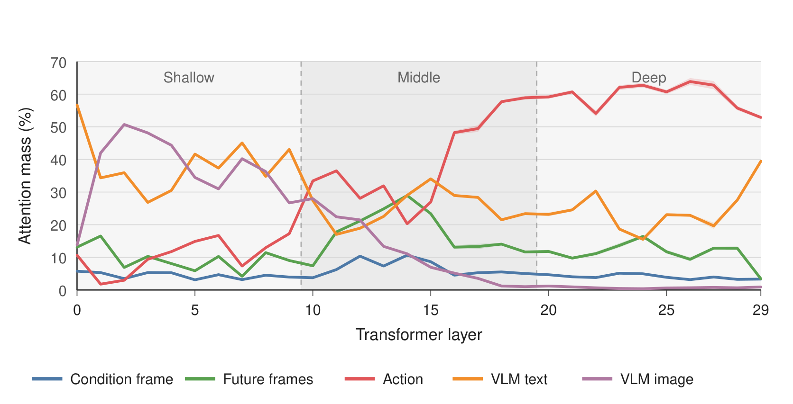
*跨任务复现：30 层注意力质量按五源分布，浅层 VLM 图文主导、深层动作自注意力占优（论文图 12，p35）。*

Table 14（p35）给出定量版本：浅层 VL 质量 75.38% [95% CI 75.24-75.51]、中层动作 39.14% 但未来视频 24.31% 崛起、深层动作 59.46%；50 任务中 50/50 复现「浅层 VL 最大」「深层动作最大」，去噪步间稳定性均值 r = 0.998（最低 0.995）。

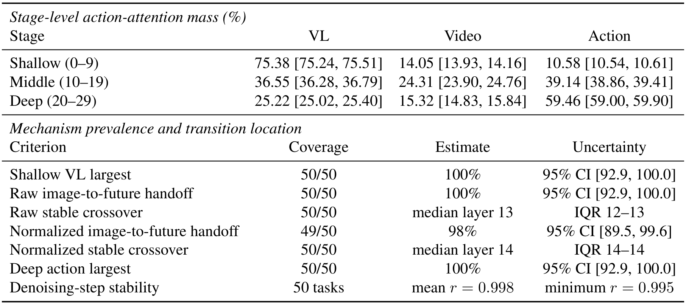
*跨任务复现的定量版：阶段级注意力质量（含 95% CI）与七项机制普遍性判据的覆盖率/估计/不确定性（论文表 14，p35）。*

### 发育：checkpoint 追踪显示分工是学出来的

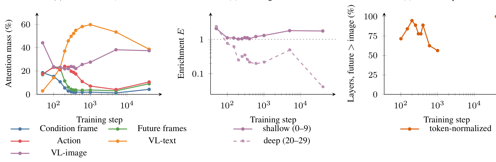
*训练动力学：150 步时未来帧质量仅在第 8 层超过 VL 图像；40,000 步时第 13 层起全面超越——分工随训练形成（论文图 11，p34）。*

训练早期（150 步）原始未来帧-VL 图像质量差仅在层 8 出现正交叉；40K 步时层 13 起每层为正。这排除了「架构硬编码」的解释。

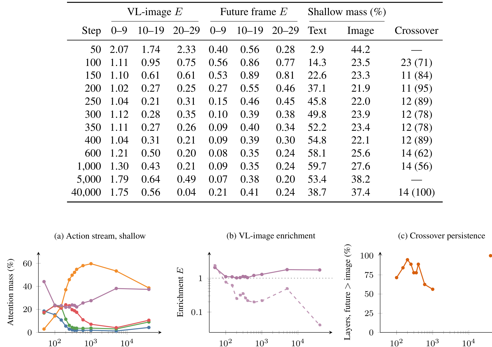
*checkpoint 演化数值：VL 图像与未来帧的分层富集度、浅层质量分布与交叉层位置随训练步变化（论文表 13，p34）。*

### 因果：分层屏蔽 + 反事实注入

**固定 checkpoint 推理屏蔽**（RoboTwin Randomized 50 任务 × 100 episodes、匹配种子）：相对 92.80% 基线——

| 干预 | 成功率 | 变化 |
|---|---|---|
| 屏蔽浅层（0-9）全部视频键 | 91.98% | −0.82 |
| 屏蔽浅层 VL 键 | 76.53% | **−16.27** |
| 屏蔽中层条件帧键 | 81.40% | −11.40 |
| **屏蔽中层未来帧键** | **3.55%** | **−89.25** |
| 屏蔽中层全部视频键 | 0.25% | −92.55 |
| 屏蔽深层全部视频键 | 65.82% | −26.98 |

深度与来源双特异性：浅层几乎不依赖视频但重 VL；中层依赖集中于**预测未来表征**（条件帧单独屏蔽只掉 11.4）；深层保留部分视频依赖。训练时结构消融（无预训练）方向一致：去浅层 VL 或中层视频访问掉到 78%，深层限动作无损（83%）。

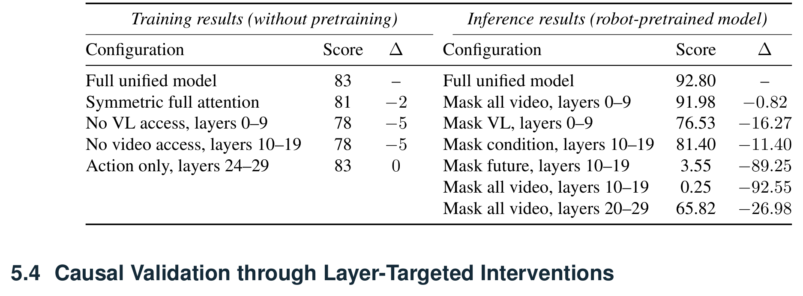
*因果验证双面板：左侧为独立训练的结构消融（无预训练），右侧为固定预训练 checkpoint 的推理期分层屏蔽（论文表 1，p10）。*

**反事实未来特征注入**补上内容敏感性：屏蔽只能证明「通路存在时网络依赖它」，塌陷可能只是网络预期该通路在。作者缓存成功 donor rollout（种子 100）在层 10-19 前三次策略调用的未来帧键值，注入到五个目标 rollout（种子 43-47）：**总体成功率 25/25 → 4/25**。最有解释力的是 ADJUST BOTTLE：瓶口朝左该用右臂、朝右该用左臂；注入让全部五个目标跟随 donor 的右臂选择——左朝向目标两例因第一次抓取偏移、注入停止后二次定位成功；右朝向三例左臂策略被冲突覆盖、全部失败。**中间层未来表征能操纵空间目标选择与手臂选择**，且注入结束后目标条件控制可恢复。

## 策略性能：四套基准

预训练双轨：机器人侧 300K 跨本体轨迹（约 1800 小时）；人类侧约 2084 小时自我中心视频（VITRA-1M / EgoDex / Xperience）。RoboTwin 采用三种评测协议（标准清洁 / 标准随机化 / 清洁到随机），每协议 50 任务 × 100 评测：

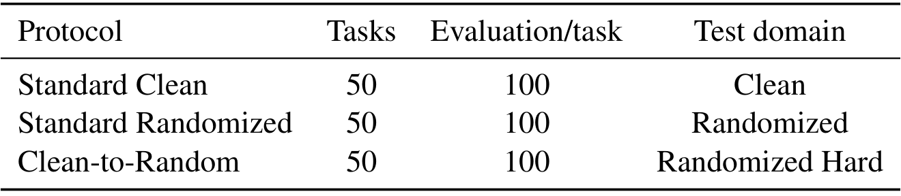
*RoboTwin 三评测协议：任务数、每任务评测数与测试域（论文表 16，p39）。*

| 基准 | EWAM | 最强对手 |
|---|---|---|
| RoboTwin C2R | C2C 82.2 / **C2R 72.1** / 平均 77.2 | GigaBrain-0.7（67.9 C2R）、π0.5（46.0） |
| RoboTwin in-domain | 93.0 / 92.8 / **92.9** | ACE-Ego-0 90.9（VLA）、LingBot-VA 92.2（WAM）、WLA-0 91.5（混合） |
| LIBERO | 98.6/99.8/98.6/98.2 / **98.8** | ABot-M0 98.6、WLA-0 98.6 |

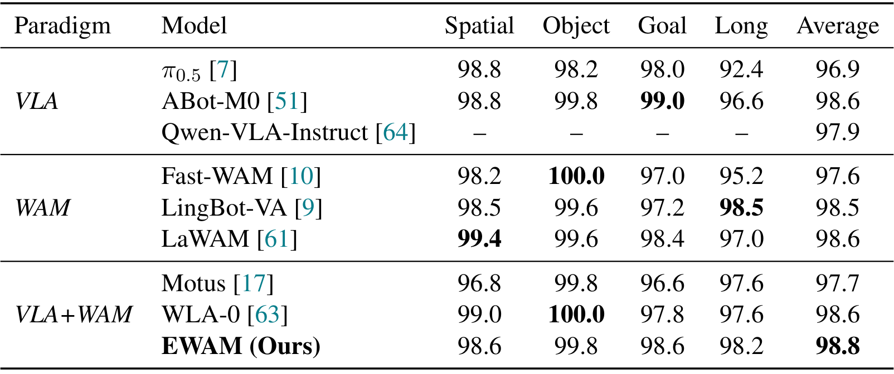
*LIBERO 四套件主表：三范式 9 模型对比，EWAM 平均 98.8 最高（论文表 6，p19）。*

| 真机（Franka/Dobot/G1-D 七任务） | 每任务最高 | 对 π0.5 六胜一平 |

作者诚实标注：**C2R 与域内对比横跨不同预训练数据，不能单独归因注意力架构**。域内评测的清洁-随机化差距只有 0.2 是一致性的直接证据。

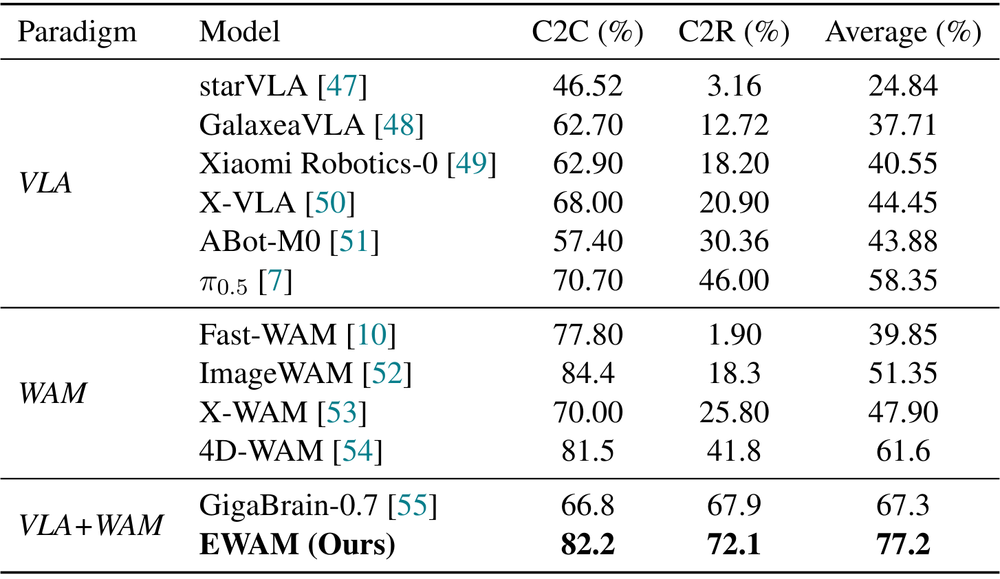
*RoboTwin clean-to-random 主表：三范式 12 模型对比，EWAM 的 C2R 72.1 与平均 77.2 全场最高（论文表 4，p17）。*

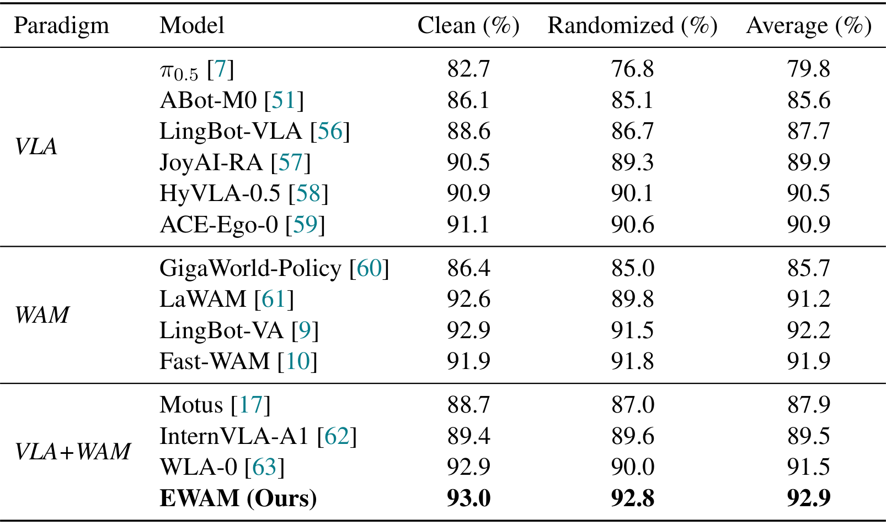
*RoboTwin in-domain 主表：14 模型三范式分组，EWAM 92.9 平均领先各范式最强 0.7-2.0（论文表 5，p18）。*

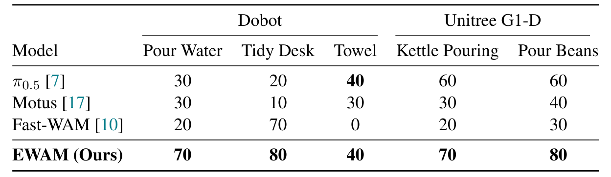
*Dobot 双臂与 G1-D 人形真机：五任务上 EWAM 全部最高（论文表 8，p18）。*

真机失败定位（G1-D pour-beans，40 试验）：抓取 39 成功、搬运放回 40、**对齐 29、倒水 28**——失败集中在倒水对齐段，且两例无扰动试验也洒溢：精度瓶颈跨条件存在，来源（感知/动作预测/控制器跟踪）论文未定。

*G1-D 倒水的阶段化泛化：单因素变化各 10 次试验，S/P/F 标注完成/带错完成/彻底失败（论文表 9，p19）。*

## 人类自我中心数据的两条价值线

**预训练线**：把人类腕部运动表达到锚定相机坐标系（Eq. 13-15：腕部位姿经 $R_{ce}$ 变换进相机系，16 维动作 = 双手各平移 + 轴角 + 两个保留维，validity mask 排除无效维）。三个语料的相机位姿来源不同（VITRA-1M 外参反转 / EgoDex 直接存 / Xperience SLAM 体位姿 × 标定），但汇入同一计算。**held-out 本体（Aloha-Agilex-2）迁移 40.1% → 66.9%**（120K 机器人训练步）。

**共训线**：60 机器人集固定，加 30-1000 条 egocentric 集：**+30 集即达 20%（= 90 集纯机器人训练），+1000 集从 10% 升到 60% 不饱和**。同混合比下人类预训练初始化把真机成功率 40%→60%，训练损失 0.068→0.034、held-out 动作误差 0.0231→0.0164。

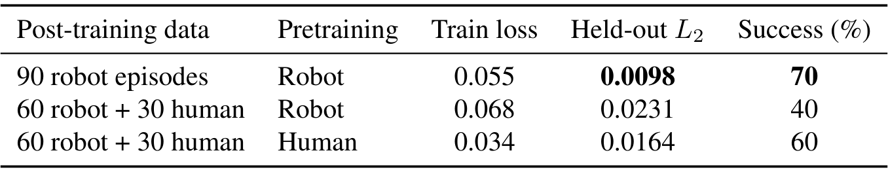
*G1-D 倒水的预训练与共训对照：90 机器人集参考行达 70%，但改变了数据组成；同混合比下人类预训练 60% 对机器人预训练 40%（论文表 11，p21）。*

采集硬件（Fig. 5）：Lumos Ego 头戴（鱼眼 RGB + ToF + SLAM）+ 双 VIVE Tracker 3.0 腕部 6-DoF；HaWoR 估腕部位姿、MANO 解码手指几何、SAM 3 掩码 + L-K 光流传播推抓取时机、中位拇指-食指中点定 TCP 交互点。

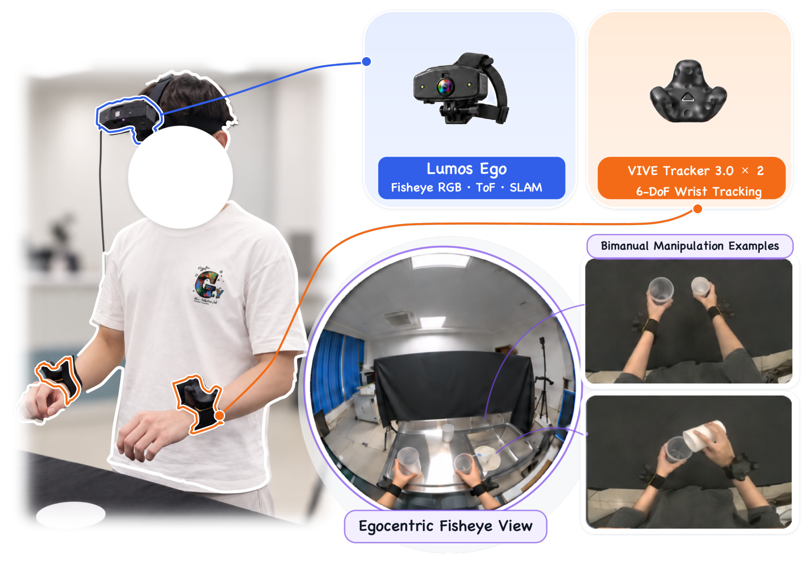
*自我中心采集系统：Lumos Ego 头戴记录鱼眼 RGB、ToF 与相机运动，双腕 VIVE Tracker 提供度量级 6-DoF 腕部追踪（论文图 5，p13）。*

## 长时程与延迟：两个工程向结论

**子任务相位监督**：三个指令条件化方块任务全提升——ranking 83.5→91.0、stacking 44.5→58.5、最难组合 ranking&stacking **1.5→16.0**；G1-D 双篮排序平均完成 1.0/4 → 2.2/4。收益来自训练信号（识别当前活跃子任务）而非外挂规划器。

**推理延迟**：5 步去噪 258 ms（Motus 901 ms），但慢于 π0.5（1.9 ms）、Xiaomi Robotics-1、Fast-WAM（37.1 ms）。注意基线用随机初始化权重——这是执行成本对比而非真实策略对比。视界余量：时间步长 4、16 动作块名义视界 2.13 s，258 ms 占 12%，配合实时分块（生成新块同时执行旧块、用剩余动作约束连续性）。

## 边界与局限

作者明示与我的核对：

1. **预训练数据不同**——C2R/in-domain 对比不隔离架构贡献（作者原话写进 7.2）。
2. **真机精度瓶颈**跨条件存在（倒水对齐），来源未定——不归因单一模块。
3. 延迟慢于轻量基线；FP8 与 float16 实验未超 compiled bfloat16。
4. 相位指数 $\hat{p}_t$ 来自同一子任务标注——不是独立的进度监督。

全双向掩码的补充对照（Table 15，p38）：对称版浅层 VL 图像富集度 0.81 vs 非对称 1.75、深层 0.67 vs 0.04——**非对称掩码把 VL 图像的使用集中在浅层**，双向版则全程平摊；VL 查询在双向版下会读视频与动作（橙线最高约 90%），非对称版下 VL 只读自身。

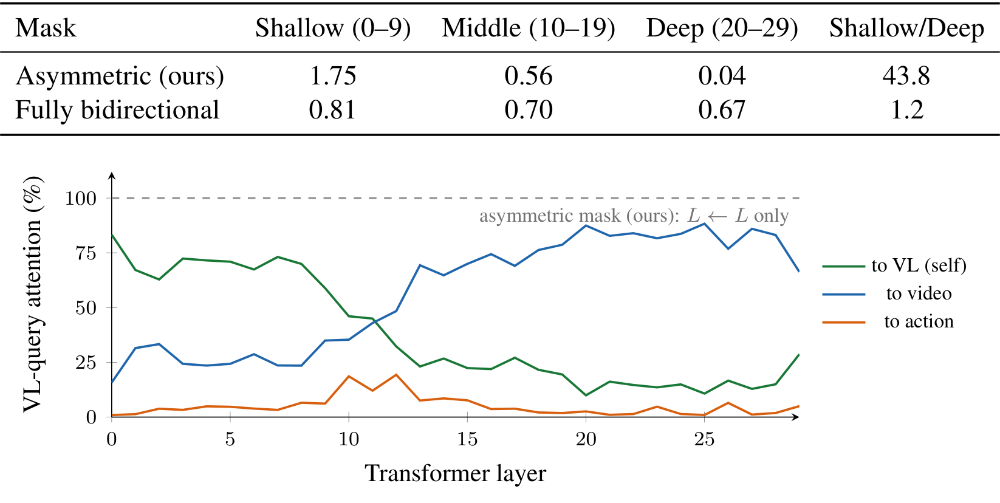
*两种掩码下 VL 图像的深度差异化使用（上表）与 VL 查询注意力分布（下图）：非对称版 VL 只读自身，双向版 VL 会读视频与动作（论文表 15，p38）。*

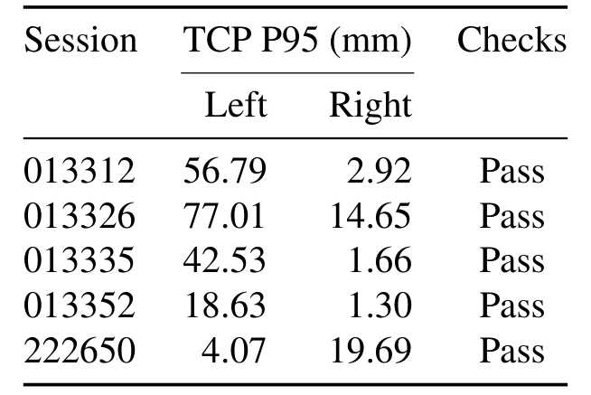
*retargeted 演示的运动学检查：五个 session 的 TCP P95 位置误差（左/右手）与 Pass 判定（论文表 3，p15）。*

我的补充判断：反事实注入只覆盖层 10-19 与前三次策略调用——其它层区间与时间窗的敏感性未测；对称全注意力的对照只在无预训练设定下做（81% vs 83%），**预训练后的对称版注意力路由如何演化是最直接的缺失对照**；egocentric 三语料混合未拆分各自贡献。

## 拿走什么

- **动作注意力路由当诊断工具**：把 action-query attention mass 按深度分解，一篇论文区分了四类范式（VLA/WAM/多专家/真统一）——任何做统一模型的人都可以直接搬这套分析。
- **因果验证协议**：固定 checkpoint 分层屏蔽（必要性）+ donor 反事实注入（内容敏感性）——「模型依赖某中间表征」的断言从此有可复用的检验模板。
- **camera-relative 动作空间**：不归一化尺度、validity mask 掩无效维——人类数据接进机器人预训练的通用接口。
- **配比结论**：+30 egocentric 集抵 30 机器人集——数据稀缺场景的直接参考。
- **训练信号化长时程**：把「当前活跃子任务 + 相位」当训练目标而非外挂规划。

**尚不能确定**：深度分工是否为非对称掩码的必然产物——预训练后的对称全注意力版没有测；以及中间层未来帧依赖能否反过来当部署期的失败预警信号（论文未探索这个方向）。
