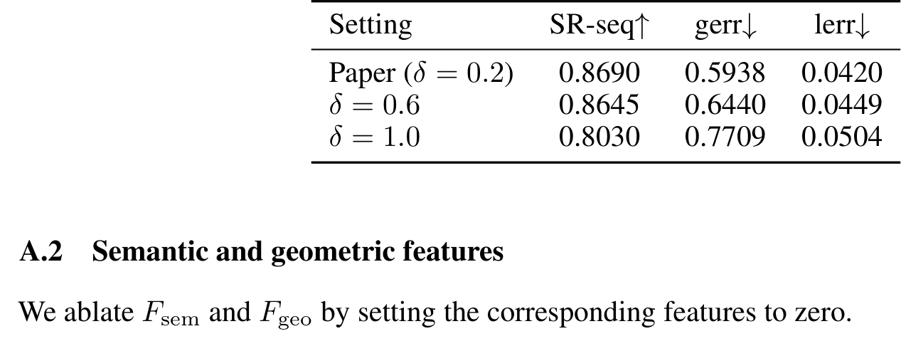
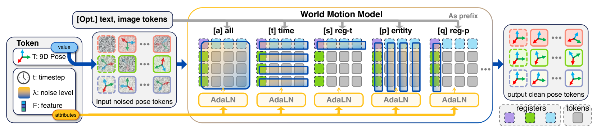
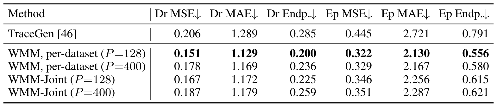
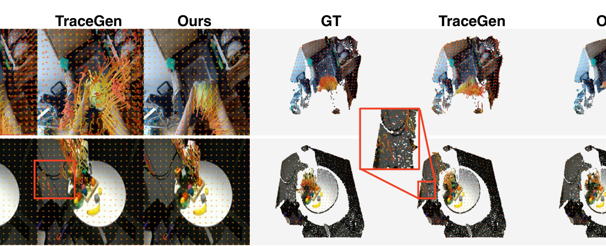
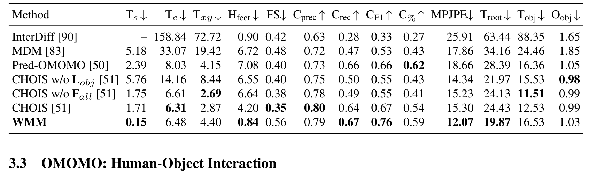
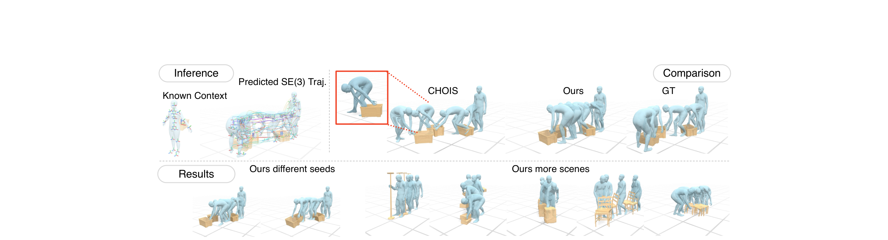
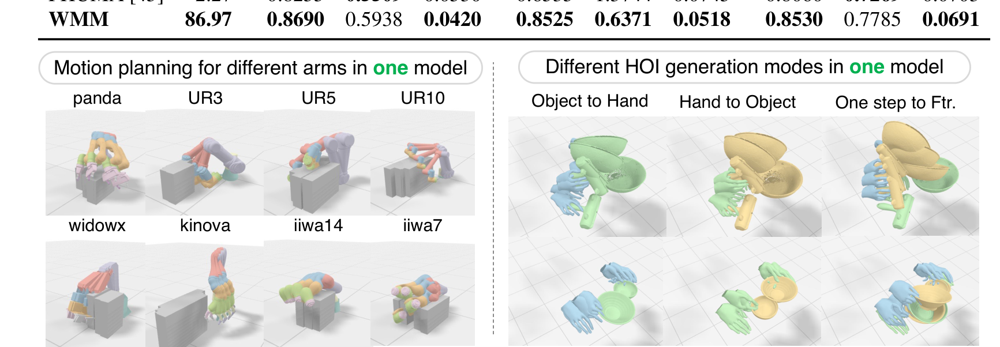

# World Motion Models: Flexible Sequence Modeling of SE(3) Trajectories

> **World Motion Models: Flexible Sequence Modeling of SE(3) Trajectories**
> Jiahui Lei · Qianqian Wang · Trevor Darrell · Angjoo Kanazawa（UC Berkeley 线）
> NeurIPS 2026（Spotlight）· [arXiv:2610.01742v1](https://arxiv.org/abs/2610.01742)（2026-10-01 14:13 UTC 提交）· cs.RO 交叉 cs.CV
> 代码：[JiahuiLei/WorldMotionModels](https://github.com/JiahuiLei/WorldMotionModels)（2026-10-02 建）· 项目页：[jiahuilei.com/projects/wmm](https://jiahuilei.com/projects/wmm/)

这篇论文回答的问题很直接：**如果要给动态 3D 世界学一个生成先验，最基本的"语言"应该是什么？** 作者的选择是稀疏刚体 SE(3) 位姿轨迹——一组"何时、何地、什么姿态"的时间序列，然后在这一语言上用逐单元噪声级的 flow matching 训一个模型，之后策略、世界模型、运动补全、跨本体 retargeting 全都变成同一个网络上的不同掩码。

## 为什么不用视频、不用点轨迹

论文对三条既有路线的批评是准确的出发点：

- **视频世界模型**把 3D 运动纠缠进颜色变化——外观、光照、视角全都混在像素里，动态是隐式的——论文原话是「通过屏幕上的颜色变化隐式地捕捉动态」。
- **点轨迹**（TraceGen 一系的 R³ 轨迹）丢了姿态，而且要稠密——论文的观察是运动本质上是低秩的：一个场景由少量"特征刚体轨迹"驱动，稠密形变是这些基的局部组合。
- **类别特化表征**（SMPL、MANO、URDF）各有各的参数空间，无法泛化到非结构化场景。

SE(3) 轨迹是三者的折中点：比视频显式、比点轨迹稀疏且带姿态、比类别表征无结构假设。人体是几十个关节位姿、刚体对象是单个运动坐标系、相机天然是一条 SE(3) 轨迹、机器人 link 各是一条——**每个实体被平等地当成一个"位姿代理"**。

我的理解：这个"无类别结构假设"是这篇工作最有张力的设计。它换来的是统一性，付出的代价后面会看到——非刚体大形变（一般线性局部运动：缩放、剪切）明确不覆盖，作者留给未来工作。

## 表征：每个时间步一个位姿单元

基本单元是位姿单元 $(T^{(l)}, F)$：位姿 $T^{(l)} \in SE(3)$ 管"哪里"，特征 $F \in \mathbb{R}^D$ 管"什么"。三个值得注意的细节：

**9 维位姿参数化。** 位姿写成三个点构成的 9 维向量：

$$T^{(l)} = [x,\ x + \delta r_1,\ x + \delta r_2] \in \mathbb{R}^9$$

其中 $x$ 是位置，$(r_1, r_2)$ 是 6D 旋转参数化（Zhou et al.）的前两列，$\delta = 0.2$ 是固定小标量。这个构造的动机（App. A.1）：把旋转的单位向量对折叠进与平移同一个 $\mathbb{R}^3$ 空间，让原始扩散信号归一化到标准正态附近——训练更稳。附录的消融显示 $\delta$ 从 0.2 放大到 0.6/1.0 时 SR-seq 从 0.8690 降到 0.8645/0.8030，gerr 单调恶化——这个选择不是任意的。

*humanoid retargeting 上的 δ 扫描：SR-seq / gerr / lerr 三指标随 δ 变化，δ=0.2 全面最优（论文表 7，p18）。*

**特征 $F = [f_{\mathrm{sem}}; f_{\mathrm{geo}}]$。** 语义部分是视频提示实体的 DINO 像素特征，或粗类别（关节 vs 物体）的可学习嵌入；几何部分是 PointNet 在局部点云上的描述子（有局部云时用，视频点提示时省略）。

**上下文单元前缀。** 每条轨迹扩展一个虚拟时间步前缀 $\tilde{T}^{(a)}, \tilde{T}^{(b)}, \ldots$，带独立可学习位置嵌入。这一步解决的是非顺序条件：Language Table 里「距离 rollout 窗口很远的抽象目标状态」、retargeting 里「人-机器人配对示例帧」都不在因果时间轴上，但参与训练与推理的方式与真实轨迹单元完全一致。

## 训练：为什么一个损失就够了

Flow matching 部分继承 Diffusion Forcing 与离散扩散 LLM 的思想，落到 SE(3) 位姿场：

**前向过程**对每个位姿单元独立采噪声级 $\lambda_{i,l} \sim U[0,1]$（i.i.d.），

$$T^{(l)}_{\lambda_{i,l}} = (1 - \lambda_{i,l}) T^{(l)} + \lambda_{i,l} \epsilon_{i,l}$$

**速度目标** $v^\star_{i,l} = \epsilon_{i,l} - T^{(l)}_i$，损失逐单元计算、只对有真值标签的单元求和。

关键论证（作者对「为什么这一个目标就足够」的回答）：随机的 $\Lambda$ 场把各单元划分成近清洁（类似观测）与近噪声（类似目标）两侧，**每个条件反向过程都被覆盖，确定性 observed/target 划分是极限情形**。推理时固定 $\Lambda$（观测侧 $\lambda = 0$、目标侧 $\lambda = 1$）就采样出选定的边际分布。噪声调度还可以偏向部署模式——历史更多小 $\lambda$、未来更多大 $\lambda$，锐化预测同时保住训练覆盖。

## 推理：mask 即任务

这是全文最漂亮的部分。一个训练好的 WMM 是一整族条件采样器，任务由逐单元的掩码定义：

| Mask 模式 | 划分方式 | 得到什么 |
|---|---|---|
| (i) 未来预测 / 策略 | $\lambda = 0$ 当 $l \le l_0$ | 纯状态实体 → 未来预测；含动作实体 → **机器人策略** |
| (ii) 动作条件动力学 | 动作实体已知、未来状态未知 | 学习到的正向模拟器，供 MPC 用 |
| (iii) 运动补全 | 稀疏关键帧已知、其余目标 | 运动规划与插值 |
| (iv) Retargeting / 逆动力学 | **按实体**划分 $\lambda$ | $O$ = 人体 → 跨本体 retargeting；$O$ = 状态实体 → 逆动力学 |

两个实用细节：其一，观测单元在推理时设 $\lambda = 0.05$ 而非精确 0——观测变成「强提示」，积分器沿速度场轻微修正它，对观测噪声鲁棒。其二，RoPE 天然帮助泛化超出训练时的序列数，配合 App. B.2 的简单推理期算法可以做超出训练计数的密集轨迹生成。

## 机制流程

*WMM 网络架构：五类分解式注意力覆盖 register 填充后的单元网格，逐单元 AdaLN 由 λ 与属性条件化（论文图 3，p5）。*

整张图的执行顺序（对应 Sec 2.4）：

1. **输入**：$M \times N$ 的单元网格（$M$ 个实体 × $N$ 个时间步，位姿张量形状 $M \times N \times 9$），缺失观测的单元钉在 $\lambda = 1$（纯噪声）。
2. **Padding**：三块可学习 register（reg-t、reg-p 等沿两条轴的纯 register 块）。
3. **逐块执行五类分解式注意力**：[a] all（全局）、[t] time（按时间轴）、[p] entity（按实体轴）、[s]/[q]（两条轴上的 register-only 对应物）——这种轴向分解让 12K 单元的场景（30 帧 × 400 轨迹）算得动。
4. **逐单元 AdaLN**：$\lambda$ 的正弦嵌入、特征 $F$ 与辅助单元的池化表示，经宽 FFN 映到每块的缩放/平移参数。
5. **输出**：清洁位姿单元；文本/图像单元作为注意力前缀挂在外面。

**缺失观测的处理**值得单独说：真实数据有遮挡、截断、追踪丢失——无效时间步不能简单 mask 掉（推理时缺失 mask 未知），所以钉 $\lambda = 1$ 让它继续参与注意力，损失只对有标签的单元求和。这是训练期见过全噪声单元的自然结果，不需要额外机制。

## 六类应用：换 mask 不换网络

### 策略与 MPC（Language Table）

实体集 = 每个方块的 6D 位姿 + 末端执行器状态与动作目标；上下文单元配置为成功轨迹的最终帧。**macro-average 87.2%**（B2B 90.0 / B2AL 76.0 / B2BRL 80.0 / B2RL 90.0 / Sep 100.0），超过 LCB 的 80.0 与 ActionVLA 的 76.8。

WMM 还能当**可微世界模型**用：对绝对位置指令任务（B2B/B2AL），给定生成的目标状态，梯度 MPC 优化预测动作以最大化"动作块最终帧与目标状态的相似度"。Table 2：MPC 同时提高成功率与缩短达成步数（B2B 90.0→100.0，中位步数 73.0→68.5）。混合采样与梯度是 App. B.3 的完整流程。

### 场景未来预测（TraceGen）

单 RGB-D 帧 + 指令 → 400 关键点 × 32 步运动。**全部六列指标最优**：

| 方法 | Dr MSE↓ | Dr MAE↓ | Dr Endp↓ | Ep MSE↓ | Ep MAE↓ | Ep Endp↓ |
|---|---|---|---|---|---|---|
| TraceGen | 0.206 | 1.289 | 0.285 | 0.445 | 2.721 | 0.791 |
| **WMM (P=128)** | **0.151** | **1.129** | **0.200** | **0.322** | **2.130** | **0.556** |
| WMM (P=400) | 0.178 | 1.169 | 0.236 | 0.329 | 2.167 | 0.580 |
| WMM-Joint (P=128) | 0.167 | 1.172 | 0.225 | 0.346 | 2.256 | 0.615 |

（×100 尺度，Table 3）

*TraceGen 基准：Droid 与 EpicKitchen 测试切分上的三维轨迹指标对比，WMM（P=128）全部六列最优（论文表 3，p7）。*

*TraceGen 定性对比：WMM 与 TraceGen 的轨迹叠加渲染，红框放大标注挑战区域，Ours 的重建更贴近 GT 点云（论文图 5，p7）。*

两个反直觉发现：**P=128（训练时只并行看 128 条随机采样轨迹）赢了 P=400**——作者假设随机子采样防过拟合；训练只见过 128 并行，推理直接外推全部 400 条。Joint 训练（Droid+EpicKitchen 联合）可行但低于 per-dataset——跨域统一留给未来。

### 人-物交互合成（OMOMO）

CHOIS 协议、13 个指标。WMM 在 $T_s$（0.15，比次优好一个数量级）、$H_{feet}$、$C_{rec}$、$C_{F1}$、MPJPE、$T_{root}$ 六项最优；参数量 438.8M vs TraceGen 674.6M。CHOIS 会产出人-物穿插的不合理预测，WMM 保持合理性且能生成多样动作（Fig. 6）。

*OMOMO 人-物交互：CHOIS 协议下 13 项指标对比，WMM 在 T_s、H_feet、C_rec、C_F1、MPJPE、T_root 六项最优（论文表 4，p8）。*

*OMOMO 定性对比：已知上下文与预测 SE(3) 轨迹，与 CHOIS 及 GT 逐帧对照，另附不同种子与更多场景的扩展（论文图 6，p8）。*

### Human-to-Humanoid Retargeting

SMPL 人体 → Unitree G1 轨迹，三种输入设定（clean 30FPS / 3FPS 稀疏关键帧补全 / 每帧 σ=0.1 噪声）**共用同一个 checkpoint**。对比对象很说明问题：GMR 快（35 FPS）但质量有限，PHUMA 质量高但离线慢（2.27 FPS）；WMM **86.97 FPS** 且三设定的 SR-seq 全部最高（clean 0.8690）。下游用 TWIST 低层控制器在物理仿真里滚动验证。Fig. 7 还展示了从单目真实视频直接 retarget 并控制的例子。

*更多应用：单一模型完成 8 种机械臂的运动规划与多种已知-未知模式的手物交互生成（论文图 8，p9）。*

### 更多应用

一个模型覆盖 8 种机械臂（panda/UR3/UR5/UR10/widowx/kinova/iiwa14/iiwa7）的首末点运动规划，以及 TACO 上多种已知-未知模式的手物交互生成——"flexible conditioning"的直观展示。

## 消融：三个架构要素谁在扛

| 消融 | 结果 |
|---|---|
| 去 AdaLN | B2B 掉 6pp，但仍能学出可用策略 |
| **去逐单元噪声（同步噪声 + 引导条件化）** | **策略模式零成功**——策略模式需要极高精度 |
| 中间三层塌成 plain DiT（无 register） | 退化——同硬件下 batch 变小、训练变慢 |
| 全七层塌成 plain DiT（无 axis 分解） | **约 15× MAE 回归**——失去显式时空归纳偏置 |

第二行是全文最重的消融：**把 flow matching 用作策略时，逐单元的噪声调度不是可选项**。同步噪声下模型完全无法在策略模式（要求单步精确读出动作）下工作。这对任何想拿 flow matching 世界模型当策略用的人是必须知道的边界条件。

## 边界与局限

作者明示四点（我逐条核对过对应证据）：

1. **每 benchmark 一个 checkpoint**——跨域联合训练与扩大监督数据留作未来工作。这是当前证据结构最大的洞：六类应用共享架构与推理机制，但不共享权重。
2. **需要几何输入**（深度、估计的当前与过去状态）——直接从 RGB 推理未做。
3. **不泛化到未见形态**——作者建议用上下文机制做上下文内学习（这是个自然的后续：上下文单元已经在 retargeting 里展示过跨本体配对能力）。
4. SE(3) 推广到更一般线性群是未来方向。

我的补充判断：9D 参数化虽然巧妙，但旋转的自由度被压进 9 维后对回归损失的尺度敏感性（$\delta$ 消融显示的）提示这个表征对训练细节并不完全鲁棒；另外联合训练在两个数据集上已经出现"可行但不如单域"的结果，跨六类任务统一可能比想象中难。

## 拿走什么

- **任务设计接口**：把策略/动力学/补全/retargeting 全写成同一单元场上的掩码划分——这是一套可以直接复用的思维框架，新任务先问「我的已知-未知划分是什么」。
- **无效数据不 mask、钉 $\lambda = 1$**：处理真实机器人数据遮挡/丢失段的实用技巧。
- **观测单元 $\lambda = 0.05$**：推理期观测噪声鲁棒化，可移植到任何 flow matching 世界模型。
- **风险提示**：策略模式对噪声调度极其敏感——同步噪声直接零成功，用统一模型做策略的人必须保留逐单元噪声。

**尚不能确定**：单一 checkpoint 跨六类任务的 any-to-any 边际是否还能保持各自 SOTA——论文没做，TraceGen 的 joint 训练结果（略低于 per-dataset）是唯一的间接证据，且偏向悲观。
