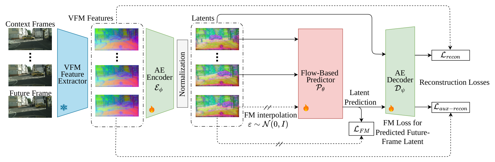
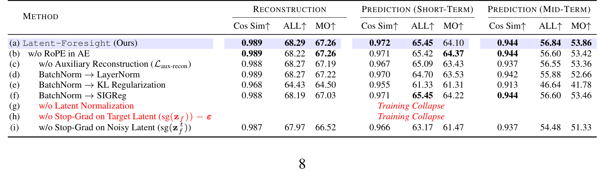
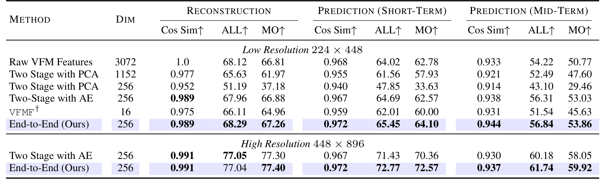
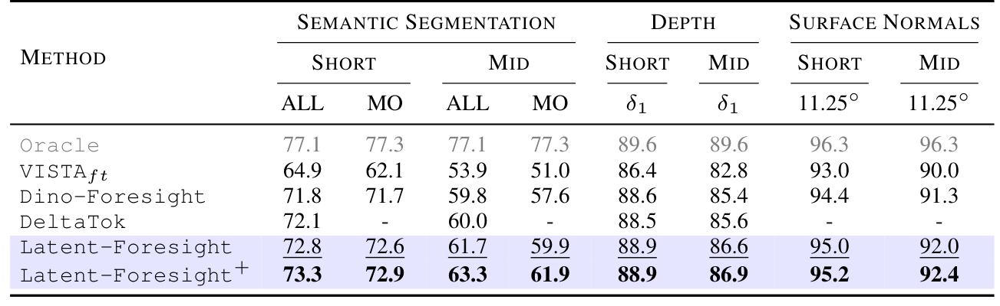
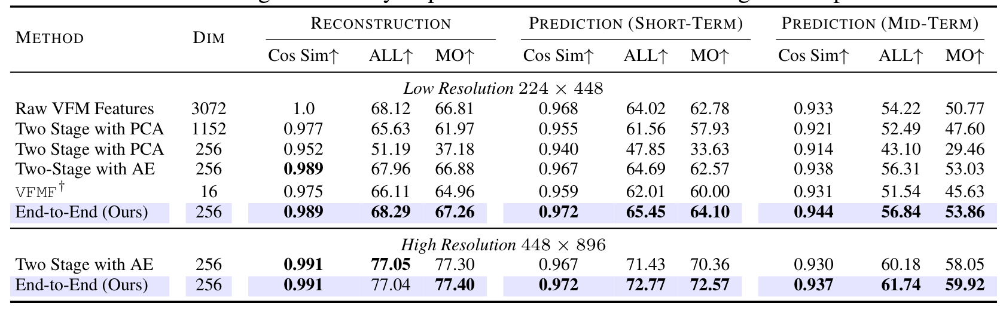
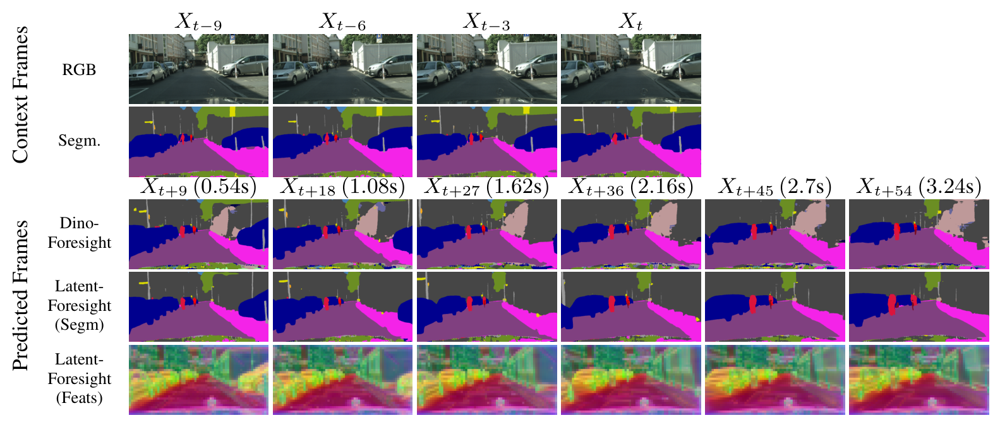
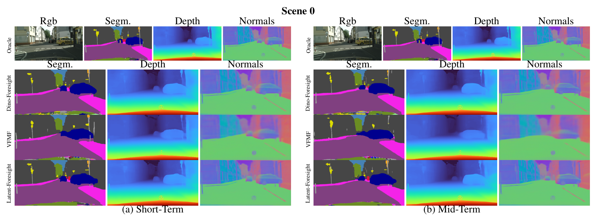
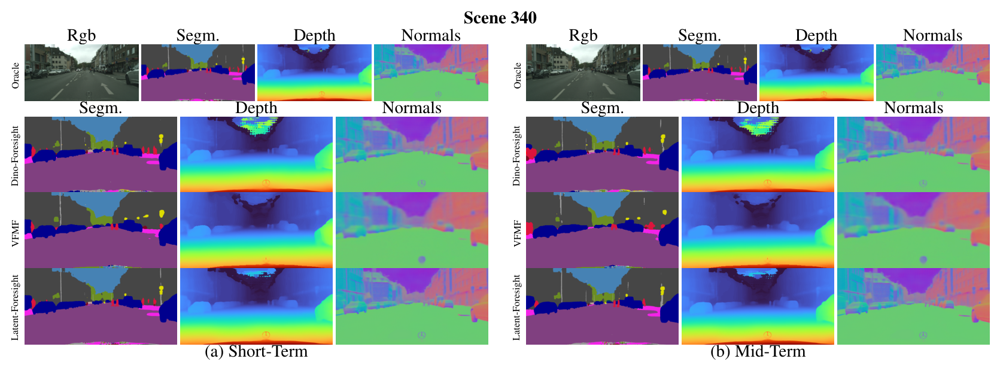
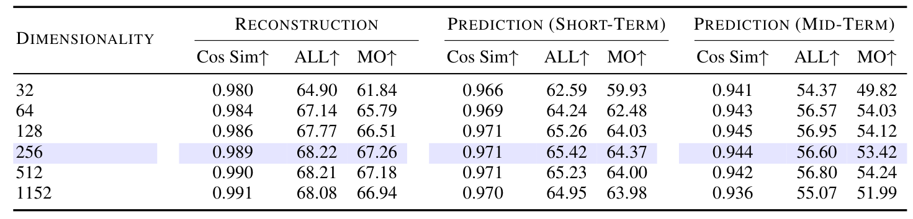
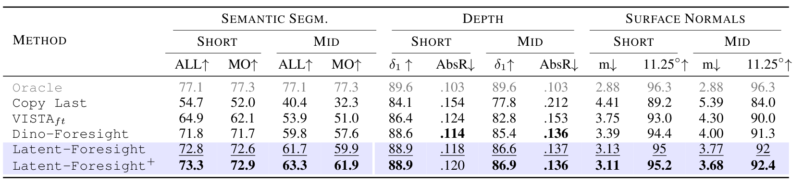

# Latent-Foresight: End-to-End Learning Predictable Representations for Latent World Models

> **Latent-Foresight: End-to-End Learning Predictable Representations for Latent World Models**
> Efstathios Karypidis · Spyros Gidaris · Nikos Komodakis（ valeo.ai 实习期间完成，通讯 e.karypidis@athenarc.gr）
> arXiv 预印本 · [arXiv:2610.01942v1](https://arxiv.org/abs/2610.01942)（2026-10-01 16:09 UTC 提交，北京时间 10-02 00:09）· cs.CV 主分类
> 代码：[Sta8is/Latent-Foresight](https://github.com/Sta8is/Latent-Foresight)（官方实现，2026-10-01 建）· 权重随仓库发布 · 评测数据为公开数据集（Cityscapes / nuScenes / Kubric）

特征空间世界模型的一个隐含假设正在被这篇论文拆掉：**tokenizer 先为重建而训、flow 预测器再在冻结的潜空间上训**——两阶段范式里，潜空间的几何从没被「未来好不好预测」这个目标约束过。Latent-Foresight 把两段训练焊成一段端到端，代价是联合优化会塌缩到平凡解；论文的贡献正是那份让端到端不塌的工程配方：潜变量归一化、双向 stop-gradient、辅助重建、logit-normal 噪声分布。Cityscapes/nuScenes/Kubric 三个数据集、短中长三个视界上，端到端全面领先两阶段。

## 为什么两阶段范式是结构性缺陷，而不是实现细节

预测未来场景在哪个表征上做，是特征空间世界模型的第一分叉。像素级预测保留大量与下游决策无关的低层外观，代价高；VFM（DINOv2）特征空间预测保留了语义结构，成了近两年的主线。判别式回归（DINO-Foresight 一系）丢失未来不确定性，生成式 flow-matching（VFMF 一系）补上了这一刀，但**所有这些工作都沿用两阶段：先训 tokenizer 压缩 VFM 特征、冻结，再在冻结潜空间上训预测器**（论文 1–2 页）。

作者指出的问题一句话就能说清：潜空间在两阶段里只被重建目标优化过，**没有任何机制保证它的时间轨迹在学到的流下是平滑、结构化、可预测的**（第 2 页）。这个缺口在长视界上放大——潜轨迹不可预测时，自回归误差逐帧复利。

## Latent-Foresight 框架：冻结 VFM 之后的 tokenizer 与 flow 预测器

框架本身不复杂（论文 3.1 节）：冻结 DINOv2 提取多层特征沿通道拼接为 $F \in \mathbb{R}^{H\times W\times D_f}$；轻量 ViT 编码器 $E_\phi$（两个 transformer block）压缩到 $z = E_\phi(F) \in \mathbb{R}^{H\times W\times C}$，$C \ll D_f$，解码器 $D_\psi$ 重建 $\hat{F} = D_\psi(z)$。重建目标组合欧氏与余弦项：

$$\mathcal{L}_{recon} = \sum_{i=1}^{N} \left( \|D_\psi(E_\phi(F_i)) - F_i\|_2^2 + (1 - \cos(D_\psi(E_\phi(F_i)), F_i)) \right)$$

预测器 $P_\theta$ 采用 JiT 的 x0-prediction 参数化：直接估计干净潜变量 $\hat{z}_f = P_\theta(z_f^t, t, z_c)$，插值 $z_f^t = t\,z_f + (1-t)\,\epsilon$（$t=1$ 为干净数据），速度形式 flow matching 目标 $\mathcal{L}_{FM} = \mathbb{E}\|\hat{v} - v\|^2$，其中 $v = z_f - \epsilon$。上下文条件 $z_c$ 为前 $N_c$ 帧潜变量，长视界自回归。评测用冻结 DPT 头输出语义分割 / 深度 / 法向三个下游任务（4.1 节），不训任务头——这保证了「世界模型进步」不靠任务头兜底。

## 方法主线

端到端的意思是 $E_\phi$、$D_\psi$、$P_\theta$ 同一个优化循环里一起更新；信息怎么流、梯度在哪里断，是整套设计的骨架。

### 机制流程

1. **特征压缩与归一化：** 输入每帧 VFM 特征图，编码器 $E_\phi$ 压缩到 256 维潜变量；输出经过无仿射参数的 BatchNorm 归一化到零均值单位方差，防止潜变量或噪声任一侧在插值中占主导，得到归一化后的上下文潜变量与目标潜变量。
2. **插值与速度目标构造：** 输入目标潜变量 $z_f$ 与高斯噪声，按 $t \sim$ logit-normal$(\mu=-2, \sigma=1.5)$ 采样时间步做插值；速度目标按 $v = \mathrm{sg}(z_f) - \epsilon$ 构造——stop-gradient 作用在目标分支，阻止预测目标反噬编码器。
3. **预测与损失回传：** 输入被 detach 的噪声潜变量 $\mathrm{sg}(z_f^t)$、时间步与上下文潜变量，预测器输出估计的干净潜变量；速度损失与辅助重建损失 $\mathcal{L}_{aux\text{-}recon} = \|D_\psi(\hat{z}_f) - F_{N_c+1}\|^2 + (1-\cos(\cdot))$ 一起反传——梯度经由上下文潜变量这条路径塑形编码器。
4. **推理与评测：** 输入上下文帧，自回归逐帧预测未来潜变量；解码回特征空间后由冻结 DPT 头输出三个下游任务的预测，与真值特征算余弦相似度或与任务真值算指标。

*论文图 1：端到端总览——冻结 VFM 提特征，编码器 + 归一化得到潜变量，flow 预测器做插值与预测，解码器同时承担重建与对预测潜变量的辅助重建，三路损失联合反传。*

完整目标 $\mathcal{L} = \mathcal{L}_{recon} + \mathcal{L}_{aux\text{-}recon} + \mathcal{L}_{FM}$（公式 7）。三段各自的分工值得注意：$\mathcal{L}_{recon}$ 保住信息不塌、$\mathcal{L}_{aux\text{-}recon}$ 缩小编码潜变量与生成潜变量之间的训练-测试错位、$\mathcal{L}_{FM}$ 把「可预测性」直接写进表征。

## 端到端为什么不塌：三件稳定化设计各防一种死法

消融表 5 是全文最有信息量的表（第 8 页），四个变体对应四种死法。**去掉潜变量归一化（g 行）：训练直接崩溃**——潜空间尺度和噪声尺度失配时插值无法工作。**去掉目标侧 stop-gradient（h 行）：训练崩溃**——预测目标经由速度损失反传进编码器，编码器学会了让目标「好预测」而不是「有信息」，捷径解吃掉表征。**把 BatchNorm 换成 KL 正则（e 行）**：不崩但接近崩——中期预测 MO 从 53.86 掉到 41.78；换 LayerNorm（d 行）或 SIGReg（f 行）则保住训练、小损性能。**去掉噪声侧 stop-gradient（i 行）**：训练稳定但预测劣化（mid MO 51.33），说明经由噪声插值的梯度会干扰「学可预测表征」这条主路径——**这是 stop-gradient 双侧不对称的微妙之处**：目标侧断了防塌缩，噪声侧断了防干扰，两个都要断但理由不同。

*论文表 5：端到端训练策略消融——g/h 两行 Training Collapse 红字标注；BatchNorm 替换与 stop-gradient 双侧对照。*

辅助重建损失的作用机制（c 行）：去掉后短期预测掉 0.36pt、中期掉 0.50pt，长视界劣化更明显——它压的是「编码器产出的潜变量」与「预测器生成的潜变量」两个分布之间的 train-test mismatch，预测器越自回归这个错位越复利。

## 关键结果

**端到端 vs 两阶段（表 2，第 7 页）**：同架构 tokenizer 先训后冻结的 Two-Stage with AE 是最强两阶段基线；端到端在低分辨率 224×448 下短期 MO 64.10 vs 62.57、中期 53.86 vs 53.03，高分辨率 448×896 微调后差距拉大到 72.57 vs 70.36 与 59.92 vs 58.05——**高分辨率适配是端到端收益最大的地方**，因为两阶段管线在高分辨率下要分别微调 tokenizer 和预测器，端到端一次搞定（4.2 节）。

*论文表 2：端到端与两阶段（PCA / AE / VFMF / 原始特征）在重建、短期、中期三个维度的对比；端到端行紫色高亮，低/高分辨率两组。*

**SOTA 对比（表 1，第 6 页）**：Cityscapes 上 Latent-Foresight+（加数据加训练的放大版）短期语义分割 ALL 73.3 / MO 72.9，中期 63.3 / 61.9，全面超过 DINO-Foresight（71.8/59.8）与 DeltaTok；25 亿参数、1740 小时驾驶视频训练的像素级世界模型 VISTA 只有 64.9——**特征空间预测对像素级生成的碾压性优势再次确认**。增益随视界拉长而扩大，正是「潜空间为可预测性塑形」的红利。

*论文表 1：Cityscapes 高分辨率 VFM 预测 SOTA 对比——语义分割 / 深度 / 法向三个任务 × 短/中两个视界，Oracle 上界、Latent-Foresight 与 + 变体紫色高亮。*

**泛化（表 3，第 7 页）**：nuScenes 上中期（9 帧 0.75s）/ 长期（18 帧 1.5s）/ 更长期（27 帧 2.25s）三档，余弦相似度 0.936/0.903/0.874 对两阶段的 0.927/0.888/0.857；Cityscapes 训练的模型零样本迁移到 nuScenes 仍领先（0.920 vs 0.905 等）。Kubric（表 4）上单条采样轨迹 91.16 ALL 即超过 VFMF 32 条采样平均的 89.99——**两阶段要用 32 倍采样预算弥补表征劣势**。

*论文表 3：nuScenes 跨任务对比——中期/长期/更长期三档余弦相似度与深度指标，含 Cityscapes 零样本迁移两行。*

**定性对比（图 2，第 9 页）**：预测 3.24 秒时 DINO-Foresight 超过 2 秒就近似静态、保留分割伪影；Latent-Foresight 在自车运动下持续捕捉车辆与路侧结构的表观运动，行人与骑行者等小物体边界保持更清晰。

*论文图 2：长期预测定性对比——上下文帧之后，DINO-Foresight 与 Latent-Foresight（分割 / 特征两行）预测到 3.24 秒。*

*论文图 3（附录）：Scene 0 定性对比——Oracle / DINO-Foresight / VFMF / Latent-Foresight 四行 × 分割 / 深度 / 法向四列，短/中两个视界。*

*论文图 4（附录）：Scene 340 同型对比。*

## 消融与超参：C 与噪声分布怎么选

**瓶颈维度 C（表 6 / 表 10）**：C=1152 重建余弦相似度最高（0.991）但中期预测 MO 反而降到 51.99；C=32 两者都差；**C ∈ [128, 512] 是预测甜点，选 C=256**——重建保真与时间可预测性存在内在权衡，更大的瓶颈只为重建服务。**噪声分布（表 7 / 表 11）**：重建几乎不变，预测却受益于把 logit-normal 推向高噪声级（$\mu=-2$）：中期 MO 53.42 对均匀采样的 51.00，$\sigma$ 提到 1.5 再到 54.24——**多练高噪声级就是多练「远未来」**，这个结论对任何 flow matching 动力学模型都直接适用。

*论文表 10（附录）：瓶颈维度 C 从 32 到 1152 的扫描，256 行紫色高亮。*

*论文表 11（附录）：噪声分布 p(t) 消融——均匀与三组 logit-normal 参数。*

*论文表 8（附录）：Cityscapes 全指标——六方法 × 分割（ALL/MO）/ 深度（δ₁/AbsRel）/ 法向（m/11.25°）× 短/中视界。*

*论文表 9（附录）：重建损失目标消融。*

## 局限

论文没有设独立局限节，边界需要从实验设置反推。我的分析有三点。**评测代理性**：全部结论基于冻结 VFM 特征 + 冻结 DPT 头的下游任务指标，没有直接评测机器人控制或规划收益——「可预测表征对决策有利」仍是合理推断而非验证事实。**数据域**：驾驶（Cityscapes/nuScenes）加合成（Kubric），没有接触丰富的操作场景或相机在手上（eye-in-hand）的剧烈视点变化；端到端配方在后者是否同样稳定未知。**累积误差**：最长报告到 27 帧（2.25 秒），自回归多步累积误差的长时间行为未刻画。

## 我的笔记

对做机器人世界模型的人，这篇论文的可复用核心是那份稳定化配方，而不是具体数字：**无仿射 BatchNorm + 目标侧 stop-gradient（防塌缩）+ 噪声侧 stop-gradient（防干扰）+ 辅助重建（压 train-test mismatch）+ logit-normal(-2, 1.5)（偏置高噪声级）**。这套东西原则上可以平移到任何「latent tokenizer + 生成式动力学」结构上——包括 VLA 里的 WAM 分支、机器人操作的特征空间预测器。附带的两个评测设计也值得收下：冻结 VFM + 冻结 DPT 头的协议让世界模型进展可以被下游任务直接度量而不引入任务头训练噪声；「重建最高 ≠ 预测最好」的 C 扫描结论提醒所有选瓶颈维度的人：**为重建选的容量预算不等于为预测选的容量预算**。

与前一日 EWAM（统一具身模型的深度分工）对照：EWAM 解释「统一模型里语义→前瞻→动作的深度分工是怎么涌现的」，Latent-Foresight 回答的是更上游一层的问题——**前瞻分支赖以工作的潜空间本身该被什么目标塑形**。两者可以叠着读：先端到端把表征练成可预测的，再去看深度方向谁用它。

## 引用

- 论文：[arXiv:2610.01942v1](https://arxiv.org/abs/2610.01942)，提交 2026-10-01 16:09 UTC（北京时间 10-02 00:09）
- 代码与权重：[Sta8is/Latent-Foresight](https://github.com/Sta8is/Latent-Foresight)（官方实现，含权重，2026-10-01 建）
- 对比方法出处见论文第 10–11 页参考文献（DINO-Foresight、VFMF、VISTA、DeltaTok、JiT 等）
