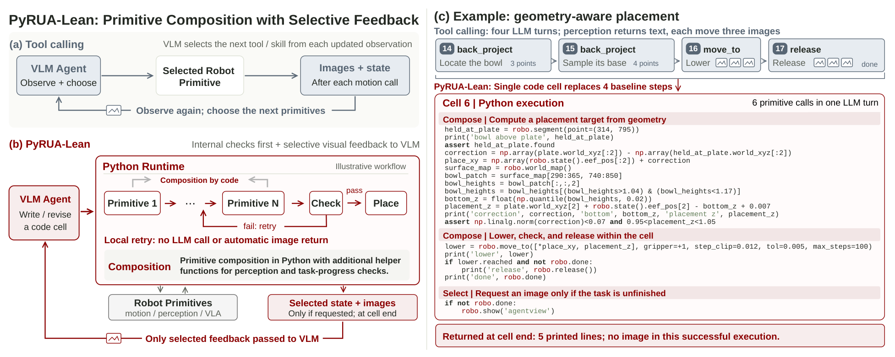
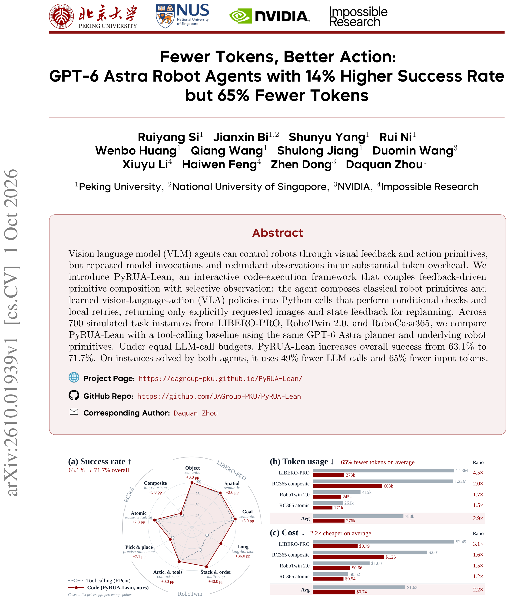
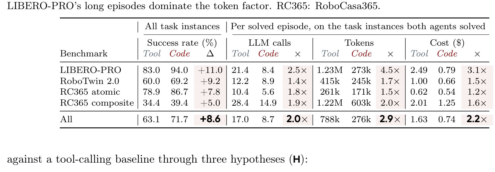
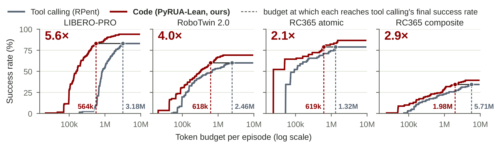
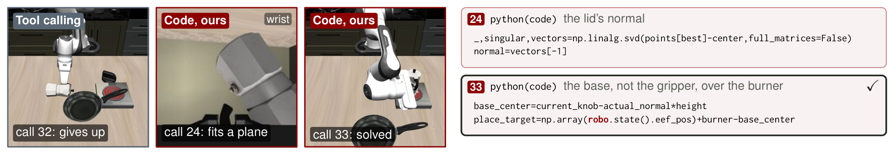
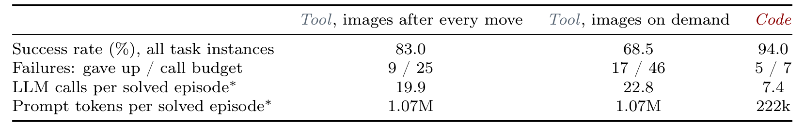
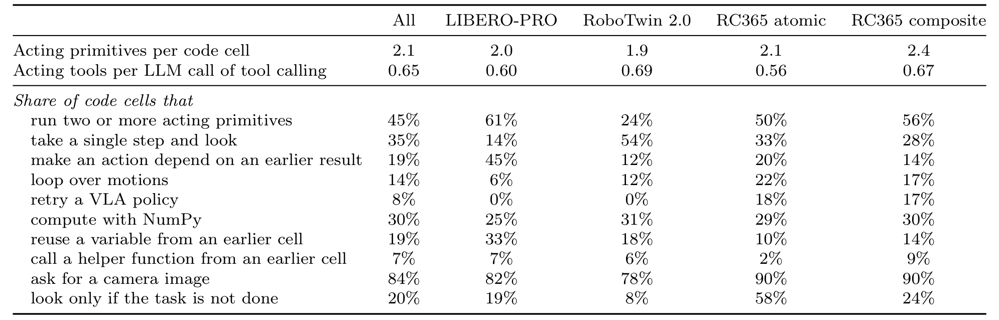
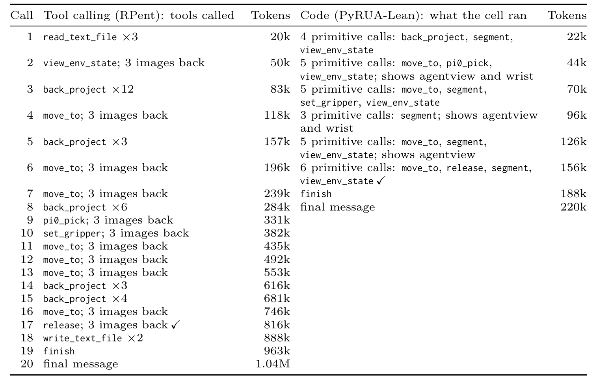
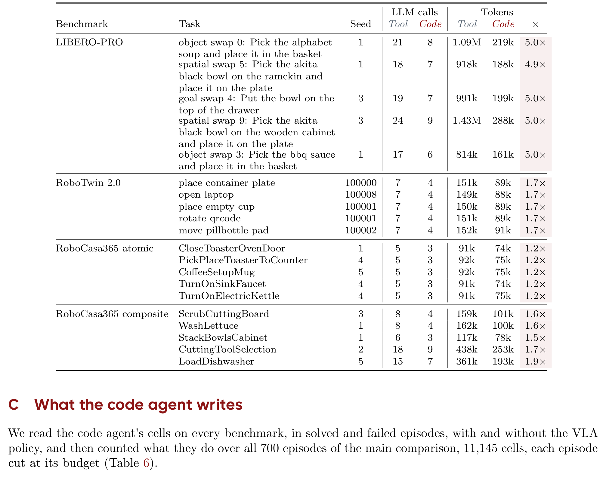
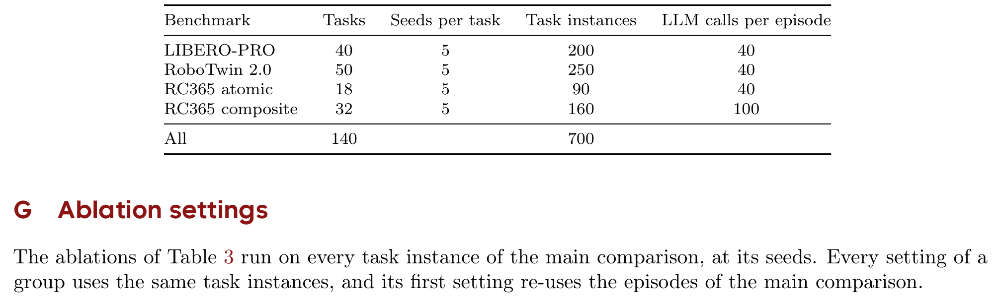

# Fewer Tokens, Better Action: GPT-6 Astra Robot Agents with 14% Higher Success Rate but 65% Fewer Tokens

> **Fewer Tokens, Better Action: GPT-6 Astra Robot Agents with 14% Higher Success Rate but 65% Fewer Tokens**
> Ruiyang Si · Jianxin Bi · Shunyu Yang · Rui Ni · Wenbo Huang · Qiang Wang · Shulong Jiang · Duomin Wang · Xiuyu Li · Haiwen Feng · Zhen Dong · Daquan Zhou（北京大学 / 新加坡国立大学 / NVIDIA / Impossible Research）
> arXiv 预印本 · [arXiv:2610.01939v1](https://arxiv.org/abs/2610.01939)（2026-10-01 16:07 UTC 提交，北京时间 10-02 00:07）· cs.CV 主分类
> 项目页：[dagroup-pku.github.io/PyRUA-Lean](https://dagroup-pku.github.io/PyRUA-Lean/) · 代码：[DAGroup-PKU/PyRUA-Lean](https://github.com/DAGroup-PKU/PyRUA-Lean)（论文页首标注）

VLM 机器人 agent 的推理开销主要不是模型慢，而是**接口设计**造成的：tool-calling 里每个依赖前一步结果的操作都要再调一次 VLM，每次运动原语还自动回传三张相机图，中间结果在对话里越积越多。这篇论文做的对照实验干净得少见：同一个 GPT-6 Astra planner、同一套 RPent 原语与冻结 VLA、同等的调用预算，只把接口从「工具调用」换成「Python 代码执行 + 选择性观察」——700 个仿真任务实例上成功率 63.1% → 71.7%，联合解决实例上调用次数省 49%、输入量省 65%、成本省 56%。更有价值的是反事实消融：**只给 tool-calling 加「按需回图」反而把成功率从 83.0% 打到 68.5%**——观察选择必须和执行组合绑在一起才成立。

## tool-calling 为什么产生额外推理成本

论文的出发点（第 2 页）值得逐条复述，因为它定义了要省的是什么。tool-calling 接口下：一个依赖前一个工具结果的操作，一般需要再一次 VLM 调用；中间结果留在对话里，后续每次调用都要重新处理；RPent 这类系统里运动原语每次执行结束自动返回多张相机图。**「需要反复定位-运动-恢复」的任务因此产生大量推理开销——即使每个原语本身都很可靠**。

代码执行是一条绕开的路：程序可以组合原语、检查输出、执行条件分支与重试，然后才把控制权交回 VLM。Code as Policies / ProgPrompt 一脉与 CodeAct 等通用 agent 工作都指向这个方向，但**没有人系统量化过「代码接口 vs 工具调用」在机器人操作上的成功率与推理成本**——尤其是混着 VLA 策略、执行可能失败、观察是视觉的这些机器人特有条件。

## PyRUA-Lean 的三个机制

PyRUA-Lean 建立在 RPent 的机器人栈与原语实现上（第 2–6 页），只换接口层。机器人被暴露成一个 Python 对象 `robo`，其方法调用原语并返回结构化结果；agent 通过 `python(code)` 工具交互：每轮 VLM 生成一个代码格（cell），运行时执行它，返回的反馈决定下一个 cell。

**机制一：反馈驱动的原语组合。** cell 内可以组合多个原语并以后续操作为条件——接近物体、仅在接近成功时尝试抓取、根据结果状态重试或停止；这些检查与分支在 cell 内执行，不产生额外 VLM 调用。程序还能做原语不直接提供的任务特定计算：论文的几何放置例子里，agent 从世界坐标地图算出碗底高度、算出放置目标位姿——**没有任何一个原语直接返回这个量**。

**机制二：持久命名空间。** 变量与 helper 函数跨 cell 保留；未捕获异常终止当前 cell 并回传 traceback，但异常前赋值的变量留在命名空间里，agent 可以在下一个 cell 里修订失败的操作。任务成功后，运行时在每个动作原语前检查并直接终止 cell；外部 watchdog 强制 2 小时 episode 上限。

**机制三：选择性观察。** 原语结果留在运行时里、不逐条进对话；agent 通过显式输出语句与 `robo.show` 这类相机请求指定要回传什么，请求的图像与状态消息在代码中指定的位置记录、**cell 结束时统一返回**。论文的放置示例 cell 成功执行后只返回 5 行打印、0 张图片——图像仅在任务未完成时才请求。

## 方法主线

接口替换的全部信息流可以走四步：VLM 只在 cell 边界出现，cell 内的一切都不再进入推理上下文。

### 机制流程

1. **生成代码格：** 输入任务指令、API 参考（原语表）与对话上下文，VLM 生成一个 Python cell——组合 `robo.*` 原语、写 helper、设条件分支与断言，输出送入运行时。
2. **运行时执行：** 输入 cell 代码，运行时顺序执行原语调用（运动 / 感知 / VLA 策略）、NumPy 几何计算与条件检查；失败时本地重试或异常终止回传 traceback，任务成功即停；中间结果全部留在持久命名空间，指定的打印行与请求图像记入回传缓冲。
3. **选择性回传：** cell 结束时把缓冲中的选定打印行、请求图像与状态消息统一返回给 VLM；VLM 据此写下一个 cell 或结束 episode——**新的上下文只在 cell 边界进入对话**。
4. **预算与评测：** 输入全部 cell 轨迹，调用预算（40 次，RoboCasa365 composite 100 次）与 2 小时 watchdog 计入；按各 benchmark 的成功判定统计成功率、每解决 episode 的调用数 / 输入量 / 估算成本。

*论文图 2：(a) tool-calling 的观察-选择循环；(b) PyRUA-Lean 的 Python 运行时——本地重试不产生调用与自动回图，仅选定反馈回传；(c) 几何感知放置示例——一个 cell 替代基线四步。*

对照的关键设计在第 5–6 页的表 1：两边原语完全同名同参数（`move_to` / `segment` / `pi0_pick`…），tool 侧每次运动自动回三图，code 侧只在 `robo.show` 时回图；世界坐标 tool 侧靠感知工具、code 侧还可以整图 `robo.world_map()` 一次拿走。

## 关键结果

**主表（表 2，第 5 页）**：700 实例上总成功率 63.1% → 71.7%（+8.6pt，相对约 14%）；四个 benchmark 分组全部为正——LIBERO-PRO +11.0（83.0→94.0）、RoboTwin 2.0 +9.2、RC365 atomic +7.8、RC365 composite +5.0。联合解决实例上：平均调用 17.0 → 8.7（省 49%）、输入量 788k → 276k（省 65%）、成本 $1.63 → $0.74（省 56%）。**code 独解 96 个实例、tool 独解只有 36 个**。

| Benchmark | 成功率 Tool → Code | 调用比 | Token 比 | 成本比 |
|---|---|---|---|---|
| LIBERO-PRO | 83.0 → 94.0 | 2.5× | 4.5× | 3.1× |
| RoboTwin 2.0 | 60.0 → 69.2 | 1.4× | 1.7× | 1.5× |
| RC365 atomic | 78.9 → 86.7 | 1.8× | 1.5× | 1.2× |
| RC365 composite | 34.4 → 39.4 | 1.9× | 2.0× | 1.6× |
| **All** | **63.1 → 71.7** | **2.0×** | **2.9×** | **2.2×** |

*论文图 1（首页）：(a) 按任务属性标注的成功率雷达——长时程 +36pt、多步堆叠排序 +40pt 是最大增益源；(b) token 柱状对比；(c) 成本对比。*

*论文表 2（主结果原图）：四个 benchmark 与 All 行的成功率、调用、输入量、成本及 Δ/× 列，All 行 63.1 对 71.7 加粗。*

**增益的结构（第 6–8 页）**：token 分解显示 LIBERO-PRO 的 4.48× 总节省 = 调用次数 2.55× × 每次 1.76×——**省钱主要靠少调用，不是每次更小**；RC365 atomic 上 code 单次调用反而更大（API 描述更长），总输入量仍靠次数优势下降。等预算回溯曲线（图 3）：code 在 LIBERO-PRO 用 564k token 就达到 tool 花 3.18M 才到的最终成功率（5.6×）；RoboTwin 618k vs 2.46M（4.0×）。独解实例分解：96 个中 52 个是 baseline 预算耗尽、44 个是提前失败——**前者说明同等预算塞进了更多执行，后者包含几何推理与脚本化恢复，但也包含 VLA 单次运行运气差异**，作者明确拒绝把成功率差距全归功于恢复逻辑。

*论文图 3：等预算回溯曲线——每个 episode 按给定预算截断时的成功率；虚线标注各自达到 tool 最终成功率所需预算与倍率。*

*论文图 4：仅 code 解决的 LIBERO-PRO 实例——两个 agent 都打翻了摩卡壶，code agent 对壶盖做 SVD 平面拟合（call 24）、翻正壶身、按壶底而非夹爪对准炉灶（call 33）。*

**RoboDojo pilot**：三个任务上 26.7%（8/30）对 3.4%（1/29），每次成功的总开销从 11.56M 降到 1.07M token（省 90.7%）。

## 反事实与消融：观察选择不是充分条件

这篇论文最好的部分是它对自己主张的拆解（4.3–4.4 节）。**只改观察不改执行**：给 tool-calling 基线加「按需回图」，LIBERO-PRO 成功率从 83.0% 掉到 68.5%；在 131 个三种配置都解决的实例上，改版基线调用更多、总输入量与原基线几乎一样——**减少自动视觉反馈单独做是有害的**，观察请求必须与动作执行、重规划一起考虑。作者同时诚实注明：这个实验没有单独量化 PyRUA-Lean 内部选择性反馈的独立贡献。

**去 VLA / 去 guide（表 3）**：token 优势在所有设置下保持（H3 成立）；RoboTwin 无 VLA 时差距拉到 42.8 → 68.8（+26.0），RC365 composite 无 VLA 时 7.5 → 20.0（+12.5）——**原语越「经典」，代码组合的价值越大**。一个反直觉发现：RoboTwin 无 VLA 时去掉操作指南反而把 tool-calling 从 42.8% 提到 60.4%——指南的效果依赖接口，不是 uniformly beneficial。

*论文表 8：相机反馈消融——images after every move / on demand / code 三列，成功率 83.0 / 68.5 / 94.0。*

*论文表 6：700 episodes / 11,145 个 cell 里代码格都做了什么——平均每格 2.1 个动作原语、45% 组合两个以上、84% 请求过相机图、30% 用 NumPy 计算。*

*论文表 4（附录）：图 6 两个 episode 的逐调用对照——tool 侧每次调用调了什么工具，code 侧每个 cell 跑了什么，附累计输入量；第 17 调解决、第 7–8 调收尾。*

*论文表 5（附录）：图 7 各 episode 的调用数与输入量明细——四个 benchmark 分组、每行带 × 比例列（LIBERO-PRO 5.0× 等）。*

*论文表 7（附录）：实验设置——每 benchmark 的任务数、种子数、实例数与调用预算（LIBERO-PRO 40 任务 × 5 种子 = 200 实例、40 次调用上限）。*

## 局限

作者自述（第 8 页）：评测限于 GPT-6 Astra、RPent 的机器人栈与原语库、仿真环境，每实例每 agent 单次运行——其他 planner 与原语配置的泛化、重复运行的方差、真机表现未测；接口作为整体对比，**没有分离原语组合、持久状态、选择性反馈三者的独立贡献**。

我的分析再补三条。其一，VLA 主导任务里优势缩水：RC365 atomic 含失败 episode 的总成本比只有约 1.1×——初始 prompt 占输入大头，少调用省不回来。其二，code 侧 API 描述更大，在调用次数本来就少的任务上会部分抵消收益（per-call token 0.83×<1）。其三，等预算曲线是**回溯性**的——agent 并没有在「告知预算」的条件下重跑，它是从录制轨迹上算的截止线。

## 我的笔记

对做 VLM 机器人 agent 的工程师，这篇论文给的是一份可以直接抄的 runtime 设计清单：**`python(code)` 单工具 + 持久命名空间 + 异常 traceback 回传 + 变量跨 cell 保留 + 任务成功即停 + watchdog**——每一项都有明确的功能分工。两个方法论结论比数字更值钱：**「少调用」比「小 prompt」是更主要的降本杠杆**（2.55× vs 1.76× 的分解），以及**观察选择必须与执行组合绑定**——单独做按需回图会掉 14.5pt 成功率，这个反直觉结果对任何想「优化上下文」的 agent 框架都是预警。

与 RPG（前一日必读 #1，改 system prompt 与技能库）对照：RPG 在 prompt 与技能层做 weight-frozen 自我改进，PyRUA-Lean 在执行层做接口重构——**「把中间协调移出对话上下文」与「把失败诊断移进 prompt 库」是同一条降本路线的两个端点**，工程上完全可以叠加。

## 引用

- 论文：[arXiv:2610.01939v1](https://arxiv.org/abs/2610.01939)，提交 2026-10-01 16:07 UTC（北京时间 10-02 00:07）
- 项目页：[dagroup-pku.github.io/PyRUA-Lean](https://dagroup-pku.github.io/PyRUA-Lean/) · 代码：[DAGroup-PKU/PyRUA-Lean](https://github.com/DAGroup-PKU/PyRUA-Lean)
- 基线与对比方法出处见论文第 9–11 页参考文献（RPent、Voyager、ASPIRE、CodeAct、SWE-agent 等）
