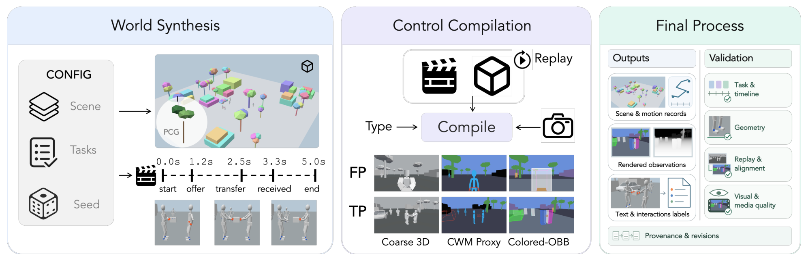
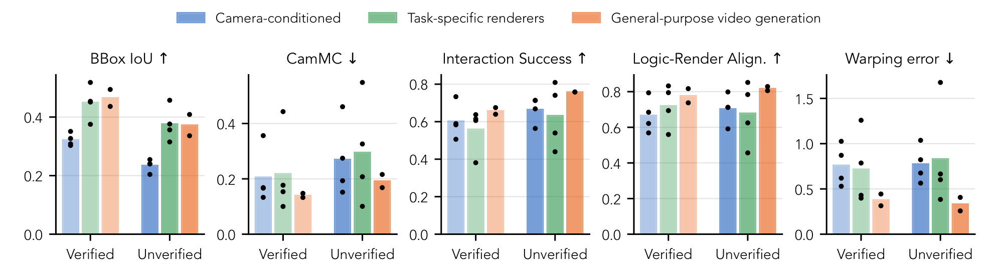
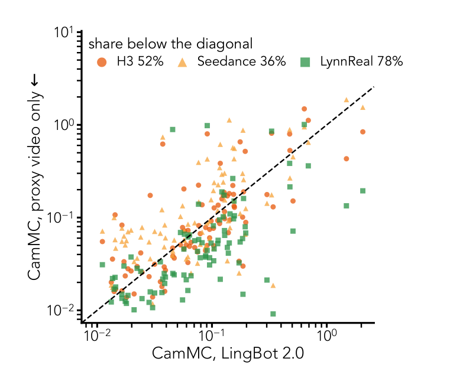
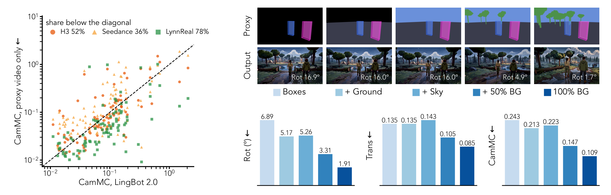
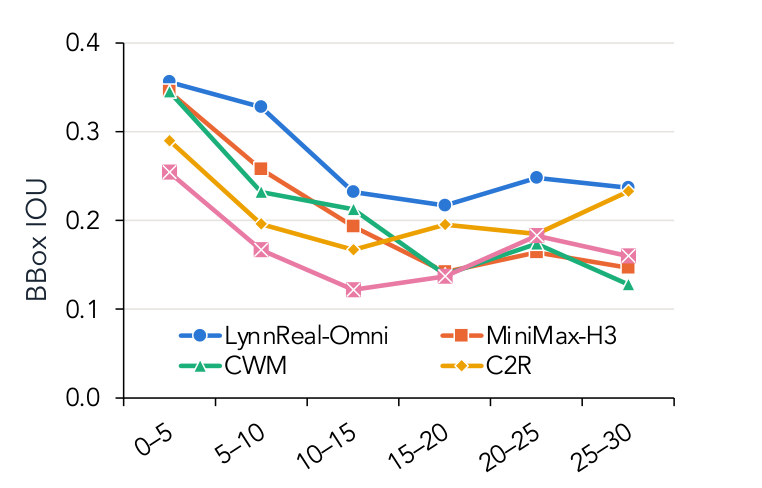
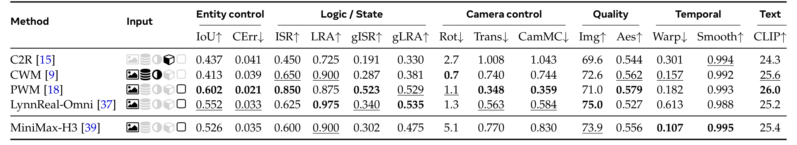
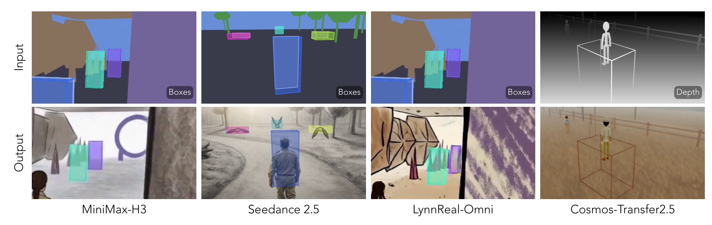

# ROWBench: Do Video Models Render What the Program Specifies?

> **ROWBench: Do Video Models Render What the Program Specifies?**（论文首页与正文同时使用 PROWBench 一名；题名行为 ROWBench，正文行文为 PROWBench，两处均按原文保留）
> Zheng-Hui Huang · Guixu Lin · Yu-Ju Tsai · Jian-Kai Zhu · Fengbo Lan · Yu-Lun Liu · Yung-Yu Chuang · Kaipeng Zhang · Zhixiang Wang（Alaya Lab）
> arXiv 预印本 · [arXiv:2610.02205v1](https://arxiv.org/abs/2610.02205)（2026-10-01 17:59 UTC 提交，北京时间 10-02 01:59）· cs.CV 主分类
> 项目页：[alaya-lab.github.io/PROWBench](https://alaya-lab.github.io/PROWBench) · 代码：[AlayaLab/PROWBench](https://github.com/AlayaLab/PROWBench)（论文首页标注，日期 2026-10-02）

可编程世界模型把「状态演化」交给可执行程序、把「视觉生成」交给视频模型，这个分工有一个没人系统测过的软肋：**程序执行正确不代表视觉实现忠实**——生成的视频看着挺合理，却可能违反规则、没画出规定要发生的交互。这篇论文补上这块评测空白：170 个程序化构造的 episode、600 条代理视频，实体状态与时间戳事件（**包括画外事件**）被记录为可重放的世界记录，渲染成粗 3D / 语义代理 / 彩色 OBB 三种同步表征加部分同步多视角，然后拿十个模型来考。三个发现值得记：**代理条件化碾压相机条件化**（BBox IoU 0.45–0.52 对 0.24–0.35）；**通用视频模型无需任务训练即可追平专用世界模型**（MiniMax-H3 相机跟随与 EchoWM/SANA-WM/LingBot 2.0 平手）；**长时程与多视角仍是全面塌方区**（30 秒 BBox IoU 全体 ≤0.280）。

## 评测缺口：没有可重放记录就只能评 plausibility

现有 benchmark 测视觉质量、可控性、指令遵循、交互一致性，但（论文第 2–3 页，表 A.1）几乎不测「对程序规定的细粒度世界事件的忠实度」。原因很根本：**没有可重放的实体状态与时间戳事件记录，一段生成视频只能被判「合理」，不能被判「符合程序实际执行了什么」**。也没有人把同一记录的场景渲染成配对的代理表征——而要把「表征的影响」与「视角的影响」从场景内容里分离出来，两者都需要。

PROWBench 面向的正是 Programmable World Model / Code World Model 这条新路线（PWM、CWM 一系）：代码与可执行程序维护状态与交互规则、视频模型条件化在结构化世界表征上生成观测——**显式状态控制加视觉生成**。论文要测的就是这条路线的另一半：视频模型能不能把程序规定的场景结构、规则与交互画出来。

## 数据引擎：状态记录重放为三表征 + 同步多视角

数据引擎的设计把四个阶段分离（第 8–10 页）：场景构造、行为控制、状态记录、渲染。每个 episode 的世界状态演化由程序驱动，引擎记录实体状态与时间戳事件——**包括发生在相机视野之外的事件**——作为可重放的世界记录；渲染阶段从同一份记录渲染出三种代理表征（Coarse 3D、CWM 语义代理、Colored-OBB 彩色朝向包围盒）与相机视角的 RGB 观测，部分 episode 另有同步多视角观测。文本 prompt 由记录的场景、实体与动作时间线自动生成。

这个「一份记录、多种渲染」的构造是整个基准的方法论支点：**场景内容与动作固定，表征与视角成为唯一变量**——同一集的粗 3D 和彩色 OBB 输入给不同原生接口的模型，差异就能归因于表征而不是场景。170 个 episode 覆盖多样环境与交互，600 条代理视频按「每集三表征」配出。

*论文图 2：生成管线总览——世界合成（含 PCG 时间轴）→ 控制编译为 FP/TP 两行代理（Coarse 3D / CWM Proxy / Colored-OBB）→ 最终流程的输出与五项验证检查。*

## LRA 与 ISR：把「逻辑忠实」变成可计算指标

两个 VLM 基指标都拿引擎日志当 ground truth（第 3 节与 4.1 节）。**Interaction Success Rate（ISR）**：每条引擎记录的事件是否在对应时刻同时达到规定的动作与终态——测「事件有没有真的发生」。**Logic-Render Alignment（LRA）**：规定时间线的每一段是否被可见地画出来——测「时间线 adherence」。配合几何类指标（BBox IoU、相机误差），再加作者后续提出的加权版 gISR/gLRA（按实体放置加权），「做对了动作」与「在对的位置做对了动作」被拆开——这个拆分在后文读表时非常关键。

赛道设置：主赛道分 Verified-FF（40 对，首帧来自 MiniMax-H3 输出、经核验）与 Unverified-FF（90 对）两个 setting，外加挑战赛道（30 秒长时程、多视角）。十个模型按类分：相机条件世界模型（EchoWM、SANA-WM、LingBot 2.0、AlayaWorld v1.1）、任务特化渲染器（Cosmos-Transfer2.5、C2R、CWM、LynnReal-Omni）、通用视频生成（MiniMax-H3、Seedance 2.5）。

## 主赛道：代理条件碾压相机条件，通用模型追平专用世界模型

主表数字（第 8–9 页，表 1；Verified-FF setting）：

| 模型 | 类别 | BBox IoU↑ | ISR↑ | LRA↑ | Rot↓ | CamMC↓ |
|---|---|---|---|---|---|---|
| EchoWM | 相机条件 | 0.351 | 0.506 | 0.685 | 2.2° | 0.166 |
| LingBot 2.0 | 相机条件 | 0.327 | **0.733** | 0.794 | 2.8° | 0.133 |
| Cosmos 2.5 | 任务特化 | 0.451 | 0.381 | 0.560 | 1.7° | 0.177 |
| CWM | 任务特化 | 0.454 | 0.637 | 0.795 | 2.0° | 0.154 |
| LynnReal-Omni | 任务特化 | **0.518** | 0.615 | **0.832** | 2.0° | 0.100 |
| MiniMax-H3 | 通用 | 0.494 | 0.675 | 0.738 | 3.4° | 0.133 |

（Unverified-FF setting 下同排序：LynnReal 0.457 / MiniMax-H3 0.409 对相机条件类 0.204–0.255；两个 setting 的方法排名强相关，BBox IoU 的 Spearman 相关系数 0.98、LRA 0.91。）

**发现一：代理条件化在实体放置上大幅领先**（类间配对符号检验：38/40 与 87/89 场景，中位差 +0.14，p<10⁻⁸）。相机条件世界模型只拿到相机轨迹、没有实体轨迹，BBox IoU 0.303–0.351；两类代理条件模型分别到 0.450 与 0.465。更细的拆分：**主角放置其实相当**（第三人称视角下 0.44/0.42 对 0.46–0.54，跟随相机隐式锁住了主角），**其他实体完全不行**（0.26/0.20 对 0.38–0.44）——隐式控制只覆盖被跟随的主体。

**发现二：通用视频模型追平专用世界模型，相机跟随不靠显式相机注入**。MiniMax-H3 与 Seedance 2.5 拿彩色 OBB 代理视频当参考输入加文本 prompt，LRA 在两个 setting 都超过相机条件类（26/32 与 57/77 场景，p<10⁻³），warping error 全场最低（0.38/0.33 对任务特化类 0.72/0.83）；相机跟随上类间平手（p=1.0）——**代理视频本身从规定相机渲染，相机运动已经隐式编码在内**，逐样本对比 MiniMax-H3 有 52% 低于 LingBot 2.0。

*论文图 3：三个方法类一目了然——Verified-FF（浅）与 Unverified-FF（深）两 setting 下 BBox IoU / CamMC / ISR / LRA / warping error 五组柱状，柱为类均值、点为各方法。*

*论文图 4：代理输入 vs 相机输入——三个无相机轨迹模型对 LingBot 2.0 的逐样本 CamMC 散点（对角线下方占优），LynnReal 78%、H3 52%、Seedance 36%。*

读表要小心两个陷阱。**LingBot 2.0 的 ISR 0.733 全场最高、但 BBox IoU 只有 0.327**：正确的动作与终态不保证正确的交互位置——它 gISR 排到第五（0.241），加权后 LynnReal（0.429）与 MiniMax-H3（0.368）反超。**Cosmos-Transfer2.5 拿着稠密深度与分割输入却两项垫底**（ISR 0.381、LRA 0.560），把任务特化类的整体均值拖下水——fine-tuning 不是 uniformly beneficial 的。

**代理本身的两个子发现**（第 10–12 页）：代理形式对实体放置影响很小（表 5），但**代理组成对相机控制影响很大**——图 5 的 20 对消融里，从「只有实体盒」到「加地面、天空、50% 背景物体」，旋转误差 6.89° 一路降到 1.91°、CamMC 0.243 → 0.109；**上下文越像真场景，相机跟随越稳**。另一个是反直觉的 negative：输出有时把低多边形代理的粗糙形状直接继承进画面（proxy 泄漏，图 6），盒式代理又留空「哪段描述外观属于哪个实体」——**代理设计本身是开放问题**。

*论文图 5：代理组成与相机控制——LynnReal-Omni 在 20 对场景上从 Boxes 到 100% BG 的旋转 / 平移 / CamMC 消融，顶部为场景 043 在 4.25s 的示例帧。*

## 挑战赛道：长时程与多视角是当前最大缺口

**长时程（表 2，30 秒、十个 30 秒记录）**：BBox IoU 全体 0.175–0.280——主赛道 5 秒 clip 上的数字到这里腰斩再腰斩；**Reappearance IoU（离画后回画实体）只有 0.053–0.131**，实体持久性基本崩塌。State Persistence（回画实体是否呈现规定姿态）排名与 Re-IoU 不同：CWM 的 Re-IoU 最低（0.053）但 State Persistence 最高（0.886）——**位置丢了、姿态还在**。作者同时自我标注了边界：这些状态分数只覆盖每方法 17–21 个事件、来自未校准 judge，**是倾向不是稳定排名**；窗口链接协议还各不相同（Seedance 额外拿到前一窗最后一帧）。

*论文图 7：BBox IoU 随 30 秒记录时段（0–5 到 25–30 秒）的衰减曲线——四个方法全部随视界单调劣化。*

**多视角（表 3）**：五个方法直接生成多视角，组合性与一致性分数不低（MiniMax-H3 94.0 / 88.6），但跨视角实体误差 MEt3R 在 0.400–0.499——**几何上一致不等于身份一致**：独立生成的视角里「同一个参与者」可能不是同一张脸、同一身衣服。外观指派与身份绑定在无视觉参考时整体不可靠。

**域专属事件（表 4，20 个枪战场景）**：规定时刻「一人中枪倒地」——通用管线里 MiniMax-H3 的 ISR 只有 0.600，域专属训练的 PWM 到 0.850（BBox IoU 0.526 对 0.602）。**空间对齐不等于事件可靠执行**；PWM 的输出里也几乎看不到 proxy 泄漏。

*论文表 4：枪战集——C2R / CWM / PWM / LynnReal / MiniMax-H3 五方法 15 项指标全对照，PWM 的 ISR 0.850 对 H3 的 0.600。*

*论文图 6：proxy 泄漏——四列模型（H3 / Seedance / LynnReal / Cosmos-Transfer）的输入（上排）与输出（下排），彩色包围盒与线框残留在生成画面里。*

## 局限与开放问题

结论一节把方向说得很清楚：**可编程世界渲染是一个「跨实体、事件、时间、视角保持可执行状态」的问题，不是优化视觉质量的问题**。可靠的生成式世界渲染器需要更强的实体-外观绑定、事件感知生成、长时程状态记忆与联合多视角一致性——四个都是当前缺口。作者明示的开放问题：更好的代理长什么样（盒式歧义、低多边形形状泄漏）；State Persistence 的 judge 未校准需要扩样本；窗口链接协议不统一使长时程比较要谨慎。

我的分析补一条协议边界：各模型接收自己原生接口的输入，RGB 首帧来自 MiniMax-H3 输出（会把 H3 的外观指派传给需要 RGB 参考的模型）——论文做了单独分析但这是**非完全受控变量**；长时程赛道每方法只有一个输出、无重复运行方差。

## 我的笔记

对做具身智能交互环境的人，这个基准的复用价值有三层。**数据引擎**：「引擎记录 → 重放为多表征 + 多视角」的设计可以直接接到自家仿真器上，170 集只是起步协议，扩展点在场景布局、动作与表征三个正交轴。**指标**：LRA/ISR 加 gISR/gLRA 把「逻辑忠实」与「空间正确」拆开——这个拆分对任何 action-conditioned 生成评测都适用，VLM 判分拿引擎日志当 ground truth 的做法绕开了「人工标注一致性」的老问题。**工程启示**：给视频模型喂彩色 OBB 代理视频加文本，就能拿到大部分实体控制——不需要显式相机注入；但代理要够「像真场景」（背景完整度对相机跟随的影响 6.89°→1.91°），且要防代理形状泄漏。

横向对照同日的 World Observer：那篇在解决「画外状态怎么保持」（加一路 observer 流持续观察），这篇在度量「画外事件有没有被忠实画出来」（LRA/ISR 对着引擎日志判分）——**一个是方法、一个是标尺**，World Observer 的 OOV 协议甚至可以拿到 PROWBench 的长时程赛道上再考一遍。

## 引用

- 论文：[arXiv:2610.02205v1](https://arxiv.org/abs/2610.02205)，提交 2026-10-01 17:59 UTC（北京时间 10-02 01:59）
- 项目页：[alaya-lab.github.io/PROWBench](https://alaya-lab.github.io/PROWBench) · 代码：[AlayaLab/PROWBench](https://github.com/AlayaLab/PROWBench)（论文首页标注）
- 被测模型与对比方法出处见论文第 15–19 页参考文献（EchoWM、SANA-WM、LingBot 2.0、AlayaWorld、Cosmos-Transfer2.5、C2R、CWM、PWM、LynnReal-Omni、MiniMax-H3、Seedance 2.5 等）
