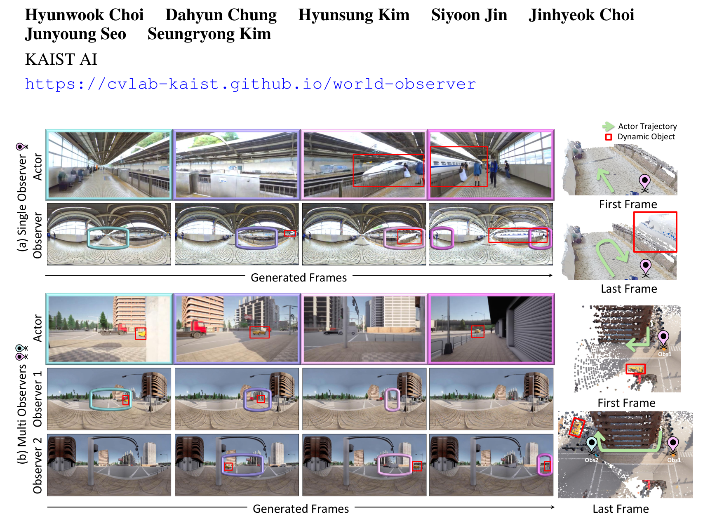
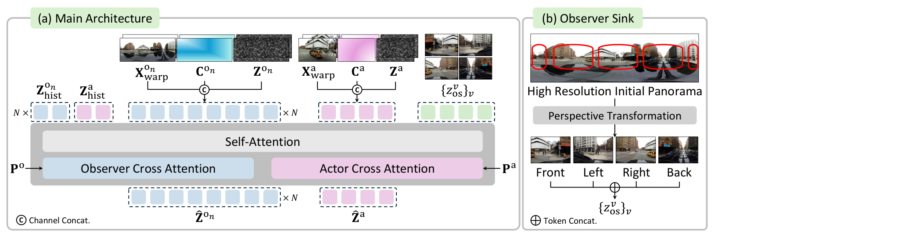
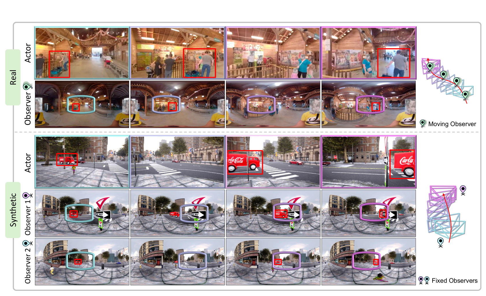
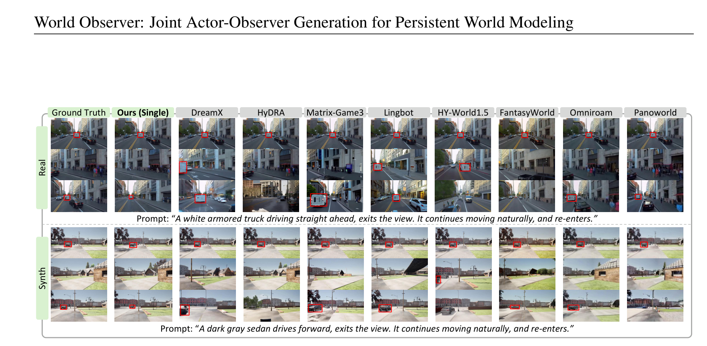
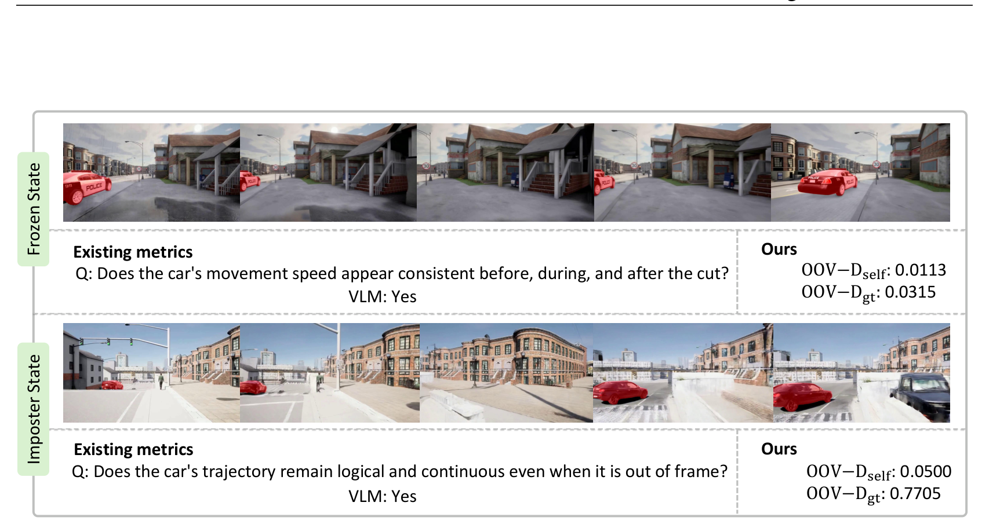
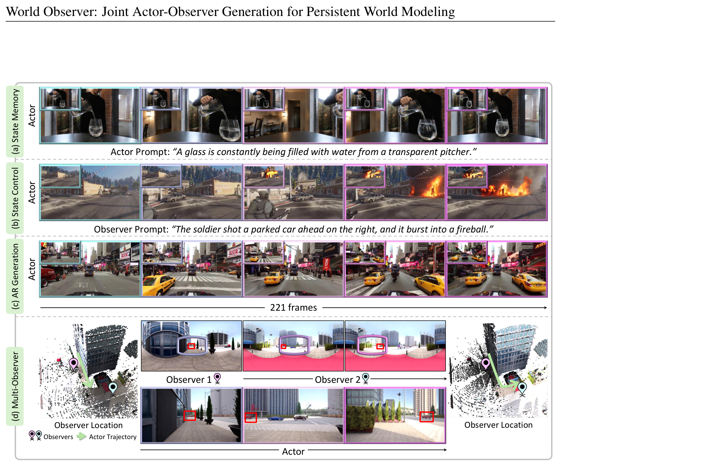
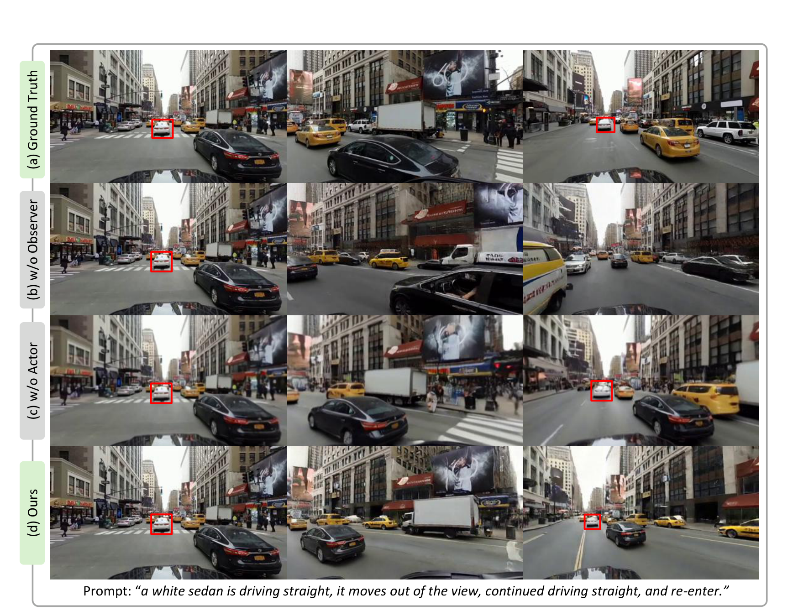
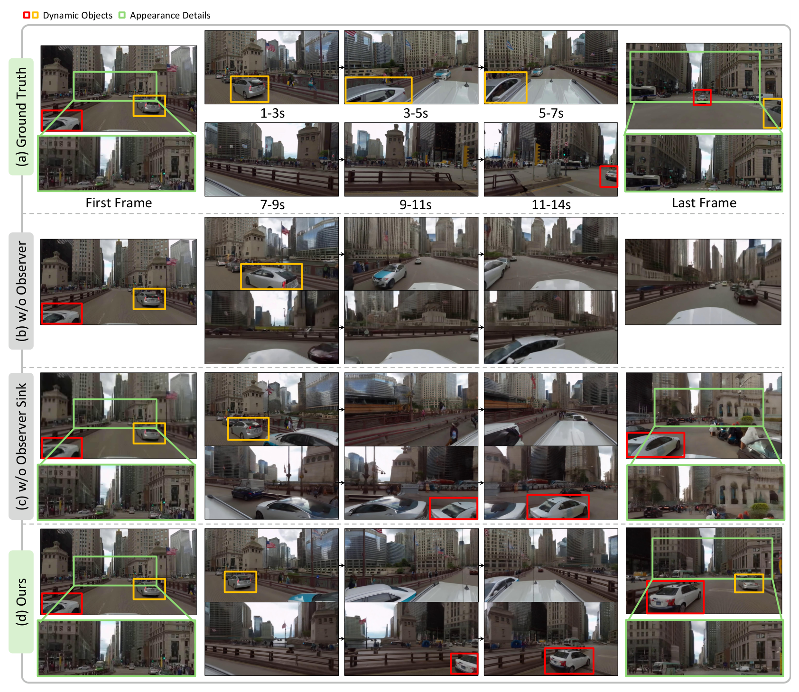
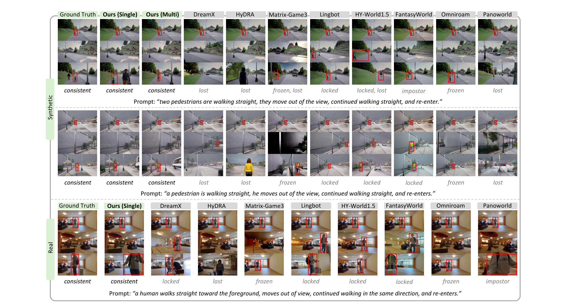
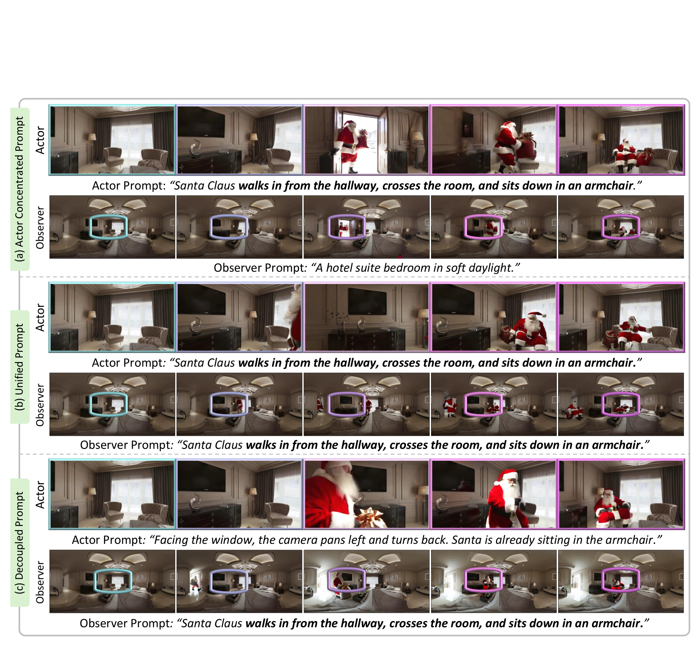

# World Observer: Joint Actor-Observer Generation for Persistent World Modeling

> **World Observer: Joint Actor-Observer Generation for Persistent World Modeling**
> Hyunwook Choi · Dahyun Chung · Hyunsung Kim · Siyoon Jin · Jinhyeok Choi · Junyoung Seo · Seungryong Kim（KAIST AI，论文首页页首标注）
> arXiv 预印本 · [arXiv:2610.02162v1](https://arxiv.org/abs/2610.02162)（2026-10-01 17:53 UTC 提交，北京时间 10-02 01:53）· cs.CV 主分类
> 项目页：[cvlab-kaist.github.io/world-observer](https://cvlab-kaist.github.io/world-observer)（页首标注）· 未检索到可确认的公开代码仓库 · 自建 Real-OOV-Bench / Synthetic-OOV-Bench（各 100 条）

世界模型普遍是 actor-centric 的：物体一旦离开 actor 的视野，模型就失去它演化状态的直接证据，回来时往往变成四种失败之一（锁死在画面里、彻底丢失、冻结在离开前状态、或被一段「貌似合理」的假演化顶替）。这篇论文的回答很直接：既然世界不会因为你不看它就停止演化，那就**专门再开一路流去看**——用一个共享的 DiT 同时生成 actor 透视流和一至多路全景 observer 流，让离视野的物体在 observer 里继续演化。这个「把观察和行动解耦」的设计，加上世界空间的 OOV 度量协议，让持久世界建模第一次有了可计算的对错判据。

## 为什么 actor-centric 世界模型守不住视野外的状态

作者把现有模型的 out-of-view 失败归纳成四种模式（论文图 2，第 1–2 页）：**frame-locked**（相机运动时物体该出画却锁在画面里，Lu et al. 2026 归因于模型过度强调图像空间中的显著主体）、**lost**（物体出画后不再回来）、**frozen**（物体被保留但出画期间动态停止，回来时还在离开前的位置附近）、**impostor**（物体回来了，但带着一段与真实过程不符、貌似合理的假状态）。

这四种失败指向同一个结构性限制：**哪些区域能被持续表征，取决于 actor 看哪里**。现有方案用内部记忆、生成先验或显式状态外推来补偿，但它们都是从「之前看到过的信息」推断「没看到的演化」——推断而不是观察。出画时间越长、场景动态越复杂，推断越不可靠，状态漂移与时序不一致随之而来。作者由此提出的问题转换值得注意：关键不是「记住最后一次看到的状态」，而是**让感兴趣的区域无论如何都保持可观察**。

*论文图 1：单 observer（上）与多 observer（下）设置下，actor 帧与全景 observer 帧按时间对应，右侧为两个时刻的三维点云与轨迹。*

## 把观察从行动解耦：actor 流与全景 observer 流的联合生成

架构上（论文 3.1 节，第 4–7 页），actor 与 observer 两条视频流由**同一个预训练视频 DiT**（Cosmos-Predict2.5 底座）在 3D VAE 潜空间里生成，每条流有自己的文本 prompt 与相机轨迹，长视频按 T 帧自回归分块、用上一块尾部潜变量作历史。两条流之所以能共享状态，靠的是三处相互咬合的设计，缺一处整条链路就退化为普通的单流生成。

第一处是 **view-time 对齐**：actor 与 observer 的潜变量连同各自历史潜变量拼接成单一序列，附加可学习 view embedding 区分流身份；因为两条画面属于同一世界同一时刻，匹配的 actor/observer 潜变量被赋予相同的 RoPE 时间位置，自注意力因此能跨流读到同时间步的另一边。论文图 5 的注意力可视化（第 5 页）给出了直接证据——对一个重新入画物体的注意力查询会指向 observer 中维护其画外状态的区域，而不做联合生成的基线里物体根本回不来。

第二处是**解耦 prompt**：actor prompt 只描述局部视野内的事件，observer prompt 描述整个周围世界、包括 actor 看不到的区域。这给了 observer 双重角色——当**记忆**用（走远的人在 observer 里继续走），也当**控制**用（observer prompt 可以驱动画外事件，等 actor 转头时观察到结果）。

第三处是**训练目标**：对每条流 $s \in \{a, o\}$ 采样共享时间步 $k$ 与高斯噪声 $\epsilon$，构造插值潜变量 $\tilde{Z}^s_k = (1-k)Z^s + k\epsilon$，以 flow matching 损失 $\mathcal{L} = \mathbb{E}_{s}\|\theta(\tilde{Z}_{seq,k}, P^a, P^o, k) - (\epsilon - Z^s)\|$ 只训练生成侧的 actor/observer 潜变量（公式 1–2，第 6 页）。

## 方法主线

这条管线的关键在于信息从哪里来、到哪里去。全景只出现一次，却被用在三个位置：几何 grounding 的源、外观先验的源、以及低分辨率状态流的初始条件。按数据流顺序走一遍，每个部件为什么存在就清楚了。

### 机制流程

1. **warp 全景建立几何对应：** 输入初始 actor 透视与高分辨率初始全景及其度量深度（DA3 估计），按两条流各自的轨迹把全景 warp 成每帧视角的视频；3D VAE 编码后与噪声潜变量做通道拼接并附二值有效 mask，同时拼接 Plücker raymap 编码视角，得到联合序列送入共享 DiT。
2. **Observer Sink 注入外观先验：** 输入初始全景，裁出 yaw 相隔 90° 的四个透视并编码为 sink 潜变量；这些潜变量被追加进序列且固定不参与去噪，位置编码以偏移量 50 排在生成帧时间位置之外——生成侧因此可以查询它们，但不会把它们误当成要生成的目标。
3. **共享 DiT 联合去噪：** 输入联合序列（actor + observer + 历史 + sink）与解耦 prompt，按 flow matching 目标去噪；同时间步跨流共享 RoPE 位置完成状态交换，输出两侧的生成潜变量。
4. **自回归滚动：** 输出经 VAE 解码为 actor 视频（显示用，分辨率 1280×704）与低分辨率全景 observer 视频（只维护状态，640×320）；尾部潜变量作为下一块历史，逐块滚动出长时程视频。

*论文图 4：模型总览——(a) 共享 DiT 联合生成 actor 与全景 observer 流，(b) Observer Sink 把高分辨率初始全景转成四个透视参考。*

解耦分辨率是容易被忽略的工程要点：observer 不当输出用、只负责追踪画外动态，粗粒度的时空结构（物体位置、运动、可见性变化）就足够，所以 640×320 的低分辨率让全 360° 覆盖在算力上可行。论文没有为此单独消融分辨率档位，但从「observer 分辨率独立于 actor」的设计看，这是一次有意识的状态维护与显示输出的职责分离。

## 全景 grounding 与 Observer Sink：几何与外观两条通道

联合生成只保证信息交换，不固定各自的视角与对应关系——这由全景 warping 补上：两条流用同一张全景和同一份深度 warp，几何一致性由构造保证，共享注意力因此拿到 actor 视野与 observer 区域之间的直接对应。

Observer Sink 解决的是全景的先天缺陷。全景必然带几何畸变，丢失精细外观、削弱 actor 与 observer 的对应；四个高分辨率透视参考的作用在第 9–10 页的消融里看得很清楚——去掉 sink 后 OOV-Dself 从 0.526 降到 0.470，FID、FVD 与 3D 一致性全面劣化。没有共享的高分辨率参照，actor 渲染重新入画区域时拿不到细节。

*论文图 3：数据集概览——real（上）与 synthetic（下）的 actor 行与 observer 全景行按颜色对应，右侧为运动 observer 轨迹示意。*

灵活放置与多 observer（3.3 节）：observer 轨迹可以与 actor 完全解耦（合成数据训练支持），也可以扩展到多路——每路一个全景流加 observer 专属可学习嵌入。动机很实际：单一 observer 覆盖不了空间分离或互相遮挡的区域。

## 怎么量化「看不见时的演化」：OOV 世界空间度量

现有评测依赖语义线索或 VLM 判断，无法量化多个物体在画外怎么动。作者改在世界空间直接测量：用分割模型与度量深度把每个物体提升到三维并随时间跟踪位置，把画外运动变成方向与幅度可比的真实位移（论文 4.1 节）。

三个指标各抓一类失败：**OOV-F** 记录物体按 ground-truth 模式有效出画并回画的频率，抓 frame-locked 与 lost（这两种没有有效位移）；**OOV-D** 度量画外运动与参考的吻合程度，其中 **OOV-Dgt** 对照 prompt 规定的真值动态、对 frozen 敏感，**OOV-Dself** 检查是否延续出画前运动、对 impostor 敏感。这个指标设计把四种失败模式变成可计算的判据组合，是全文最可复用的部分之一。

评测协议（4.2 节）：real 全景视频与 CARLA 合成视频各 100 条 held-out，每条 77 帧，**单块内评测**——完整序列都在上下文里，失败不能归咎于记忆检索；相机为随机角度速度的往返旋转，含一个或多个自然出画回画的物体。训练用 138K 真实 clips（23K 视频采样）加 72K 合成 clips（12K 视频），8 张 H100，单 observer 训 12K 迭代、多 observer 从该检查点加训 6K 迭代（双 observer、仅合成数据）。

## 关键结果

主表数字按 Real / Synthetic 两个基准给出（论文第 9–10 页；表 1 的图裁剪不完整，以下数值经原文页逐列核对）：

| 方法 | FID↓ | RotErr↓ | mPSNR↑ | OOV-F↑ | OOV-Dgt↑ | OOV-Dself↑ |
|---|---|---|---|---|---|---|
| OmniRoam（全景 WM, 1.3B） | 42.13 / 31.56 | – | 18.52 / 15.93 | 0.563 / 0.875 | 0.055 / 0.107 | 0.063 / 0.211 |
| Matrix-Game-3 | 49.41 / 33.00 | 0.089 / 0.053 | 11.89 / 12.35 | 0.568 / 0.508 | 0.066 / 0.125 | 0.089 / 0.118 |
| LingBot-World (28B) | 39.87 / 28.75 | 0.249 / 0.160 | 13.33 / 14.09 | 0.333 / 0.570 | 0.337 / 0.340 | 0.343 / 0.460 |
| **World Observer (Single)** | **29.30 / 19.65** | 0.125 / 0.022 | **18.57 / 18.89** | 0.492 / 0.580 | **0.426 / 0.531** | **0.408 / 0.526** |
| **World Observer (Multi)** | – / **16.06** | – / 0.014 | – / 20.36 | – / **0.722** | – / 0.528 | – / 0.457 |

读表的钥匙是指标组合而不是单项：低 OOV-F 说明 frame-locked 或 lost——Matrix-Game-3 的 OOV-F 有 0.568 但 OOV-Dgt 只有 0.066，物体回来了却冻在原地；高 OOV-F 配低 OOV-D 说明 frozen 或运动不连贯；高 OOV-Dgt 配低 OOV-Dself 则是 impostor——运动符合 prompt 却脱离物体自身轨迹。World Observer 是唯一两个 OOV-D 同时保持高位的：回画物体带着延续、一致的状态。

*论文图 7：与九个基线的定性对比——红框标出出画前与回画后的目标物体，基线普遍丢失、冻结或不一致地重建，World Observer 保持物体身份与状态演化。*

*论文图 9：与既有 out-of-view 度量的对比——frozen 与 imposter 两种状态下 VLM 评测都回答「是」，OOV-Dself 0.0500 与 OOV-Dgt 0.7705 把 imposter 状态揭出来。*

消融表把每个部件的行为讲清楚了：**Backbone**（仅 raymap 条件）相机控制不稳定、OOV 全线最低（OOV-F 0.070）；**w/o Observer** 只从 actor 生成——OOV-F 反而升到 0.674 但两个 OOV-D 都低，actor 倾向于把没见过的物体拉回画面、状态却不连贯，这是 impostor 倾向的定量证据；**w/o Actor** 直接在全景上生成、OOV 分数很强，但全景畸变让视觉保真崩掉（图像质量分 0.433）且相机控制不可评；**w/o Observer Sink** 三个维度全面小幅劣化。联合生成是把这些优势拼起来的唯一配置。

*论文图 6：四种能力演示——(a) 状态记忆、(b) 状态控制（observer prompt 驱动画外事件）、(c) 221 帧自回归生成、(d) 多 observer 覆盖 actor 遮挡区域。*

*论文图 11（附录）：消融定性对比——ground truth、去 observer、去 actor 与完整模型的四行对照。*

*论文图 12（附录）：长相机轨迹全 360° 扫掠下的消融——红黄框为动态物体、绿框为外观细节；去 observer 丢画外动态，去 Observer Sink 损失大视角变化下的精细外观。*

*论文图 10（附录）：三个 prompt 下 11 个方法的网格对比，每列下方标注行为模式（consistent / lost / frozen / locked / impostor）。*

*论文图 13（附录）：prompt 消融——actor 集中式、统一式与解耦式三种提示策略下 actor 与 observer 两行的行为差异。*

## 局限

作者自述（第 24–26 页）：当前假设全景观测作为条件输入，适用范围被限制在能拿到全景的场景；纯透视输入需要先 outpaint 成全景（作者提出设想但未实验）；observer 预算有限，观察整个世界仍然困难，只能把预算分给感兴趣区域。

我的分析补充三点边界。其一，主评测在单块内进行（77 帧），自回归长时程只作能力展示——多块滚动下历史潜变量会不会让 observer 状态漂移，论文没有给出 OOV 指标。其二，训练与评测以街道与驾驶场景为主，多 observer 仅在合成基准上评测（真实全景多条件稀缺）。其三，每条序列是「往返相机旋转加少量物体」的受控协议，复杂相机轨迹与多物体交互下的表现未验证。

## 我的笔记

对我关注的具身智能语境，这篇论文的可复用清单有三条。**「显示输出流 + 低分辨率状态流」的解耦分辨率设计**——observer 只维护状态不做输出，640×320 就够，这个思路可以直接平移到需要 360° 感知的具身世界模型。**OOV-F / OOV-Dgt / OOV-Dself 三指标协议**——把「看不见时的演化对不对」变成世界空间可计算量，任何做 action-conditioned 生成或交互环境的组都值得拿去评自己的模型。**固定参考潜变量加位置编码偏移的 Sink 技巧**——给生成模型注入高分辨率先验而不污染生成目标的通用做法。

横向对比前一天的 World Motion Models（SE(3) 轨迹路线）：WMM 用显式几何运动流当世界先验，World Observer 用「多开一路观测流」保状态连续——两条路线都在回答同一个问题「世界模型不等于视频生成器」，前者押注结构化表征，后者押注观测冗余。两者目前都还没在机器人决策任务上闭环，这是共同的待验证点。

## 引用

- 论文：[arXiv:2610.02162v1](https://arxiv.org/abs/2610.02162)，提交 2026-10-01 17:53 UTC（北京时间 10-02 01:53）
- 项目页：https://cvlab-kaist.github.io/world-observer（论文首页页首标注）
- 基线与对比方法的出处见论文第 15–24 页参考文献部分（OmniRoam、PanoWorld、HyDRA、HY-World 1.5、Dream-X、FantasyWorld、LingBot-World、Matrix-Game-3 等）
