# AVL-JEPA: Preventing Causal Dynamics Information Collapse In Joint Embedding Predictive Architecture World Models

> **arXiv:2610.03587** · cs.RO · ICLR 2027 在投（Under review）
> Yikang Qiao, Ling Zhang, Ziying Song, Duan Huang · 17 页 10 图 12 表

这篇论文给 JEPA 式世界模型命名并修复了一个失败模式：**causal dynamics information collapse**——模型保留了高维视觉信息，却丢掉了动作的物理后果信息。修法是两条通路：把执行动作当辅助 dynamics anchor，再用视觉不变性对齐约束+冻结动作头堵死「丢信息求相似」的捷径。四个连续控制任务上：干净环境匹配或超越基线，视觉扰动下领先数倍（PushT 高斯噪声 σ=0.10：**81.5% vs LEWM 的 15.3%**——后者塌方）。

## JEPA 会丢什么：causal dynamics information collapse

论文先把这个失败模式形式化（sec:method 3.1）。JEPA 的预测目标**按可预测性奖励信息**：式 1–3 定义保留某分量 $u_t$ 的可预测性增益 $\Delta R(u_t) \geq 0$——时间持久的视觉因子（颜色/背景/纹理）直接降低未来预测不确定性，而动作诱导的物理变化需要非线性状态-动作交互、优化信号更弱。**于是视觉信息被保留、动作相关动力学被低表示**。式 4 进一步指出：JEPA 只把输入识别到预测等价为止——同一等价类里状态即使动作后果不同也可以被合并；通用防塌缩约束（如 SIGReg 类）能保住 latent 几何非退化，但**不保证因果动力学被表示**。

这个诊断有对照证据：LEWM 在干净环境很强（PushT 96.0%），但在 σ=0.10 策略输入噪声下塌到 15.3%——视觉扰动下动作后果信息缺席的直接后果。

## 通路一：转移归因的动作锚定

action-grounded 通路把执行动作当辅助锚（sec:method 3.3）。核心是**转移归因动作头**：

$$r_\psi(z_t, \Delta z) = \phi_\psi([z_t, \Delta z]) - \phi_\psi([z_t, 0])$$

共享 trunk $\phi_\psi$ 吃「当前 latent + 转移」与「当前 latent + 零转移」两路、做差——**状态分量被精确相消**（$r_\psi(z_t, 0) = 0$ 恒等式，不要求 trunk 本身无偏置），剩下的 $r_\psi$ 是纯转移归因响应；再经无偏置投影 $W_o$ 预测执行动作序列（式 6），SmoothL1 损失（式 8）。总目标（式 7）：$\mathcal{L}_{S1} = \mathcal{L}_{\mathrm{pred}} + \lambda_1 \mathcal{L}_{\mathrm{SIGReg}} + \lambda_2 \mathcal{L}_{\mathrm{action}}$。

λ₂ 的 sweep 有信息量（TwoRoom）：0.05→85.2%、0.5→87.2%、**5→92.8%**、10→92.6%——动作损失权重从 0.05 到 5 提升 7.6pt，之后平台。实现：三层 Linear-LN-GELU trunk（$d_z$=192、$h$=256）；AG 通路 10 epochs（lr 5e-5），RTX 5090 上每 epoch 15.3–61.9 分钟。

## 通路二：视觉不变性对齐与防捷径

vision-invariance 通路（sec:method 3.4 / Fig.2c）对**同一状态的扰动观测**预测 latent 转移，与干净转移对齐。关键设计在对齐的捷径：两条路本来不同，对齐可以靠「保留并利用因果动力学」实现，**也可以靠丢弃信息直到两边 latent 相似**。AVL 的堵法：冻结通路一的动作头、但保持其 $\mathcal{L}_{\mathrm{action}}$ 激活、只训骨干（encoder/predictor）——丢弃动作相关信息会立刻推高动作损失，模型被逼从因果动力学推断状态变化。VI 通路从 AG 权重初始化、只训 2 epochs（lr 1e-5）。

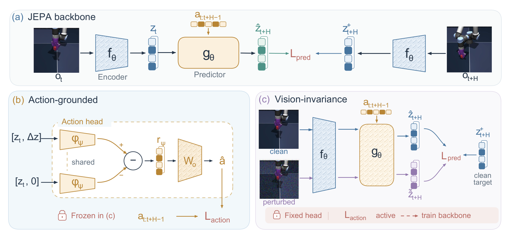
*AVL 三机制总览：(a) JEPA 骨干（encoder/predictor/L_pred）；(b) action-grounded 通路——共享动作头做零转移差分得转移归因响应、L_action；(c) vision-invariance 通路——clean/perturbed 共享编码与预测、对齐到 clean target，动作头冻结（锁标）但损失保持激活、只训骨干。*

## 闭环与扰动：干净匹配、扰动数倍领先

闭环协议（sec:experiments 4.1/4.2）：CEM 采样规划（300 候选/30 迭代/30 精英）、预测、滚动与动作块大小都取 5、每模型 10 seeds × 50 episodes；**AG 辅助头评测时剥离**——规划用原 LEWM 架构与接口，不引入额外模块。

干净环境（Table 2）：

| 模型 | TwoRoom | PushT | Reacher | Cube |
|---|---|---|---|---|
| PLDM | 91.7±1.3 | 78.1±1.7 | 78.3±2.4 | 65.2±1.5 |
| LEWM | 88.4±2.3 | 96.0±3.5 | 86.4±4.4 | 73.2±6.8 |
| Action-grounded | 92.8±2.4 | 95.5±1.9 | 82.4±3.9 | 69.1±5.6 |
| Vision-invariance | 85.2±3.2 | 91.6±3.7 | 84.0±2.8 | 72.4±7.8 |
| **AVL** | **93.2±1.6** | **96.0±1.3** | 85.2±4.4 | **78.2±5.3** |

AVL 在 TwoRoom/PushT/Cube 三任务最佳；Reacher 上 85.2 未超 LEWM 86.4（vision-invariance 单通路 84.0 也强）——干净环境总体匹配或超越，两条单通路各补一半：AG 给干净基线、VI 有干净代价（TwoRoom 85.2 vs AG 92.8）。

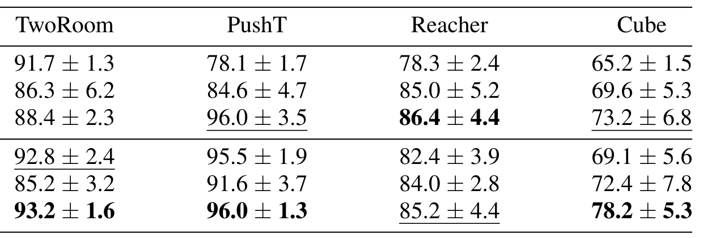
*干净闭环结果表：四任务 × 六模型行（PLDM/SD-JEPA/LEWM/Action-grounded/Vision-invariance/AVL），均值±标准差，最佳加粗、次佳下划线。*

扰动条件的差距才是论文主题。Gaussian σ=0.10（Table 4）：

| 模型 | TwoRoom | PushT | Reacher |
|---|---|---|---|
| LEWM | 65.7±3.9 | 15.3±5.8 | 42.6±3.4 |
| Action-grounded | 76.0±1.6 | 10.0±2.8 | 82.6±3.3 |
| Vision-invariance | 82.6±2.9 | 31.3±4.1 | **84.0±2.8** |
| **AVL** | **88.7±1.9** | **81.5±4.1** | 78.2±4.4 |

**PushT 上 81.5 vs 15.3——五倍以上**。亮度/饱和度偏移的八张表（Table 5–12）呈同样模式：AVL 普遍大幅领先，LEWM 在视觉扰动下大幅退化。

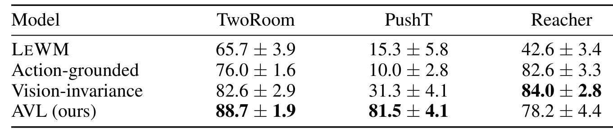
*Gaussian 策略输入噪声 σ=0.10 的闭环结果：三任务 × 四模型，AVL 在 TwoRoom/PushT 大幅领先（PushT 81.5 vs LeWM 15.3）。*

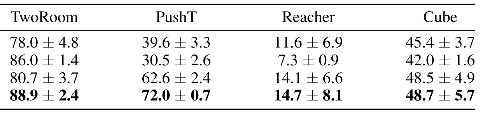
*亮度偏移 +0.20 条件的闭环结果表：同构四行 × 任务列。*

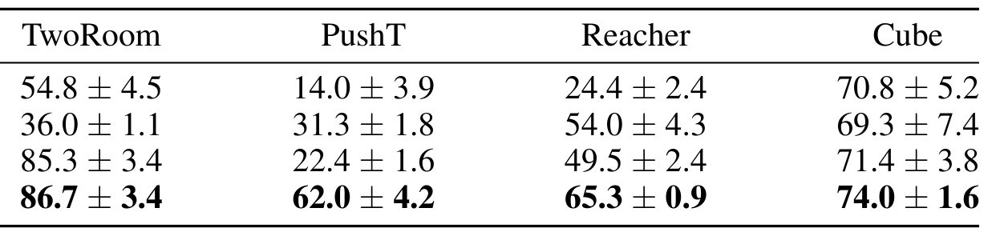
*饱和度偏移 +0.35 条件的闭环结果表。*

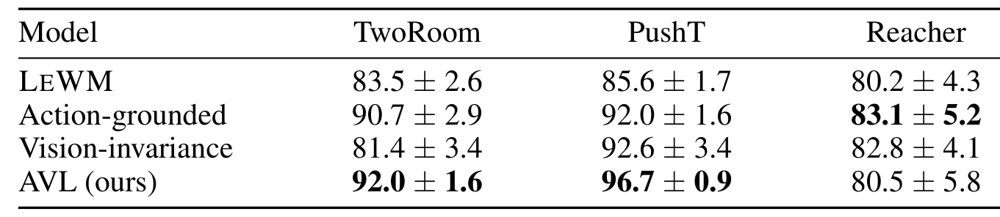
*Gaussian σ=0.03 条件的闭环结果表。*

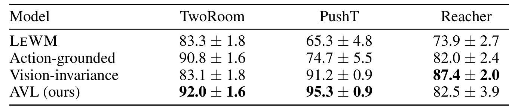
*Gaussian σ=0.05 条件的闭环结果表。*

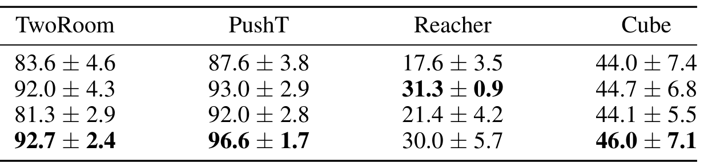
*亮度偏移 −0.10 条件的闭环结果表。*

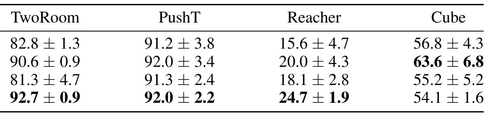
*亮度偏移 +0.10 条件的闭环结果表。*

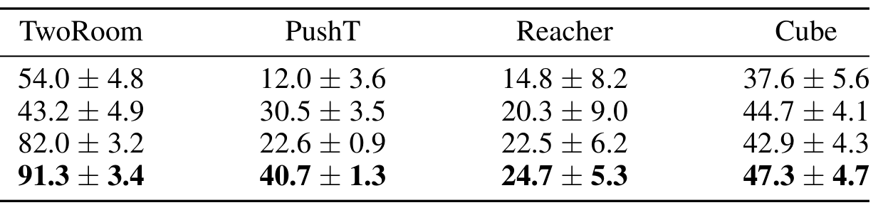
*亮度偏移 −0.20 条件的闭环结果表。*

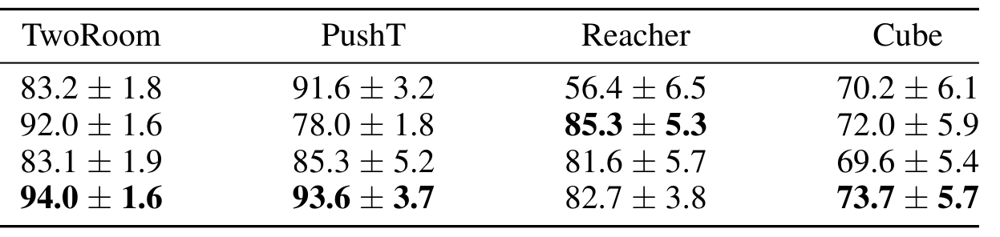
*饱和度偏移 +0.15 条件的闭环结果表。*

## 三类机制评测

**干净-噪声一致性**（Table 1 + 式 16 定义）：AVL 在 TwoRoom/PushT 的五指标全部最佳——PushT 上 Spearman **0.998**（LeWM 0.809）、Top-1 一致 **93.0%**（45.3%）、action-to-nuisance 比 **19.23**（2.35）、nuisance drift **1.07**（6.15）。对 Action-grounded 的叠加增量带置信区间：Spearman +0.0808（95% CI [0.0646, 0.0987]）、Top-1 +16.3pt（[9.7, 23.0]）、drift −3.318（[−3.579, −3.074]）——**drift 降与 action 分离保留同时发生，是缓解 collapse 而非全面压制 latent 变化**（作者论证）。

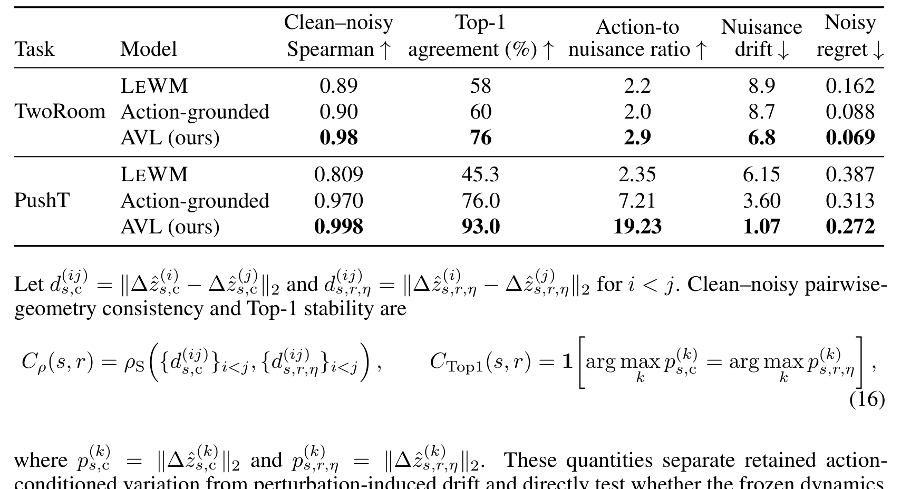
*干净-噪声动态一致性表：TwoRoom/PushT × 五指标（Spearman/Top-1/action-to-nuisance 比/nuisance drift/noisy regret），AVL 全指标加粗最佳；下方为式 16 的一致性与 Top-1 稳定性定义。*

**反事实物理后果对齐**（Fig.4）：预测候选转移按物理后果排序的能力——Spearman TwoRoom 0.346→**0.531**、PushT 0.192→**0.851**、Reacher 0.072→**0.536**、Cube 0.018→**0.214**；normalized regret 同步下降（TwoRoom 0.152→0.061）；Top-1/Top-3 选择准确率提升。

**定向擦除**（Fig.5）：把用于后果排序的 latent 维度选择性擦除（k ∈ {1,2,3,5,8}），Spearman 下降、regret 上升——**被保留方向对反事实排序有因果贡献**，这是干预式证据（不是相关性）。

## 边界与搬走的东西

边界：任务为连续控制仿真套件（TwoRoom/PushT/Reacher/OGBench Cube）——无真机；评测绑定 LeWorldModel 采样规划器族（AG 头评测时剥离，结论在该接口下成立）；λ₂=5 由 TwoRoom sweep 选出、跨任务未重扫；ICLR 2027 在投、无代码开源标注；作者标注的视觉扰动为策略输入级（非观测级渲染扰动）。

值得直接搬走的设计：

- **零转移基线差分的动作头**：$r_\psi(z_t,0)=0$ 精确恒等——任何「转移归因」需求（RL critic/世界模型诊断）可直接套用；
- **冻结头 + 激活损失的防捷径组合**：对齐类约束（对比学习、一致性正则）都存在「丢信息求相似」捷径——这个组合是通用堵法；
- **λ₂ sweep 的两段平台**（0.05→5 增 7.6pt、10 无增益）：动作辅助损失权重的选择模板；
- **三类机制评测工具链**（干净-噪声一致性/反事实对齐/定向擦除）：独立于 AVL，可复用为任何 latent world model 的因果性审计。

**尚不能确定**：collapse 在真实渲染/视频世界模型中的发生率（任务均为低维连续控制）；动作锚定在长视界（H > 5 blocks）下的稳定性；该诊断能否迁移到 VLA 的 latent 空间（动作头换成语言或动作的离散头）。
