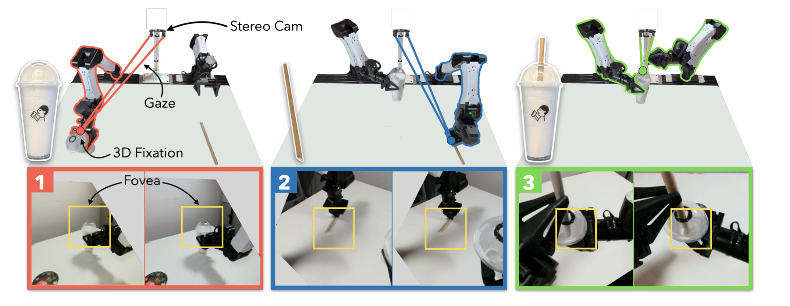
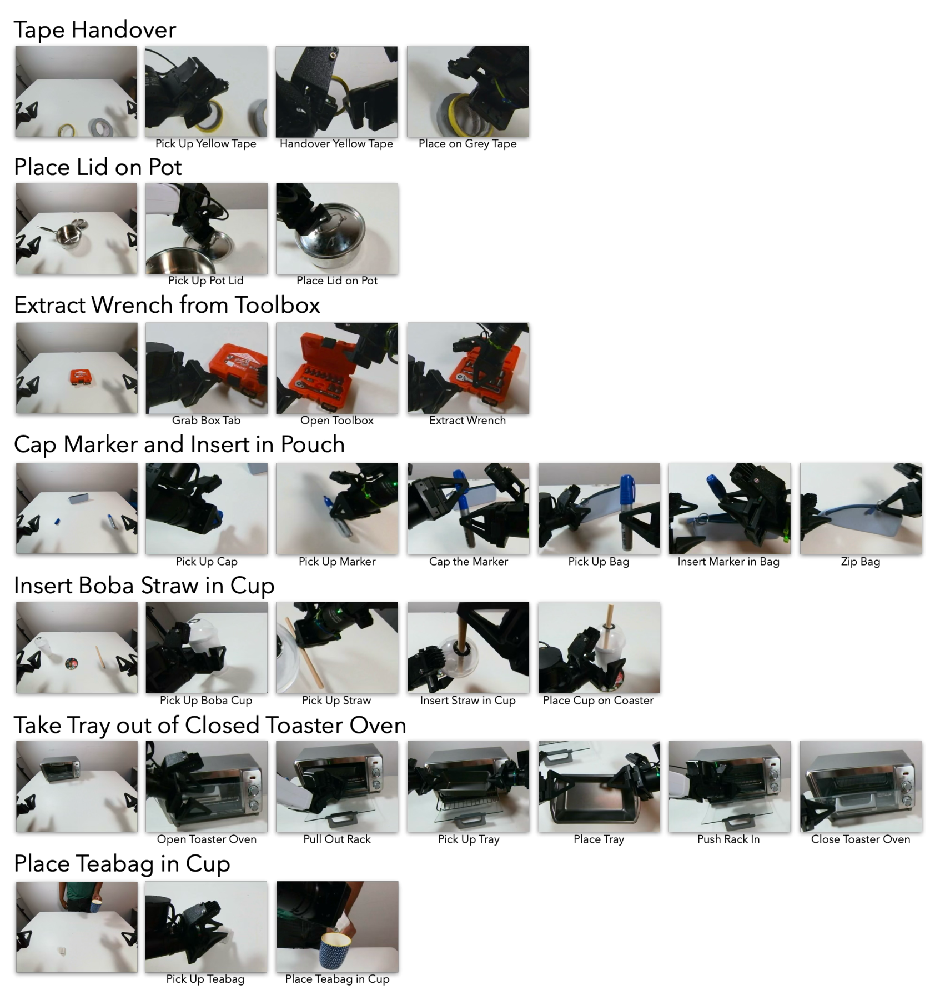
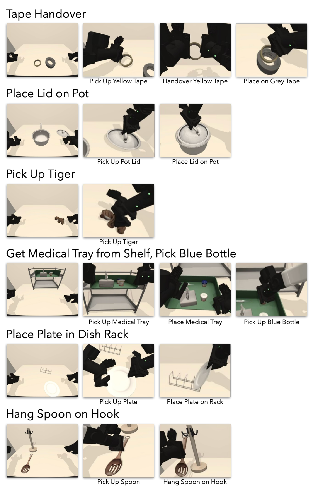
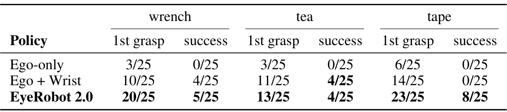
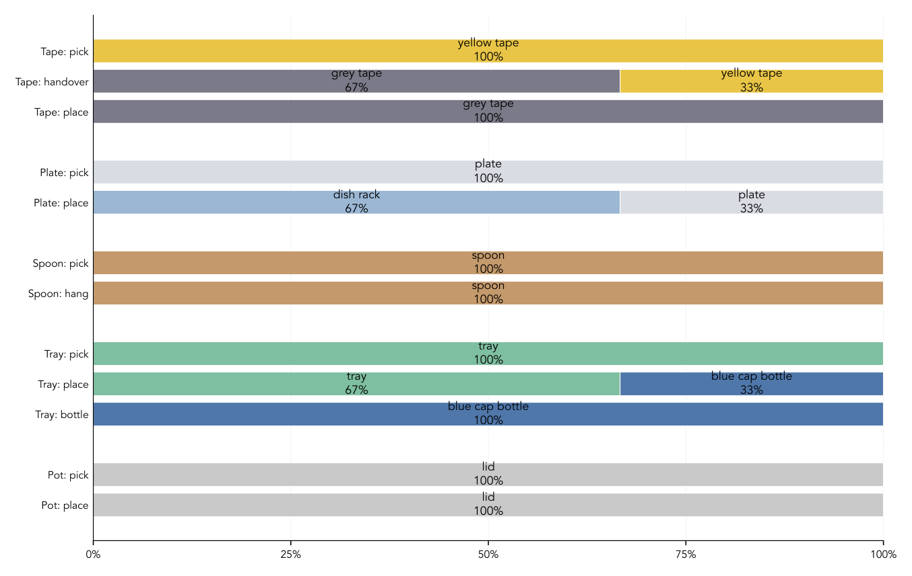
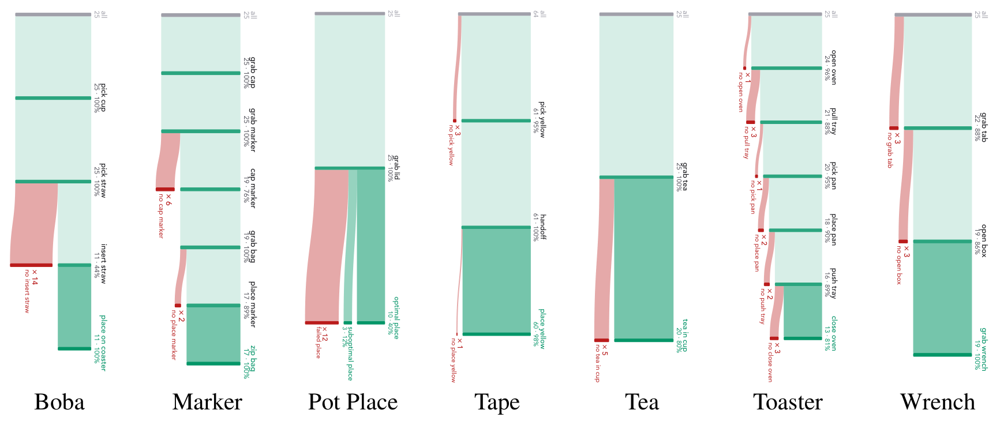
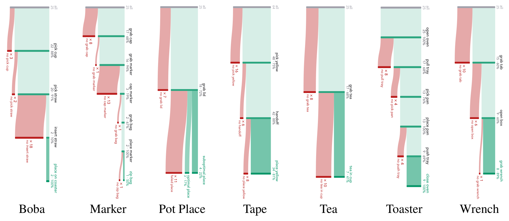
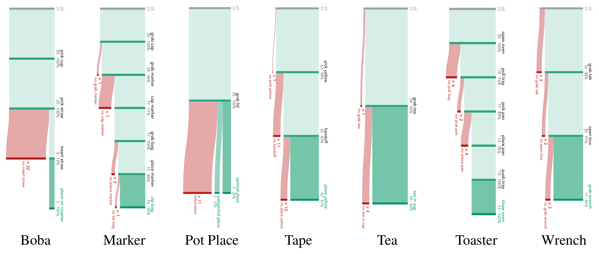
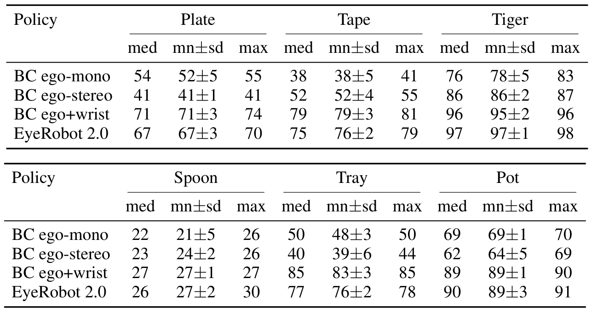

# EyeRobot 2.0: Active Gaze for Precise Manipulation without Wrist Cameras

> **arXiv:2610.03710** · cs.RO · UC Berkeley / Amazon FAR / Stanford University
> Kush Hari*, Justin Kerr*, Nidhya Shivakumar, Samarth Mahapatra, Carmelo Sferrazza, Jiahui Lei, Jitendra Malik, C. Karen Liu, Ken Goldberg†, Angjoo Kanazawa†（*等同贡献，†共同指导）· 项目页 https://eyerobot2.github.io

这篇论文回答一个很工程的问题：**双臂精细操作离不开腕部相机吗？** 作者给出的答案是否定的——用一个固定在基座上方的 stereo 相机，让两只「眼睛」主动转向任务相关的 3D 注视点，就能在抓握物体遮挡腕部视野的场景里反超 ego+wrist 基线一倍以上。对做 manipulation 系统的人来说，这等于多了一条「主动视觉」的硬件路线可选。

## 为什么去掉腕部相机会损失 25 个百分点

近年的双臂操作系统几乎默认在夹爪上装腕相机：它把高分辨率图像送到操作发生的地方。但论文把绑定的代价摆得很清楚——工具使用时腕相机必然被遮挡、夹爪运动带来 motion blur、相机直接挤占夹爪的机械设计空间。作者的量化起点（摘要，sec:preamble）：同一套训练数据下，**去掉腕相机、只留被动 stereo，真机平均成功率从 52% 掉到 27%**。这就是所有基线的痛处。

纯 ego 行为克隆也补不上这个缺口。实验部分（sec:results）显示，ego 政策强烈过拟合训练摆放位置——tape handover 的数据是在 8×8 网格上收的，ego 政策就只会网格；更根本的是缺视觉敏锐度：marker 插入只有 4%、吸管插入只有 8%。而人做这种任务靠的是**注视（fixation）**：高分辨率 fovea 指向感兴趣处、扫视预判手部动作、注视点本身充当空间推理的 3D 锚点。

## 核心思想：把「看哪里」变成物理动作——Active Visual Fixation

EyeRobot 2.0 的提议是把「注意」物理化。相机不再是被动传感器，而是由策略控制的执行器：**两眼 swivel 到一个 3D fixation point 上**，后续一切设计都围绕这个注视点展开。

*EyeRobot 2.0 总览：双目注视 3D fixation point，foveated multi-crop 把视觉预算花在注视方向；三阶段展示 boba 插吸管任务中注视序列与夹爪动作的耦合。*

整体框架是三个耦合的机制（sec:preamble / sec:introduction）：

- **Foveated stereo multi-crops**：以注视点为中心取多分辨率图像金字塔，把更多视觉计算量分配到图像中心——计算预算集中于注视方向，等效于在物理层面忽略无关区域。
- **层级注视策略**：低层是 goal-conditioned 的 gaze servoing 策略（RL 训练，dense geometric reward），负责快速找到并盯住指定 3D 物体；高层是 target selector，按任务进度决定「现在该看什么、什么时候切换」——它与 BC 夹爪策略 **co-train**，所以学出来的注视序列会接近人的直觉（物体被抓起后视线离开）。
- **Fixation-canonicalized 动作**：夹爪的 SE(3) 本体感知与动作 chunk 全部旋进注视坐标系。这步是纯表示层面的改动，但作者把它视为关键：动作分布被压缩到任务相关的局部区域。

## 四件套如何协同：按执行顺序走一遍

按一次闭环执行的顺序串起来（我的分析，依据 sec:introduction 与摘要）：target selector 先从当前观测输出一个注视目标（语义对象级）；gaze servoing 策略随即驱动两眼收敛到该目标的 3D fixation point——实验协议里 gaze 稳定约 1 秒后才开始动作（sec:results）。接着以注视点为中心的金字塔 multi-crop 进入夹爪策略，同时注入注视点距离作为深度锚点观测；夹爪策略（ACT 架构行为克隆，chunk 1.5 秒）在 fixation-relative SE(3) 坐标系里输出动作 chunk。任务推进后 target selector 切换目标，循环回到第一步。

值得强调的细节：stereo 深度不是可选项——stereo 消融（单眼、无注视深度输入）平均掉 18%（sec:ablations），注视点距离作为观测锚点承担了相当一部分空间理解。

## 实验设计：同数据从零训练的严格对照

这部分是论文最扎实的工程贡献之一（sec:experiments）。为了做干净对照，作者**自己收全部数据、所有策略从零训练**——避开「off-the-shelf 模型预训练分布未知」的混淆，代价是实验量上一个数量级。

- 平台：14-DoF 双臂 I2RT YAM，双目各 120° 对角 FOV、1600×1200，相机装在基座上方 35cm、下视 45°；GELLO 改装的 leader arm 遥操作。
- 任务：7 个真机任务（含 boba 插吸管、marker 上盖装袋、工具箱取扳手、烤面包机取盘等多阶段任务）+ 6 个 MuJoCo 仿真任务；每任务 10–53 分钟遥操作数据。
- 仿真明确定位为**数字孪生**而非 sim-to-real：非针孔相机用 pinhole 渲染+warp 精确匹配真机相机特性，MuJoCo 用 MJ-Playground 公开标定参数。
- 评测协议：真机每任务 25 个场景（三策略共享完全相同的测试摆放，实时相机流叠加对齐）、3 seeds 选 1；仿真每任务 100 个未见过配置、3 seeds 取最大；阶段成功由 MuJoCo 物理要求程序化判定。总量 **1000+ 真机、1800 仿真 trials**。

任务与阶段分解见两张任务图：

*真机 7 任务与阶段分解：每任务给出起始布局与逐步动作说明（取杯、取吸管、插入、放杯垫等）。*

*仿真 6 任务分解：MuJoCo 数字孪生中的基本 pick/place 系列（含医疗托盘取蓝瓶、挂勺等任务）。*

## 结果一：对被动 stereo 与腕相机的全面对照

**vs 被动 stereo（同 observability，无注视）**：13 个任务全部显著领先，平均真机 **+40%**、仿真 +20%（Fig. 6，sec:results）。精确任务的反差最极端：marker 插入 **68% vs 4%**、吸管插入 **44% vs 8%**——同样的 stereo 数据流，foveate 之后敏锐度完全不同。

**vs ego+wrist（三相机）**：分两种情形。腕相机视野清晰时两者相当（**69% vs 64%**）；被抓握物体遮挡时（boba、pot 两任务），ego+wrist 塌回被动 stereo 水平，EyeRobot 2.0 保持 **48% vs 22%**——整体 2× 优势。tape handover 上 wrist 相机同样过拟合网格分布：装着 tape 的那只腕相机直到放置前都被遮挡，那时已不可挽回。

**干扰物鲁棒性**：往桌上随机撒彩色干扰物后（每策略每任务 25 场景、共享摆放），first grasp 成功率的差距比 end-to-end 更大（tape：23/25 vs 14/25 vs 6/25）。作者的解释（论文报告）：wrist 政策常去抓视野里最大或最显眼的物体，一旦开始 reach 就无法恢复；EyeRobot 的失败模式则是「看错了地方就抓错」——多数 miss 发生在注视方向错误时。**主动注视 = 物理化的无关信息忽略**，这是我读到的最干净的一组对照。

*干扰物真机对照：三策略在 wrench、tea、tape 三任务上的首次抓取与端到端成功数（满分 25）。*

## 结果二：消融把增益拆给三个机制

真机消融（Table 2，sec:results）：

| 配置 | 平均成功率 |
|---|---|
| EyeRobot 2.0 完整 | 66.5% |
| − foveation（单外围视图） | 46.5% |
| − stereo（单眼无深度） | 48.5% |

仿真消融（sec:ablations）里最有信息量的一行：把 fixation-relative 动作换回 world frame，**掉 21%、与 gaze-free ego 基线持平**——注视还在，但全局输出空间仍允许低数据 regime 下的位置过拟合。这说明 gaze 的增益要通过动作坐标系才能兑现，两个机制不是独立叠加关系。

foveation 消融出现一个真机/仿真反差：**真机掉 20%，仿真不掉**。作者的解读是仿真执行方差极小，而真机逐次执行有差异、需要闭环视觉伺服——这是作者的解释（尚未单独验证的假说），但它提示一个对所有机器人仿真评测都重要的教训：**仿真结果不能外推闭环视觉伺服需求**。

## 逐阶段失败分析：Sankey 视角

附录提供了三个策略的逐阶段条件成功率（每任务 25 次物理 trials）。静态 stereo 政策的失败集中在需要精度的阶段（marker 与吸管插入），而 EyeRobot 2.0 的失败更多分布在早期抓取而非末端插入。注视目标选择的分析（sec:appendix）显示 gaze 选择与动作-物体组合高度一致：pick 时看向物体本身，handover/place 时移向目标位置。

*注视目标选择分布：每行一个动作-物体组合，分段为该步注视指向的对象占比——pick 高度指向物体本身，place/handover 转向目标容器或对侧夹爪。*

*EyeRobot 2.0 的逐阶段条件成功率：绿色为阶段通过、红色为对应失败分支；失败前移到早期抓取而非末端插入。*

*Ego-only 基线的逐阶段成功率：需要精度的插入阶段大面积失败，静态视野缺乏敏锐度的直接后果。*

*Ego+Wrist 基线的逐阶段成功率：腕相机被遮挡的任务（boba、pot）中段塌方，与被动 stereo 的失败模式趋同。*

仿真全量统计（3 seeds，med、mn±sd、max 三列对照四个策略）：

*仿真全量成功率统计：六个仿真任务上四策略的 med/mn±sd/max，含 3 seeds 完整统计。*

## 边界与未证之事

把作者主张、论文证据与我的分析分开说：

- **作者明确标注的局限**：单任务训练（无多任务扩展）；target selector 需要大语料才能支持通用 prompt（作者提出 VLM 生成 prompt 是可能的架构方向）；不控制头颈，只协调眼球级运动；注视停在对象级，无子对象级 gaze。
- **协议边界（论文证据可证）**：全部结论限于「从零、单任务、每任务 25 场景」regime；仿真是数字孪生对照而非 sim-to-real 主张。
- **我的分析**：foveation 的「闭环视觉伺服」机制解释、以及「注视序列 resembles human」的说法，都停留在定性观察层面，论文没有单独实验隔离这两个说法；跨任务与预训练 regime 下 fixation-relative 动作是否仍必要，是这套设计最值得追问的后续问题。

## 值得直接搬走的东西

- **Fixation-relative SE(3) canonicalization**：一行坐标系变换换 20% 级增益，可移植到任何夹爪策略的动作空间设计。
- **Foveated multi-crop 输入**：把视觉预算集中到注视方向，适配任何分辨率受限的机械视觉系统。
- **Target selector 与夹爪策略 co-training**：让语义级目标选择从任务进度学注视序列，而非手工状态机。
- **严格对照协议**：同数据从零训练 + 共享测试摆放 + 程序化阶段判定，任何新机器人系统的评测都值得照抄。
- **仿真不掉、真机掉** 的消融模式：给所有「仿真验证够了」的论文提了个醒。

**尚不能确定**：AVF 扩到 VLA 主干后的延迟与算力代价（论文未涉及）；多任务 regime 下 target selector 的泛化行为（作者列为 future work）；子对象级注视的增益幅度（未实验）。
