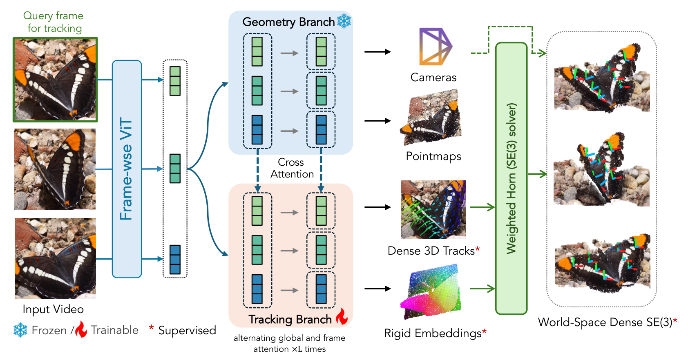
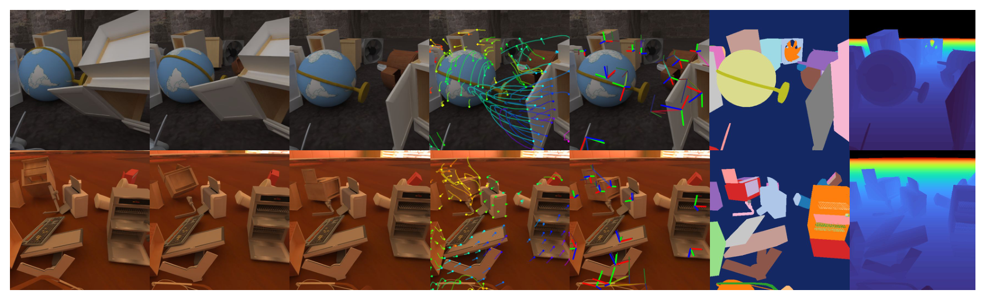
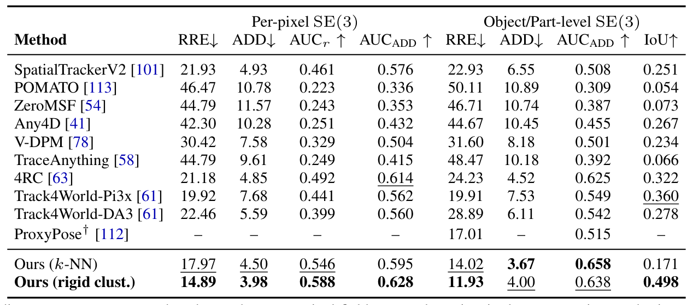
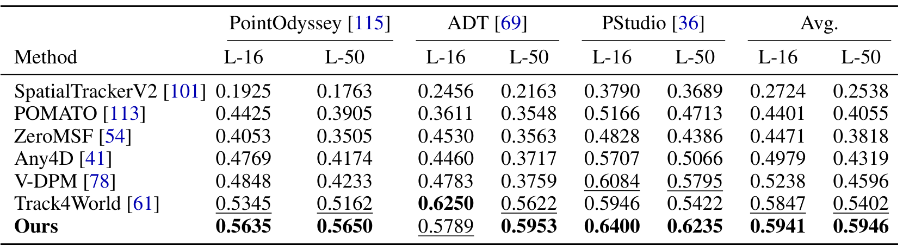
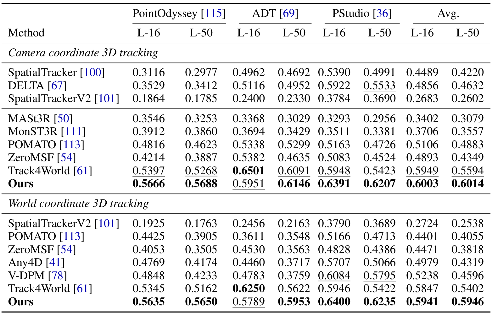
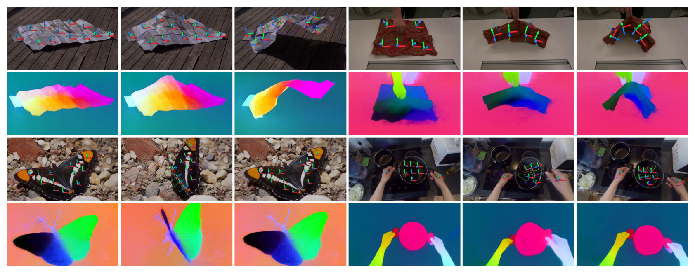
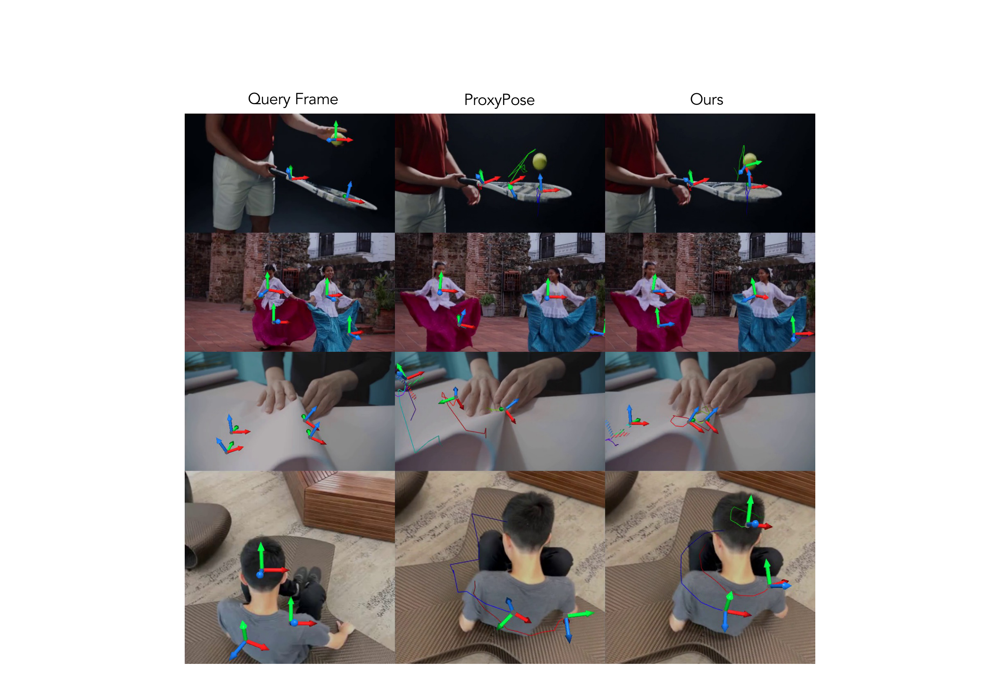
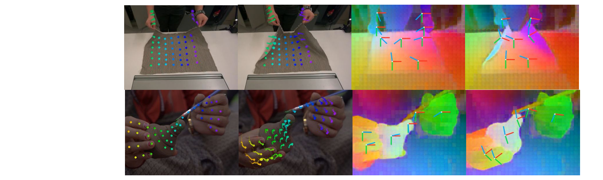

# MoSE3: Learning World-Space SE(3) at Every Pixel

> **arXiv:2610.03716** · cs.CV · NeurIPS 2026 Spotlight
> Jiahuan Cheng\*¹³, Zhiyi Li\*⁴, Tian Xia\*¹, Ruojin Cai¹², Yilun Du¹², Qianqian Wang¹²（\*等同贡献；¹ Harvard / ² Kempner Institute / ³ Johns Hopkins / ⁴ MIT）· 项目页 https://mose3-tracker.github.io

这篇论文把「场景怎么动」的表征从 3-DoF 升到 6-DoF：**每个像素输出一个世界系的完整 SE(3) 刚性变换**——哪里去、转了多少、和哪些像素作为同一个刚体一起动，一次前馈全部给出。对做操作感知和动态场景理解的人来说，这是把点跟踪（point tracking）升格为可微分 SE(3) 场的一条干净路线。

## 点跟踪缺了什么：从 3-DoF 到 6-DoF

Dense 3D point tracking 是当前动态场景运动建模的主流范式，但论文开头就点破它的天花板（sec:abstract）：**一条点轨迹只是每个像素的 3-DoF 平移曲线**——它告诉你像素去哪，不告诉你它下面的部件转了多少，也不告诉你哪些像素作为同一个刚体一起动。操作场景里真正需要的恰恰是后两样：抓取规划要物体位姿，接触推理要刚体分组。

那为什么不直接回归 per-pixel SE(3)？两个硬约束（sec:method）：旋转躺在弯曲流形上，不适合欧氏空间的神经回归；SE(3) 标注极难获取，监督稀缺。直接回归的消融数字后面会看到——iTACO 上 RRE 24.57° 对完整方法的 17.27°，且泛化差。

## 核心分解：两个易学中间量 + 闭式恢复

MoSE3 的关键观察（sec:method）：**SE(3) 预测可以约化成两个更容易学、更容易泛化的中间量**——

一是 **3D 点轨迹** $X^w_i$——点跟踪监督广泛存在，且纯合成数据训练的点跟踪器已经能泛化到真实视频；二是 **rigidity embedding** $E_q \in \mathbb{R}^{H \times W \times D}$（L2 归一化）——训练让同一刚体上的像素产生相近表示，「哪些像素一起动」本身成为可学习目标。

从这两者出发，每个像素 $u$ 的 SE(3) 用 **weighted Horn（Procrustes）**闭式恢复：

$$T_{q \to i}(u) = \arg\min_{\hat T \in SE(3)} \sum_{v \in G} w(u, v) \left\| \hat T \cdot X^w_q(v) - X^w_i(v) \right\|$$

权重 $w(u,v)$ 是 rigidity embedding 内积在温度 $\tau$ 下的 softmax——$w$ 度量「$v$ 与 $u$ 有多刚性地共动」，于是这个拟合只对 $u$ 的刚性邻居做对齐。**Horn 拟合闭式且可微**，SE(3) 监督能穿过它端到端回流到轨迹与 embedding 两个头。这是整个设计的杠杆点：难的流形输出被解析恢复替代，梯度照样通。

*方法总览：π3 冻结几何分支（cameras、pointmaps）+ 可训练 tracking 分支（dense 3D tracks、rigid embeddings，cross attention 交互）；weighted Horn solver 输出 world-space dense SE(3)。❄️ 冻结 / 🔥 可训练 / \* 受监督。*

## 监督与架构：联合训练与 π3 并行分支

监督分四路（sec:method / sec:dataset）：跟踪侧是四个几何项（$\mathcal{L}_{uv}$、$\mathcal{L}_z$、表面梯度 $\mathcal{L}_\nabla$、时间位移 $\mathcal{L}_\Delta$）加可见性 BCE；rigidity embedding 侧是**双 affinity 目标**——有 SE(3) 标注的源用 SE(3) affinity（按 ground-truth 变换差的核函数构造目标分布，连续地随运动轨迹差异变化），全部源都用 tracking affinity（免标签，从轨迹几何构造）；最后是穿过 Horn 拟合的 SE(3) 损失。

架构（附录 B.1）是「在冻结大骨干上加新能力」的干净样例：π3-Large 36 层 decoder 中 0–9 层共享冻结，10–35 层并行一条 26 层可训练 tracking 分支——每个分支块从同层 π3 decoder 块初始化，QKV 复制成 tracking 侧可训练三元组加几何侧冻结 KV；单一 softmax 在两条并行流的表示上分配注意力，无显式门控。

## Art-Kubric 与训练配方

为补 articulated 多物体交互的数据缺口，作者造了 **Art-Kubric**（sec:abstract）：合成 articulated 物体丰富物理交互、dense SE(3) + rigidity 标注。训练混合 6 源（sec:dataset）：Kubric CoTracker3 split 26%、Art-Kubric 26%、Syn4D 20%、SynthVerse 16%、PointOdyssey 8%、Dynamic Replica 4%——其中前三者带 per-pixel 刚体划分与 per-body SE(3) 标签，SE(3) affinity 与 SE(3) 损失只在这三源上监督；tracking affinity 免标签、全源适用。

*Art-Kubric 数据集总览：两个场景各八列——三帧 RGB → 特征点 → 轨迹 → 3D 坐标轴 → 分割 → 深度，展示数据引擎产出的全套标注。*

训练细节（附录 C.1）：4×H200、80 epochs × 800 iterations、有效 batch 4 序列/步、AdamW 峰值 lr 2e-5 cosine 衰减；每序列采样 16–24 帧、stride 1–4、分辨率随机化（长宽比 0.5–2.0、10 万–25.5 万像素）。

## SE(3) 主结果：双粒度全指标最佳

评测（sec:experiments）覆盖 HO3D（真机手-物刚体交互）、iTACO（合成 articulated 多体）、YCBInEOAT（真机臂操作）。基线协议对基线相当宽容：9 个 3D 跟踪方法统一加「k-NN 邻域 + Horn」后处理，且**逐 clip 扫 $K \in \{4,...,256\}$ 取最优**——所以基线数字是它们的上界。

即便如此（Table 1，sec:experiments）：

| 方法（HO3D） | per-pixel RRE↓ | per-pixel ADD↓ | object IoU↑ |
|---|---|---|---|
| 最强基线（Track4World-DA3） | 34.61° | 3.34cm | 0.383 |
| Ours（k-NN） | 24.09° | 2.61cm | 0.504 |
| **Ours（rigid clust.）** | **18.28°** | **2.16cm** | **0.709** |

iTACO 上优势更大（articulated 多体场景）：rigid clust. RRE 12.30°、AUCr 0.741、cluster IoU 0.784。两个信息量大的对照：**即使同用 k-NN 管线，MoSE3 也全指标赢过所有基线**——联合 SE(3) 监督改善了轨迹本身；**rigidity embedding 聚类比 k-NN 再抬一档**——可学习的刚体分组优于几何近邻假设。

*YCBInEOAT 真机臂操作评测：Per-pixel 与 Object/Part-level 各四指标，11 个方法行；Ours（rigid clust.）RRE 11.93°、cluster IoU 0.498 全面最佳（次优 0.360）。*

3D 跟踪侧（TAPVid-3D 协议，PointOdyssey/ADT/PStudio）也顺带拿了 SOTA 平均精度：

*世界系 3D 点跟踪对比：L-16/L-50 两视界 + Avg，Ours 0.5635/0.5650（PointOdyssey）、Avg 0.5941/0.5946 全场最佳。*

*相机系（上）+世界系（下）双段完整对比：八个指标列 Ours 两段领先，仅相机系 ADT L-16 一列让 Track4World 以 0.6250 领先。*

## 四组消融：分解为什么必要

消融用 reduced schedule 在 iTACO per-pixel 上跑（Table 3，sec:experiments）：

| 变体 | RRE↓ | AUCr↑ | ADD↓ | AUCADD↑ |
|---|---|---|---|---|
| (a) 直接 SE(3) 回归 | 24.57 | 0.525 | 19.05 | 0.393 |
| (b) 去 Art-Kubric | 22.89 | 0.566 | 17.01 | 0.462 |
| (c) track-only + k-NN | 31.11 | 0.453 | 20.96 | 0.382 |
| (c) track-only + rigid clust. | 24.30 | 0.550 | 18.01 | 0.460 |
| (d) 去 rigidity 损失 | 18.97 | 0.614 | 15.83 | 0.480 |
| (d) 去 SE(3) 损失 | 23.90 | 0.555 | 17.82 | 0.465 |
| **Ours（full）** | **17.27** | **0.647** | **14.09** | **0.517** |

三个值得记住的结论（作者论证，sec:experiments 5.3）：

- **(a) 分解 > 直接回归**：流形约束输出 + 标注稀缺下，直接回归学不出也泛化不了；分解把问题变成两个监督覆盖更广的易目标 + 一个解析恢复。
- **(c) 受控对照设计得很漂亮**：track-only + rigid clust. 借用 full 模型的 embedding 做分组——分组权重完全相同、只有进入 Procrustes 拟合的轨迹不同，剩下的差距（24.30 vs 17.27）**只能归因于轨迹本身**：联合 SE(3)/rigidity 监督让轨迹更 rigid-coherent。
- **(d) SE(3) 损失是最强驱动**；rigidity 损失主要塑造分组质量（cluster IoU），对 per-pixel SE(3) 影响小——两个损失分工明确。

（此处按规范保留占位说明：裁剪件右缘截断，YCBInEOAT 列与 (d) 组行缺失；完整四组消融数字以原论文第 23 页为准。）

## 真实场景泛化

作者报告：只用合成数据训练，就能在真实场景视频上强泛化（sec:abstract）——

*In-the-wild 定性结果：纸团变形、织物抓提、蝴蝶展翅、双手烹饪、气球挤压——每 clip 三时间步，上行 per-pixel SE(3) 运动、下行 rigidity embedding 分组，覆盖刚体与非刚体。*

*与 ProxyPose 的定性对比：网球拍/舞者/折纸/坐姿四场景，Query/ProxyPose/Ours 三列——Ours 的坐标轴更贴合物体部件。*

*补充定性：织物与足部的追踪与深度/分割双列展示。*

## 边界、局限与搬走的东西

作者明确标注的局限（sec:limitations）：**相机几何完全继承 π3**——pose 与 pointmap 的误差直接传播进恢复的 SE(3)；快速运动下中间量退化、SE(3) 跟着退化；**可变形场景只做定性评测**，定量 benchmark 留给 future work。我的分析：评测协议里「逐 clip Procrustes 对齐 + 扫 K 取最优」对基线宽容，这让「全面领先」的结论更稳，但也意味着真实部署没有这种逐 clip 对齐时数字会整体下移——论文没有报告不对齐的结果。

值得直接搬走的设计：

- **「难回归量 → 易学中间量 + 闭式可微恢复」**的分解模式：任何流形约束输出、标注稀缺的问题都适用（不止 SE(3)）。
- **Rigidity embedding 当聚类特征**：HDBSCAN 聚 embedding 得 object/part 分组——给机器人操作场景的物体/部件分割提供了新思路（无需语义训练）。
- **双 affinity 监督**：有标注走 SE(3) affinity、无标注走轨迹几何 affinity——标签效率模板。
- **π3 分层并行分支**（0–9 冻结共享、10–35 并行可训练、单 softmax 混合 KV）：在冻结大骨干上加新能力的参考架构。
- 推理细节：τ 训练 0.07、推理锐化到 0.01；逐 clip Procrustes 全局 scale+translation 对齐。

**尚不能确定**：per-pixel SE(3) 场直接喂下游策略（抓取规划、接触推理）的增益幅度——论文没有下游任务实验；rigidity embedding 在超长时程（>24 帧）下分组一致性如何——未评测；可变形场景定量基准缺席时，非刚体案例的「强泛化」只有定性支撑。
