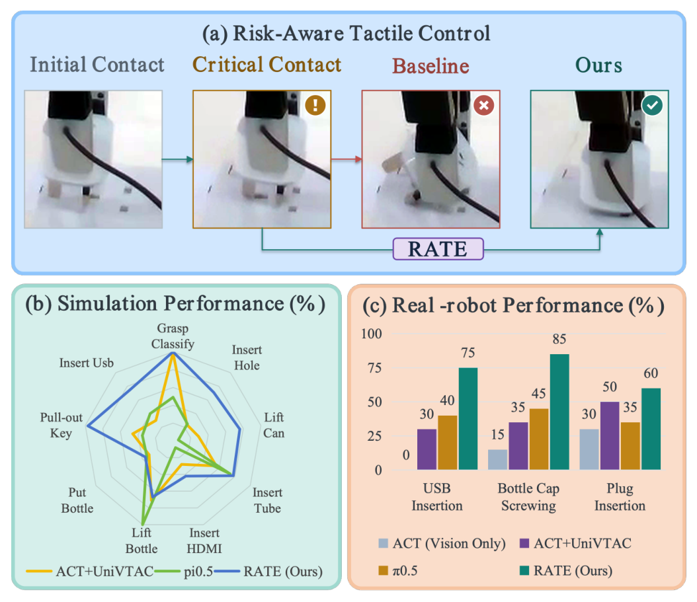
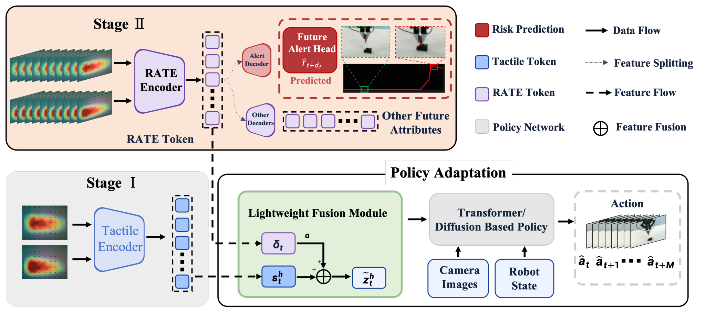
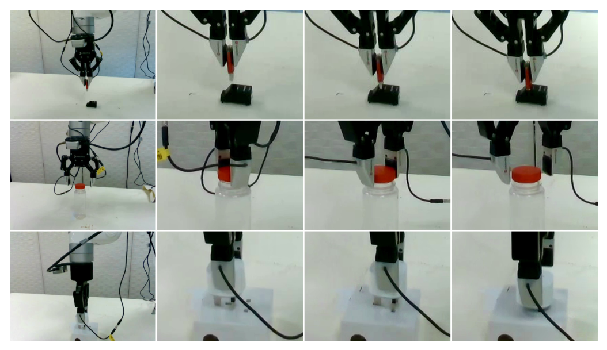

# RATE: Risk-Aware Tactile Encoding for Contact-rich Robotic Manipulation

> **arXiv:2610.03538** · cs.RO · 8 页 3 图 3 表（IEEE 会议格式）
> Yuyao Jiang, Haichao Liu, Jiarui Zheng, Zihan Ding, Weihao Yuan, Ziwei Wang · 仿真平台 Franka Panda + GelSight Mini ×2；真机 xArm 7 + Daimon 触觉 ×2

这篇论文处理触觉表示的一个盲区：**相似的触觉观测可能来自风险含义完全不同的交互条件**——传感器噪声、任务必要的变化、正在恶化的不良接触。没有上下文锚定的风险信息，下游策略会对良性变化过度纠正、对真实风险响应迟滞。RATE 的答案是把「任务条件化风险」学进触觉表示：历史条件化预测捕捉交互上下文、连续警报监督按任务风险组织这些线索，再经零初始化轻量残差通路注入冻结策略。UniVTAC 八任务宏平均 **71.8%** 全场第一，真机三任务 SR 与接触安全成功率（CSSR）双第一。

*三联总览：(a) 风险感知触觉控制示意——初始接触→临界接触后，基线（X）失败而 RATE（✓）经风险表示纠正；(b) 仿真八任务雷达图三方法对比；(c) 真机三任务柱状——USB 插入 75%、瓶盖拧转 85%、插头插入 60% 全场最高。*

## 触觉的歧义：相似观测、迥异风险

问题设定（sec:preamble）：接触富操作里触觉表示学习已有长足进展，但现有表示不区分「同样的触觉外观」背后的三种来源。这直接导致下游策略的两种错误：**对良性变化做不必要的纠正**（任务必要的变化被当成偏差），**对真正危险接触响应迟滞**（风险线索没有被前置表示）。作者的提法是把问题转成学习一个**互补的**风险感知表示 $z^r_t$——不替换原触觉表示，只补风险维度。

## RATE：上下文 + 警报的联合塑造

表示构造（sec:methodology III-B）按三步走：

- **双侧接触配置**：左右触觉观测过共享触觉骨干得 $f^L_k, f^R_k$，融合为 $e_k = \psi([f^L_k, f^R_k])$——任务风险来自整体接触交互而非单个传感器；
- **局部转移**：$\Delta e_k = e_k - e_{k-1}$ 捕捉特征空间里变化的方向与幅度，与 $e_k$ 联合编码 $u_k = \phi([e_k, \Delta e_k])$——相似变化在不同配置下含义不同、相似配置可演化向不同结局，所以要联合；
- **历史聚合**：两层 LSTM 聚合 $H=9$ 步（stride 5）的 $\{u_k\}$，终态 $z^r_t \in \mathbb{R}^{512}$。

预训练时同一 $z^r_t$ 挂一组辅助头（仅训练期）：接触相关量（触觉 RGB/深度/接触位姿）的短视界未来变化预测 $\Delta y_t$（$d_f=5$ 帧）+ **未来警报头** $\hat r_{t+d_f}$（连续任务条件化警报 $r_t \in [0,1]$，由各域任务相关交互信号自动导出并归一化）。未来变化预测要求 $z^r_t$ 保留「交互正在如何演化」的上下文，警报监督再**按任务风险组织**这些演化线索。标签可学性预检：当前警报预测器在八任务验证集上 MSE 0.0256。图像目标用训练集变化幅值加权回归——小空间区域的变化不被未变区主导。

*两阶段管线：Stage I 触觉编码与初始策略适配；Stage II RATE 编码、风险预测与未来属性解码——RATE token 经 Alert Decoder 进未来警报头（r̂_{t+d_f}），策略侧经轻量融合模块把 α·δ_t 与常规触觉特征 s^h_t 融合成 z̃^h_t 喂给 transformer/diffusion 策略。*

## 轻量残差适配：0.59% 参数

策略适配（sec:methodology III-C）：学到的 $z^r_t$ 映射为**有界残差** $\delta_t$、经 $\alpha$ 缩放后与常规触觉特征 $s^h_t$ 融合成 $\tilde z^h_t$，喂给下游策略；相机图像与机器人状态照常输入。**触觉编码器、视觉骨干、ACT 骨干全部冻结**——适配期只更新约 0.59% 的模型参数。部署时只用当前时刻前的观测，未来帧与警报目标仅用于训练。

## 仿真：71.8% 宏平均与接触富类领先

UniVTAC 八任务（sec:experiments IV-B）：RATE 宏平均 **71.8%**，六个任务第一或并列第一；**四个接触富任务平均 72.0%、超该类最强对照 StarVLA-α 达 23.0pt**——与设计目标（在演化交互上下文里表示任务风险）一致。公平对照：ACT+UniVTAC 用同样演示与相机配置重训后 47.4%，RATE 在接触富四任务上分别 +38/+48/+27/+41pt（Pull-out Key / Insert Hole / Insert HDMI / Insert Tube）。

## 受控消融：警报与上下文互补

消融协议（sec:experiments IV-A/C）很干净：所有变体共享同一**任务特定触觉基底**（44.0%），只变两个因子——

| 配置 | 宏平均 |
|---|---|
| 任务特定触觉基底 | 44.0 |
| + 离散序数警报 | 56.1 |
| + 连续严重度警报（入选 Full） | 57.5 |
| + 转移感知连续警报 | 56.0 |
| 仅上下文（历史条件化预测） | 56.0 |
| **Full RATE（连续警报 + 上下文）** | **71.8** |

两个因子各自独立增益（警报 +13.5pt、上下文 +12.0pt），**组合再叠加至 +27.8pt**——互补性在同一风险感知表示内成立。残差适配的受控对照：以连续警报配置为直接基线，加入历史条件化风险感知残差后接触富平均 **49.3%→72.0%**（Insert Hole 32→71、Insert HDMI 18→42）——这一对照固定任务特定静态触觉表示与警报训练，只加上下文与残差表示，隔离出残差适配的净贡献。

## 真机：SR 与 CSSR 双第一

真机设置（sec:experiments IV-A/D）：xArm 7 + xArm 平行夹爪、两个 Daimon 触觉传感器（原生测量转 GelSight-like RGB 保持接口一致）、RealSense D435 头部 + D405 腕部相机；每任务 50 演示、20 trials。瓶盖拧转的成功判据是「拧紧不皱桌布、且执行后轻力手动拧不开」。

| 方法 | USB SR/CSSR | 瓶盖 SR/CSSR | 插头 SR/CSSR |
|---|---|---|---|
| ACT（仅视觉） | 0.0 / 0.00 | 15.0 / 33.33 | 30.0 / 33.33 |
| ACT+UniVTAC | 30.0 / 0.00 | 35.0 / 85.71 | 50.0 / 70.00 |
| π0.5 | 40.0 / 62.50 | 45.0 / 55.56 | 35.0 / 57.14 |
| **RATE** | **75.0 / 93.33** | **85.0 / 100.00** | **60.0 / 83.33** |

USB 与瓶盖上超 π0.5（该两任务 SR 最强对照）达 35/40pt；插头上超 ACT+UniVTAC 10pt。**CSSR（接触安全成功率）= 成功试验中最大估计触觉深度全程低于预置阈值的比例**——作者明确标注这是过度触觉变形的代理而非直接力测量；阈值评测前固定、跨方法一致。

*真机三接触富任务照片网格（3×4）：USB 插入、瓶盖拧转、线缆/插头操作三行时序——每行展示同一平台（xArm7+Daimon 双触觉+RealSense 双相机）上的执行过程。*

## 边界与搬走的东西

边界：真机为三任务 × 20 trials 的单平台（Daimon 触觉经 RGB 转换）；警报目标由各域任务相关信号自动导出——跨任务语义可比性未验证；CSSR 是变形代理；仿真部分基线（VITaL/StarVLA-α/GigaWorld-Policy）引用公开数字、仅 ACT+UniVTAC 做了同配置重训。值得注意的负结果：**三种警报形式差距很小**（56.1/57.5/56.0）——形式选择不敏感，连续严重度仅 +1.4pt 入选；Plug Insertion 真机 60% 是三任务最低。

值得直接搬走的设计：

- **任务条件化连续警报标签**（[0,1] 归一化、域内自动导出）：任何接触富任务可套用的监督源；
- **零初始化残差适配**（α 缩放有界残差 ⊕ 常规特征）：往冻结策略安全注入信息的最小改动模式；
- **变化幅值加权回归**：图像目标里小区域变化不被未变区主导；
- **当前警报预测器预检**（MSE 0.0256）：标签可学性的设计流程模板；
- **CSSR 协议**（最大触觉深度阈值、评测前固定、跨方法一致）：SR-only 评测之外的安全维度补充。

**尚不能确定**：警报监督迁移到非触觉模态（力矩/音频）的效果；残差适配对扩散策略/VLA 骨干所需的参数比例；连续警报跨域绝对语义（归一化后不同任务的 0.5 是否同义）；CSSR 阈值选择对结论的敏感性。
