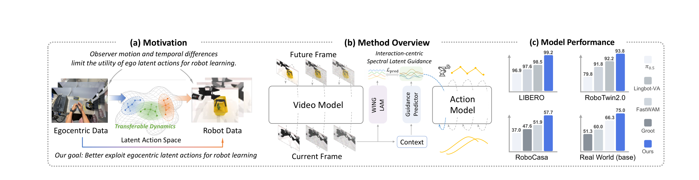
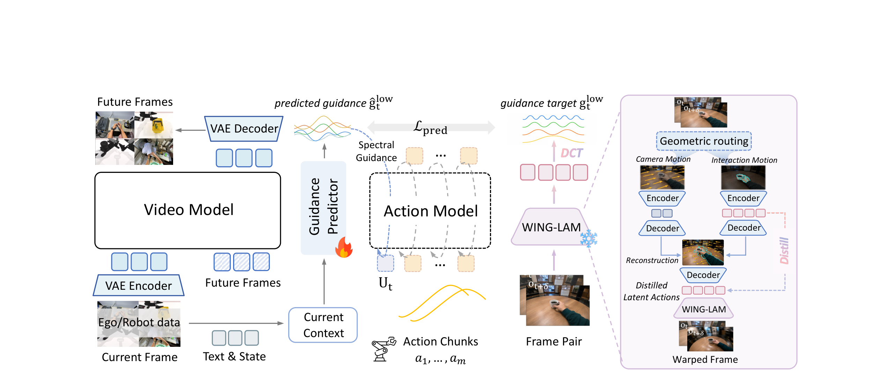
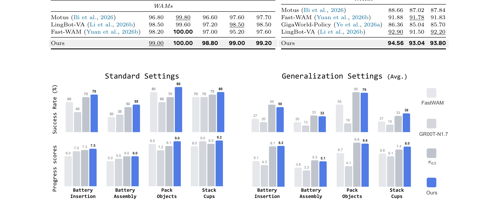
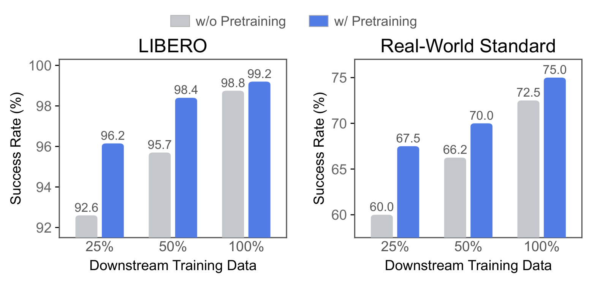
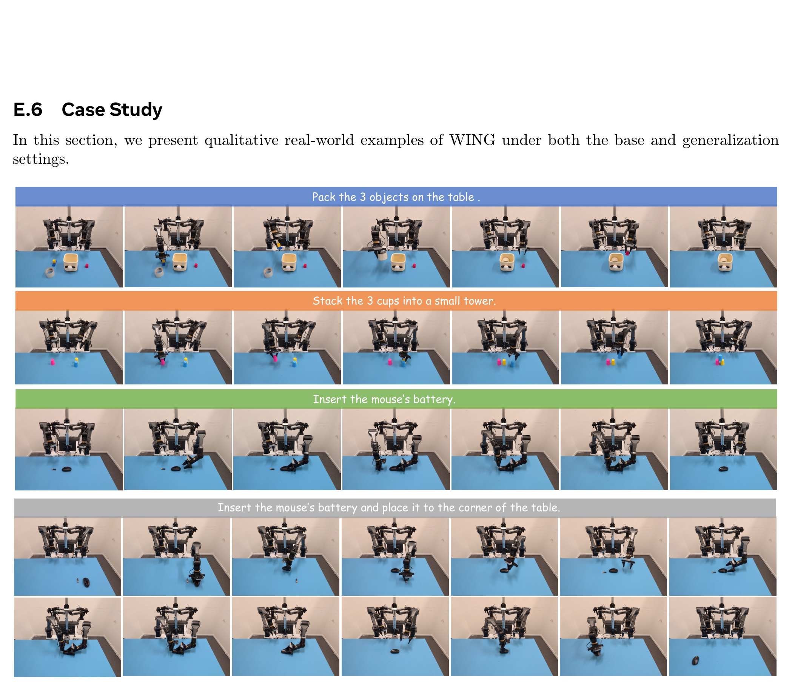
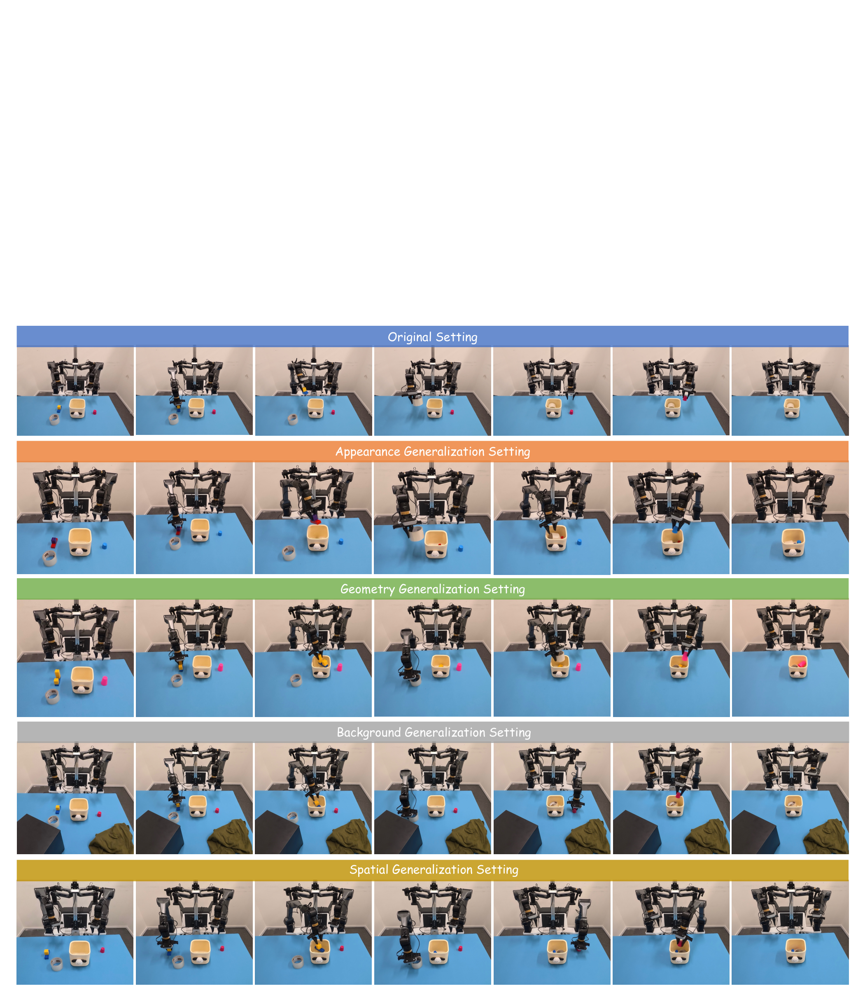
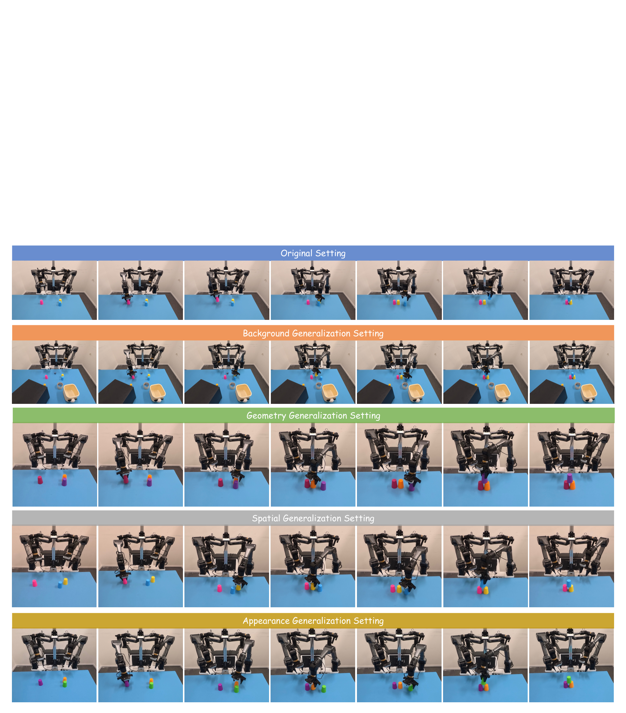

# World Action Learning via Interaction-Centric Spectral Latent Guidance

> **arXiv:2610.03607** · cs.RO · The Hong Kong University of Science and Technology
> Zhiming Liu†, Yikun Miao†, Ying Chen†, Hongrui Yin, Fangqi Zhu, Xiaoyi Pang, Quanxin Shou, Zhengyang Yan, Haodong Wang, Song Guo（†等同贡献；通讯 songguo@cse.ust.hk）· 项目页 https://mikuz12.github.io/wing/

这篇论文解决「egocentric 人类视频喂机器人策略」路径上的两个具体卡点：**latent action model 会把相机运动等 nuisance 编进表示**，以及**人与机器人执行同一交互的时间动态不同**。HKUST 的答案是把「学什么」（交互解耦）与「迁什么」（低频时间结构）分开处理，用 DCT 频域切分当跨本体迁移界面——LIBERO 99.2 / RoboTwin 2.0 93.8 / RoboCasa-GR1 57.7 / 真机标准设置 75.0，四个 benchmark 全部第一。

*三联总览：(a) 动机——ego 数据与机器人数据共享可迁移动态；(b) 方法概览——交互中心的频谱潜引导；(c) 四 benchmark 柱状对比（LIBERO 99.2 / RoboTwin 93.8 / RoboCasa 57.7 / Real World 75.0）。*

## ego 视频喂机器人：两个卡点

第一个卡点在**学什么**。现有 latent action model（LAM）用帧间重建训练——重建目标鼓励它捕获**一切**视觉可预测的变化，而不只是交互相关的动态。人的 ego 视频里相机随头身大幅运动，相机诱导的变化会与交互动态纠缠、甚至主导学到的 latent（sec:model）。可迁移的信息恰恰主要在手-物交互里。

第二个卡点在**怎么迁**。即使交互结构被正确捕获，人与机器人执行同一交互的方式不同——本体差异、执行速度、控制粒度都不同，细粒度时间模式差异极大（sec:preamble）。

## 关键观察：可迁移语义在低频

作者把语义匹配与不匹配的人-机交互对放在频域分析（sec:experiments Fig.3(d)）：**低频段的匹配/不匹配相似度分离远大于全轨迹与高频段**——跨本体共享的交互结构集中在缓变的时间结构里。这个观察直接决定了设计：低频分量当迁移界面，高频（本体特异的执行细节）丢弃。

## WING-LAM：运动路由与蒸馏

WING-LAM 解决「学什么」（sec:methods 3.2）。核心是显式运动路由：

- **分解**：离线点跟踪器 + 训练期区域掩码，把背景 tracks 拟合成可逆全局图像 warp $W_{t \to t+\delta}$（观察者运动目标）；补偿后每个点的残余位移 $r_{t,i}$（式 1）即交互运动目标——**全图一致的运动归观察者，局部运动归交互**。
- **双分支 teacher**：camera 分支预测全局 warp、interaction 分支预测残余位移，解码运动共同重建第二帧点位置；再加相机干预（保持交互动态、强制 latent 一致性）堵漏。
- **蒸馏（式 2）**：teacher 用了特权几何线索（点跟踪、掩码），部署时不可用——蒸馏进 RGB-only student $S_\phi$。构造相机扰动增广对（对第二帧施 warp），两对共享同一交互目标 $z^T_{t,\mathrm{int}}$、只差观察者运动；损失 = 两输入到 teacher 目标的距离 + $\lambda_{\mathrm{view}}$ 一致项——**student 在相机类图像变换下保持表示**。

## 频谱引导与整体管线

频谱引导模块解决「怎么迁」（sec:methods 3.1）：对 latent 轨迹 $z_{t:t+H}$ 做 DCT，保留前 $K$ 个低频分量 $g^{\mathrm{low}} = [\mathrm{DCT}(z_{t:t+H})]_{0:K-1}$。推理时轻量 predictor $P_\psi$ 从当前观测、指令、状态估计 $\hat g^{\mathrm{low}} = P_\psi(l, o_t, s_t)$，条件化 world-action model $\pi_\theta(a_{t:t+m} \mid l, o_t, s_t, \hat g^{\mathrm{low}})$——**人类交互先验作为高层引导，本体特异细节留给 WAM 自己生成**。

*WING 完整架构：video model + guidance predictor（预测频谱引导三色波）+ action model 生成引导目标 + DCT 分解；右侧紫框为 WING-LAM 几何路由（相机/交互双分支）与蒸馏路径。*

## 表征分析：解耦真的发生了

四个 probe（sec:experiments 4.2，Fig.3）：

- **可解码性**（MLP probe $R^2$）：teacher 与 student 都保留强交互运动信息、显著更少相机运动信息——对 DreamDojo（明显）与 CD-LAM（专为减少 action-irrelevant 变化设计、仍保留更多相机信息）都成立；
- **扰动敏感度**：逐级增强相机运动扰动下，student 的 latent 敏感度全场最低；
- **动作语义**：LARYBench 动作分类平均精度最高——鲁棒性不以丢语义为代价；
- **频域对应**：低频段分离最大（上文观察的来源）。

## 策略性能：三仿真 + 真机

仿真（sec:experiments Table 2）：LIBERO 平均 **99.20**（Spatial 99.00 / Object 100.00 / Goal 98.80 / Long 99.00——长时程套件对 Fast-WAM 95.20 的优势最明显）；RoboTwin 2.0 **93.80**（Clean 94.56 / Rand 93.04）；RoboCasa-GR1 人形桌面 **57.7**（对 FastWAM† 51.9、LDA-1B 55.4）。

真机四双臂任务（sec:experiments Fig.4）：标准设置平均 **75.0%** 全场最高；泛化设置与 π0.5 相当、进度分略高。

*真机四任务（电池插入/电池组装/装包/摞杯）标准与泛化双设置：成功率与进度分柱状，顶部 WAM 汇总表加粗最佳。*

消融（sec:experiments Table 3，无 ego 预训练对照）：去 WING-LAM（换 DreamDojo LAM）base 真机 65.0→40.3；去 DCT（全时域轨迹直接引导）65.0→36.0——两组件都必要，且 **WING-LAM 的影响在 ego 预训练启用后进一步放大**。

数据效率（Fig.12）：ego 预训练让 25% 数据档 LIBERO 92.6→96.2、真机 60.0→67.5；100% 档增益缩到 0.4pt——**低数据档收益最大**。

*数据效率双柱状：LIBERO 与 Real-World Standard 各 25%/50%/100% 三档，无/有预训练灰蓝对比。*

## 定性结果

*标准设置真机 rollouts：装包、摞杯、装电池、装电池+移位四行时序帧。*

*Pack Objects 泛化五设置：原始/外观/几何/背景/空间五行各 7 帧。*

*Stack Cups 泛化五设置：五行各 7 帧摞杯任务。*

## 边界与可搬走的东西

边界（论文证据可证的范围内）：泛化设置真机**持平** π0.5 而非超越——优势集中在标准设置；RoboCasa 的 FastWAM 为作者复现（†）；ego 预训练数据细节在附录（正文未展开）。我的分析：高频分量被整体丢弃，其中包含的精细执行细节对接触富任务是否无代价——论文没有单独评测这条；「低频=跨本体语义」是实证发现而非理论结果，换数据域后 K 的取值是否稳定未验证。

值得直接搬走的设计：

- **点跟踪器 + 区域掩码 → 全局 warp/局部残差分解**：任何 ego 视频的 nuisance 解耦都能用；
- **warp 增广对 + $\lambda_{\mathrm{view}}$ 一致性蒸馏**：把特权几何知识（teacher 的点跟踪/掩码）蒸进 RGB-only student 的模板；
- **DCT 低频保留作为跨本体迁移界面**：K 是唯一频域超参，可套在任何 latent 轨迹上；
- **「低频=跨本体语义」的实证**：可直接指导人-机数据配对与对齐损失设计。

**尚不能确定**：高频丢弃对精细接触任务的代价；ego 预训练规模扩大后增益是否持续；固定相机/第三人称场景下相机分支退化时的行为；更大 WAM 主干下频谱引导是否仍必要。
