# XGenAct: Geometry-Enhanced World Action Models through Cross-Task Generation

> **arXiv:2610.03516** · cs.RO / cs.CV / cs.LG · University of Wisconsin–Madison ¹ / University of Maryland ²
> Tingting Du\*¹, Ziyao Wang², Guoheng Sun², Ang Li†²（\*与†为作者标注）· 基于Action Images checkpoint（Zhen et al., 2026）· Wan2.2-TI2V-5B 骨干

这篇论文给 WAM（world action model）补上显式空间监督，但方式不是加专用头或分支——**把度量深度、表面法向、功能角色分割全部编码成 RGB 视频**，与 RGB 和动作流过同一个冻结 VAE、同一个 DiT、同一个 flow-matching 损失。结果：RLBench 五个 held-out 任务闭环成功率 **52%，是八个基线里最强者（26%）的两倍**；结构化感知当训练任务普遍优于 RGB-only（32.5→61.25 峰值菜单），且直接生成深度/分割明显好于「生成 RGB 再过冻结感知专家」。

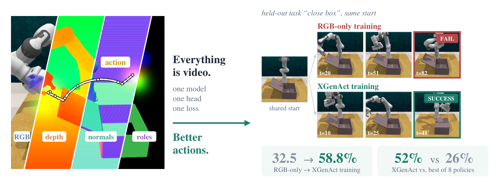
*总览：多模态输入四条带（RGB/depth/normals/roles + 动作虚线轨迹）与「everything is video」主张；右侧 held-out 任务 close box 同起点对照——RGB-only 训练 FAIL（t=82）vs XGenAct 训练 SUCCESS（t=41），配 32.5→58.8% 与 52% vs 26% 指标卡。*

## WAM 缺空间理解：专用头路线的碎片化

WAM 联合预测未来 RGB 与动作，但 RGB+动作的未来预测**不含显式的空间理解**（sec:abstract）。已有工作给 WAM 加空间预测任务时通常要加专用头或分支——监督范围受限、架构跟着碎片化。作者的反问是：如果感知任务能变成「视频生成任务」，为什么还要专用头？

## Everything is video：四个确定性 codec

核心设计是**确定性、无可学参数的 codec**（sec:method 3.2）：

- **度量深度**：原始值无界且分布不均，直接灰度编码低效——先做单调幂变换，再把标量映射到 RGB cube 里的一条连续路径；解码时把生成颜色投影回路径再逆变换。
- **表面法向**：$n \in [-1,1]^3$ 直映 $\gamma_{\mathrm{normal}}(n) = (n+1)/2$，解码后重归一化到单位长度。
- **功能角色分割**：每个功能角色（目标物体/目标区域/机器人/工具/固定装置/干扰物/背景）固定 RGB 颜色码，跨任务/episode/视角/帧共享——**标的是任务角色而非语义类别**，提供任务相关结构监督。
- **动作**：沿用 Action Images 不改——7-DoF 末端位姿投影到双相机视角、渲染成 RGB 轨迹视频，可解码回连续控制。

每个 codec 在训练前过 **admission gate**：直接往返与冻结 VAE 往返双重验证（Table 4）——深度 codec 往返 AbsRel 0.066%、法向 cosine 0.999998、分割 IoU > 0.98；VAE 往返后深度 0.362%、法向 0.9906（7.9°）、分割中位 0.965、RGB 对照 29.6–31.5 dB。**新增感知任务 = 新增一个 codec，零可学参数**。

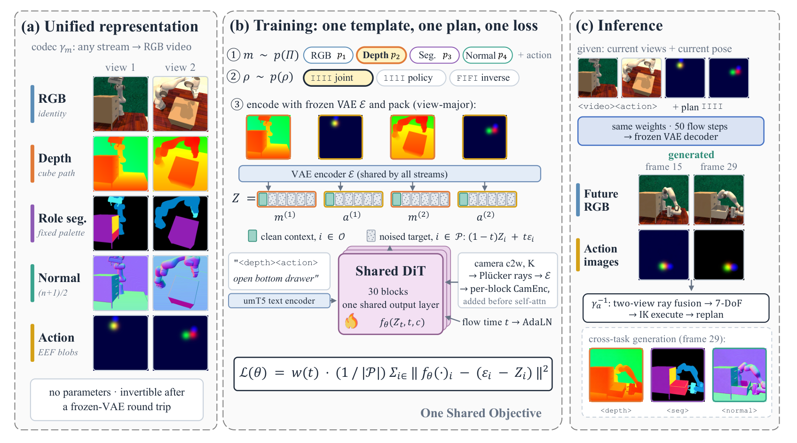
*三联架构：(a) 统一表征——四模态经 codec 转 RGB 视频（无可学参数、VAE 往返可逆）；(b) 训练——单模板单计划单损失（采样模态与策略、冻结 VAE、30 块共享 DiT、umT5 + Plücker CamEnc、flow-matching 损失）；(c) 推理——同权重 50 flow steps，动作图像经双视角 ray fusion → 7-DoF → IK 执行，跨任务生成 depth/seg/normal。*

## 单模型单损失：模板与条件计划

训练样本的结构（sec:method 3.1/3.3）：每样本选**一个感知模态**与动作流配对、双视角四段打包（式 1）；条件计划三分（式 4）——joint（联合预测感知+动作）、policy（从当前感知预测动作）、inverse（从完整感知序列预测动作）。训练时模板与计划都采样，偶尔去掉动作段让模型学纯感知生成。损失只施加在预测位置（式 5/6 的插噪 flow matching）——**所有模板共享同一个 DiT、同一个输出头、同一个目标**。骨干为 Wan2.2-TI2V-5B、冻结 VAE、只微调 DiT。

## 闭环对照：52% vs 26%

八个基线覆盖三类（sec:method-2 Table 1 + sec:experiments 4.2）：VLA（π0.5 / Evo-1 / VLANeXt）、把深度当作输入单元的 VLA（MolmoAct，zero-shot 适配）、WAM（像素空间 PAD-Depth / UWM；latent 空间 LaWAM / VLA-JEPA）——全部在同一个 16 任务 RLBench 树上微调、配对场景种子、每任务 20 trials。

XGenAct 平均 **52%**，π0.5 与 VLANeXt 各 26%，PAD-Depth 12%、UWM 14%。三个任务第一：close drawer **100%**（基线至多 50%）、close microwave 60% vs 30%、close laptop 40% vs 25%。**它是唯一在每个任务都 >10% 的方法**。失败模式也分化：像素 WAM 多为超时（100 trials 里 88/86 次），VLA-JEPA 与 MolmoAct 多为命令不可达位姿导致 IK 失败。

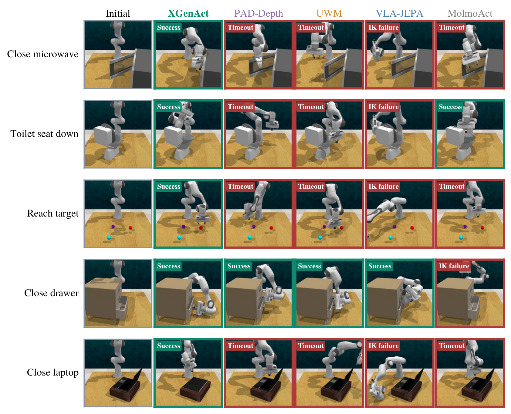
*配对闭环 rollout：五任务 × 六列（Initial + XGenAct/PAD-Depth/UWM/VLA-JEPA/MolmoAct），Success/Timeout/IK failure 标签齐全——展示的是 XGenAct 首次解出的那条 trial 上各方法的表现。*

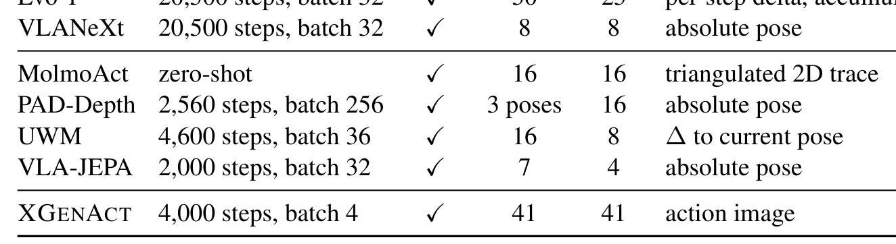
*Table 1 各方法的训练与执行设置：七行方法对照训练步数、batch、相机数与动作表示（XGenAct 为 action image、4,000 步、batch 4）。*

## 菜单消融：加什么感知由任务歧义决定

八个菜单（sec:model Table 2，RLBench+ManiSkill3 70/30 混合训练、held-out RLBench 评测）：

| 菜单 | 平均成功率 |
|---|---|
| RGB | 32.50 |
| RGB+D | 52.50 |
| RGB+S | 57.50 |
| RGB+N | 57.50 |
| RGB+D+N | 56.25 |
| RGB+D+S | 53.75 |
| **RGB+N+S** | **61.25** |
| RGB+D+N+S | 58.75 |

两个值得记住的模式（作者明确标注为 **correlational**，配对执行仅定性）：**角色分割**帮从杂乱背景分离目标（RGB+S 在 close microwave 95%、meat on grill 70%）；**法向**帮薄板旋转（toilet seat down 40%，前三名菜单都含法向）。而 close drawer 上 RGB 已经 95%——任务没歧义时加流无用。最有信息量的一行：RGB+N+S 加深度反降 61.25→58.75——**固定容量与训练预算下流之间竞争，最佳菜单由「哪种几何/语义解决任务主要歧义」决定**。

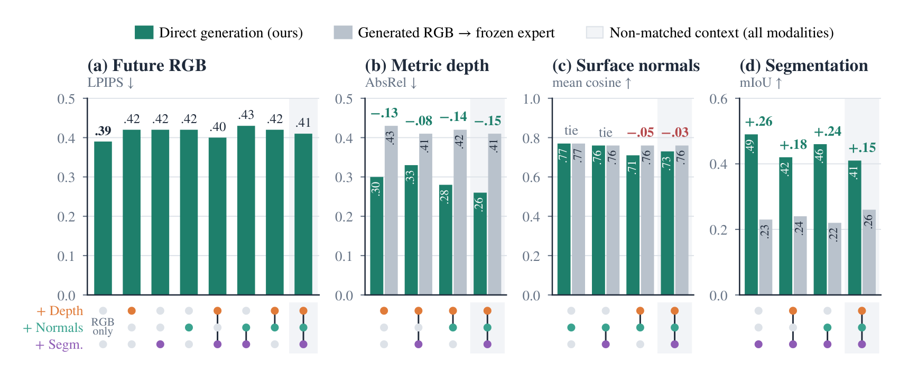
*训练期模态菜单闭环成功率表：八菜单 × 四任务，加粗与下划线标注最佳/次佳。*

## 生成感知 vs 读出感知

每个菜单模型都有两条产出未来感知的路径（sec:experiments 4.4）：直接用对应模板生成，或生成 RGB 再过冻结专家（Depth Anything V2 / Lotus-G / CLIPSeg）。对照（Fig.4，四 held-out 任务、按各自动作到达的 simulator 状态评分）：**深度** AbsRel 从 0.41–0.43 降到 0.28–0.33；**分割** mIoU 从 0.22–0.24 升到 0.42–0.49（约翻倍）；**法向**两路打平（0.76–0.77，唯一例外 RGB+D+N 直接生成 0.71 反而落后）。加入感知流对 RGB 生成的代价很小：LPIPS 从 0.39 升到 0.40–0.43。

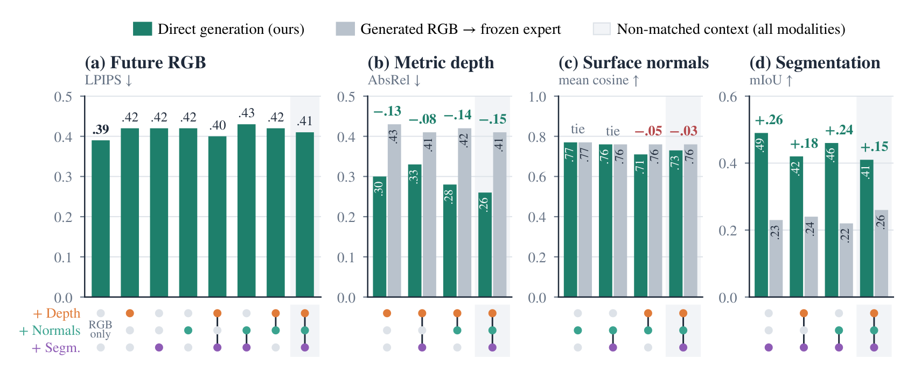
*直接生成（teal）vs 生成 RGB+冻结专家（灰）四指标柱状：LPIPS/AbsRel/mean cosine/mIoU，增量标注绿正红负，底部模态点标记各菜单。*

度量深度流可以直接当几何用：生成深度反投影 3D 后与真值点云的桌面/固定装置/物体布局重合，可见差异集中在机械臂位姿的超前/滞后（Fig.5，正文描述；Fig.10/11 展示想象 vs 执行的双视角对照与 PSNR 21.4–23.7 dB）。

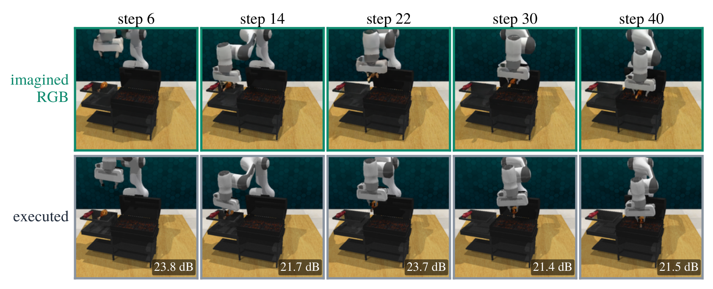
*想象 vs 执行（meat on grill，view 1）：上行模型想象帧、下行执行帧，执行行带 PSNR 标注（21.4–23.7 dB）。*

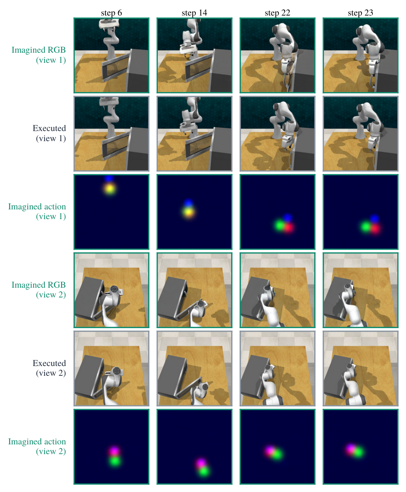
*想象 vs 执行（close microwave，双视角）：imagined RGB / executed / imagined action 三行组 × 两视角，动作热图随步骤演化。*

开环跨输出空间生成的定性（Fig.12）与动作轨迹解码对照（Fig.13）：

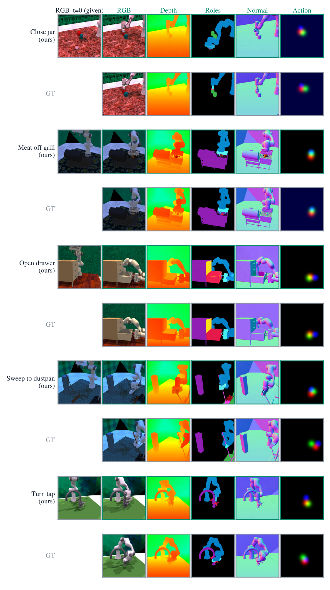
*开环跨输出空间生成：五任务 ours/GT 双行 × RGB t=0（给定）/RGB/Depth/Roles/Normal/Action 六列。*

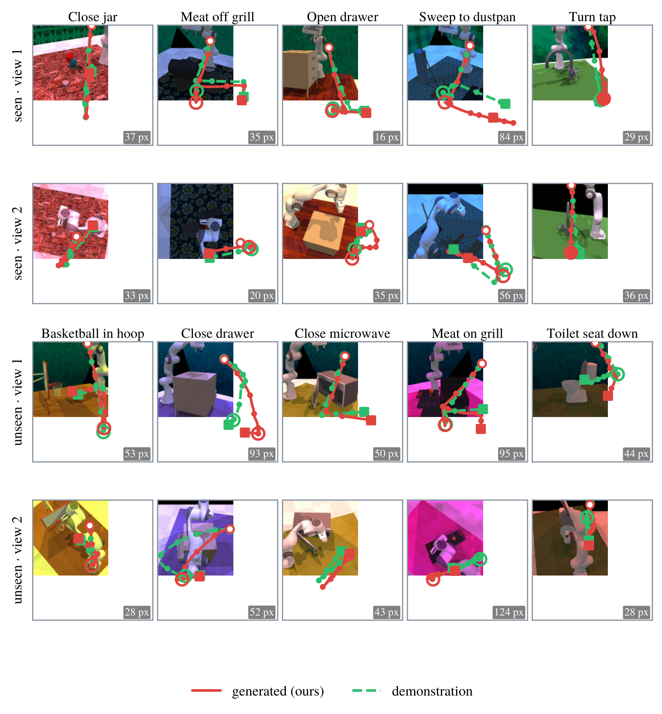
*生成动作图像解码的末端轨迹（红实线）vs 演示轨迹（绿虚线）：seen/unseen × 两视角四行 × 五任务，右下角 px 误差标注。*

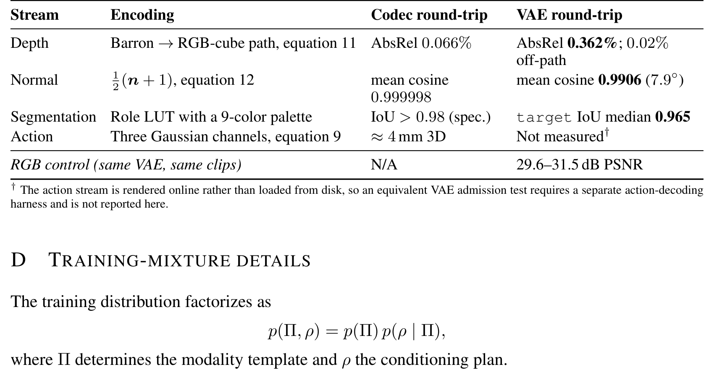
*各输出流 admission gate：深度/法向/分割/动作四行的 codec 与 VAE 往返指标 + RGB 控制行（29.6–31.5 dB）+ 动作流未测脚注。*

## 边界与搬走的东西

边界：闭环为 RLBench held-out 仿真、20 trials/任务；MolmoAct 是 zero-shot 适配（非同数据微调）；菜单趋势 correlational；法向直接生成在 RGB+D+N 菜单落后专家路由。我的分析：52% vs 26% 的基线含多个非 SOTA 调参的 WAM 复现（PAD-Depth 12% 偏低），对照的公平性依赖「同数据微调 + 配对种子」协议——这点论文做得干净，但「两倍」的表述要放在这个基线池背景下读。

值得直接搬走的设计：

- **确定性 codec 套件**（深度 cube 路径 / 法向 (n+1)/2 / 固定调色板角色分割）：零参数给任何视频生成 WAM 加感知任务；
- **「训练菜单 = 任务接口」**：加任务即加 codec 与菜单项，不动架构；
- **admission gate 协议**（codec 与 VAE 双往返量化）：新增模态前的标准检查；
- **直接生成 vs 专家后处理的对照设计**：任何「感知该生成还是该读出」的决策都可用；
- **菜单非单调的教训**：加流前先问任务歧义由什么解决——盲目上全菜单不是最优。

**尚不能确定**：真机域差下 codec 路线对深度/分割的敏感性；更大骨干下流竞争是否缓解（容量瓶颈假说未验证）；角色标签能否由 VLM 自动标注扩到开放世界；深度流直接当场景几何做闭环控制的增益。
