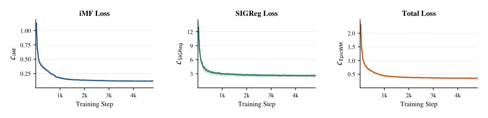
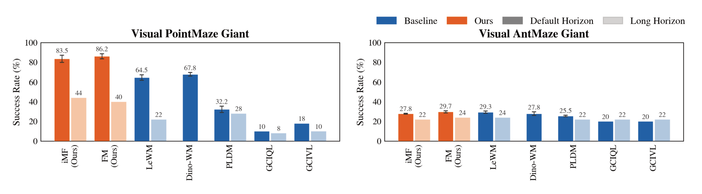
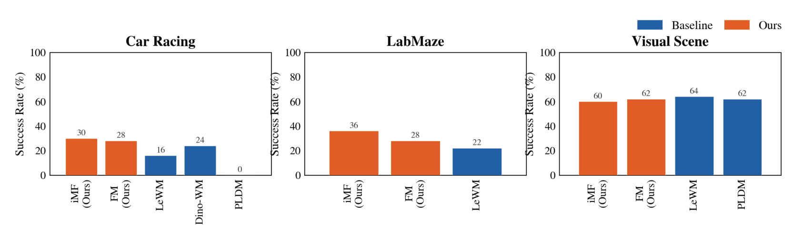
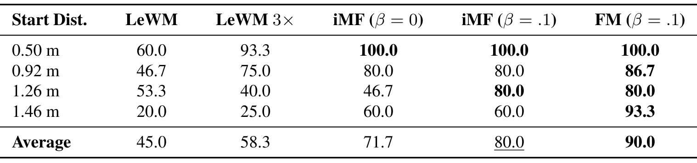
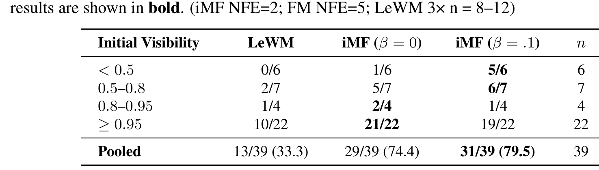
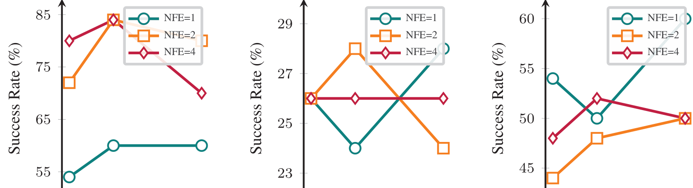
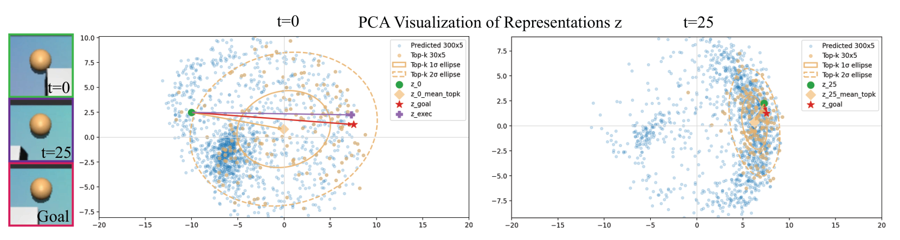
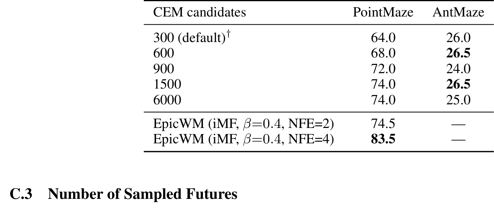
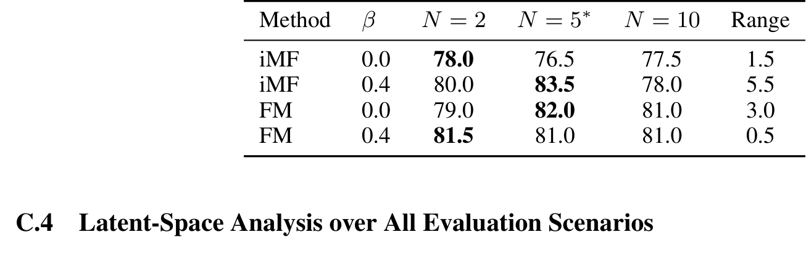

# EpicWorldModel: Exploration-driven Planning with Latent World Models

> **arXiv:2610.05996** · cs.LG（交叉 cs.RO 线）· Princeton 线（Bowen Feng*, Julian Ost*, May Mei*, Anirudha Majumdar, Felix Heide）
> NeurIPS 2026 接收（18 页，8 图 5 表，含 4 页附录）

这篇论文处理的是 JEPA 世界模型的一个先天限制：**确定性单目标回归在部分可观测下会「记忆化并幻觉」**。作者的答案是把预测器换成条件流匹配的随机多未来生成器，然后——这是全文最妙的一步——**把流采样的预测方差直接当探索信号**接进 CEM 规划。对做 latent planning 的人，这是「预测不确定性从 ensemble 专利变成单模型免费赠品」的一篇：不用训 N 个 dynamics，采 N 个流样本就有 ensemble 分歧。

## 要解决的问题：确定性 JEPA 会幻觉

论文的动机例子（sec:introduction，Fig.1）非常具象：机器人被要求去冰箱，冰箱初始不在视野内。vanilla JEPA 的预测器会**把训练集里冰箱的位置记下来**——推理时给一个「右转」动作，哪怕真冰箱在左边，模型照样在未来的潜态里幻觉出右边的冰箱。这在目标离开条件帧时尤其致命。

形式化是 POMDP：隐状态不可观测，只能从有限观察-动作历史规划。确定性预测隐含假设「历史唯一决定未来」——部分可观测下这个假设直接破产，多个 plausible 未来与同一历史相容。

*动机与管线总览：训练面板用 iMF 流匹配目标 + SIGReg 正则学随机预测器；推断面板对比确定性预测器（幻觉出与目标不符的未来，红叉）与随机预测器（四个多样未来 + 不确定性 U 引导「高不确定就探索」）；执行面板展示按此规划的闭环序列。*

## 随机潜空间预测器：条件流匹配

核心替换（sec:method 3.2）：把 JEPA 的确定性回归头换成条件生成 dynamics。给定潜历史 $z_{t-H+1:t}$ 与候选动作块嵌入 $c_t$，学分布 $p_\phi(z_{t+1:t+K}\mid z_{t-H+1:t}, c_t)$——用条件流匹配：从 $\mathcal{N}(0,I_d)$ 传输到未来潜态分布（式 4-5）。

**iMF 平均速度形式**（沿 MeanFlow/improved MeanFlow 线）：把瞬时速度换成区间平均速度 $u(z(\tau),\cdot,\tau,r)$，经 $v = u + (\tau-r)\frac{d}{ds}u$（JVP + stop-gradient，式 7-9）从平均速度恢复瞬时速度。取 $\tau=0, r=1$ 时**推理塌缩到单次函数求值（1-NFE）**——随机预测的实时性保住了。

**SIGReg 正则**（沿 LeWorldModel 线）：潜嵌入正则到各向同性高斯（Cramér-Wold 定理 + Epps-Pulley 正态检验统计量投影，式 10）。总目标 $\mathcal{L}=\mathcal{L}_{iMF}+\lambda\,\mathrm{SIGReg}(Z)$（式 11）。

*PointMaze 上的训练曲线：iMF 损失、SIGReg 损失与总损失三个面板——平滑收敛、方差极小（Prop.1 的数据无关梯度噪声界的实证表现）。*

## 理论性质：为什么这套组合自洽

三个命题值得分开读（sec:method，证明在附录 A）：

- **Rem.1 源-目标兼容**：SIGReg 把潜边际推向 $\mathcal{N}(0,I_d)$ 后，流匹配的源分布 $p_0=\mathcal{N}(0,I)$ 与数据分布重合——积分总从数据支持的区域出发，传输路径更短更好调。
- **Prop.1 数据无关梯度噪声界**：各向同性高斯潜空间下，条件速度目标的过剩方差 $\mathrm{Var}[v_{tgt,\tau}\mid z(\tau)]\preceq((1-\tau)^2+\tau^2)I_d$（式 12）——**只依赖维度与流步、与数据无关**。潜表征再 expressive、条件再复杂，梯度噪声不涨。
- **Prop.2 不确定性=条件熵上界**：采样 N 个流未来算逐维方差 $U$（式 13），$\mathbb{E}[U]=\mathrm{tr}(\Sigma_{c_t})$，且 $H(z^{(1)}\mid x_t,c_t)\le\frac{d}{2}\log(2\pi e\cdot U)$（式 15）。$U\in[0,1]$ 自带可解释绝对标度：0=自信，1=与先验一样散。

作者很诚实：各向异性协方差下界会松，**U 只用作探索 bonus 而非熵估计**。

## 机制流程：从观察到动作块

按执行链串一遍：

1. **编码**：$z_t=E_\theta(o_t)$（DINOv3-ViT-S/16 冻结编码器，RoboCasa 全方法共享）；动作块 $c_t=C_\psi(a_{t:t+K-1})$。
2. **采样**：N 个 $z^{(0)}[i]\sim\mathcal{N}(0,I)$，1-2 NFE 积分得 N 个未来潜态 $\{\hat z^{(1)}[i]\}$。
3. **不确定性**：$U=\frac{1}{d}\sum_j\mathrm{Var}_i(\hat z^{(1)}_j[i])$。
4. **规划**：CEM 优化动作块嵌入——$c_t=\arg\min_c\|\hat z_{t+K}[i]-z_g\|^2_i-\beta U(c)$（式 18）：**距目标潜嵌的距离减去 β 倍不确定性**，探索-到达一个目标函数搞定。

**EIG 联系**（Rem.2）很优雅：流 ODE 对给定 $z^{(0)}$ 是确定的 → per-seed 熵为 0 → $\mathrm{EIG}(c_t)=H[z^{(1)}\mid x_t,c_t]\le\frac{d}{2}\log(2\pi e\cdot U)$。**最大化 U ≈ 最大化期望信息增益的上界**——把「采样噪声」解释成「世界的不同种子」，探索信号有了信息论解释。

## 实验：五环境 + 两个受控研究

OGBench 主结果（Visual PointMaze/AntMaze Giant，sec:experiments 4.3）：

| 方法 | PointMaze | AntMaze |
|---|---|---|
| **iMF（本文）** | **83.5** | 27.8 |
| **FM（本文）** | 86.2 | **29.7** |
| LeWM | 64.5 | 29.3 |
| DINO-WM | 67.8 | 27.8 |
| PLDM / GCIQL / GCIVL | 32.2 / 10 / 18 | 25.5 / 20 / 20 |

PointMaze +19；AntMaze（高维动作）持平。**长视野档全线掉点**（83.5→44）：horizon 翻倍的惩罚直接可见。Car Racing 上 iMF 30 vs LeWM 16.0（近翻倍）；LabMaze iMF 36 全场最高；**Visual Scene 上 LeWM 64 反超 iMF 60/FM 62**——接触富操作、弱部分可观测场景，随机潜预测的优势收窄。论文把这个反超明明白白画在图里（Fig.5），值得表扬。

*OGBench 主结果：PointMaze/AntMaze 双柱图，七方法带误差条与数值标注——含默认视野与长视野两档。*

*Car Racing / LabMaze / Visual Scene 三环境：前两个大幅领先，Visual Scene 被确定性基线 LeWM 反超——作者诚实呈现了随机路线的边界。*

**计算预算归因**（附录 C.2，Table 4）：给 LeWM 6000 个 CEM 候选（20 倍默认）只把 PointMaze 推到 74.0，仍比 iMF 低约 10 分；AntMaze 上加候选完全无效（24.0–26.5）。**增益不是采样预算**——这个对照堵住了「你只是算得多」的质疑。

**RoboCasa 受控研究**（sec:experiments 4.4）分两轴：

| 起始距离 | LeWM | LeWM 3× | iMF(β=0) | iMF(β=.1) | FM(β=.1) |
|---|---|---|---|---|---|
| 平均 | 45.0 | 58.3 | 71.7 | 80.0 | **90.0** |

三个结论都干净：同 CEM 预算下**仅随机化**（β=0）就 71.7 vs 45.0（+26.7）；3 倍候选只救短距离；**探索项在目标代价信息少时才发力**（1.26m 档 46.7→80.0）。

*RoboCasa 起始距离受控表：四种距离 × 五种配置的完整成功率与均值行。*

遮挡轴（Table 2）更细：初始可见度 <0.5 时 5/6 vs LeWM 0/6（β 探索项的完整价值）；**可见度 ≥0.95 时 19/22 vs 21/22——目标全可见时探索项反伤**。论文明确写出这个双刃剑边界。

*遮挡/可见度分层表：按初始目标可见度四档分层的 successes/episodes——探索项的收益随可见度递减并在全可见时转负。*

## 消融与训练成本

β∈{0.1,0.4,1.0}×NFE∈{1,2,4} 网格（Fig.6）：PointMaze 最优 β=0.4/NFE=2，AntMaze 对设置较稳，Visual Scene 上 NFE=1 反而最好。采样未来数 N∈{2,5,10}：iMF β=0.4 时 N=5 最优 83.5。

*β 与 NFE 敏感性三联：三环境 × 三 NFE 曲线随 β 变化——PointMaze 明显敏感（最优 β=0.4），AntMaze 稳定，Visual Scene 偏好单次流求值。*

*潜空间 PCA 可视化：t=0 与 t=25 两时刻的 300 个预测样本、top-k 椭圆（1σ/2σ）与 z_0/z_25/z_goal/z_exec 标记——探索引导下 top-k 分布从弥散收缩到贴近目标。*

训练成本很轻：PointMaze <5 GPU 小时、AntMaze ≤20 GPU 小时（A6000）；推理 50 个场景并行跑在单张 48GB A6000 上。β 与 NFE 用与训练/测试都不相交的 held-out 场景网格搜索选定。

*计算预算对照完整表：CEM 候选从默认 300 加到 6000（20 倍）只把 LeWM 的 PointMaze 推到 74.0，仍低于 EpicWorldModel 的 83.5；AntMaze 上加候选完全无效。*

*采样未来数 N 消融：iMF/FM × β∈{0, 0.4} × N∈{2, 5, 10} 十二格完整表（含 Range 列）——N=5 配 β=0.4 最优 83.5。*

## 边界与复用

证据边界：全部仿真（OGBench/Gymnasium/DMLab/RoboCasa），无真机；β/NFE 靠网格搜索、跨任务族迁移未检验；RoboCasa 每档 15 episodes 样本量小；长视野档掉点未被层级化处理（与同日的 H-JEPA 正好互补——**我的分析**：H-JEPA 的层级负责时间尺度、EpicWorldModel 的随机化负责信念分布，两者理论上正交）。

可搬走的三件东西：**流采样方差当 ensemble 分歧**（任何流匹配预测器免费获得不确定性，不用训 N 个模型）；**-βU 项接进 CEM**（最小改动的探索-到达权衡）；**遮挡/可见度分层评测协议**（在目标几何上采 200 点算可见比例，无学习无阈值）。最值得做的后续：β 按目标可见度自适应调度——论文已经给了「全可见时关掉」的实证依据。

**结论**：EpicWorldModel 给 JEPA 世界模型补上了「分布」这一课——SIGReg 的高斯潜几何让流匹配的源-目标兼容、梯度噪声有界，预测方差又顺手变成探索信号。理论-机制-实验三段都自洽，边界报告也诚实（Visual Scene 反超、全可见档反伤都明写）。做 latent planning 的人这篇应该精读。
