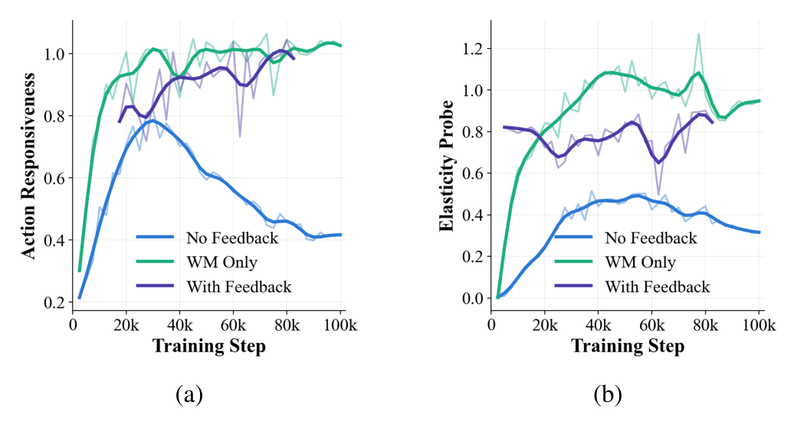
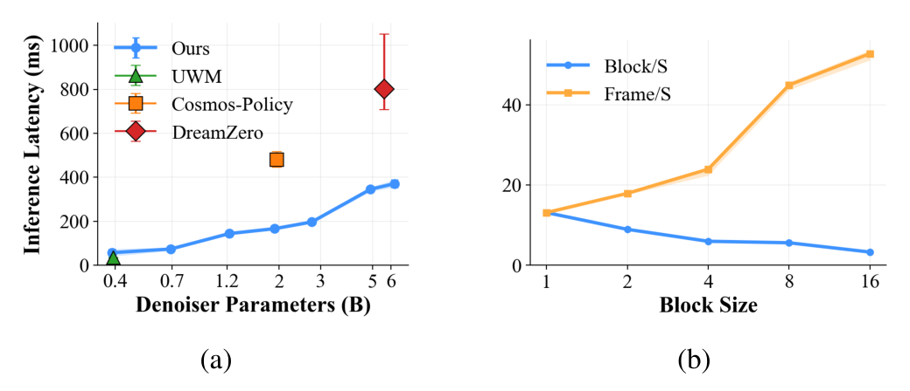
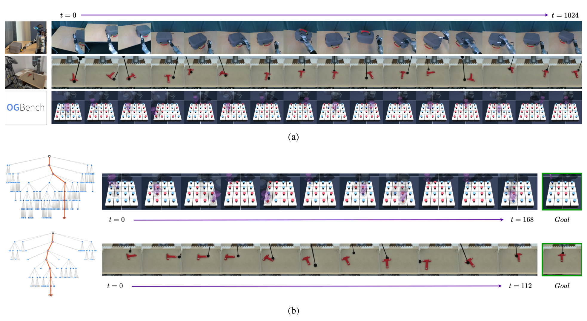
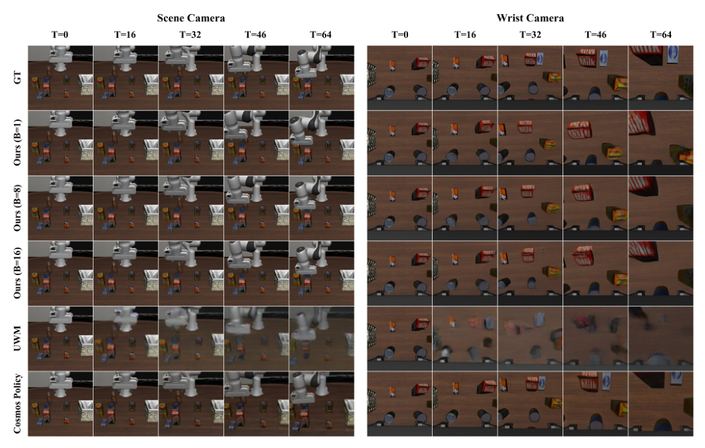
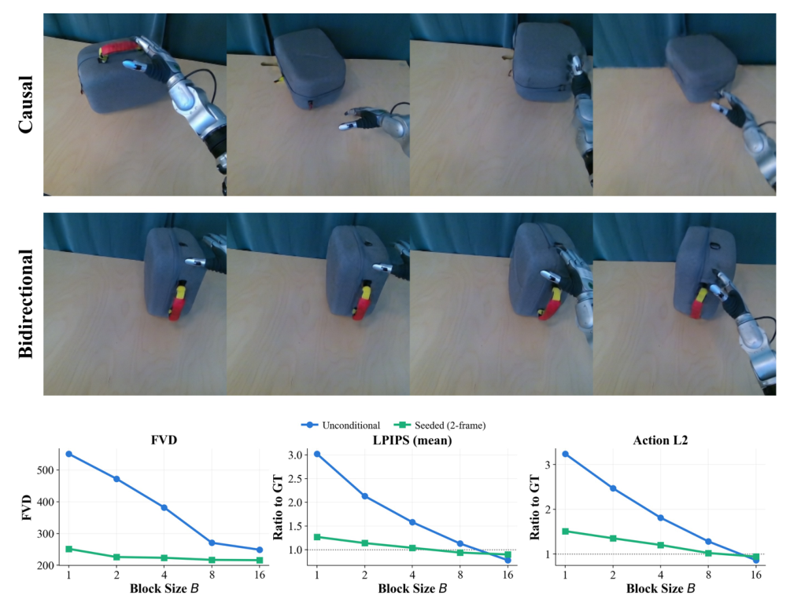
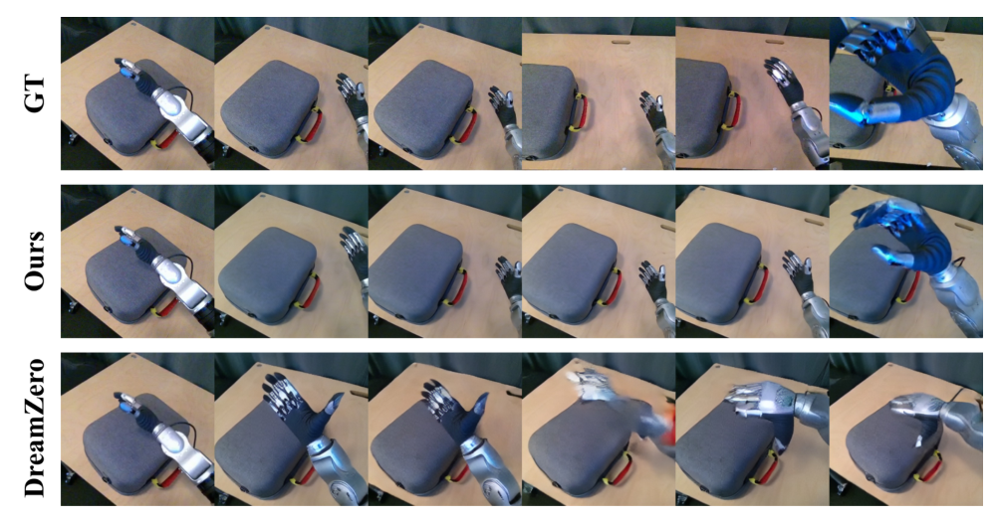
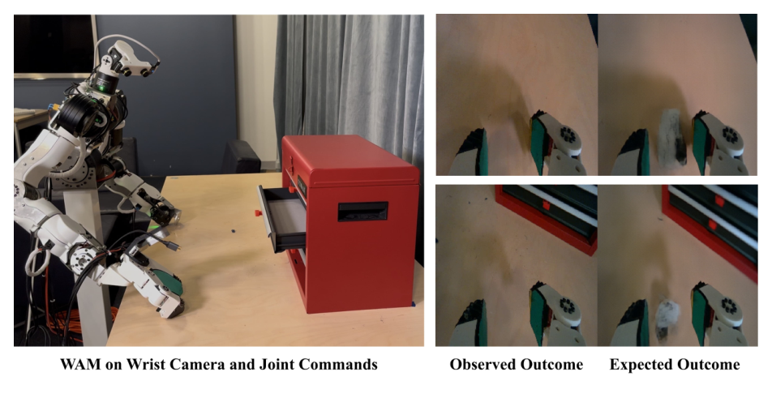

# FLEX-WAM: Flexible Block-Causal World-Action Models for Long-Horizon Imagination and Planning

> **arXiv:2610.05483** · cs.RO（交叉 cs.AI）· TU Darmstadt / Righetti 组线
> R. Khorrambakht, Joseph Amigo, Félix Lebel, Leon Seetoo, Jean Ponce, Zhenzhen Li, Ludovic Righetti

这篇论文处理的是世界-动作模型（WAM）落地时的两个工程死结：**固定视野骨干撑不住流式推理与长程开环 rollout，联合训练会产出「看着 plausible、对动作没响应」的未来**。作者的解法是一套完整的「块因果 + 训练协议」组合拳：block-causal 架构让单一 checkpoint 覆盖从逐帧因果到块并行的全谱部署，梯度均衡 + FD elasticity 闭环调节保住动作响应性。在我的理解里，这是 WAM 从「架构之争」进入「训练协议之争」的代表作——论文里最值钱的不是网络结构，是那套「怎么让联合训练不丢动作」的调节器。

## 问题：两个工程死结

第一个死结是架构层面的。现有 joint video-action 模型要么全因果（长视野质量差）、要么全双向（不可 KV-cache）、要么固定分段的因果上下文+双向视野（训练期就锁死视野长度）——都不适合流式推理和稳定长程开环 rollout。

第二个死结更隐蔽（sec:method II-2c）：联合训练状态与动作两个流时，两路损失的梯度竞争共享主干。而且时序密集的 WAM 里相邻帧高度相关，条件化与非条件化向量场 $v(z_{t+1}|a_t,\cdot)$ 与 $v(z_{t+1}|\phi,\cdot)$ 之间天然失衡——**世界模型模式会先丢掉对动作的响应**。论文的 Fig.2 给了这个失败模式的定量画像：No Feedback 协议下 action responsiveness 在 30k 步后从 0.78 衰落到 0.42。

## 联合流匹配形式：一个模型四种用法

形式化起点（sec:method I-A）：WAM 定义为状态-动作序列的联合生成模型 $p_\theta(z_{t:t+H}, a_{t:t+H})$，用逐模态、逐时间步独立信号级 $\tau_{st}/\tau_{at}$ 的流匹配建模。信号级的独立性直接换来四种推理模式：世界模型（$\tau_a=1$）、逆动力学（$\tau_s=1$）、纯视频模型（$\tau_a=0$）、联合生成（两者都在 $[0,1]$）。逐帧噪声控制还让任意子集的输入单元可以当干净上下文——训练期随机上下文扰动直接缓解「推理期上下文填的是模型自己的预测」这个分布错配。

## 机制流程：block-causal axial transformer

*FLEX-WAM 架构四面板：(a) 多视角 tokenizer——视图间永不互相关注，latents 是唯一通路；(b) axial attention——每层只沿时间或空间一轴；(c) 动力学模型——263 token/步（256 latents + 4 registers + 两个信号级 + 动作）；(d) block-causal 掩码——块内双向、跨块严格因果。*

按数据流走：多相机视角经多视角 tokenizer（继承 DreamerV4 的 masked autoencoder 设计，编码时视图间只经 latents 传递）变成每帧 256 个 latent；拼上 4 个寄存器位（跨步携带信息的草稿区）、两个离散信号级输入（128 级网格，为 shortcut 模型留扩展）和动作序列，得到每步 263 个输入项的动力学序列。主干是轴向注意力（每层只沿空间或时间一轴，复杂度 $O(TS^2+ST^2)$）+ RoPE + AdaLN。

关键结构决策是**块因果**：帧划分成 $B$ 大小的连续块，块内双向、跨块严格因果。训练期 $K\in\{1,2,4,8,16\}$ 每次 forward 随机抽一次（整个 batch 共享）；于是**块大小成为部署期可调旋钮**——$B=1$ 完全因果可 KV-cache，$B>1$ 成块出帧。这是「单一 checkpoint 服务多场景」的核心机制。

## 训练协议：blockwise forcing 与梯度均衡

**Blockwise diffusion forcing**（sec:method II.1）：朴素的逐帧独立噪声要覆盖 $128\times128\times T$ 的组合空间，需要百万级训练步。改成块内时间齐噪声 + 随机块大小，渐近覆盖逐帧 forcing。另外每块 state 用 x-prediction（容量给高噪声段）、action 用 v-prediction（容量给干净段）——一个很讲究的细节分工。

**Action-state 梯度均衡**（式 3-4）：两路损失按 $w_m = Z\cdot\Phi_m \mathrm{ramp}_m/\sqrt{\hat{S}_m \hat{L}_m}$ 加权。三个组件：$\Phi_m$ 用**对方的清洁度**分配单位权重（动作干净时世界模型权重高，反之亦然）；$\mathrm{ramp}_m$ 按自身清洁度加权（同 Dreamer 4）；$\hat S_m$ 是每 500 步单独反传实测的各路 trunk 梯度模。先归一再用 $\Phi\times\mathrm{ramp}$ 调相对重要性——**测出来的梯度尺度，不猜**。

## FD elasticity：动作响应性的闭环调节

这是论文最独特的组件（sec:method II-2c）。先用 Hutchinson 估计器在线估计潜空间对动作扰动的归一化敏感度——称为 Forward-Dynamics (FD) elasticity。两阶段训练协议：第一阶段纯世界模型模式训练至该指标收敛（取峰值）；第二阶段把 setpoint 设在 WM-only 峰值的 90%，用 WM 模式的采样偏置当控制输入做**闭环反馈调节**。

*FD elasticity 实验：三种训练协议下 (a) 动作响应度与 (b) 弹性探针随训练步变化——仅世界模型模式的协议快速升到 0.9 以上并保持，无反馈协议在 30k 步后从 0.78 衰落到 0.42，带反馈闭环后稳定在设定点附近。*

**我的分析**：这个设计把「动作响应性」从不可观测的训练副产物变成了可测量、可设定目标的被控量。它对任何联合多流训练（视觉-语言、状态-奖励）都适用——不限于 WAM。论文没有给 elasticity 值与下游规划成功率的直接相关分析，这是最明显的开放问题。

## 实验：延迟、长视野与部署

延迟表（Table II，各方法官方推理配置）：UWM(393M) 34.1ms、FLEX-WAM(690M) 71.5ms、Cosmos-Policy(2B) 330.5ms、DreamZero(5B) 801.4ms——**同量级时延下模型大一个档**，这个定位值得注意（不过 Cosmos 单步去噪的口径差异论文已标注）。

长视野生成质量（Table III，T=16→64）：FLEX-WAM(B=8) 在所有 horizon 上 SSIM/PSNR 领先——T=64 时 0.778/21.1 vs UWM 0.599/15.6、Cosmos-Policy 0.587/16.5。B=8 普遍最优（B=1/16 略低），块大小确实是质量-吞吐的甜点旋钮。

*推理期扩展：(a) 完全因果下每步时延随模型规模增长；(b) 同一 checkpoint 下块生成率与有效帧吞吐随 B 变化——B 是部署期的延迟-吞吐权衡旋钮，无需重训。*

1024 步自回归 rollout 稳定（真实 Unitree G1 灵巧手数据 + OGBench，Fig.5/Fig.6）：数千帧不崩，靠的是 per-block diffusion forcing + 随机上下文 dropout + KV-cache 的组合。

*(a) 三个数据源的 1024 步 rollout 帧条（真实 G1 双行 + OGBench）；(b) MCTS 想象内求解：搜索树节点着色为奖励、橙色为返回路径，右侧是沿路径解码的想象帧。*

*G1 灵巧手操作软提手柄的 1024 步 rollout 与 OGBench 4×4 想象内求解的可视化。*

## 想象内规划与反事实发现

MCTS 用法（sec:results D）：树节点=潜态+最多 3 帧短上下文；每条边=一次 $H$ 帧联合状态-动作采样（$H/B$ 次调用、$M=5$ 并行、UCB1 选择）。由于 play 数据 goal-free + 推理随机性，每次采样产生不同 plausible 未来——WAM 同时充当模拟器与 affordance 感知的动作采样器。**PushT 与全部五个 OGBench Puzzle-4x4 任务完全在想象内解出**（含搜索树与解码帧可视化，Fig.5b）。需要注意：论文报告的是「解出」的可视化结果，没有给多 seed 成功率统计——这是证据强度边界。

闭环部署一节（sec:results E）很讨喜：在 2 小时 play 数据上训练的 WAM 部署为闭环策略（真实相机图像直接进 KV cache），机器人边执行随机 play 动作边预测每个动作的预期结果——**预测与观察的差分自动变成误差信号**，用于识别反事实重要样本（Fig.8 幻觉箱子的例子）。这是 DAgger 式自记录数据集的思路，单例演示、非系统分析。

*时间一致性对照：完全因果 vs 全双向注意力。快照显示纯因果模式打破时间一致性；曲线量化跨帧视觉/动作距离与数据-模型 FVD 距离——双向块内注意力的必要性证据。*

*开环 4.5 秒 rollout 对照：GT / FLEX-WAM / DreamZero 三行——DreamZero 推压失败，FLEX-WAM 与 GT 一致完成抓提。*

*闭环部署的反事实发现：OpenArm 平台上 WAM 幻觉出要抓的箱子（预测），与真实观察对比——预测-观察差分即误差信号。*

## 边界与复用

边界：评测以 play 数据为主（含次优交互），专家轨迹分布未报告；DreamZero 因无 LIBERO checkpoint 未进质量比较；反事实发现是单例演示；文本 conditioning 被明确弃用（作者判断 text 与 action 在 rollout 未来上竞争信息——这个判断本身值得单独验证）。

可搬走的四件东西：**块大小当部署期旋钮**（训练随机 K、推理自选，单一 checkpoint 多场景）；**双模态损失竞争的解法模板**（交叉清洁度分配 + 自身清洁度 ramp + 周期实测梯度模归一）；**FD elasticity 探针**（Hutchinson 估计动作扰动敏感度，可当任何联合训练的动作响应性在线监测）；**预测-观察差分挖反事实**（零标注的自记录数据集方案）。最值得做的后续：elasticity-成功率联合消融，以及 690M 之外的可扩展性检验。

**结论**：FLEX-WAM 把 WAM 的工程化推进到了「训练协议可调节」的程度——块因果给部署灵活性，梯度均衡与 FD elasticity 给训练可控性。对做 WAM 系统的人，这套协议栈比架构本身更值得照抄。
