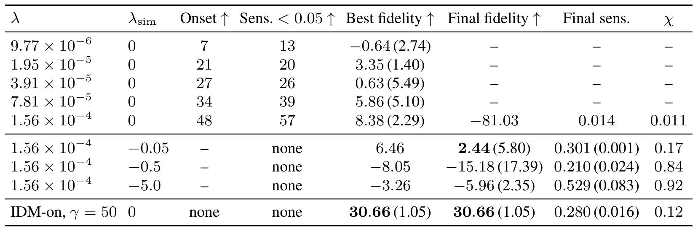
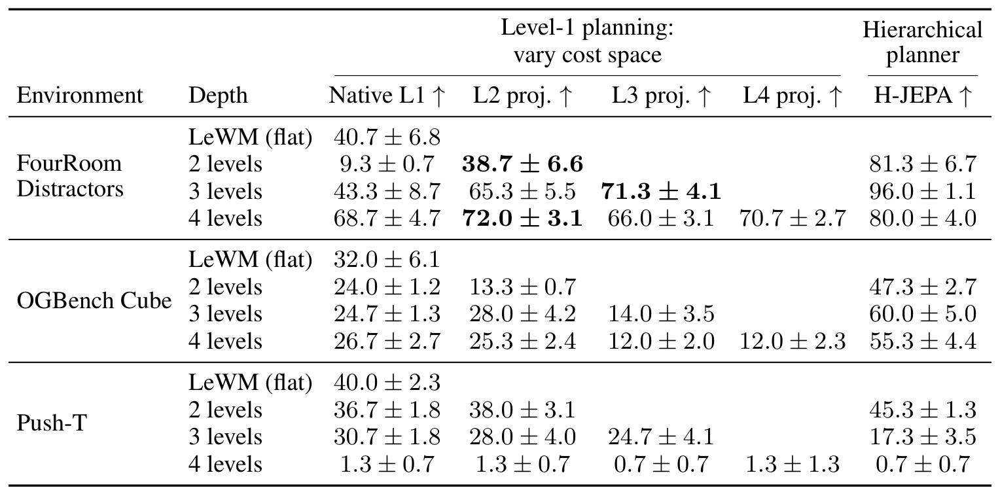
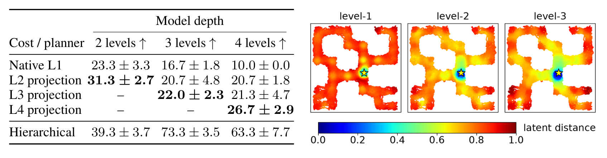
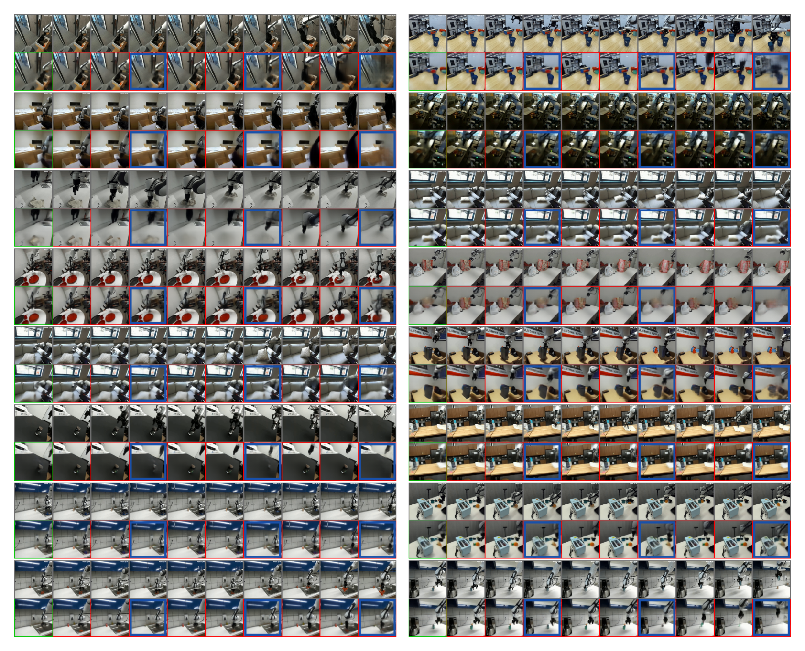
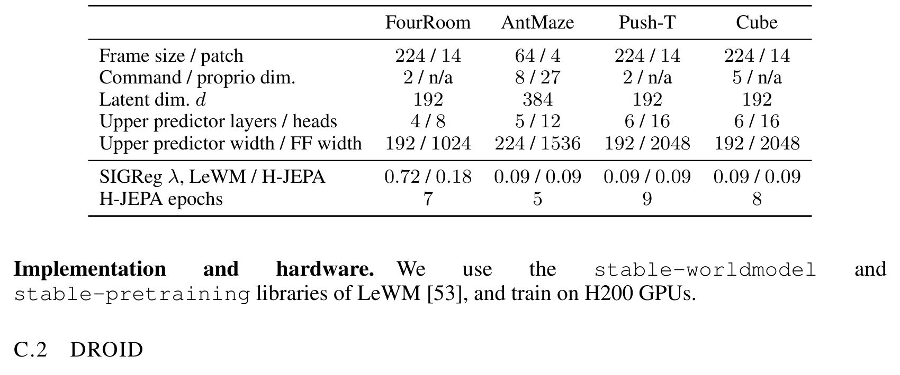
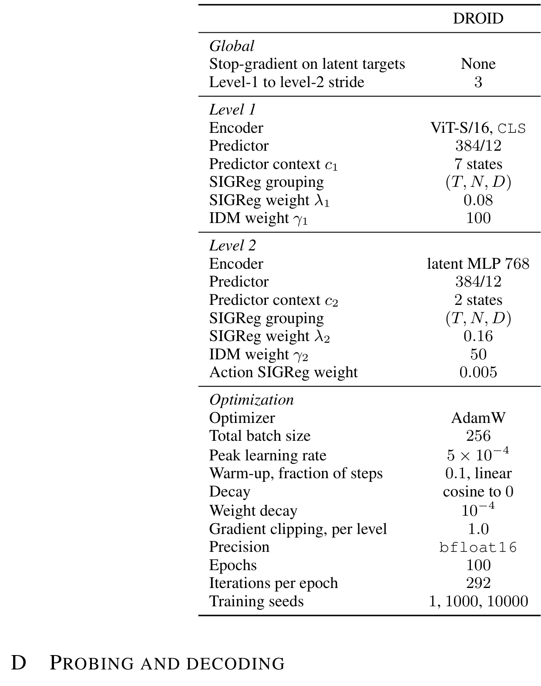
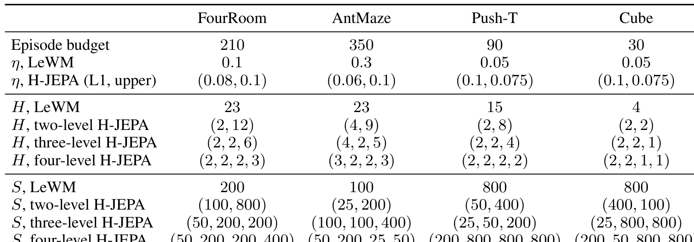
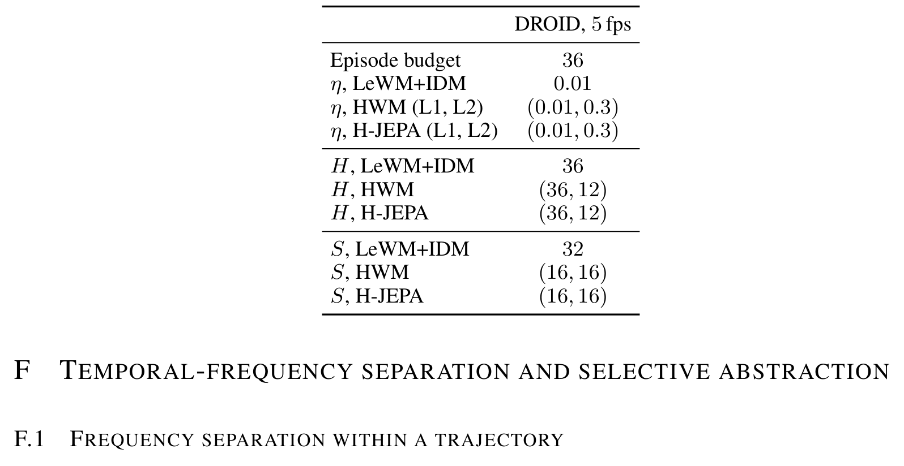
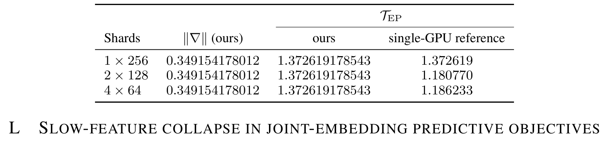
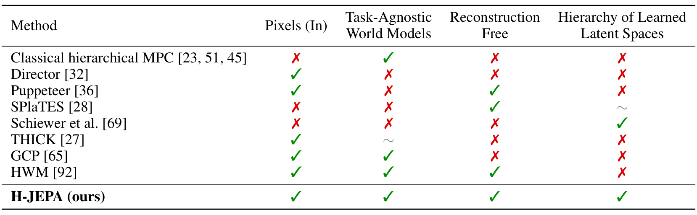

# H-JEPA: End-to-End Learning of Hierarchical World Models for Visual Planning

> **arXiv:2610.06805** · cs.RO（交叉 cs.LG）· Meta FAIR / Flatiron Institute 线
> Wancong Zhang*, Basile Terver*, Michael Rabbat, Yann LeCun, Randall Balestriero（*等同贡献）

这篇论文是 LeCun 线 JEPA 世界模型的**层级化**版本：每层在自己的潜空间里预测更远的未来，顶层规划、预测即子目标。作者来自 FAIR——SIGReg 正则、H200 训练库、和 LeWorldModel（LeWM）一脉相承的工程栈。对做 latent planning 的人，这篇的真正贡献不是「层级」这个老想法，而是把层级收益**干净地分解成两个可分离的杠杆**：抽象的目标空间、时间分解——外加一个关键的训练保险：IDM 损失防 slow-feature collapse。Visual AntMaze 上三层层级把成功率从 18% 提到 73%，还用了更少的规划算力。

## 要解决的问题：单时标 JEPA 撑不起长视野

flat JEPA 世界模型在单一潜空间、单一时间尺度上预测和规划。长视野规划需要跨时间尺度与抽象层级推理——这是老诊断。新的部分是对照系：HWM（层级世界模型、共享单一潜空间）已经证明「时间层级」本身有用；H-JEPA 的问题是**每层学自己独立的表征**还能不能再加一层增益。答案是：AntMaze 上能，而且近乎翻倍。

## 核心设计：每层自己的潜空间与预测跨度

架构（sec:method 2）：层级动作条件 JEPA，level $\ell$ 在自己的编码器空间 $z^{(\ell)}=E^{(\ell)}(\cdot)$ 里预测 $H_\ell$ 步（跨度逐层递增）。规划自顶向下：顶层在 $z^{(L)}$ 空间里朝目标优化，**它的第一个预测状态成为下一层的子目标**，逐层递归到 level-1 输出动作（$K_{\ell+1}<H_{\ell+1}$ 的前缀跟踪——每层只跟踪上层的开头一段）。

当数据里的因素演化在分离的时间尺度上，高层会**丢弃快而不可预测的细节、保留慢而任务相关的状态**——这是「选择性行」机制（Fig.4/Fig.5 的对照：AntMaze/Humanoid/FourRoom 上层保位置丢腿姿；操作数据集频差小、无选择性行）。

## 机制流程

按执行链走：

1. **训练**：每层损失 = JEPA 预测 + $\lambda_\ell\,\mathrm{SIGReg}$（LeJEPA 式高斯正则，每层）+ $\gamma_\ell\,\mathrm{IDM}$（见下）。DROID 上 stride 3、ViT-S/16 CLS 编码器、IDM 权重 $\gamma_1=100/\gamma_2=50$、bfloat16 100 epochs（H200）。
2. **规划**：给定目标图像，顶层梯度优化候选序列 toward $g^{(L)}$；首个预测经上层编码器链下传成子目标；level-1 rollout 到子目标；逐层执行。
3. **评分（DROID）**：无模拟器，用 Fréchet fidelity——规划路径与专家路径的离散 Fréchet 距离归一化（式 7），整条路径计分而非端点（非贪心 pick-and-place 任务必需）。

## 为什么必须加 IDM：slow-feature collapse

这是全文训练层面的核心（sec:method 4.3 的 DROID 一节）。**场景跨 episode 变化时**，背景成了「容易预测的部分」——纯预测目标会把编码器容量推向场景身份、丢掉只靠动作才可预测的智能体。论文给出了这个失败模式的构造性证明（附录 L）：**只看嵌入边际分布的正则（SIGReg 也算）永远允许这个坍缩解**——要堵死它，损失必须作用在跨时间的联合分布上。

IDM 损失（式 8）就是干这个的：从相邻两个状态表征回归出连接它们的动作——梯度必须穿过「两个状态的关系」才能到编码器。$\ell>1$ 层回归的是 pooled macro-action（ detached，梯度只经两个状态）。

实证非常鲜明：**DROID（场景间潜方差 75%）无 IDM 训练完全塌缩、性能为 0**；加 IDM 恢复成强基线。OGBCube（潜方差 28%）无 IDM 也不塌——**IDM 的必要性随场景多样性变化**，这个对照本身就把机制讲清楚了。

权重敏感性（附录敏感性扫描）把这个机制的参数面补完整：SIGReg 权重 λ 扫描下 onset（塌缩出现步数）与 sens. 阈值同步上升；λ_sim 取负值的反例行显示最终保真度随 λ_sim 递减；**IDM-on γ=50 行最终保真 30.66（1.05）**——加 IDM 后不再依赖正则权重扫描续命。

*SIGReg/IDM 权重敏感性完整表：λ 与 λ_sim 扫描、Onset/Sens./Best fidelity/Final fidelity/Final sens./χ 八列——最下方 IDM-on γ=50 行 30.66 加粗。*

## 实验一：四仿真环境 Pareto

主结果（sec:method 4.1，固定相机固定背景）：

- **Visual AntMaze**：三层 H-JEPA 73.3±3.5 vs LeWM 18.0±3.5——四倍；每个加层（至三层）Pareto 前沿左上移（同算力更高效能）。对 HWM（同设置、上层 identity encoder=共享潜空间）**近两倍**——独立潜空间的增益集中在此。
- **FourRoom Distractors**：三层 96.0±1.1。
- **OGBench Cube**：H-JEPA 温和领先 HWM。
- **Push-T**：两层 45.3 优于 LeWM 40.0；**三层掉到 17.3、四层 0.7**——论文明确归因训练数据：episode 太短，三层模型每 epoch 只见 LeWM 58% 的 transitions（四层 14%）。深度收益的边界不在机制在数据。

*DROID 三联：(a) OGBCube（固定场景）与 DROID（场景全变）的首帧对照；(b) Fréchet fidelity 柱状——无 IDM 单层即塌缩（+34，slow-feature collapse 标注），加 IDM +35，HWM 两层 +40，H-JEPA 两层 +40；(c) planner TFLOPs-fidelity Pareto——H-JEPA 在更低算力预算达到更高效能，冻结编码器基线（V-JEPA 2-AC 等）要高一个量级算力。*

## 实验二：把增益分解到两个杠杆

这节是方法论上最值得学的部分（sec:method 4.2）。

**杠杆一：抽象目标空间。** 受控消融（Table 1）：共享同一个 level-1 世界模型与规划器，**只换计算目标距离的潜空间**。AntMaze 上：Native L1 23.3 → L2 projection 31.3（+8）；每个多级模型都至少有一个上层 cost 改善 flat 规划。四层模型里 L4 projection 26.7 vs Native 23.3。**学到的抽象表征单独当度量用就有增益——不需要任何时间分解**。拓展到 FourRoom 有效、Push-T/Cube 无效（与「无选择性行」一致——机制自洽）。

**杠杆二：时间分解。** 子目标跟踪代价的单调性分析（Table 10）：level-1 规划器跟踪 level-2 子目标的代价 Spearman 单调性 0.89–1.00，而全视野目标代价只有 0.48–0.75——**flat 规划器的整程目标代价在专家轨迹上都会失速或上升**，子目标分解把它变成一致下降。加上每层只需更少连续 rollout 步、搜索限制在更短 horizon——算力下降。

| Cost 来源（AntMaze） | 2 层 | 3 层 | 4 层 |
|---|---|---|---|
| Native L1 | 23.3±3.3 | 16.7±1.8 | 10.0±0.0 |
| L2 projection | 31.3±2.7 | 20.7±4.8 | 20.7±1.8 |
| L3 projection | — | 22.0±2.3 | 21.3±4.7 |
| L4 projection | — | — | 26.7±2.9 |
| Hierarchical（完整） | 39.3±3.7 | **73.3±3.5** | 63.3±7.7 |

这套 cost-space 消融在 FourRoom/Cube/Push-T 上的完整版本（附录扩展消融）给出同一机制的跨环境印证：FourRoom 三层 96.0、L3 projection 71.3——**抽象 cost 在 FourRoom 有效**；Push-T 各 cost 来源全在 30 以下且四层全线崩到 1 以下——**无选择性行的环境上抽象 cost 无益**，与「频差小→无选择性行」的机制自洽。

*扩展 cost-space 消融完整表：Three 环境 × 四深度 × 五种 cost 列（±SE）——FourRoom 抽象 cost 大幅有效、Push-T 全线无效。*

*仅换 cost 空间消融完整表：四种 cost 来源 × 三种深度（±SE，三种子），右下附三个层级的潜距离热图——高层沿走廊的代价更分级、锚点周围低代价区更宽。*

代价几何可视化（Fig.7）也支持同一结论：level-1 的距离在远离锚点处几乎常数（对梯度规划器没信号），高层的代价沿走廊平滑上升——**预测跨度长→促进抽象→更信息丰富的远距目标代价**。

DROID 上规划器在每个 clip 上的想象帧（Fig.16）给了这条链的直观版本：每个 clip 窗口内规划器先在 level-2 空间确定子目标，level-1 rollout 到它，再进入下一窗口。

*DROID 规划器想象帧网格：16 个 clip 窗口的逐帧想象序列——规划器逐窗口确定子目标并 rollout，场景/光照/物体在 clip 间全变。*

## 实验三：DROID 真机视频

DROID 扩展（sec:method 4.3）把「场景多样性→IDM 必要性」的机制完整呈现：no IDM 塌缩（fidelity 0）；+IDM 单层已是强基线（+35）；**两层 H-JEPA +40 且 Pareto 更优**——表征杠杆与时间杠杆同时激活（对 HWM 的清晰优势说明学的表征在起作用）。冻结编码器基线（V-JEPA 2-AC、公开 checkpoint）需要高一个量级的算力才追平更低 fidelity。

复现相关：训练栈基于 LeWM 的 stable-worldmodel/stable-pretraining 库（H200）；四仿真环境的架构与训练超参（附录架构表）、DROID 全套超参（DROID 超参表）、规划预算（规划预算两表）逐环境逐层列全；分布式 SIGReg 的分片一致性（分片一致性表）验证了多卡训练下正则的精确可重复性。

*四环境架构与训练超参表：frame/patch、latent 维度、上层预测器层数/宽度、SIGReg λ、epochs 逐环境列出。*

*DROID 全套超参：全局/Level 1/Level 2/Optimization 四组（ViT-S/16 CLS、stride 3、IDM γ1=100/γ2=50、bfloat16 100 epochs）。*

*四仿真环境规划预算表：episode budget、η、H（逐层数元组）、S（逐层候选数）完整列出。*

*DROID 规划预算表：LeWM+IDM/HWM/H-JEPA 三方法的 η/H/S 对照。*

*分布式 SIGReg 分片一致性验证：三种 shard 配置下梯度范数与 T_EP 数值完全一致——正则对数据分片方式精确不变。*

*层级控制方法四准则对比表：像素输入/任务无关世界模型/无重建/学习到的潜空间层级四轴——H-JEPA 是唯一四项全满足的方法。*

## 边界与复用

边界：仿真环境固定相机固定背景；场景多样性只由 DROID 覆盖且是**离线评分**（无闭环真机执行，Fréchet fidelity 是路径代理——论文自己做了与仿真成功率的相关性校准）；Push-T 短 episode 限制层数（深度结论受数据量混杂）；IDM/SIGReg 权重靠联合交叉验证而非原则性选法。

可搬走的三件东西：**「仅换 cost 空间」的消融设计**（把学到的表征当度量用——任何潜空间规划器的归因实验模板）；**IDM 当场景多样时的训练保险**（作用在跨时联合分布上，边际正则堵不住 slow-feature collapse——这条对一切 JEPA 训练都成立）；**加层前先算数据预算**（每 epoch transitions 比例检查）。开放问题：Push-T 类短 episode 的层级训练方案（跨 episode 拼接）、层级与随机化（同日 EpicWorldModel）的正交组合、闭环真机执行。

**结论**：H-JEPA 把「层级世界模型」从共享潜空间推进到每层独立表征，并且用三组受控实验把增益归因做满了——抽象空间、时间分解、独立表征三个因素各自量化。加上 IDM 防 collapse 这条对所有 JEPA 训练都通用的教训，这篇是 FAIR 线世界模型工作里方法论密度很高的一篇。
