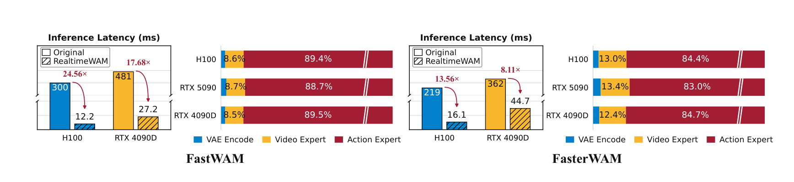
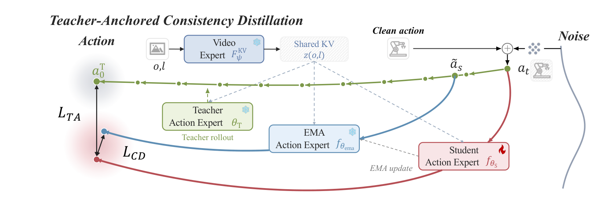
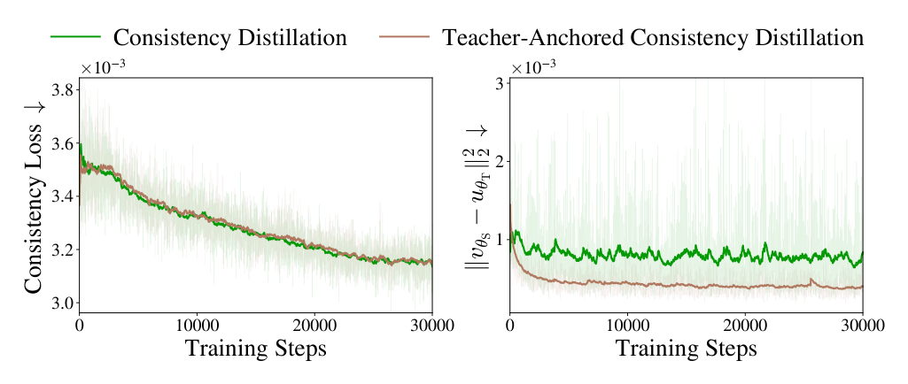
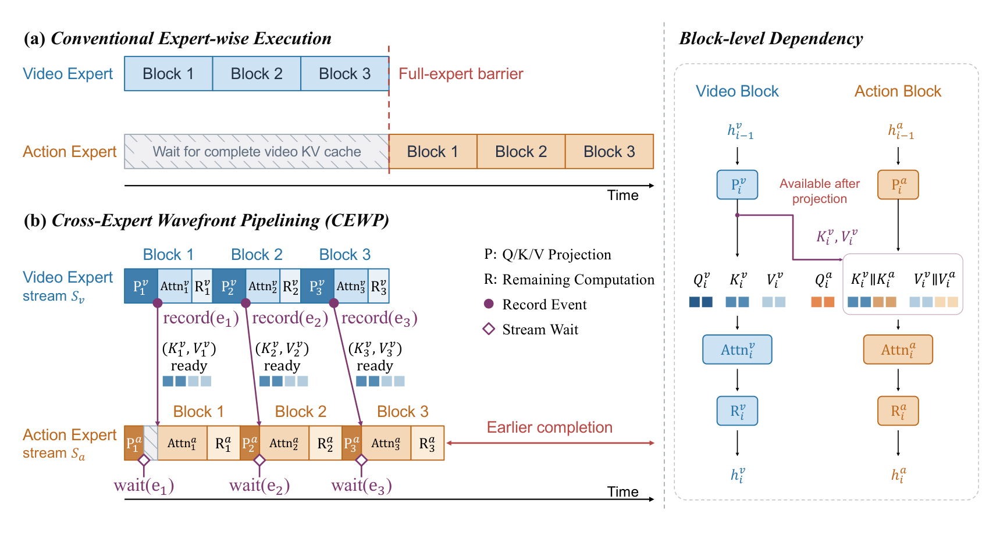
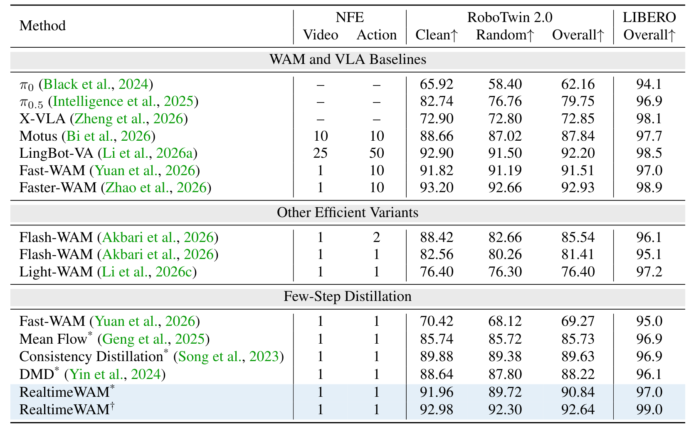
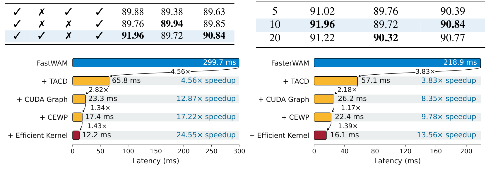
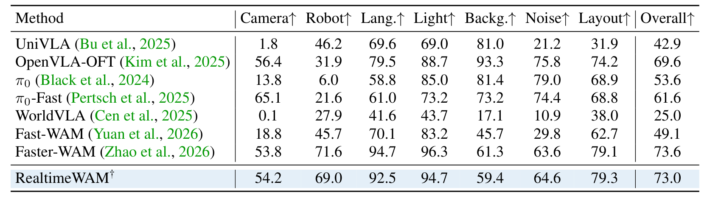
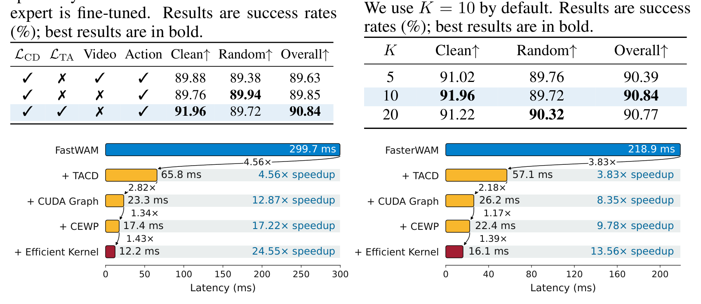

# RealtimeWAM: One-Step Asynchronous World Action Models

> **arXiv:2610.06617** · cs.RO（交叉 cs.AI/cs.LG/cs.CV）· ModelTC / LightX2V 生态线
> Chengtao Lv, Jinyang Du, Shuyi Feng, Yang Yong, Shiqiao Gu, Shunzi Yang, Ruihao Gong, Shen Ren, Tianwei Zhang, Wenya Wang
> 代码与 checkpoint：https://github.com/ModelTC/LightX2V/tree/main/examples/realtimewam

这篇论文是给 Mixture-of-Transformers 架构 WAM 做**后训练加速**的工程代表作：两个组件分别砍掉推理时延的两个来源——TACD 把多步动作去噪蒸成一步，CEWP 把专家级串行等待改成块级流水线。结果是在 Fast-WAM/Faster-WAM 两个宿主上做到 **14–25 倍推理加速、平均精度损失 <1%**，单次调用 12.2ms（H100）——真正进入 30Hz 控制周期的实时区间。对要部署 WAM 的人，这是目前最完整的一份「怎么把 WAM 压进实时预算」的施工图。

## 问题：MoT-WAM 推理时延的两个来源

WAM（世界-动作模型）从视频生成骨干借视觉表征来指导动作预测；MoT 架构（Motus/Fast-WAM/Faster-WAM 线）用独立的视频专家与动作专家经注意力交互。推理时延分解（Fig.1）显示两个瓶颈：

1. **专家内部迭代**（intra-expert iteration）：动作去噪是多步的——去噪步数主导时延（视频专家只算一次前向）。
2. **专家之间等待**（inter-expert waiting）：常规专家级执行下，动作专家要等视频专家**完整**算完所有块的 KV 缓存才能开动（full-expert barrier）。

*推理效率动机：Fast-WAM 与 Faster-WAM 的时延分解——多步动作去噪占据主导地位，且动作专家在视频专家完成全部前向后才能启动。*

## local-global 误差间隙：为什么一致性蒸馏不够

要一步出动作，自然想到一致性蒸馏（CD）。但论文识别出 WAM 场景下的特殊性（sec:method 4.1）：动作生成**强条件化**于观察/状态/指令，可行动作被压缩在窄区间——窄区间里的小偏差直接伤成功率。而 CD 只约束局部一致性：

$$f_{\theta_S}(a_t,t)-a^\star = \underbrace{f_{\theta_S}(a_t,t)-f_{\theta_{ema}}(\tilde a_s,s)}_{e_{local}} + \underbrace{f_{\theta_{ema}}(\tilde a_s,s)-a^\star}_{e_{global}}$$

（式 6）**CD 压低 $e_{local}$，不管 $e_{global}$**——局部一致性误差小不保证端点误差小。Fig.3 右图的实证：CD 训练全程，「学生速度 vs 教师向干净端点的平均速度」的距离基本不降。

## 机制流程：TACD 怎么蒸

*TACD 总览：冻结的视频专家单前向出共享 KV 条件 $z(o,l)$；三个动作专家——冻结教师（10 步 rollout 得锚定端点）、EMA 目标（局部一致性）、可训练学生（LoRA rank-128）；$L_{CD}$ 局部一致 + $L_{TA}$ 教师锚定。*

按数据流走（sec:method 4.1）：

1. **共享条件**：冻结视频专家单前向算出 $z(o,l)$ 的 KV 缓存——三个动作专家共用（KV 复用是 Fast-WAM 一系的传统）。
2. **教师 rollout**：冻结教师从加噪动作 $a_t$ 出发跑 10 步得端点 $a_0^T$——精确端点 $a_0^\star$ 不可得，拿教师端点当数值代理，并算对应的区间平均速度 $u_{\theta_T}$。
3. **学生损失**：$L_{CD}$（EMA 目标上的局部一致性，式 5）+ 权重 $\lambda=0.2$ 的 $L_{TA}$（学生速度对齐教师区间平均速度）。EMA 衰减 0.995，30k 步 AdamW，LoRA rank-128 只调动作专家。

Fig.3 的训练曲线对照干净利落：TACD 的 $\|v_{\theta_S}-u_{\theta_T}\|^2$ 在 5k 步内降到 CD 的一半以下并保持——**教师锚定真的把端点误差压下去了**。

*两种蒸馏的训练曲线：左为一致性损失，右为学生速度与教师平均速度之差——教师锚定后收敛更快、更低、更稳。*

## CEWP：把专家级屏障降为块级事件

第二个组件处理 inter-expert 等待（sec:method 4.2）。依赖分析的关键观察：**动作块 $i$ 的注意力只消费视频块 $i$ 的 KV**，不需要视频专家的全部输出。于是把粗粒度的「等整个专家」改成细粒度的事件同步：

- 视频专家每算完一个块的 Q/K/V 投影就 `record(e_i)`——该块 KV 立即可用；
- 动作专家在块 $i$ 的注意力前 `wait(e_i)`——**只在消费前同步**。

*执行时序对照：(a) 常规专家级执行——动作专家灰条等待完整视频 KV；(b) CEWP——块级 record/wait 事件对让两专家重叠执行，提前完成；(c) 块级依赖图——动作块注意力消费拼接的 $K_v\Vert K_a$、$V_v\Vert V_a$。*

块级依赖图（Fig.4c）同时证明了正确性：动作块的注意力输入是拼接的视频块 KV + 动作块自身 KV——投影后即可用，剩余计算（R）不阻塞。时延上 23.3ms→17.4ms（1.34 倍）：CEWP 的贡献小于 TACD（4.56 倍），但零质量损失。

## 实验：三基准近无损

主表（RoboTwin 2.0 多任务：50 任务、2500 clean + 25000 randomized 演示；LIBERO 四套件；LIBERO-Plus 七扰动）：

| 方法（少步蒸馏组） | RoboTwin 2.0 Overall | LIBERO |
|---|---|---|
| Fast-WAM 原始（10 步） | 91.51 | 97.0 |
| MeanFlow* | 85.73 | 96.9 |
| CD* | 89.63 | 96.9 |
| DMD* | 88.22 | 96.1 |
| Flash-WAM（一步） | 81.41 | 95.1 |
| **RealtimeWAM\***（一步） | **90.84** | **97.0** |
| Faster-WAM 原始 | 92.93 | 98.9 |
| **RealtimeWAM†**（一步） | **92.64** | **99.0** |

同训练设置（LoRA、30k 步、同 LR）下 TACD 是少步蒸馏里最高的——90.84 vs CD 89.63/DMD 88.22/MeanFlow 85.73；一步 Flash-WAM 81.41 掉 9 分以上的先例正好衬出 TACD 的保真度。对教师掉点：* 版 −0.67、† 版 −0.56——**平均 <1% 的近无损一步 WAM，此前没有先例**（论文自己的定位）。

*主结果完整表：WAM/VLA 基线、其他高效变体、少步蒸馏三段——RealtimeWAM 两个宿主版本的一步成绩与逐项数字。*

OOD 鲁棒性（LIBERO-Plus 七扰动，Table 2）：overall 73.0 vs Faster-WAM 73.6（−0.6）；相机、传感器噪声、布局三档微升，光照、背景两档略降——**步数蒸馏基本保持分布外鲁棒性**。

*LIBERO-Plus 七扰动子集完整表：八方法 × 相机/机器人/语言/光照/背景/噪声/布局七列——RealtimeWAM† 与教师逐项对照。*

## 时延瀑布与实时性

四级加速栈（Fig.5，含 VAE 编码、不含文本编码——指令每 episode 只编码一次的口径要记住）：

| 组件 | FastWAM 线 | FasterWAM 线 |
|---|---|---|
| 原始 | 299.7ms | 218.9ms |
| +TACD | 65.8（4.56×） | 57.1（3.83×） |
| +CUDA Graph | 23.3（12.87×） | 26.2（8.35×） |
| +CEWP | 17.4（17.22×） | 22.4（9.78×） |
| +高效算子 | **12.2ms（24.55×）** | **16.1ms（13.56×）** |

**12.2ms 单次调用 @H100**，显著短于 30Hz 控制周期（33ms）——论文反复强调的「实时动作生成」由此成立。每级的加速因子都单独标注（4.56×/2.82×/1.34×/1.43×），TACD 贡献最大跳变。

*时延瀑布双联：两个宿主上 TACD→CUDA Graph→CEWP→高效算子的逐级加速，每级标注相对加速比。*

## 消融到底说明了什么

三组消融（sec:experiments 5.4）：

- **$L_{TA}$ 的增量**：只有 $L_{CD}$ 89.85 → 加 $L_{TA}$ 90.84——教师锚定独立贡献约 1 分；
- **微调视频专家反伤**：微调 Video Expert 89.76 低于冻结 90.84，且训练时间与峰值显存都涨——**后训练只动动作侧**是最经济配置；
- **教师步数 K**：5/10/20 → 90.39/90.84/90.77，K=10 是甜点（默认值即最优）。

*损失项与专家微调消融：$L_{CD}/L_{TA}$ 与 Video/Action 微调四开关的组合——加教师锚定、冻结视频专家的组合最优。*

*教师 rollout 步数 K 消融：5/10/20 三档，K=10 默认即最优。*

## 边界与复用

边界：**只适用 MoT 架构**（共享主干 WAM 如 DreamZero/Cosmos 不在范围——视频专家不再单前向，锚定对象要重新设计）；Random 档掉点略大于 Clean 档（91.19→89.72）；LIBERO-Plus 布局档仍落后教师 1.9；真机闭环在附录 F.6、主文未展开统计；时延口径含 VAE 不含文本。

可搬走的三件东西：**「局部一致性+教师多步端点锚定」的蒸馏模板**（任何强条件生成头——条件窄、误差敏感——都该加端点约束）；**块级 record/wait 事件流水线**（依赖分析先行，跨专家 MoT 推理的通用方案）；**四级加速栈的分解报告方式**（每级独立可关、逐级标注贡献）。最值得做的后续：CEWP 增益随块数的标度分析，以及共享主干 WAM 上的 TACD 迁移。

**结论**：RealtimeWAM 的价值在于「近无损」三个字做到了实处——一步动作生成平均掉不到 1 分，靠的是对误差结构（local-global 分解）的准确诊断，而不是更狠的蒸馏。加上 12.2ms 的实测时延，WAM 第一次被压进了实时控制预算。做部署的人可以直接照它的栈施工。
