# SimForcing: Distilling Simulation Motion Priors into Real-Domain Robot World Models

> **arXiv:2610.06598** · cs.RO（交叉 cs.AI/cs.CV）· PKU / 中科院线
> Xiaodong Wang, Tianle Li, Chuanxin Song, Junliang Xie, Zhanmi Zhong, Suiying Wu, Peixi Peng
> 代码：https://github.com/Wang-Xiaodong1899/SimForcing

这篇论文处理的是动作条件机器人世界模型的一个两难：**真域机器人视频有直接的动作监督但学不出精确动作响应；仿真有结构化的运动监督但外观域不同、且仿真预测本身不可靠**。作者的解法有两件套：用**潜空间运动蒸馏**（对齐相邻潜差分而非外观）把仿真的运动知识迁进真域模型，再用**多块仿真条件 + condition dropout + CFG** 控制对仿真预测的依赖程度。在我的理解里，这篇与 XGenAct（codec 路线）代表同一问题的两条解法——XGenAct 把感知量编码进 RGB，SimForcing 把仿真域当监督源。

## 问题：三条既有路线各缺一角

论文开头的范式图（Fig.1）把现有方法分成三条线（sec:introduction）：直接从真域视频+动作学（IRASim/Ctrl-World 线）——动作响应难学；显式结构先验（RoboDream 锚定渲染的机器人运动、Qwen-RobotWorld 要场景视频）——控制力强但要构造并供给先验；SimForcing 是第三条：**仿真当知识源 + 可控参考**。两条迁移挑战被明确点名：外观差异妨碍直接匹配；不可靠的仿真预测会误导真域生成——这两个挑战分别对应两件套的每一件。

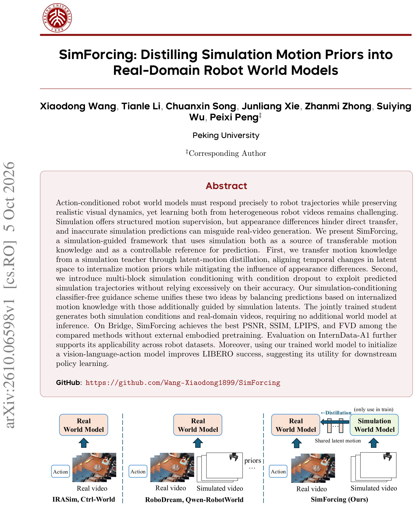
*训练范式对比：直接真域学习、显式结构先验、SimForcing（仿真教师 + 运动蒸馏 + 可控条件）三条路线的数据流框图。*

## 核心机制：运动知识用潜差分迁移

### 仿真教师

在带**轨迹增广**的合成 rollout 上训练一个 MoT 世界模型（视频 DiT + 动作 DiT，仿真视频+动作输入），然后冻结——它同时负责两件事：初始化学生、当蒸馏教师。轨迹增广保证动作多样性（仿真器可以从任意 [state, action] 出发）。

### 潜差分对齐

关键迁移机制（sec:method）：**对齐教师与学生的相邻潜差分序列** $\hat m$（相邻两帧潜态之差），而不是直接匹配潜态数值/外观。学生先在仿真域复现教师的运动序列（$\mathcal{L}^{s2s}_{motion}$，保持仿真预测能力），再在真域对齐教师的运动先验（$\mathcal{L}^{s2r}_{motion}$）——**时序结构比数值/外观可迁移得多**。这个设计的消融证据极其鲜明：蒸馏目标换成 latent value（对齐数值）PSNR 掉到 19.232 vs motion 目标的 25.077——**−5.8 分**，单变量直接证明「对齐什么」是关键。

## 机制流程：多块条件、联合训练与 CFG 推理

*SimForcing 总览：左侧数据源（配对的真域视频+动作、仿真视频）；中部核心模型——仿真世界模型（冻结，雪花标）初始化真域世界模型（火焰标）；右侧潜空间处理与损失——多块/丢失/条件块同时作用于两个域的潜序列，运动蒸馏与双域流匹配损失并列。*

按执行链走（sec:method）：

1. **联合训练**：四项损失 $\mathcal{L}=\lambda^r_{FM}\mathcal{L}^r_{FM}+\lambda^s_{FM}\mathcal{L}^s_{FM}+\lambda^{s2r}_{motion}\mathcal{L}^{s2r}_{motion}+\lambda^{s2s}_{motion}\mathcal{L}^{s2s}_{motion}$（式 16）——真域流匹配 + 仿真流匹配 + 两个方向的运动蒸馏。**学生同时会生成仿真条件与真域视频**。
2. **多块仿真条件**：仿真潜态注入学生视频 transformer 的多个块（不是只在输入端）；伴随 **condition dropout**（概率 p）与**潜态损坏**——训练学生容忍缺失或不完美的仿真引导。
3. **推理（CFG）**：SAM3 分割首帧真观察里的机械臂 → 仿真器生成未来仿真帧 → 学生编码成条件潜态 → **有/无条件两支按权重 w 组合**（式 13-14 附近）：$w$ 大信仿真引导，$w$ 小靠内部先验。**推理期不需要部署仿真教师世界模型**——学生自己生成条件。

## 为什么这套设计防过依赖

对不可靠外部条件源的设计哲学：**不是全信（w=1.0），也不是不信（w=0），而是可调**。消融证据（附录 A）：w=0.3/0.6 时 PSNR 25.014/25.077 最优，**w=1.0 掉回 24.009**——完全信仿真的直接证据；训练概率 p=0.7 配 w=0.6 联合最优 25.077（Table A1）。dropout + 损坏让模型学到「仿真引导有帮助但不可全信」的折中。

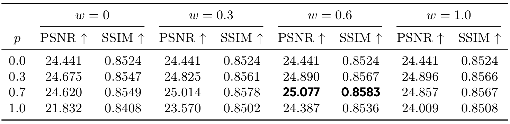
*训练条件概率 p × CFG 权重 w 联合评测完整表：p∈{0, 0.3, 0.7, 1.0} × w∈{0, 0.3, 0.6, 1.0} 十六格 PSNR/SSIM——p=0.7/w=0.6 最优 25.077 加粗。*

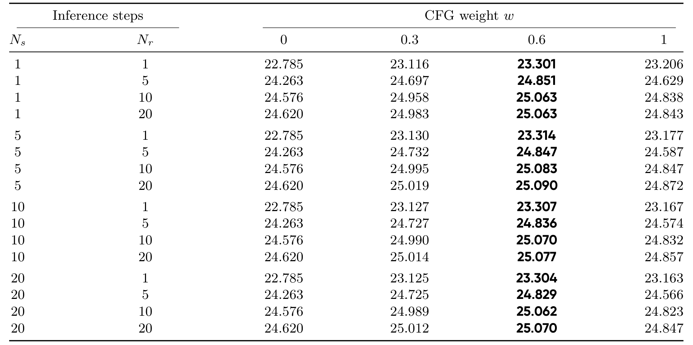
*推理步数预算 Ns/Nr × CFG 权重 w 的 PSNR 矩阵：16 行完整（w=0.6 列逐行加粗）——步数与引导权重的联合甜点。*

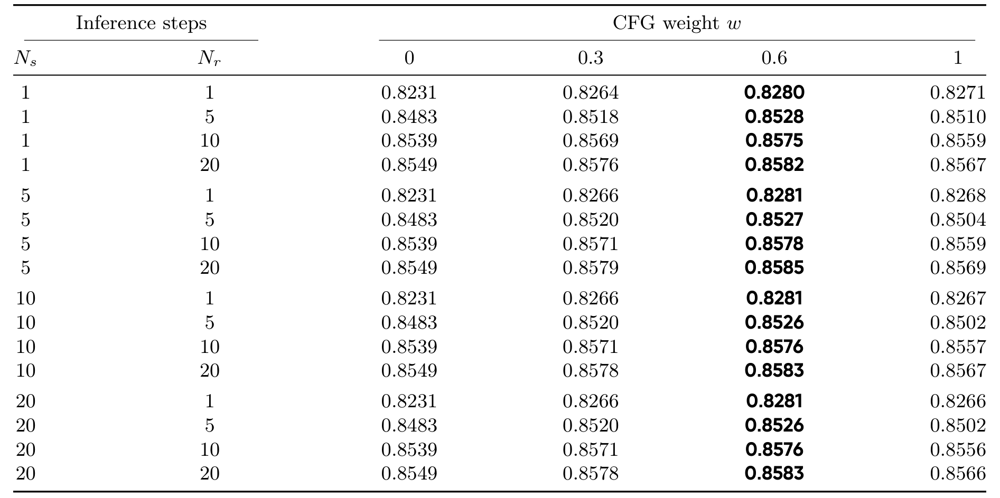
*同矩阵的 SSIM 版：w=0.6 列稳定最优。*

*同矩阵的平均推理时延（秒/样本）：Ns=1/Nr=1 时 0.644s，全档 3.3–4.8s。*

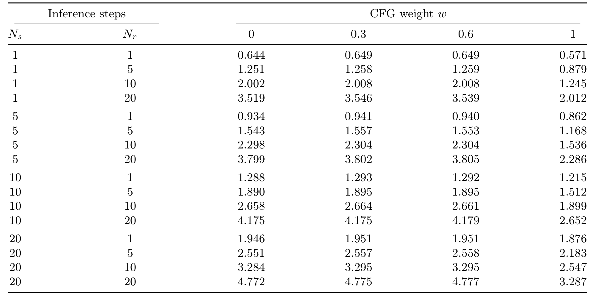
*各数据集训练设置表：batch/步数/配对样本规模逐数据集列出。*

## 实验：Bridge 与 InternData

主表（Bridge 验证集，无具身预训练组内，sec:experiments）：

| 模型 | PSNR ↑ | SSIM ↑ | LPIPS ↓ | FVD ↓ | 时延 |
|---|---|---|---|---|---|
| Ctrl-World | 20.928 | 0.761 | 0.1674 | 235.57 | 16.9s |
| EnerVerse-AC | 22.599 | 0.797 | 0.0933 | 181.55 | 16.6s |
| Wan2.2-TI2V-5B (SFT) | 22.751 | 0.838 | 0.0926 | 168.71 | 1.8s |
| GeniWorld | 23.436 | 0.845 | 0.0799 | 148.74 | 4.1s |
| **SimForcing** | **25.077** | **0.858** | **0.0673** | 137.49* | 4.1s |

*同组四指标全面最优；对具身预训练的 Cosmos-Predict2.5（27.216/0.880）PSNR 落后 5.3%，**但 LPIPS 更优（0.0673 vs 0.0996）且推理快 5 倍（4.1 vs 20.5s）**——轻量无预训练路线的定位。InternData-A1 上同样全面最优（Table 4）。

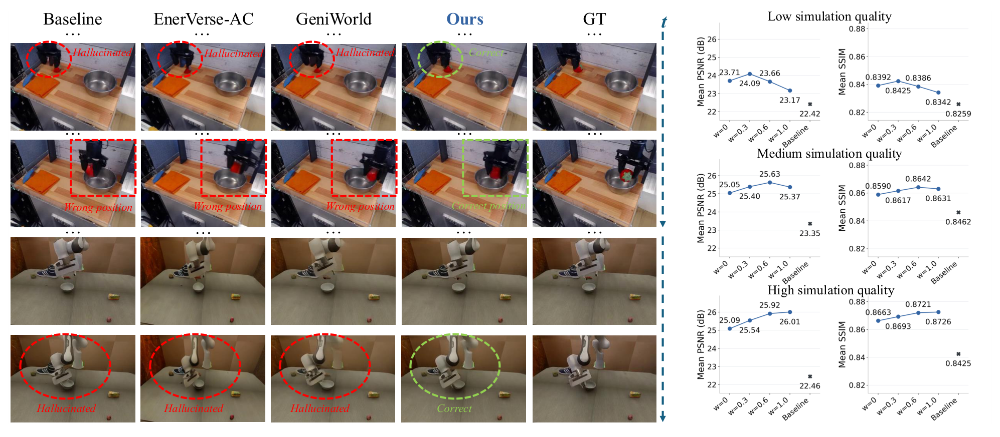
*Bridge 定性与定量：左侧 4×5 网格——红圈标幻觉/错位（基线组）、绿圈标 SimForcing 修正；右侧低/中/高三档仿真引导质量下的 PSNR/SSIM 曲线（w=0→1.0）。*

组件消融（Table 2）三个信息点：仅 FM 24.128 → 全组件 25.077；**(d) FM+TA+MD（无 SC）的 FID/FVD 19.18/100.27 全场最优**——仿真条件在感知指标上并非单调有益（SC 全开时 FID 25.21/FVD 137.49）；蒸馏目标换 latent value 掉 5.8 分（Table 3a：19.232）。InternData-A1 的同套消融（Table 4）与四基线对照给出第二数据集的完整印证。

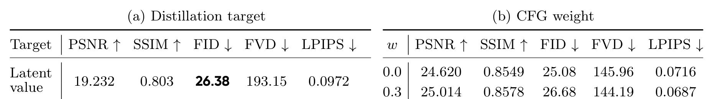
*蒸馏目标与 CFG 权重消融：(a) latent value 目标单行（PSNR 19.232）——对齐数值远差于对齐运动；(b) w=0/0.3 两行。*

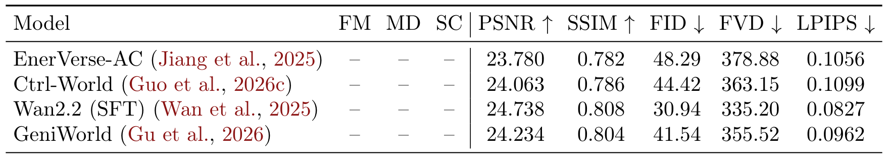
*InternData-A1 视频预测与组件消融：EnerVerse-AC/Ctrl-World/Wan2.2/GeniWorld 四基线行 × 五指标列完整。*

定性对比（附录 Fig.A1–A6）里 Baseline 组的幻觉/错位与 SimForcing 的修正一一对应——比如入碗放置任务里 GeniWorld 放到碗边而 SimForcing 与 GT 一致入碗；刀具操作任务里 Baseline 出现火焰伪影。

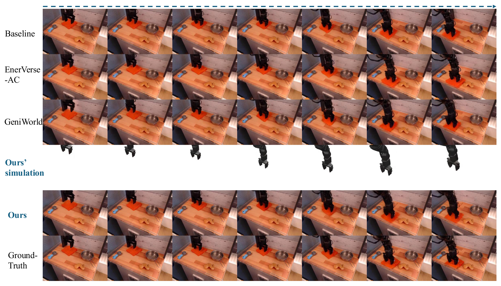
*Bridge 定性对比示例 1：六行（Baseline/EnerVerse-AC/GeniWorld/Ours' simulation/Ours/Ground-Truth）× 七帧——Ours' simulation 行只显示仿真器输出的机械臂（白底隔离行）。*

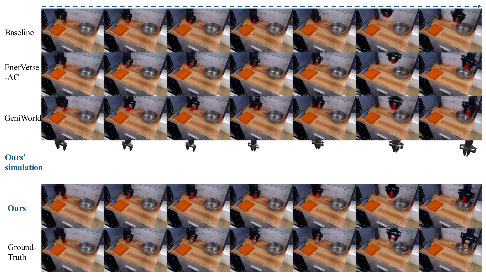
*Bridge 定性对比示例 2：放置草莓入碗任务——GeniWorld 放到碗边，SimForcing 与 GT 一致入碗。*

*Bridge 定性对比示例 3：刀具操作任务——Baseline 出现火焰伪影，SimForcing 与 GT 一致完成取刀。*

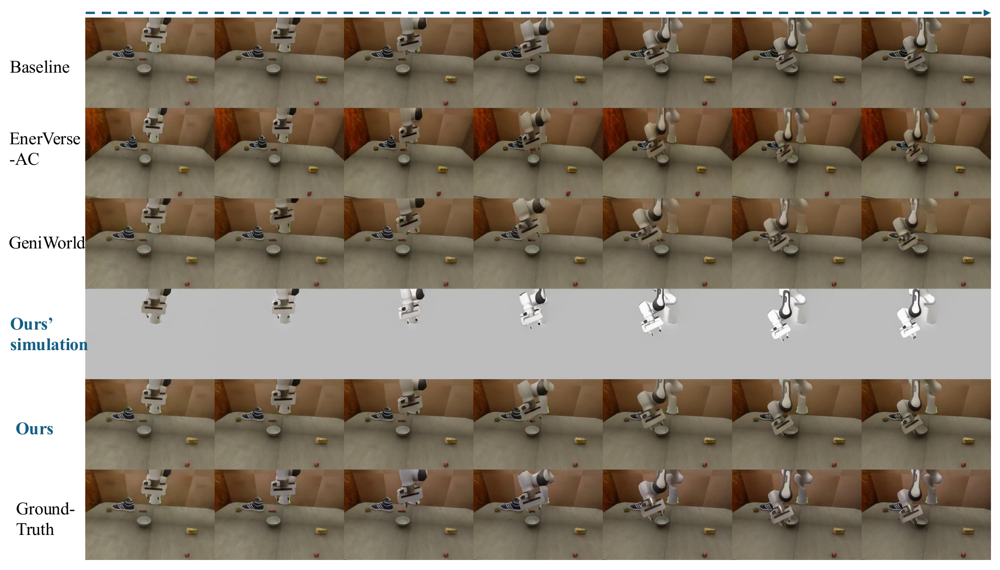
*InternData-A1 定性对比示例 2：六行七帧同结构对照。*

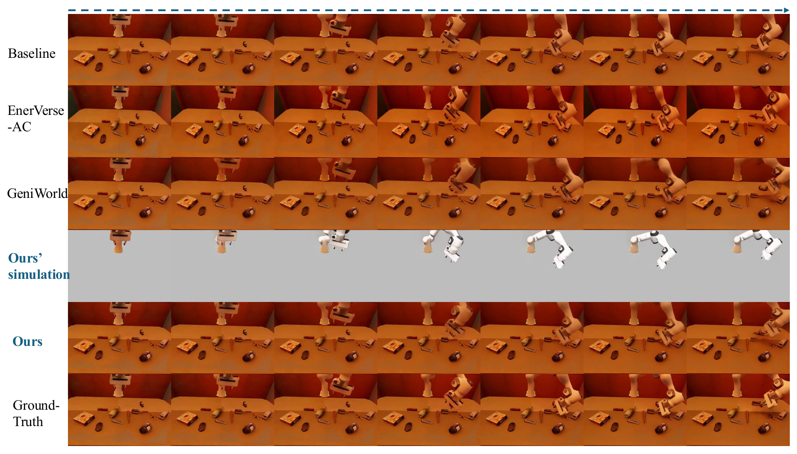
*InternData-A1 定性对比示例 3：六行七帧同结构对照。*

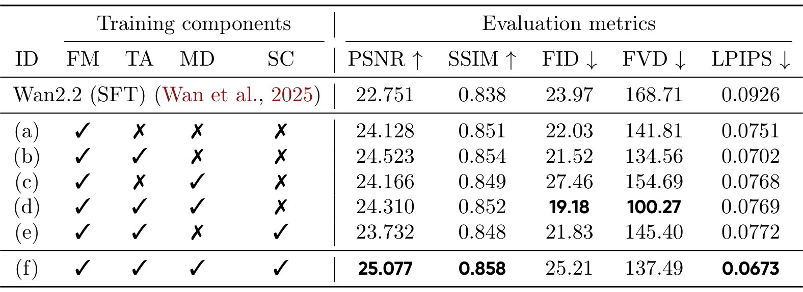
*Bridge 组件消融完整表：(a)–(f) 六行按 FM/TA/MD/SC 四开关组合，右五列指标——全组件 PSNR/LPIPS 最优，(d) 组 FID/FVD 最优。*

## VLA 下游收益

世界模型专家当 VLA 初始化的证据（Table 5，sec:experiments）：三种训练设置下 LIBERO 全面对 Wan2.2 DiT 初始化提升——**action-only 训练 82.6→89.2（+6.6）**、unconditional 96.5→97.5、video+action 98.1→98.4。规律很清晰：**动作监督越稀缺，世界模型初始化的收益越大**——WM 专家把动作-视觉动力学先验带进了策略。FastWAM 参照行 97.6。

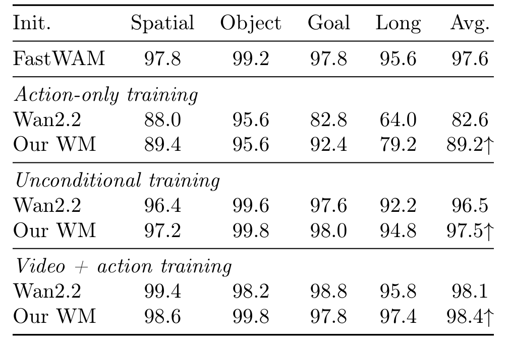
*LIBERO 下游完整表：三种训练设置 × Wan2.2 初始化 vs 本文世界模型初始化，Spatial/Object/Goal/Long 四列——action-only 档 +6.6 最大。*

## 边界与复用

边界：主证据是 Bridge/InternData 两个验证集指标 + LIBERO 下游——**无真机闭环**；需要数据集自带 [state, action]→仿真器管线（无精确仿真器的源不适用）；SAM3 分割只在推理期、首帧、机械臂区域；FID/FVD 上 SC 非单调（最优组合不含 SC）——「可控参考」的价值要按指标分口径看。

可搬走的三件东西：**相邻潜差分当跨域蒸馏目标**（时序结构比数值/外观可迁移——任何仿真→真域蒸馏的通用模板）；**condition dropout + 输入损坏**（对不可靠外部引导源的标准防过依赖设计）；**推理期 CFG 组合**（内部先验 + 外部引导两支可调——部署时不需带着引导模型）。最值得做的后续：SimForcing 生成的 rollout 当策略训练数据（WorldArena 式数据引擎验证）——论文只证了「预测准」，「生成的轨迹能训策略」还是开放问题。

**结论**：SimForcing 把「仿真帮助真域世界模型」做成了可控的两件套——运动蒸馏管「迁什么」，多块条件+CFG 管「信多少」。每个设计选择都有对应消融，边界报告诚实（SC 非单调、Cosmos 天花板明写）。做机器人世界模型的人这篇和 XGenAct 应该对照读：一个从任务侧加感知监督，一个从仿真侧加运动监督。
