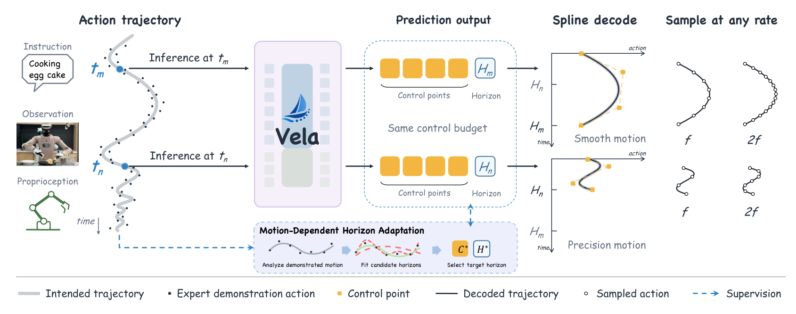
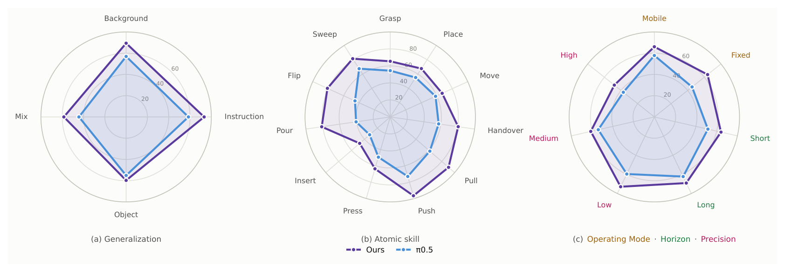
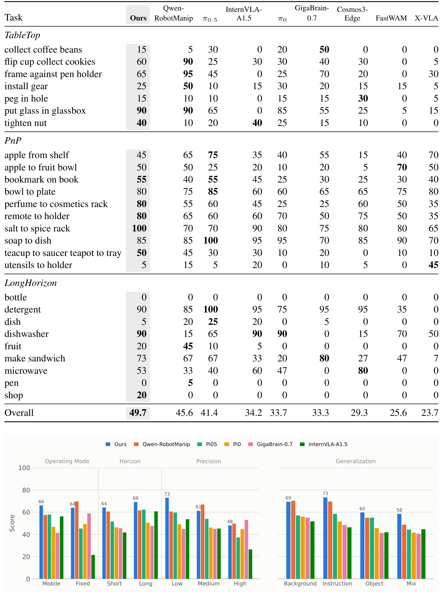
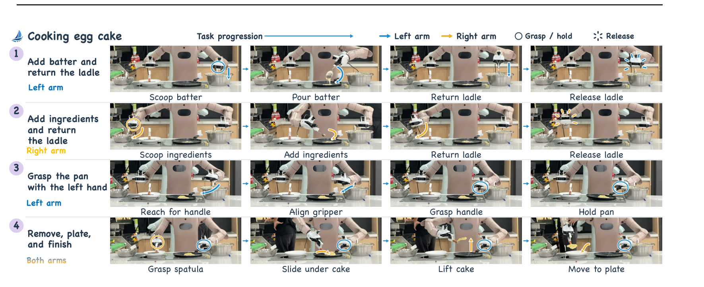
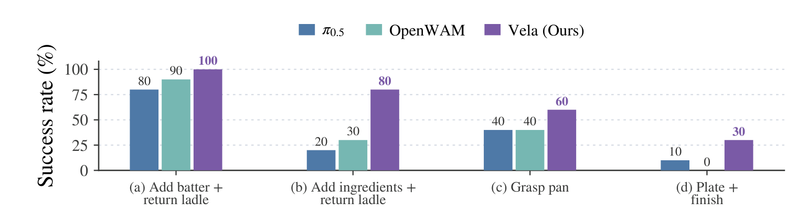
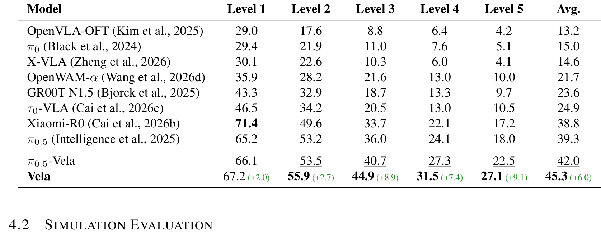
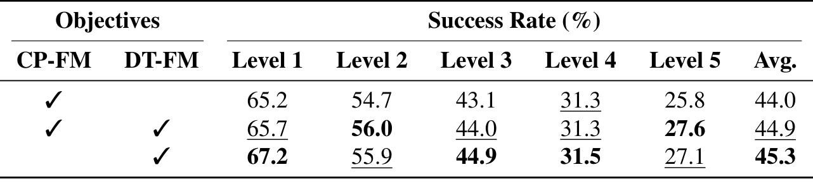
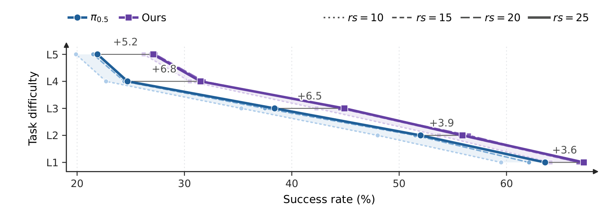
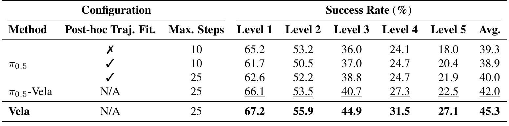
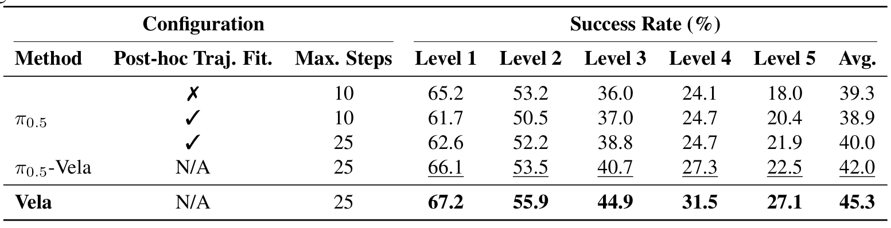

# Vela: Scaling Vision-Language-Action Models with Adaptive Action Curve Parametrization

> **arXiv:2610.05230** · cs.RO（交叉 cs.AI）· Fudan / CUHK / UCSB 线
> Yifan Li*, Jiaxu Wang*, Dongming Wu, Yicheng Jiang, Ryan Ji, Xiangyu Yue†, Yanwei Fu†（*等同贡献，†共同指导）· 项目页 https://clementine24.github.io/Vela/

这篇论文回答一个很具体的问题：**VLA 的动作输出为什么必须是固定时间网格上的点序列？** 作者给出的答案是把未来动作建模为连续轨迹——用一组 B 样条控制点描述几何形状、一个标量 horizon 描述时间跨度，让固定的输出预算在不同运动上自适应分配。在我的理解里，这是「动作表征」这个方向目前论证最完整的一篇：同一个 π0.5 架构、不加任何参数，LIBERO-X 平均从 39.3 提到 45.3，且增益在越强的扰动级别上越大。

## 动作预算为什么被 horizon 绑死

先建立直觉。pointwise 动作 chunk $A_{t,H}=[a_t,\dots,a_{t+H-1}]$ 把三件事捆在一起：**输出预算**（多少个动作点）、**预测跨度**（看多远）、**时间分辨率**（相邻动作间隔）。这三者的耦合在两个方向上都疼：平滑运动里相邻动作高度相关，逐点预测浪费容量；接触富操作里固定预算摊到长跨度，又丢了局部精度。而且执行期还依赖预定义采样网格——策略只会在网格点上给动作。

论文的切入点（sec:introduction）是把这诊断成一个**表征与被控对象不匹配**的问题：机器人动作本来就不是孤立的点，而是连续运动的采样。顺着这个视角，$a_{t+i}=\gamma_t(u_i)+\epsilon_{t,i}$ 把「记录到的动作」分解成「潜在意向轨迹的采样」加「演示/执行噪声」——这个分解是后面所有设计的根。

## 核心视角：把轨迹当成被预测对象

*Vela 总览：左边是策略上下文（指令/观察/本体感知），中间 Vela 联合预测控制点与 horizon（同一控制预算、不同 $H_m/H_n$），右边 spline 解码后可在任意频率采样；下方 MDHA 模块在训练期构造监督目标。*

具体参数化是 B 样条：$\hat\gamma_t(u)=\sum_n b_n(u)\,c_{t,n}$，$N$ 个控制点 $C$ 加一个标量 $H$ 构成联合输出 $y=(C,H)$。解码时 $a(s)=\hat\gamma(s/(H-1))$——**同一组控制点，换采样密度不换表征**（式 5 的 $B_H C$ 线性解码）。实现上 $H$ 只是控制点坐标旁边多出的一个标量通道，控制点数量固定、跨度随上下文变化。

架构完全继承 π0.5（sec:methodology 3.2）：3B PaliGemma 骨干 + 300M flow-matching 动作专家，无新增参数。flow 的终点就是 $y=(C,H)$。

## 机制流程：从演示到任意频率执行

按执行链走一遍：

1. **训练期（离线，逐 transition）**：对每个演示窗口，在候选 $H\in\{16..40\}$ 里做噪声标定的 horizon 选择（下面细讲），最小二乘拟合 $C^*=B^\dagger_H A_H$，得到监督目标 $y^*=(C^*,H^*)$。全程批处理矩阵运算，不需要单独的轨迹标注 pass。
2. **训练（在线）**：flow-matching 回归 $y^*\leftarrow y_0$，几何分量用解码加权损失（DT-FM，式 11），horizon 分量用标准 FM。
3. **推理**：策略直接输出 $(C,H)$，**不做任何拟合或搜索**——训练期的噪声标定只决定监督目标质量，部署期零开销。

### 为什么 horizon 选择要噪声标定

这是全文最值得精读的设计（sec:methodology 3.3）。固定 $N$ 下，$H$ 越长同样的控制点摊得越稀。要选「最长且充分」的跨度，直接拿拟合残差做阈值会混进两样东西：真实未表征的运动，和演示本身的噪声。论文的解法是推一个参考尺度：假设逐坐标演示扰动 $\mathrm{Cov}[\epsilon_j]=\sigma_j^2 I$，则期望残差分解为

$$\mathbb{E}\|r_j(H)\|_2^2 = \|(I-B_H B_H^\dagger)\gamma_j\|_2^2 + (H-N)\sigma_j^2$$

（式 8：未表征运动 + 噪声×自由度）。用 $\hat\sigma_j$（从归一化演示的二阶时间差分估计、逐数据源）归一化后得 $\psi^2(H)$（式 9）——**在参考噪声模型下，可表征运动的 $\psi^2$ 期望约为 1**，随未解结构增大。于是 $H^\star=\max\{H:\psi(H)\le\kappa\}$ 就能区分「分辨率不够」和「演示本来就有抖动」。夹爪这类稀跃变通道不适用除以近零噪声尺度，单独改用投影误差判据。

**我的分析**：这个归一化的工程价值超出 VLA——任何「固定预算下分配时变分辨率」的回归任务（轨迹预测、时序插值、视频帧率自适应）都能套用。它依赖两个假设：扰动零均值、逐源独立。遥操作抖动强非高斯的源会怎样，论文没有检验，这是边界。

## 跨本体预训练与损失设计

规模化部分（sec:methodology 3.4）走的是最低成本路线：全部数据源映射到共享 $d_a=26$ 维 action-path 空间（每臂 10 维末端运动 + head/waist/base 各 2 维），逐源分位归一 + 有效性掩码。$\kappa$ 作用在无量纲的噪声归一化统计量上，跨源可比。预训练规模约 2 万小时公开数据（60 数据集/11 本体类）+ 2 万小时私有数据。

几何损失有个值得注意的细节：直接对控制点用标准 FM（CP-FM）是在参数空间各向同性加权；DT-FM 把误差过一遍线性解码器再计权（$B_H^\top B_H/H$ 二次型），**按对解码轨迹的影响加权**。这是「输出经解码器消费时，在解码空间计权」的一般原则（我的理解，附录 A.2 有对照）。

## 实验：仿真与真机证据

主表数字（sec:experiments，全部同 π0.5 官方配方）：

| 配置 | LIBERO-X 平均 | 相对 π0.5 |
|---|---|---|
| π0.5（点预测基线） | 39.3 | — |
| π0.5-Vela（后训练引入轨迹空间） | 42.0 | +2.7 |
| Vela（轨迹空间预训练） | **45.3** | **+6.0** |

逐级看，增益集中在强扰动档：L5 27.1 vs 18.0（+9.1）、L4 31.5 vs 24.1（+7.4）。EBench（sec:model-2 的总表）overall SR 49.7 vs 41.4（+8.3）、Score 66 vs 60；最大单项改进在精细桌面操作组 44.3 vs 29.3（+15.0）——与「接触富任务最吃局部时间精度」的机制一致。

*EBench 能力剖面雷达图三联：(a) 泛化四轴、(b) 原子技能 11 轴、(c) 操作模式/时长/精度七轴——Vela（紫）在几乎所有径向上外扩 π0.5（蓝虚线）。*

*EBench 逐任务完整表（26 任务 × 9 方法，Overall 49.7 全场最高）与操作模式/泛化分组柱状图。*

真机 egg-cake（sec:experiments 4.3）：轮式双臂平台、四阶段任务（加面糊→加料→左手持锅→铲出装盘），每子任务 10 trials。Vela 四个子任务全部最高，均值 67.5%，转移/装盘阶段优势最大。附录 D 有 potato shredding 第二任务。

*真机 egg-cake 任务分解：四行对应四个阶段，蓝/橙箭头标左右臂，圆圈标抓握、星形标释放——双臂协调 + 工具使用 + 接触富的组合。*

*真机四子任务成功率：Vela 在全部子任务上超过 π0.5 与 OpenWAM。*

*LIBERO-X 主结果完整表：9 个方法 × 5 级扰动 + 平均，绿色数字为对 π0.5 的绝对增益。*

## 消融到底说明了什么

三组消融（sec:experiments 4.4）分别回答三个问题：

**① 增益是不是只来自输出平滑？** 给 π0.5 的点预测加推理期 spline 拟合重采样（Max.Steps 10/25 两档）。结果 post-hoc 最好 40.0（Max.Steps=25），仍低于学参数的 π0.5-Vela 42.0；Max.Steps=10 时 38.9 甚至低于原始 39.3。**学习目标本身（而非平滑性）是增益来源**——这组消融排除了最省事的替代解释，信息量最大。

**② 自适应 horizon 有多大独立贡献？** 固定 H 全局 43.2 vs 自适应 45.3（Table 4）：spline 表征本身已带来大部分增益（43.2 仍远高于 π0.5），自适应再 +2.1。

**③ 几何损失怎么选？** Table 5：CP-FM 单独 44.0、CP+DT 混合 44.9、纯 DT-FM 45.3——解码加权稳定最优但差距不大。

*几何目标消融：CP-FM / CP+DT 混合 / 纯 DT-FM 三行 × 六列完整数值——解码加权（DT-FM）45.3 最优。*

*重规划间隔鲁棒性：L1–L5 各难度档 Vela 对 π0.5 的 +3.6~+6.8 差距标注（rs∈{10,15,20,25} 为执行步数参考线）——轨迹表征在更稀疏的重规划下仍保持优势。*

*post-hoc 拟合消融：仅推理期拟合（两档 Max.Steps）追不上学习轨迹参数（42.0/45.3）；Max.Steps=10 时拟合反而伤精度。*

*Fixed H. vs Adap. H.：同一 spline 与预算下，逐运动选 horizon 再 +2.1。*

## 边界与复用

证据边界：全部增益报告于操作类基准（LIBERO-X/EBench/双臂真机）；无 locomotion/导航证据；π0.5 是同 checkpoint 同配方对照，其余基线数字来自各自官方配方，跨家族比较需谨慎；非 flow 动作头（AR 离散）未验证。

可搬走的三件东西：$\psi^2(H)$ 噪声归一化 horizon 选择（模板级）、DT-FM 解码空间计权（原则级）、逐源分位归一 + 掩码的共享动作接口（工程级）。开放问题里最值得做的是把 MDHA 的 per-motion horizon 思想接到 WAM 的动作条件块长选择上——与同日的 FLEX-WAM「block size 当部署期旋钮」正好互为镜像。

**结论**：Vela 把「动作是轨迹的采样」从口号做成了完整管线——建模（式 2-3）、监督目标构造（式 6-9）、规模化接口（26 维）、损失设计（DT-FM）四个环节全部给出可复现细节，且每组消融都在排除替代解释。对做 VLA 的人，这是动作表征从 chunk 时代转向连续参数化时代的标志性一版。
