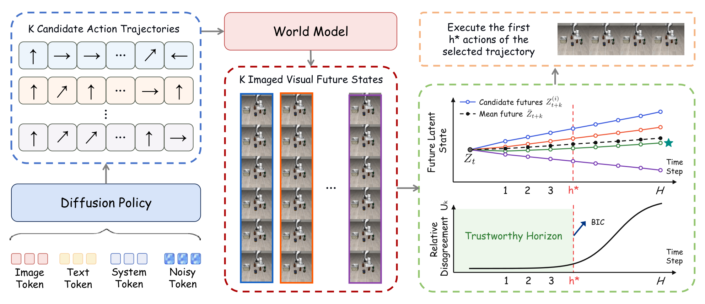
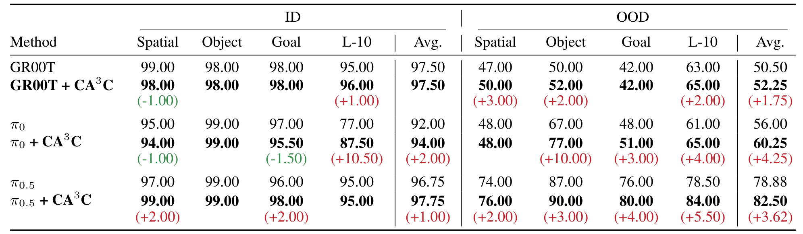
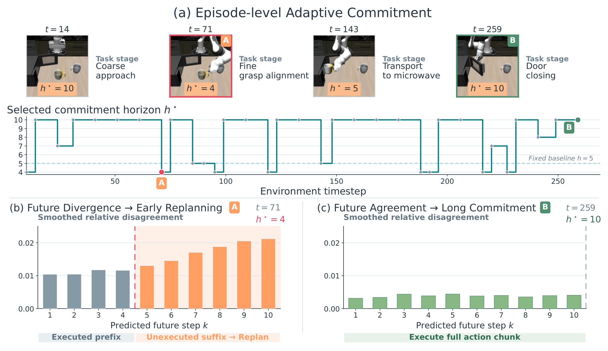
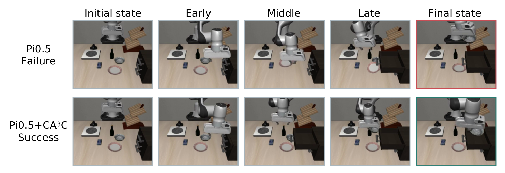
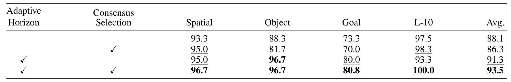
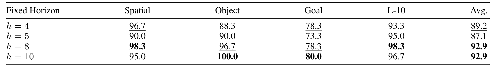
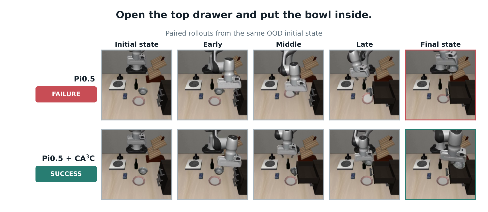
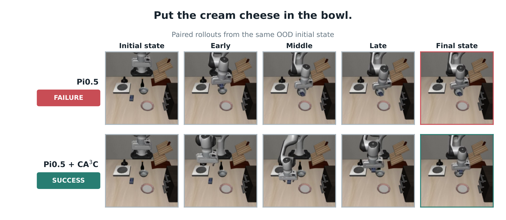
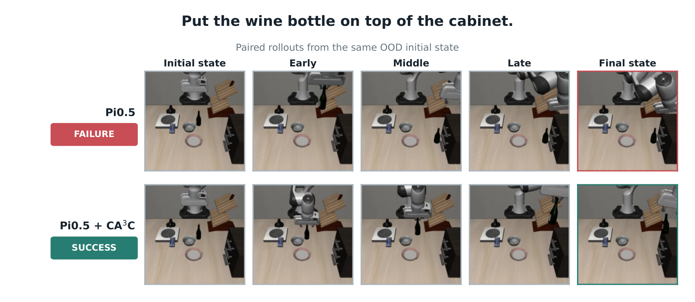
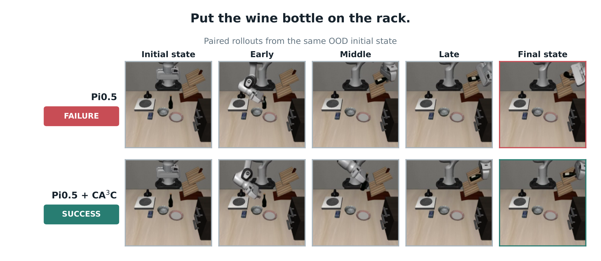

# Commit While Futures Agree: Consequence-Aware Adaptive Action Chunking for Robot Manipulation

一句话定位：动作 chunk 该执行多长，不该由动作空间的相似度决定，该由**想象未来的分歧**决定——CA³C 在推理时用冻结的世界模型对 K 个候选动作 chunk 想象配对未来，BIC 变点检测找「可信视野」，共识选执行候选；**不改不训基策略**，LIBERO-Plus 上三策略相对失败率降 30.5–61.3%（套件级最高 71.8%）。arXiv:2610.07949，2026-10-06 提交，18 页。

## 研究问题：执行多长的 prefix

动作 chunk 策略预测 H 步、执行前 h 步。现有系统几乎都用**固定 h**——隐含假设「能预测多长就可信多长」。但预测能力不等于执行可靠性：自由空间里可以长开环，抓取/接触/精放附近只有短前缀可靠；分布移动下更早失效。反过来，频繁重规划又会打断可靠执行、推高推理成本、破坏跨 chunk 运动一致性。

已有的自适应方法（动作熵、跨预测视野一致性、流去噪轨迹稳定性）全部从**策略的动作生成过程**取置信度。论文的关键观察是这不够：**不同动作可以产生同一成功结局，而接触附近的相近动作可以导致完全不同的结局**——动作空间的模糊度不直接决定执行风险。该问的不是「动作看起来可靠吗」，而是「它们诱导的未来还一致吗」。

## 方法主线

### 配对想象未来与相对分歧

重规划点 $t$：冻结策略 $\pi_\theta$ 从共享上下文采 $K$ 个候选动作 chunk $\{A^{(i)}_t\}$；冻结世界模型 $f_\phi$ 从锚点潜 $z_t$ 预测各自未来潜轨迹 $Z^{(i)}=\{z^{(i)}_{t+1},\dots,z^{(i)}_{t+T}\}$。关键实验设计：**随机世界模型下，独立采样的未来混杂「动作差异」与「预测器自身差异」两种变异**——所以同一次重规划内复用同一初始噪声 $\epsilon^{(1)}=\cdots=\epsilon^{(K)}$，得到只差动作 chunk 的配对想象未来。

分歧度量三步走（式 4–9）：候选均值 $\bar z_{t+k}$；绝对分歧 $D_k=\sum_i\|z^{(i)}_{t+k}-\bar z_{t+k}\|^2$；总预测运动 $M_k=\sum_i\|z^{(i)}_{t+k}-z_t\|^2$。方差分解 $M_k=\frac{1}{d}\|\bar z_{t+k}-z_t\|_2^2+D_k$ 说明：**绝对分歧随潜尺度与场景运动量变化**（大值可能只是共享的任务进度），归一化

$$U_k=\frac{D_k}{M_k+\varepsilon}$$

度量的是**候选依赖发散占预测变化的份额**——共享进度被除掉。再用宽 3 对称均值平滑抑制孤立时间噪声。

### BIC 变点选承诺视野

把平滑分歧曲线 $y_k=\tilde U_k$ 转成承诺边界：分歧从稳定趋势转加速增长的**变点**在哪？绝对阈值不适用（潜尺度/场景动态跨任务差异大），所以做模型比较——零假设是单直线 $f_0(k)=a+bk$；对每个 $h$，备择是连续铰链 $f_h(k)=a+bk+c(k-h)_+,\ c\ge0$（**非负斜率增量**防止普通下行弯折被误读为风险增加）。BIC 打分（式 12-13），$\mathrm{BIC}_1(\hat h)<\mathrm{BIC}_0$ 才选变点，否则提交最长有效前缀——**只有变点证据足以justify额外模型复杂度时才提前重规划**。

### 未来共识候选选择

视野定了「何时重规划」，共识定「执行哪个候选」：候选 $i$ 在选定前缀上的共识成本

$$C_i(h^\star_t)=\sum_{k=1}^{(K-1)h^\star_t d}\sum_{j\ne i}\|z^{(i)}_{t+k}-z^{(j)}_{t+k}\|^2$$

平方欧氏下等价于**选离均值想象轨迹最近的候选**——选代表性后果而非极端未来，无额外阈值。整个算法（Algorithm 1）冻结策略与世界模型，零训练零修改。

## 实验

### 三个基准与三策略

策略：GR00T N1.7 / π0 / π0.5 的已发布 benchmark 微调 checkpoint；世界模型：IRASim 适配版，每环境 60k 步微调。基线一律固定 h=5、同一 rollout 协议。

| 设置 | GR00T | π0 | π0.5 |
|---|---|---|---|
| LIBERO ID 平均 | 97.50 → 97.50（持平） | 92.00 → 94.00 | 96.75 → 97.75 |
| LIBERO OOD 平均 | 50.50 → 52.25 | 56.00 → 60.25 | 78.88 → 82.50 |
| LIBERO-Plus 24 任务平均 | 45.8 → **79.0** | 67.9 → 77.7 | 88.1 → 93.5 |

LIBERO-Plus（24 任务 × 120 rollouts）是主战场：三策略相对失败率降 **61.3% / 30.5% / 45.4%**，套件级最高 71.8%（π0.5 LIBERO-Object）。OOD 平均失败率相对降 3.5–17.1%。RoboCasa Kitchen 24 任务：三策略相对降 11.6% / 4.6% / 7.0%——增益跨出 LIBERO 分布。真机 AgiBot G2 + ACOT：Block Separation 78→82、Parcel Sorting 56→62（各 50 rollouts，长视野任务增益更大）。

### 组件消融与 h* 分布

表 4（π0.5，LIBERO-Plus）：仅自适应视野（固定主候选）相对降幅 26.9%；仅共识选择（固定 h=5）86.3；完整 93.5——**视野自适应贡献大于候选选择**，两者可加。h* 分布（图 5，5,141 个重规划事件）：均值 8.49、主体落 8–10——不是把固定 5 翻成另一个固定值，而是真正的状态依赖（图 3 的 episode 轨迹：粗接近 h*=10 → 精对齐 h*=4 → 运输 5 → 关门 10，同一 episode 内按阶段切换）。

## 边界与适用条件

论文自述的适用条件（讨论节）：CA³C 需要**有候选多样性的生成策略**（近确定性策略无变异可比较）与**动作敏感且准确的世界模型**（动作不敏感→假一致，不准→假分歧）；Uk 是跨合理动作的结果变异，不是校准的模型误差估计；每个重规划点要跑 K 次世界模型前向（推理开销）；K、hmin/hmax、平滑窗宽仍是手调结构选择（BIC 只免掉了绝对阈值）。

我的分析补充：失败率降幅是相对量——GR00T 在 LIBERO-Plus 上 45.8→79.0 恰恰因为基线弱空间大；ID 高基线时增益趋零（GR00T 平均持平、Spatial −1.00；π0 ID 有两套件小幅回退）。这类推理时方法的正确期待是「OOD/低基线场景的大幅修复」，不是全面提升。

可搬组件：

1. **「共享噪声的配对想象」**：任何随机预测器里要隔离「动作效应 vs 预测器效应」，复用同一初始噪声是最干净的实验设计——比训 N 个动力学拿 ensemble 分歧便宜得多（与上周 EpicWorldModel 的流采样方差一脉相承）。
2. **BIC 变点检测替代绝对阈值**：任何「分歧/不确定度随视野增长」的曲线都能这样定可信视野，跨任务免调阈值。
3. **相对分歧归一化 $D_k/M_k$**：把绝对潜空间分歧变成份额度量，跨任务可比——潜空间一致性度量通用模板。

*Figure 1 固定 vs 自适应 chunk：固定执行前缀隐含「能预测即可信」；CA³C 比较多候选的想象后果——未来一致就长提交、分歧就早重规划。*

*Figure 2 CA³C 总览：K 候选动作轨迹 → 世界模型共享噪声想象 → 潜状态分歧曲线与 Uk 份额 → BIC 定 h* → 执行选定候选前 h* 步。*

*表 1 LIBERO ID/OOD：三策略六行对照含逐套件增量标注；OOD 平均相对失败率降 3.5–17.1%。*

*图 3 episode 级 h* 轨迹：粗接近 10 → 精对齐 4（分歧变点后早重规划）→ 关门 10——同一 episode 内按任务阶段切换，不坍缩到固定 5。*

*图 4 匹配 rollout：同一 OOD 初始状态下 π0.5 失败 vs π0.5+CA³C 成功的逐阶段对比。*

*表 4 组件消融：仅自适应视野 26.9% 相对降幅、仅共识 86.3、完整 93.5——视野自适应贡献大于候选选择。*

*表 5 消融扩展：附加设置对照。*

*图 7 附录：附加定性结果。*

*图 8 附录：附加定性结果。*

*图 9 附录：附加定性结果。*

*图 10 附录：附加定性结果。*

## 书目信息

- 论文：[arXiv:2610.07949](https://arxiv.org/abs/2610.07949)（cs.RO）
- 作者：Yuyan Li、Yujia Wang、Yusong Huang、Junjie Yang、Yanggang Sheng、Ziyi Shi、Wenpeng Xu、Xiaoyang Zhou、Haoang Li、Hongliang Lu、Xinhu Zheng（11 人团队）
- 数据口径：LIBERO ID/OOD + 24 LIBERO-Plus 任务（120 rollouts/任务）+ 24 RoboCasa 任务（20 rollouts/任务）；真机 AgiBot G2 两任务各 50 rollouts；策略为已发布 checkpoint（GR00T N1.7 / π0 / π0.5）
- 备注：18 页 10 图含附录；无公开代码/项目页链接（abs 页与正文未见）
