# DepthWorld: 3D World Model for Robot Manipulation

一句话定位：给 SVD 系视频世界模型补上它缺的那块 3D 几何——CIIRC CTU（Jai Bardhan、Josef Šivic、Vladimír Petrík）用「联合因子图校准管线 + 空间潜平铺」两件套，把 DROID 升级成 7 万 episodes 的监督级 3D 语料（DROID-3D），再训出联合预测多视角 RGB+depth 的世界模型；**深度监督反过来把 RGB 预测提升 +1.48 dB**。arXiv:2610.08780，2026-10-06 提交，CoRL 2026 接收，代码/权重/数据集已发布。

## 研究问题：几何不连贯为什么卡住世界模型的下游用途

视频世界模型的三类下游用途——策略评估、策略改进、规划——全都依赖 rollout 的**几何保真**。但当前模型只在 RGB 上训练，损失函数没有任何信号去消解像素序列的 3D 歧义：预测深度跨视角不一致、遮挡与接触的几何推理会错、物体形状随 rollout 退化（论文的图 1/图 4 给了两个直观例子：餐具形状消失、把开着的柜门当实心面让手臂「撞」上去）。

自然的修法是直接监督几何——几何基础模型（VGGT/DUSt3R 线）正是这么做的。但论文指出这套配方搬不过来，卡在两头：

1. **数据端**：几何基础模型的泛化来自「本来就带度量深度和标定位姿」的数据集。遥操作数据集的几何标注只是采集流程的副产品——操作场景以无纹理桌面和镜面机械臂为主，经典立体 SDK 直接失效；而且即使一个 rig 内部自洽，bundle adjustment 也可能让它与机器人自身坐标系**运动学解耦**（ proprioception 与末端动作的链路断了）。
2. **模型端**：常规多模态架构改动（VAE 通道扩展、并行双分支 U-Net）需要破坏性重初始化，会毁掉 SVD 预训练先验——而那正是这些骨干有效的原因。

## DROID-3D：两阶段校准管线

### Stage 1：逐视角度量深度与内部一致 rig

每个 DROID 相机是已知基线 $b$、焦距 $f$ 的标定立体对，度量深度归约为逐像素视差：$z = fb/d$。操作场景的视觉歧义让经典立体失效，所以用学习式全局匹配网络 **S2M²** 恢复逐视角度量深度（边界锐利），再用**密集对应**把每个场景各自标定的相机拉成一个内部一致的 rig，近似放进机器人坐标系——好到 Stage 2 能把 URDF 渲染进每个视角。

### Stage 2：grounding 估计与联合因子图

把 URDF 渲染到每个外视角、与真实图像做关键点对应，把 rig 锚定到机器人系。然后是本文的机制核心：**联合因子图**把「逐场景外参修正 $\delta T^{s}_{ext1}, \delta T^{s}_{ext2}$」与「跨全部 episodes 共享的运动学参数（手眼修正 $\delta T_{wrist}$、关节编码器偏移 $\delta q$）」放进同一个优化问题——同一物理机器人的所有 episodes 一起池化，共享参数被跨场景约束。

结果（表 1，5 个 DROID 实验室约 1000 场景）：

| 指标 | PointWorld 式逐场景基线 | 本文 |
|---|---|---|
| EE 重投影 (px)↓ | 5.84 | **0.25**（23×） |
| WE 重投影 (px)↓ | 13.19 | **1.03**（13×） |
| 机器人深度误差 (mm)↓ | 111.3 | **14.0**（8×） |
| URDF mask IoU↑ | 0.440 | **0.810**（+37 点） |

基线在约 18% 场景（180/995）根本不收敛；耦合优化没有对应的逐场景失败模式。GT 板实拍对照：外参恢复到 **4.9 mm / 0.39°** 中位、手眼 3 mm / 0.3°、关节偏移 0.14° 均值——同一设置下逐场景基线 72 mm / 3.0°，差一个数量级。落到 DROID 上就是 **DROID-3D**：7 万+ episodes 的度量深度 + 重校准多视角外参，90% 外相机 episodes 重投影误差 <0.7 px。

逐因子消融（表 A1）确认机制归属：去掉 $\delta T_{wrist}$ 因子，WE 从 1.03 恶化到 2.07；再去掉 $\delta q$ 恶化到 2.22——共享运动学参数正是跨场景约束的载体。

## DepthWorld 架构：不动 VAE 的两处改动

### 空间潜平铺

Marigold 证明过图像扩散 VAE 几乎无损地编解码深度图。本文据此把 depth 当作**另一张图像**、与 RGB 并排平铺进潜空间：每个视角-模态 tile 由**原封不动的 SVD VAE** 独立编码（192×320 → 24×40 潜），RGB/depth 水平拼接、3 个视角垂直堆叠成 **72×80 的单一联合潜网格**；U-Net 把整个网格当一个 tensor 去噪，时间窗 11 帧（6 历史 5 未来）@5 Hz，动作条件与 Ctrl-World 相同（逐帧末端位姿）。**唯一的网络改动是把空间位置嵌入扩展到更宽网格**。

对照消融（表 A2）：external PSNR 平铺 23.66 vs 双分支 21.94 / 通道扩展 22.22——不破坏先验的最小改动反而最强。

### 机器人系点图监督

逐视角深度去噪对「跨视角预测深度互相矛盾」没有显式惩罚。本文在 SVD U-Net 的最终预测潜 $\hat{x}_0$ 上挂一个轻量 DPT 点图头（VGGT 初始化），为每个视角预测**机器人基础系**下的 3D 点图（4 通道：X/Y/Z + 置信度 logit），GT 由标定外参把 GT 深度反投影得到；损失是置信度加权、Barron ρ 鲁棒、log 空间（DUSt3R/MapAnything 配方）。总目标 $L = L_{denoise} + \lambda_{pm} L_{pm}$，两阶段训练保稳定。

## 实验结果

### 预测质量（表 2，256 条 held-out 轨迹、10 步自回归 rollout）

| 变体 | External PSNR↑ | Wrist PSNR↑ | External AbsRel↓ |
|---|---|---|---|
| RGB-only（Ctrl-World 骨干） | 22.63 | 16.98 | — |
| RGB+D（空间平铺） | 24.09（**+1.48 dB**） | 17.96（+1.02 dB） | 0.0765 |
| RGB+D PM-DPT | 24.11 | 18.00 | 0.0782 |

三个值得注意的点：(1) **深度监督提升 RGB 本身**——全三项 RGB 指标同向提升，不只是「顺便也能出深度」；(2) PM-DPT 头主要精化深度精度（尤其 wrist 视角）而完全不动 RGB 质量——作者自己的解读是**共享平铺潜空间已经驱动了几何学习，机器人系辅助损失是细粒度 3D 正则化器**，不是唯一驱动；(3) 跨视角一致性：RGB+D 比基线 +1.0 dB 跨视角重投影（17.60 vs 16.60），PM-DPT 再把外视角生成深度分歧降 2.6 mm。

对照外部系统：改造为动作条件的 TesserAct（同 DROID 划分、50k 步）external PSNR 19.43 vs 本文 24.07、AbsRel 0.154 vs 0.074；PointWorld（唯一动作条件 3D 世界模型）按预测场景点 3D 轨迹口径比：跟踪点 ℓ2（2→8 s）PW 23→56 mm vs 本文 31→46 mm，Chamfer 全场景 PW 8→18 mm vs 本文 8→9 mm——PW 随 rollout 漂移，本文基本不漂。

### 深度来源消融（表 A3）——本批最扎眼的负结果

同架构同协议只换训练深度源：S2M2 与 ZED NEURAL 高度相关（深度值相关约 0.97），产出几乎相同的模型（RGB 差 <0.2 dB）；而 **ZED ULTRA** 的稀疏噪声深度把 AbsRel 从 0.074 推到 0.194（external）、0.266 推到 0.461（wrist），且**RGB 也被拖累 2.0 dB（external）/ 1.4 dB（wrist）——尽管 RGB 监督完全没变**。结论直接可搬：稀疏噪声深度不是中性辅助信号，它会主动伤害联合 RGB-depth 模型；上深度监督之前先审深度源的覆盖率与边界锐度（图 A1 的三源定性对比一目了然）。

## 边界与可复用组件

口径与边界（论文自述 + 我的分析）：

- PointWorld 3D 对照用**预测场景点的 3D 轨迹与 Chamfer**（各自深度目标），不是逐像素深度比较；iMoWM 无公开代码未对照；TesserAct 是论文自行改造的（原文 text-conditioned 单视角）——三个对照都各有口径妥协，论文在附录 D 里交代得算诚实。
- 只测了预测质量与跨视角一致性，**没有测策略评估/规划的下游收益**；>10 步 rollout 的漂移行为未报告。
- wrist 视角各项指标显著低于 external（PSNR 18.00 vs 24.11）——固定外参 vs 腕装相机的极端视角差异仍是难点。

可复用组件（我的提炼）：

1. **「learned stereo + URDF 渲染 grounding + 联合因子图」模板**：任何带 URDF 的多视角立体遥操作数据集都可以这样升级为机器人系 3D 监督语料——关键在共享运动学参数的跨场景池化，逐场景优化永远吃不到这个约束。

2. **空间潜平铺**：RGB 与 depth 并排进同一潜网格、只扩位置嵌入——适用于任何 SVD 系骨干加模态的场景，权重完全可迁移。

3. 工厂外参 vs 精化外参的消融（表 A4：PSNR 24.10→24.13）说明 DROID-3D 的主要价值在**监督质量**而非推理期外参——校准收益基本全部进入了训练信号。

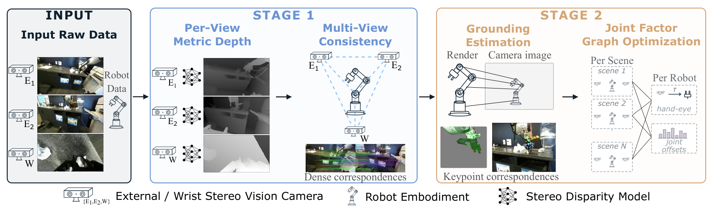
*Figure 2 DROID-3D 两阶段校准管线：Stage 1 逐视角度量深度（S2M2）+ 密集对应多视角一致性；Stage 2 URDF 渲染 grounding + 联合因子图（逐场景外参 + 共享手眼/关节偏移）。*

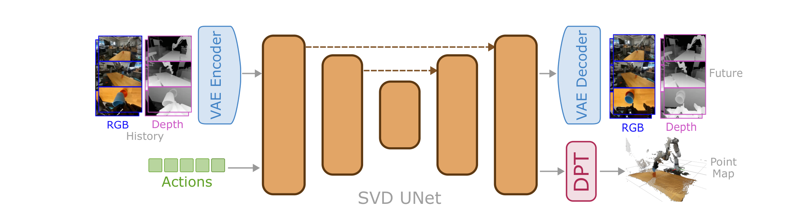
*Figure 3 DepthWorld 架构：RGB+depth 潜平铺进 SVD UNet，双输出头——VAE 解码未来 RGB/depth，DPT 头出机器人系点图。*

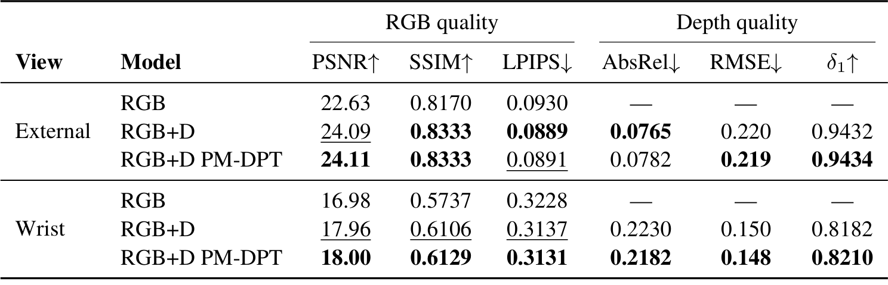
*Table 2 消融主表：RGB+D 比 RGB-only +1.48/+1.02 dB PSNR；PM-DPT 精化深度而保持 RGB。*

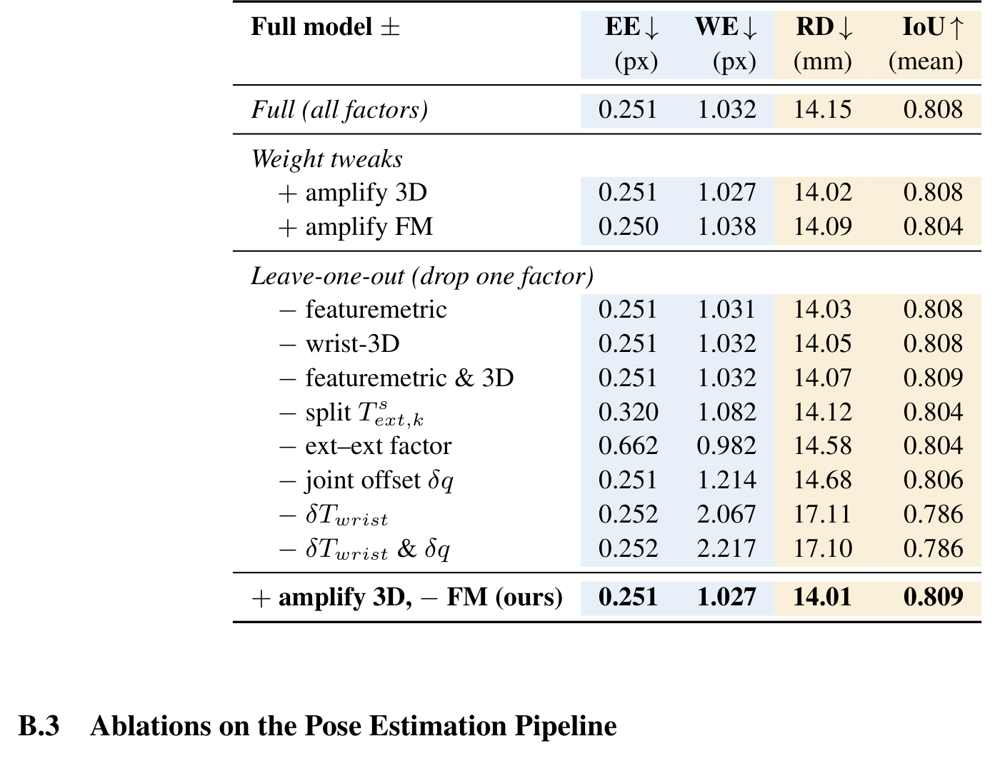
*表 A1 逐因子消融：去掉手眼/关节偏移因子，WE 重投影从 1.03 翻到 2.07/2.22——共享运动学参数是跨场景约束的载体。*

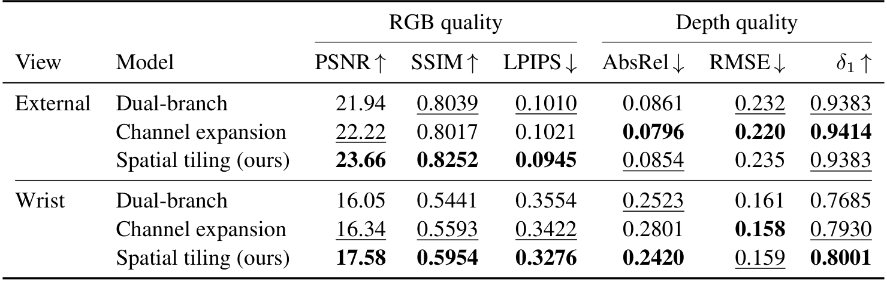
*表 A2 架构消融：空间平铺（23.66）优于双分支（21.94）与通道扩展（22.22）——不破坏先验的最小改动最强。*

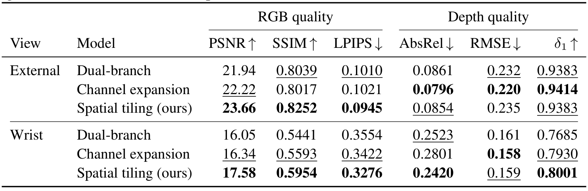
*表 A3 深度源消融：ZED ULTRA 稀疏噪声深度把 AbsRel 推到 0.194 且 RGB 掉 2.0 dB——深度源质量不是中性选项。*

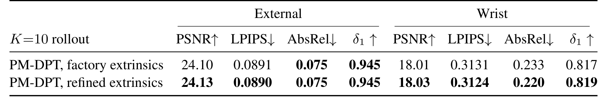
*表 A4 工厂 vs 精化外参：推理期增益微小（PSNR +0.03），校准价值几乎全部进入训练监督。*

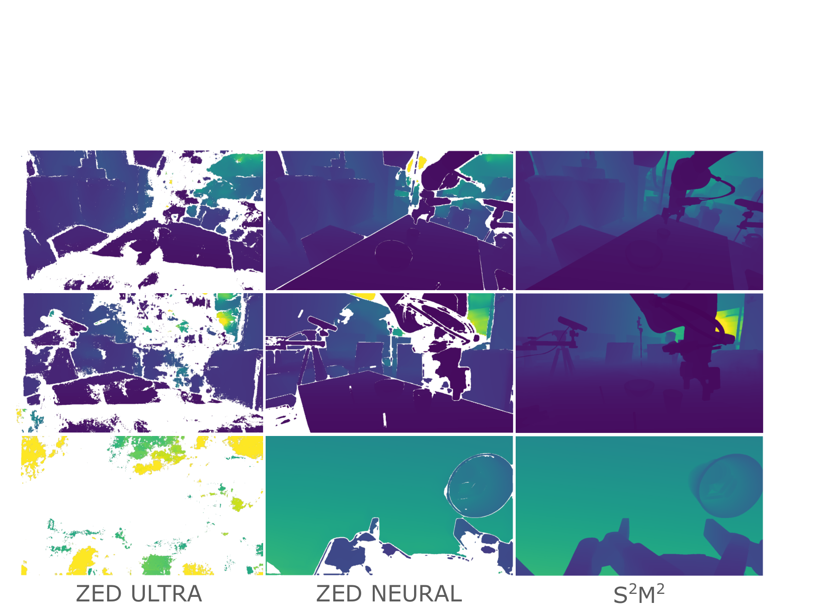
*图 A1 三深度源定性对比：ULTRA 大面积空洞噪声，NEURAL/S2M2 平滑完整。*

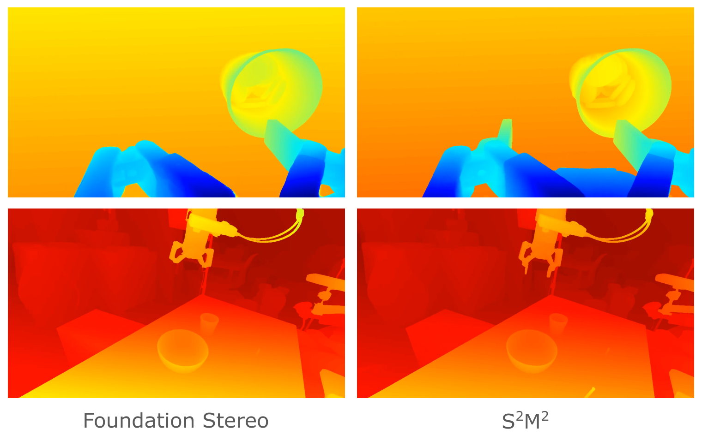
*图 A3 S2M2 与 Foundation Stereo 热图对比：边界锐度与内部结构差异。*

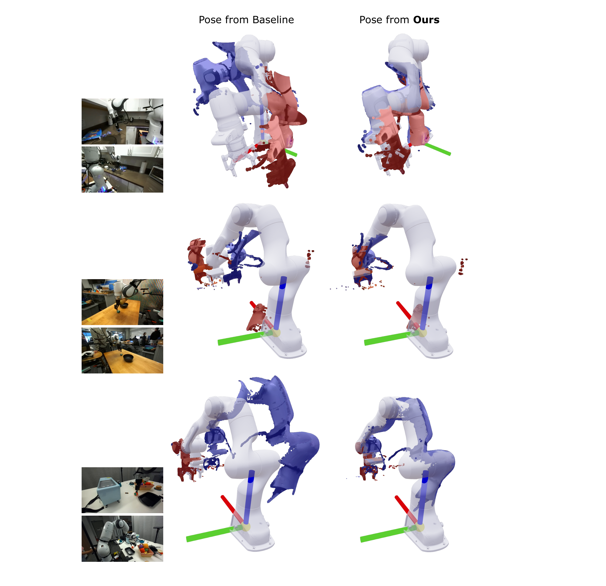
*图 A10 URDF 位姿叠点云三场景对比：基线（散乱漂移）vs 本文（紧贴机械臂结构）。*

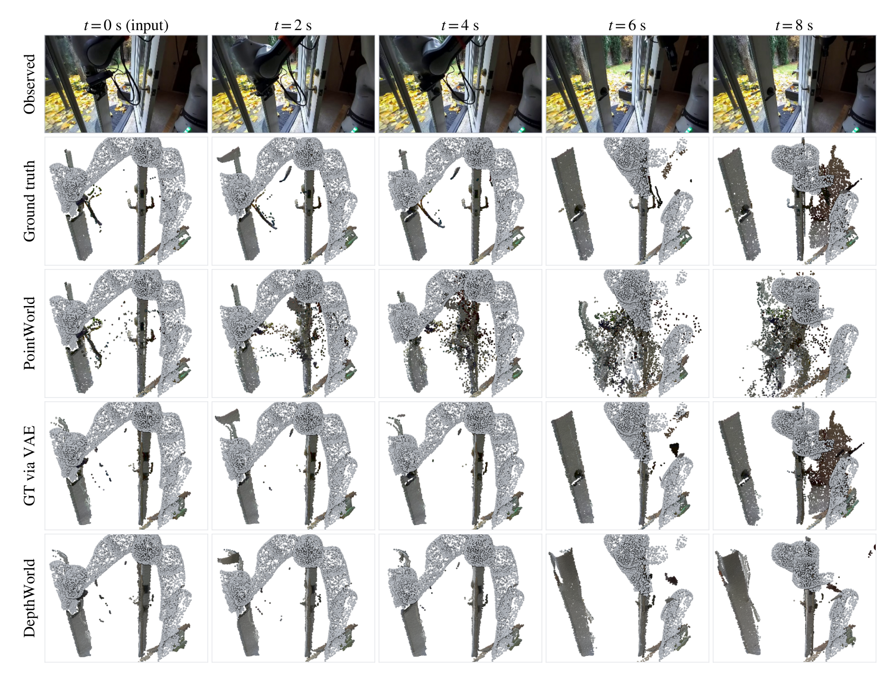
*图 A11 时序点云对比：PointWorld 随 rollout 大量伪影漂移，DepthWorld 与 GT 拓扑一致。*

## 书目信息

- 论文：[arXiv:2610.08780](https://arxiv.org/abs/2610.08780)（cs.RO 交叉 cs.AI/cs.CV；CoRL 2026 接收）
- 项目页：[jaibardhan.com/depthworld](https://www.jaibardhan.com/depthworld)；代码：[GitHub](https://github.com/Jai2500/depthworld)；权重：[Hugging Face](https://huggingface.co/jaibrdhn/depthworld)；DROID-3D 外参：[Hugging Face](https://huggingface.co/datasets/jaibrdhn/droid_3d_extrinsics)
- 作者：Jai Bardhan、Josef Šivic、Vladimír Petrík（捷克布拉格捷克技术大学 CIIRC）
- 数据口径：DROID 5 实验室约 1000 场景校准评测；256 held-out 轨迹 10 步自回归 rollout；3 视角（2 外 + 1 腕）192×320@5Hz
