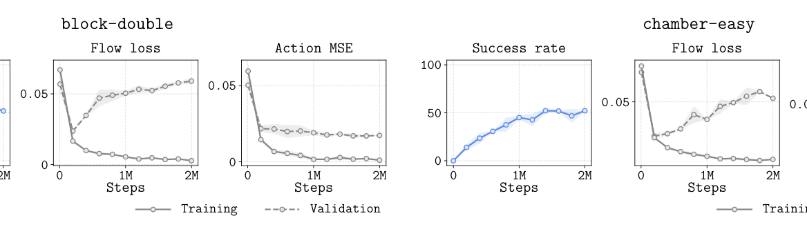
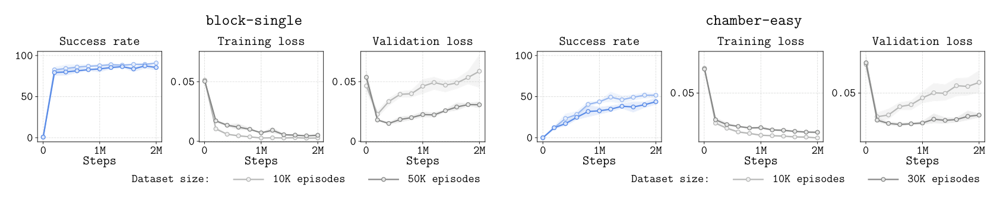
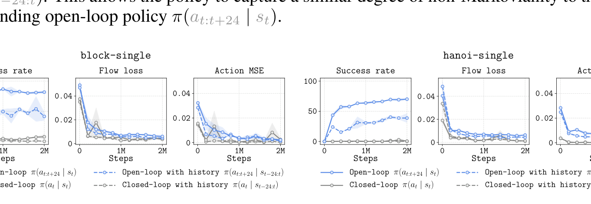
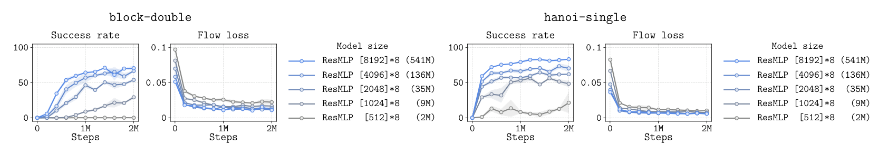
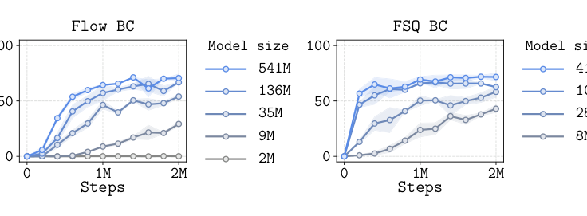
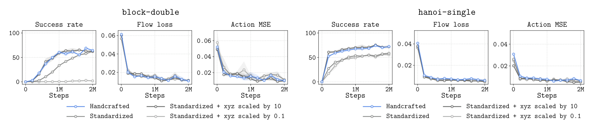
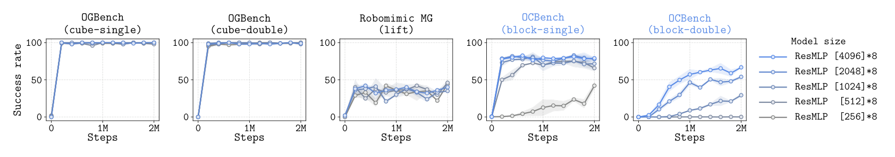
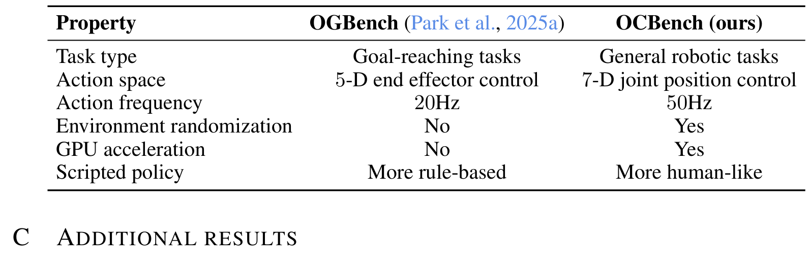
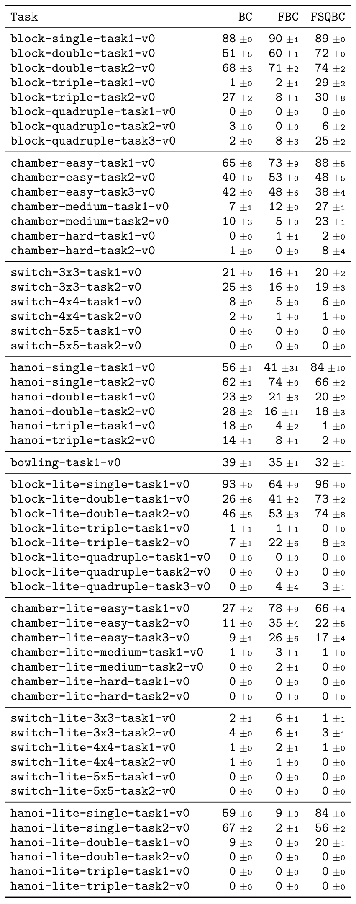
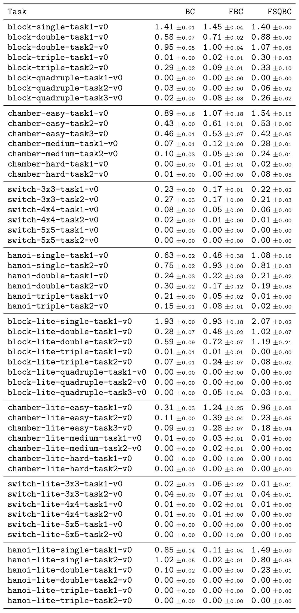

# Behavioral Cloning Mystery

一句话定位：真实机器人 BC 的那些「反直觉之谜」——越过拟合越好、开环吊打闭环、模型要百 M 级、特征尺度影响巨大——Berkeley（Seohong Park、Sergey Levine）的 OCBench 用**模仿人类演示结构性质的脚本策略**把它们搬进受控仿真：GPU 加速 MJWarp（单 H100 最高 200K steps/s）+ 流式无限数据，四个 mystery 全部复现并逐个做假设检验。arXiv:2610.07056，2026-10-05 提交。

## 研究问题：真实 BC 现象为何难以科学化

文献里反复被报告的四个「mystery」：

1. **过拟合不必然有害**：BC 性能常随过拟合上升，小数据集有时优于大的。

2. **开环常优于闭环**：动作 chunk 的部分开环控制大幅超过闭环——即使没有推理延迟；加历史条件化也未必救回来。

3. **策略要非常大**：人类数据 BC 需要的网络远大于合成数据 BC，即使是状态输入。

4. **特征很重要——数据再多也是**：输入特征的选择大幅影响性能，加数据不一定消除这种依赖。

这些现象几乎都来自**人类采集数据**的观察。真实数据不可复现、采集昂贵、因子无法隔离；已有脚本 benchmark（OGBench、Robomimic MG 等）虽可控，却**复现不了这些现象**——开环-闭环差距不明显、也不需要大模型。论文的归因假设：**以往脚本策略的动作统计与人类不同**（边界饱和 −1/+1 或过度均匀，图 1 的密度对比直接可见），且时间相关性弱、多模态性差。

## OCBench 设计

### 脚本策略：三性质的工程化

论文假设人类演示有三条关键性质：(1) **非常窄的分布**（不是高斯噪声增广能造出来的）；(2) **强非马尔可夫、强时间相关**；(3) **语义多样**（不同抓取姿态与策略）。工程化路径：**随机化分段 C1 连续 Hermite 样条**——先按语义相（抓取/提升/运输）采样控制点，Catmull-Rom 切向匹配插值保证 C1 连续；随机化路标、抓取角度与方向、接触点、运动速度、腕指滚转俯仰、轨迹曲率、高层解题策略；**让脚本偶尔犯错并恢复**。图 1 显示这样得到的动作统计明显类人。

### 任务族与训练协议

28 个任务、五环境族（block/chamber/switch/hanoi/bowling），MuJoCo 50Hz、7 维关节增量动作；CPU 与 MJWarp（GPU）双实现、逻辑一致不逐位相同；lite 版 10Hz 供轻量迭代。**流式训练**：每 100K 步采 25K episodes、丢旧数据——研究「数据无限极限下还剩什么问题」。默认 ResMLP + flow matching（Beta(1,1.5) 时间分布——在 OCBench 上明显加速训练、OGBench 上无差别）+ 长度 25 动作 chunk；2M 梯度步、每 50K 步 500 rollouts、末 5 个评估点平均；2 种子 + 95% CI。

## 四个 mystery 的受控复现

### 过拟合与开环闭环（Mystery 1-2）

**过拟合有益**（图 3）：验证 flow loss 持续上升，成功率不降反升——拟合优度与任务性能解耦。**开环 vs 闭环**（图 6）：流式数据（排除数据稀缺/过拟合解释）下闭环策略仍几乎完全失败。两个候选假设的检验：

- **复合误差假设**：论文移植 Lazzati 2026 的 delayed 策略做五策略对照（图 7）——**randomly-delayed $\pi(a_t|s_{t-k})$（每步仍采样动作、照样有复合误差问题）达到强性能**但仍低于开环：复合误差单独解释不了全部差距；
- **非马尔可夫性假设**：把数据「Markovian 化」（脚本每步重新规划、打断时间依赖，图 8）——差距缩小**但仍有剩余**：两个因素都在贡献，比例未定量分解。
- 附加发现：**历史条件化 $\pi(a_t|s_{t-24:t})$ 损失更低、性能可能更差**（图 9）——更多信息不一定更好。

### 规模与特征（Mystery 3-4）

**规模**（图 10）：以往合成数据用 [512,512,512]≈0.5M 参数就够、更大无益；OCBench 上性能一路涨到 **[8192]×8 ResMLP（541M 参数）仍未饱和**——即使是状态输入单任务。两个假设：①「人类数据 BC 就是难」（顺带解释 VLA 为何需要大动作专家——**完美感知+单任务下也可能需要 billion 级动作专家**）；②「流匹配天然需要大容量」。检验（图 11）：FSQ 自回归（动作 chunk 编码为离散符号、做 next-token 预测）**小模型确实优于流匹配小模型，但性能仍随规模涨**——流匹配的噪声耦合方差解释一部分、不解释全部。

**特征**（图 12）：四种**信息完全相同、只差缩放**的输入配置（手工设定尺度 / 标准化 / xyz×10 / xyz×0.1）——训练与验证指标（flow loss、MSE）**几乎不可区分**，成功率差异巨大。论文给出的解释（标注为相对最可信的假设）：**差异在测试时泛化**——两个策略训练指标相同，在未见状态上的行为不同；BC 性能最终由测试时行为决定，不是由拟合优度决定。

## 边界与用途

边界（论文自述 + 我的分析）：

- **复现 ≠ 解释完成**——论文明确说目标是让现象可科学化研究，不是完全 demystify；两个假设的定量分解留给未来工作；
- 2 种子 + 95% CI；bowling 例外地使用全部 episodes（含失败）；默认开环执行整个 chunk 不重规划；
- MJWarp 与 CPU 版逻辑一致但不逐位相同——跨实现对比要小心；
- 模型规模上限未知（[8192]×8 仍在涨）。

对做 BC/机器人学习研究的人，这个 benchmark 的直接用法（我的提炼）：

1. **「窄分布 + 非马尔可夫 + 语义多样」当脚本策略设计清单**——任何要生成类人演示数据的仿真管线都适用，别再用高斯噪声增广。

2. **流式训练设置**：研究「数据无限时还剩什么问题」的标准实验设计——本批论文里 Mystery 2/4 的实验全部靠它排除数据量混杂因子。

3. **特征缩放实验是所有 BC 工程的警示**：输入特征尺度是超参数，损失曲线看不出来——调特征比调损失有用。

4. 与 MimicGen（录 10 条人演示重放）相比，OCBench 全脚本 + 语义旋钮（速度/错误率/覆盖度）——可控性高一个层级；与其前作 OGBench 相比，差别全在脚本策略的人类相似性。

*Figure 1 动作统计对比：OGBench（饱和边界）/Robomimic（过均匀）/OCBench（类人）四联密度图——脚本策略差异直接可见。*

*图 3 过拟合不必然有害：验证 flow loss 上升、成功率不降——拟合优度与任务性能解耦。*

*图 4 数据集规模消融：小数据有时不输大数据（Mystery 1 文献现象的受控复现）。*

*图 9 历史条件化：损失更低、性能可能更差——更多信息不一定更好。*

*图 10 模型规模：[512]×8（2M）到 [8192]×8（541M）持续上涨——以往合成数据 0.5M 就够。*

*图 11 Flow BC vs FSQ BC：自回归小模型占优但同样随规模涨——流匹配解释一部分不解释全部。*

*图 12 特征缩放：四种同信息配置训练指标几乎不可区分、成功率差异巨大——特征尺度是被忽视的超参数。*

*图 16 OGBench 上的模型规模对照：以往合成数据加大模型无益。*

*表 1 任务规格：28 任务五环境族的状态/动作维度与最大 episode 长度。*

*表 6 附录：附加实验配置。*

*表 7 附录：附加实验配置。*

## 书目信息

- 论文：[arXiv:2610.07056](https://arxiv.org/abs/2610.07056)（cs.RO 交叉 cs.LG）
- 代码：[GitHub](https://github.com/seohongpark/ocbench)（2026-10-05 建仓，71★）；项目页见 abs 页标注
- 作者：Seohong Park、Sergey Levine（UC Berkeley）
- 数据口径：28 任务 × 5 环境族；MJWarp 单 H100 最高 200K env steps/s；默认 2M 梯度步、每 50K 步 500 rollouts、2 种子 + 95% CI；流式每 100K 步采 25K episodes
- 相关脉络：OGBench 前作同一作者线；与 OCBench 同窗口的「BC 反直觉现象」研究（Lazzati/Zhang/Zeng 2026）在此获得受控复现载体
