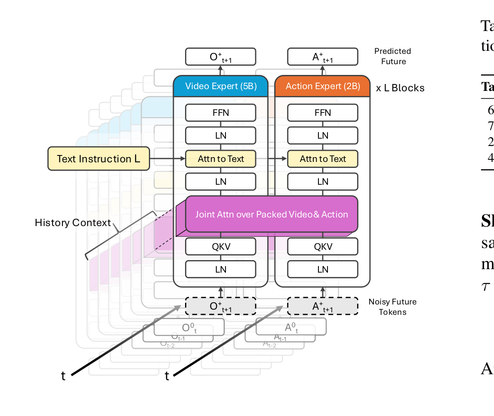
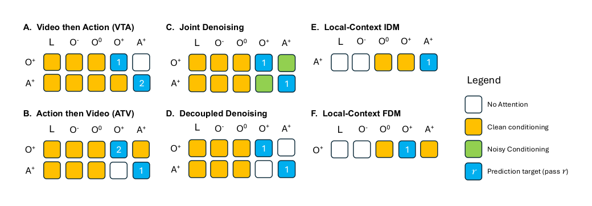
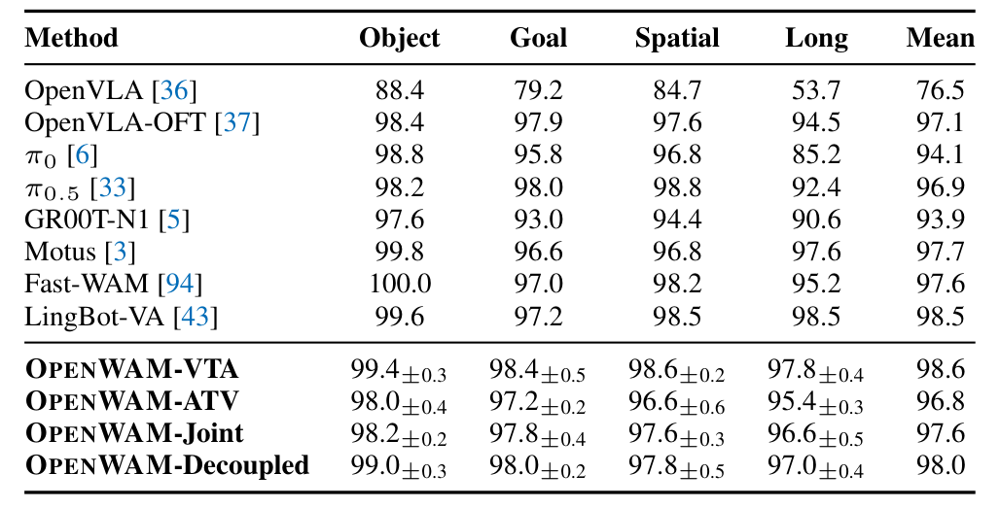
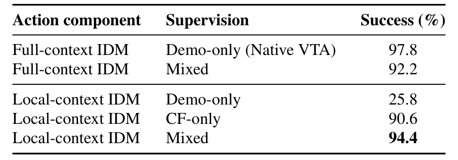
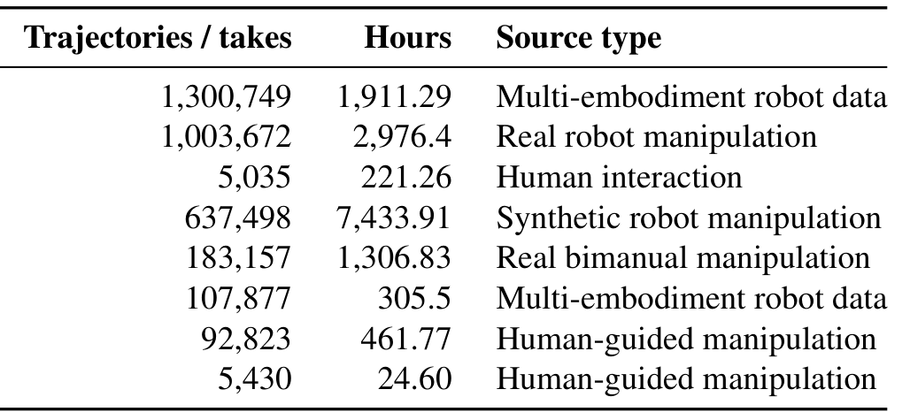
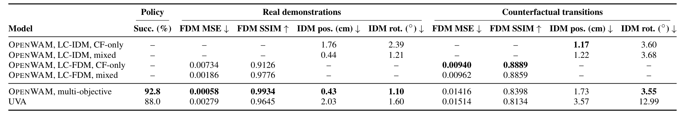

# OpenWAM: An Open Framework for Composable World-Action Models

一句话定位：把「视频-动作怎么耦合」从各家黑箱里拆出来，变成一个共享骨干上的**可配置变量**——Stanford（于航、Jiajun Wu、李飞飞、Ehsan Adeli 团队）的这份 OPENWAM 给出 Wan2.2-5B 骨干 + 共享 Mixture-of-Transformers + 四种交互程序 + 独立训练的局部动力学接口，并逐个消融每个设计维度。arXiv:2610.07922，2026-10-06 提交，18 页，代码与项目页已发布（2026-06-04 即放出）。

## 研究问题：WAM 的设计选择为什么至今没法比较

近一年的 world-action model（WAM）系统——DreamZero、DVA、LingBot-VA、Fast-WAM——各自同时改动**骨干、训练数据、目标函数、推理过程**四个变量。你看到 A 比 B 高 3 个点，无法知道是视频-动作交互结构的功劳还是数据配方的功劳。论文把这个问题拆成两条正交的轴：

1. **交互程序**：video 和 action 的生成顺序与跨模可见性（联合去噪？视频先生成？动作先生成？互不相见？）。

2. **监督覆盖**：成功演示只覆盖「同一状态→单一动作续延」这一条窄带，动力学组件（IDM/FDM）需要的是更广的局部转移分布。

这两条轴此前从未在受控条件下被单独测量过——这是论文的立身之本。

## 方法主线

### 因果机器人-视频骨干：没有动作标签的预训练

从 Wan2.2-5B 出发，在 **334 万条轨迹 / 14.64k 小时**的机器人与人类交互视频上持续预训练（OXE 49 个数据集、AgiBot World、RoboMIND、InternData-A1、RoboCOIN、FastUMI、Ego-Exo4D、UMI 系；表 9），**全程不用动作标签**，32 张 B200 训了 14 天。

关键改动是 **chunk-causal 预测目标**：Wan2.2 原本不是时间因果的（双向 attention 的视频生成模型），OPENWAM 约束未来 chunk 只能看到当前观测、之前的观测和已生成的 chunk，看不到后续 chunk；chunk 内部做联合去噪。这一步把「非因果视频生成骨干」改造成了「可作策略底座的因果预测器」，且保留独立的视频预测接口。所有下游变体共享这一个 checkpoint。

### 共享 MoT 与四种交互程序：把生成交序变成一个开关

动作分支通过 **Mixture-of-Transformers** 接入：Video Expert（5B，预训练保留）+ Action Expert（2B，从视频专家宽度适配复制初始化），两个模态各自有 LN/QKV/FFN，在**单一联合注意力**（packed video & action tokens）处汇合，文本指令用单独 cross-attention 注入（图 2）。

$$L_P = \mathbb{E}\left\|v_{\theta,P}(Z_{P,\tau}\mid c_P,\tau) - u_P\right\|^2,\quad u_P = Z^\star_P - \epsilon_P$$

同一潜 flow-matching 目标（式 4-5，$Z_{P,\tau}=(1-\tau)\epsilon_P+\tau Z^\star_P$）下，四种程序只改**生成顺序与未来跨模可见性**（图 3 的注意力掩码语言把这件事画得极清楚）：

- **Joint**：未来视频流与动作流双向互见（token 层面），同一 pass 并行去噪；
- **VTA**：先纯视频（不看未来动作），再以完成视觉轨迹为条件生成动作；
- **ATV**：反序，先动作后视频；
- **Decoupled**：两个模态互不见对方未来。

顺序程序训练时用 teacher forcing（第二 pass 条件于**录制的**跨模轨迹），推理时换成第一 pass **生成的**轨迹——训练/推理的程序和时间对齐不变，只有条件来源变。这个细节是复现时的坑位。

### 局部上下文 IDM/FDM 与反事实监督：可复用的动力学接口

$$p^{\text{local}}_{\text{IDM}} := p(A^+_t \mid O^+_t, O^0_t, q_t),\qquad p^{\text{local}}_{\text{FDM}} := p(O^+_t \mid A^+_t, O^0_t, q_t)$$

式 6 的条件界**没有语言、没有历史动作、没有 t 之前的观测**——这是组件可复用的前提：任务级信息由视觉预测器负责，动力学组件只学局部映射。监督数据从哪来？在仿真里恢复演示状态、执行**替代动作序列**（不必完成任务），得到反事实转移 $D_{cf}$，按 $\mathcal{D}_{dyn}=(1-\eta)\mathcal{D}^{loc}_{task}+\eta\mathcal{D}_{cf}$（式 7，实验取 η=0.6）混合。同一初始状态的分支保持在同一 train/val/test 划分。值得注意的是学习目标只作用于单条转移记录，**没有成对分支损失**——采集协议受控，学习协议不受控。

组合推理时（式 9-10），视觉预测器只把**未来 VAE latents** 传给接收 IDM；transformer hidden states 和 KV cache 不跨组件传递。组件边界是显式的轨迹接口。

## 实验与消融

### 闭环策略与初始化消融

四套 LIBERO（3 种子 × 500 episodes，同一环境种子集）上，OPENWAM-VTA **98.6**、Decoupled 98.0、Joint 97.6、ATV 96.8（表 3）——对照已发表基线 OpenVLA-OFT 97.1、π0.5 96.9、Fast-WAM 97.6、LingBot-VA 98.5。**四种程序全部可用**这件事本身就是结论：性能不取决于某一种耦合方式，此前各家系统的差异主要来自骨干与数据而非交互结构。

| 初始化（固定 VTA 协议） | LIBERO-Long 成功率 |
|---|---|
| 随机初始化 | 大幅更差 |
| Wan2.2 原始 checkpoint | 68.4% |
| 机器人-视频预训练因果骨干 | **97.8%（+29.4 点）** |

Joint 程序下同样 +34.4 点（表 12）。作者明确声明：这个对照**捆绑了预训练与因果适配两个因素**，不能归因到单一因素。MoT 架构消融（表 13）：共享 DiT 已经 92.8/93.6，MoT 加到 97.8/96.6（+5.0/+3.0 点）——动作专家独立参数化的增益是真实的但不是主要来源。

真机：两台 Franka FR3 + Flexiv Grav 夹爪、双腕 D405 + 中央 Femto Mega 三视角，Toast Bread / Rubik's Cube / Sort Cups 三任务，VTA 92.1 / Joint 91.9 均值（每任务 36–50 episodes）。

### 冻结动作组件的可组合性（论文最有信息量的实验）

四个 LIBERO-90 目标任务（不在源任务集内），视觉预测器换任务微调、**源训练的 IDM 冻结**：

| IDM 配置 | 4 目标均值 |
|---|---|
| 局部上下文，demo-only | 21.5% |
| 局部上下文，CF-only | **84.5%** |
| 局部上下文，mixed (60/40) | **84.0%** |
| 全上下文，mixed | 47.0% |
| 全上下文，demo-only | 44.5% |

三个结论直接可搬：(1) **局部条件限制 + demo-only 监督几乎不可用**（21.5%，源任务也只剩 25.8%）——局部接口丢掉了任务语言，必须靠更宽的转移分布补；(2) matched 监督下局部比全上下文高 **37.0 点**且源任务保持 94.4%——全上下文 IDM 在视觉预测器换任务后学到的语言捷径失效，局部映射反而迁移；(3) CF-only 与 mixed 几乎打平（84.5 vs 84.0）——η=0.6 已接近饱和。Demo-only 全上下文在任务 21/45 上直接 0%，CF/mixed 局部 IDM 四个目标全部有效。

### 动作条件前向动力学

2,560 个反事实未来（160 上下文 × 16 动作分支 × 10 任务）：CF-only 把 RGB MSE 从 14.35 降到 9.40（×10⁻³，−34.5%）；**结果辨识**（哪个预测对应哪个真实结局）K=2 从 68.3%→93.6%，K=16 从 21.1%→**71.3%**（表 7）。K=16 这个指标值得注意：它测的是 FDM 是否真的建模了动作依赖的未来，而不是渲染均值。

对照 UVA（此前最接近的已发布 policy+IDM+FDM 系统，表 14）：独立专门化组件在反事实动力学指标上全面领先；统一多目标 checkpoint（60% 联合 + 20% IDM + 20% FDM 监督）策略 92.8 vs UVA 88.0，但反事实动力学精度弱于自己的专门化模型——多目标训练与专门化的 tradeoff 被诚实画出。

## 边界与未决问题

作者自己列出的（我的转述）：

- **组合性只在仿真内确立**——真机复用需要更数据高效的物理动力学监督，反事实分支在真机上没有免费仿真器；
- 目标实验只适配**视觉预测器**，不构成完整视频-动作模型的零样本迁移；
- 单一多目标 checkpoint 尚未追平最强专门化变体；
- FDM 只做了局部短视野预测，长视野规划未验证。

我的分析补充：IDM/FDM 对照采用不同动作参数化，论文用「执行预测动作后的末端轨迹误差」对齐口径（附录 E）——这个口径合理但意味着 IDM 数字不是纯粹的动作空间误差。另外四种程序的排序（ATV 最弱 96.8）只在 LIBERO 任务时长内成立，任务更长时顺序生成的误差传播是否放大，论文未测。

## 值得带走的三个组件

1. **chunk-causal 改造模板**：任何非因果视频生成骨干 → 策略底座，只需约束 chunk 间可见性、chunk 内联合去噪，保留原 VAE 与预测接口。

2. **局部上下文动力学接口（式 6）+ 反事实分支采集**：不要求成对损失、不要求任务成功标签（失败/探索交互同样可用），η=0.6 的混合配比可以直接当默认值抄。

3. **「可用组件 → 冻结复用」评测协议**：视觉预测器换任务、动作组件冻结、同一 rollout 协议——这是把「可组合性」变成可测量对象的范式，比单模型跑分的信息量大得多。

*Figure 1 总览：左侧三阶段（通用视频预训练→10k+ 小时因果机器人-视频预训练→video-action 后训练），右上共享 MoT，右中四种交互程序，右下冻结 LC-IDM/LC-FDM 的零样本迁移。*

*Figure 2 共享 MoT：模态专家保留各自 LN/QKV/FFN，在联合注意力处汇合；噪声形式的未来潜变量从底部进入，文本指令单独 cross-attention。*

*Figure 3 注意力掩码语言：列是可条件的时间流，行是预测目标，数字是生成 pass——四种交互程序（A–D）与局部动力学程序（E–F）的全部设计自由度一图读尽。*

*Table 3 四套 LIBERO 闭环成功率：OPENWAM 四变体全部 96.8–98.6，基线行含 OpenVLA-OFT 97.1、π0.5 96.9、Fast-WAM 97.6、LingBot-VA 98.5。*

*Table 7 局部 FDM：CF-only 降 RGB MSE 34.5%，K=16 结果辨识 21.1%→71.3%——动作依赖未来的建模能力来自监督覆盖而非架构。*

*Table 9 预训练语料规模：334 万轨迹 / 14.64k 小时，跨 OXE/AgiBot/RoboMIND/InternData 等 9 源。*

*Table 14 对照 UVA：独立专门化组件在反事实动力学上全面领先；统一多目标 checkpoint 92.8 vs 88.0 但弱于自己的专门化模型。*

## 书目信息

- 论文：[arXiv:2610.07922](https://arxiv.org/abs/2610.07922)（cs.RO 交叉 cs.CV）
- 项目页：[openwam.stanford.edu](https://openwam.stanford.edu)；代码：[GitHub](https://github.com/OpenWAM/OpenWAM)（2026-06-04 发布，126★）
- 作者：Heng Yu*、David D. Yuan*、Juze Zhang*、Changan Chen、Yao Feng、Michelle Baldonado、Steve Cousins、Li Fei-Fei、Jiajun Wu、Ehsan Adeli（Stanford University）
- 数据口径：LIBERO 四套件 3 种子×500 episodes；LIBERO-Long-CF 反事实集；真机 2×FR3 双臂 36–50 episodes/任务
