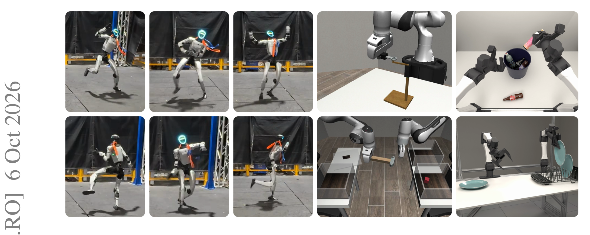
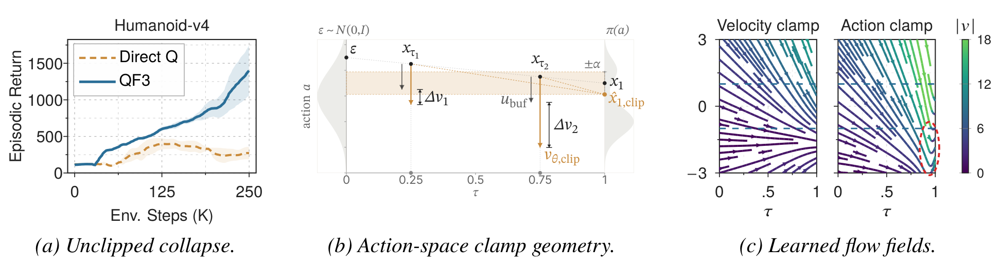
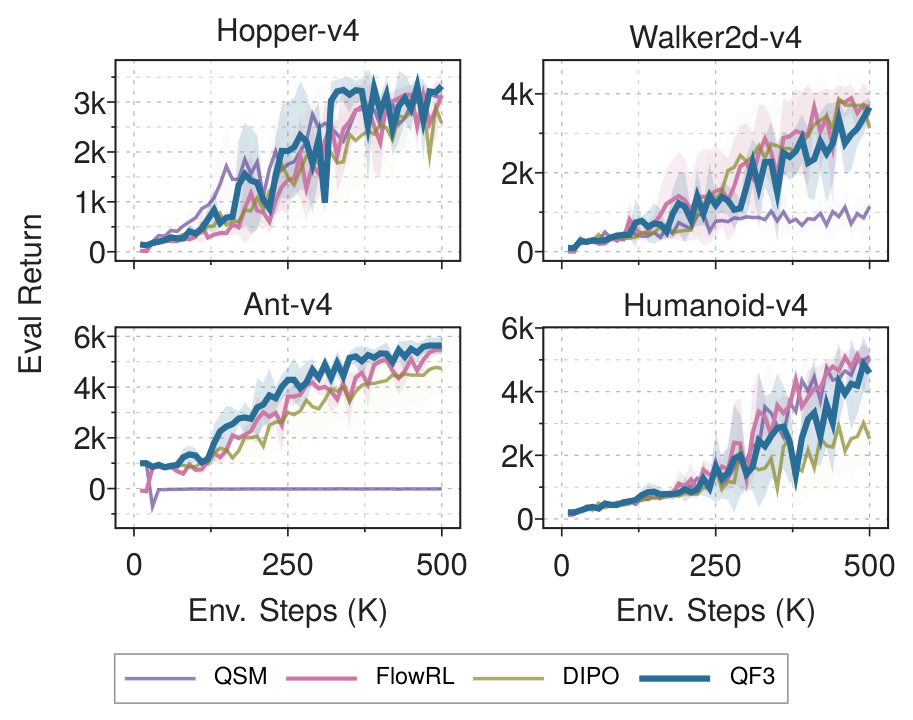
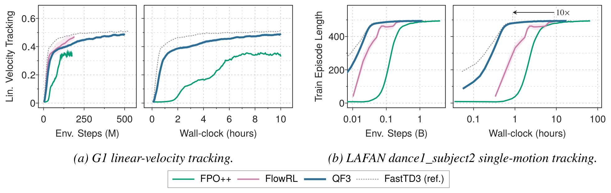
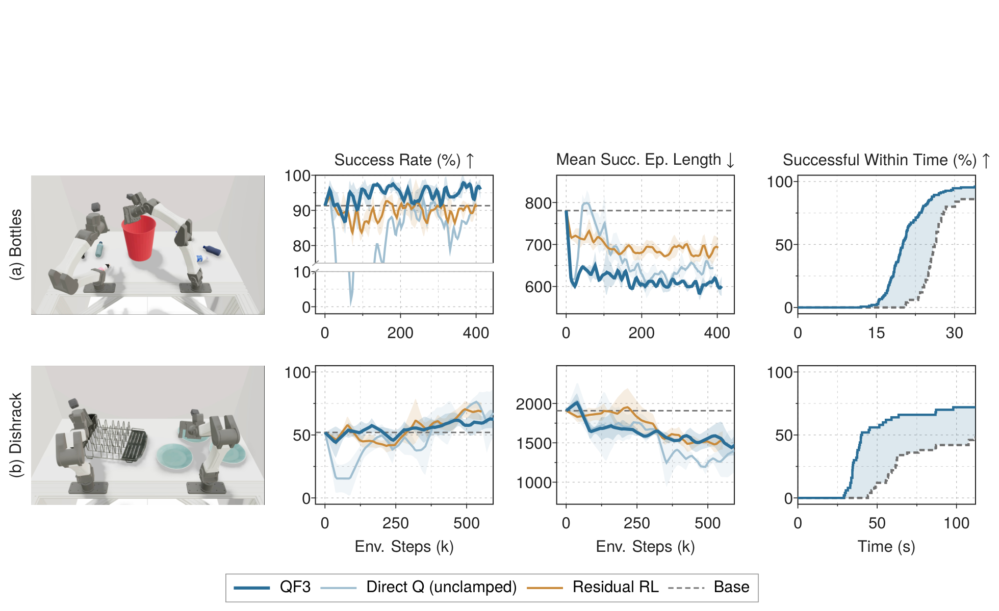
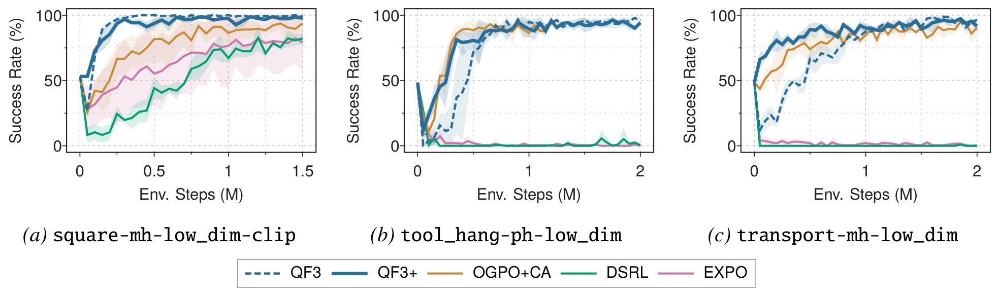

# QF3: Fast Flow RL with Filtered Q-Gradients

一句话定位：把 TD3 的 actor 换成流策略、把 critic 梯度关进**速度空间信任域**——UC Berkeley + Amazon FAR（Chung Min Kim、Brent Yi、Pieter Abbeel、Angjoo Kanazawa 等 10 人）的 QF3 是**首个从零训练人形运动策略并零样本部署真机的 off-policy 流 RL 方法**，wall-clock 比 FPO++（on-policy 路线）快 10×。arXiv:2610.08789，2026-10-07 提交。

## 研究问题：off-policy 流 RL 卡在哪

流/扩散策略已经是机器人策略的标准类别，但用 RL 改进它们至今只有两条路：冻结生成先验 + 在上面训小残差策略（BeyondMimic/OmniXtreme 一线），或用 FPO/FPO++、ReinFlow、πRL（均为策略梯度家族）。前者残差表达受限，后者样本效率差。

off-policy 路线（从 replay 直接训流策略）一直不稳。QF3 的诊断干净：**不稳定不来自 sampler（更新从不穿过它反传），而来自 critic 被查询的位置**——如果你直接对一步预测的动作最大化 Q，随机初始化的 actor 会把这个查询点推离 replay 动作，掉进 critic 高估区，速度场幅值发散。

## 方法主线

### 双目标结构与一步预测

actor 目标是两项：CFM 锚定项把 actor 拉向 replay 分布（行为正则，同时保 critic 估计最可靠），critic 项做策略改进。从 replay 动作 $a_{buf}$ 出发构造 $x_\tau=(1-\tau)\epsilon+\tau a_{buf}$、$u_{buf}=a_{buf}-\epsilon$：

$$L_{cfm}=\|v_\theta(s,x_\tau,\tau)-u_{buf}\|^2$$

$$L_{direct}=-Q(s,\hat{x}_1)+\lambda_{cfm}L_{cfm},\qquad \hat{x}_1=x_\tau+(1-\tau)v_\theta(s,x_\tau,\tau)$$

一步 Euler 近似「策略会产出的动作」，对它最大化 Q——像 TD3 一样把 $\nabla_a Q$ 反传进策略，但只穿**单次**速度求值。问题：$\hat{x}_1$ 会离 replay 动作任意远。

### 速度空间信任域与滤波 Q 梯度

核心贡献是把 critic 查询点关进局部信任域。定义**策略-缓冲区间隙** $\delta_\theta := v_\theta(s,x_\tau,\tau)-u_{buf}$，逐坐标裁剪到 $[-\alpha,\alpha]$：

$$\hat{x}_{1,clip} = a_{buf}+(1-\tau)\,\mathrm{clip}(\delta_\theta,-\alpha,+\alpha)$$

注意最后一步化简用了 $x_\tau+(1-\tau)u_{buf}=a_{buf}$——**critic 只在 replay 动作每坐标 $(1-\tau)\alpha$ 邻域内被查询**，那里一步近似和 critic 估计都还有效。总目标 $L_{actor}=-Q(s,\hat{x}_{1,clip})+\lambda_{cfm}L_{cfm}$。

对式求导得到**滤波 Q 梯度**：

$$\frac{\partial(-Q)}{\partial v_\theta}=(1-\tau)\,m\odot\nabla_a Q(s,a)\big|_{a=\hat{x}_{1,clip}},\qquad m_i=\mathbf{1}[|\delta_{\theta,i}|<\alpha]$$

每个速度分量只在间隙未饱和时收到 Q 梯度；饱和分量被掩蔽，CFM 项继续**全量惩罚未裁剪的间隙**把它拉回来；重入界内 Q 梯度自动恢复。分离设计是关键：Q 项看裁剪后的端点，CFM 项看未裁剪的原始预测。

## 机制消融：速度裁剪为什么工作（MuJoCo-v4，三发现）

1. **裁剪是稳定性的必需**：Humanoid-v4 上 unclamped Direct Q 即使把 actor 学习率降 10×（3e-5）仍然崩塌；默认 QF3 裁剪恢复可用策略（图 3a）。同一崩塌在微调预训练操作策略时重现（已解题策略被打到近 0 再恢复）。
2. **速度界优于动作界**：直接裁动作空间修正（等效速度界 $\alpha/(1-\tau)$）策略性能可能接近，但学得的流场**曲率高得多**——$\tau\to1$ 处 critic 能注入任意大速度修正，场剧烈弯折去适应（图 3c 的场可视化直接可见）。
3. **裁剪全程有效**：Ant/Humanoid 上 $\alpha=\frac{1}{2}$，记录「维度间隙在界内比例」：50k/250k/500k 步为 74/83/85%——被裁剪的少数派随 critic 改善缩小但不消失，裁剪在策略已经很好之后仍在过滤。

MuJoCo 四环境（图 4）：QF3 全面领先 QSM/FlowRL/DIPO（Hopper ~3.5k、Ant ~5.8k），QSM 在 Ant/Humanoid 上基本不学。

## 任务实验

### 人形 locomotion 与真机零样本

Holosoma（开源人形全身 RL 框架）+ Unitree G1 29-DoF：QF3 **只替换 FastTD3 训练循环里的 actor**——replay、分布式 twin-Q critic（取均值当标量 Q）、目标更新、并行环境全部共享。对照按作者开源配置原样跑：

- **wall-clock**：运动跟踪 QF3 约 0.5 小时达满长（500 步）episode，FPO++ 约 **10×**（wall-clock 与 env steps 双口径）；速度跟踪同 10 小时预算 QF3 达 FastTD3 最终跟踪奖励的 ~4% 以内；
- **FlowRL**（同配方的另一 off-policy 流方法）跟踪性能可比但种子方差大 3×（速度）/9×（运动），且运动跟踪需要 1.8× env steps；
- **零样本真机**：仿真 URDF、关节限位、PD 增益原样部署，无真实数据微调——速度指令跟随 + LAFAN dance1_subject2 约 3 分钟长动态序列（定性演示，论文未给量化跟踪误差）。

### 预训练流策略微调

ABC-Sim（冻结 VLM 4.3B + 44M DiT 动作头，**只训 229k 参数 LoRA**，从零初始化所以训练起点恰是 base 策略）：

- Bottles：成功率 91%→95%，episode 快 22%（典型每瓶省 1–2 s）；来源是抓得更早、持瓶更短；
- Dishrack：QF3 学到近乎竖直放板（丢板率 8% vs base 21%），第二块板上的时间 11 s vs 71 s；
- 关键锚：$\lambda_{base}\|v_\theta-v_{base}\|^2$（冻结 base 头速度）对稳定微调必要。

Robomimic 三任务（图 7，全策略微调）：QF3/QF3+ 与 OGPO+CA 持平或更好；DSRL/EXPO 在 tool_hang/transport 上全程 0%。

## 边界与可搬组件

口径与边界（论文自述 + 我的分析）：

- **α 逐任务调**（MuJoCo 网格 0.5–2，locomotion 速度/运动分别 α=2/0.5、λcfm=0.3/0.01）——论文没有给出自动选 α 的原则，这是复现时的最大自由度；
- wall-clock 口径每任务单 GPU（A10G/L40S），FlowRL 速度跟踪跑在 L4 上被剔出该面板；
- Dishrack 上 Residual RL（~70%）略高于 QF3（~65%）——不是全面碾压，残差路线在部分任务仍占优；
- 部署期确定性积分（ε=0、5 步 Euler），策略是确定性的——探索靠流潜变量与目标/在线 actor 之间的滞后。

可搬组件（我的提炼）：

1. **「速度空间信任域 + 未裁剪 CFM 惩罚」的分离设计**：Q 项看裁剪端点、CFM 项看原始预测——直接可搬进任何 off-policy 流/扩散策略训练器，无需 sampler 反传。

2. **「维度在界内比例」监控**：判断裁剪是否还在工作的最廉价指标（论文用它证明 74/83/85% 的全程演化）。

3. **TD3 兼容性**：只换 actor 的插入式设计意味着任何 FastTD3 系高吞吐配方（分布 critic、大 batch、并行环境）全部保留——这就是其 10× 加速的工程根源，对照组走的是策略梯度路线。

4. 附带演示：同一更新直接用于 text-to-image PickScore 微调（附录 A.8），奖励在裁剪一步端点上评估——「裁剪查询点」思想在生成模型 RL 后训练里同样成立。

*Figure 1 任务总览：真机 G1 速度/舞蹈跟踪（零样本部署）+ ABC-Sim/Robomimic 仿真操作场景。*

*Figure 2 一维四联图：一步预测漂移 (a) → 裁剪重建 (b) → 信任域内 Q 梯度通过 (c) / 界外被掩蔽、仅剩 CFM 拉回 (d)。*

*Figure 3 速度裁剪三发现：unclamped 崩塌 (a)、动作空间界的几何缺陷 (b)、两种界学得的流场对比——速度界低曲率 (c)。*

*图 4 MuJoCo-v4 四环境：QF3 全面领先 QSM/FlowRL/DIPO。*

*图 5 G1 速度/运动跟踪：env-steps 与 wall-clock 双口径，QF3 对 FPO++ 约 10×；与 FastTD3 竞争力相当。*

*图 6 ABC-VLA 双任务微调：成功率、episode 长度、时间内成功率三列；unclamped 早期崩塌清晰可见。*

*图 7 Robomimic 三任务：QF3/QF3+ 与 OGPO+CA 持平或更好，DSRL/EXPO 在 tool_hang/transport 全程 0%。*

## 书目信息

- 论文：[arXiv:2610.08789](https://arxiv.org/abs/2610.08789)（cs.RO 交叉 cs.LG）
- 项目页：[qf3-rl.github.io](https://qf3-rl.github.io/)（页面标注 Code Soon!；引用了 amazon-far/abc 与 holosoma 生态仓）
- 作者：Chung Min Kim、Brent Yi、David McAllister、Hongsuk Choi、Himanshu Gaurav Singh、Jinkun Cao、Ken Goldberg、Pieter Abbeel、Carmelo Sferrazza、Angjoo Kanazawa（UC Berkeley / Amazon FAR）
- 数据口径：MuJoCo-v4 3 种子 500k 步；Holosoma G1 单 GPU；ABC-Sim/Robomimic 各 3 种子；真机零样本无量化误差报告
