# Preserving Unstable Modes Through Inverse Dynamics in JEPA World Models

一句话定位：JEPA 世界模型的一个**被证明的盲区**——标准「下一步预测 + 防坍缩正则」可以在编码器丢弃全部不稳定模态时把损失降到最小，让潜控制器永远无法稳定系统；Meta FAIR + Flatiron + 哥伦比亚（Leonardo F. Toso、**Yann LeCun**、James Anderson、Oumayma Bounou）用**端点逆动力学损失（EP-IDM）**补上这个洞，CartPole 潜 LQR 成功率 0%→100%。arXiv:2610.07540，2026-10-06 提交。

## 研究问题：JEPA 遇上开环不稳定系统

四旋翼与足式机器人工作在不稳定平衡附近——小扰动不加反馈会指数发散。用潜世界模型控制这类系统时，表征必须保留**反馈要观察和修正的那些不稳定模态**：控制器「看不见」的模态无法被稳定（可检测性条件）。

论文先证两件事：

- **Lemma 1**：作用在潜状态上的控制器能稳定系统 **当且仅当** 编码器保留了每个不稳定模态；
- **Lemma 2**（失效证明）：以 SIGReg 为防坍缩正则时，「下一步预测 + 防坍缩」这一 JEPA 标准配方**可以在编码器丢弃全部不稳定模态的情况下取到训练目标的最小值**——表征在训练分布上没有坍缩，动力学预测也可以很准，但设计不出稳定的潜反馈控制器。

这与昨天 H-JEPA 的 slow-feature collapse 一脉相承：只看边际分布的正则，永远允许「保场景、弃智能体」的坍缩解。

## 理论主线

### EP-IDM：端点逆动力学损失

补救是一个附加损失：**EP-IDM** 从初始与终末潜状态对 $(z_t, z_{t+H})$ 重建中间动作序列 $\hat a_{t,H}=(\hat a_t,\dots,\hat a_{t+H-1})$（图 1 顶部橙色模块；线性分析中取仿射解码 $D_\theta(z_0,z_H)=W_H[z_0\ z_H]+b_H$）。不需要逐帧对齐，只需要端点对。

### 可达方向保持（Theorem 1）

对线性系统，设 $\mathcal{C}_H=[A^{H-1}B\ \cdots\ B]$ 为有限视野可控性矩阵、$\mathcal{R}_H=\mathrm{range}(\mathcal{C}_H)$ 为 H 步可达子空间。在充分动作激励下（条件动作分布的支撑含非空开子集）：

$$L_{\text{EP-IDM}}=0 \;\Rightarrow\; \ker(F)\cap\mathcal{R}_H=\{0\}$$

即**编码器在 H 步可达子空间上单射**——任何 H 步内动作可生成的状态方向都不会被丢弃。不稳定模态 $\Phi_{\ge1}\subseteq\mathcal{R}_H$ 时（Assumption 1 + 足够大的 H），全部不稳定与边缘不稳定模态对潜控制器可观，Lemma 1 的可检测性条件被满足。注意零损失只在 $\mathrm{rank}(FC_H)=m_H\le\min\{d,n\}$ 时可达——**实践中 EP-IDM 是软归纳偏置**，$m_H>d$ 时精确恢复不可行，但最小化损失仍鼓励保留动作诱导方向。

### 不稳定子空间恢复（Theorem 2）

为什么「动作重建」恰好保住的是**不稳定**方向？有限视野可控性 Gramian $\Pi_H=\sum_{k=0}^{H-1}A^kB B^\top(A^k)^\top$：虽然 $\mathrm{range}(\Pi_H)$ 在 H 超过状态维数后不再新增方向，但各方向的**相对权重**随 H 变化——不稳定效应指数增长、最终主导。定理 2：H→∞ 时 $\Pi_H$ 的前 $r=\dim(\Phi)$ 维特征空间收敛到不稳定子空间 $\Phi$（含指数收敛率；要求 $\lambda_{\min}(\Pi_{u,H})\ge c_u\alpha^{2H}$ 的强可控性，即每个不稳定单位方向的动作响应至少按 $\alpha^{2H}$ 增长）。

**合起来：动作重建防止编码器丢弃可达方向，而最可辨识的可达方向恰是不稳定方向**——EP-IDM 不是碰巧有效，它罚的量与需要保留的量指数级对齐。

## 实验验证

### CartPole：潜 LQR 稳定化（表 1）

| 目标配置 | latent LQR 成功率 | LQR MFS |
|---|---|---|
| Ground truth | 100% | 1.000 |
| 1SP + SIGReg | **0%** | 0.202 |
| MSP + SIGReg | **0%** | 0.247 |
| 1SP + EP-IDM | **100%** | 0.999 |
| MSP + EP-IDM + SIGReg | **100%** | 0.996 |

同一编码器同一预测器、只换正则项：SIGReg 组的潜 LQR 完全失败（状态范数无界增长，图 4），EP-IDM 组把状态驱动到平衡点并保持。CEM/GBP（非线性规划器）两组都能工作——**失效只出现在需要精确局部线性化的 LQR 上**，因为规划器可以绕过潜动力学的局部缺陷，稳定化绕不过。

### Walker2D：步态极限环保持

行走步态是一个极限环——偏离必须被持续修正，这是「单一不稳定平衡」之外的控制相关结构。右髋相图（图 5）：1SP+EP-IDM 保留环结构与关节角/角速度范围，SIG 组捕获不了。像素解码（图 6）：EP-IDM 行保持连贯双足步态，SIG 组解码状态紊乱失真。闭环 iCEM（表 2，10 次试验均值）：GT 3.61 m/s、14.43 m 位移；1SP+EP-IDM 2.91 m/s、9.15 m；SIG 组近零位移（0.06/0.66 m）。

### PointMaze 与消融边界（不伤稳定系统 + 三个硬边界）

PointMaze 无不稳定模态——全部动作重建变体 CEM ≥90%、LQR ≥70%（表 3）：**EP-IDM 不伤害稳定系统**，因为无不稳定模态时它仍保留可达子空间、规划照常工作。三个值得记的边界（均为论文报告）：

- **冻结编码器**：DINOv2 MSP 只有 CEM 50%/LQR 20%（iBOT 100%/80%）——通用视觉预训练不含控制论信息，从零训练 + EP-IDM 的 LQR 全对（DINO-WM 80/80/60）；
- **去掉本体感知**（表 13）：冻结 iBOT 模型所有规划器成功率**全部归零**——当前图像编码器 + 短时间上下文无法从像素恢复速度信息，本体感知不可省；
- **仅本体感知**（表 12）：MLP 预测器 LQR 0.204 vs Transformer+EP-IDM 80%——**表征充分性不能替代精确的局部预测器拟合**，两个条件都要满足。

## 边界与可搬结论

边界（论文自述 + 我的分析）：

- 理论只对**线性系统**建立；CartPole/Walker2D/PointMaze 是非线性实证外推——「EP-IDM 保留非线性系统不稳定流形」仍是推断而非定理；
- Theorem 2 排除单位圆上的特征值（简化），CartPole 线性化只涉及严格不稳定模态；
- 全部实验在 MuJoCo，无真机验证；
- EP-IDM 是软偏置（mH>d 时零损失不可达）——论文没有给出「损失要多小才够」的量化判据。

可搬结论（我的提炼）：

1. **反馈控制前先审查不稳定模态**：论文把这个直觉变成可操作判据——动作重建损失。边际分布正则（SIGReg/EMA/VICReg 类）在结构上堵不住这个洞，因为它们允许保场景弃智能体的解。

2. **EP-IDM 实现成本低**：只需要初始/终末潜状态对，不需逐帧动作标签对齐——可作为任何 JEPA 训练器的附加损失直接加。
3. **规划器选择掩盖表征缺陷**：CEM/GBP 在坏表征上也能工作、LQR 不能——评测潜世界模型时用 LQR 类需要精确局部动力学的控制器才能暴露这个问题（这也是本批论文里「预测好 ≠ 控制信息在」的最干净演示）。

*Figure 1 架构：编码器 E 与预测器 P 的标准 JEPA 路径，顶部 EP-IDM 从端点对 (z_t, z_{t+H}) 重建动作序列——训练损失作用在潜预测与动作重建两处。*

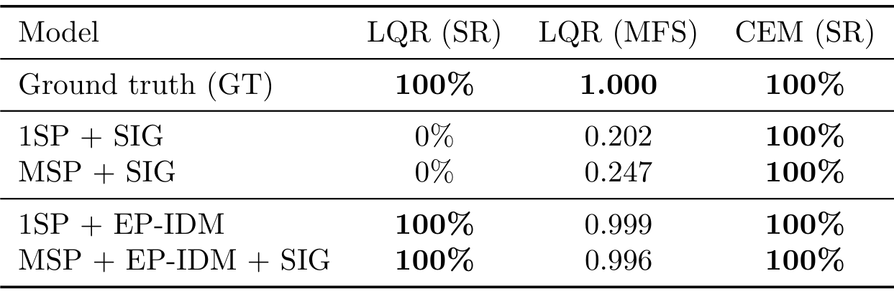
*表 1 CartPole 稳定成功率：SIGReg 组潜 LQR 0%，EP-IDM 组 100%（MFS 0.999）——只换正则项的受控对照。*

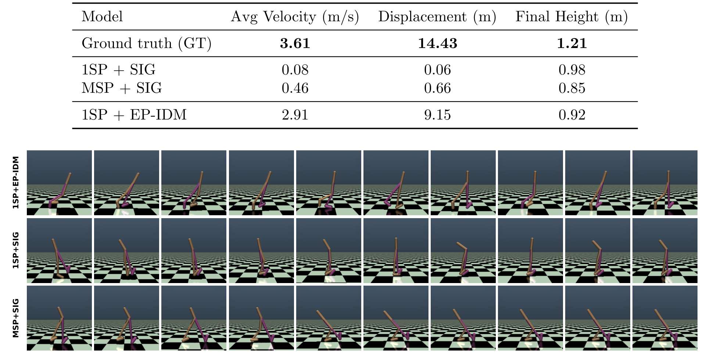
*表 2 Walker2D iCEM：GT 3.61 m/s、14.43 m；EP-IDM 2.91 m/s、9.15 m；SIG 组近零位移——下方三行为解码轨迹帧，步态连贯性差异直接可见。*

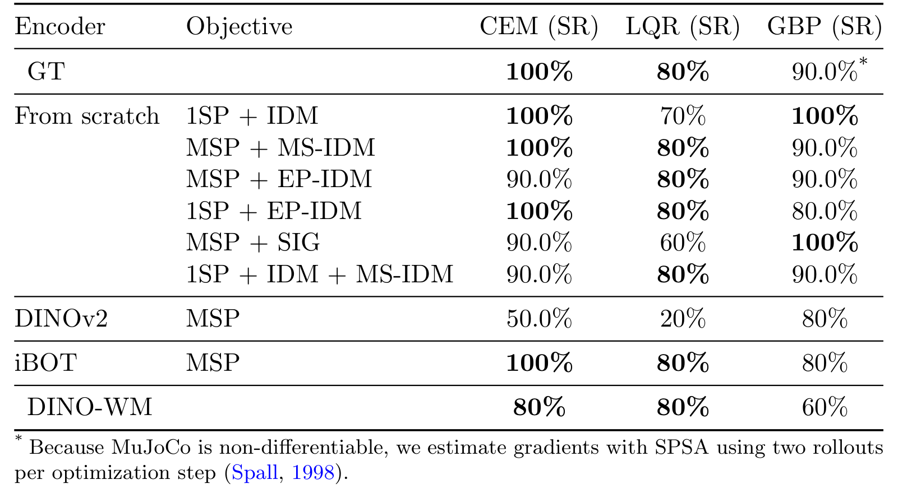
*表 3 PointMaze：全部动作重建变体 CEM ≥90%、LQR ≥70%——稳定系统上不伤性能；冻结 DINOv2 只有 50%/20%。*

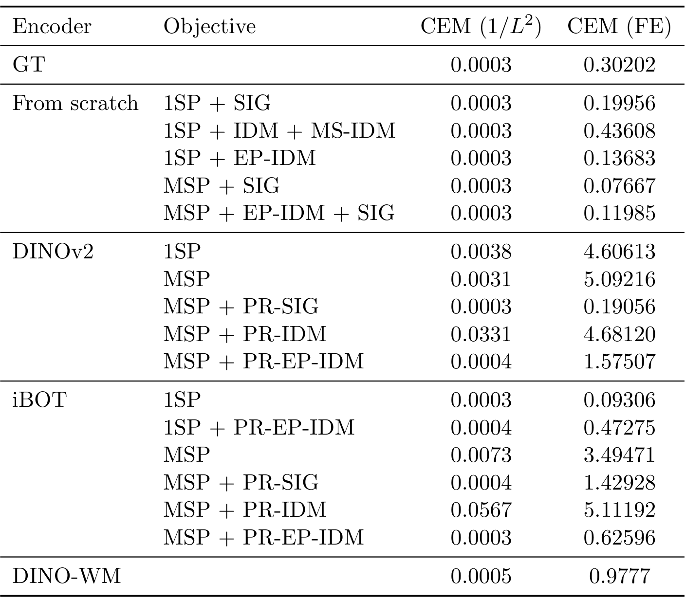
*表 4 附录消融表：附加实验配置。*

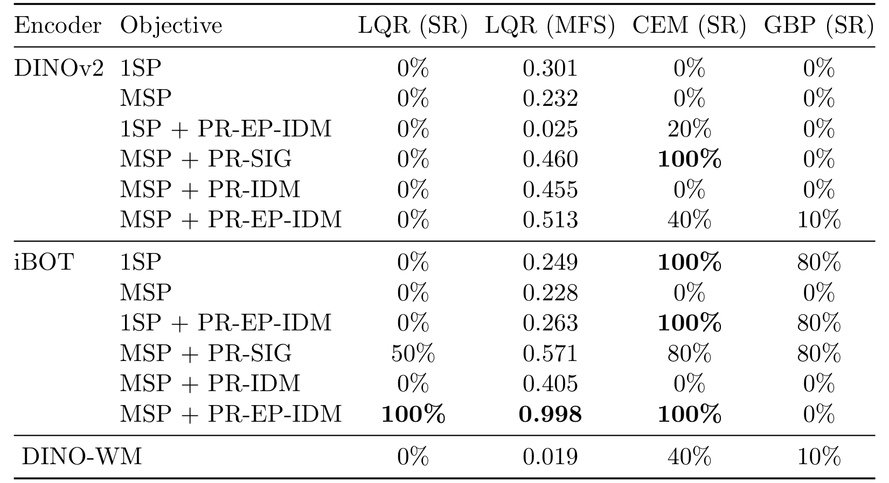
*表 5 附录消融表：附加实验配置。*

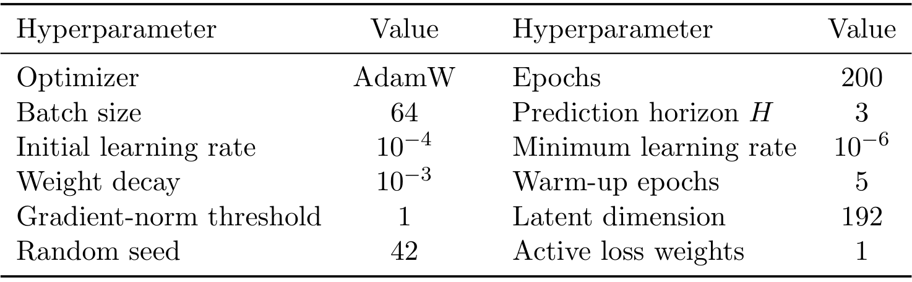
*表 7 附录消融表：附加实验配置。*

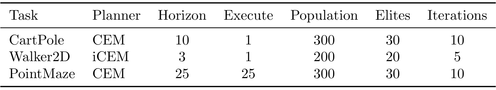
*表 8 附录消融表：附加实验配置。*

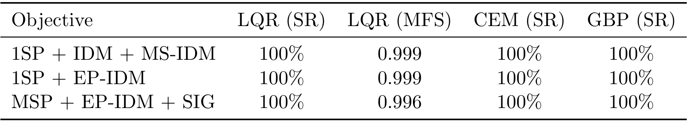
*表 9 附录消融表：附加实验配置。*

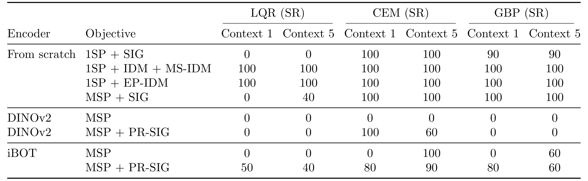
*表 10 动作上下文 1 vs 5 的 CartPole 消融：上下文长度对三规划器的敏感度。*

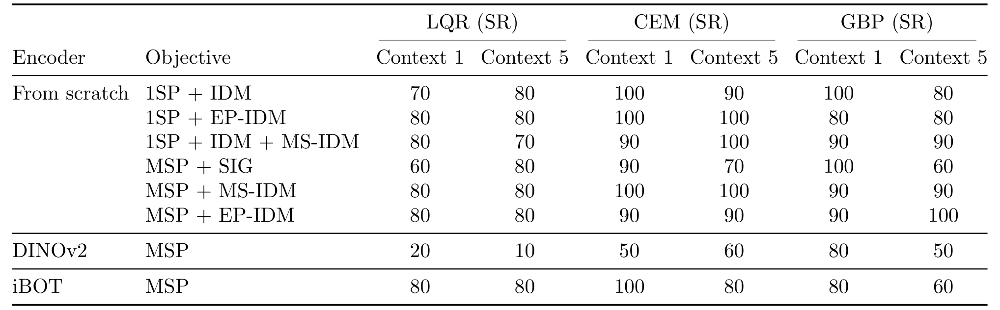
*表 11 动作上下文 1 vs 5 的 PointMaze 消融。*

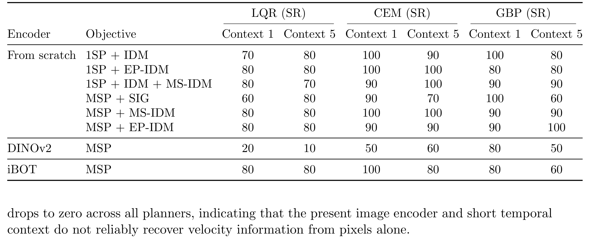
*表 12 仅本体感知：MLP 预测器 LQR 0.204 vs Transformer+EP-IDM 80%——表征充分性不能替代局部预测器拟合。*

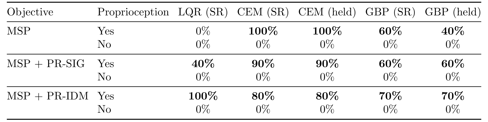
*表 13 去掉本体感知：所有规划器成功率归零——像素+短上下文恢复不了速度信息。*

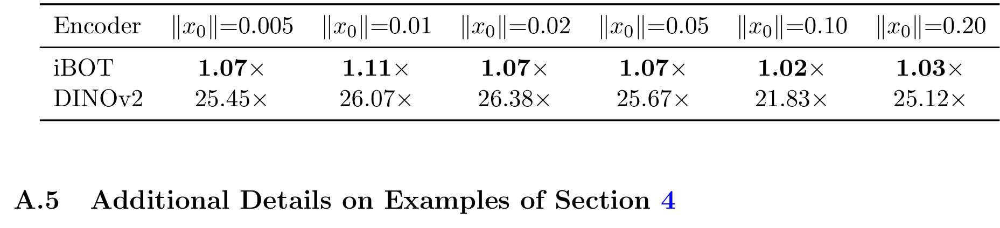
*表 14 附录消融表：附加实验配置。*

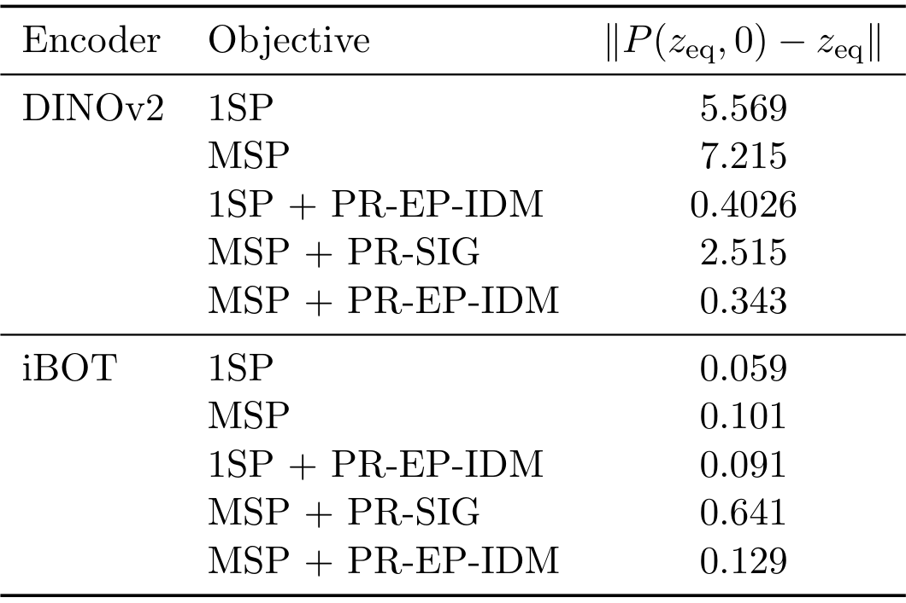
*表 15 附录消融表：附加实验配置。*

## 书目信息

- 论文：[arXiv:2610.07540](https://arxiv.org/abs/2610.07540)（cs.RO 交叉 cs.LG）
- 作者：Leonardo F. Toso（Columbia）、Yann LeCun（Meta FAIR / NYU）、James Anderson（Flatiron Institute）、Oumayma Bounou
- 数据口径：MuJoCo CartPole/Walker2D/PointMaze；从零训练与冻结 DINOv2/iBOT 编码器双轨；LQR/iCEM/CEM/GBP 四类规划器
- 相关脉络：与 H-JEPA（arXiv:2610.06805，slow-feature collapse）与 AVL-JEPA（信息坍缩）构成 JEPA 失效模式三联——本篇补的是「控制论信息」这一维
