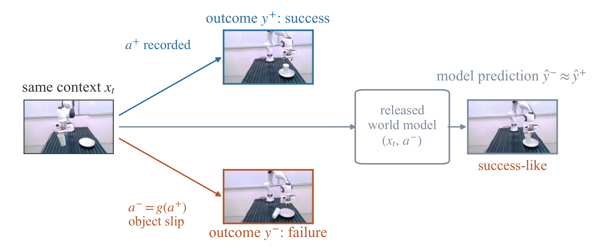
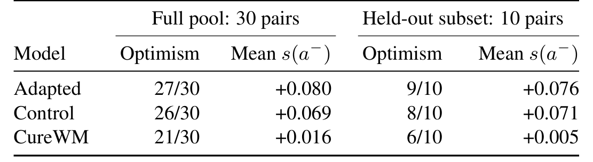

# World Models Dream of Success: Diagnosing and Repairing Failure Insensitivity in Robot World Models

> **CureWM：世界模型梦想成功——诊断并修复机器人世界模型的失败不敏感**
> [arXiv:2610.09134](https://arxiv.org/abs/2610.09134) · Jiuyi Xu（Colorado School of Mines）、Xiao Hu、Yang Ye（Northeastern）、Meida Chen（USC ICT）、Peng Gao（NC State）、Yangming Shi · 23 页 / 4 图 / 12 表
> 代码：[GitHub](https://github.com/jiuyixu25/CureWM)（10-06 建仓）

机器人世界模型被用来做策略评测、规划、合成数据——这些应用全部依赖一件事：**预测要能区分会成功的动作和会失败的动作**。这篇论文的起点是一个系统性诊断：跨两个架构族的四个已发布 checkpoint，在 held-out 反事实上表现出**弱动作敏感**——同一初始上下文换一条失败动作，预测照样给出 success-like 的未来。作者把这个问题从 optimism 里拆出来：failure insensitivity（分不出成败）和 optimism（把失败预测得过于好）是两件事，**必须分开测**——只报 optimism 会误导修复评估。

## 问题：世界模型梦想成功

图示最直接（Figure 1）：同一上下文 $x_t$，记录的成功动作 $a^+$ 端到杯在盘上；扰动动作 $a^- = g(a^+)$（物体滑落）端到杯倒掉。把 $(x_t, a^-)$ 喂给 released 世界模型，预测 $\hat{y}^- \approx \hat{y}^+$——**失败动作的预测和成功动作的预测几乎一样**。策略评测、规划、合成数据在这个状态下全部失真。

## 怎么测量：value 与 video 两条诊断线

测量协议本身是可复用的贡献（`sec:method` 3.1–3.2）：

- **value 侧**：成败价值差 $\Delta_{SF} = \frac{1}{N}\sum_i [V_\theta(x_i, a^+_i) - V_\theta(x_i, a^-_i)]$；AUROC；**value optimism**（验证失败序列中 $V_\theta(x_i, a^-_i) > \tau$ 的比例，$\tau{=}0.5$ 诊断阈值、明确声明不是校准概率）；false-positive rate（成功重放被误判失败的比例）。
- **video 侧**：潜距离分数 $s(a) = \frac{d(\hat{z}_T(a), \phi(y^-_T))}{d(\hat{z}_T(a), \phi(y^+_T))}$——预测离成功参考近为正；visual optimism、配对差、pair-ranking 准确率。全部离线、需要记录的参考结果。

## CureWM 三步机制

核心洞察（Proposition 1 形式化）：**每个上下文只观察一条动作时，拟合它的结果不需要区分替代动作的后果**。所以修复数据必须自己制造"同上下文、不同动作、已知结果"的对照（`sec:method` 3.3）：

1. **受控反事实构造**：把成功演示 $\xi^+$ 按相位标注（approach/grasp/carry/place），选干预时刻 $t_f$，用 6 个扰动族（approach overshoot / carry slip / contact oscillation / insufficient grip / premature release / wrist tilt，依 MiraBench）× severity 网格 $\lambda$ 构造替代动作——**$t < t_f$ 的动作原样保留**（Eq. 3），保证对照从同一上下文出发。不预先标注成败。
2. **执行验证**：在仿真或真机执行每条修改序列并记录结果 $\ell \in \{0,1\}$。**族准入条件**：相邻 severity 的聚合失败率单调递增（$\hat{p}_f(\lambda_{j+1}) \ge \hat{p}_f(\lambda_j)$）——不满足的扰动族不进训练（防噪声族）。产出执行验证的 $D^+_{rep}$ / $D^-_{rep}$。
3. **并集微调**：$D_{cure} = D_{base} \uplus C(D^+_{rep}) \uplus C(D^-_{rep})$（Eq. 4，不去重），从 released $\theta_0$ 出发、**用原目标**微调整个预测网络（Eq. 5）；有 value head 的失败重放 value 目标为 0。**不改架构、不改损失、不加新数据源**——纯数据侧修复。

这三步合起来是一个"制造对照、验证对照、用对照训练"的闭环：扰动构造保证动作对比受控，执行验证保证结果标签真实，族准入条件把不可靠的扰动族挡在训练外。整个配方不触碰模型侧任何东西。

*Figure 2：CureWM 总览——severity 网格扰动成功演示、执行验证划分成败重放、与基础数据并集微调；修复后 $a^+$ 与 $a^-$ 的预测价值差拉开。*

*Figure 1：失败不敏感演示——同一上下文下成功动作 $a^+$ 与扰动动作 $a^-$（物体滑落），released 世界模型对失败动作给出 success-like 预测。*

### 机制流程

1. **输入**：一条成功演示（相位标注）。**操作**：6 扰动族 × severity 网格构造替代动作（保 $t<t_f$）。**输出**：候选反事实动作集。
2. **输入**：候选动作集。**操作**：仿真/真机执行 + 族准入条件。**输出**：$D^\pm_{rep}$（执行验证的重放）。
3. **输入**：$D_{base} \uplus C(D^+_{rep}) \uplus C(D^-_{rep})$。**操作**：原目标微调。**输出**：修复后的 checkpoint。
4. **输入**：held-out 反事实对。**操作**：value/video 双侧诊断。**输出**：修复效果与权衡证据。

## LIBERO 主结果与真机证据

四个套件的 held-out 反事实（失败/成功重放数标注在表头，`sec:model`）：

| Goal 套件（484/1196） | value optimism | $\Delta_{SF}$ | AUROC | 任务成功率 |
|---|---:|---:|---:|---:|
| Released | 79.13% | +0.002 | 0.497 | 98.4% |
| Baseline（官方数据微调） | 79.55% | +0.003 | 0.495 | 96.4% |
| **CureWM** | **30.17%** | **+0.282** | **0.743** | 94.8% |

四套件 optimism 全面落到 30–43%（四个独立微调模型均值 38%）；AUROC 上到 0.63–0.74。**代价透明**：任务成功率从 98.4% 掉到 94.8%（−3.6 点）——修复不是免费的。

真机两次独立评测（Franka 臂）：只用成功演示微调后，latent-距离诊断下 **90% 的失败预测被判 success-like**；CureWM 降到 **33%**。30 对全池 / 10 对 held-out 的对照（Table 3）：optimism 27/30→21/30、mean $s(a^-)$ +0.080→+0.016；Control（对照数据变体）只到 26/30、+0.069——**数据配方而不是微调动作本身在起作用**。

最干净的匹配对照：失败数/成功重放数/训练预算全配平时，**反事实失败的 $\Delta_{SF} = 0.124$，在线采集的失败数据（on-policy）只有 0.014**（近 9×）——受控动作对比的价值被单独算清楚了。

*Table 3：真机 counterfactual——30 对全池与 10 对 held-out 上，CureWM 把 optimism 从 27/30 压到 21/30、mean $s(a^-)$ 从 +0.080 到 +0.016。*

## 必须一起看的负面结果

这篇论文的诚实度值得单独表扬（`sec:limitations`）：**预测修复 ≠ 控制改进**——RoboCasa 上出现修复-控制权衡；best-of-N 选择没有统计显著收益；policy ranking 完全未测。迁移也不完整：跨扰动类型与物体不一致、预测视野限制可见的失败后果；硬件证据只有两物体一臂、小 held-out 样本、训练数据量不等。CureWM 的前提（可执行反事实 + 可验证结果）本身就把一类应用挡在门外。

## 复现与扩展注意

**我的分析**：这篇与同期 WAM 批次（OpenWAM 给受控比较框架、Long-WAM 管上下文变量）拼出世界模型质量工程的第三块：**已发布模型的 post-hoc 修复配方**。三条可直接搬走：评任何世界模型前先做 action-contrast 检查（同上下文换动作看预测分不分级，latent 距离分数实现成本极低）；修复配方照抄 MiraBench 六扰动族 + severity 网格 + 族准入条件 + 并集微调；报告时 optimism 与 $\Delta_{SF}$/AUROC 必须同时给——只报 optimism 会高估修复。

**尚不能确定**：修复-控制权衡的机制（预测空间改进为何不传导到控制）；severity 网格在非操作任务（导航/locomotion）上怎么定义；更大模型是否天然更 failure-sensitive。
