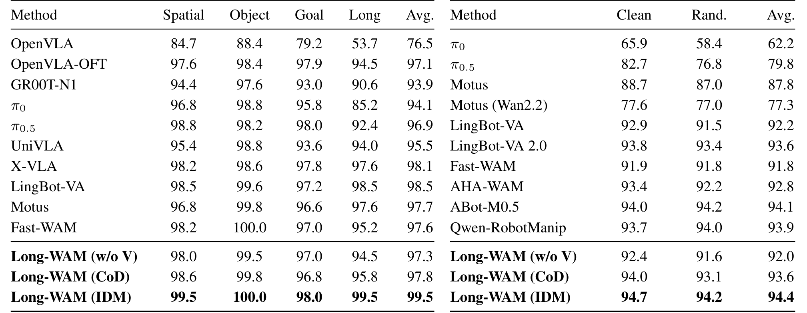
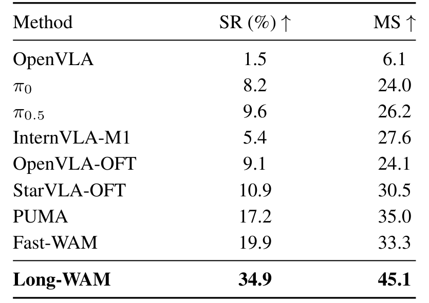

# Long-WAM: Scaling the Context of World-Action Models

> **Long-WAM：世界-动作模型的上下文 scaling——获得历史 ≠ 使用历史**
> [arXiv:2610.10528](https://arxiv.org/abs/2610.10528) · NVIDIA / MIT / HKU / UCSD · Wei Huang*、Bohan Zhang*、Chenzhi Liu、Isabella Liu、Shuai Yang、Weian Mao、Luozhou Wang、Yicheng Xiao、Weifeng Lin、Qixin Hu、Bryan Chu、Sifei Liu、Linxi "Jim" Fan、Xiaojuan Qi、Song Han、Yukang Chen
> 论文页标注 Code / Project Page 链接（NVIDIA 发布页）

WAM（World-Action Model）把视频预测带进闭环控制，视觉历史因此成了动作的天然资源——但处理历史会拖慢响应。这篇论文的中央发现一句话可以说完：**长历史只有当视频基础是自回归（AR）预训练时才兑付**。双向预训练的骨干加再多历史也没有净收益；AR 骨干的优势从无历史的 3.3 点扩大到 19.2 秒处的 17.1 点。论文原话意即"获得历史不等于使用历史"（access is not using）——获得历史和使用历史是两件事，中间隔着预训练学到的因果时间因子化。

*Figure 1：Long-WAM 总览——(1) AR 视频预训练（LongLive2.0-Robot，约 10,000 小时）；(2) 因果到因果适配；(3) 上下文 scaling（63.3→78.7）；(4) 三档硬件上的实时部署。*

## 问题：历史是资源还是负担

实时控制需要足够视觉历史来推断运动与任务进度；单帧图像留不下这些。已有 WAM 用因果缓存和记忆机制保留历史（Fast-WAM/LingBot-VA 系把双向骨干适配成因果视频-动作预测；LingBot-VA 2.0 联合预训练因果视频与潜动作）。NVIDIA 这条线问的是一个正交问题：**先学 AR 视频预测、再适配动作并保留 history-to-future 结构**，历史的收益会不一样吗？

## LongLive2.0-Robot 与因果到因果适配

两段式设计（`sec:model` Figure 1）。第一段只管从视频学预测动力学，第二段才把动作接进来——分开的好处是历史结构与动作条件可以独立检查，坏处是适配阶段必须显式保留第一段学到的因果依赖，这也是下文消融的变量来源。

- **AR 视频预训练**：LongLive2.0-Robot 从约 10,000 窗口等价小时的机器人 + 自我中心视频学预测动力学——**无动作标签**。语料 2.25M clips：RoVid-X 82.7%、EgoDex 9.0%、AgiBot World 4.8%、EgoVerse 2.6%、VITRA 0.8%。预训练 30,720 GPU 小时 @ 64×H100；下游 WAM 训练 16×GB200。
- **因果到因果适配**：保留因果视频依赖，动作片段去噪以观测历史为条件。三种去噪策略是本文最重要的消融变量：**w/o V**（去掉未来视频预测）、**CoD**（视频-动作联合去噪）、**IDM**（先（部分）去噪未来视频潜变量、再以其为历史与预测条件做动作去噪）。

预训练与适配的分界同时定义了本文的测量对象：AR 优势（下一节的 17.1 点差距）只能在"同一适配协议、不同预训练"的对照里读出来，而 10,000 小时语料的构成决定了这个优势的上限——语料里机器人视频占 82.7%，这也解释了为什么机器人域 AR 版在 GR-1 上比通用版更高。

### 机制流程

第1步，**输入**是约 10,000 小时无动作标签视频，**操作**是 AR 自回归预测下一窗口，**输出**是因果视频专家骨干。

第2步，**输入**是骨干加观测历史加动作片段数据，**操作**是 IDM 顺序去噪、用 KV cache 保留历史，**输出**是 Long-WAM 策略 checkpoint。

第3步，**输入**是实时相机流，**操作**是流式 VAE 编码、异步执行（执行 $t$ 与推理 $t{+}1$ 重叠）、decision-time prefill、KV 复用加 NVFP4 量化，**输出**是 RTX 5090 / DGX Spark / Jetson Thor 上的 107.4–378.7 ms 闭环控制。

第4步（层级模式），**输入**是开放任务指令，**操作**是 GPT-6 Astra 分解子任务、选执行前缀、冻结 Long-WAM 出动作片段，**输出**是组合任务成功率。

## 上下文 scaling 与 AR vs 双向对照

三初始化对比（`sec:method-4` + `sec:appendix-g`，RoboCasa GR-1 Tabletop）：

- **AR 系**：2.4s→19.2s 上下文从 66.3%→78.7%（机器人视频版）/ 65.7%→76.7%（LongLive2.0 通用版）；GR-1 从 0.0s 到 19.2s 63.3%→78.7%（+15.4 点）。
- **双向系（Wan2.2）**：61.7%→64.1%→61.6%——**无净增益**。
- 峰值窗口任务相关：LIBERO-Long 2.4s 就到 99.5%（94.5→99.5）；GR-1 要 19.2s。**38.4s 处回落**（75.2/74.2）：该窗口是平均训练轨迹（12.1s）的三倍、80.4% 采样历史帧是 padding——作者把回落归因于**历史覆盖不足而非内在记忆上限**，这是假设不是结论（复现侧别把它当记忆上限用）。

## 三种去噪策略与基准矩阵

IDM 在长任务族上的优势最大（`sec:method` Tables 1–3）：

| 基准 | w/o V | CoD | **IDM** | 最强基线 |
|---|---:|---:|---:|---:|
| LIBERO 平均 | 97.3 | 97.8 | **99.5** | LingBot-VA 98.5 / Fast-WAM 97.6 |
| LIBERO-Long | 94.5 | 97.8 | **99.5** | Fast-WAM 95.2 |
| RoboTwin 2.0 平均 | — | — | **94.4**（Clean 94.7） | ABot-M0.5 94.1 |
| DOMINO（动态微调后） | — | — | **34.9 SR / 45.1 MS** | Fast-WAM 19.9 / PUMA MS 35.0 |

值得注意的机制细节：IDM 的增益来自**部分去噪的未来潜变量**，不做像素级合成——预测作为中间控制表示就够用。

*Table 1：LIBERO（左）与 RoboTwin 2.0（右）成功率——Long-WAM（IDM）在 LIBERO 平均 99.5、RoboTwin 2.0 平均 94.4。*

*Table 3：DOMINO 动态微调后结果——Long-WAM 34.9 SR / 45.1 MS，超过最强基线各指标。*

## 系统侧：把延迟压到 107.4ms

长上下文只有在不牺牲响应时才有意义。累积优化链（`sec:method-7` Table 8，含完整 VAE 计算，RTX 5090）：BF16 eager 356.0 → +NVFP4 量化 + CUDA Graph + 编译 172.4 → +去噪不变复用 144.9 → +共享输入量化 130.3 → +视频-动作 online softmax 126.9 → +设备特定调优 **107.4 ms**（3.3×；比 Fast-WAM 的 244.1ms 快 2.3×——尽管额外预测未来视频）。DGX Spark 328.2ms（4.1×）、Thor 378.7ms（3.2×）。

异步执行的对照最能说明架构差别（Table 7）：重叠执行 $S=12$ 时 IDM 只掉 0.2 点（94.4→94.2）、CoD 掉 0.4，而 **Fast-WAM 掉 15.4、LingBot-VA 掉 45.5**；Long-WAM 的 overlap RMSE 与 jerk 约为 Fast-WAM 的三分之一。代价透明：**8× 上下文使 RTX 5090 延迟 3.2×**（107.4→341.0ms）——上下文是有真实价格的商品。

## 真机动态任务与层级执行

Unitree G1 传送带实验（`sec:method-5` Figure 7）：3.0/4.5/6.0/7.5 cm/s 四档速度，Long-WAM 抓取 100/100/95/90%、动态叠杯 95%（19/20）；**π0.5 与 Fast-WAM 在全部速度档 0/20**；人类遥控 50/52–50/58。样本量小（每格 20 试）但方向一致。YAM 双臂上完成平均 40+ 秒的长任务、81.7% 成功率。

层级模式（RoboCasa365，冻结 checkpoint + GPT-6 Astra）：Overall 31.4%→54.4%（规划器单独 25.2%；π0.5+规划器 30.5%）。两个关键读数：组合未见任务 6.1%→35.0%（规划解锁组合）；15 步定频查询拿到 84.4% Atomic-Seen 但组合任务只有 11.2/5.0——**定频查询解释不了组合增益，规划本身在起作用**。规划器给强执行器带来的增益（+23.0）大于给 π0.5 的（+13.6）：执行越强，规划越划算。

## 边界与复现注意点

主结果用 ≤2.4s 上下文（DOMINO 除外）；19.2s 是 GR-1 专项。基线在各自原生部署配置下评测——延迟对比的配置不完全对齐。G1 动态任务各 20 试。主表的 Code/Project Page 链接指向 NVIDIA 发布页，本笔记核查时未检索到独立开源仓库。

**我的分析**：这篇与昨天的 OpenWAM 构成同一个范式的一对孪生——OpenWAM 把"生成交序与跨模可见性"变成受控变量，Long-WAM 把"上下文长度"变成受控变量，都得到了"差异主要来自骨干与预训练、而非交互结构本身"式的结论。对做 WAM 的人，最可操作的三条：**要长历史先确认 AR 预训练**（双向骨干加历史基本白费）；**IDM 顺序去噪是长任务最稳配置**（且不需要像素合成）；部署侧优化清单（NVFP4+CUDA Graph+编译+复用+online softmax+设备调优）可以整段照抄。

**尚不能确定**：历史覆盖不足假说未经分层重训验证；19.2s 峰值窗口是否随任务族继续右移；AR 优势是否随模型规模继续放大。
