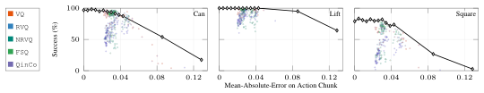
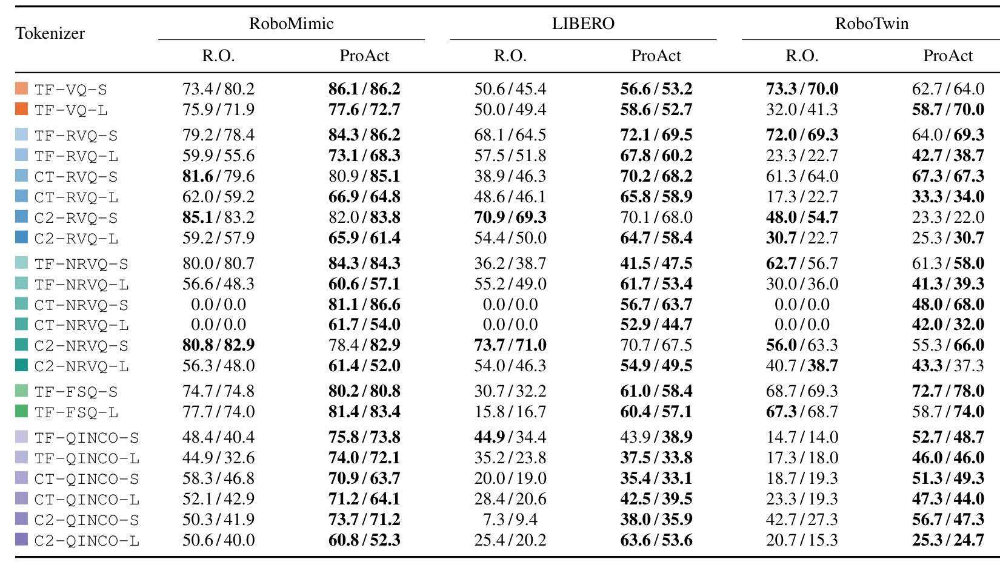
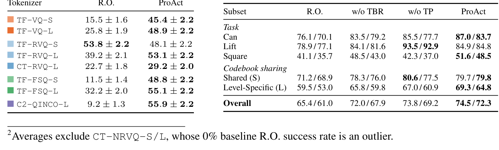

# Beyond Reconstruction: What Matters in Action Tokenization for Robot Policies?

> **ProAct：动作 tokenization 里重建之外还差什么——可预测性与解码鲁棒性**
> [arXiv:2610.09170](https://arxiv.org/abs/2610.09170) · Haoran Chen、Jingtian Ji、Samuel Wheeler、Kaylene Caswell Stocking、Matthew Walter（TTIC / Brown 线）
> 62 页 / 22 tokenizer 配置 / 附录完整配置表；未在 abs 页发现独立代码仓（同组同日另发 CAP）

自回归 VLA 靠动作 tokenizer 把连续动作片段变成离散序列。tokenizer 社区的默认信条是**重建误差越低越好**——这篇论文用 22 个受控配置把这个信条拆了：**足够低的重建误差是必要的，但达标之后，继续压重建误差不预测 rollout 成功**。同为 2610.09xxx 的姊妹篇 CAP（同组作者）从策略头复用 codebook 结构，本篇从 tokenizer 训练侧加两个干预——同一问题的两端。

## 问题：tokenizer 重建好 ≠ 策略好用

（`sec:introduction`）tokenizer 与下游策略共用同一个离散空间，但两者关心的事不同：这一侧关心"把专家动作编码成token 再解码回来"，策略关心"**从观测预测对token、并把预测出的（可能从未在演示里出现过的）token 序列解码成合理动作**"。这两个性质都不被重建目标直接激励。固定离散化（RT-1 式逐维分箱）忽略 chunk 内时间冗余；FAST 用频域压缩但绑定数据集频率统计；学习 tokenizer 有增益但设计原理不明——本文补的就是原理层。

## 22 配置受控研究：必要非充分

设置（`sec:preliminaries`）：三种骨干（TF transformer / C2 Conv2D / CT 卷积-transformer）× 五种量化器（VQ/RVQ/NRVQ/FSQ/QinCo）× 共享/层级码本（S/L）= 22 配置；K=128、L=8 主实验；策略与 rollout 设置全冻结，只换 tokenizer。

Figure 1 的散点（每点=一个 tokenizer 的验证重建误差 $E_{rec}$ vs rollout 成功）给出三条证据：

1. **高重建误差 → 必然差**；低重建误差 → 只是**有时**好。RVQ/NRVQ/QinCo 低误差子集内，重建误差与成功的 Spearman 只有 0.45/0.35/0.50——正相关但不足以排序。
2. **FM 动作噪声容许度对照**（黑曲线）：给观测条件的 flow-matching 策略注入递增动作噪声——Can/Square 在小 MAE 就开始掉、Lift 容忍大 MAE。**动作误差容忍是任务依赖的**，重建误差是"任务依赖的必要约束"而非可排名指标。
3. **直接隔离实验**（附录 C.1）：FM 预测的动作 chunk 先 tokenize、再重建、再执行——同一结论。

*Figure 1：$E_{rec}$ 与 FM 动作噪声容许度——每个配色点是一个 tokenizer 的验证重建误差对 rollout 成功率；黑色曲线是 FM 策略在递增动作噪声下的表现，容许度任务依赖。*

## 未观测前缀与一步误差分解

第二个实证发现（`sec:preliminaries` 4.2）：AR 策略 rollout 时会**组合出演示中从未出现过的完整序列**（未观测前缀率随片段尺寸上升，Figure 2a）；一步误差分解把"预测对齐的部分"与"失配的部分"分开后看到：**标准 tokenizer 与策略目标都不控制失配预测在动作空间的严重度**。chunk 尺寸 H 与执行视野 H_exec 的双视野扫描（Figure 2c）给出配置性塌陷的直接证据：CT-NRVQ-S/L 在 LIBERO 上 0%（被排除出平均，脚注 2）。

## ProAct 两成分机制

（`sec:experiments` 5.1–5.2）两个干预都**只需要动作数据、不需要策略与观测**：

**Token Balance Regularization（TBR，码本均衡正则）——让目标更好预测**。原理链如下：策略损失 $\mathcal{L}_{AR} = H(C|O) + \mathbb{E}_{O}[\mathrm{KL}(P(\cdot|O) \| p_\psi(\cdot|O))] \ge H(C|O)$——$H(C|O)$ 是 tokenizer 决定的**不可约策略损失**。tokenizer 把动作空间分区，动作到最近边界的距离是token margin；margin 越大，相邻动作越可能共享同一token 目标。Result 2（Prop D.7 + Cor D.10，线性 encoder 模型下）：**协方差感知 preconditioning（balanced feature learning）→ 各方向学习率差距缩小 → encoder 对动作扰动敏感度下降 → token margin 变大 → 不可约损失下降**。实现直接用现成 BFL 库的协方差 preconditioning，不改训练目标。

**Token Perturbation（TP，码字扰动）——约束失配严重度**。对动作 $A$ 的编码 $C$，采样扰动序列 $C' \sim \nu(\cdot|C)$，用**同一重建目标** $\ell(A, D(C'))$ 从扰动版本重建原动作；straight-through estimator 让前向用扰动token embedding、梯度仍流过原 encoder 潜变量。扰动规则：随机选位置换成量化器潜空间近邻。**策略无关的代理扰动**，不是真实策略误差分布——作者明示。

### 机制流程

1. **输入**：专家动作 chunk $A \in \mathbb{R}^{H \times d_a}$。**操作**：tokenizer 训练（encoder→quantizer→decoder）叠加 TP（扰动重建 + STE）与 TBR（协方差 preconditioning）。**输出**：冻结的 ProAct tokenizer。
2. **输入**：冻结 tokenizer + 演示 $(O, C)$。**操作**：AR 策略 teacher-forced NLL 训练（Eq. 2）。**输出**：token 预测策略。
3. **输入**：策略生成的完整序列（含未观测前缀）。**操作**：解码执行前 $H_{exec}$ 步再重规划。**输出**：rollout 成功率（对照 R.O. 与消融）。

## 结果矩阵与消融

（`sec:experiments` 6）主结果矩阵（Table 1，22 配置 × 三基准 × H_exec=4/8，报告"R.O. / ProAct"两列）：几乎全部配置上 ProAct 提升 rollout；平均提升 **+11.3 点**（Robomimic/LIBERO/RoboTwin）；VLA 策略 LIBERO **+21.8**；真机操作 **+36.7**。

RoboMimic 消融（Table 3 右，Overall 双数字为两 H_exec 档）：

| Overall | R.O. | w/o TBR | w/o TP | **ProAct** |
|---|---:|---:|---:|---:|
| 成功率 | 65.4 / 61.0 | 72.0 / 67.9 | 73.8 / 69.9 | **74.5 / 72.3** |

*Table 1：22 配置主结果——RoboMimic / LIBERO / RoboTwin 上 R.O. 与 ProAct 两列（$H_{exec}=4/8$）。*

*Table 3：RoboMimic 消融——ProAct 对 w/o TBR、w/o TP 的任务/码本共享/总体分组成功率。*

两个读数：两成分各自有贡献、组合最稳；decoded-error 诊断支持 TP 的鲁棒性意图。作者诚实声明的解释缺口：**重建指标与策略验证指标都不能一致解释 TBR/TP 的增益**——机制解释停在假设层。

## 边界与工程结论

TBR 的理论保证限**线性 encoder 模型**（Result 2 明示 informal + 假设）；TP 的扰动规则是代理而非真实策略误差分布；评测协议固定 chunk/rollout 设置、由 H_exec=4/8 双档支撑执行视野结论；对 FAST 类频域 tokenizer 是否同样有效未验证。

**我的分析**：对训 VLA 的工程读者，三条立即可用：**训策略前先扫一遍重建误差-成功率散点**——达标（FM 噪声容许度曲线可以帮你定"达标"在哪）之后就别再 optimize 重建了；TP 用 straight-through 实现是零成本加项，TBR 拿现成 BFL 库；评测 tokenizer 时报**未观测前缀率 + decoded-error**，比只报重建信息量大得多。与同日 CAP 的关系值得后续验证：一个在 tokenizer 训练侧、一个在策略头侧，叠加是否互补是干净的后续实验。

**尚不能确定**：TBR 保证推广到非线性 encoder 的条件；TP 扰动分布换成真实策略误差采样是否更优；与 CAP 叠加是否互补。
