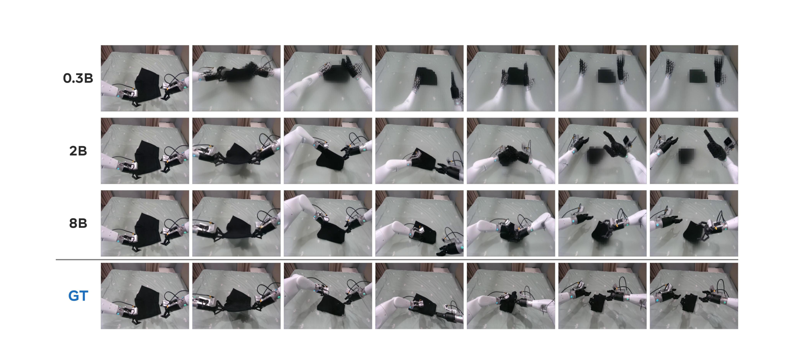

# RoboJEPA: Scaling Robotic Latent World Models

> **RoboJEPA：机器人潜空间世界模型的 scaling law**
> [arXiv:2610.10515](https://arxiv.org/abs/2610.10515) · FAIR at Meta / Mila / Chandar Research Lab / Polytechnique Montréal · Artem Zholus、Nicolas Beltran-Velez、Jianhao Yuan、Sarath Chandar、Tushar Nagarajan、Daniel Severo、Koustuv Sinha、Michal Drozdzal、Adriana Romero Soriano、Jeannette Bohg、Nicolas Ballas、Mahmoud Assran（后三位共同末位作者）
> 代码：[GitHub](https://github.com/facebookresearch/robo_jepa) · 项目页：[robojepa.github.io](https://robojepa.github.io) · 全部 checkpoint 承诺开源

这篇论文回答一个此前没有答案的问题：**机器人世界模型的质量，能不能像语言模型一样，随训练算力可预测地变化？** LM 的 scaling law 之所以有工程价值，是因为投入下一个数量级的算力之前就能预报回报。机器人交互数据又贵又少，这个可预测性直接决定"该加参数、加数据还是加算力"。作者把 V-JEPA 2.1 encoder 冻结，在其特征空间上训练一族动作条件的潜空间预测器（22M 到 8B 参数），在 23 个公开数据集、12 个本体、287 万条轨迹的混合语料上，第一次给**动作条件机器人世界模型**建立了经过外推验证的 scaling law——8B 也是迄今最大的 JEPA predictor。

## 要回答的问题：机器人世界模型的 scaling 可预测吗

先建立读者模型。LM 侧，Kaplan/Hoffmann 系的 law 把 loss 与 data/params/compute 关联起来；视频与交互环境生成模型（Genie、Cosmos 一类）有 scaling 工作，但都在机器人控制之外；另一条线 scaled 的是 policy 而不是 world model。机器人侧，潜世界模型（Dreamer 系、V-JEPA 2-AC）通常只在单一尺度训练，"质量怎么随数据/参数/算力变化"没人刻画过。

作者的选择是刻意把训练配方做简单，让 scaling 行为裸露出来：**前馈 transformer 一次前向就确定性地预测下一潜状态**（$\hat{z}_{t+1} = g_\theta([z_{\le t}], a_{\le t}, s_{\le t})$），损失就是冻结 encoder 潜空间上的纯 $\ell_1$ 回归；把预测反馈回输入即可自回归 rollout 未来动作序列。动作是状态增量或绝对指令（此时 $s_t=0$）。

## RoboJEPA：冻结表征上的确定性潜预测器

机制上有三件值得注意的实现，都在附录 A。先说清楚为什么值得注意：这一节的三件事分别回答"预测器怎么看见多视角"、"训练语料从哪来"、"部署时动作从哪来"——对应复现时最容易踩坑的三个位置。

- **多轴 RoPE**：每个 head 的通道按时间/行/列/视角四个轴分区旋转，视角身份再叠加可学习的 per-view bias——这让模型能在 1–2 个视角之间泛化，不重学位置编码。
- **训练语料**：23 个公开操作数据集（OXE 系、AgiBot、DROID 等）统一成 12 本体 / 26 动作空间的混合；视频 15,022 小时、动作 6,692 小时（`sec:data`）。训练按算力预算精确计费：逐步数 FLOPs × 步数，三段课程（预训练 → flat LR → cooldown 退火）。
- **部署**：CEM 在潜空间对候选动作序列打分（per-token $\ell_1$ 距离到目标图像特征），执行最优计划的首动作，闭环重规划。

把这三件放回执行顺序里看：RoPE 与 view bias 决定多视角潜特征能不能被同一个模型吃下，语料混合决定了 scaling law 拟合的对象是什么分布，CEM 部署则把"预测质量"翻译成"控制成功率"的通道。后文所有实验数字都沿着这三件走：law 拟合在语料与算力计费上成立，能力阈值在 CEM 闭环里测出。

### 机制流程

第1步，**输入**是多本体混合轨迹的 $(z_{\le t}, a_{\le t}, s_{\le t})$（冻结 V-JEPA 2.1 特征），**操作**是单步潜预测加 $\ell_1$、多 epoch 三段课程，**输出**是按算力档存档的 22M–8B checkpoint 家族。

第2步，**输入**是每个 checkpoint 的 held-out 9 步 rollout（DROID 真机 holdout 加 RoboCasa 仿真 holdout、双视角、10 步总序列），**操作**是把每个位置的 $\ell_1$ 逐项累计得到 $L(C)$、每个算力档取各尺寸最优形成 compute-optimal frontier，**输出**是 22M–2B 拟合再外推 4B/8B 的曲线选择。

第3步，**输入**是选定 checkpoint 加单张图像目标加 CEM 候选动作，**操作**是潜空间 rollout 打分、每步重规划，**输出**是 RoboCasa 四能力任务加 DROID Franka 三任务的成功率。

第4步（可选），**输入**是预测潜序列，**操作**是冻结特征上训练的扩散 decoder 解码回像素（纯可视化工具），**输出**是想象质量的定性对比。

## scaling law 怎么拟合与验证

四种候选形式同台比较：标准 power law $L(C)=E+AC^{\alpha}$、指数随算力线性漂移的**二阶 power law** $L(C)=E+AC^{\alpha-\gamma\ln C}$、Broken Neural Scaling Law（BNSL）、Unified NSL。拟合用 22M–2B 的 frontier 点，考核标准是**外推到 held-out 的 4B/8B**：

| 曲线 | 外推误差 DROID | 外推误差 RoboCasa |
|---|---:|---:|
| 标准 power law | 2.0 | 3.7 |
| **二阶 power law** | **0.6** | **1.4** |
| BNSL (n=1) | 1.0 | 1.8 |
| UNSL (n=1) | 1.4 | 5.7 |

（单位 ×10⁻³；`sec:experiments` Table 2。）二阶 law 胜出，比标准 law 好 2–3 倍。二阶与 BNSL 估计出的不可约误差几乎相同（DROID ≈0.2、RoboCasa ≈0.17）——**作者据此判断 RoboJEPA 在当前训练与数据预算下已接近饱和**：这份数据对"接下来该投资什么"是直接可用的。

*Figure 1：三面板 scaling 总览——左：forward-prediction $\ell_1$ 误差随训练算力（色条为参数量 22M→8B）；中：RoboCasa 规划成功率随算力提升；右：真机 Franka 三任务成功率对模型尺寸。*

上图左：forward-prediction $\ell_1$ 误差随算力的二阶 law（色条=参数量 22M→8B）；中：RoboCasa 规划成功率随算力可预测提升（长视野+物体交互任务到 10²² FLOPs 才被解决）；右：真机 Franka 三任务成功率 vs 模型尺寸。

## 离线误差到在线能力：能力阈值与顺序

第二个发现：**离线 imagination error 是真机评测的可靠 proxy**。RoboCasa 上按能力拆任务（`sec:models`）：

- **贪心任务**（一步规划可解）：末端 3D 控制约 10²⁰ FLOPs 涌现、持物移动约 3×10²⁰（对应 50M–100M 参数训满全库）；性能早饱和。
- **非贪心长视野任务**（避障、推物）：短视野训练（K=2）时**没有干净 frontier**——300M 有时胜过 1B，可预测性失效。作者把原因钉在训练-部署失配上：规划依赖长视野预测，训练却只做 2 步 rollout。修复不是从头重训（太贵），而是**只从 flat-LR checkpoint 起，把 cooldown 退火阶段换成 K=10 + 高分辨率**——贵的长 rollout 信号只花在最需要的退火段。修复后避障能力 10²¹ FLOPs 起飞、10²² 饱和，推物任务 10²² 前无一模型成功、之后全体开始成功。

能力出现顺序天然分层：**末端 3D 控制 → 持物操作 → 静态场景几何 → 场景中物体动力学**。作者给工程读者的建议明确：先建反映目标能力的下游评测，再用 law 估计达到它的最小训练算力。

## 真机部署与 VLA 参照

DROID 平台（Franka 单臂 + 左侧外部相机 + 腕相机）上，只给单张图像目标，三个任务十次/模型（`sec:model-3` Table 12，任务进度/成功率 %）：

| 模型 | Grasp | Object Lift | Pick & Place |
|---|---:|---:|---:|
| π0-FAST（文本） | 22 | 12 | 40 |
| π0.5（文本） | 12 | —（未报） | 53 |
| RoboJEPA-22M | 30 | 30 | 17 |
| RoboJEPA-2B | 43 | 40 | 31 |
| **RoboJEPA-8B** | **67** | **50** | 27 |

两个观察值得分开说。其一，RoboJEPA 全尺寸都有非零成功率、随规模单调升；其二，VLA 参照的行为模式倒挂——π0.5 在 Pick & Place（最难）拿 53%、π0-FAST 在 Object Lift 类任务只有 12%，文本里 "lift" 类动词在 DROID 训练分布里严重欠代表（论文原文报告 π0.5 于 Object Lift 成功率为 0%），而图像目标规划对这种词分布退化免疫。**必须同时交代边界**：论文自己声明这个比较不可完全归因——目标规格（image vs text）与训练数据都不同，VLA 只做情境参照（contextual reference），不是对齐基线。总评测规模 5 万+ episodes，规划超参每平台固定。

## 大模型的想象质量随规模涌现什么

扩散 decoder 只在冻结 V-JEPA 2.1-G 特征上训练、纯做可视化。跨 0.3B/2B/8B/GT 的解码对比（下图）：大模型在 rollout 全程更贴真实动力学、保住物体身份与精细操作细节、保持多视角互一致；**抓取接触与布料折叠这类结构化形变只在足够大的 predictor 上出现**，小模型直接糊掉。8B 在 DROID 上微调后还能三视角 720p 同时想象，腕相机内容能从侧相机信息传播过来——跨视角信息转移随规模出现。

*Figure 2：decoded imagination 随规模提升——0.3B / 2B / 8B 与真值（GT）的潜 rollout 解码对比，大模型保住物体身份与接触细节。*

## 边界与复现注意点

作者自己列出的边界（`sec:conclusion`）：encoder 冻结——law 描述的是固定表征之上的 dynamics model，不是 encoder-predictor 联合 scaling；多 epoch 固定语料 → 拟合已近数据饱和，推前沿需要更多样的交互数据而非参数；不用文本（单图像目标）；规划从均匀分布采样动作、无 policy proposal。复现侧：全部 checkpoint + 训练/部署代码承诺开源（本笔记核查时仓库刚建立，内容以项目页为准）。

**我的分析**：这篇论文对社区的用法有两种。做世界模型的人拿到的是第一个可外推的 budget planner——"10²² FLOPs 之前别指望推物能力"这种判断可以直接写进项目计划；做评测协议的人拿到的是一条判据——**离线 imagination error 与在线成功率强相关，训练中可以用它省真机评测成本**（但注意只在验证过的任务族内可信）。最值得警惕的越界解读是把 10²⁰/10²¹/10²² 这几个阈值当成普适常数：它们绑定这套任务定义、这个 CEM 规划器和这份语料，换任务族的阈值要重新标定。训练-部署 rollout 失配的修复（贵信号放退火段）是独立可移植的工程结论。

**尚不能确定**：encoder 联合 scaling 会不会改变幂指数；文本条件化加入后规划成功率还能抬多少——论文都留作开放问题。
