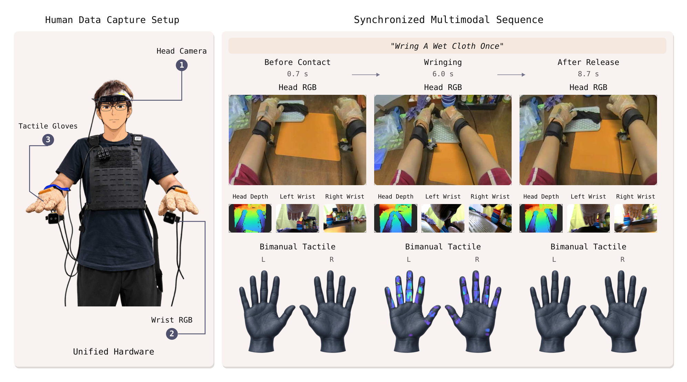

# TouchScale: 500 Hours of Human Vision and Touch for Visual-Tactile Learning

> **TouchScale：500 小时人类视觉-触觉数据——从触觉预测到机器人控制的规模红利**
> [arXiv:2610.10288](https://arxiv.org/abs/2610.10288) · Texas A&M / Google DeepMind / CMU / Stanford / Yale / Microsoft / NVIDIA / Meta / UW 等约 27 家机构线 · Dayou Li*、Hao Wang*、Qianqian Yang*、Zihao Zhu*（共同一作）、…、Masayoshi Tomizuka、Marco Pavone、Changliu Liu（通讯 Zhiwen Fan）
> 项目页：[touch-scale.github.io](https://touch-scale.github.io) · 代码：[GitHub](https://github.com/phai-lab/touchscale) · 数据：[Hugging Face](https://huggingface.co/datasets/2077AIDataFoundation/TouchScale)

抓鸡蛋、拧湿布，结果取决于手指压在哪里、多用力——而看着手的相机只录下了运动。自我中心视频数据已经规模到两万小时并开始支撑机器人学习，但**接触与压力通道整体缺席**。现有的视觉-触觉数据集多数小于 30 小时（FEEL 约 27h；最大的 DeskTask-Tac 也只有 37.2h），规模效应没法在任何一个单库里研究；跨库混源又会把传感器与协议差异混进比较。这篇论文的答卷：用**同一套可穿戴硬件 + 同步管线**采 500 小时，让"数据规模"第一次成为视觉-触觉学习里可以单独拧的变量。

## TouchScale 是什么：硬件、规模、构成

统一可穿戴采集（`sec:evaluation` Figure 1、Figure 2）：

- **头戴 RGB-D**（整体交互）+ **双腕 RGB**（接触细节）+ **双手触觉手套**（每手 880 taxels，覆盖五指+掌，空间分辨率 <2mm——现有最密的全手套触觉）+ 时间同步（30Hz 视觉）。
- **规模**：500 小时 / ~87K episodes / ~2K 任务描述 / >1.5K 物体 / 9 个高层场景族（>800 场景配置）。

与十个已有数据集的对照（`sec:dataset` Table 1）：TouchScale 在记录小时数（第二名的 ~9–160 倍）与手套触觉密度两项上都是第一；视角配置 H+2W 与 EgoTouch 同型。

*Figure 1：TouchScale 总览——统一可穿戴采集（头 RGB-D + 双腕 RGB + 触觉手套）、500 小时 / 87K episodes / 2K 任务描述，评测覆盖触觉预测、动作识别与机器人操作。*

*Figure 2：采集硬件与同步多模态序列——"拧一次湿布"的头 RGB/深度、双腕 RGB 与双手触觉按接触前/拧/释放三相对齐。*

上图即"拧一次湿布"的同步序列：接触前（0.7s）→ 拧（6.0s，手套压力分布点亮指尖与掌）→ 释放后（8.7s）——头 RGB/深度、双腕 RGB、双手触觉四路同拍。

## 四个问题怎么问、怎么答

四个问题的设计本身就值得抄（`sec:experiments`）：

**Q1 零样本触觉预测**（跨传感器）：同一 TouchAnything 架构，等时对照（~16h TouchScale 子集 vs 16.2h EgoTouch 训练）直接在 EgoTactile（未见过的传感器）上评测。因为两只手套的 taxel 布局不同，评测映射到 **12 个解剖学手区**——这是跨触觉传感器可比的关键协议设计。结果：零样本 cIoU **0.181 vs 0.134**（+35%）；全量 TouchScale 训到 0.383；vIoU 0.276、CoP 定位误差 0.317、压力幅值误差 0.105。

**Q2 表征迁移**（触觉监督学到的视觉表征有没有用）：同一 Hiera-B checkpoint 起、同一优化方案与预算，分别用 TouchScale / OpenTouch / FEEL / EgoTouch 预训练，测三个动作识别基准。TouchScale 三基准全最高：平均 linear probe 24.45%、fine-tune **49.62%**（EgoTouch 21.75%）；MECCANO 20.16→28.97（vs EgoTouch 预训练，+43.7% 相对）。

**Q3 机器人中训练**（免动作对齐）：N0-VTLA（视觉-触觉-语言-动作策略）官方 checkpoint 出发，**只加一个 Stage-1 未来触觉预测中训练**再机器人 post-training；对照组跳过中训练、其余协议全同。平台：xArm6 + BrainCo Revo 2 手 + 手套触觉 + 外部 RGB-D + 腕相机；50 teleop demos/任务。四任务（软/硬分拣 10→60、瓶盖 40→70、试管 30→60、白板擦 10→40）：平均 **22.5%→57.5%**（+35 点）。

**Q4 数据 scaling**（传感器与协议固定，只动数据量）：10%→100% 训练量，零样本 cIoU 0.311→0.383；中训练 20%→100%，机器人成功率 30.0%→57.5%。四项触觉指标全部单调向好——**在测过的范围内未见饱和**。

### 机制流程

1. **输入**：统一硬件采集流。**操作**：头 RGB-D + 双腕 RGB + 双手 880-taxel 手套同步记录。**输出**：500h / 87K episodes 原始语料。
2. **输入**：原始语料。**操作**：质检后处理（接触事件与 engaged 区域标注）、按 ~2K 任务描述组织。**输出**：数据集本体。
3. **输入**：数据集。**操作**：四问题评测（12 区域映射 / Hiera-B 预训练 / N0-VTLA 中训练→post-training / 固定协议 scaling）。**输出**：Tables 2–4 + Figure 4。

## 边界与负面结果

该说的都要说：vIoU 在各自 unseen split 上与 EgoTouch 相当（0.299 vs 0.302）——体积重叠不是规模敏感指标；10%→100% 的 CoP/压力误差改善幅度小（0.332→0.317 / 0.108→0.105）。机器人验证只有 4 任务 × 50 demos × 20 试、单臂单手机器人；触觉通道绑定手套 taxel 布局，跨传感器迁移靠解剖区域映射而不是原生分辨率。

## 复现与使用注意

**我的分析**：对缺触觉数据的机器人团队，这是当前最便宜的 +35 点来源——人类视频+手套中训练、完全免动作重定向，插在策略 post-training 之前即可。但有一个论文没做的对照要心里有数：**同样工时花在更多 teleop 演示上会怎样**——中训练 vs 更多演示的边际收益对比缺失，预算决策时这是开口。数据集承诺公开发布（含重建物体模型）；本笔记核查时 GitHub 仓（9-23 建）与 HF 数据集页已建、内容完整性以项目页为准。

**尚不能确定**：手套 taxel → 机器人指腹的形态差在哪些任务上成为瓶颈；触觉 scaling 的饱和点（100% 处仍在涨）。
