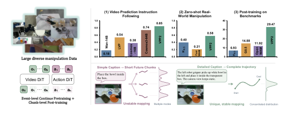
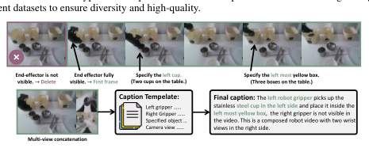
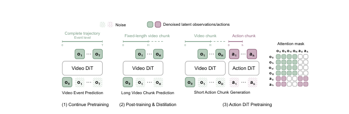
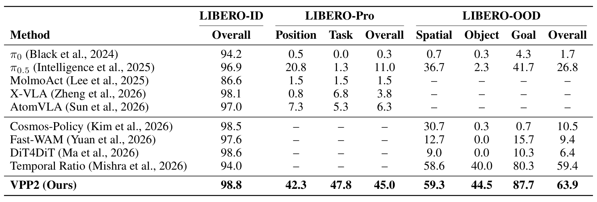

# Video Prediction Policy 2: Predict Better, Act Better

> **VPP2：预测得更好，动作才更好——事件级操作视频继续预训练 + MoT 动作专家**
> [arXiv:2610.10270](https://arxiv.org/abs/2610.10270) · Yanjiang Guo、Haodong Yan、Zhide Zhong、Zhongru Zhang 等 18 人（机器人线，含 Jianyu Chen）
> 官方实现：[GitHub](https://github.com/roboterax/video-prediction-policy-2)（10-08 建仓）· 项目页 [Haodong-Yan/VPP2-project](https://github.com/Haodong-Yan/VPP2-project)

WAM 把视频预测先验迁移给动作学习，但作者先给了一个诊断：**现有 WAM 在开放环境里频繁产出错误的运动预测，进而带错动作**。两个原因——视频基础模型不是为操作优化的；朴素地把动作模块加进视频模型会大幅伤它的泛化（Wan2.1-14B 骨干直接用：指令遵循 0.32/0.04（human/robot），几乎不可用）。VPP2 的解法是三段式：把视频基础**为操作重新预训练**，再蒸馏成单步视觉规划器，再用 MoT 架构加动作专家。

## 诊断：WAM 为什么在开放环境出错

*Figure 1：VPP2 总览——事件级继续预训练 + chunk 级后训练蒸馏 + MoT 动作专家；三组评测分别对应指令遵循、零样本真机与基准后训练。*

（`sec:introduction`）视频预测做视觉规划的不确定性来自条件映射不稳：简短说明文字加过短的未来片段，会让"同一条指令 → 多种合理未来"的映射发散。作者的对应手段是**把不确定性从数据管线里挤出去**：详细说明文字加完整事件级轨迹预测。

## 数据管线：把不确定性挤出条件映射

这是本文最可复用的部分（DATA PROCESS PIPELINE）：

- **三类源**：机器人（OXE/RoboMIND/DROID/AgiBot World/RDT/GM100/自采 ALOHA 等，单臂/双臂/移动+人形）、人类（EgoDex/Ego4D/Epic-Kitchen + 自采）、通用视频（Open-vid/Panda-70M 经操作相关过滤）。
- **分段**：1–12 秒语义连贯 clip——启发式边界（手/末端速度局部极小、夹爪开合时刻）+ VLM 精修合并。
- **详细说明文字**：说明模板显式指定**左/右夹爪各自动作、目标物体消歧（两个杯子里的左边那个）、相机视角变化**。Figure 2 的例子：末端不可见帧删除、首帧确认可见、物体指代消歧、多视角拼接说明全部写进最终说明文字里。
- **T 形多视角拼接**：主视角在左、两个辅助视角竖排在右，不足补黑——跨数据集统一输入。
- **统一动作空间 + 统一末端坐标系**：跨库动作表示冲突在这里解决。

*Figure 2：数据管线示例——末端不可见帧删除、首帧确认、目标物体消歧、多视角拼接说明全部写进最终说明文字。*

## 三段训练与机制流程

1. **输入**：事件级语料 + Wan 开源视频骨干。**操作**：**事件级继续预训练**——完整事件轨迹预测（不是固定时长 chunk）。**输出**：VPP2 视频基础模型（14B）。
2. **输入**：视频基础 + 机器人演示。**操作**：固定视野 chunk 后训练 + **consistency distillation** → 单步视觉规划器（实时）。**输出**：单步规划器。
3. **输入**：规划器 + 动作演示。**操作**：**MoT 架构加动作专家**（条件于预测未来的隐式逆动力学）；部署可配 VLM 规划器把开放指令拆子任务。**输出**：ALOHA 零动作 + 基准后训练模型。

*Figure 4：VPP2 训练管线——(1) 事件级继续预训练；(2) 后训练与蒸馏（长视频 chunk 预测 + 短动作 chunk 生成）；(3) Action DiT 预训练的结构化注意力掩码。*

## 预测质量：指令遵循与赢率

50 image–instruction 对/域（GPT 评估器 + 人类成对评分，`sec:method` Table 2）：

| 模型 | Human | Robot |
|---|---:|---:|
| Wan2.1-14B | 0.32 | 0.04 |
| LVP | 0.62 | 0.46 |
| Cosmos3-16B | 0.44 | 0.32 |
| Cosmos3-64B | 0.70 | 0.78 |
| VPP2-Fixed-Step（消融） | 0.48 | 0.42 |
| **VPP2** | **0.80** | **0.90** |

三个读数：14B 操作专用预训练**反超 64B 通用模型**（+10/+12 点）；**消融行单独说明事件级对齐的价值**——固定时长 chunk（丢完整事件）掉到 0.48/0.42；人类成对赢率 vs Cosmos3-64B 达 96%（robot 域）。复杂空间理解任务优势最大（Figure 7）。

## 动作侧：真机零样本与基准矩阵

**零样本真机 ALOHA**（同数据后训练的 π0.5 与 Fast-WAM-14B 对照，Figure 8）：10 类任务平均 **58.5% vs 40.0% vs 20.5%**，VPP2 10 类中 9 类最优（叠/拿/放/折/倒/拉/插/开/关/擦）。

**基准后训练**（四标准 LIBERO 套件训练、Pro/OOD 零额外训练评测，Table 3）：

| | LIBERO-ID | LIBERO-Pro | LIBERO-OOD |
|---|---:|---:|---:|
| π0.5 | 96.9 | 11.0 | 26.8 |
| Temporal Ratio | 94.0 | — | 59.4 |
| **VPP2** | **98.8** | **45.0**（42.3/47.8） | **63.9**（59.3/44.5/87.7） |

组合泛化（OOD 的 spatial/object/goal 重组）大幅领先最强基线；RoboDojo **29.47** vs Cosmos2-48B 14.88 / Coconut-24B 6.93。

*Table 3：LIBERO-ID / Pro / OOD 对比——VPP2 98.8 / 45.0 / 63.9，Pro 与 OOD 大幅超过最强基线。*

## 边界与复现注意

要对齐说清楚的：π0.5/Fast-WAM 在 ALOHA 数据上对齐再训练保证同数据公平，但**架构容量不同**；指令遵循评测有 GPT 评估器与人类评分的主观成分（样本 50 对/域）；LIBERO 系基线部分未报 Pro/OOD（基线集合不完整）；蒸馏到单步的预测质量损失未单独量化。官方实现已开源（10-08 建仓，15★）。

**我的分析**：VPP2 与同实验室的 Fast-WAM 构成 WAM 谱系的两端——Fast-WAM 为求快去掉显式未来生成，VPP2 保留预测、用蒸馏压成本；与昨天的 OpenWAM/Long-WAM 汇流在同一个判断上：**WAM 的差异主要来自骨干为操作做了什么预训练，而不是动作接口本身**。数据侧清单（末端显式指定 + 物体消歧 + 视角说明 + 事件级分段 + T 形拼接 + 统一末端坐标系）是本文最值得整段抄走的部分——它是把说明文字（caption）的详细度变成可执行工程规范的第一份完整模板。

**尚不能确定**：说明文字（caption）详细度与事件级目标各自的贡献分解；单步蒸馏的预测损失在哪些任务上可见；开放指令何时不再需要外挂 VLM 规划器。
