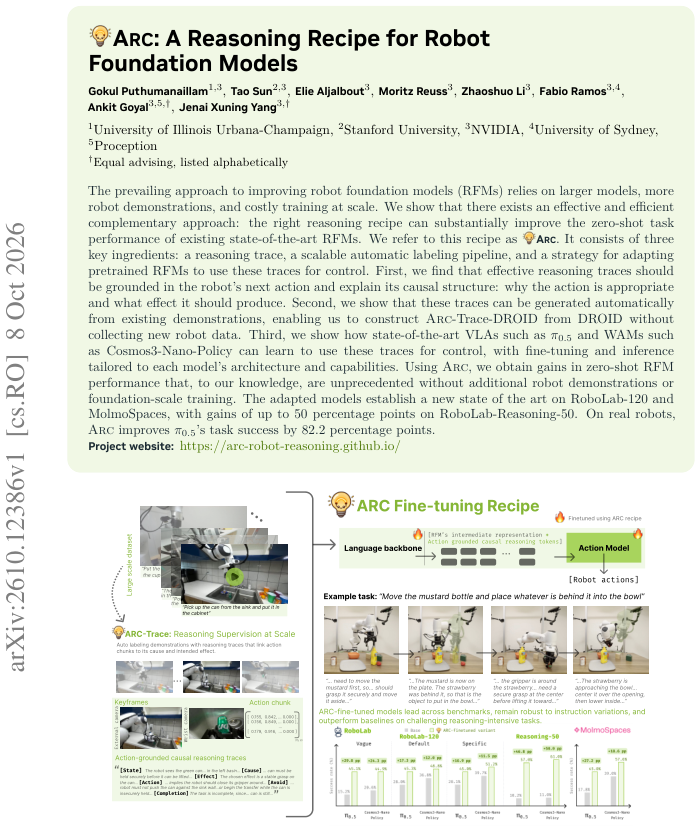
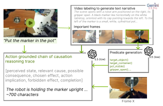
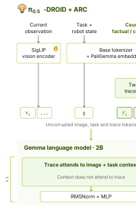
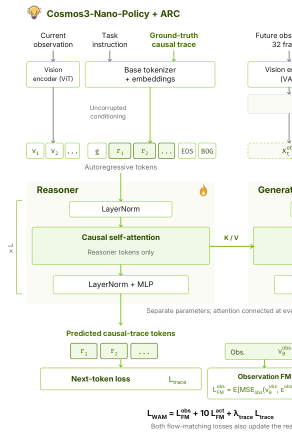
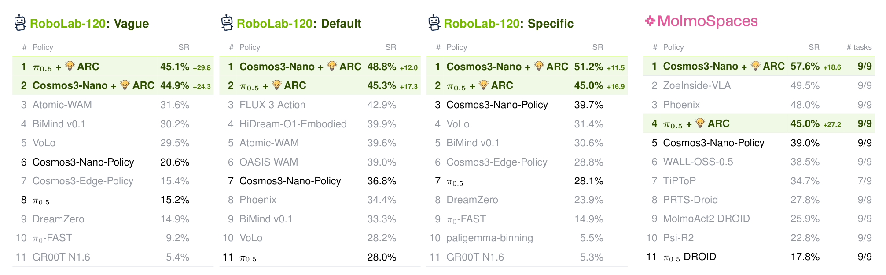
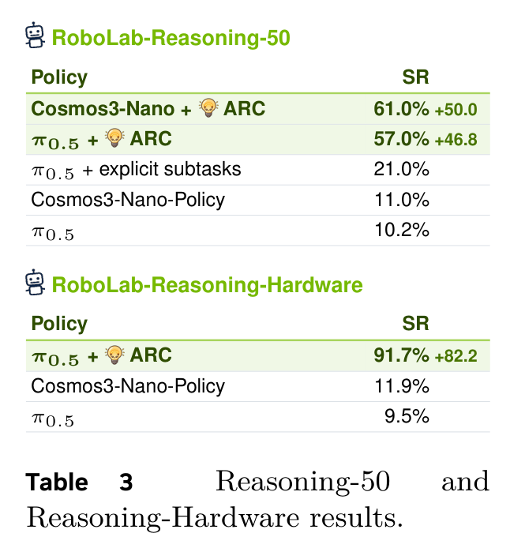
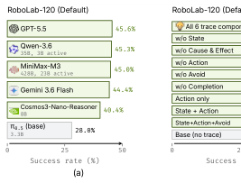
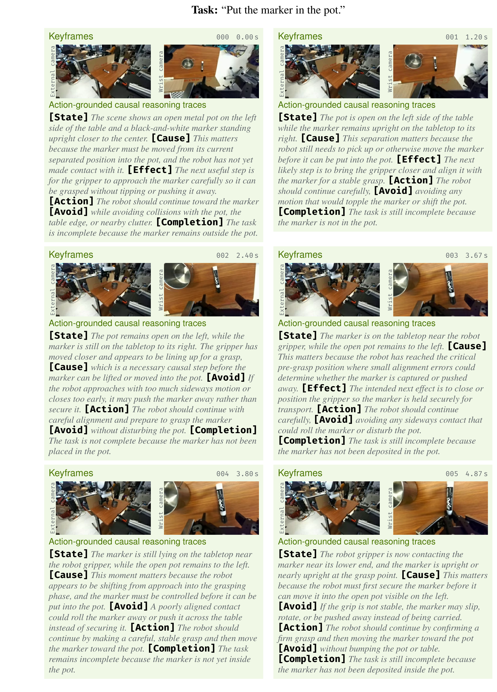

# ARC: A Reasoning Recipe for Robot Foundation Models

> arXiv:2610.12386v1（2026-10-09 01:38 北京时间提交）· Gokul Puthumanaillam, Tao Sun, Elie Aljalbout, Moritz Reuss, Zhaoshuo Li, Fabio Ramos, Ankit Goyal, Jenai Xuning Yang（UIUC / Stanford / NVIDIA / Sydney / Proception）· [摘要页](https://arxiv.org/abs/2610.12386)
>
> 一句话：不换模型、不采新数据、不做 foundation 规模训练——用「动作接地因果推理轨迹」重标 DROID 后全量微调，π0.5 与 Cosmos3-Nano-Policy 在 RoboLab-120 三档 + MolmoSpaces 双双登顶；Reasoning-50 +50.0/+46.8 点，真机 Reasoning-Hardware 91.7%（+82.2）。

## 研究问题：推理配方能否替代规模

提升 robot foundation model（RFM）的默认路径是更大的模型、更多的机器人演示、更贵的规模训练。ARC 的出发点是存在一条正交且便宜的轴：**正确的推理配方**。作者观察到的失效模式是语言接地缺失——模型可以靠视觉捷径满足语言目标，即使换了目标物体仍继续朝原目标行动。**作者主张**：一个动作之所以被选中，是因为它预期在世界中产生的改变；推理应该把这个关系显式写出来——而不是更长的场景描述或更细的任务分解。

*Figure 1：ARC 总览——配方的三要素：动作接地推理轨迹、DROID 自动重标、对 π0.5 与 Cosmos3-Nano-Policy 的适配微调；RoboLab-120 与 Reasoning-50 的提升幅度*

## 机制流程：从演示到推理引导控制

配方的三段：

**1. Arc-Trace 表示。** 每个动作 chunk $a_t$ 配一段七段式因果轨迹 $r_t = [\text{State}, \text{Cause}, \text{Consequence}, \text{Effect}, \text{Action}, \text{Avoid}, \text{Completion}]_t$：State/Cause 指出当前步骤的任务相关事实及其重要性；Consequence 从事实向前推理；Effect 选定推进任务的状态改变；Action 把效果连接到即将执行的动作；Avoid 记录要避免的改变；Completion 跨决策保留任务进度。**关键设计**是轨迹解释动作「通过它意图引起的效果」，而非孤立描述动作。

**2. 自动标注管线。** 现有数据集只记录机器人做了什么，没有记录为什么。作者的观察是：**成功演示里已经包含恢复这份监督所需的全部信息**——指令给目标、视频记录场景如何变、动作序列揭示变化如何产生。管线（Figure 3）：先从指令+视频生成时间接地的执行叙述；再导出 episode 级 state checks（跟踪进度的结构化证据）；最后在关键帧上让 VLM 综合指令/叙述/观测/state checks 产出与动作对齐的轨迹。产出 **ARC-Trace-DROID：约 75K 重标 episodes、1.2M 动作对齐帧**——不采一条新轨迹、不做人工逐动作标注。

*Figure 3：Arc-Trace 重标管线——视频标注生成叙述、谓词生成 state checks、关键帧上 VLM 产出七段因果轨迹*

**3. 微调与推理。** 轨迹复用 base tokenizer 与 embeddings，与任务/视觉上下文一起进入语言 transformer；动作生成层在整个去噪过程中注意这些表示。两族实现：

- **VLA（π0.5-DROID）**：PaliGemma 骨干（SigLIP + Gemma）+ 300M action expert；两层 encoder 把轨迹嵌入映射为追加在图像-指令上下文之后的序列元素，联合微调。流匹配目标（式 1）之上，**我的理解**是亮点在反事实惩罚（式 2）：约 5% 的轨迹替换成与所示动作矛盾的反事实 $r^-_t$、从 Lpred 排除，惩罚一步估计 $b_t$ 靠近演示动作——防止模型只把轨迹当冗余辅助目标、换了轨迹动作不变的捷径学习。
- **WAM（Cosmos3-Nano-Policy）**：reasoner 与 generator 分参数、每层注意力相连；reasoner 只注意自己一侧的序列，所以轨迹条件**不需要改架构**。窗口含 1 观测帧 + 32 未来帧，联合微调加 reasoner 的 next-token 轨迹监督 $\mathcal{L}_{\text{trace}}$（式 3）。Cosmos3 的 8B reasoner 本来就能在矛盾轨迹下产生不同动作分布，加 Lcf 无可测收益，省略。

*Figure 12：π0.5+ARC 微调架构——轨迹经两层 encoder 进入上下文，trace 注意 image+task，context 不注意 trace*

*Figure 13：Cosmos3-Nano+ARC 架构——reasoner/generator 双流、每层 KV 相连、L_VLAM = L_obs_FM + 10·L_next_TKN + λ_trace·L_trace*

**推理**：冻结微调后的模型，外部 VLM（默认 Qwen3.6-35B-A3B）从指令+当前相机观测生成轨迹、执行中按选定频率刷新（硬件 rollout 中约 1 Hz），控制 15 Hz，控制环附加开销约 10 ms。用外部生成的原因是**作者自述**：内置语言组件生成这些轨迹不如使用它们可靠。

## 关键结果：四个基准与四个发现

**论文证据**（全部零样本、DROID 本体、无 benchmark 特定训练）：

| 基准 | Cosmos3-Nano+ARC | π0.5+ARC | 基线（各自） |
|---|---|---|---|
| RoboLab-120 Vague | 44.9%（+24.3） | 45.1%（+29.8） | 20.6% / 15.2% |
| RoboLab-120 Default | **48.8%（+12.0）** | 45.3%（+17.3） | 36.8% / 28.0% |
| RoboLab-120 Specific | **51.2%（+11.5）** | 45.0%（+16.9） | 39.7% / 28.1% |
| MolmoSpaces | **57.6%（+18.6）** | 45.0%（+27.2） | 39.0% / 17.8% |
| Reasoning-50 | **61.0%（+50.0）** | 57.0%（+46.8） | 11.0% / 10.2% |
| 真机 Reasoning-Hardware | — | **91.7%（+82.2）** | — / 9.5% |

*Table 1：RoboLab-120 三档 + MolmoSpaces 排行——两个 ARC 变体全部第一，反超 Atomic-WAM/FLUX 3 Action 等更强预训练策略*

*Table 2：Reasoning-50 与真机 Reasoning-Hardware——61.0%/57.0%（+50.0/+46.8）与 91.7%（+82.2）*

值得注意的是 **π0.5+explicit subtasks 只有 21.0%**（Reasoning-50）vs 轨迹 57.0%——**论文证据**直接支持作者的诊断：缺的是因果接地，不是更细的任务分解。

**四个 KF**：

1. **长视野/动态/推理密集任务**：轨迹跟踪进度、维持剩余步骤排序；场景变化时更新推理重定向；推理密集任务上主动补齐指令里没写的先决步骤（「先把碗清空才能放香蕉」）+ 失败后修正重试。
2. **对指令具体度近乎不变**：Vague/Default/Specific 三档 45.1/45.3/45.0（π0.5+ARC），而基线随指令变模糊从 28.1% 掉到 15.2%——轨迹在场景上下文里解释指令，把欠指定指令翻译成具体效果目标。
3. **推理买到推理时加速**：π0.5+ARC 单 Euler 步 ≈ 10 步基线（27.6% vs 28.0%）；Cosmos3-Nano+ARC 2 UniPC 步 ≈ 4 步基线。**作者假设**：指定预期效果收窄了合理动作集、降低多模态，粗积分因此够用。
4. **训练效率**：达到指令基线 10K 迭代水平只需约 **4.3× 更少**的更新。因果监督让每条演示更有信息量。

*Figure 9：三组消融——(a) 外部 VLM 可换（45.6→40.4%）；(b) 六组件轨迹各自贡献；(c) 全量 vs 只训 action head*

**硬件 rollout**（Figure 10 展示一例）：π0.5+ARC 在 RoboLab-Reasoning-Hardware 上先错拿橘子到错碗、靠在线推理重定向到正确碗；人往桌上加/拿物体时动态适应——动态环境里轨迹刷新的价值直接可见。

*Figure 10：真机 rollout——外部 VLM 约 1 Hz 刷新推理轨迹，六关键帧各带 State/Cause/Effect/Avoid/Completion 标注*

## 消融：轨迹里什么在起作用

- **AB#1 换外部 VLM**（冻结 π0.5+ARC）：GPT-5.5 45.6%、Qwen-3.6 45.3%、MiniMax-M3 45.0%、Gemini 3.6 Flash 44.4%——不绑定轨迹生成器；Cosmos3-Nano-Reasoner 40.4% 说明生成质量有下限但宽容。
- **AB#2 轨迹组件**：全六组件 45.3%；w/o Action 30.6%、Action only 32.3%、w/o Cause & Effect 39.3%、w/o Avoid 42.3%、w/o Completion 27.4%（**注意**：上一段 Figure 9(b) 的图内数字与此处正文引述顺序略有出入，以正文数值为准）。**我的分析**：两个互补角色清晰——因果账户说明哪个状态改变重要、为什么；动作含义把它连接到物理步骤。只有动作含义没有因果上下文，控制器收到命令但不知道为什么合适。
- **AB#3 全量 vs 只训头**：π0.5 全量 45.0% vs action-head-only 30.9%；Cosmos3 全量 51.2% vs generator-only 43.7%。**作者解释**：预训练语言特征不以控制器可直接使用的形式暴露因果区分，全量微调让预测误差重塑特征本身。

## 边界与不能下的结论

- **本体绑定**：全部实验（仿真+真机）用 DROID 本体；RoboLab-120/MolmoSpaces/Reasoning-50 均为 RoboLab 系评测环境。跨本体泛化**尚不能确定**。
- **轨迹刷新 ~1 Hz**：快动态任务可能超出该协议；文中未系统扫描刷新率上限。
- **Cosmos3-Nano 单步 UniPC 仍掉点**：多步历史对高阶校正是必要的——推理加速有边界。
- **内置组件不可靠**：轨迹生成必须外挂 VLM，部署多一个组件与约 10ms 控制环开销。

**可复用的三件东西**：七段式轨迹模板（State/Cause/Consequence/Effect/Avoid/Completion + Action）可作任何演示重标的标注 schema；5% 反事实替换 + margin 惩罚是防捷径学习的廉价组件；Reasoning-50 的四能力分类（contextual / long-horizon / discovery / negation）可复用为推理评测骨架。

**待解**：轨迹刷新到 5–10 Hz 的收益曲线；ARC-Trace 管线在 AgiBot/RoboMIND 等非 DROID 数据上的迁移；外部轨迹与内置 reasoner 的互蒸馏。

代码/模型/数据集/RoboLab-Reasoning-50 基准在项目页全部标注 Coming soon（本日核查）；项目页 [arc-robot-reasoning.github.io](https://arc-robot-reasoning.github.io/)。
