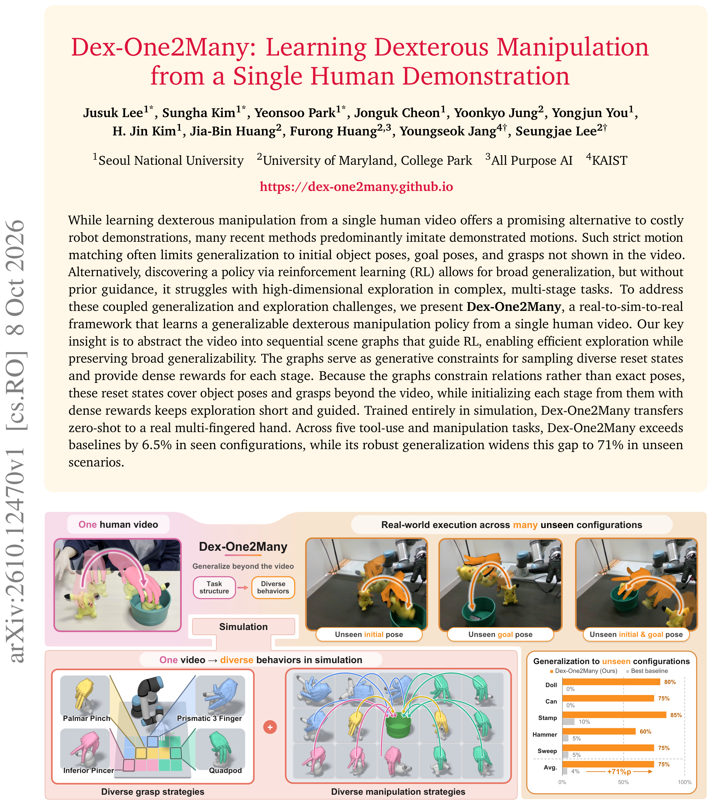
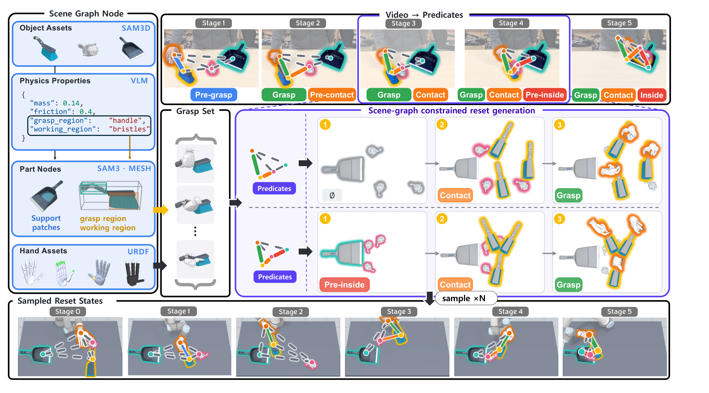
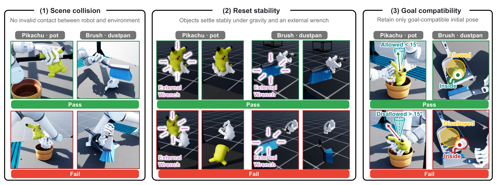
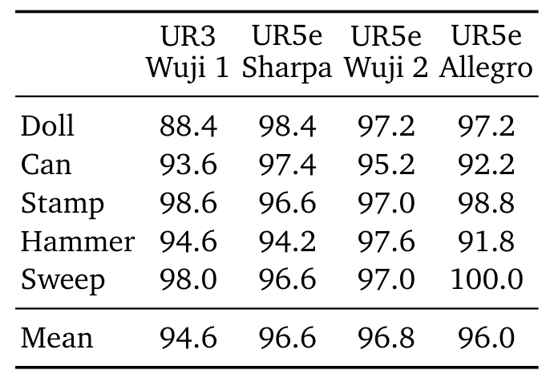
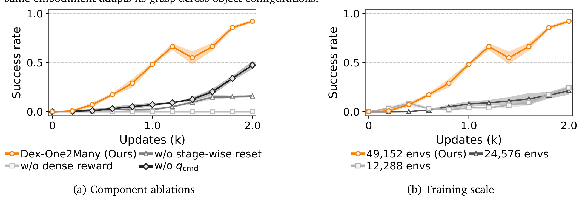
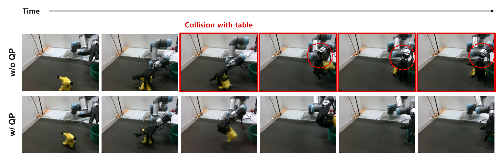

# Dex-One2Many: Learning Dexterous Manipulation from a Single Human Demonstration

> arXiv:2610.12470v1（2026-10-09 01:59 北京时间提交）· Jusuk Lee, Sungha Kim, Yeonsoo Park, Jonguk Cheon, Yoonkyo Jung, Yongjun You, H. Jin Kim, Jia-Bin Huang, Furong Huang, Youngseok Jang, Seungjae Lee（SNU / UMD / All Purpose AI / KAIST）· [摘要页](https://arxiv.org/abs/2610.12470) · 项目页 [dex-one2many.github.io](https://dex-one2many.github.io/)（Code coming soon）
>
> 一句话：单个人类视频学灵巧操作的泛化-探索两难——模仿演示动作出不了视频外配置、无引导 RL 探索不动；Dex-One2Many 把视频抽象成阶段式场景图（只约束关系不约束位姿），图同时定义 reset 分布与密集谓词奖励，real-to-sim-to-real 零样本上多指手：Unseen 配置仿真 85–100%、真机 60–85%，基线两环境都 ≤15%。

## 研究问题： Seen/Unseen 把两难定量分开

从单个人类视频学灵巧操作是省机器人演示的诱人路线，但**作者诊断**出两条路线各自的死穴。**模仿演示动作**（多数近期方法）：严格运动匹配限制泛化——初始物体位姿、目标位姿、抓取方式只要超出视频就崩。**无引导 RL**：泛化好但高维多阶段任务里探索不动。论文的 Seen/Unseen 协议把这个差距量化：Seen 配置复现视频里的初始/目标位姿，Unseen 用没出现过的配置。

*Figure 1：从一个人类视频到多种行为——上：Pikachu 入碗演示与三种未见配置的真机执行；下：33 类抓取分类里的多样抓取与仿真多样策略，及 Unseen 泛化柱状图（+71 点）*

**核心洞察**：把视频抽象成**阶段式场景图**——保留「哪些关系必须以什么顺序成立」，允许位姿/抓取/轨迹自由变。同一个任务从不同配置执行时位姿轨迹都不同，但所需关系及其顺序不变。

## 机制流程：从视频到图到 RL

**阶段式场景图抽象。** 每个图代表一个阶段：节点 = 手 / 任务相关物体 / 功能部位（如握柄、刷毛区）；边 = 谓词关系。**任务无关的预定义谓词表**（Table 3）：一类指定当前必须成立的关系（grasp / contact / inside / on_top / seat），另一类描述逼近下一关系的邻近性（pre_grasp / pre_inside / pre_on_top）——前者是当前阶段的约束，后者指示下一个该建立什么。VLM 直接从视频+谓词表抽象：识别节点、随时间推断谓词关系；**谓词关系变化即引入新阶段**（pre_grasp 转 grasp、新关系加入），得到有序序列 $G_{1:K}$。

**图接地 RL。** 场景图同时定义 MDP 的三件事：

- **观测**：由节点/边构造——手节点给本体感知、物体节点给几何与 6D 位姿、功能部位节点给局部区域；边给相对 6D 位姿。同一构造跨任务图复用。
- **奖励**：每条边（谓词）映射到一个几何或物理奖励——几何谓词用距离度量当密集进度信号（3D 笛卡尔距离逼近抓取区/容纳区；joint-space 距离给 seat），grasp 用 CHORD 的 6D wrench 力闭合奖励 + 抓取质量度量保稳定。**阶段推进时新谓词的奖励追加进任务奖励**——同一装配规则跨直接操作与工具使用任务（Figure 3(c)）。
- **初始分布** $\rho_0$：$G_k$ 当**生成约束**——几何谓词的距离条件同时是放置规则：沿 $G_k$ 的边把源节点相对目标节点放置使条件成立；位姿/抓取仍可采样（reset 多样性）。

**reset 质量三关**（Figure 11）：场景碰撞（机器人-环境无非法接触）、重置稳定性（重力+外力扳手下物体稳定）、目标兼容（保留与最终目标兼容的初始位姿，如 <15° 倾角）。物理在仿真里验证。

**低层**：QP 控制器跟踪期望掌/指尖速度输出关节速度；含接触恢复命令（verified closing command）——w/o QP 消融显示真机撞桌失败（Figure 12）。

*Figure 2：Dex-One2Many 全管线——(1) VLM+谓词表抽阶段式场景图；(2) 图接地 RL（观测/奖励/reset 由图定义，QP 低层，49,152 并行环境）；(3) 零样本 sim-to-real*

*Figure 10：场景图约束的 reset 生成——SAM3D 物体资产 + VLM 物理属性 + SAM3·MESH 功能部位 + URDF 手资产 → 抓取集；沿谓词边放置生成多样 reset（sample×N）*

*Figure 11：reset 物理验证三关——(1) 场景碰撞 (2) 重置稳定性（外力扳手下 Pass/Fail）(3) 目标兼容（<15° 倾角 / Inside 判定）*

## 关键结果：泛化、跨本体、消融

**Q1 泛化**（每法每任务 30 episodes：10 Seen + 20 Unseen；真机零样本无微调）：Seen 配置上基线也能高成功——执行级引导能复现演示配置；**差距在 Unseen**：基线仿真与真机都 ≤15%，Dex-One2Many 仿真 85–100%、真机 60–85%。Can 任务固定目标只变初始位置的 heatmap（Figure 5）显示基线只在演示位置附近成功、本方法覆盖工作空间大得多的范围——**论文证据**说明差距不是挑了特定评测配置。

**Q2 跨本体**（只换 URDF + 合成对应抓取集，其余不动；每任务 500 episodes）：UR3+Wuji 1 平均 94.6%、UR5e+Sharpa 96.6%、UR5e+Wuji 2 96.8%、UR5e+Allegro 96.0%——任务规范本体无关。**论文证据**（Figure 6）：33 类 Feix 分类下不同本体自发学出不同抓取类型、同本体随物体配置换抓取——**我的分析**：这是「约束关系而非重定向人类抓取」路线的直接回报：RL 在关系约束下找到**该本体自己的**抓取，而不是继承人手的。

| 本体 | Doll | Can | Stamp | Hammer | Sweep | 平均 |
|---|---:|---:|---:|---:|---:|---:|
| UR3 + Wuji 1 | 88.4 | 93.6 | 98.6 | 94.6 | 98.0 | 94.6 |
| UR5e + Sharpa | 98.4 | 97.4 | 96.6 | 94.2 | 96.6 | 96.6 |
| UR5e + Wuji 2 | 97.2 | 95.2 | 97.0 | 97.6 | 97.0 | 96.8 |
| UR5e + Allegro | 97.2 | 92.2 | 98.8 | 91.8 | 100.0 | 96.0 |

*Table 1：四本体仿真成功率——500 episodes/任务，均值 94.6-96.8%，任务规范本体无关*

**Q3 消融**（Sweep 任务、空手起的完整 episode）：

- **w/o stage-wise reset**：2k PPO 更新后从 >90% 掉到约 **16%**——从中间阶段起步是多阶段任务探索的关键。
- **w/o dense reward**（谓词距离奖励）：全程 **0%**——密集反馈是引导探索的必要条件，不是锦上添花。
- **w/o qcmd**（验证过的闭合命令）：约 **48%** 且频繁滑落掉物——恢复主动接触力对跨阶段稳定转移至关重要。
- **训练规模**：49,152 环境下 >90% vs 24,576/12,288 的 <25%（同 PPO 更新数）——大规模并行经验收集在多样 reset 分布下收益巨大。

*Figure 7：消融——(a) 三组件去掉各掉到 16%/0%/48%；(b) 49,152 环境 >90% vs 24,576/12,288 <25%*

*Figure 12：QP 的 sim-to-real 作用——w/o QP 真机撞桌失败（红框标出碰撞），w/ QP 成功抓起 Pikachu*

## 边界与不能下的结论

- **单视频→单任务策略**：每任务训练独立策略；不是一个策略多任务（与 COAP 式共享库不同）。
- **感知依赖**：物体位姿靠 FoundationPose++（2×RealSense D435i）；场景图抽象靠 VLM 质量——两级感知误差都会进图。
- **真机仅 UR3+Wuji 1**（另三本体只仿真）；真机 Stamp 因硬件故障缺报（N/A）。
- **抓取集需按本体合成**（33 类分类）；reset 物理验证在仿真内完成，不覆盖真机摩擦等未建模因素。
- 基线对照在 7.5k 迭代预算与同 reset 协议下——更长训练的基线未报。

**可复用**：任务无关谓词表 + VLM 抽阶段图可作任何单/少演示 RL 管线的任务规范层；reset 物理验证三关（碰撞/稳定性/目标兼容）是通用的 reset 质量过滤器；「49K 并行环境」的规模阈值提醒预算不足时先砍任务复杂度。

**待解**：一个策略跨多任务图的能力累积；谓词表能否由 VLM 自动扩展覆盖新关系；Allegro/Sharpa 等本体的真机零样本。

真机硬件：UR3 + 20-DoF Wuji 1 手；项目页 Code coming soon（本日核查）；无独立权重仓库。
