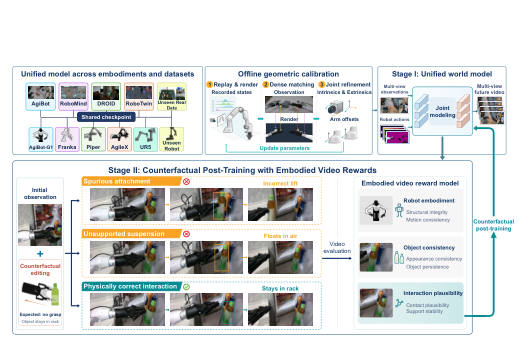
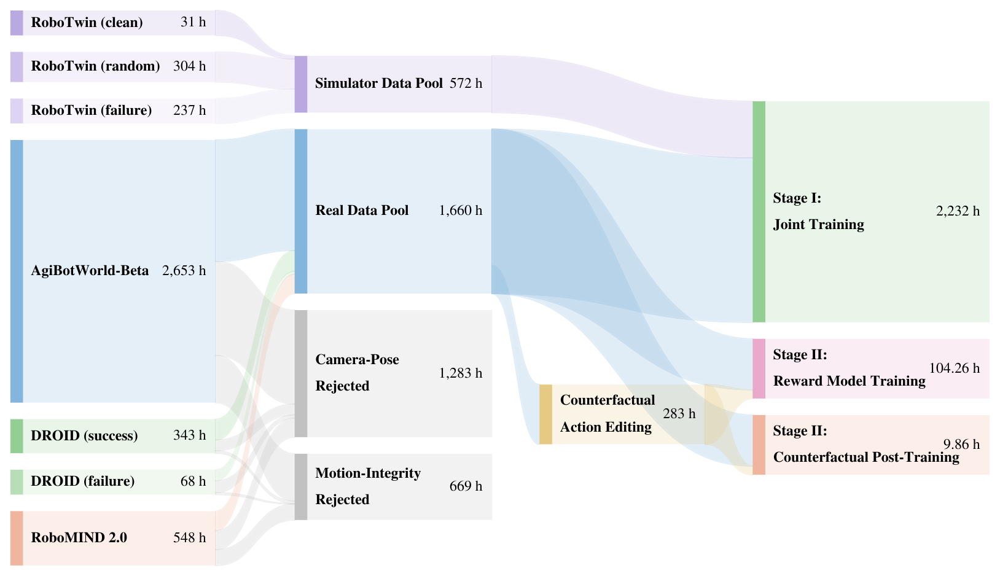
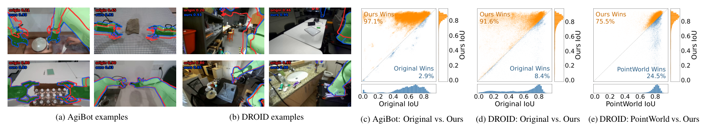
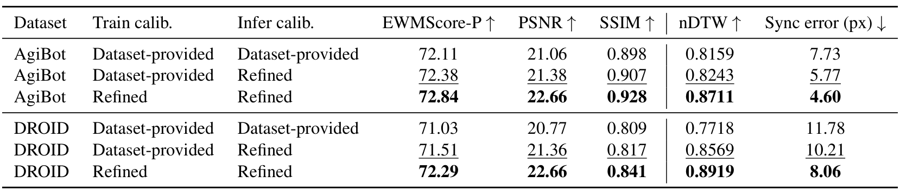
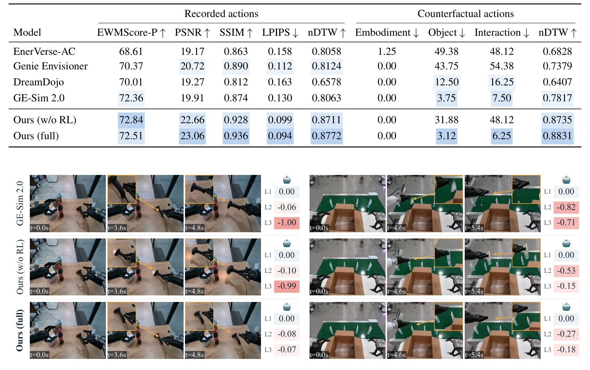
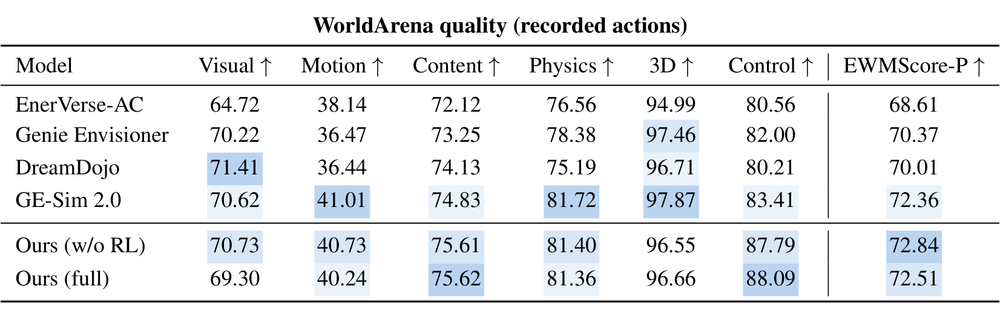

# DreamTrue: Action-Faithful Robot World Model with Counterfactual Post-Training

> arXiv:2610.12468v1（2026-10-09 01:59 北京时间提交）· Junyan Li, Ruizhi Li, Yu Liu, Xiangshuo Liu, Mingchao Sun, Hongyu Pan, Mu Xu, Lue Fan, Zhaoxiang Zhang（中科院自动化所 NLPR / 高德 Amap）· [摘要页](https://arxiv.org/abs/2610.12468) · 项目页 [brave-eai.github.io/DreamTrue](https://brave-eai.github.io/DreamTrue) · 代码 [GitHub](https://github.com/brave-eai/DreamTrue) · 数据与 checkpoints [ModelScope](https://modelscope.cn/datasets/huoxingdawang/DreamTrue)
>
> 一句话：多视角跨本体机器人世界模型——离线几何标定对齐动作条件与视频、反事实动作后训练加具身视频奖励把人评交互缺陷率 48.12%→6.25%；AgiBot 上 nDTW 0.8772 全场最高，AgiBot World Challenge 2026 世界模型赛道第一。

## 研究问题：标定不准与成功偏置

用现有机器人数据训练世界模型有两类障碍。**第一，标定不准**：数据集提供的相机参数有误差，动作渲染条件与目标视频错位——动作跟随直接受损。**第二，成功偏置**：演示几乎全是成功交互，训练出的模型在失败动作下也预测成功样结果——物体在脱抓后「跟着夹爪升起」这类幻觉会高估动作成功率、误导动作选择与策略评测。收集标定准、覆盖失败的新真机数据代价太高；**作者选择改善既有数据的质量并构造反事实**——不采一条新真机轨迹。

*Figure 1：DreamTrue 总览——离线几何标定对齐渲染与录像；Stage I 跨本体动作条件联合建模；Stage II 反事实编辑 + 具身视频奖励引导后训练*

## 机制流程：标定、Stage I、Stage II

**离线几何标定。** 不用专用标定序列：用 URDF + 记录的关节状态按初始相机参数渲染机器人，与录像建立像素对应。三组对应（Figure 2 的三个来源）：机器人渲染↔观测（Palign）、跨帧静态背景（Ptime）、同步视角之间（Pview）——RoMaV2 提取、SAM3（机器人分割数据微调）限定机器人区域。联合优化内参/外参/畸变 + 臂装偏移（式 2）：Palign 上最小化重投影误差，Pview∪Ptime 上加射线共面约束（同一场景点的两条射线与基线共面）。优化后的参数用于渲染动作条件。

**Stage I：图像空间动作表示的监督训练。** 跨本体动作定义各异，同一个动作编码器没法共用——**DreamTrue 把动作转成图像空间条件的统一格式**：按动作轨迹渲染 RGB / 深度图 / amodal mask，夹爪开度线性映射到背景灰度（[0,255]），相机射线编码为 Plücker 图。条件经 VACE 分支注入视频 DiT（渲染 RGB 与深度走预训练视频 VAE、mask 与 Plücker 走 3D 卷积几何编码器，特征拼接成 VACE 上下文、残差注入对应 DiT 层）；多视角沿宽度平铺、动作特征同布局；flow-matching 目标（式 3）。四数据集联训：AgiBotWorld-Beta / DROID / RoboMIND 2.0 / RoboTwin 2.0，过滤后 **2,232 小时、五种臂型**（153,666 保留 episodes、1,660+ 小时，标定结果将开源）。

*Figure 10：训练数据 Sankey——AgiBotWorld-Beta 2,653h 为主，相机位姿拒绝 1,283h、运动完整性拒绝 669h，Stage I 联训 2,232h*

**Stage II：反事实后训练 + 具身视频奖励。** 对记录轨迹的末端位姿加 SE(3) 扰动、从固定初始位姿插值，IK 转成反事实动作序列——同一初始场景下探索不同动作的预测结果（无成对真值未来）。可观测缺陷仍可评：脱抓后物体跟着升、失去支撑后悬空。三缺陷维度（L1 机器人本体：模糊夹爪/运动一致性；L2 物体：外观一致性/物体持续性；L3 交互：接触合理性/支撑稳定性）。用多世界模型在记录与反事实动作下的预测构造**人工标注缺陷数据集**，微调 VLM 奖励模型（$R_k(\hat{x}) = -p^k_\phi(\hat{x})$，二值标注转连续反馈）；组内归一化奖励 + 加权优势 + DiffusionNFT 优化生成器（式 4）；记录动作额外加 PSNR 奖励保真。

## 关键结果：标定、预测、人类评估

**标定质量**（渲染↔SAM3 mask 的 IoU）：AgiBot 130,182 episodes 均值 +0.228、**97.1% episodes 改善**；DROID 63,061 episodes +0.212、91.6% 改善；仅 RGB 输入在 38,356 DROID episodes 上**胜依赖立体深度的 PointWorld 75.5%**。

*Figure 9：几何标定结果——(a,b) SAM3 mask 与 Original/Ours 轮廓叠加；(c-e) IoU 散点：AgiBot 97.1%、DROID 91.6% 胜原标定，DROID 75.5% 胜 PointWorld*

**标定如何转化成预测质量**（Table 4）——这是标定价值的直接量化：

| 数据集 | 训练标定 | 推理标定 | PSNR ↑ | nDTW ↑ | 同步误差(px) ↓ |
|---|---|---|---:|---:|---:|
| AgiBot | 数据集提供 | 数据集提供 | 21.06 | 0.8159 | 7.73 |
| AgiBot | refined | refined | **22.66** | **0.8711** | **4.60** |
| DROID | 数据集提供 | 数据集提供 | 20.77 | 0.7718 | 11.78 |
| DROID | refined | refined | 22.66 | 0.8919 | 8.06 |

*Table 4：标定消融——仅推理时换 refined 已提升全部指标；训练也用再 +1.28/+1.30dB PSNR、同步误差近减半*

**基准评测**（AgiBot，记录+反事实动作；Table 1）：EWMScore-P 72.84（w/o RL）/ 72.51（full）；nDTW 0.8772（refined 标定下 0.8711 为同表口径，best 为 0.8831 counterfactual 块）；反事实块上 Ours full 的 Object 3.12 / Interaction 6.25 缺陷率全场最低。**摘要口径：人类评估交互缺陷率 48.12%→6.25%**。

*Table 1：AgiBot 基准——记录动作下 EWMScore-P/PSNR/SSIM/nDTW 与反事实动作下三缺陷率，Ours 双变体领先或并列最好*

**WorldArena 六维质量**（Table 7，记录动作）：Ours w/o RL EWMScore-P 72.84 全场最高、Control 87.79/88.09 双第一——GE-Sim 2.0 此前 72.36。

*Table 7：WorldArena 质量（记录动作）——六维（Visual/Motion/Content/Physics/3D/Control）+ EWMScore-P，Ours 双变体领先*

**奖励模型本身**：4,893 held-out 片段上三维度 Accuracy 86.33% / Macro-F1 74.21%（L1 96.69 / L2 79.24 / L3 83.08）；三标注者多数票一致性 Fleiss κ=0.7817。

## 权衡与边界

- **保真-合理性权衡**：Ours full 的 EWMScore-P 72.51 **低于** w/o RL 72.84、Visual 69.30 低于 70.73——RL 后训练优化交互合理性会小幅牺牲视觉保真。**我的分析**：这是明确报出来的权衡而非隐藏成本，用记录动作上的 PSNR 奖励部分兜底。
- **反事实覆盖**：SE(3) 扰动末端 + IK 构造——覆盖「同场景不同动作」，不是全动作空间；无成对真值，评估靠可观测缺陷。
- **评估以 AgiBot 为主**（nDTW/人类评估；160 反事实条件 / 54 任务）；DROID/RoboMIND/RoboTwin 用于训练与 held-out 预测。
- **奖励模型有噪声**：L2/L3 Macro-F1 ~74-79 意味约 1/5 错分——反馈噪声进入后训练。

**与 CureWM（10-08 日报）对照**：CureWM 用执行验证的 severity 网格反事实做**已发布** checkpoint 的纯数据侧修复；DreamTrue 从**训练侧**构造反事实动作 + 奖励后训练防成功偏置——同一「世界模型失败不敏感」问题的两条互补路径。

**可复用**：三组对应驱动的离线标定（无需标定板）适用于任何有 URDF+关节状态的数据集；三缺陷维度标注体系 + 44.9K 视频标注语料（30.4K 缺陷标注）是现成的具身视频奖励训练源；组内归一化优势 + DiffusionNFT 后训练配方可移植其他生成式世界模型。

**待解**：缺陷率降到多少才足以支撑可靠的策略预执行评估（论文未给阈值）；标定管线对腕装相机强视角变化的稳定性；奖励模型噪声的长期漂移。

开源：代码三组件（calibration/wmvideo/reward）与数据 & checkpoints 在 [ModelScope](https://modelscope.cn/datasets/huoxingdawang/DreamTrue)（GitHub 2026-10-09 建仓，本日核查 4★；README 标注 full data 未来更新放出）。
