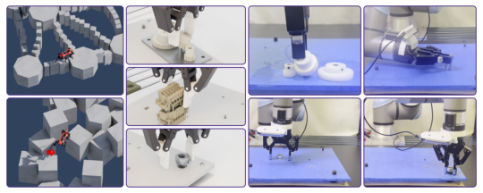
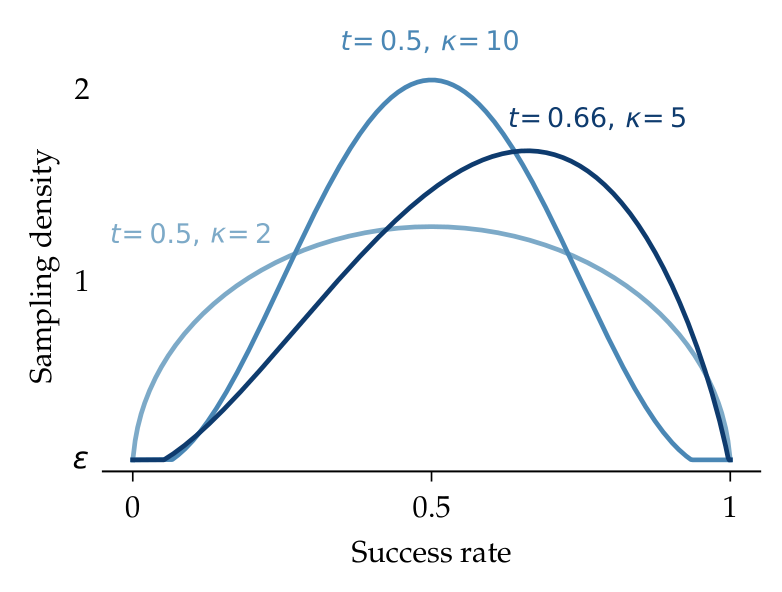
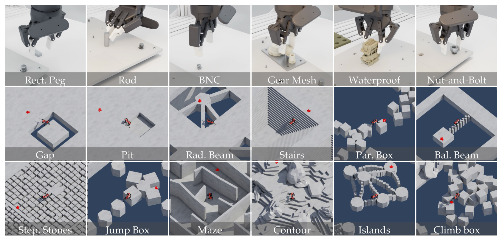
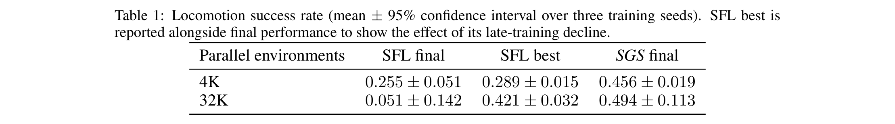
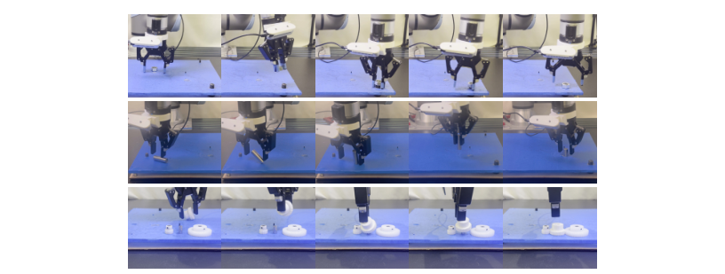
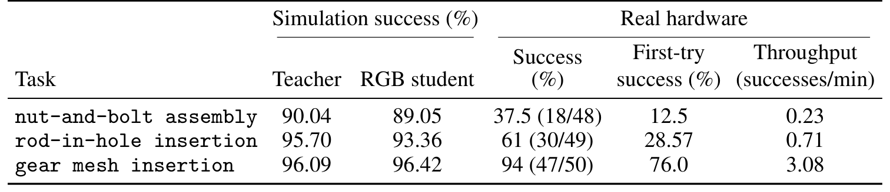
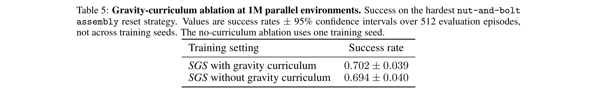

# A Balanced Data Diet: Addressing the Exploration Bottleneck in Mega-Scale RL for Robot Control

> arXiv:2610.12465v1（2026-10-09 01:59 北京时间提交）· Octi Zhang, Mateo Guaman Castro, Patrick Yin, Ignacio Dagnino, Abhishek Gupta, Rosario Scalise, Byron Boots（UW / NVIDIA）· CoRL 2026 · [摘要页](https://arxiv.org/abs/2610.12465) · 项目页 [sgs-rl.github.io](https://sgs-rl.github.io/)（Code coming soon）
>
> 一句话：均匀采样在超大规模并行 RL 里把越来越多环境浪费在「已掌握/还做不了」两端——Success Guided Sampling 用在线成功率加 Beta 核把采样密度集中在能力前沿，$2^{20}$（超百万）并行环境下运动 73% vs PLR 54%、Franka 螺母螺栓装配 70% vs 6%/5%，且蒸馏到 RGB 策略零样本上真机（齿轮啮合 94%）。

## 研究问题：均匀采样在超大规模下浪费在哪

近期工作显示多样化 simulator reset + 大规模并行仿真能去掉传统 RL 管线里大量工程先验（shaped reward、演示）。但**作者发现**把该范式推到更精确/更动态的任务上并不平凡：reset 多样性能帮探索，可**均匀**采样在这个分布上会把越来越大的经验份额浪费在两类配置上——策略已经掌握的、策略还根本做不了的。规模越大，一个 batch 里被浪费的学习信号越多，「加环境数」的边际收益递减甚至消失。

*Figure 1：SGS 让大规模 RL 学会挑战性行为——仿真里的多地形四足运动与 UR5e/Franka 接触富装配（六任务板 + 13 地形）*

形式化：goal-conditioned MDP 里每个任务配置 $\tau = (s_0, g, e)$（初始状态、目标、环境配置）；操作配置覆盖装配任务/初始物体状态/容器位姿（Reaching / Stable Grasp / Near-Goal 三类 reset，沿用 OmniReset），运动配置覆盖地形/起始位姿/目标位姿。

## 机制流程：Beta 核采样器与两个决策

**SGS 核心洞察**：学复杂控制需要在正确的时间暴露正确的经验，而**成功率是廉价的在线信号**，指示现在该练哪些配置。

采样器三步：

1. 训练前从任务分布固定采 $N$ 个配置（操作 $N$=32,768、运动 $N$=104,000）；每个配置维护最近 $H$=100 次布尔结果的均值 $p_i$。
2. Beta 核（mode-浓度形式）给每个配置打分：$w_i = (p_i+\epsilon)^{\kappa t}(1-p_i+\epsilon)^{\kappa(1-t)}$，$\ell_i = \log(w_i+\epsilon)$——目标成功率（mode）$t$ 与浓度 $\kappa$ 控制「优先覆盖 vs 采样贪心」；$\epsilon>0$ 防奇点且**保证每个配置采样概率非零**（做不了的配置也能更新估计）。
3. episode 结束时从 $\{\ell_i\}$ 的 softmax（温度 $T$=2）i.i.d. 采下一个配置。

*Figure 2：Beta 形采样分布——t=0.5/κ=2、t=0.5/κ=10、t=0.66/κ=5 三种参数化的密度曲线，不同取值在覆盖与贪心之间权衡*

**我的分析**：与 PLR 的 learnability score（绝对 GAE + staleness）相比，SGS 完全不需要 value 估计——只用在 roll 里免费拿到的成功/失败布尔值，这对「无 shaped reward、无演示」的极简管线是配套的极简调度器。超参两套取值：运动 $t$=0.66/κ=5/ε=10⁻⁸、操作 $t$=0.5/κ=1/ε=10⁻⁴；作者声明对多数超参不敏感。

两个配套决策：**域内共享奖励**——一个简单奖励函数覆盖全部运动任务、另一个覆盖全部装配任务（布尔任务成功 + 小额逐步正则，式 3），避免给每种地形/装配设计一个 reward；**扩并行环境数**——SGS 把额外环境转化为更密的学习信号而非递减回报，与优化器侧修 PPO 饱和的工作（[38][40]）互补。

*Figure 3：六 NIST 装配任务板（ATB1）与 12 个挑战地形——单一策略从零学全部地形（不做每地形专家再蒸馏）*

## 关键结果：规模曲线与小规模解锁

**Q1 规模**（三种子均值、95% CI；评测 reset 从训练分布新采）：$2^{20}$=1M 并行环境上运动 73% vs PLR 54%；Franka 螺母螺栓 70% vs uniform 6% / PLR 5%——**单调随规模提升**，基线饱和或崩溃。简单任务 UR5e rod-in-hole 上 32K 时 SGS 成功而基线零、256K 时全方法 ~98%——**我的分析**：SGS 的价值随任务变易而消失，它是「难任务 + 大规模」的调节器。

**Q2 小规模解锁**：仅 4,096 环境时运动多地形已非零成功（基线在该规模完全不学）；对 SFL（Sampling for Learnability）4K 0.456 vs SFL best 0.289、32K 0.494 vs 0.421——并暴露 SFL 的后期衰退（best 与 final 的差距），SGS 用持续重访全配置保估计新鲜。

| 并行环境 | SFL final | SFL best | SGS final |
|---|---|---|---|
| 4K | 0.255 ± 0.051 | 0.289 ± 0.015 | **0.456 ± 0.019** |
| 32K | 0.051 ± 0.142 | 0.421 ± 0.032 | **0.494 ± 0.113** |

*Table 1：运动成功率——4K/32K 两档上 SGS 全面超过 SFL best，SFL 有后期衰退*

采样动态（Figure 7 的文字描述）：早期近似均匀；中期集中在「学习跳到等高小岛」的配置；后期集中到含中央柱顶（显著高差）的配置——采样质量随能力前沿移动，这是「成功率即课程」的直接可视化。

**Q3 真机零样本**：状态教师经 DAgger 蒸馏成 RGB 策略（两小时级：4×L40S、480 环境、约两天），零样本上 UR5e 硬件——**论文证据**（Table 2）：

| 任务 | 仿真教师 | 仿真 RGB 学生 | 真机成功率 | 首试成功 | 吞吐（成功/分） |
|---|---:|---:|---:|---:|---:|
| 螺母螺栓装配 | 90.04% | 89.05% | 37.5%（18/48） | 12.5% | 0.23 |
| rod-in-hole 插入 | 95.70% | 93.36% | 61%（30/49） | 28.57% | 0.71 |
| 齿轮啮合插入 | 96.09% | 96.42% | **94%（47/50）** | 76.0% | 3.08 |

*Figure 4：零样本 RGB sim-to-real——螺母螺栓/rod-in-hole/齿轮啮合三任务的成功装配轨迹（含翻转螺母、把齿轮抵着轴推的非抓取操作）*

*Table 2：仿真与零样本硬件性能——教师/RGB 学生几乎不掉点，真机 37.5/61/94%*

**我的分析**：三任务间的 sim-to-real 差距天差地别（37.5% vs 94%）——**尚不能确定**差距来源（公差？感知？接触动力学？），论文只报告未归因；蒸馏本身几乎无损失（90.04→89.05 等）说明差距全在 sim-to-real 一侧。

## 消融与限制

**重力课程消融**：主装配实验带了重力课程，事后消融（Table 5）在 1M 环境、最难 reset 策略上 0.702±0.039 vs 无课程 0.694±0.040——**几乎无差别，课程非必需**。作者诚实标注了主实验的这个冗余设计。

*Table 5：重力课程消融——1M 并行环境最难配置 0.702 vs 0.694（±95% CI over 512 评测 episodes），课程可省*

**作者自述三条限制**：(1) 离散配置集——K=32,768 此处够用，连续或大得多的工作空间需要学习式/分层评分表示；(2) 只采样不构造分布——覆盖依赖 OmniReset 等重置多样性方法，闭环「决定让哪些配置可用」是 open problem；(3) sim-to-real 差距仍在，对齐仿真成功率留给未来。

**训练成本**（复现视角）：运动 5K PPO 迭代约 36 小时；装配 7.5K 迭代约 128 小时；L40S/H200；每 GPU 32,768（运动）/16,384（装配）环境，mini-batch 数固定、batch 随环境数放大。

**可复用**：Beta(mode t, κ) 打分 + softmax 温度采样是几十行代码的即插即用 reset 调度器，PPO 循环只在 reset 处改一行；「并行环境数当采样密度预算」的解释可直接用来论证加 GPU 的边际收益；两套 (t, κ) 取值可作起点。

**待解**：连续工作空间的学习式评分；与优化器侧 PPO 饱和修复（[38][40]）叠加是否还有乘性收益；真机首试成功率（12.5%）能否用接触力课程提升。
