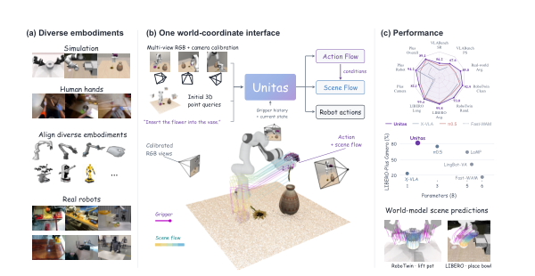
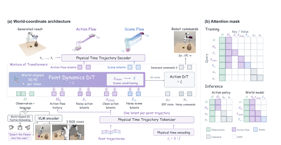
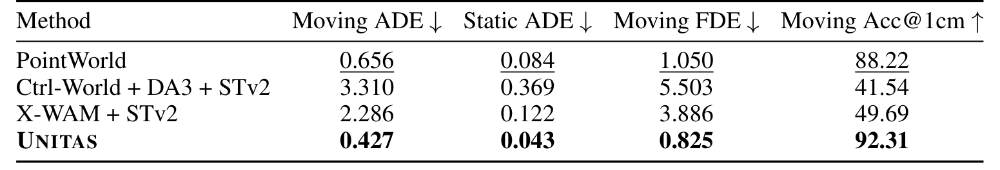
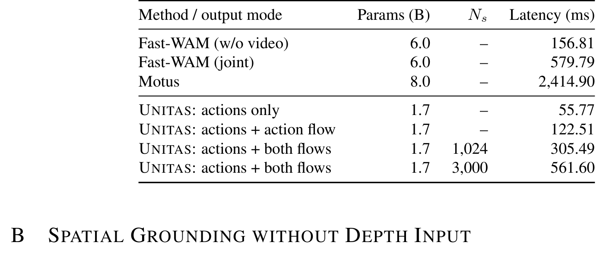
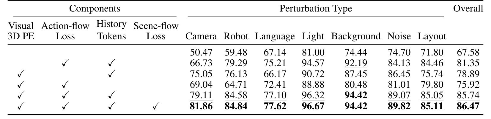
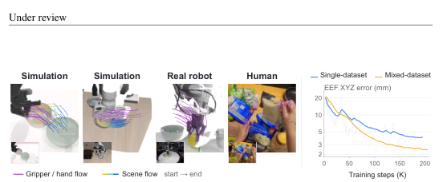

# UNITAS: A 3D-Native World Action Model for Embodied Manipulation

> arXiv:2610.12099v1（2026-10-09 01:59 北京时间提交，补充窗口 10-08 23:02 起可观测）· Ruixiang Wang, Yongyi Su, Wenlve Zhou 等（DexForce 线）· [摘要页](https://arxiv.org/abs/2610.12099) · 代码 [GitHub](https://github.com/DexForce/UNITAS)
>
> 一句话：据作者所知首个 3D-native 世界动作模型——观测、动作、场景动力学统一进一个共享度量 3D 坐标系（point flow 表示），1.7B 参数拿到 LIBERO 99.8%、RoboTwin 2.0 92.94%、LIBERO-Plus 89.1%，场景预测位移误差比 PointWorld 低至 49%，真机两任务 90%/80%。

## 研究问题：为什么 WAM 要 3D-native

WAM 回答一个耦合的物理问题：给定指令，机器人该执行什么运动、这个运动将如何改变世界？现有 WAM 大多建立在预训练视频生成器上，用图像或视觉潜变量表示世界演化。**作者的诊断**：机器人交互发生在度量三维空间，而图像是视角相关的投影——像素距离不直接编码物理距离。

*Figure 1：UNITAS 三面板——(a) 多样本体对齐 (b) 一个世界坐标接口：多视角 RGB→3D 点查询→action flow/scene flow→机器人动作 (c) 性能雷达与参数对比*

UNITAS 的回答：在每次交互内把观测、动作、场景动力学统一到**一个固定的度量世界系** $F_W$，用同一套表示横跨机器人本体与人类手。

## 机制流程：世界对齐观测与点流

**世界对齐观测。** 每个视觉单元（visual token）收到一个世界系位置编码：有深度时按式 (4) 反投影像素到世界坐标，固定 Fourier 映射 $\psi$ 编码后经 Enc3D 投影加进视觉特征（式 5）。**无深度时的替代**（这是工程上最有意思的一段）：对每个 patch 沿相机射线取 M=64 个均匀深度（0.1–2.0m），用 patch 特征对候选位置打分做注意力路由（式 6），并在可靠深度区域用 Fourier 特征匹配监督路由权重（LPE，式 7）——因此能 RGB 与 RGB-D 联合预训练、推理时深度可缺。

**物理时间点流表示。** 动作流与场景流都表示为世界系中的位移轨迹：对查询点 $x_{t,n}$，目标是 $\{\Delta x_{n,k}\}_{k=1}^{H}$（$\Delta x_{n,k} = x_{t+\tau_k,n} - x_{t,n}$），点身份全程保留。机器人每臂从 URDF 定义的夹爪几何采 20 点（正运动学映射到世界系、保持对应），人类演示用每只手 21 个 MANO 关键点；场景点按 PointWorld 方式 mask 机器人像素后从 RGB-D 反投影采样。**物理时间轨迹 tokenizer**：时间用秒而非帧索引（$\tau_k = k/f$），固定基底 $\phi_{\text{time}}$（$T_{\max}=3$s 跨数据集共享）经 FiLM 调制编码——每条轨迹池化成**一个**潜码 = 一个序列元素，无论轨迹多长、采样密度多少（式 8）。**我的分析**：这个「每条轨迹一个元素 + 秒制时间」设计是跨采样率、跨数据集混合训练能成立的关键——不同数据集的轨迹在表示层天然对齐。

**耦合双专家。** Mixture-of-Transformers：point dynamics expert（动作流+场景流）+ action expert（EEF 动作 chunk）。注意力结构经过精心隔离：场景流注意上下文与**干净**动作流 $A^{\text{clean}}$ 但不去看噪声动作流——场景预测条件于动作流而不卷入其去噪；动作 chunk 只注意观测 KV 与自身——**policy-only 推理可以整个跳过两个流分支**。训练用 rectified flow（式 9，$\lambda_A=\lambda_s=\lambda_{\text{ctrl}}=1$、$\lambda_{\text{PE}}=0.1$），场景预测在训练时条件于演示的干净动作流潜码。

*Figure 2：UNITAS 架构与注意力掩码——左：point dynamics expert 建模双流、action expert 生成 EEF chunk；右：彩色/白色格 = 允许/阻断注意力，policy-only 推理省略双流*

**推理**：动作流与动作 chunk 在一个 Euler 调度上并行去噪；生成的动作流（或仿真器模式下的外部轨迹）条件场景去噪，上下文与干净动作流 KV 跨步复用。

## 关键结果：基准、真机、延迟

**论文证据**（两档训练设定：混合预训练后微调 / 直接微调）：

| 基准 | UNITAS（1.7B） | w/o Pretrain | 代表基线 |
|---|---|---|---|
| LIBERO 平均 | **99.8%** | 99.5% | π0.5 96.9%、Fast-WAM 6B 97.6% |
| LIBERO-Plus 总体 | **89.1%** | 86.5% | π0.5 82.7% |
| RoboTwin 2.0 Clean/Random | **92.94 / 93.04%** | 91.08/90.74% | Fast-WAM 91.88/91.78% |
| VLABench SR | **56.2%** | 50.3% | π0.5 48.1% |

相机扰动 82.1%（Cosmos Policy 75.8%、LaMP 64.5%）——世界系接地的视角鲁棒性直接兑现。

**场景预测**（RoboTwin，动作条件）：Moving ADE 0.427 / Static ADE 0.043 / Moving FDE 0.825 / Acc@1cm 92.31——全场最低误差，PointWorld（此前该线最强）对应 0.656 / 0.084 / 1.050 / 88.22。

*Table 4：动作条件场景预测——UNITAS 四项指标全面低于 PointWorld / Ctrl-World / X-WAM*

**真机**（每法每任务 20 次）：Organize Books 18/20（90%）、Pack the Ball 16/20（80%）——π0.5 75/55%、Fast-WAM 65/60%。

**延迟**（RTX 5090）：actions only 55.77ms；+action flow 122.51ms；+双流（$N_s$=1024）305.49ms——三档推理模式对应不同延迟预算。

*Table 8：推理效率——1.7B 的三档输出模式 55.77/122.51/305.49ms，对照 Fast-WAM 156.81-579.79ms 与 Motus 2,414.90ms*

## 消融：四个组件各自证明了什么

LIBERO-Plus 上（无混合预训练）逐个加回组件：

*Table 3：四组件消融——从基线 67.58 逐加 action-flow loss/history tokens/3D PE 到 85.74，全四组件 86.47*

- **3D PE 是最大单项**：去掉后总体从 86.47 掉到 67.58（−18.9 点）——世界系接地不是装饰而是承重墙。
- **action-flow loss + history**：从基线 67.58 到 81.35（+13.8）。
- **scene-flow loss**：85.74 → 86.47（+0.7）——**我的分析**：这是四组件里贡献最小的一支；场景流分支的价值更多在预测/评测侧（Table 4 的场景预测质量），对策略成功率净贡献小，读的时候不要被「双流」叙事带跑。
- **混合预训练**：+2.6 总体；最大收益在 robot 初始状态扰动（84.8→94.2）与语言扰动（77.6→85.0）。Figure 3 右图显示加其他数据源后 RoboTwin EEF 误差低于单数据集——正跨数据集迁移。

*Figure 3：跨数据源共享点流表示——仿真/真机/人类的 gripper/hand 流与场景流；混合数据集训练的 EEF 误差低于单数据集*

## 边界与不能下的结论

- **两种训练设定都绑定目标基准**微调；「跨本体」是数据混合（URDF 20 点 + MANO 21 点共用接口），**不是**新本体零样本适配——后者未测试。
- **场景预测推理需要当前 3D 查询点**（来自深度或提供的几何）；无深度位置编码是注意力路由近似，附录 B 专项评测了去深度后的行为。
- **scene-flow 监督只用有效轨迹**（仿真状态提供真值对应）——真实数据上的场景流监督受限。
- VLABench 56.2% 离可用上限仍远；LIBERO-Plus 七扰动中语言扰动 85.0% 相对最弱。

**可复用**：秒制物理时间 tokenizer 是任何轨迹数据混合训练的即插即用组件；无深度 3D PE 路由（式 6–7）让 RGB/RGB-D 联训与深度可缺推理成立；56/123/305ms 三档推理模式按延迟预算选档。

**待解**：场景流分支对策略成功率的净贡献需要单独消融策略训练（本实验只到 86.47 vs 85.74）；全新本体 URDF 换装即用？异步多频率传感器（触觉/事件相机）进物理时间 tokenizer 的扩展。

标注为 Under review（27 页 / 11 图 / 13 表）；代码已放 [GitHub](https://github.com/DexForce/UNITAS)（2026-10-08 建仓，本日核查 0★）。
